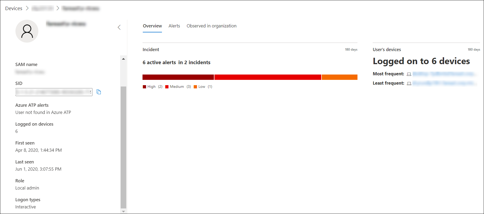

# Investigar una cuenta de usuario en Microsoft Defender para endpointInvestigate a user account in Microsoft Defender for Endpoint

[!INCLUDE [Microsoft 365 Defender rebranding](../../includes/microsoft-defender.md)]

**Se aplica a:****Applies to:**
- [Microsoft Defender para punto de conexiónMicrosoft Defender for Endpoint](https://go.microsoft.com/fwlink/p/?linkid=2154037)
- [Microsoft 365 DefenderMicrosoft 365 Defender](https://go.microsoft.com/fwlink/?linkid=2118804)

>¿Desea experimentar Defender for Endpoint?Want to experience Defender for Endpoint? [Regístrate para obtener una versión de prueba gratuita.Sign up for a free trial.](https://www.microsoft.com/microsoft-365/windows/microsoft-defender-atp?ocid=docs-wdatp-investigatgeuser-abovefoldlink)

## Investigar entidades de cuenta de usuarioInvestigate user account entities

Identifique las cuentas de usuario con las alertas más activas (mostradas en el panel como "Usuarios en riesgo") e investigue casos de credenciales potencialmente comprometidas, o pivote en la cuenta de usuario asociada al investigar una alerta o dispositivo para identificar posibles movimientos laterales entre dispositivos con esa cuenta de usuario.Identify user accounts with the most active alerts (displayed on dashboard as "Users at risk") and investigate cases of potential compromised credentials, or pivot on the associated user account when investigating an alert or device to identify possible lateral movement between devices with that user account.

Puede encontrar información de cuenta de usuario en las siguientes vistas:You can find user account information in the following views:

- PanelDashboard
- Cola de alertasAlert queue
- Página de detalles del dispositivoDevice details page

En estas vistas hay disponible un vínculo de cuenta de usuario en el que se puede hacer clic, que le llevará a la página de detalles de la cuenta de usuario donde se muestran más detalles sobre la cuenta de usuario.A clickable user account link is available in these views, that will take you to the user account details page where more details about the user account are shown.

Cuando investigue una entidad de cuenta de usuario, verá:When you investigate a user account entity, you'll see:

- Detalles de la cuenta de usuario, alertas de Microsoft Defender para identidad y dispositivos, rol, tipo de inicio de sesión y otros detallesUser account details, Microsoft Defender for Identity alerts, and logged on devices, role, logon type, and other details
- Información general sobre los incidentes y los dispositivos del usuarioOverview of the incidents and user's devices
- Alertas relacionadas con este usuarioAlerts related to this user
- Observado en la organización (dispositivos que iniciaron sesión en)Observed in organization (devices logged on to)

### Detalles del usuarioUser details

El  panel De detalles del usuario a la izquierda proporciona información sobre el usuario, como incidentes abiertos relacionados, alertas activas, nombre SAM, SID, Alertas de Identidad de Microsoft Defender, número de dispositivos en los que el usuario ha iniciado sesión, cuándo se ha visto por primera vez y por última vez, tipos de rol e inicio de sesión.The **User details** pane on left provides information about the user, such as related open incidents, active alerts, SAM name, SID, Microsoft Defender for Identity alerts, number of devices the user is logged on to, when the user was first and last seen, role, and logon types. Dependiendo de las características de integración que haya habilitado, verá otros detalles.Depending on the integration features you've enabled, you'll see other details. Por ejemplo, si habilita la Skype para la integración empresarial, podrá ponerse en contacto con el usuario desde el portal.For example, if you enable the Skype for business integration, you'll be able to contact the user from the portal. La sección Alertas **de ATP** de Azure contiene un vínculo que te llevará a la página de Microsoft Defender para identidad, si has habilitado la característica Microsoft Defender para identidad y hay alertas relacionadas con el usuario.The **Azure ATP alerts** section contains a link that will take you to the Microsoft Defender for Identity page, if you have enabled the Microsoft Defender for Identity feature, and there are alerts related to the user. La página microsoft defender para la identidad proporcionará más información sobre las alertas.The Microsoft Defender for Identity page will provide more information about the alerts.

>[!NOTE]
>Tendrás que habilitar la integración en Microsoft Defender para Identidad y Defender para endpoint para usar esta característica.You'll need to enable the integration on both Microsoft Defender for Identity and Defender for Endpoint to use this feature. En Defender para endpoint, puedes habilitar esta característica en características avanzadas.In Defender for Endpoint, you can enable this feature in advanced features. Para obtener más información sobre cómo habilitar características avanzadas, vea [Activar características avanzadas.](advanced-features.md)For more information on how to enable advanced features, see [Turn on advanced features](advanced-features.md).

Overview, Alerts y Observed in organization son pestañas diferentes que muestran varios atributos sobre la cuenta de usuario.The Overview, Alerts, and Observed in organization are different tabs that display various attributes about the user account.

### Información generalOverview

La **pestaña** Información general muestra los detalles de incidentes y una lista de los dispositivos en los que el usuario ha iniciado sesión.The **Overview** tab shows the incidents details and a list of the devices that the user has logged on to. Puedes expandir estos para ver detalles de los eventos de inicio de sesión para cada dispositivo.You can expand these to see details of the log-on events for each device.

### AlertasAlerts

La **pestaña** Alertas proporciona una lista de alertas asociadas con la cuenta de usuario.The **Alerts** tab provides a list of alerts that are associated with the user account. Esta lista es una vista filtrada de la cola de alertas y muestra alertas en las que el contexto del usuario es la cuenta de usuario seleccionada, la fecha en que se detectó la última actividad, una breve descripción de la alerta, el dispositivo asociado a la alerta, la gravedad de la alerta, el estado de la alerta en la cola y quién tiene asignada la alerta.This list is a filtered view of the [Alert queue](alerts-queue.md), and shows alerts where the user context is the selected user account, the date when the last activity was detected, a short description of the alert, the device associated with the alert, the alert's severity, the alert's status in the queue, and who is assigned the alert.

### Observado en la organizaciónObserved in organization

La pestaña **Observed in organization** te permite especificar un intervalo de fechas para ver una lista de dispositivos en los que se observó que este usuario inició sesión, la cuenta de usuario más frecuente y menos frecuente para cada uno de estos dispositivos y el total de usuarios observados en cada dispositivo.The **Observed in organization** tab allows you to specify a date range to see a list of devices where this user was observed logged on to, the most frequent and least frequent logged on user account for each of these devices, and total observed users on each device.

Al seleccionar un elemento en la tabla Observado en la organización, se expandirá el elemento, lo que revelará más detalles sobre el dispositivo.Selecting an item on the Observed in organization table will expand the item, revealing more details about the device. Si selecciona directamente un vínculo dentro de un elemento, se le enviará a la página correspondiente.Directly selecting a link within an item will send you to the corresponding page.

## Buscar cuentas de usuario específicasSearch for specific user accounts

1. Seleccione **Usuario** en el **menú** desplegable Barra de búsqueda.Select **User** from the **Search bar** drop-down menu.
2. Escriba la cuenta de usuario en el **campo** Búsqueda.Enter the user account in the **Search** field.
3. Haga clic en el icono de búsqueda o presione **Entrar**.Click the search icon or press **Enter**.

Se muestra una lista de usuarios que coinciden con el texto de la consulta.A list of users matching the query text is displayed. Verás el dominio y el nombre de la cuenta de usuario, cuando se vio por última vez la cuenta de usuario y el número total de dispositivos en los que se observó que inició sesión en los últimos 30 días.You'll see the user account's domain and name, when the user account was last seen, and the total number of devices it was observed logged on to in the last 30 days.

Puede filtrar los resultados por los siguientes períodos de tiempo:You can filter the results by the following time periods:

- 1 día1 day
- 3 días3 days
- 7 días7 days
- 30 días30 days
- 6 meses6 months

## Temas relacionadosRelated topics

- [Ver y organizar la cola de Alertas de punto de conexión de Microsoft DefenderView and organize the Microsoft Defender for Endpoint Alerts queue](alerts-queue.md)
- [Administrar alertas de Microsoft Defender para puntos de conexiónManage Microsoft Defender for Endpoint alerts](manage-alerts.md)
- [Investigar alertas de punto de conexión de Microsoft DefenderInvestigate Microsoft Defender for Endpoint alerts](investigate-alerts.md)
- [Investigar un archivo asociado a una alerta de Defender for EndpointInvestigate a file associated with a Defender for Endpoint alert](investigate-files.md)
- [Investigar dispositivos en la lista Defender para dispositivos de punto de conexiónInvestigate devices in the Defender for Endpoint Devices list](investigate-machines.md)
- [Investigar una dirección IP asociada a una alerta de Defender for EndpointInvestigate an IP address associated with a Defender for Endpoint alert](investigate-ip.md)
- [Investigar un dominio asociado a una alerta de Defender for EndpointInvestigate a domain associated with a Defender for Endpoint alert](investigate-domain.md)
