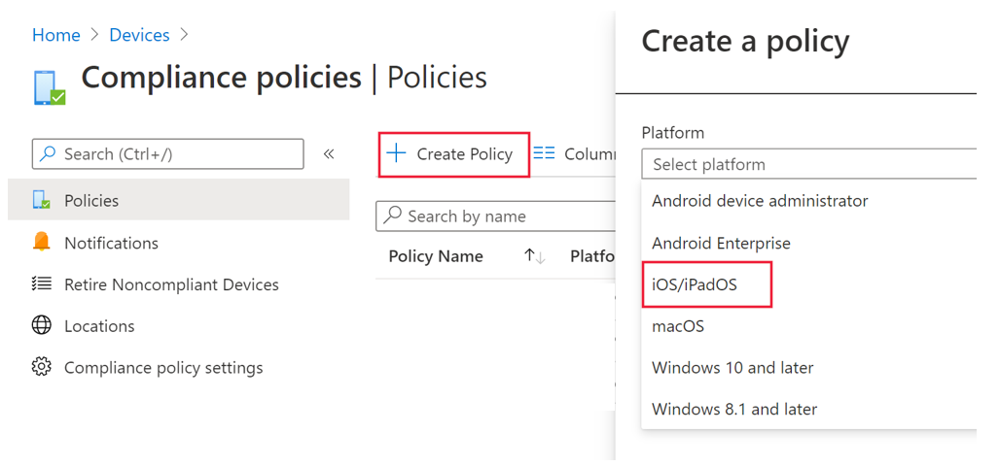
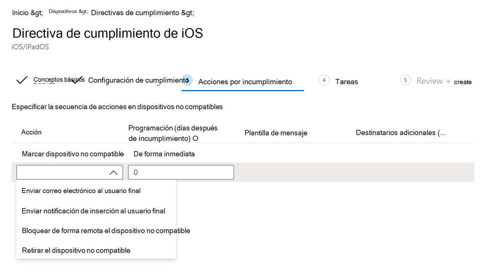

# Configurar Microsoft Defender para endpoint para características de iOSConfigure Microsoft Defender for Endpoint for iOS features

[!INCLUDE [Microsoft 365 Defender rebranding](../../includes/microsoft-defender.md)]

**Se aplica a:****Applies to:**
- [Microsoft Defender para punto de conexiónMicrosoft Defender for Endpoint](https://go.microsoft.com/fwlink/p/?linkid=2154037)
- [Microsoft 365 DefenderMicrosoft 365 Defender](https://go.microsoft.com/fwlink/?linkid=2118804)

> ¿Desea experimentar Defender for Endpoint?Want to experience Defender for Endpoint? [Regístrate para obtener una versión de prueba gratuita.Sign up for a free trial.](https://www.microsoft.com/microsoft-365/windows/microsoft-defender-atp?ocid=docs-wdatp-exposedapis-abovefoldlink) 

> [!NOTE]
> Defender para endpoint para iOS usaría una VPN para proporcionar la característica de protección web.Defender for Endpoint for iOS would use a VPN in order to provide the Web Protection feature. No se trata de una VPN normal y es una VPN local o auto-looping que no toma tráfico fuera del dispositivo.This is not a regular VPN and is a local/self-looping VPN that does not take traffic outside the device.

## Acceso condicional con Defender para endpoint para iOSConditional Access with Defender for Endpoint for iOS  
Microsoft Defender para endpoint para iOS junto con Microsoft Intune y Azure Active Directory permite aplicar el cumplimiento de dispositivos y las directivas de acceso condicional en función de los niveles de riesgo del dispositivo.Microsoft Defender for Endpoint for iOS along with Microsoft Intune and Azure Active Directory enables enforcing Device compliance and Conditional Access policies based on device risk levels. Defender for Endpoint es una solución de Mobile Threat Defense (MTD) que puedes implementar para aprovechar esta funcionalidad a través de Intune.Defender for Endpoint is a Mobile Threat Defense (MTD) solution that you can deploy to leverage this capability via Intune.

Para obtener más información acerca de cómo configurar el acceso condicional con Defender para endpoint para iOS, consulte [Defender for Endpoint e Intune](https://docs.microsoft.com/mem/intune/protect/advanced-threat-protection).For more information about how to set up Conditional Access with Defender for Endpoint for iOS, see [Defender for Endpoint and Intune](https://docs.microsoft.com/mem/intune/protect/advanced-threat-protection).

## Protección web y VPNWeb Protection and VPN

De forma predeterminada, Defender para endpoint para iOS incluye y habilita la característica de protección web.By default, Defender for Endpoint for iOS includes and enables the web protection feature. [La protección web](web-protection-overview.md) ayuda a proteger los dispositivos contra amenazas web y a proteger a los usuarios de ataques de phishing.[Web protection](web-protection-overview.md) helps to secure devices against web threats and protect users from phishing attacks. Defender for Endpoint para iOS usa una VPN para proporcionar esta protección.Defender for Endpoint for iOS uses a VPN in order to provide this protection. Tenga en cuenta que se trata de una VPN local y, a diferencia de la VPN tradicional, el tráfico de red no se envía fuera del dispositivo.Please note this is a local VPN and unlike traditional VPN, network traffic is not sent outside the device.

Aunque está habilitado de forma predeterminada, puede haber algunos casos que requieran deshabilitar VPN.While enabled by default, there might be some cases that require you to disable VPN. Por ejemplo, quieres ejecutar algunas aplicaciones que no funcionan cuando se configura una VPN.For example, you want to run some apps that do not work when a VPN is configured. En tales casos, puedes optar por deshabilitar VPN desde la aplicación en el dispositivo siguiendo los pasos siguientes:In such cases, you can choose to disable VPN from the app on the device by following the steps below:

1. En el dispositivo iOS, abre la aplicación **Configuración,** haz clic o pulsa **General** y, a continuación, **VPN.**On your iOS device, open the **Settings** app, click or tap **General** and then **VPN**.
1. Haz clic o pulsa en el botón "i" de ATP de Microsoft Defender.Click or tap the "i" button for Microsoft Defender ATP.
1. Desactiva **Conectar a petición para** deshabilitar VPN.Toggle off **Connect On Demand** to disable VPN.

    > [!div class="mx-imgBorder"]
    > 

> [!NOTE]
> La protección web no estará disponible cuando la VPN esté deshabilitada.Web Protection will not be available when VPN is disabled. Para volver a habilitar Protección web, abra la aplicación Microsoft Defender para endpoint en el dispositivo y haga clic o pulse **Iniciar VPN**.To re-enable Web Protection, open the Microsoft Defender for Endpoint app on the device and click or tap **Start VPN**.

## Coexistencia de varios perfiles vpnCo-existence of multiple VPN profiles

Apple iOS no admite varias VPN de todo el dispositivo para estar activas simultáneamente.Apple iOS does not support multiple device-wide VPNs to be active simultaneously. Aunque pueden existir varios perfiles de VPN en el dispositivo, solo una VPN puede estar activa a la vez.While multiple VPN profiles can exist on the device, only one VPN can be active at a time.

## Configurar la directiva de cumplimiento en dispositivos con jailbreakConfigure compliance policy against jailbroken devices

Para proteger los datos corporativos de acceso en dispositivos iOS con jailbreak, le recomendamos que configure la siguiente directiva de cumplimiento en Intune.To protect corporate data from being accessed on jailbroken iOS devices, we recommend that you set up the following compliance policy on Intune.

> [!NOTE]
> En este momento, Microsoft Defender para Endpoint para iOS no proporciona protección contra escenarios de jailbreak.At this time Microsoft Defender for Endpoint for iOS does not provide protection against jailbreak scenarios. Si se usa en un dispositivo con jailbreak, en escenarios específicos, los datos que usa la aplicación como el identificador de correo electrónico corporativo y la imagen de perfil corporativo (si está disponible) se pueden exponer localmenteIf used on a jailbroken device, then in specific scenarios data that is used by the application like your corporate email id and corporate profile picture (if available) can be exposed locally

Siga los pasos siguientes para crear una directiva de cumplimiento contra dispositivos con jailbreak.Follow the steps below to create a compliance policy against jailbroken devices.

1. En [el Centro de administración de Microsoft Endpoint Manager,](https://go.microsoft.com/fwlink/?linkid=2109431)vaya a Directivas **de** cumplimiento  ->  **de dispositivos** Crear  ->  **directiva**.In [Microsoft Endpoint Manager admin center](https://go.microsoft.com/fwlink/?linkid=2109431), go to **Devices** -> **Compliance policies** -> **Create Policy**. Seleccione "iOS/iPadOS" como plataforma y haga clic **en Crear**.Select "iOS/iPadOS" as platform and click **Create**.

    > [!div class="mx-imgBorder"]
    > 

2. Especifique un nombre de la directiva, por ejemplo, "Compliance Policy for Jailbreak".Specify a name of the policy, for example "Compliance Policy for Jailbreak".
3. En la página Configuración de cumplimiento, haga clic para expandir **la sección Estado del** dispositivo y haga clic en **Bloquear** para el **campo Dispositivos con jailbreak.**In the compliance settings page, click to expand **Device Health** section and click **Block** for **Jailbroken devices** field.

    > [!div class="mx-imgBorder"]
    > 

4. En la *sección Acción por* incumplimiento, seleccione las acciones según sus requisitos y seleccione **Siguiente**.In the *Action for noncompliance* section, select the actions as per your requirements and select **Next**.

    > [!div class="mx-imgBorder"]
    > 

5. En la *sección Asignaciones,* seleccione los grupos de usuarios que desea incluir para esta directiva y, a continuación, **seleccione Siguiente**.In the *Assignments* section, select the user groups that you want to include for this policy and then select **Next**.
6. En la **sección Review+Create,** compruebe que toda la información especificada es correcta y, a continuación, **seleccione Crear**.In the **Review+Create** section, verify that all the information entered is correct and then select **Create**.

## Configurar indicadores personalizadosConfigure custom indicators

Defender for Endpoint for iOS permite a los administradores configurar indicadores personalizados en dispositivos iOS.Defender for Endpoint for iOS enables admins to configure custom indicators on iOS devices as well. Para obtener más información sobre cómo configurar indicadores personalizados, vea [Administrar indicadores](https://docs.microsoft.com/microsoft-365/security/defender-endpoint/manage-indicators).For more information on how to configure custom indicators, see [Manage indicators](https://docs.microsoft.com/microsoft-365/security/defender-endpoint/manage-indicators).

> [!NOTE]
> Defender para endpoint para iOS admite la creación de indicadores personalizados solo para direcciones IP y direcciones URL/dominios.Defender for Endpoint for iOS supports creating custom indicators only for IP addresses and URLs/domains.

## Informe de sitio no seguroReport unsafe site

Los sitios web de suplantación de identidad suplantan sitios web de confianza con el fin de obtener su información personal o financiera.Phishing websites impersonate trustworthy websites for the purpose of obtaining your personal or financial information. Visita la [página Proporcionar comentarios sobre la protección de](https://www.microsoft.com/wdsi/filesubmission/exploitguard/networkprotection) red si quieres informar de un sitio web que podría ser un sitio de suplantación de identidad.Visit the [Provide feedback about network protection](https://www.microsoft.com/wdsi/filesubmission/exploitguard/networkprotection) page if you want to report a website that could be a phishing site.

## Problemas de consumo de batería en iOS cuando se instala Microsoft Defender para endpointBattery Consumption issues on iOS when Microsoft Defender for Endpoint is installed

Apple calcula el uso de la batería por parte de una aplicación en función de una gran variedad de factores, como el uso de la CPU y la red.The battery usage by an app is computed by Apple based on a multitude of factors including CPU and Network usage. Microsoft Defender para endpoint usa una VPN local/loop-back en segundo plano para comprobar el tráfico web en busca de sitios web o conexiones malintencionadas.Microsoft Defender for Endpoint uses a local/loop-back VPN in the background to check web traffic for any malicious websites or connections. Los paquetes de red de cualquier aplicación pasan por esta comprobación y eso hace que el uso de la batería de Microsoft Defender para Endpoint se calcule incorrectamente.Network packets from any app go through this check and that causes the battery usage of Microsoft Defender for Endpoint to be computed inaccurately. Esto da una impresión falsa al usuario.This gives a false impression to the user. El consumo real de batería de Microsoft Defender para Endpoint es menor que lo que se muestra en la página Configuración de la batería en el dispositivo.The actual battery consumption of Microsoft Defender for Endpoint is lesser than what is shown on the Battery Settings page on the device. Esto se basa en pruebas realizadas en la aplicación Microsoft Defender para Endpoint para comprender el consumo de batería.This is based on conducted tests done on the Microsoft Defender for Endpoint app to understand battery consumption.

Además, la VPN usada es una VPN local y, a diferencia de las VPN tradicionales, el tráfico de red no se envía fuera del dispositivo.Also the VPN used is a local VPN and unlike traditional VPNs, network traffic is not sent outside the device.
