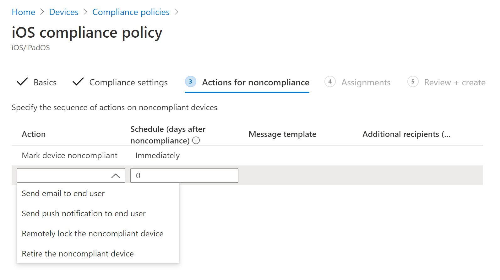

# Configurar Microsoft Defender para endpoint en características de iOSConfigure Microsoft Defender for Endpoint on iOS features

[!INCLUDE [Microsoft 365 Defender rebranding](../../includes/microsoft-defender.md)]

**Se aplica a:****Applies to:**
- [Microsoft Defender para punto de conexiónMicrosoft Defender for Endpoint](https://go.microsoft.com/fwlink/p/?linkid=2154037)
- [Microsoft 365 DefenderMicrosoft 365 Defender](https://go.microsoft.com/fwlink/?linkid=2118804)

> ¿Desea experimentar Defender for Endpoint?Want to experience Defender for Endpoint? [Regístrate para obtener una versión de prueba gratuita.Sign up for a free trial.](https://www.microsoft.com/microsoft-365/windows/microsoft-defender-atp?ocid=docs-wdatp-exposedapis-abovefoldlink) 

> [!NOTE]
> Defender para endpoint en iOS usaría una VPN para proporcionar la característica de protección web.Defender for Endpoint on iOS would use a VPN in order to provide the Web Protection feature. No se trata de una VPN normal y es una VPN local o auto-looping que no toma tráfico fuera del dispositivo.This is not a regular VPN and is a local/self-looping VPN that does not take traffic outside the device.

## Acceso condicional con Defender para endpoint en iOSConditional Access with Defender for Endpoint on iOS  
Microsoft Defender para endpoint en iOS junto con Microsoft Intune y Azure Active Directory permite aplicar el cumplimiento de dispositivos y las directivas de acceso condicional en función de la puntuación de riesgo del dispositivo.Microsoft Defender for Endpoint on iOS along with Microsoft Intune and Azure Active Directory enables enforcing Device compliance and Conditional Access policies based on device risk score. Defender for Endpoint es una solución de Mobile Threat Defense (MTD) que puedes implementar para aprovechar esta funcionalidad a través de Intune.Defender for Endpoint is a Mobile Threat Defense (MTD) solution that you can deploy to leverage this capability via Intune.

Para obtener más información acerca de cómo configurar el acceso condicional con Defender para endpoint en iOS, vea [Defender for Endpoint e Intune](/mem/intune/protect/advanced-threat-protection).For more information about how to set up Conditional Access with Defender for Endpoint on iOS, see [Defender for Endpoint and Intune](/mem/intune/protect/advanced-threat-protection).

### Detección de jailbreak por Microsoft Defender para endpointJailbreak detection by Microsoft Defender for Endpoint
Microsoft Defender para endpoint tiene la capacidad de detectar dispositivos administrados y no administrados que están liberados.Microsoft Defender for Endpoint has the capability of detecting unmanaged and managed devices that are jailbroken. Si se detecta que un dispositivo está liberado, se notifica una alerta de alto riesgo al Centro de seguridad y si el acceso condicional se configura en función de la puntuación de riesgo del dispositivo, se bloqueará el acceso al dispositivo a los datos corporativos.If a device is detected to be jailbroken, a **High**-risk alert will be reported to Security Center and if Conditional Access is setup based on device risk score, then the device will be blocked from accessing corporate data.

## Protección web y VPNWeb Protection and VPN

De forma predeterminada, Defender para endpoint en iOS incluye y habilita la característica de protección web.By default, Defender for Endpoint on iOS includes and enables the web protection feature. [La protección web](web-protection-overview.md) ayuda a proteger los dispositivos contra amenazas web y a proteger a los usuarios de ataques de phishing.[Web protection](web-protection-overview.md) helps to secure devices against web threats and protect users from phishing attacks. Defender para endpoint en iOS usa una VPN para proporcionar esta protección.Defender for Endpoint on iOS uses a VPN in order to provide this protection. Tenga en cuenta que se trata de una VPN local y, a diferencia de la VPN tradicional, el tráfico de red no se envía fuera del dispositivo.Please note this is a local VPN and unlike traditional VPN, network traffic is not sent outside the device.

Aunque está habilitado de forma predeterminada, puede haber algunos casos que requieran deshabilitar VPN.While enabled by default, there might be some cases that require you to disable VPN. Por ejemplo, quieres ejecutar algunas aplicaciones que no funcionan cuando se configura una VPN.For example, you want to run some apps that do not work when a VPN is configured. En tales casos, puedes optar por deshabilitar VPN desde la aplicación en el dispositivo siguiendo los pasos siguientes:In such cases, you can choose to disable VPN from the app on the device by following the steps below:

1. En el dispositivo iOS, abre la **aplicación Configuración,** haz clic o pulsa **General** y, a continuación, **VPN.**On your iOS device, open the **Settings** app, click or tap **General** and then **VPN**.
1. Haga clic o pulse en el botón "i" de Microsoft Defender para endpoint.Click or tap the "i" button for Microsoft Defender for Endpoint.
1. Desactiva la **Conectar a petición** para deshabilitar VPN.Toggle off **Connect On Demand** to disable VPN.

    > [!div class="mx-imgBorder"]
    > 

> [!NOTE]
> La protección web no estará disponible cuando la VPN esté deshabilitada.Web Protection will not be available when VPN is disabled. Para volver a habilitar Protección web, abra la aplicación Microsoft Defender para endpoint en el dispositivo y haga clic o pulse **Iniciar VPN**.To re-enable Web Protection, open the Microsoft Defender for Endpoint app on the device and click or tap **Start VPN**.

## Coexistencia de varios perfiles vpnCo-existence of multiple VPN profiles

Apple iOS no admite varias VPN de todo el dispositivo para estar activas simultáneamente.Apple iOS does not support multiple device-wide VPNs to be active simultaneously. Aunque pueden existir varios perfiles de VPN en el dispositivo, solo una VPN puede estar activa a la vez.While multiple VPN profiles can exist on the device, only one VPN can be active at a time.

## Configurar la directiva de cumplimiento en dispositivos con jailbreakConfigure compliance policy against jailbroken devices

Para proteger los datos corporativos de acceso en dispositivos iOS con jailbreak, le recomendamos que configure la siguiente directiva de cumplimiento en Intune.To protect corporate data from being accessed on jailbroken iOS devices, we recommend that you set up the following compliance policy on Intune.

> [!NOTE]
> La detección de jailbreak es una funcionalidad proporcionada por Microsoft Defender para Endpoint en iOS.Jailbreak detection is a capability provided by Microsoft Defender for Endpoint on iOS. Sin embargo, se recomienda configurar esta directiva como una capa adicional de defensa frente a escenarios de jailbreak.However, we recommend that you setup this policy as an additional layer of defense against jailbreak scenarios.

Siga los pasos siguientes para crear una directiva de cumplimiento contra dispositivos con jailbreak.Follow the steps below to create a compliance policy against jailbroken devices.

1. En [Microsoft Endpoint Manager de administración,](https://go.microsoft.com/fwlink/?linkid=2109431)vaya a **Directivas de** cumplimiento de  ->  **dispositivos** Crear  ->  **directiva**.In [Microsoft Endpoint Manager admin center](https://go.microsoft.com/fwlink/?linkid=2109431), go to **Devices** -> **Compliance policies** -> **Create Policy**. Seleccione "iOS/iPadOS" como plataforma y haga clic **en Crear**.Select "iOS/iPadOS" as platform and click **Create**.

    > [!div class="mx-imgBorder"]
    > 

2. Especifique un nombre de la directiva, por ejemplo, "Compliance Policy for Jailbreak".Specify a name of the policy, for example "Compliance Policy for Jailbreak".
3. En la página Configuración de cumplimiento, haga clic para expandir **la sección Estado del** dispositivo y haga clic en **Bloquear** para el **campo Dispositivos con jailbreak.**In the compliance settings page, click to expand **Device Health** section and click **Block** for **Jailbroken devices** field.

    > [!div class="mx-imgBorder"]
    > 

4. En la *sección Acción por* incumplimiento, seleccione las acciones según sus requisitos y seleccione **Siguiente**.In the *Action for noncompliance* section, select the actions as per your requirements and select **Next**.

    > [!div class="mx-imgBorder"]
    > 

5. En la *sección Asignaciones,* seleccione los grupos de usuarios que desea incluir para esta directiva y, a continuación, **seleccione Siguiente**.In the *Assignments* section, select the user groups that you want to include for this policy and then select **Next**.
6. En la **sección Review+Create,** compruebe que toda la información especificada es correcta y, a continuación, **seleccione Crear**.In the **Review+Create** section, verify that all the information entered is correct and then select **Create**.

## Configurar indicadores personalizadosConfigure custom indicators

Defender para endpoint en iOS permite a los administradores configurar indicadores personalizados en dispositivos iOS también.Defender for Endpoint on iOS enables admins to configure custom indicators on iOS devices as well. Para obtener más información sobre cómo configurar indicadores personalizados, vea [Administrar indicadores](/microsoft-365/security/defender-endpoint/manage-indicators).For more information on how to configure custom indicators, see [Manage indicators](/microsoft-365/security/defender-endpoint/manage-indicators).

> [!NOTE]
> Defender para endpoint en iOS admite la creación de indicadores personalizados solo para direcciones IP y direcciones URL/dominios.Defender for Endpoint on iOS supports creating custom indicators only for IP addresses and URLs/domains.

## Informe de sitio no seguroReport unsafe site

Los sitios web de suplantación de identidad suplantan sitios web de confianza con el fin de obtener su información personal o financiera.Phishing websites impersonate trustworthy websites for the purpose of obtaining your personal or financial information. Visita la [página Proporcionar comentarios sobre la protección de](https://www.microsoft.com/wdsi/filesubmission/exploitguard/networkprotection) red si quieres informar de un sitio web que podría ser un sitio de suplantación de identidad.Visit the [Provide feedback about network protection](https://www.microsoft.com/wdsi/filesubmission/exploitguard/networkprotection) page if you want to report a website that could be a phishing site.

