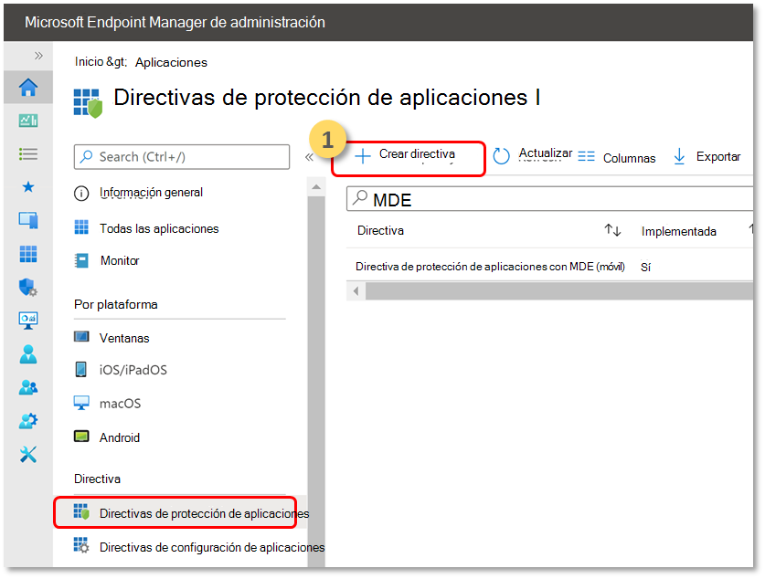
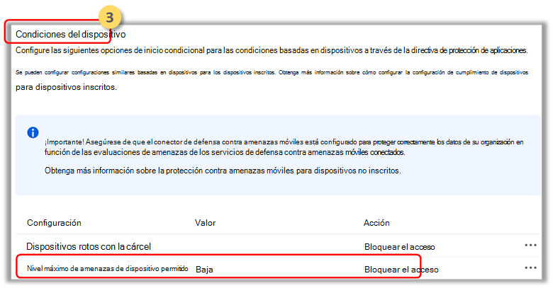

# Implementar Microsoft Defender para endpoint en dispositivos iOS no inscritos

[!INCLUDE [Microsoft 365 Defender rebranding](../../includes/microsoft-defender.md)]

**Se aplica a:**
- [Microsoft Defender para punto de conexión Plan 1](https://go.microsoft.com/fwlink/p/?linkid=2154037)
- [Microsoft Defender para punto de conexión Plan 2](https://go.microsoft.com/fwlink/p/?linkid=2154037)
- [Microsoft 365 Defender](https://go.microsoft.com/fwlink/?linkid=2118804)

> ¿Desea experimentar Defender for Endpoint? [Regístrese para obtener una prueba gratuita.](https://signup.microsoft.com/create-account/signup?products=7f379fee-c4f9-4278-b0a1-e4c8c2fcdf7e&ru=https://aka.ms/MDEp2OpenTrial?ocid=docs-wdatp-exposedapis-abovefoldlink)

> [!NOTE]
> Defender para endpoint en iOS usa una VPN para proporcionar la característica de protección web. No se trata de una VPN normal y es una VPN local o auto-looping que no toma tráfico fuera del dispositivo.

## Configurar Microsoft Defender para señales de riesgo de extremo en la directiva de protección de aplicaciones (MAM)

Microsoft Defender para Endpoint en iOS, que ya protege a los usuarios empresariales en escenarios de administración de dispositivos móviles (MDM), ahora amplía la compatibilidad con Mobile App Management (MAM), para dispositivos que no están inscritos con la administración de dispositivos móviles (MDM) de Intune. También amplía esta compatibilidad a los clientes que usan otras soluciones de administración de movilidad empresarial, mientras que sigue usando Intune para la administración de aplicaciones móviles (MAM). Esta funcionalidad le permite administrar y proteger los datos de su organización dentro de una aplicación.

Las directivas de Protección de aplicaciones de Intune aprovechan la información de amenazas de Microsoft Defender para endpoint en iOS para proteger estas aplicaciones. Las directivas de protección de aplicaciones (APP) que garantizan los datos de la organización siguen siendo seguras o se encuentran en una aplicación administrada. Una aplicación administrada tiene directivas de protección de aplicaciones aplicadas a ella y Intune puede administrarla.  

Microsoft Defender para endpoint en iOS admite ambas configuraciones de MAM
- **MDM de Intune + MAM**: los administradores de TI solo pueden administrar aplicaciones con directivas de Protección de aplicaciones en dispositivos inscritos con la administración de dispositivos móviles (MDM) de Intune.
- **MAM sin inscripción de** dispositivos: MAM sin inscripción de dispositivos, o MAM-WE, permite a los administradores de TI administrar aplicaciones mediante directivas de protección de aplicaciones en dispositivos que no están inscritos con MDM de Intune. Esto significa que las aplicaciones pueden administrarse mediante Intune en dispositivos inscritos con proveedores de EMM de terceros. Para administrar las aplicaciones que usan en ambas configuraciones anteriores, los clientes deben usar Intune en el [Centro de administración Microsoft Endpoint Manager administración](https://go.microsoft.com/fwlink/?linkid=2109431)

Para habilitar esta funcionalidad, un administrador debe configurar la conexión entre Microsoft Defender para Endpoint e Intune, crear la directiva de protección de aplicaciones y aplicar la directiva en dispositivos y aplicaciones de destino. 
 
Los usuarios finales también deben tomar medidas para instalar Microsoft Defender para Endpoint en su dispositivo y activar el flujo de incorporación.

### Requisitos previos

1. **Compruebe que el conector está habilitado**.   En la [consola de seguridad unificada](https://security.microsoft.com), vaya **a Configuración** >  **EndpointsAdvanced** >  **Features** y asegúrese de que **Microsoft Intune conexión** está habilitada.

  
  
2. **Compruebe que el conector está habilitado en el portal de Intune**.   En [el Centro de administración de Microsoft Endpoint Manager](https://go.microsoft.com/fwlink/?linkid=2109431), vaya a **Endpoint SecurityMicrosoft** >  **Defender para Endpoint** y asegúrese de que el estado de conexión está habilitado.

  

### Crear una directiva de protección de aplicaciones
 
Bloquear el acceso o borrar datos de una aplicación administrada basada en señales de riesgo de Microsoft Defender para puntos de conexión mediante la creación de una directiva de protección de aplicaciones.
Microsoft Defender para endpoint se puede configurar para enviar señales de amenaza que se usarán en las directivas de protección de aplicaciones (APP, también conocidas como MAM). Con esta funcionalidad, puedes usar Microsoft Defender para Endpoint para proteger las aplicaciones administradas.

1. Crear una directiva  
Las directivas de protección de aplicaciones (APP) que garantizan los datos de la organización siguen siendo seguras o se encuentran en una aplicación administrada. Una directiva puede ser una regla que se aplica cuando el usuario intenta acceder o mover datos "corporativos", o un conjunto de acciones que se prohíben o supervisan cuando el usuario está dentro de la aplicación. 

2. Agregar aplicaciones  
    a. Elige cómo quieres aplicar esta directiva a aplicaciones en diferentes dispositivos. A continuación, agrega al menos una aplicación.  
    Use esta opción para especificar si esta directiva se aplica a dispositivos no administrados. También puedes elegir dirigir la directiva a aplicaciones en dispositivos de cualquier estado de administración.
Debido a que la administración de aplicaciones móviles no requiere la administración de dispositivos, puede proteger los datos de la empresa en dispositivos administrados y no administrados. La administración se centra en la identidad del usuario, lo que elimina la necesidad de administrar dispositivos. Las empresas pueden usar directivas de protección de aplicaciones con o sin MDM al mismo tiempo. Por ejemplo, piense el caso de un empleado que utiliza tanto un teléfono proporcionado por la empresa como su propia tableta personal. El teléfono de la empresa está inscrito en MDM y protegido por directivas de protección de aplicaciones mientras que el dispositivo personal está protegido solo por directivas de protección de aplicaciones.

    b. Seleccionar aplicaciones 
    Una aplicación administrada es aquella que tiene las directivas de protección de aplicaciones aplicadas y puede ser administrada por Intune. Cualquier aplicación que se haya integrado con [el SDK de Intune](/mem/intune/developer/app-sdk) o que se haya ajustado mediante el App Wrapping Tool [Intune](/mem/intune/developer/apps-prepare-mobile-application-management) se puede administrar mediante directivas de protección de aplicaciones de Intune. Consulte la lista oficial de [aplicaciones protegidas de Microsoft Intune](/mem/intune/apps/apps-supported-intune-apps) que se han creado con estas herramientas y están disponibles para uso público.

    *Ejemplo: Outlook como una aplicación administrada*

    

 3. Establezca los requisitos de seguridad de inicio de sesión para la directiva de protección.  
Selecciona **Establecer > nivel máximo de amenaza de dispositivo permitido** en **Condiciones del dispositivo** y escribe un valor. A  **continuación, seleccione Acción: "Bloquear acceso"**. Microsoft Defender para endpoint en iOS comparte este nivel de amenaza de dispositivo.

    

4. Asignar grupos de usuarios a los que se debe aplicar la directiva. 
  Seleccione **Grupos incluidos**. A continuación, agregue los grupos relevantes. 

Para obtener más información sobre mam o directiva de protección de aplicaciones, consulta [configuración de la directiva de protección de aplicaciones de iOS](/mem/intune/apps/app-protection-policy-settings-ios).

## Implementar Microsoft Defender para endpoint para MAM o en dispositivos no inscritos

Microsoft Defender para endpoint en iOS habilita el escenario de directiva de protección de aplicaciones y está disponible en la Tienda de aplicaciones de Apple.

Cuando las directivas de protección de aplicaciones están configuradas para que las aplicaciones incluyan señales de riesgo de dispositivos de Microsoft Defender para Endpoint, los usuarios se redirigirán para instalar Microsoft Defender para Endpoint al usar dichas aplicaciones. Como alternativa, los usuarios también pueden instalar la versión más reciente de la aplicación directamente desde la Tienda de aplicaciones de Apple.
