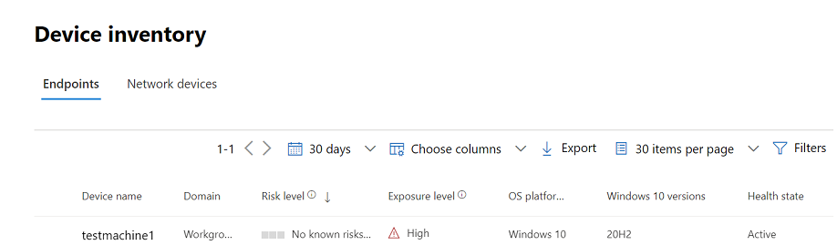

# Implementar Microsoft Defender para endpoint en iOS

[!INCLUDE [Microsoft 365 Defender rebranding](../../includes/microsoft-defender.md)]

**Se aplica a:**
- [Microsoft Defender para punto de conexión Plan 1](https://go.microsoft.com/fwlink/p/?linkid=2154037)
- [Microsoft Defender para punto de conexión Plan 2](https://go.microsoft.com/fwlink/p/?linkid=2154037)
- [Microsoft 365 Defender](https://go.microsoft.com/fwlink/?linkid=2118804)

> ¿Desea experimentar Defender for Endpoint? [Regístrese para obtener una prueba gratuita.](https://signup.microsoft.com/create-account/signup?products=7f379fee-c4f9-4278-b0a1-e4c8c2fcdf7e&ru=https://aka.ms/MDEp2OpenTrial?ocid=docs-wdatp-investigateip-abovefoldlink)

En este tema se describe la implementación de Defender for Endpoint en iOS en Portal de empresa de Intune dispositivos inscritos. Para obtener más información acerca de la inscripción de dispositivos de Intune, consulta [Inscribir dispositivos iOS/iPadOS en Intune](/mem/intune/enrollment/ios-enroll).

## Antes de empezar

- Asegúrese de tener acceso al [Centro de administración de Microsoft Endpoint Manager](https://go.microsoft.com/fwlink/?linkid=2109431).

- Asegúrese de que la inscripción de iOS se realiza para los usuarios. Los usuarios deben tener asignada una licencia de Defender for Endpoint para poder usar Defender para Endpoint en iOS. Consulte [Asignar licencias a los usuarios para](/azure/active-directory/users-groups-roles/licensing-groups-assign) obtener instrucciones sobre cómo asignar licencias.

> [!NOTE]
> Microsoft Defender para Endpoint en iOS está disponible en [la Apple App Store](https://aka.ms/mdatpiosappstore).

## Pasos para la implementación

Implemente Defender para endpoint en iOS mediante Portal de empresa de Intune.

### Agregar aplicación de la tienda iOS

1. En [el Centro de administración de Microsoft Endpoint Manager](https://go.microsoft.com/fwlink/?linkid=2109431), ve **a AppsiOS** -> **/iPadOSAddiOS** ->  ->  **store app** y haz clic en **Seleccionar**.

    > [!div class="mx-imgBorder"]
    > 

1. En la **página Agregar aplicación** , haga clic en **Buscar en la Tienda de** aplicaciones y escriba **Microsoft Defender para Endpoint** en la barra de búsqueda. En la sección resultados de búsqueda, haga clic en *Microsoft Defender para endpoint* y haga clic en **Seleccionar**.

1. Seleccione **iOS 11.0** como sistema operativo Mínimo. Revisa el resto de información sobre la aplicación y haz clic en **Siguiente**.

1. En la **sección Asignaciones** , vaya a la **sección Obligatorio** y seleccione **Agregar grupo**. A continuación, puedes elegir los grupos de usuarios a los que quieres dirigirte Defender para Endpoint en la aplicación iOS. Haga clic **en Seleccionar** y, a **continuación, en Siguiente**.

    > [!NOTE]
    > El grupo de usuarios seleccionado debe estar formado por usuarios inscritos en Intune.

    > [!div class="mx-imgBorder"]
    > 

1. En la *sección Revisar y crear* , compruebe que toda la información especificada es correcta y, a continuación, **seleccione Crear**. En unos instantes, la aplicación Defender for Endpoint debe crearse correctamente y una notificación debe aparecer en la esquina superior derecha de la página.

1. En la página de información de la aplicación que se muestra, en la sección **Supervisar**, seleccione Estado de instalación del dispositivo para comprobar que la instalación del dispositivo se ha completado correctamente.

    > [!div class="mx-imgBorder"]
    > 

## Implementación completa para dispositivos supervisados

La aplicación Microsoft Defender para endpoint en iOS tiene capacidad especializada en dispositivos iOS/iPadOS supervisados, dadas las capacidades de administración mejoradas que proporciona la plataforma en estos tipos de dispositivos. También puede proporcionar Protección web **sin configurar una VPN local en el dispositivo**. Esto proporciona a los usuarios finales una experiencia perfecta mientras siguen estando protegidos contra la suplantación de identidad (phishing) y otros ataques basados en web.

### Configurar el modo supervisado a través de Intune

A continuación, configura el modo supervisado para la aplicación Defender for Endpoint a través de una directiva de configuración de aplicaciones.

   > [!NOTE]
   > Esta directiva de configuración de aplicaciones para dispositivos supervisados solo se aplica a dispositivos administrados y debe estar dirigida a todos los dispositivos iOS administrados como procedimiento recomendado.

1. Inicie sesión en el Centro [Microsoft Endpoint Manager administración](https://go.microsoft.com/fwlink/?linkid=2109431) y vaya a **Directivas de** configuración de **aplicaciones** \> \> **Agregar**. Selecciona **Dispositivos administrados**.

    > [!div class="mx-imgBorder"]
    > 

1. En la *página Crear directiva de configuración de aplicaciones* , proporcione la siguiente información:
    - Nombre de directiva
    - Plataforma: seleccione iOS/iPadOS
    - Aplicación dirigida: seleccione **Microsoft Defender para endpoint** en la lista

    > [!div class="mx-imgBorder"]
    > 

1. En la siguiente pantalla, seleccione **Usar diseñador de configuraciones** como formato. Especifique la siguiente propiedad:
    - Clave de configuración: se supervisa
    - Tipo de valor: String
    - Valor de configuración: {{issupervised}}

    > [!div class="mx-imgBorder"]
    > 

1. Seleccione **Siguiente** para abrir la página **Etiquetas de ámbito**. Las etiquetas de ámbito son opcionales. Seleccione **Siguiente** para continuar.

1. En la página **Asignaciones**, seleccione los grupos que recibirán este perfil. Para este escenario, es más recomendado dirigirse a **Todos los dispositivos**. Para obtener más información sobre la asignación de perfiles, vea [Asignación de perfiles de usuario y dispositivo](/mem/intune/configuration/device-profile-assign).

   Al implementar en grupos de usuarios, un usuario debe iniciar sesión en un dispositivo antes de que se aplique la directiva.

   Haga clic en **Siguiente**.

1. Cuando haya terminado, elija **Crear** en la página **Revisar y crear**. El nuevo perfil se muestra en la lista de perfiles de configuración.

1. A continuación, debes implementar un perfil personalizado en dispositivos iOS supervisados. Esto es para funcionalidades mejoradas contra la suplantación de identidad. Siga los pasos siguientes:

    - Descargar el perfil de configuración desde [https://aka.ms/mdeiosprofilesupervised](https://aka.ms/mdeiosprofilesupervised)
    - Vaya a **DevicesiOS** -> **/iPadOSConfiguration** ->  **profilesCreate** ->  **Profile**

    > [!div class="mx-imgBorder"]
    > 
    
    - Proporcione un nombre del perfil. Cuando se le pida que importe un archivo de perfil de configuración, seleccione el que se descargó del paso anterior.
    - En la **sección Asignación** , selecciona el grupo de dispositivos al que quieres aplicar este perfil. Como práctica recomendada, esto debe aplicarse a todos los dispositivos iOS administrados. Seleccione **Siguiente**.
    - Cuando haya terminado, elija **Crear** en la página **Revisar y crear**. El nuevo perfil se muestra en la lista de perfiles de configuración.

## Incorporación automática del perfil vpn (incorporación simplificada)

Para dispositivos sin supervisión, se usa una VPN para proporcionar la característica de protección web. No se trata de una VPN normal y es una VPN local o auto-looping que no toma tráfico fuera del dispositivo.

>[!NOTE]
>Para dispositivos supervisados, una VPN no es necesaria para la funcionalidad de Protección web y requiere que los administradores configuren un perfil de configuración en dispositivos supervisados. Para configurar dispositivos supervisados, siga los pasos de la [sección Completar implementación para dispositivos supervisados](#complete-deployment-for-supervised-devices) .

Los administradores pueden configurar automáticamente el perfil de VPN. Esto configurará automáticamente el perfil de DEFENDER para ENDPOINT VPN sin que el usuario lo haga durante la incorporación. 

Este paso simplifica el proceso de incorporación configurando el perfil de VPN. Para obtener una experiencia de incorporación silenciosa o táctil cero, consulta la siguiente sección: [Incorporación sin contacto](#zero-touch-onboarding-of-microsoft-defender-for-endpoint-preview).

1. En [el Centro de administración de Microsoft Endpoint Manager](https://go.microsoft.com/fwlink/?linkid=2109431), vaya a **DevicesConfiguration** ->  **ProfilesCreate** ->  **Profile**.
1. Elija **Plataforma** como **iOS/iPadOS** y **Tipo de perfil** como **VPN**. Haga clic en **Crear**.
1. Escriba un nombre para el perfil y haga clic en **Siguiente**.
1. Seleccione **VPN personalizada para** tipo de conexión y, en la **sección Vpn base** , escriba lo siguiente:
    - Connection Name = Microsoft Defender for Endpoint
    - Dirección del servidor VPN = 127.0.0.1
    - Método Auth = "Nombre de usuario y contraseña"
    - Túnel dividido = Deshabilitar
    - Identificador de VPN = com.microsoft.scmx
    - En los pares clave-valor, escriba la clave **AutoOnboard** y establezca el valor en **True**.
    - Tipo de VPN automática = VPN a petición
    - Haga **clic en** **Agregar para reglas a** petición y seleccione Quiero hacer lo **siguiente = Establecer VPN**, **Quiero restringir a = Todos los dominios**.

    

1. Haga clic en Siguiente y asigne el perfil a los usuarios de destino.
1. En la *sección Revisar y crear* , compruebe que toda la información especificada es correcta y, a continuación, **seleccione Crear**.

## Incorporación sin contacto de Microsoft Defender para endpoint (versión preliminar)

> [!IMPORTANT]
> Parte de la información se refiere a productos preliminares que pueden ser modificados sustancialmente antes de su lanzamiento comercial. Microsoft no otorga garantías, expresas o implícitas, con respecto a la información que aquí se proporciona.

> [!NOTE]
> Zero-touch no se puede configurar en dispositivos iOS inscritos sin afinidad de usuario (dispositivos sin usuarios o dispositivos compartidos).

Los administradores pueden configurar Microsoft Defender para endpoint para implementar y activar de forma silenciosa. En este flujo, el administrador crea un perfil de implementación y simplemente se notifica al usuario de la instalación. Defender for Endpoint se instala automáticamente sin necesidad de que el usuario abra la aplicación. Siga los pasos que se indican a continuación para configurar la implementación silenciosa o táctil de Defender para Endpoint en dispositivos iOS inscritos:

1. En [el Centro de administración de Microsoft Endpoint Manager](https://go.microsoft.com/fwlink/?linkid=2109431), vaya a **DevicesConfiguration** >  **ProfilesCreate** >  **Profile**.
1. Elija **Plataforma** como **iOS/iPadOS** y **Tipo de perfil** como **VPN**. Seleccione **Crear**.
1. Escriba un nombre para el perfil y seleccione **Siguiente**.
1. Seleccione **VPN personalizada para** tipo de conexión y, en la **sección Vpn base** , escriba lo siguiente:
    - Connection Name = Microsoft Defender for Endpoint
    - Dirección del servidor VPN = 127.0.0.1
    - Método Auth = "Nombre de usuario y contraseña"
    - Túnel dividido = Deshabilitar
    - Identificador de VPN = com.microsoft.scmx
    - En los pares clave-valor, escriba la clave **SilentOnboard** y establezca el valor en **True**.
    - Tipo de VPN automática = VPN a petición
    - Seleccione **Agregar** para **Reglas a** petición y seleccione Quiero hacer lo **siguiente = Establecer VPN**, Quiero restringir **a = Todos los dominios**.

    

1. Seleccione **Siguiente** y asigne el perfil a los usuarios dirigidos.
1. En la *sección Revisar y crear* , compruebe que toda la información especificada es correcta y, a continuación, **seleccione Crear**.

Una vez realizada la configuración anterior y sincronizada con el dispositivo, se llevan a cabo las siguientes acciones en los dispositivos iOS de destino:
    - Microsoft Defender para endpoint se implementará y se incorporará silenciosamente y el dispositivo se verá en el portal de Defender for Endpoint.
    - Se enviará una notificación provisional al dispositivo de usuario.
    - Se activará Protección web y otras características.

   > [!NOTE]
   > Para dispositivos supervisados, aunque no es necesario tener un perfil VPN, los administradores aún pueden configurar la incorporación sin contacto configurando el perfil de Defender for Endpoint VPN a través de Intune. El perfil vpn se implementará en el dispositivo, pero solo estará presente en el dispositivo como un perfil de paso a través y se puede eliminar después de la incorporación inicial.

## Completar la incorporación y comprobar el estado

1. Una vez que Defender para Endpoint en iOS se haya instalado en el dispositivo, verás el icono de la aplicación.

    

2. Pulsa el icono de la aplicación Defender para endpoint (MSDefender) y sigue las instrucciones en pantalla para completar los pasos de incorporación. Los detalles incluyen la aceptación por parte del usuario final de los permisos de iOS requeridos por Defender para endpoint en iOS.

3. Tras la incorporación correcta, el dispositivo empezará a aparecer en la lista dispositivos del portal Microsoft 365 Defender dispositivos.

    > [!div class="mx-imgBorder"]
    > 

## Pasos siguientes

- [Configurar la directiva de protección de aplicaciones para incluir las señales de riesgo de Defender for Endpoint (MAM)](ios-install-unmanaged.md)
- [Configurar Defender para endpoint en características de iOS](ios-configure-features.md)
