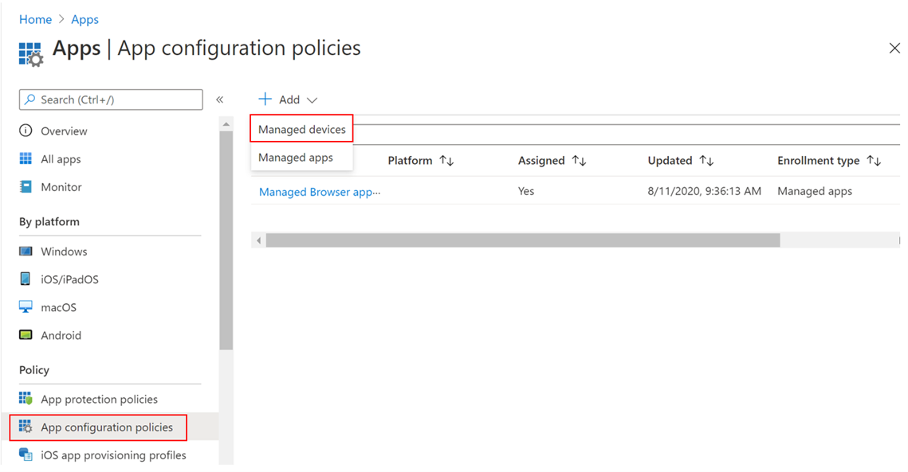

# Implementar Microsoft Defender para endpoint en iOSDeploy Microsoft Defender for Endpoint on iOS

[!INCLUDE [Microsoft 365 Defender rebranding](../../includes/microsoft-defender.md)]

**Se aplica a:****Applies to:**
- [Microsoft Defender para punto de conexiónMicrosoft Defender for Endpoint](https://go.microsoft.com/fwlink/p/?linkid=2154037)
- [Microsoft 365 DefenderMicrosoft 365 Defender](https://go.microsoft.com/fwlink/?linkid=2118804)

> ¿Desea experimentar Defender for Endpoint?Want to experience Defender for Endpoint? [Regístrate para obtener una versión de prueba gratuita.Sign up for a free trial.](https://www.microsoft.com/microsoft-365/windows/microsoft-defender-atp?ocid=docs-wdatp-investigateip-abovefoldlink)

En este tema se describe la implementación de Defender for Endpoint para iOS en dispositivos inscritos en el Portal de empresa de Intune.This topic describes deploying Defender for Endpoint for iOS on Intune Company Portal enrolled devices. Para obtener más información acerca de la inscripción de dispositivos de Intune, consulte [Inscribir dispositivos iOS/iPadOS en Intune.](https://docs.microsoft.com/mem/intune/enrollment/ios-enroll)For more information about Intune device enrollment, see [Enroll iOS/iPadOS devices in Intune](https://docs.microsoft.com/mem/intune/enrollment/ios-enroll).

## Antes de empezarBefore you begin

- Asegúrese de tener acceso al Centro de administración [de Microsoft Endpoint Manager](https://go.microsoft.com/fwlink/?linkid=2109431).Ensure you have access to [Microsoft Endpoint manager admin center](https://go.microsoft.com/fwlink/?linkid=2109431).

- Asegúrese de que la inscripción de iOS se realiza para los usuarios.Ensure iOS enrollment is done for your users. Los usuarios deben tener asignada una licencia de Defender for Endpoint para poder usar Defender para Endpoint para iOS.Users need to have a Defender for Endpoint license assigned in order to use Defender for Endpoint for iOS. Consulte [Asignar licencias a los usuarios para](https://docs.microsoft.com/azure/active-directory/users-groups-roles/licensing-groups-assign) obtener instrucciones sobre cómo asignar licencias.Refer to [Assign licenses to users](https://docs.microsoft.com/azure/active-directory/users-groups-roles/licensing-groups-assign) for instructions on how to assign licenses.

> [!NOTE]
> Atp de Microsoft Defender (Microsoft Defender para endpoint) para iOS ya está disponible en [la Tienda de aplicaciones de Apple.](https://aka.ms/mdatpiosappstore)Microsoft Defender ATP (Microsoft Defender for Endpoint) for iOS is now available in the [Apple App Store](https://aka.ms/mdatpiosappstore).

## Pasos para la implementaciónDeployment steps

Implementar Defender para endpoint para iOS a través del Portal de empresa de Intune.Deploy Defender for Endpoint for iOS via Intune Company Portal.

### Agregar aplicación de la tienda iOSAdd iOS store app

1. En [el Centro de administración de Microsoft Endpoint Manager,](https://go.microsoft.com/fwlink/?linkid=2109431)vaya a **Aplicaciones**  ->  **iOS/iPadOS** Agregar aplicación de la  ->    ->  **tienda iOS** y haga clic en Seleccionar .In [Microsoft Endpoint manager admin center](https://go.microsoft.com/fwlink/?linkid=2109431), go to **Apps** -> **iOS/iPadOS** -> **Add** -> **iOS store app** and click **Select**.

    > [!div class="mx-imgBorder"]
    > 

1. En la página Agregar aplicación, haga clic en **Buscar en la Tienda de** aplicaciones y escriba Punto de conexión de Microsoft **Defender** en la barra de búsqueda.On the Add app page, click on **Search the App Store** and type **Microsoft Defender Endpoint** in the search bar. En la sección resultados de búsqueda, haga clic en *Extremo de Microsoft Defender* y haga clic en **Seleccionar**.In the search results section, click on *Microsoft Defender Endpoint* and click **Select**.

1. Seleccione **iOS 11.0** como sistema operativo Mínimo.Select **iOS 11.0** as the Minimum operating system. Revisa el resto de información sobre la aplicación y haz clic en **Siguiente**.Review the rest of information about the app and click **Next**.

1. En la *sección Asignaciones,* vaya a la **sección Obligatorio** y seleccione Agregar **grupo**.In the *Assignments* section, go to the **Required** section and select **Add group**. A continuación, puedes elegir los grupos de usuarios a los que quieres dirigirte defender para la aplicación De endpoint para iOS.You can then choose the user group(s) that you would like to target Defender for Endpoint for iOS app. Haga clic **en Seleccionar** y, a **continuación, en Siguiente**.Click **Select** and then **Next**.

    > [!NOTE]
    > El grupo de usuarios seleccionado debe estar formado por usuarios inscritos en Intune.The selected user group should consist of Intune enrolled users.

    > [!div class="mx-imgBorder"]
    > 

1. En la *sección Revisar + Crear,* compruebe que toda la información especificada es correcta y, a continuación, **seleccione Crear**.In the *Review + Create* section, verify that all the information entered is correct and then select **Create**. En unos instantes, la aplicación Defender for Endpoint debe crearse correctamente y una notificación debe aparecer en la esquina superior derecha de la página.In a few moments, the Defender for Endpoint app should be created successfully, and a notification should show up at the top-right corner of the page.

1. En la página de información de la aplicación  que se muestra, en la sección **Supervisar,** seleccione Estado de instalación del dispositivo para comprobar que la instalación del dispositivo se ha completado correctamente.In the app information page that is displayed, in the **Monitor** section, select **Device install status** to verify that the device installation has completed successfully.

    > [!div class="mx-imgBorder"]
    > 

## Completar la incorporación y comprobar el estadoComplete onboarding and check status

1. Una vez que Defender para Endpoint para iOS se haya instalado en el dispositivo, verás el icono de la aplicación.Once Defender for Endpoint for iOS has been installed on the device, you  will see the app icon.

    

2. Pulsa el icono de la aplicación Defender para endpoint y sigue las instrucciones en pantalla para completar los pasos de incorporación.Tap the Defender for Endpoint app icon and follow the on-screen instructions to complete the onboarding steps. Los detalles incluyen la aceptación por parte del usuario final de los permisos de iOS requeridos por Defender para endpoint para iOS.The details include end-user acceptance of iOS permissions required by Defender for Endpoint for iOS.

3. Tras la incorporación correcta, el dispositivo empezará a aparecer en la lista dispositivos del Centro de seguridad de Microsoft Defender.Upon successful onboarding, the device will start showing up on the Devices list in Microsoft Defender Security Center.

    > [!div class="mx-imgBorder"]
    > 

## Configurar Microsoft Defender para el punto de conexión para el modo supervisadoConfigure Microsoft Defender for Endpoint for Supervised Mode

La aplicación Microsoft Defender para endpoint en iOS tiene capacidad especializada en dispositivos iOS/iPadOS supervisados, dadas las capacidades de administración mejoradas que proporciona la plataforma en estos tipos de dispositivos.The Microsoft Defender for Endpoint on iOS app has specialized ability on supervised iOS/iPadOS devices, given the increased management capabilities provided by the platform on these types of devices. Para aprovechar estas capacidades, la aplicación Defender for Endpoint debe saber si un dispositivo está en modo supervisado.To take advantage of these capabilities, the Defender for Endpoint app needs to know if a device is in Supervised Mode.

### Configurar el modo supervisado a través de IntuneConfigure Supervised Mode via Intune

Intune te permite configurar la aplicación Defender para iOS a través de una directiva de configuración de aplicaciones.Intune allows you to configure the Defender for iOS app through an App Configuration policy.

   > [!NOTE]
   > Esta directiva de configuración de aplicaciones para dispositivos supervisados solo se aplica a dispositivos administrados y debe estar dirigida a todos los dispositivos iOS administrados como procedimiento recomendado.This app configuration policy for supervised devices is applicable only to managed devices and should be targeted for all managed iOS devices as a best practice.

1. Inicie sesión en el Centro de administración [de Microsoft Endpoint Manager](https://go.microsoft.com/fwlink/?linkid=2109431) y vaya a Directivas de configuración de   >  **aplicaciones**  >  **Agregar**.Sign in to the [Microsoft Endpoint Manager admin center](https://go.microsoft.com/fwlink/?linkid=2109431) and go to **Apps** > **App configuration policies** > **Add**. Haga clic en **Dispositivos administrados.**Click on **Managed devices**.

    > [!div class="mx-imgBorder"]
    > 

1. En la *página Crear directiva de configuración de aplicaciones,* proporcione la siguiente información:In the *Create app configuration policy* page, provide the following information:
    - Nombre de la directivaPolicy Name
    - Plataforma: seleccione iOS/iPadOSPlatform: Select iOS/iPadOS
    - Aplicación dirigida: seleccione **ATP de Microsoft Defender** en la listaTargeted app: Select **Microsoft Defender ATP** from the list

    > [!div class="mx-imgBorder"]
    > 

1. En la siguiente pantalla, seleccione **Usar diseñador de configuraciones** como formato.In the next screen, select **Use configuration designer** as the format. Especifique la siguiente propiedad:Specify the following property:
    - Clave de configuración: se supervisaConfiguration Key: issupervised
    - Tipo de valor: StringValue type: String
    - Valor de configuración: {{issupervised}}Configuration Value: {{issupervised}}
    
    > [!div class="mx-imgBorder"]
    > 

1. Haga **clic en** Siguiente para abrir la página **Etiquetas de ámbito.**Click **Next** to open the **Scope tags** page. Las etiquetas de ámbito son opcionales.Scope tags are optional. Haga clic en **Siguiente** para continuar.Click **Next** to continue.

1. En la **página Asignaciones,** seleccione los grupos que recibirán este perfil.On the **Assignments** page, select the groups that will receive this profile. Para este escenario, es mejor usar todos los dispositivos como **destino.**For this scenario, it is best practice to target **All Devices**. Para obtener más información sobre la asignación de perfiles, vea [Asignar perfiles de usuario y dispositivo.](https://docs.microsoft.com/mem/intune/configuration/device-profile-assign)For more information on assigning profiles, see [Assign user and device profiles](https://docs.microsoft.com/mem/intune/configuration/device-profile-assign).

   Al implementar en grupos de usuarios, un usuario debe iniciar sesión en un dispositivo antes de que se aplique la directiva.When deploying to user groups, a user must sign in to a device before the policy applies.

   Haga clic en **Siguiente**.Click **Next**.

1. En la **página Revisar y crear,** cuando haya terminado, elija **Crear**.On the **Review + create** page, when you're done, choose **Create**. El nuevo perfil se muestra en la lista de perfiles de configuración.The new profile is displayed in the list of configuration profiles.

1. A continuación, para obtener funcionalidades mejoradas contra la suplantación de identidad, puede implementar un perfil personalizado en los dispositivos iOS supervisados.Next, for enhanced Anti-phishing capabilities, you can deploy a custom profile on the supervised iOS devices. Siga los pasos siguientes:Follow the steps below:
    - Descargar el perfil de configuración desde [https://aka.ms/mdatpiossupervisedprofile](https://aka.ms/mdatpiossupervisedprofile)Download the config profile from [https://aka.ms/mdatpiossupervisedprofile](https://aka.ms/mdatpiossupervisedprofile)
    - Vaya a  ->  **Dispositivos iOS/iPadOS**  ->  **Configuration profiles**  ->  **Create Profile**Navigate to **Devices** -> **iOS/iPadOS** -> **Configuration profiles** -> **Create Profile**

    > [!div class="mx-imgBorder"]
    > 

    - Proporcione un nombre del perfil.Provide a name of the profile. Cuando se le pida que importe un archivo de perfil de configuración, seleccione el que se descargó anteriormente.When prompted to import a Configuration profile file, select the one downloaded above.
    - En la **sección Asignación,** selecciona el grupo de dispositivos al que quieres aplicar este perfil.In the **Assignment** section, select the device group to which you want to apply this profile. Como práctica recomendada, esto debe aplicarse a todos los dispositivos iOS administrados.As a best practice, this should be applied to all managed iOS devices. Haga clic en **Siguiente**.Click **Next**.
    - En la **página Revisar y crear,** cuando haya terminado, elija **Crear**.On the **Review + create** page, when you're done, choose **Create**. El nuevo perfil se muestra en la lista de perfiles de configuración.The new profile is displayed in the list of configuration profiles.

## Siguientes pasosNext Steps

[Configurar Defender para endpoint para características de iOSConfigure Defender for Endpoint for iOS features](ios-configure-features.md)
