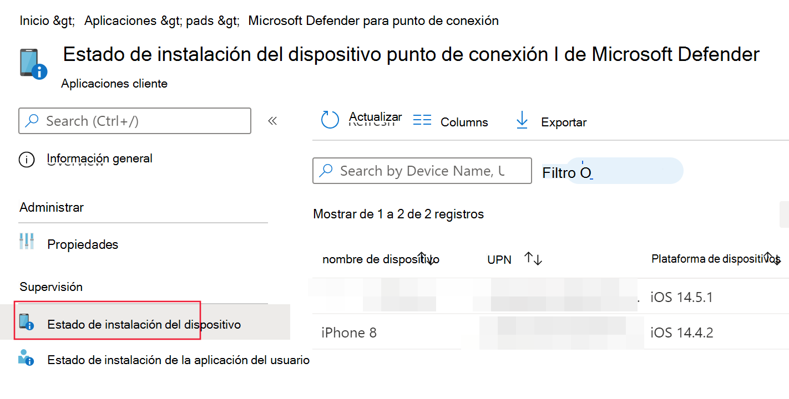

# Implementar Microsoft Defender para endpoint en iOS

[!INCLUDE [Microsoft 365 Defender rebranding](../../includes/microsoft-defender.md)]

**Se aplica a:**
- [Microsoft Defender para punto de conexión](https://go.microsoft.com/fwlink/p/?linkid=2154037)
- [Microsoft 365 Defender](https://go.microsoft.com/fwlink/?linkid=2118804)

> ¿Desea experimentar Defender for Endpoint? [Regístrate para obtener una versión de prueba gratuita.](https://www.microsoft.com/microsoft-365/windows/microsoft-defender-atp?ocid=docs-wdatp-investigateip-abovefoldlink)

En este tema se describe la implementación de Defender for Endpoint en iOS en Portal de empresa de Intune dispositivos inscritos. Para obtener más información acerca de la inscripción de dispositivos de Intune, consulte [Inscribir dispositivos iOS/iPadOS en Intune.](/mem/intune/enrollment/ios-enroll)

## Antes de empezar

- Asegúrese de tener acceso al Centro de administración [de Microsoft Endpoint Manager](https://go.microsoft.com/fwlink/?linkid=2109431).

- Asegúrese de que la inscripción de iOS se realiza para los usuarios. Los usuarios deben tener asignada una licencia de Defender for Endpoint para poder usar Defender para Endpoint en iOS. Consulte [Asignar licencias a los usuarios para](/azure/active-directory/users-groups-roles/licensing-groups-assign) obtener instrucciones sobre cómo asignar licencias.

> [!NOTE]
> Microsoft Defender para endpoint en iOS ya está disponible en [la Tienda de aplicaciones de Apple](https://aka.ms/mdatpiosappstore).

## Pasos para la implementación

Implemente Defender para endpoint en iOS mediante Portal de empresa de Intune.

### Agregar aplicación de la tienda iOS

1. En [el Centro de administración de Microsoft Endpoint Manager,](https://go.microsoft.com/fwlink/?linkid=2109431)vaya a **Aplicaciones**  ->  **iOS/iPadOS** Agregar aplicación de la  ->    ->  **tienda iOS** y haga clic en Seleccionar .

    > [!div class="mx-imgBorder"]
    > 

1. En la página Agregar aplicación, haga clic en **Buscar en la Tienda de** aplicaciones y escriba Punto de conexión de Microsoft **Defender** en la barra de búsqueda. En la sección resultados de búsqueda, haga clic en *Extremo de Microsoft Defender* y haga clic en **Seleccionar**.

1. Seleccione **iOS 11.0** como sistema operativo Mínimo. Revisa el resto de información sobre la aplicación y haz clic en **Siguiente**.

1. En la *sección Asignaciones,* vaya a la **sección Obligatorio** y seleccione Agregar **grupo**. A continuación, puedes elegir los grupos de usuarios a los que quieres dirigirte Defender para Endpoint en la aplicación iOS. Haga clic **en Seleccionar** y, a **continuación, en Siguiente**.

    > [!NOTE]
    > El grupo de usuarios seleccionado debe estar formado por usuarios inscritos en Intune.

    > [!div class="mx-imgBorder"]
    > 

1. En la *sección Revisar + Crear,* compruebe que toda la información especificada es correcta y, a continuación, **seleccione Crear**. En unos instantes, la aplicación Defender for Endpoint debe crearse correctamente y una notificación debe aparecer en la esquina superior derecha de la página.

1. En la página de información de la aplicación  que se muestra, en la sección **Supervisar,** seleccione Estado de instalación del dispositivo para comprobar que la instalación del dispositivo se ha completado correctamente.

    > [!div class="mx-imgBorder"]
    > 

## Incorporación automática del perfil vpn (incorporación simplificada)

> [!NOTE]
> La incorporación automática del perfil VPN está actualmente en versión preliminar y los pasos mencionados en esta sección pueden modificarse considerablemente antes de su lanzamiento comercial.

Los administradores pueden configurar automáticamente el perfil de VPN. Esto configurará automáticamente el perfil de DEFENDER para ENDPOINT VPN sin que el usuario lo haga durante la incorporación. Tenga en cuenta que la VPN se usa para proporcionar la característica de Protección web. No se trata de una VPN normal y es una VPN local o auto-looping que no toma tráfico fuera del dispositivo.

1. En [el Centro de administración de Microsoft Endpoint Manager,](https://go.microsoft.com/fwlink/?linkid=2109431)vaya a **Perfiles**  ->  **de configuración de dispositivos** Crear  ->  **perfil**.
1. Elija **Plataforma** como **iOS/iPadOS** y **Tipo de perfil** como **VPN.** Haga clic en **Crear**.
1. Escriba un nombre para el perfil y haga clic en **Siguiente**.
1. Seleccione **VPN personalizada para** tipo de conexión y, en la sección Vpn **base,** escriba lo siguiente:
    - Connection Name = Microsoft Defender for Endpoint
    - Dirección del servidor VPN = 127.0.0.1
    - Método Auth = "Nombre de usuario y contraseña"
    - Túnel dividido = Deshabilitar
    - Identificador de VPN = com.microsoft.scmx
    - En los pares clave-valor, escriba la clave **AutoOnboard** y establezca el valor en **True**.
    - Tipo de VPN automática = VPN a petición
    - Haga **clic en** Agregar para reglas **a** petición y seleccione Quiero hacer lo siguiente = **Establecer VPN**, Quiero restringir a = Todos los **dominios**.

    

1. Haga clic en Siguiente y asigne el perfil a los usuarios de destino.
1. En la *sección Revisar + Crear,* compruebe que toda la información especificada es correcta y, a continuación, **seleccione Crear**.

## Completar la incorporación y comprobar el estado

1. Una vez que Defender para Endpoint en iOS se haya instalado en el dispositivo, verás el icono de la aplicación.

    

2. Pulsa el icono de la aplicación Defender para endpoint y sigue las instrucciones en pantalla para completar los pasos de incorporación. Los detalles incluyen la aceptación por parte del usuario final de los permisos de iOS requeridos por Defender para endpoint en iOS.

3. Tras la incorporación correcta, el dispositivo empezará a aparecer en la lista dispositivos de Centro de seguridad de Microsoft Defender.

    > [!div class="mx-imgBorder"]
    > 

## Configurar Microsoft Defender para el punto de conexión para el modo supervisado

La aplicación Microsoft Defender para endpoint en iOS tiene capacidad especializada en dispositivos iOS/iPadOS supervisados, dadas las capacidades de administración mejoradas que proporciona la plataforma en estos tipos de dispositivos. Para aprovechar estas capacidades, la aplicación Defender for Endpoint debe saber si un dispositivo está en modo supervisado.

### Configurar el modo supervisado a través de Intune

Intune te permite configurar la aplicación Defender para iOS a través de una directiva de configuración de aplicaciones.

   > [!NOTE]
   > Esta directiva de configuración de aplicaciones para dispositivos supervisados solo se aplica a dispositivos administrados y debe estar dirigida a todos los dispositivos iOS administrados como procedimiento recomendado.

1. Inicie sesión en el Centro [Microsoft Endpoint Manager administración](https://go.microsoft.com/fwlink/?linkid=2109431) y vaya a Directivas de configuración de   >  **aplicaciones**  >  **Agregar**. Haga clic en **Dispositivos administrados.**

    > [!div class="mx-imgBorder"]
    > 

1. En la *página Crear directiva de configuración de aplicaciones,* proporcione la siguiente información:
    - Nombre de la directiva
    - Plataforma: seleccione iOS/iPadOS
    - Aplicación dirigida: seleccione **ATP de Microsoft Defender** de la lista

    > [!div class="mx-imgBorder"]
    > 

1. En la siguiente pantalla, seleccione **Usar diseñador de configuraciones** como formato. Especifique la siguiente propiedad:
    - Clave de configuración: se supervisa
    - Tipo de valor: String
    - Valor de configuración: {{issupervised}}
    
    > [!div class="mx-imgBorder"]
    > 

1. Haga **clic en** Siguiente para abrir la página **Etiquetas de ámbito.** Las etiquetas de ámbito son opcionales. Haga clic en **Siguiente** para continuar.

1. En la **página Asignaciones,** seleccione los grupos que recibirán este perfil. Para este escenario, es mejor usar todos los dispositivos como **destino.** Para obtener más información sobre la asignación de perfiles, vea [Asignar perfiles de usuario y dispositivo.](/mem/intune/configuration/device-profile-assign)

   Al implementar en grupos de usuarios, un usuario debe iniciar sesión en un dispositivo antes de que se aplique la directiva.

   Haga clic en **Siguiente**.

1. En la **página Revisar y crear,** cuando haya terminado, elija **Crear**. El nuevo perfil se muestra en la lista de perfiles de configuración.

1. A continuación, para obtener funcionalidades mejoradas contra la suplantación de identidad, puede implementar un perfil personalizado en los dispositivos iOS supervisados. Siga los pasos siguientes:
    - Descargar el perfil de configuración desde [https://aka.ms/mdatpiossupervisedprofile](https://aka.ms/mdatpiossupervisedprofile)
    - Vaya a  ->  **Dispositivos iOS/iPadOS**  ->  **Configuration profiles**  ->  **Create Profile**

    > [!div class="mx-imgBorder"]
    > 

    - Proporcione un nombre del perfil. Cuando se le pida que importe un archivo de perfil de configuración, seleccione el que se descargó anteriormente.
    - En la **sección Asignación,** selecciona el grupo de dispositivos al que quieres aplicar este perfil. Como práctica recomendada, esto debe aplicarse a todos los dispositivos iOS administrados. Haga clic en **Siguiente**.
    - En la **página Revisar y crear,** cuando haya terminado, elija **Crear**. El nuevo perfil se muestra en la lista de perfiles de configuración.

## Siguientes pasos

[Configurar Defender para endpoint en características de iOS](ios-configure-features.md)
