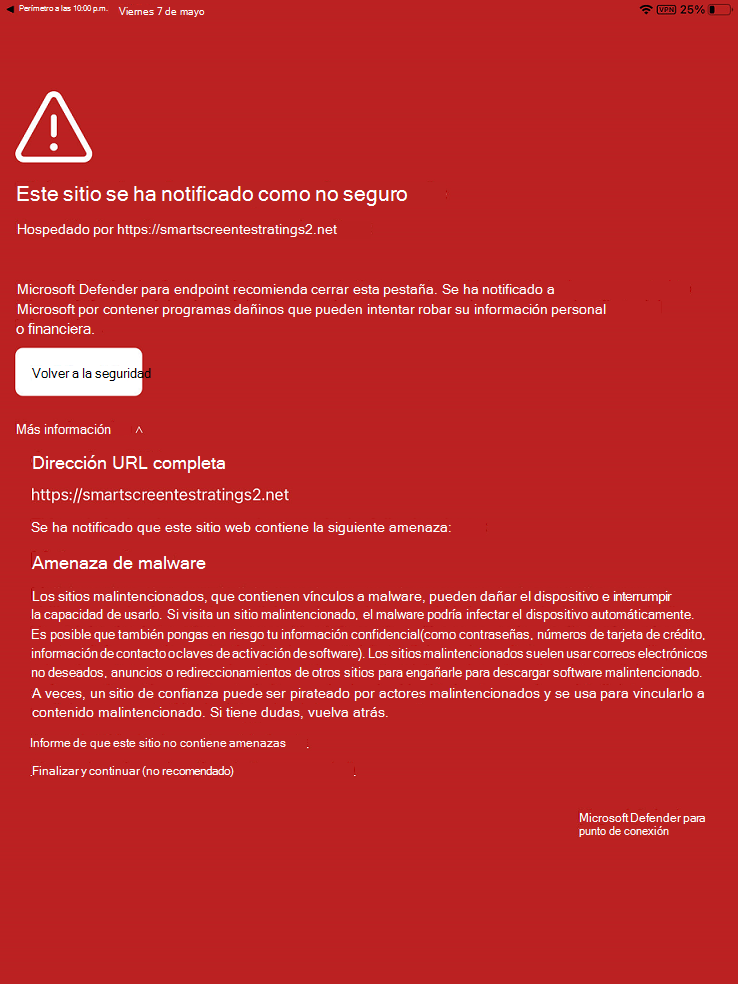

# Solucionar problemas y encontrar respuestas a preguntas frecuentes en Microsoft Defender para endpoint en iOSTroubleshoot issues and find answers to FAQs on Microsoft Defender for Endpoint on iOS

[!INCLUDE [Microsoft 365 Defender rebranding](../../includes/microsoft-defender.md)]

**Se aplica a:****Applies to:**
- [Microsoft Defender para punto de conexiónMicrosoft Defender for Endpoint](https://go.microsoft.com/fwlink/p/?linkid=2154037)
- [Microsoft 365 DefenderMicrosoft 365 Defender](https://go.microsoft.com/fwlink/?linkid=2118804)

> ¿Desea experimentar Defender for Endpoint?Want to experience Defender for Endpoint? [Regístrate para obtener una versión de prueba gratuita.Sign up for a free trial.](https://www.microsoft.com/microsoft-365/windows/microsoft-defender-atp?ocid=docs-wdatp-exposedapis-abovefoldlink) 

En este tema se proporciona información de solución de problemas que le ayudará a solucionar los problemas que pueden surgir al usar Microsoft Defender para Endpoint en iOS.This topic provides troubleshooting information to help you address issues that may arise as you use Microsoft Defender for Endpoint on iOS.

> [!NOTE]
> Defender para endpoint en iOS usaría una VPN para proporcionar la característica de protección web.Defender for Endpoint on iOS would use a VPN in order to provide the Web Protection feature. No se trata de una VPN normal y es una VPN local o auto-looping que no toma tráfico fuera del dispositivo.This is not a regular VPN and is a local/self-looping VPN that does not take traffic outside the device.

## Las aplicaciones no funcionan cuando la VPN está activadaApps don't work when VPN is turned on
Hay algunas aplicaciones que dejan de funcionar cuando se detecta una VPN activa.There are some apps that stop functioning when an active VPN is detected. Puedes deshabilitar la VPN durante el tiempo que estás usando estas aplicaciones.You can disable the VPN during the time you are using such apps. 

De forma predeterminada, Defender para endpoint en iOS incluye y habilita la característica de protección web.By default, Defender for Endpoint on iOS includes and enables the web protection feature. [La protección web](web-protection-overview.md) ayuda a proteger los dispositivos contra amenazas web y a proteger a los usuarios de ataques de phishing.[Web protection](web-protection-overview.md) helps to secure devices against web threats and protect users from phishing attacks. Defender para endpoint en iOS usa una VPN para proporcionar esta protección.Defender for Endpoint on iOS uses a VPN in order to provide this protection. Tenga en cuenta que se trata de una VPN local y, a diferencia de la VPN tradicional, el tráfico de red no se envía fuera del dispositivo.Please note this is a local VPN and unlike traditional VPN, network traffic is not sent outside the device.

Aunque está habilitado de forma predeterminada, puede haber algunos casos que requieran deshabilitar VPN.While enabled by default, there might be some cases that require you to disable VPN. Por ejemplo, quieres ejecutar algunas aplicaciones que no funcionan cuando se configura una VPN.For example, you want to run some apps that do not work when a VPN is configured. En tales casos, puedes optar por deshabilitar VPN desde la aplicación en el dispositivo siguiendo los pasos siguientes:In such cases, you can choose to disable VPN from the app on the device by following the steps below:

1. En el dispositivo iOS, abre la **aplicación Configuración,** haz clic o pulsa **General** y, a continuación, **VPN.**On your iOS device, open the **Settings** app, click or tap **General** and then **VPN**.
1. Haga clic o pulse en el botón "i" de Microsoft Defender para endpoint.Click or tap the "i" button for Microsoft Defender for Endpoint.
1. Desactiva la **Conectar a petición** para deshabilitar VPN.Toggle off **Connect On Demand** to disable VPN.

    > [!div class="mx-imgBorder"]
    > 

> [!NOTE]
> La protección web no estará disponible cuando la VPN esté deshabilitada.Web Protection will not be available when VPN is disabled. Para volver a habilitar Protección web, abra la aplicación Microsoft Defender para endpoint en el dispositivo y haga clic o pulse **Iniciar VPN**.To re-enable Web Protection, open the Microsoft Defender for Endpoint app on the device and click or tap **Start VPN**.

## Problemas con varios perfiles de VPNIssues with multiple VPN profiles

Apple iOS no admite varias VPN de todo **el** dispositivo para estar activas simultáneamente.Apple iOS does not support multiple **device-wide** VPNs to be active simultaneously. Aunque pueden existir varios perfiles de VPN en el dispositivo, solo una VPN puede estar activa a la vez.While multiple VPN profiles can exist on the device, only one VPN can be active at a time.

Microsoft Defender para endpoint VPN puede coexistir con otras VPN configuradas como *por aplicación* o *"Personal".*Microsoft Defender for Endpoint VPN can co-exist with other VPNs that are configured as *per-app* or *"Personal"*.

## Consumo de bateríaBattery consumption

En la Configuración, iOS solo muestra el uso de batería de aplicaciones que son visibles para el usuario durante un período de tiempo específico.In the Settings app, iOS only shows battery usage of apps that are visible to the user for a specific duration of time. El uso de la batería por parte de las aplicaciones que se muestran en la pantalla es solo durante ese tiempo y lo calcula iOS en función de una gran variedad de factores, incluido el uso de la CPU y la red.The battery usage by apps shown on the screen are only for that time duration and is computed by iOS based on a multitude of factors including CPU and Network usage. Microsoft Defender para endpoint usa una VPN local/loop-back en segundo plano para comprobar el tráfico web en busca de sitios web o conexiones malintencionadas.Microsoft Defender for Endpoint uses a local/loop-back VPN in the background to check web traffic for any malicious websites or connections. Los paquetes de red de cualquier aplicación pasan por esta comprobación y eso hace que el uso de la batería de Microsoft Defender para Endpoint se calcule incorrectamente.Network packets from any app go through this check and that causes the battery usage of Microsoft Defender for Endpoint to be computed inaccurately. El consumo real de batería de Microsoft Defender para Endpoint es mucho menor que lo que se muestra en la página Battery Configuración en el dispositivo.The actual battery consumption of Microsoft Defender for Endpoint is much less than what is shown on the Battery Settings page on the device.

En promedio, el uso de batería por día por parte de Microsoft Defender para endpoint que se ejecuta en segundo plano es aproximadamente el **8,81 %** de la batería total consumida en ese día.On an average, per-day battery usage by Microsoft Defender for Endpoint running on the background is **approximately 8.81% of overall battery consumed in that day**. Apple informa de esta métrica en función del uso real de Microsoft Defender para Endpoint en dispositivos de usuario final y debido a los motivos mencionados anteriormente también se pueden tener en cuenta en otras aplicaciones que tienen actividad de red.This metric is reported by Apple based on actual usage of Microsoft Defender for Endpoint on end-user devices and due to reasons mentioned above can also be accounted to other apps that have network activity.

Además, la VPN usada es una VPN local y, a diferencia de una VPN tradicional, el tráfico de red no se envía fuera del dispositivo.Also, the VPN used is a local VPN and unlike a traditional VPN, network traffic is not sent outside the device.

## Uso de datosData usage

Microsoft Defender para endpoint usa una VPN local/loopback para comprobar el tráfico web en busca de sitios web o conexiones malintencionadas.Microsoft Defender for Endpoint uses a local/loopback VPN to check web traffic for any malicious websites or connections. Debido a este motivo, el uso de datos de Microsoft Defender para puntos de conexión puede tenerse en cuenta de forma inexacta.Due to this reason, Microsoft Defender for Endpoint data usage can be inaccurately accounted for. El uso real de datos por Parte de Microsoft Defender para Endpoint no es significativo y menor que lo que se muestra en el Configuración de uso de datos en el dispositivo.The actual data usage by Microsoft Defender for Endpoint is not significant and lesser than what is shown on the Data Usage Settings on the device.

## Informe de sitio no seguroReport unsafe site

Los sitios web de suplantación de identidad suplantan sitios web de confianza con el fin de obtener su información personal o financiera.Phishing websites impersonate trustworthy websites for the purpose of obtaining your personal or financial information. Visite la [página Proporcionar comentarios sobre la protección de](https://www.microsoft.com/wdsi/filesubmission/exploitguard/networkprotection) red para informar de un sitio web que podría ser un sitio de suplantación de identidad.Visit the [Provide feedback about network protection](https://www.microsoft.com/wdsi/filesubmission/exploitguard/networkprotection) page to report a website that could be a phishing site.

## Sitio malintencionado detectadoMalicious site detected

Microsoft Defender para endpoint le protege contra la suplantación de identidad (phishing) u otros ataques basados en web.Microsoft Defender for Endpoint protects you against phishing or other web-based attacks. Si se detecta un sitio malintencionado, la conexión se bloquea y se envía una alerta al portal del Centro de seguridad de la organización.If a malicious site is detected, the connection is blocked and an alert is sent to the organization's Security Center portal. La alerta incluye el nombre de dominio de la conexión, la dirección IP remota y los detalles del dispositivo.The alert includes the domain name of the connection, remote IP address and the device details.

Además, se muestra una notificación en el dispositivo iOS.In addition, a notification is shown on the iOS device. Al pulsar en la notificación se abre la siguiente pantalla para que el usuario revise los detalles.Tapping on the notification opens the following screen for the user to review the details.

> [!div class="mx-imgBorder"]
> 

## Datos y privacidadData and Privacy

Para obtener más información acerca de los datos recopilados y la privacidad, consulte [Privacy Information - Microsoft Defender for Endpoint on iOS](ios-privacy.md).For details about data collected and privacy, see [Privacy Information - Microsoft Defender for Endpoint on iOS](ios-privacy.md).

