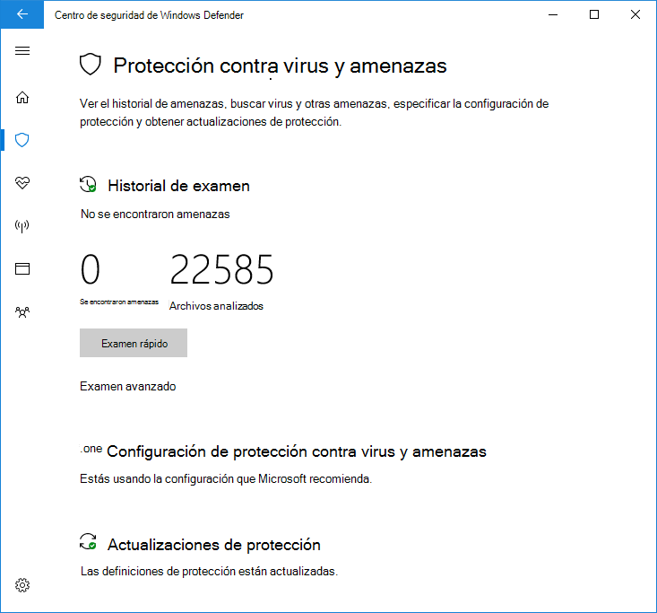

# Usar el análisis rápido limitado en el Antivirus de Windows Defender

[!INCLUDE [Microsoft 365 Defender rebranding](../../includes/microsoft-defender.md)]

**Se aplica a:**

- [Microsoft Defender para punto de conexión](/microsoft-365/security/defender-endpoint/)

El examen periódico limitado es un tipo especial de detección y corrección de amenazas que se puede habilitar cuando se instala otro producto antivirus en un Windows 10 dispositivo.

Solo se puede habilitar en determinadas situaciones. Para obtener más información sobre el examen periódico limitado y cómo Antivirus de Microsoft Defender con otros productos antivirus, [vea Antivirus de Microsoft Defender compatibilidad](microsoft-defender-antivirus-compatibility.md).

**Microsoft no recomienda usar esta característica en entornos empresariales. Esta es una característica destinada principalmente a los consumidores.** Esta característica solo usa un subconjunto limitado de las capacidades de Antivirus de Microsoft Defender para detectar malware y no podrá detectar la mayoría de malware y software potencialmente no deseado. Además, las capacidades de administración e informes serán limitadas. Microsoft recomienda a las empresas elegir su solución antivirus principal y usarla exclusivamente.

## Cómo habilitar el examen periódico limitado

De forma predeterminada, Antivirus de Microsoft Defender se habilitará en un dispositivo Windows 10 si no hay ningún otro producto antivirus instalado, o si el otro producto está des actualizado, expirado o no funciona correctamente.

Si Antivirus de Microsoft Defender está habilitado, aparecerán las opciones habituales para configurarlo en ese dispositivo:

Si otro producto antivirus está instalado y funciona correctamente, Antivirus de Microsoft Defender se deshabilitará a sí mismo. La aplicación Seguridad de Windows cambiará la sección Protección contra amenazas de **virus &** para mostrar el estado del producto antivirus y proporcionará un vínculo a las opciones de configuración del producto.

Debajo de cualquier producto ANTIVIRUS de terceros, aparecerá un nuevo vínculo como **Antivirus de Microsoft Defender opciones**. Al hacer clic en este vínculo, se expandirá para mostrar la alternancia que habilita el examen periódico limitado. Tenga en cuenta que la opción periódica limitada es una alternancia para habilitar o deshabilitar el examen periódico. 

Al deslizar el conmutador a **On,** se mostrarán las opciones estándar de Antivirus de Microsoft Defender debajo del producto ANTIVIRUS de terceros. La opción de examen periódico limitado aparecerá en la parte inferior de la página.

## Artículos relacionados

- [Configurar la protección en tiempo real, heurística y de comportamiento](configure-protection-features-microsoft-defender-antivirus.md)
- [Antivirus de Microsoft Defender en Windows 10](microsoft-defender-antivirus-in-windows-10.md)