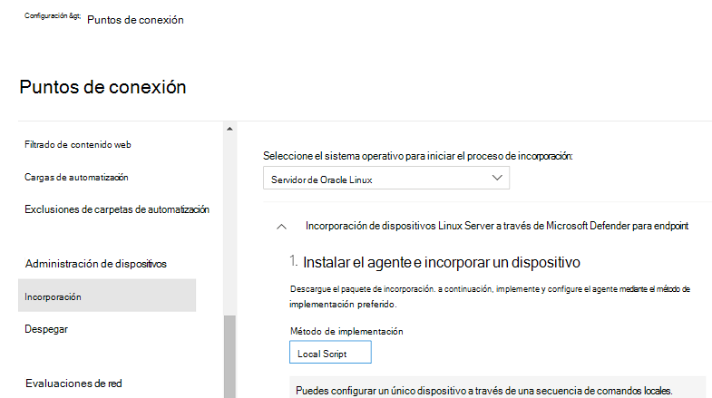

# <a name="deploy-microsoft-defender-for-endpoint-on-linux-manually"></a>Implementar Microsoft Defender para Endpoint en Linux manualmente

[!INCLUDE [Microsoft 365 Defender rebranding](../../includes/microsoft-defender.md)]


**Se aplica a:**
- [Microsoft Defender para punto de conexión Plan 2](https://go.microsoft.com/fwlink/p/?linkid=2154037)
- [Microsoft 365 Defender](https://go.microsoft.com/fwlink/?linkid=2118804)

> ¿Desea experimentar Defender for Endpoint? [Regístrese para obtener una prueba gratuita.](https://signup.microsoft.com/create-account/signup?products=7f379fee-c4f9-4278-b0a1-e4c8c2fcdf7e&ru=https://aka.ms/MDEp2OpenTrial?ocid=docs-wdatp-investigateip-abovefoldlink)


En este artículo se describe cómo implementar Microsoft Defender para Endpoint en Linux manualmente. Una implementación correcta requiere la finalización de todas las tareas siguientes:

  - [Requisitos previos y requisitos del sistema](#prerequisites-and-system-requirements)
  - [Configurar el repositorio de software de Linux](#configure-the-linux-software-repository)
    - [RHEL y variantes (CentOS, Fedora, Oracle Linux y Amazon Linux 2)](#rhel-and-variants-centos-fedora-oracle-linux-and-amazon-linux-2)
    - [SLES y variantes](#sles-and-variants)
    - [Sistemas Ubuntu y Debian](#ubuntu-and-debian-systems)
  - [Instalación de la aplicación](#application-installation)
  - [Descargar el paquete de incorporación](#download-the-onboarding-package)
  - [Configuración de cliente](#client-configuration)

## <a name="prerequisites-and-system-requirements"></a>Requisitos previos y requisitos del sistema

Antes de empezar, consulte [Microsoft Defender para Endpoint en Linux](microsoft-defender-endpoint-linux.md) para obtener una descripción de los requisitos previos y los requisitos del sistema para la versión de software actual.

> [!WARNING]
> La actualización del sistema operativo a una nueva versión principal después de la instalación del producto requiere que se vuelva a instalar el producto. Debes desinstalar [el](linux-resources.md#uninstall) Defender para Endpoint existente en Linux, actualizar el sistema operativo y, a continuación, volver a configurar Defender para Endpoint en Linux siguiendo los pasos siguientes.

## <a name="configure-the-linux-software-repository"></a>Configurar el repositorio de software de Linux

Defender para Endpoint en Linux se puede implementar desde uno de los siguientes canales (que se indican a continuación como *[canal]):* *insiders-fast*, *insiders-slow* o *prod*. Cada uno de estos canales corresponde a un repositorio de software de Linux. A continuación se proporcionan instrucciones para configurar el dispositivo para que use uno de estos repositorios.

La elección del canal determina el tipo y la frecuencia de las actualizaciones que se ofrecen al dispositivo. Los dispositivos *de insiders-fast* son los primeros en recibir actualizaciones y nuevas características, seguidos más adelante por *insiders-slow* y, por último, por *prod*.

Para obtener una vista previa de las nuevas características y proporcionar comentarios anticipados, se recomienda configurar algunos dispositivos de la empresa para que usen *insiders-fast* o *insiders-slow*.

> [!WARNING]
> Cambiar el canal después de la instalación inicial requiere que se vuelva a instalar el producto. Para cambiar el canal de producto: desinstale el paquete existente, vuelva a configurar el dispositivo para que use el nuevo canal y siga los pasos descritos en este documento para instalar el paquete desde la nueva ubicación.

### <a name="rhel-and-variants-centos-fedora-oracle-linux-and-amazon-linux-2"></a>RHEL y variantes (CentOS, Fedora, Oracle Linux y Amazon Linux 2)

- Instale `yum-utils` si aún no está instalado:

    ```bash
    sudo yum install yum-utils
    ```

  > [!NOTE]
  > La distribución y la versión, e identificar la entrada más cercana (por mayor y, a continuación, secundaria) para ella en `https://packages.microsoft.com/config/rhel/` .

    Use la siguiente tabla para ayudarle a localizar el paquete:

    <br>

    ****

    |Distro & versión|Paquete|
    |---|---|
    |Para RHEL/Centos/Oracle 8.0-8.5|<https://packages.microsoft.com/config/rhel/8/[channel].repo>|
    |Para RHEL/Centos/Oracle 7.2-7.9 & Amazon Linux 2 |<https://packages.microsoft.com/config/rhel/7/[channel].repo>|
    |Para RHEL/Centos 6.7-6.10|<https://packages.microsoft.com/config/rhel/6/[channel].repo>|
    |Para Fedora 33|<https://packages.microsoft.com/config/fedora/33/prod.repo>|
    |Para Fedora 34|<https://packages.microsoft.com/config/fedora/34/prod.repo>|

    En los siguientes comandos, reemplace *[versión]* y *[canal]* por la información que haya identificado:


    ```bash
    sudo yum-config-manager --add-repo=https://packages.microsoft.com/config/rhel/[version]/[channel].repo
    ```

    > [!TIP]
    > Use el comando hostnamectl para identificar información relacionada con el sistema, incluida la *versión [versión].*

    Por ejemplo, si ejecuta CentOS 7 y desea implementar Defender para Endpoint en Linux desde el *canal prod:*

    ```bash
    sudo yum-config-manager --add-repo=https://packages.microsoft.com/config/rhel/7/prod.repo
    ```

    O bien, si quieres explorar nuevas características en dispositivos seleccionados, es posible que quieras implementar Microsoft Defender para Endpoint en Linux en el canal *insiders-fast:*

    ```bash
    sudo yum-config-manager --add-repo=https://packages.microsoft.com/config/rhel/7/insiders-fast.repo
    ```

- Instalar la clave pública gpg de Microsoft:

    ```bash
    sudo rpm --import http://packages.microsoft.com/keys/microsoft.asc
    ```

### <a name="sles-and-variants"></a>SLES y variantes

> [!NOTE]
> La distribución y la versión, e identificar la entrada más cercana (por mayor y, a continuación, secundaria) para ella en `https://packages.microsoft.com/config/sles/` .

   En los siguientes comandos, reemplace *[distro]* y *[version]* por la información que haya identificado:

   ```bash
   sudo zypper addrepo -c -f -n microsoft-[channel] https://packages.microsoft.com/config/[distro]/[version]/[channel].repo
   ```

   > [!TIP]
   > Use el comando SPident para identificar información relacionada con el sistema, incluida la *versión [versión].*

   Por ejemplo, si ejecuta SLES 12 y desea implementar Microsoft Defender para Endpoint en Linux desde el *canal prod:*

   ```bash
   sudo zypper addrepo -c -f -n microsoft-prod https://packages.microsoft.com/config/sles/12/prod.repo
   ```

- Instalar la clave pública gpg de Microsoft:

    ```bash
    sudo rpm --import http://packages.microsoft.com/keys/microsoft.asc
    ```

### <a name="ubuntu-and-debian-systems"></a>Sistemas Ubuntu y Debian

- Instale `curl` si aún no está instalado:

    ```bash
    sudo apt-get install curl
    ```

- Instale `libplist-utils` si aún no está instalado:

    ```bash
    sudo apt-get install libplist-utils
    ```

> [!NOTE]
> La distribución y la versión, e identificar la entrada más cercana (por mayor y, a continuación, secundaria) para ella en `https://packages.microsoft.com/config/[distro]/` .

   En el comando siguiente, reemplace *[distro]* y *[versión]* por la información que haya identificado:

   ```bash
    curl -o microsoft.list https://packages.microsoft.com/config/[distro]/[version]/[channel].list
   ```

   > [!TIP]
   > Use el comando hostnamectl para identificar información relacionada con el sistema, incluida la *versión [versión].*

   Por ejemplo, si está ejecutando Ubuntu 18.04 y desea implementar Microsoft Defender para Endpoint en Linux desde el *canal prod:*

   ```bash
   curl -o microsoft.list https://packages.microsoft.com/config/ubuntu/18.04/prod.list
   ```

- Instale la configuración del repositorio:

    ```bash
    sudo mv ./microsoft.list /etc/apt/sources.list.d/microsoft-[channel].list
    ```

    Por ejemplo, si ha elegido *canal prod:*

    ```bash
    sudo mv ./microsoft.list /etc/apt/sources.list.d/microsoft-prod.list
    ```

- Instale el `gpg` paquete si aún no está instalado:

    ```bash
    sudo apt-get install gpg
    ```

  Si `gpg` no está disponible, instale `gnupg` .

    ```bash
    sudo apt-get install gnupg
    ```

- Instalar la clave pública gpg de Microsoft:

    ```bash
    curl https://packages.microsoft.com/keys/microsoft.asc | sudo apt-key add -
    ```

- Instale el controlador https si aún no está presente:

    ```bash
    sudo apt-get install apt-transport-https
    ```

- Actualice los metadatos del repositorio:

    ```bash
    sudo apt-get update
    ```

## <a name="application-installation"></a>Instalación de la aplicación

- RHEL y variantes (CentOS y Oracle Linux):

    ```bash
    sudo yum install mdatp
    ```

    > [!NOTE]
    > Si tienes varios repositorios de Microsoft configurados en el dispositivo, puedes ser específico sobre el repositorio desde el que instalar el paquete. En el ejemplo siguiente se muestra cómo instalar el paquete desde el canal si también tienes configurado el canal `production` de repositorio en este `insiders-fast` dispositivo. Esta situación puede ocurrir si usas varios productos de Microsoft en el dispositivo. Según la distribución y la versión del servidor, el alias de repositorio puede ser diferente al del ejemplo siguiente.

    ```bash
    # list all repositories
    yum repolist
    ```

    ```Output
    ...
    packages-microsoft-com-prod               packages-microsoft-com-prod        316
    packages-microsoft-com-prod-insiders-fast packages-microsoft-com-prod-ins      2
    ...
    ```

    ```bash
    # install the package from the production repository
    sudo yum --enablerepo=packages-microsoft-com-prod install mdatp
    ```

- SLES y variantes:

    ```bash
    sudo zypper install mdatp
    ```

    > [!NOTE]
    > Si tienes varios repositorios de Microsoft configurados en el dispositivo, puedes ser específico sobre el repositorio desde el que instalar el paquete. En el ejemplo siguiente se muestra cómo instalar el paquete desde el canal si también tienes configurado el canal `production` de repositorio en este `insiders-fast` dispositivo. Esta situación puede ocurrir si usas varios productos de Microsoft en el dispositivo.

    ```bash
    zypper repos
    ```

    ```Output
    ...
    #  | Alias | Name | ...
    XX | packages-microsoft-com-insiders-fast | microsoft-insiders-fast | ...
    XX | packages-microsoft-com-prod | microsoft-prod | ...
    ...

    ```

    ```bash
    sudo zypper install packages-microsoft-com-prod:mdatp
    ```

- Sistema Ubuntu y Debian:

    ```bash
    sudo apt-get install mdatp
    ```

    > [!NOTE]
    > Si tienes varios repositorios de Microsoft configurados en el dispositivo, puedes ser específico sobre el repositorio desde el que instalar el paquete. En el ejemplo siguiente se muestra cómo instalar el paquete desde el canal si también tienes configurado el canal `production` de repositorio en este `insiders-fast` dispositivo. Esta situación puede ocurrir si usas varios productos de Microsoft en el dispositivo.

    ```bash
    cat /etc/apt/sources.list.d/*
    ```

    ```Output
    deb [arch=arm64,armhf,amd64] https://packages.microsoft.com/config/ubuntu/18.04/prod insiders-fast main
    deb [arch=amd64] https://packages.microsoft.com/config/ubuntu/18.04/prod bionic main
    ```

    ```bash
    sudo apt -t bionic install mdatp
    ```

## <a name="download-the-onboarding-package"></a>Descargar el paquete de incorporación

Descargue el paquete de incorporación desde Microsoft 365 Defender portal.

> [!IMPORTANT]
> Si se pierde este paso, cualquier comando ejecutado mostrará un mensaje de advertencia que indica que el producto no tiene licencia. También el `mdatp health` comando devuelve un valor de `false` .

1. En el portal Microsoft 365 Defender, vaya **a Configuración > Endpoints > Administración** de dispositivos > Incorporación .
2. En el primer menú desplegable, seleccione **Linux Server** como sistema operativo. En el segundo menú desplegable, seleccione **Script local** como método de implementación.
3. Seleccione **Descargar paquete de incorporación**. Guarde el archivo como WindowsDefenderATPOnboardingPackage.zip.

    

4. Desde un símbolo del sistema, compruebe que tiene el archivo y extraiga el contenido del archivo:

    ```bash
    ls -l
    ```

    ```Output
    total 8
    -rw-r--r-- 1 test  staff  5752 Feb 18 11:22 WindowsDefenderATPOnboardingPackage.zip
    ```

    ```bash
    unzip WindowsDefenderATPOnboardingPackage.zip
    ```

    ```Output
    Archive:  WindowsDefenderATPOnboardingPackage.zip
    inflating: MicrosoftDefenderATPOnboardingLinuxServer.py
    ```

## <a name="client-configuration"></a>Configuración de clientes

1. Copia MicrosoftDefenderATPOnboardingLinuxServer.py en el dispositivo de destino.

    > [!NOTE]
    > Inicialmente, el dispositivo cliente no está asociado a una organización y el *atributo orgId* está en blanco.

    ```bash
    mdatp health --field org_id
    ```

2. Ejecute MicrosoftDefenderATPOnboardingLinuxServer.py.

    > [!NOTE]
    > Para ejecutar este comando, debes tener o instalar `python`  en el dispositivo según la versión y el `python3` disto. Si es necesario, consulte [Step-by-step Instruction for Installing Python on Linux](https://opensource.com/article/20/4/install-python-linux).
    
    Si estás ejecutando RHEL 8.x o Ubuntu 20.04 o posterior, deberás usar `python3` .

    ```bash
    sudo python3 MicrosoftDefenderATPOnboardingLinuxServer.py
    ```

    Para el resto de distros y versiones, deberá usar `python` .
    
    ```bash
    sudo python MicrosoftDefenderATPOnboardingLinuxServer.py
    ```
    
3. Compruebe que el dispositivo esté asociado a su organización e informe de un identificador de organización válido:

    ```bash
    mdatp health --field org_id
    ```

4. Compruebe el estado del producto ejecutando el siguiente comando. Un valor devuelto `1` de indica que el producto funciona como se esperaba:

    ```bash
    mdatp health --field healthy
    ```

    > [!IMPORTANT]
    > Cuando el producto se inicia por primera vez, descarga las definiciones de antimalware más recientes. Esto puede tardar hasta unos minutos en función de la conectividad de red. Durante este tiempo, el comando anterior devuelve un valor de `false` . Puede comprobar el estado de la actualización de definiciones con el siguiente comando:
    >
    > ```bash
    > mdatp health --field definitions_status
    > ```
    >
    > Tenga en cuenta que es posible que también necesite configurar un proxy después de completar la instalación inicial. Consulte [Configure Defender for Endpoint on Linux para la detección de proxy estático: configuración posterior a la instalación.](linux-static-proxy-configuration.md#post-installation-configuration)

5. Ejecute una prueba de detección de ANTIVIRUS para comprobar que el dispositivo está correctamente incorporado e informando al servicio. Realice los pasos siguientes en el dispositivo recién incorporado:

    - Asegúrese de que la protección en tiempo real está habilitada (se indica mediante el resultado de `1` la ejecución del siguiente comando):

        ```bash
        mdatp health --field real_time_protection_enabled
        ```

    - Abra una ventana de Terminal y ejecute el siguiente comando:

        ``` bash
        curl -o /tmp/eicar.com.txt https://www.eicar.org/download/eicar.com.txt
        ```

    - Defender for Endpoint en Linux debería haber puesto el archivo en cuarentena. Use el siguiente comando para enumerar todas las amenazas detectadas:

        ```bash
        mdatp threat list
        ```

6. Ejecute una EDR de detección y simule una detección para comprobar que el dispositivo está correctamente incorporado e informando al servicio. Realice los pasos siguientes en el dispositivo recién incorporado:

    - Compruebe que el servidor Linux incorporado aparezca en Microsoft 365 Defender. Si se trata de la primera incorporación de la máquina, puede tardar hasta 20 minutos hasta que aparezca.

    - Descargue y extraiga el [archivo de script](https://aka.ms/LinuxDIY) en un servidor Linux incorporado y ejecute el siguiente comando: `./mde_linux_edr_diy.sh`

    - Después de unos minutos, se debe generar una detección en Microsoft 365 Defender.

    - Vea los detalles de la alerta, la escala de tiempo de la máquina y realice los pasos de investigación típicos.

## <a name="installer-script"></a>Script del instalador

Como alternativa, puede usar un script bash del [instalador](https://github.com/microsoft/mdatp-xplat/blob/master/linux/installation/mde_installer.sh) automatizado proporcionado en nuestro [repositorio GitHub público](https://github.com/microsoft/mdatp-xplat/).
El script identifica la distribución y la versión, simplifica la selección del repositorio correcto, configura el dispositivo para extraer el paquete más reciente y combina los pasos de instalación e incorporación del producto.

```bash
❯ ./mde_installer.sh --help
usage: basename ./mde_installer.sh [OPTIONS]
Options:
-c|--channel      specify the channel from which you want to install. Default: insiders-fast
-i|--install      install the product
-r|--remove       remove the product
-u|--upgrade      upgrade the existing product
-o|--onboard      onboard/offboard the product with <onboarding_script>
-p|--passive-mode set EPP to passive mode
-t|--tag          set a tag by declaring <name> and <value>. ex: -t GROUP Coders
-m|--min_req      enforce minimum requirements
-w|--clean        remove repo from package manager for a specific channel
-v|--version      print out script version
-h|--help         display help
```

Lea más [aquí](https://github.com/microsoft/mdatp-xplat/tree/master/linux/installation).

## <a name="log-installation-issues"></a>Problemas de instalación del registro

Consulte [Problemas de instalación del registro](linux-resources.md#log-installation-issues) para obtener más información sobre cómo encontrar el registro generado automáticamente que crea el instalador cuando se produce un error.

## <a name="how-to-migrate-from-insiders-fast-to-production-channel"></a>Cómo migrar de Insiders-Fast al canal de producción

1. Desinstale la versión "Insiders-Fast channel" de Defender para Endpoint en Linux.

    ```bash
    sudo yum remove mdatp
    ```

1. Deshabilitar el repositorio de defender para endpoint en Linux Insiders-Fast linux

    ```bash
    sudo yum repolist
    ```

    > [!NOTE]
    > La salida debe mostrar "packages-microsoft-com-fast-prod".

    ```bash
    sudo yum-config-manager --disable packages-microsoft-com-fast-prod
    ```

1. Vuelva a implementar Microsoft Defender para Endpoint en Linux mediante el "Canal de producción".

## <a name="uninstallation"></a>Desinstalación

Consulta [Desinstalar para](linux-resources.md#uninstall) obtener más información sobre cómo quitar Defender for Endpoint en Linux de los dispositivos cliente.

## <a name="see-also"></a>Vea también

- [Investigar problemas de estado del agente](health-status.md)
