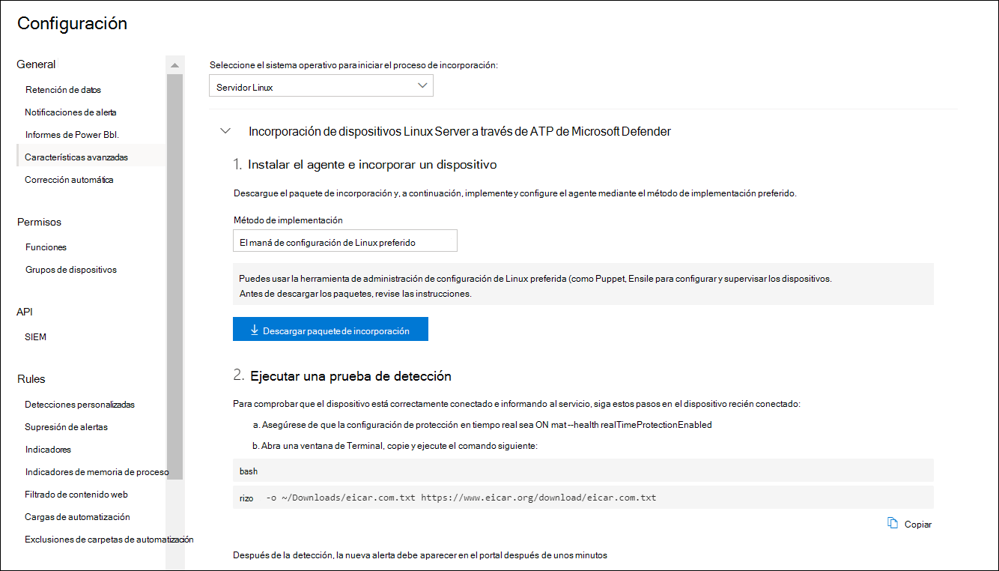

# <a name="deploy-microsoft-defender-for-endpoint-on-linux-with-ansible"></a><span data-ttu-id="e2859-104">Implementar Microsoft Defender para endpoint en Linux con Ansible</span><span class="sxs-lookup"><span data-stu-id="e2859-104">Deploy Microsoft Defender for Endpoint on Linux with Ansible</span></span>

[!INCLUDE [Microsoft 365 Defender rebranding](../../includes/microsoft-defender.md)]


<span data-ttu-id="e2859-105">**Se aplica a:**</span><span class="sxs-lookup"><span data-stu-id="e2859-105">**Applies to:**</span></span>
- [<span data-ttu-id="e2859-106">Microsoft Defender para punto de conexión</span><span class="sxs-lookup"><span data-stu-id="e2859-106">Microsoft Defender for Endpoint</span></span>](https://go.microsoft.com/fwlink/p/?linkid=2154037)
- [<span data-ttu-id="e2859-107">Microsoft 365 Defender</span><span class="sxs-lookup"><span data-stu-id="e2859-107">Microsoft 365 Defender</span></span>](https://go.microsoft.com/fwlink/?linkid=2118804)

> <span data-ttu-id="e2859-108">¿Desea experimentar Defender for Endpoint?</span><span class="sxs-lookup"><span data-stu-id="e2859-108">Want to experience Defender for Endpoint?</span></span> [<span data-ttu-id="e2859-109">Regístrate para obtener una versión de prueba gratuita.</span><span class="sxs-lookup"><span data-stu-id="e2859-109">Sign up for a free trial.</span></span>](https://www.microsoft.com/microsoft-365/windows/microsoft-defender-atp?ocid=docs-wdatp-investigateip-abovefoldlink)

<span data-ttu-id="e2859-110">En este artículo se describe cómo implementar Defender for Endpoint en Linux mediante Ansible.</span><span class="sxs-lookup"><span data-stu-id="e2859-110">This article describes how to deploy Defender for Endpoint on Linux using Ansible.</span></span> <span data-ttu-id="e2859-111">Una implementación correcta requiere la finalización de todas las tareas siguientes:</span><span class="sxs-lookup"><span data-stu-id="e2859-111">A successful deployment requires the completion of all of the following tasks:</span></span>

- [<span data-ttu-id="e2859-112">Descargar el paquete de incorporación</span><span class="sxs-lookup"><span data-stu-id="e2859-112">Download the onboarding package</span></span>](#download-the-onboarding-package)
- [<span data-ttu-id="e2859-113">Crear archivos YAML ansibles</span><span class="sxs-lookup"><span data-stu-id="e2859-113">Create Ansible YAML files</span></span>](#create-ansible-yaml-files)
- [<span data-ttu-id="e2859-114">Implementación</span><span class="sxs-lookup"><span data-stu-id="e2859-114">Deployment</span></span>](#deployment)
- [<span data-ttu-id="e2859-115">References</span><span class="sxs-lookup"><span data-stu-id="e2859-115">References</span></span>](#references)

## <a name="prerequisites-and-system-requirements"></a><span data-ttu-id="e2859-116">Requisitos previos y requisitos del sistema</span><span class="sxs-lookup"><span data-stu-id="e2859-116">Prerequisites and system requirements</span></span>

<span data-ttu-id="e2859-117">Antes de empezar, consulte la página principal defender para endpoint [en Linux](microsoft-defender-endpoint-linux.md) para obtener una descripción de los requisitos previos y los requisitos del sistema para la versión de software actual.</span><span class="sxs-lookup"><span data-stu-id="e2859-117">Before you get started, see [the main Defender for Endpoint on Linux page](microsoft-defender-endpoint-linux.md) for a description of prerequisites and system requirements for the current software version.</span></span>

<span data-ttu-id="e2859-118">Además, para la implementación de Ansible, debes familiarizarte con las tareas de administración de Ansible, configurar Ansible y saber cómo implementar libros de juegos y tareas.</span><span class="sxs-lookup"><span data-stu-id="e2859-118">In addition, for Ansible deployment, you need to be familiar with Ansible administration tasks, have Ansible configured, and know how to deploy playbooks and tasks.</span></span> <span data-ttu-id="e2859-119">Ansible tiene muchas formas de completar la misma tarea.</span><span class="sxs-lookup"><span data-stu-id="e2859-119">Ansible has many ways to complete the same task.</span></span> <span data-ttu-id="e2859-120">Estas instrucciones suponen la disponibilidad de módulos Ansible compatibles, como *aptos* y *norchivos* para ayudar a implementar el paquete.</span><span class="sxs-lookup"><span data-stu-id="e2859-120">These instructions assume availability of supported Ansible modules, such as *apt* and *unarchive* to help deploy the package.</span></span> <span data-ttu-id="e2859-121">Su organización puede usar un flujo de trabajo diferente.</span><span class="sxs-lookup"><span data-stu-id="e2859-121">Your organization might use a different workflow.</span></span> <span data-ttu-id="e2859-122">Consulte la [documentación de Ansible](https://docs.ansible.com/) para obtener más información.</span><span class="sxs-lookup"><span data-stu-id="e2859-122">Refer to the [Ansible documentation](https://docs.ansible.com/) for details.</span></span>

- <span data-ttu-id="e2859-123">Ansible debe instalarse en al menos un equipo (Ansible llama a este nodo de control).</span><span class="sxs-lookup"><span data-stu-id="e2859-123">Ansible needs to be installed on at least one computer (Ansible calls this the control node).</span></span>
- <span data-ttu-id="e2859-124">SSH debe configurarse para una cuenta de administrador entre el nodo de control y todos los nodos administrados (dispositivos que tendrán Instalado Defender for Endpoint) y se recomienda configurar con autenticación de clave pública.</span><span class="sxs-lookup"><span data-stu-id="e2859-124">SSH must be configured for an administrator account between the control node and all managed nodes (devices that will have Defender for Endpoint installed on them), and it is recommended to be configured with public key authentication.</span></span>
- <span data-ttu-id="e2859-125">El siguiente software debe instalarse en todos los nodos administrados:</span><span class="sxs-lookup"><span data-stu-id="e2859-125">The following software must be installed on all managed nodes:</span></span>
  - <span data-ttu-id="e2859-126">rizo</span><span class="sxs-lookup"><span data-stu-id="e2859-126">curl</span></span>
  - <span data-ttu-id="e2859-127">python-apt</span><span class="sxs-lookup"><span data-stu-id="e2859-127">python-apt</span></span>

- <span data-ttu-id="e2859-128">Todos los nodos administrados deben aparecer con el siguiente formato en el `/etc/ansible/hosts` archivo o correspondiente:</span><span class="sxs-lookup"><span data-stu-id="e2859-128">All managed nodes must be listed in the following format in the `/etc/ansible/hosts` or relevant file:</span></span>

    ```bash
    [servers]
    host1 ansible_ssh_host=10.171.134.39
    host2 ansible_ssh_host=51.143.50.51
    ```

- <span data-ttu-id="e2859-129">Prueba de ping:</span><span class="sxs-lookup"><span data-stu-id="e2859-129">Ping test:</span></span>

    ```bash
    ansible -m ping all
    ```

## <a name="download-the-onboarding-package"></a><span data-ttu-id="e2859-130">Descargar el paquete de incorporación</span><span class="sxs-lookup"><span data-stu-id="e2859-130">Download the onboarding package</span></span>

<span data-ttu-id="e2859-131">Descargue el paquete de incorporación desde Centro de seguridad de Microsoft Defender:</span><span class="sxs-lookup"><span data-stu-id="e2859-131">Download the onboarding package from Microsoft Defender Security Center:</span></span>

1. <span data-ttu-id="e2859-132">En Centro de seguridad de Microsoft Defender, vaya **a Configuración > Device Management > Onboarding**.</span><span class="sxs-lookup"><span data-stu-id="e2859-132">In Microsoft Defender Security Center, go to **Settings > Device Management > Onboarding**.</span></span>
2. <span data-ttu-id="e2859-133">En el primer menú desplegable, seleccione **Linux Server** como sistema operativo.</span><span class="sxs-lookup"><span data-stu-id="e2859-133">In the first drop-down menu, select **Linux Server** as the operating system.</span></span> <span data-ttu-id="e2859-134">En el segundo menú desplegable, seleccione **La herramienta de** administración de configuración de Linux preferida como método de implementación.</span><span class="sxs-lookup"><span data-stu-id="e2859-134">In the second drop-down menu, select **Your preferred Linux configuration management tool** as the deployment method.</span></span>
3. <span data-ttu-id="e2859-135">Seleccione **Descargar paquete de incorporación**.</span><span class="sxs-lookup"><span data-stu-id="e2859-135">Select **Download onboarding package**.</span></span> <span data-ttu-id="e2859-136">Guarde el archivo como WindowsDefenderATPOnboardingPackage.zip.</span><span class="sxs-lookup"><span data-stu-id="e2859-136">Save the file as WindowsDefenderATPOnboardingPackage.zip.</span></span>

    

4. <span data-ttu-id="e2859-138">Desde un símbolo del sistema, compruebe que tiene el archivo.</span><span class="sxs-lookup"><span data-stu-id="e2859-138">From a command prompt, verify that you have the file.</span></span> <span data-ttu-id="e2859-139">Extraiga el contenido del archivo:</span><span class="sxs-lookup"><span data-stu-id="e2859-139">Extract the contents of the archive:</span></span>

    ```bash
    ls -l
    ```
    ```Output
    total 8
    -rw-r--r-- 1 test  staff  4984 Feb 18 11:22 WindowsDefenderATPOnboardingPackage.zip
    ```
    ```bash
    unzip WindowsDefenderATPOnboardingPackage.zip
    ```
    ```Output
    Archive:  WindowsDefenderATPOnboardingPackage.zip
    inflating: mdatp_onboard.json
    ```

## <a name="create-ansible-yaml-files"></a><span data-ttu-id="e2859-140">Crear archivos YAML ansibles</span><span class="sxs-lookup"><span data-stu-id="e2859-140">Create Ansible YAML files</span></span>

<span data-ttu-id="e2859-141">Crea una subtarea o archivos de roles que contribuyan a un libro de juegos o una tarea.</span><span class="sxs-lookup"><span data-stu-id="e2859-141">Create a subtask or role files that contribute to a playbook or task.</span></span>

- <span data-ttu-id="e2859-142">Cree la tarea de `onboarding_setup.yml` incorporación:</span><span class="sxs-lookup"><span data-stu-id="e2859-142">Create the onboarding task, `onboarding_setup.yml`:</span></span>

    ```bash
    - name: Create MDATP directories
      file:
        path: /etc/opt/microsoft/mdatp/
        recurse: true
        state: directory
        mode: 0755
        owner: root
        group: root

    - name: Register mdatp_onboard.json
      stat:
        path: /etc/opt/microsoft/mdatp/mdatp_onboard.json
      register: mdatp_onboard

    - name: Extract WindowsDefenderATPOnboardingPackage.zip into /etc/opt/microsoft/mdatp
      unarchive:
        src: WindowsDefenderATPOnboardingPackage.zip
        dest: /etc/opt/microsoft/mdatp
        mode: 0600
        owner: root
        group: root
      when: not mdatp_onboard.stat.exists
    ```

- <span data-ttu-id="e2859-143">Agregue el repositorio y la clave defender para el `add_apt_repo.yml` extremo:</span><span class="sxs-lookup"><span data-stu-id="e2859-143">Add the Defender for Endpoint repository and key, `add_apt_repo.yml`:</span></span>

    <span data-ttu-id="e2859-144">Defender para Endpoint en Linux se puede implementar desde uno de los siguientes canales (que se indican a continuación como *[canal]):* *insiders-fast*, *insiders-slow* o *prod*. Cada uno de estos canales corresponde a un repositorio de software de Linux.</span><span class="sxs-lookup"><span data-stu-id="e2859-144">Defender for Endpoint on Linux can be deployed from one of the following channels (denoted below as *[channel]*): *insiders-fast*, *insiders-slow*, or *prod*. Each of these channels corresponds to a Linux software repository.</span></span>

    <span data-ttu-id="e2859-145">La elección del canal determina el tipo y la frecuencia de las actualizaciones que se ofrecen al dispositivo.</span><span class="sxs-lookup"><span data-stu-id="e2859-145">The choice of the channel determines the type and frequency of updates that are offered to your device.</span></span> <span data-ttu-id="e2859-146">Los dispositivos *de insiders-fast* son los primeros en recibir actualizaciones y nuevas características, seguidos más adelante por *insiders-slow* y, por último, por *prod*.</span><span class="sxs-lookup"><span data-stu-id="e2859-146">Devices in *insiders-fast* are the first ones to receive updates and new features, followed later by *insiders-slow* and lastly by *prod*.</span></span>

    <span data-ttu-id="e2859-147">Para obtener una vista previa de las nuevas características y proporcionar comentarios anticipados, se recomienda configurar algunos dispositivos de la empresa para que usen *insiders-fast* o *insiders-slow*.</span><span class="sxs-lookup"><span data-stu-id="e2859-147">In order to preview new features and provide early feedback, it is recommended that you configure some devices in your enterprise to use either *insiders-fast* or *insiders-slow*.</span></span>

    > [!WARNING]
    > <span data-ttu-id="e2859-148">Cambiar el canal después de la instalación inicial requiere que se vuelva a instalar el producto.</span><span class="sxs-lookup"><span data-stu-id="e2859-148">Switching the channel after the initial installation requires the product to be reinstalled.</span></span> <span data-ttu-id="e2859-149">Para cambiar el canal de producto: desinstale el paquete existente, vuelva a configurar el dispositivo para que use el nuevo canal y siga los pasos descritos en este documento para instalar el paquete desde la nueva ubicación.</span><span class="sxs-lookup"><span data-stu-id="e2859-149">To switch the product channel: uninstall the existing package, re-configure your device to use the new channel, and follow the steps in this document to install the package from the new location.</span></span>

    <span data-ttu-id="e2859-150">Tenga en cuenta la distribución y la versión e identifique la entrada más cercana para ella en `https://packages.microsoft.com/config/` .</span><span class="sxs-lookup"><span data-stu-id="e2859-150">Note your distribution and version and identify the closest entry for it under `https://packages.microsoft.com/config/`.</span></span>

    <span data-ttu-id="e2859-151">En los siguientes comandos, reemplace *[distro]* y *[version]* por la información que haya identificado.</span><span class="sxs-lookup"><span data-stu-id="e2859-151">In the following commands, replace *[distro]* and *[version]* with the information you've identified.</span></span>

    > [!NOTE]
    > <span data-ttu-id="e2859-152">En el caso de Oracle Linux, reemplace *[distro]* por "rhel".</span><span class="sxs-lookup"><span data-stu-id="e2859-152">In case of Oracle Linux, replace *[distro]* with “rhel”.</span></span>

  ```bash
  - name: Add Microsoft APT key
    apt_key:
      url: https://packages.microsoft.com/keys/microsoft.asc
      state: present
    when: ansible_os_family == "Debian"

  - name: Add Microsoft apt repository for MDATP
    apt_repository:
      repo: deb [arch=arm64,armhf,amd64] https://packages.microsoft.com/[distro]/[version]/prod [channel] main
      update_cache: yes
      state: present
      filename: microsoft-[channel]
    when: ansible_os_family == "Debian"

  - name: Add Microsoft DNF/YUM key
    rpm_key:
      state: present
      key: https://packages.microsoft.com/keys/microsoft.asc
    when: ansible_os_family == "RedHat"

  - name: Add  Microsoft yum repository for MDATP
    yum_repository:
      name: packages-microsoft-com-prod-[channel]
      description: Microsoft Defender for Endpoint
      file: microsoft-[channel]
      baseurl: https://packages.microsoft.com/[distro]/[version]/[channel]/
      gpgcheck: yes
      enabled: Yes
    when: ansible_os_family == "RedHat"
  ```

- <span data-ttu-id="e2859-153">Cree los archivos YAML de instalación y desinstalación de Ansible.</span><span class="sxs-lookup"><span data-stu-id="e2859-153">Create the Ansible install and uninstall YAML files.</span></span>

    - <span data-ttu-id="e2859-154">Para las distribuciones basadas en apt, use el siguiente archivo YAML:</span><span class="sxs-lookup"><span data-stu-id="e2859-154">For apt-based distributions use the following YAML file:</span></span>

        ```bash
        cat install_mdatp.yml
        ```
        ```Output
        - hosts: servers
          tasks:
            - include: ../roles/onboarding_setup.yml
            - include: ../roles/add_apt_repo.yml
            - name: Install MDATP
              apt:
                name: mdatp
                state: latest
                update_cache: yes
        ```

        ```bash
        cat uninstall_mdatp.yml
        ```
        ```Output
        - hosts: servers
          tasks:
            - name: Uninstall MDATP
              apt:
                name: mdatp
                state: absent
        ```

    - <span data-ttu-id="e2859-155">Para las distribuciones basadas en dnf, use el siguiente archivo YAML:</span><span class="sxs-lookup"><span data-stu-id="e2859-155">For dnf-based distributions use the following YAML file:</span></span>

        ```bash
        cat install_mdatp_dnf.yml
        ```
        ```Output
        - hosts: servers
          tasks:
            - include: ../roles/onboarding_setup.yml
            - include: ../roles/add_yum_repo.yml
            - name: Install MDATP
              dnf:
                name: mdatp
                state: latest
                enablerepo: packages-microsoft-com-prod-[channel]
        ```

        ```bash
        cat uninstall_mdatp_dnf.yml
        ```
        ```Output
        - hosts: servers
          tasks:
            - name: Uninstall MDATP
              dnf:
                name: mdatp
                state: absent
        ```

## <a name="deployment"></a><span data-ttu-id="e2859-156">Implementación</span><span class="sxs-lookup"><span data-stu-id="e2859-156">Deployment</span></span>

<span data-ttu-id="e2859-157">Ahora ejecute los archivos de tareas en `/etc/ansible/playbooks/` el directorio correspondiente o en el directorio correspondiente.</span><span class="sxs-lookup"><span data-stu-id="e2859-157">Now run the tasks files under `/etc/ansible/playbooks/` or relevant directory.</span></span>

- <span data-ttu-id="e2859-158">Instalación:</span><span class="sxs-lookup"><span data-stu-id="e2859-158">Installation:</span></span>

    ```bash
    ansible-playbook /etc/ansible/playbooks/install_mdatp.yml -i /etc/ansible/hosts
    ```

> [!IMPORTANT]
> <span data-ttu-id="e2859-159">Cuando el producto se inicia por primera vez, descarga las definiciones de antimalware más recientes.</span><span class="sxs-lookup"><span data-stu-id="e2859-159">When the product starts for the first time, it downloads the latest antimalware definitions.</span></span> <span data-ttu-id="e2859-160">Según la conexión a Internet, esto puede tardar unos minutos.</span><span class="sxs-lookup"><span data-stu-id="e2859-160">Depending on your Internet connection, this can take up to a few minutes.</span></span>

- <span data-ttu-id="e2859-161">Validación/configuración:</span><span class="sxs-lookup"><span data-stu-id="e2859-161">Validation/configuration:</span></span>

    ```bash
    ansible -m shell -a 'mdatp connectivity test' all
    ```
    ```bash
    ansible -m shell -a 'mdatp health' all
    ```

- <span data-ttu-id="e2859-162">Desinstalación:</span><span class="sxs-lookup"><span data-stu-id="e2859-162">Uninstallation:</span></span>

    ```bash
    ansible-playbook /etc/ansible/playbooks/uninstall_mdatp.yml -i /etc/ansible/hosts
    ```

## <a name="log-installation-issues"></a><span data-ttu-id="e2859-163">Problemas de instalación del registro</span><span class="sxs-lookup"><span data-stu-id="e2859-163">Log installation issues</span></span>

<span data-ttu-id="e2859-164">Consulte [Problemas de instalación del registro](linux-resources.md#log-installation-issues) para obtener más información sobre cómo encontrar el registro generado automáticamente que crea el instalador cuando se produce un error.</span><span class="sxs-lookup"><span data-stu-id="e2859-164">See [Log installation issues](linux-resources.md#log-installation-issues) for more information on how to find the automatically generated log that is created by the installer when an error occurs.</span></span>

## <a name="operating-system-upgrades"></a><span data-ttu-id="e2859-165">Actualizaciones del sistema operativo</span><span class="sxs-lookup"><span data-stu-id="e2859-165">Operating system upgrades</span></span>

<span data-ttu-id="e2859-166">Al actualizar el sistema operativo a una nueva versión principal, primero debes desinstalar Defender para Endpoint en Linux, instalar la actualización y, por último, volver a configurar Defender para Endpoint en Linux en el dispositivo.</span><span class="sxs-lookup"><span data-stu-id="e2859-166">When upgrading your operating system to a new major version, you must first uninstall Defender for Endpoint on Linux, install the upgrade, and finally reconfigure Defender for Endpoint on Linux on your device.</span></span>

## <a name="references"></a><span data-ttu-id="e2859-167">Referencias</span><span class="sxs-lookup"><span data-stu-id="e2859-167">References</span></span>

- [<span data-ttu-id="e2859-168">Agregar o quitar repositorios de YUM</span><span class="sxs-lookup"><span data-stu-id="e2859-168">Add or remove YUM repositories</span></span>](https://docs.ansible.com/ansible/latest/collections/ansible/builtin/yum_repository_module.html)

- [<span data-ttu-id="e2859-169">Administrar paquetes con el administrador de paquetes dnf</span><span class="sxs-lookup"><span data-stu-id="e2859-169">Manage packages with the dnf package manager</span></span>](https://docs.ansible.com/ansible/latest/collections/ansible/builtin/dnf_module.html)

- [<span data-ttu-id="e2859-170">Agregar y quitar repositorios de APT</span><span class="sxs-lookup"><span data-stu-id="e2859-170">Add and remove APT repositories</span></span>](https://docs.ansible.com/ansible/latest/collections/ansible/builtin/apt_repository_module.html)

- [<span data-ttu-id="e2859-171">Administrar paquetes aptos</span><span class="sxs-lookup"><span data-stu-id="e2859-171">Manage apt-packages</span></span>](https://docs.ansible.com/ansible/latest/collections/ansible/builtin/apt_module.html)

## <a name="see-also"></a><span data-ttu-id="e2859-172">Consulte también</span><span class="sxs-lookup"><span data-stu-id="e2859-172">See also</span></span>
- [<span data-ttu-id="e2859-173">Investigar problemas de estado del agente</span><span class="sxs-lookup"><span data-stu-id="e2859-173">Investigate agent health issues</span></span>](health-status.md)
