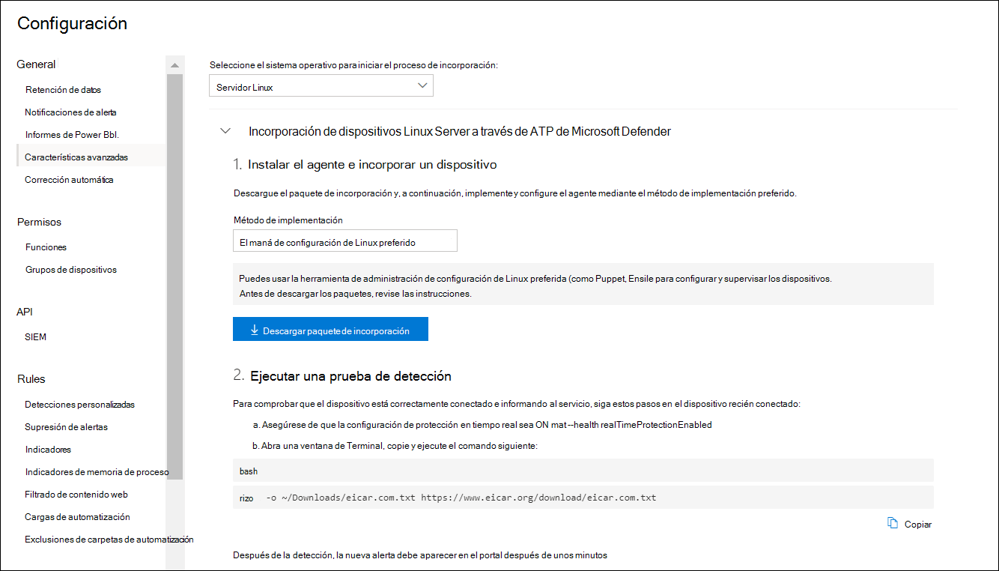

# <a name="deploy-microsoft-defender-for-endpoint-for-linux-with-puppet"></a><span data-ttu-id="2392e-104">Implementar Microsoft Defender para endpoint para Linux con Puppet</span><span class="sxs-lookup"><span data-stu-id="2392e-104">Deploy Microsoft Defender for Endpoint for Linux with Puppet</span></span>

[!INCLUDE [Microsoft 365 Defender rebranding](../../includes/microsoft-defender.md)]


<span data-ttu-id="2392e-105">**Se aplica a:**</span><span class="sxs-lookup"><span data-stu-id="2392e-105">**Applies to:**</span></span>
- [<span data-ttu-id="2392e-106">Microsoft Defender para punto de conexión</span><span class="sxs-lookup"><span data-stu-id="2392e-106">Microsoft Defender for Endpoint</span></span>](https://go.microsoft.com/fwlink/p/?linkid=2154037)
- [<span data-ttu-id="2392e-107">Microsoft 365 Defender</span><span class="sxs-lookup"><span data-stu-id="2392e-107">Microsoft 365 Defender</span></span>](https://go.microsoft.com/fwlink/?linkid=2118804)

> <span data-ttu-id="2392e-108">¿Desea experimentar Defender for Endpoint?</span><span class="sxs-lookup"><span data-stu-id="2392e-108">Want to experience Defender for Endpoint?</span></span> [<span data-ttu-id="2392e-109">Regístrate para obtener una versión de prueba gratuita.</span><span class="sxs-lookup"><span data-stu-id="2392e-109">Sign up for a free trial.</span></span>](https://www.microsoft.com/microsoft-365/windows/microsoft-defender-atp?ocid=docs-wdatp-investigateip-abovefoldlink)

<span data-ttu-id="2392e-110">En este artículo se describe cómo implementar Defender for Endpoint for Linux con Puppet.</span><span class="sxs-lookup"><span data-stu-id="2392e-110">This article describes how to deploy Defender for Endpoint for Linux using Puppet.</span></span> <span data-ttu-id="2392e-111">Una implementación correcta requiere la finalización de todas las tareas siguientes:</span><span class="sxs-lookup"><span data-stu-id="2392e-111">A successful deployment requires the completion of all of the following tasks:</span></span>

- [<span data-ttu-id="2392e-112">Descargar el paquete de incorporación</span><span class="sxs-lookup"><span data-stu-id="2392e-112">Download the onboarding package</span></span>](#download-the-onboarding-package)
- [<span data-ttu-id="2392e-113">Crear manifiesto de Puppet</span><span class="sxs-lookup"><span data-stu-id="2392e-113">Create Puppet manifest</span></span>](#create-a-puppet-manifest)
- [<span data-ttu-id="2392e-114">Implementación</span><span class="sxs-lookup"><span data-stu-id="2392e-114">Deployment</span></span>](#deployment)
- [<span data-ttu-id="2392e-115">Comprobar el estado de incorporación</span><span class="sxs-lookup"><span data-stu-id="2392e-115">Check onboarding status</span></span>](#check-onboarding-status)

## <a name="prerequisites-and-system-requirements"></a><span data-ttu-id="2392e-116">Requisitos previos y requisitos del sistema</span><span class="sxs-lookup"><span data-stu-id="2392e-116">Prerequisites and system requirements</span></span>

 <span data-ttu-id="2392e-117">Para obtener una descripción de los requisitos previos y los requisitos del sistema para la versión de software actual, vea la página principal [defender para endpoint para Linux](microsoft-defender-endpoint-linux.md).</span><span class="sxs-lookup"><span data-stu-id="2392e-117">For a description of prerequisites and system requirements for the current software version, see [the main Defender for Endpoint for Linux page](microsoft-defender-endpoint-linux.md).</span></span>

<span data-ttu-id="2392e-118">Además, para la implementación de Puppet, debes familiarizarte con las tareas de administración de Puppet, configurar Puppet y saber cómo implementar paquetes.</span><span class="sxs-lookup"><span data-stu-id="2392e-118">In addition, for Puppet deployment, you need to be familiar with Puppet administration tasks, have Puppet configured, and know how to deploy packages.</span></span> <span data-ttu-id="2392e-119">Puppet tiene muchas maneras de completar la misma tarea.</span><span class="sxs-lookup"><span data-stu-id="2392e-119">Puppet has many ways to complete the same task.</span></span> <span data-ttu-id="2392e-120">Estas instrucciones suponen la disponibilidad de módulos de Puppet compatibles, como *aptos* para ayudar a implementar el paquete.</span><span class="sxs-lookup"><span data-stu-id="2392e-120">These instructions assume availability of supported Puppet modules, such as *apt* to help deploy the package.</span></span> <span data-ttu-id="2392e-121">Su organización puede usar un flujo de trabajo diferente.</span><span class="sxs-lookup"><span data-stu-id="2392e-121">Your organization might use a different workflow.</span></span> <span data-ttu-id="2392e-122">Consulte la documentación [de Puppet](https://puppet.com/docs) para obtener más información.</span><span class="sxs-lookup"><span data-stu-id="2392e-122">Refer to the [Puppet documentation](https://puppet.com/docs) for details.</span></span>

## <a name="download-the-onboarding-package"></a><span data-ttu-id="2392e-123">Descargar el paquete de incorporación</span><span class="sxs-lookup"><span data-stu-id="2392e-123">Download the onboarding package</span></span>

<span data-ttu-id="2392e-124">Descargue el paquete de incorporación del Centro de seguridad de Microsoft Defender:</span><span class="sxs-lookup"><span data-stu-id="2392e-124">Download the onboarding package from Microsoft Defender Security Center:</span></span>

1. <span data-ttu-id="2392e-125">En el Centro de seguridad de Microsoft Defender, vaya **a Configuración > Administración de dispositivos > incorporación**.</span><span class="sxs-lookup"><span data-stu-id="2392e-125">In Microsoft Defender Security Center, go to **Settings > Device Management > Onboarding**.</span></span>
2. <span data-ttu-id="2392e-126">En el primer menú desplegable, seleccione **Linux Server** como sistema operativo.</span><span class="sxs-lookup"><span data-stu-id="2392e-126">In the first drop-down menu, select **Linux Server** as the operating system.</span></span> <span data-ttu-id="2392e-127">En el segundo menú desplegable, seleccione **La herramienta de** administración de configuración de Linux preferida como método de implementación.</span><span class="sxs-lookup"><span data-stu-id="2392e-127">In the second drop-down menu, select **Your preferred Linux configuration management tool** as the deployment method.</span></span>
3. <span data-ttu-id="2392e-128">Seleccione **Descargar paquete de incorporación**.</span><span class="sxs-lookup"><span data-stu-id="2392e-128">Select **Download onboarding package**.</span></span> <span data-ttu-id="2392e-129">Guarde el archivo como WindowsDefenderATPOnboardingPackage.zip.</span><span class="sxs-lookup"><span data-stu-id="2392e-129">Save the file as WindowsDefenderATPOnboardingPackage.zip.</span></span>

    

4. <span data-ttu-id="2392e-131">Desde un símbolo del sistema, compruebe que tiene el archivo.</span><span class="sxs-lookup"><span data-stu-id="2392e-131">From a command prompt, verify that you have the file.</span></span> 

    ```bash
    ls -l
    ```
    ```Output
    total 8
    -rw-r--r-- 1 test  staff  4984 Feb 18 11:22 WindowsDefenderATPOnboardingPackage.zip
    ```
5. <span data-ttu-id="2392e-132">Extraiga el contenido del archivo.</span><span class="sxs-lookup"><span data-stu-id="2392e-132">Extract the contents of the archive.</span></span>
    ```bash
    unzip WindowsDefenderATPOnboardingPackage.zip
    ```
    ```Output
    Archive:  WindowsDefenderATPOnboardingPackage.zip
    inflating: mdatp_onboard.json
    ```

## <a name="create-a-puppet-manifest"></a><span data-ttu-id="2392e-133">Crear un manifiesto de Puppet</span><span class="sxs-lookup"><span data-stu-id="2392e-133">Create a Puppet manifest</span></span>

<span data-ttu-id="2392e-134">Debes crear un manifiesto de Puppet para implementar Defender para Endpoint para Linux en dispositivos administrados por un servidor Desatensado.</span><span class="sxs-lookup"><span data-stu-id="2392e-134">You need to create a Puppet manifest for deploying Defender for Endpoint for Linux to devices managed by a Puppet server.</span></span> <span data-ttu-id="2392e-135">En este ejemplo se usa los módulos *apt* y *yumrepo* disponibles en los puppetlabs y se supone que los módulos se han instalado en el servidor de Puppet.</span><span class="sxs-lookup"><span data-stu-id="2392e-135">This example makes use of the *apt* and *yumrepo* modules available from puppetlabs, and assumes that the modules have been installed on your Puppet server.</span></span>

<span data-ttu-id="2392e-136">Crea las *carpetas install_mdatp/archivos* *y install_mdatp/manifiestos* en la carpeta módulos de la instalación de Puppet.</span><span class="sxs-lookup"><span data-stu-id="2392e-136">Create the folders *install_mdatp/files* and *install_mdatp/manifests* under the modules folder of your Puppet installation.</span></span> <span data-ttu-id="2392e-137">Esta carpeta normalmente se encuentra *en /etc/puppetlabs/code/environments/production/modules* en el servidor de Puppet.</span><span class="sxs-lookup"><span data-stu-id="2392e-137">This folder is typically located in */etc/puppetlabs/code/environments/production/modules* on your Puppet server.</span></span> <span data-ttu-id="2392e-138">Copie el archivo mdatp_onboard.jsen creado anteriormente en la *carpeta install_mdatp/archivos.*</span><span class="sxs-lookup"><span data-stu-id="2392e-138">Copy the mdatp_onboard.json file created above to the *install_mdatp/files* folder.</span></span> <span data-ttu-id="2392e-139">Crear un *init.pp*</span><span class="sxs-lookup"><span data-stu-id="2392e-139">Create an *init.pp*</span></span> <span data-ttu-id="2392e-140">que contiene las instrucciones de implementación:</span><span class="sxs-lookup"><span data-stu-id="2392e-140">file that contains the deployment instructions:</span></span>

```bash
pwd
```
```Output
/etc/puppetlabs/code/environments/production/modules
```

```bash
tree install_mdatp
```
```Output
install_mdatp
├── files
│   └── mdatp_onboard.json
└── manifests
    └── init.pp
```

### <a name="contents-of-install_mdatpmanifestsinitpp"></a><span data-ttu-id="2392e-141">Contenido de `install_mdatp/manifests/init.pp`</span><span class="sxs-lookup"><span data-stu-id="2392e-141">Contents of `install_mdatp/manifests/init.pp`</span></span>

<span data-ttu-id="2392e-142">Defender para Endpoint para Linux se puede implementar desde uno de los siguientes canales (que se indican a continuación como *[channel]):* *insiders-fast*, *insiders-slow* o *prod*. Cada uno de estos canales corresponde a un repositorio de software de Linux.</span><span class="sxs-lookup"><span data-stu-id="2392e-142">Defender for Endpoint for Linux can be deployed from one of the following channels (denoted below as *[channel]*): *insiders-fast*, *insiders-slow*, or *prod*. Each of these channels corresponds to a Linux software repository.</span></span>

<span data-ttu-id="2392e-143">La elección del canal determina el tipo y la frecuencia de las actualizaciones que se ofrecen al dispositivo.</span><span class="sxs-lookup"><span data-stu-id="2392e-143">The choice of the channel determines the type and frequency of updates that are offered to your device.</span></span> <span data-ttu-id="2392e-144">Los dispositivos *de insiders-fast* son los primeros en recibir actualizaciones y nuevas características, seguidos más adelante por *insiders-slow* y, por último, por *prod*.</span><span class="sxs-lookup"><span data-stu-id="2392e-144">Devices in *insiders-fast* are the first ones to receive updates and new features, followed later by *insiders-slow* and lastly by *prod*.</span></span>

<span data-ttu-id="2392e-145">Para obtener una vista previa de las nuevas características y proporcionar comentarios anticipados, se recomienda configurar algunos dispositivos de la empresa para que usen *insiders-fast* o *insiders-slow*.</span><span class="sxs-lookup"><span data-stu-id="2392e-145">In order to preview new features and provide early feedback, it is recommended that you configure some devices in your enterprise to use either *insiders-fast* or *insiders-slow*.</span></span>

> [!WARNING]
> <span data-ttu-id="2392e-146">Cambiar el canal después de la instalación inicial requiere que se vuelva a instalar el producto.</span><span class="sxs-lookup"><span data-stu-id="2392e-146">Switching the channel after the initial installation requires the product to be reinstalled.</span></span> <span data-ttu-id="2392e-147">Para cambiar el canal de producto: desinstale el paquete existente, vuelva a configurar el dispositivo para que use el nuevo canal y siga los pasos descritos en este documento para instalar el paquete desde la nueva ubicación.</span><span class="sxs-lookup"><span data-stu-id="2392e-147">To switch the product channel: uninstall the existing package, re-configure your device to use the new channel, and follow the steps in this document to install the package from the new location.</span></span>

<span data-ttu-id="2392e-148">Tenga en cuenta la distribución y la versión e identifique la entrada más cercana para ella en `https://packages.microsoft.com/config/` .</span><span class="sxs-lookup"><span data-stu-id="2392e-148">Note your distribution and version and identify the closest entry for it under `https://packages.microsoft.com/config/`.</span></span>

<span data-ttu-id="2392e-149">En los comandos siguientes, reemplace *[distro]* y *[version]* por la información que haya identificado:</span><span class="sxs-lookup"><span data-stu-id="2392e-149">In the below commands, replace *[distro]* and *[version]* with the information you've identified:</span></span>

> [!NOTE]
> <span data-ttu-id="2392e-150">En el caso de RedHat, Oracle EL y CentOS 8, reemplace *[distro]* por 'rhel'.</span><span class="sxs-lookup"><span data-stu-id="2392e-150">In case of RedHat, Oracle EL, and CentOS 8, replace *[distro]* with 'rhel'.</span></span>

```puppet
# Puppet manifest to install Microsoft Defender ATP.
# @param channel The release channel based on your environment, insider-fast or prod.
# @param distro The Linux distribution in lowercase. In case of RedHat, Oracle EL, and CentOS 8, the distro variable should be 'rhel'.
# @param version The Linux distribution release number, e.g. 7.4.

class install_mdatp (
$channel = 'insiders-fast',
$distro = undef,
$version = undef
){
    case $::osfamily {
        'Debian' : {
            apt::source { 'microsoftpackages' :
                location => "https://packages.microsoft.com/${distro}/${version}/prod",
                release  => $channel,
                repos    => 'main',
                key      => {
                    'id'     => 'BC528686B50D79E339D3721CEB3E94ADBE1229CF',
                    'server' => 'keyserver.ubuntu.com',
                },
            }
        }
        'RedHat' : {
            yumrepo { 'microsoftpackages' :
                baseurl  => "https://packages.microsoft.com/${distro}/${version}/${channel}",
                descr    => "packages-microsoft-com-prod-${channel}",
                enabled  => 1,
                gpgcheck => 1,
                gpgkey   => 'https://packages.microsoft.com/keys/microsoft.asc'
            }
        }
        default : { fail("${::osfamily} is currently not supported.") }
    }

    case $::osfamily {
        /(Debian|RedHat)/: {
            file { ['/etc/opt', '/etc/opt/microsoft', '/etc/opt/microsoft/mdatp']:
                ensure => directory,
                owner  => root,
                group  => root,
                mode   => '0755'
            }

            file { '/etc/opt/microsoft/mdatp/mdatp_onboard.json':
                source  => 'puppet:///modules/install_mdatp/mdatp_onboard.json',
                owner   => root,
                group   => root,
                mode    => '0600',
                require => File['/etc/opt/microsoft/mdatp']
            }

            package { 'mdatp':
                ensure  => 'installed',
                require => File['/etc/opt/microsoft/mdatp/mdatp_onboard.json']
            }
        }
        default : { fail("${::osfamily} is currently not supported.") }
    }
}
```

## <a name="deployment"></a><span data-ttu-id="2392e-151">Implementación</span><span class="sxs-lookup"><span data-stu-id="2392e-151">Deployment</span></span>

<span data-ttu-id="2392e-152">Incluir el manifiesto anterior en su site.pp</span><span class="sxs-lookup"><span data-stu-id="2392e-152">Include the above manifest in your site.pp</span></span> <span data-ttu-id="2392e-153">archivo:</span><span class="sxs-lookup"><span data-stu-id="2392e-153">file:</span></span>

```bash
cat /etc/puppetlabs/code/environments/production/manifests/site.pp
```
```Output
node "default" {
    include install_mdatp
}
```

<span data-ttu-id="2392e-154">Los dispositivos de agente inscritos sondean periódicamente el servidor de Puppet e instalan nuevos perfiles y directivas de configuración tan pronto como se detectan.</span><span class="sxs-lookup"><span data-stu-id="2392e-154">Enrolled agent devices periodically poll the Puppet Server and install new configuration profiles and policies as soon as they are detected.</span></span>

## <a name="monitor-puppet-deployment"></a><span data-ttu-id="2392e-155">Supervisar la implementación de Puppet</span><span class="sxs-lookup"><span data-stu-id="2392e-155">Monitor Puppet deployment</span></span>

<span data-ttu-id="2392e-156">En el dispositivo de agente, también puedes comprobar el estado de incorporación ejecutando:</span><span class="sxs-lookup"><span data-stu-id="2392e-156">On the agent device, you can also check the onboarding status by running:</span></span>

```bash
mdatp health
```
```Output
...
licensed                                : true
org_id                                  : "[your organization identifier]"
...
```

- <span data-ttu-id="2392e-157">**licencia:** esto confirma que el dispositivo está vinculado a su organización.</span><span class="sxs-lookup"><span data-stu-id="2392e-157">**licensed**: This confirms that the device is tied to your organization.</span></span>

- <span data-ttu-id="2392e-158">**orgId:** este es el identificador de la organización Defender for Endpoint.</span><span class="sxs-lookup"><span data-stu-id="2392e-158">**orgId**: This is your Defender for Endpoint organization identifier.</span></span>

## <a name="check-onboarding-status"></a><span data-ttu-id="2392e-159">Comprobar el estado de incorporación</span><span class="sxs-lookup"><span data-stu-id="2392e-159">Check onboarding status</span></span>

<span data-ttu-id="2392e-160">Puedes comprobar que los dispositivos se han incorporado correctamente mediante la creación de un script.</span><span class="sxs-lookup"><span data-stu-id="2392e-160">You can check that devices have been correctly onboarded by creating a script.</span></span> <span data-ttu-id="2392e-161">Por ejemplo, el siguiente script comprueba el estado de incorporación de los dispositivos inscritos:</span><span class="sxs-lookup"><span data-stu-id="2392e-161">For example, the following script checks enrolled devices for onboarding status:</span></span>

```bash
mdatp health --field healthy
```

<span data-ttu-id="2392e-162">El comando anterior imprime si el producto está incorporado y `1` funciona según lo esperado.</span><span class="sxs-lookup"><span data-stu-id="2392e-162">The above command prints `1` if the product is onboarded and functioning as expected.</span></span>

> [!IMPORTANT]
> <span data-ttu-id="2392e-163">Cuando el producto se inicia por primera vez, descarga las definiciones de antimalware más recientes.</span><span class="sxs-lookup"><span data-stu-id="2392e-163">When the product starts for the first time, it downloads the latest antimalware definitions.</span></span> <span data-ttu-id="2392e-164">Según la conexión a Internet, esto puede tardar unos minutos.</span><span class="sxs-lookup"><span data-stu-id="2392e-164">Depending on your Internet connection, this can take up to a few minutes.</span></span> <span data-ttu-id="2392e-165">Durante este tiempo, el comando anterior devuelve un valor de `0` .</span><span class="sxs-lookup"><span data-stu-id="2392e-165">During this time the above command returns a value of `0`.</span></span>

<span data-ttu-id="2392e-166">Si el producto no está en buen estado, el código de salida (que se puede `echo $?` comprobar) indica el problema:</span><span class="sxs-lookup"><span data-stu-id="2392e-166">If the product is not healthy, the exit code (which can be checked through `echo $?`) indicates the problem:</span></span>

- <span data-ttu-id="2392e-167">1 si el dispositivo aún no está incorporado.</span><span class="sxs-lookup"><span data-stu-id="2392e-167">1 if the device isn't onboarded yet.</span></span>
- <span data-ttu-id="2392e-168">3 si no se puede establecer la conexión con el demonio.</span><span class="sxs-lookup"><span data-stu-id="2392e-168">3 if the connection to the daemon cannot be established.</span></span>

## <a name="log-installation-issues"></a><span data-ttu-id="2392e-169">Problemas de instalación del registro</span><span class="sxs-lookup"><span data-stu-id="2392e-169">Log installation issues</span></span>

 <span data-ttu-id="2392e-170">Para obtener más información sobre cómo buscar el registro generado automáticamente por el instalador cuando se produce un error, vea [Log installation issues](linux-resources.md#log-installation-issues).</span><span class="sxs-lookup"><span data-stu-id="2392e-170">For more information on how to find the automatically generated log that is created by the installer when an error occurs, see [Log installation issues](linux-resources.md#log-installation-issues).</span></span>

## <a name="operating-system-upgrades"></a><span data-ttu-id="2392e-171">Actualizaciones del sistema operativo</span><span class="sxs-lookup"><span data-stu-id="2392e-171">Operating system upgrades</span></span>

<span data-ttu-id="2392e-172">Al actualizar el sistema operativo a una nueva versión principal, primero debes desinstalar Defender para Endpoint para Linux, instalar la actualización y, por último, volver a configurar Defender para Endpoint para Linux en el dispositivo.</span><span class="sxs-lookup"><span data-stu-id="2392e-172">When upgrading your operating system to a new major version, you must first uninstall Defender for Endpoint for Linux, install the upgrade, and finally reconfigure Defender for Endpoint for Linux on your device.</span></span>

## <a name="uninstallation"></a><span data-ttu-id="2392e-173">Desinstalación</span><span class="sxs-lookup"><span data-stu-id="2392e-173">Uninstallation</span></span>

<span data-ttu-id="2392e-174">Crear un módulo *remove_mdatp* similar a *install_mdatp* con el siguiente contenido en *init.pp*</span><span class="sxs-lookup"><span data-stu-id="2392e-174">Create a module *remove_mdatp* similar to *install_mdatp* with the following contents in *init.pp*</span></span> <span data-ttu-id="2392e-175">archivo:</span><span class="sxs-lookup"><span data-stu-id="2392e-175">file:</span></span>

```bash
class remove_mdatp {
    package { 'mdatp':
        ensure => 'purged',
    }
}
```
