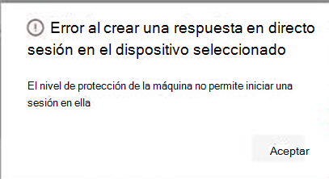

# <a name="investigate-entities-on-devices-using-live-response"></a><span data-ttu-id="6139f-104">Investigar entidades en dispositivos con respuesta en directo</span><span class="sxs-lookup"><span data-stu-id="6139f-104">Investigate entities on devices using live response</span></span>

[!INCLUDE [Microsoft 365 Defender rebranding](../../includes/microsoft-defender.md)]

<span data-ttu-id="6139f-105">**Se aplica a:**</span><span class="sxs-lookup"><span data-stu-id="6139f-105">**Applies to:**</span></span>
- [<span data-ttu-id="6139f-106">Microsoft Defender para punto de conexión</span><span class="sxs-lookup"><span data-stu-id="6139f-106">Microsoft Defender for Endpoint</span></span>](https://go.microsoft.com/fwlink/p/?linkid=2154037)
- [<span data-ttu-id="6139f-107">Microsoft 365 Defender</span><span class="sxs-lookup"><span data-stu-id="6139f-107">Microsoft 365 Defender</span></span>](https://go.microsoft.com/fwlink/?linkid=2118804)


> <span data-ttu-id="6139f-108">¿Desea experimentar Defender for Endpoint?</span><span class="sxs-lookup"><span data-stu-id="6139f-108">Want to experience Defender for Endpoint?</span></span> [<span data-ttu-id="6139f-109">Regístrate para obtener una versión de prueba gratuita.</span><span class="sxs-lookup"><span data-stu-id="6139f-109">Sign up for a free trial.</span></span>](https://www.microsoft.com/microsoft-365/windows/microsoft-defender-atp?ocid=docs-wdatp-investigateip-abovefoldlink)

<span data-ttu-id="6139f-110">La respuesta en directo proporciona a los equipos de operaciones de seguridad acceso instantáneo a un dispositivo (también denominado máquina) mediante una conexión remota del shell.</span><span class="sxs-lookup"><span data-stu-id="6139f-110">Live response gives security operations teams instantaneous access to a device (also referred to as a machine) using a remote shell connection.</span></span> <span data-ttu-id="6139f-111">Esto le da la capacidad de realizar un trabajo de investigación en profundidad y tomar acciones de respuesta inmediatas para contener rápidamente las amenazas identificadas, en tiempo real.</span><span class="sxs-lookup"><span data-stu-id="6139f-111">This gives you the power to do in-depth investigative work and take immediate response actions to promptly contain identified threats—in real time.</span></span> 

<span data-ttu-id="6139f-112">La respuesta activa está diseñada para mejorar las investigaciones, ya que permite al equipo de operaciones de seguridad recopilar datos forenses, ejecutar scripts, enviar entidades sospechosas para su análisis, corregir amenazas y buscar proactivamente amenazas emergentes.</span><span class="sxs-lookup"><span data-stu-id="6139f-112">Live response is designed to enhance investigations by enabling your security operations team to collect forensic data, run scripts, send suspicious entities for analysis, remediate threats, and proactively hunt for emerging threats.</span></span><br/><br/>

> [!VIDEO https://www.microsoft.com/videoplayer/embed/RE4qLUW]

<span data-ttu-id="6139f-113">Con la respuesta en directo, los analistas pueden realizar todas las tareas siguientes:</span><span class="sxs-lookup"><span data-stu-id="6139f-113">With live response, analysts can do all of the following tasks:</span></span>
- <span data-ttu-id="6139f-114">Ejecute comandos básicos y avanzados para realizar trabajos de investigación en un dispositivo.</span><span class="sxs-lookup"><span data-stu-id="6139f-114">Run basic and advanced commands to do investigative work on a device.</span></span>
- <span data-ttu-id="6139f-115">Descargue archivos como ejemplos de malware y resultados de scripts de PowerShell.</span><span class="sxs-lookup"><span data-stu-id="6139f-115">Download files such as malware samples and outcomes of PowerShell scripts.</span></span>
- <span data-ttu-id="6139f-116">Descargar archivos en segundo plano (¡nuevo!).</span><span class="sxs-lookup"><span data-stu-id="6139f-116">Download files in the background (new!).</span></span>
- <span data-ttu-id="6139f-117">Cargue un script de PowerShell o un archivo ejecutable en la biblioteca y ejecutarlo en un dispositivo desde un nivel de inquilino.</span><span class="sxs-lookup"><span data-stu-id="6139f-117">Upload a PowerShell script or executable to the library and run it on a device from a tenant level.</span></span>
- <span data-ttu-id="6139f-118">Realizar o deshacer acciones de corrección.</span><span class="sxs-lookup"><span data-stu-id="6139f-118">Take or undo remediation actions.</span></span>

## <a name="before-you-begin"></a><span data-ttu-id="6139f-119">Antes de empezar</span><span class="sxs-lookup"><span data-stu-id="6139f-119">Before you begin</span></span>

<span data-ttu-id="6139f-120">Antes de iniciar una sesión en un dispositivo, asegúrate de cumplir los siguientes requisitos:</span><span class="sxs-lookup"><span data-stu-id="6139f-120">Before you can initiate a session on a device, make sure you fulfill the following requirements:</span></span>

- <span data-ttu-id="6139f-121">**Comprueba que estás ejecutando una versión compatible de Windows**.</span><span class="sxs-lookup"><span data-stu-id="6139f-121">**Verify that you're running a supported version of Windows**.</span></span> <br/>
<span data-ttu-id="6139f-122">Los dispositivos deben ejecutar una de las siguientes versiones de Windows</span><span class="sxs-lookup"><span data-stu-id="6139f-122">Devices must be running one of the following versions of Windows</span></span>

  - <span data-ttu-id="6139f-123">**Windows 10**</span><span class="sxs-lookup"><span data-stu-id="6139f-123">**Windows 10**</span></span>
    - <span data-ttu-id="6139f-124">[Versión 1909](https://docs.microsoft.com/windows/whats-new/whats-new-windows-10-version-1909) o posterior</span><span class="sxs-lookup"><span data-stu-id="6139f-124">[Version 1909](https://docs.microsoft.com/windows/whats-new/whats-new-windows-10-version-1909) or later</span></span>  
    - <span data-ttu-id="6139f-125">[Versión 1903](https://docs.microsoft.com/windows/whats-new/whats-new-windows-10-version-1903) con [KB4515384](https://support.microsoft.com/en-us/help/4515384/windows-10-update-kb4515384)</span><span class="sxs-lookup"><span data-stu-id="6139f-125">[Version 1903](https://docs.microsoft.com/windows/whats-new/whats-new-windows-10-version-1903) with [KB4515384](https://support.microsoft.com/en-us/help/4515384/windows-10-update-kb4515384)</span></span>
    - <span data-ttu-id="6139f-126">[Versión 1809 (RS 5)](https://docs.microsoft.com/windows/whats-new/whats-new-windows-10-version-1809) con [KB4537818](https://support.microsoft.com/help/4537818/windows-10-update-kb4537818)</span><span class="sxs-lookup"><span data-stu-id="6139f-126">[Version 1809 (RS 5)](https://docs.microsoft.com/windows/whats-new/whats-new-windows-10-version-1809) with [with KB4537818](https://support.microsoft.com/help/4537818/windows-10-update-kb4537818)</span></span>
    - <span data-ttu-id="6139f-127">[Versión 1803 (RS 4)](https://docs.microsoft.com/windows/whats-new/whats-new-windows-10-version-1803) con [KB4537795](https://support.microsoft.com/help/4537795/windows-10-update-kb4537795)</span><span class="sxs-lookup"><span data-stu-id="6139f-127">[Version 1803 (RS 4)](https://docs.microsoft.com/windows/whats-new/whats-new-windows-10-version-1803) with [KB4537795](https://support.microsoft.com/help/4537795/windows-10-update-kb4537795)</span></span>
    - <span data-ttu-id="6139f-128">[Versión 1709 (RS 3)](https://docs.microsoft.com/windows/whats-new/whats-new-windows-10-version-1709) con [KB4537816](https://support.microsoft.com/help/4537816/windows-10-update-kb4537816)</span><span class="sxs-lookup"><span data-stu-id="6139f-128">[Version 1709 (RS 3)](https://docs.microsoft.com/windows/whats-new/whats-new-windows-10-version-1709) with [KB4537816](https://support.microsoft.com/help/4537816/windows-10-update-kb4537816)</span></span>
  
  - <span data-ttu-id="6139f-129">**Windows Server 2019: solo se aplica a la versión preliminar pública**</span><span class="sxs-lookup"><span data-stu-id="6139f-129">**Windows Server 2019 - Only applicable for Public preview**</span></span>
    - <span data-ttu-id="6139f-130">Versión 1903 o (con [KB4515384](https://support.microsoft.com/en-us/help/4515384/windows-10-update-kb4515384)) posterior</span><span class="sxs-lookup"><span data-stu-id="6139f-130">Version 1903 or (with [KB4515384](https://support.microsoft.com/en-us/help/4515384/windows-10-update-kb4515384)) later</span></span> 
    - <span data-ttu-id="6139f-131">Versión 1809 (con [KB4537818](https://support.microsoft.com/en-us/help/4537818/windows-10-update-kb4537818))</span><span class="sxs-lookup"><span data-stu-id="6139f-131">Version 1809 (with [KB4537818](https://support.microsoft.com/en-us/help/4537818/windows-10-update-kb4537818))</span></span>

- <span data-ttu-id="6139f-132">**Habilitar la respuesta en directo desde la página de configuración avanzada**.</span><span class="sxs-lookup"><span data-stu-id="6139f-132">**Enable live response from the advanced settings page**.</span></span><br>
<span data-ttu-id="6139f-133">Tendrás que habilitar la funcionalidad de respuesta en directo en la [página Configuración de características avanzadas.](advanced-features.md)</span><span class="sxs-lookup"><span data-stu-id="6139f-133">You'll need to enable the live response capability in the [Advanced features settings](advanced-features.md) page.</span></span>

    >[!NOTE]
    ><span data-ttu-id="6139f-134">Solo los usuarios con roles de administración global o de seguridad pueden editar esta configuración.</span><span class="sxs-lookup"><span data-stu-id="6139f-134">Only users with manage security or global admin roles can edit these settings.</span></span>

- <span data-ttu-id="6139f-135">**Habilitar la respuesta en directo para los servidores desde la página de configuración avanzada** (recomendado).</span><span class="sxs-lookup"><span data-stu-id="6139f-135">**Enable live response for servers from the advanced settings page** (recommended).</span></span><br>

    >[!NOTE]
    ><span data-ttu-id="6139f-136">Solo los usuarios con roles de administración global o de seguridad pueden editar esta configuración.</span><span class="sxs-lookup"><span data-stu-id="6139f-136">Only users with manage security or global admin roles can edit these settings.</span></span>
    
- <span data-ttu-id="6139f-137">**Asegúrese de que el dispositivo tiene asignado un** nivel de corrección de automatización .</span><span class="sxs-lookup"><span data-stu-id="6139f-137">**Ensure that the device has an Automation Remediation level assigned to it**.</span></span><br>
<span data-ttu-id="6139f-138">Tendrás que habilitar, al menos, el nivel mínimo de corrección para un grupo de dispositivos determinado.</span><span class="sxs-lookup"><span data-stu-id="6139f-138">You'll need to enable, at least, the minimum Remediation Level for a given Device Group.</span></span> <span data-ttu-id="6139f-139">De lo contrario, no podrá establecer una sesión de live response a un miembro de ese grupo.</span><span class="sxs-lookup"><span data-stu-id="6139f-139">Otherwise you won't be able to establish a Live Response session to a member of that group.</span></span>

    <span data-ttu-id="6139f-140">Recibirá el siguiente error:</span><span class="sxs-lookup"><span data-stu-id="6139f-140">You'll receive the following error:</span></span>

    

- <span data-ttu-id="6139f-142">**Habilitar la ejecución de script sin signo de respuesta** en directo (opcional).</span><span class="sxs-lookup"><span data-stu-id="6139f-142">**Enable live response unsigned script execution** (optional).</span></span> <br>

    >[!WARNING]
    ><span data-ttu-id="6139f-143">Permitir el uso de scripts sin signo puede aumentar la exposición a amenazas.</span><span class="sxs-lookup"><span data-stu-id="6139f-143">Allowing the use of unsigned scripts may increase your exposure to threats.</span></span>
 
  <span data-ttu-id="6139f-144">No se recomienda ejecutar scripts sin firma, ya que puede aumentar la exposición a amenazas.</span><span class="sxs-lookup"><span data-stu-id="6139f-144">Running unsigned scripts is not recommended as it can increase your exposure to threats.</span></span> <span data-ttu-id="6139f-145">Sin embargo, si debe usarlos, deberá habilitar la configuración en la [página Configuración de características avanzadas.](advanced-features.md)</span><span class="sxs-lookup"><span data-stu-id="6139f-145">If you must use them however, you'll need to enable the setting in the [Advanced features settings](advanced-features.md) page.</span></span>
    
- <span data-ttu-id="6139f-146">**Asegúrese de que tiene los permisos adecuados**.</span><span class="sxs-lookup"><span data-stu-id="6139f-146">**Ensure that you have the appropriate permissions**.</span></span><br>
    <span data-ttu-id="6139f-147">Solo los usuarios que se han aprovisionado con los permisos adecuados pueden iniciar una sesión.</span><span class="sxs-lookup"><span data-stu-id="6139f-147">Only users who have been provisioned with the appropriate permissions can initiate a session.</span></span> <span data-ttu-id="6139f-148">Para obtener más información sobre las asignaciones de roles, vea [Create and manage roles](user-roles.md).</span><span class="sxs-lookup"><span data-stu-id="6139f-148">For more information on role assignments, see [Create and manage roles](user-roles.md).</span></span> 

    > [!IMPORTANT]
    > <span data-ttu-id="6139f-149">La opción para cargar un archivo en la biblioteca solo está disponible para aquellos con los permisos RBAC adecuados.</span><span class="sxs-lookup"><span data-stu-id="6139f-149">The option to upload a file to the library is only available to those with the appropriate RBAC permissions.</span></span> <span data-ttu-id="6139f-150">El botón está gris para los usuarios con solo permisos delegados.</span><span class="sxs-lookup"><span data-stu-id="6139f-150">The button is greyed out for users with only delegated permissions.</span></span>

    <span data-ttu-id="6139f-151">Según el rol que se le haya concedido, puede ejecutar comandos de respuesta en directo básicos o avanzados.</span><span class="sxs-lookup"><span data-stu-id="6139f-151">Depending on the role that's been granted to you, you can run basic or advanced live response commands.</span></span> <span data-ttu-id="6139f-152">Los permisos de los usuarios están controlados por el rol personalizado RBAC.</span><span class="sxs-lookup"><span data-stu-id="6139f-152">Users permissions are controlled by RBAC custom role.</span></span> 

## <a name="live-response-dashboard-overview"></a><span data-ttu-id="6139f-153">Introducción al panel de respuestas en directo</span><span class="sxs-lookup"><span data-stu-id="6139f-153">Live response dashboard overview</span></span>
<span data-ttu-id="6139f-154">Cuando inicias una sesión de respuesta en directo en un dispositivo, se abre un panel.</span><span class="sxs-lookup"><span data-stu-id="6139f-154">When you initiate a live response session on a device, a dashboard opens.</span></span> <span data-ttu-id="6139f-155">El panel proporciona información sobre la sesión, como la siguiente:</span><span class="sxs-lookup"><span data-stu-id="6139f-155">The dashboard provides information about the session such as the following:</span></span> 

- <span data-ttu-id="6139f-156">Quién creó la sesión</span><span class="sxs-lookup"><span data-stu-id="6139f-156">Who created the session</span></span>
- <span data-ttu-id="6139f-157">Cuando se inició la sesión</span><span class="sxs-lookup"><span data-stu-id="6139f-157">When the session started</span></span>
- <span data-ttu-id="6139f-158">Duración de la sesión</span><span class="sxs-lookup"><span data-stu-id="6139f-158">The duration of the session</span></span>

<span data-ttu-id="6139f-159">El panel también le da acceso a:</span><span class="sxs-lookup"><span data-stu-id="6139f-159">The dashboard also gives you access to:</span></span>
- <span data-ttu-id="6139f-160">Desconectar sesión</span><span class="sxs-lookup"><span data-stu-id="6139f-160">Disconnect session</span></span>
- <span data-ttu-id="6139f-161">Cargar archivos en la biblioteca</span><span class="sxs-lookup"><span data-stu-id="6139f-161">Upload files to the library</span></span> 
- <span data-ttu-id="6139f-162">Consola de comandos</span><span class="sxs-lookup"><span data-stu-id="6139f-162">Command console</span></span>
- <span data-ttu-id="6139f-163">Registro de comandos</span><span class="sxs-lookup"><span data-stu-id="6139f-163">Command log</span></span>


## <a name="initiate-a-live-response-session-on-a-device"></a><span data-ttu-id="6139f-164">Iniciar una sesión de respuesta en directo en un dispositivo</span><span class="sxs-lookup"><span data-stu-id="6139f-164">Initiate a live response session on a device</span></span> 

1. <span data-ttu-id="6139f-165">Inicie sesión en el Centro de seguridad de Microsoft Defender.</span><span class="sxs-lookup"><span data-stu-id="6139f-165">Sign in to Microsoft Defender Security Center.</span></span>

2. <span data-ttu-id="6139f-166">Vaya a la página de lista de dispositivos y seleccione un dispositivo para investigar.</span><span class="sxs-lookup"><span data-stu-id="6139f-166">Navigate to the devices list page and select a device to investigate.</span></span> <span data-ttu-id="6139f-167">Se abre la página dispositivos.</span><span class="sxs-lookup"><span data-stu-id="6139f-167">The devices page opens.</span></span>

3. <span data-ttu-id="6139f-168">Inicie la sesión de respuesta activa seleccionando **Iniciar sesión de respuesta en directo**.</span><span class="sxs-lookup"><span data-stu-id="6139f-168">Launch the live response session by selecting **Initiate live response session**.</span></span> <span data-ttu-id="6139f-169">Se muestra una consola de comandos.</span><span class="sxs-lookup"><span data-stu-id="6139f-169">A command console is displayed.</span></span> <span data-ttu-id="6139f-170">Espere mientras la sesión se conecta al dispositivo.</span><span class="sxs-lookup"><span data-stu-id="6139f-170">Wait while the session connects to the device.</span></span>

4. <span data-ttu-id="6139f-171">Use los comandos integrados para realizar trabajos de investigación.</span><span class="sxs-lookup"><span data-stu-id="6139f-171">Use the built-in commands to do investigative work.</span></span> <span data-ttu-id="6139f-172">Para obtener más información, vea [Comandos de respuesta en directo](#live-response-commands).</span><span class="sxs-lookup"><span data-stu-id="6139f-172">For more information, see [Live response commands](#live-response-commands).</span></span>

5. <span data-ttu-id="6139f-173">Después de completar la investigación, seleccione **Desconectar sesión** y, a continuación, **seleccione Confirmar**.</span><span class="sxs-lookup"><span data-stu-id="6139f-173">After completing your investigation, select **Disconnect session**, then select **Confirm**.</span></span>

## <a name="live-response-commands"></a><span data-ttu-id="6139f-174">Comandos de respuesta en directo</span><span class="sxs-lookup"><span data-stu-id="6139f-174">Live response commands</span></span>

<span data-ttu-id="6139f-175">Según el rol que se le haya concedido, puede ejecutar comandos de respuesta en directo básicos o avanzados.</span><span class="sxs-lookup"><span data-stu-id="6139f-175">Depending on the role that's been granted to you, you can run basic or advanced live response commands.</span></span> <span data-ttu-id="6139f-176">Los permisos de usuario se controlan mediante roles personalizados rbac.</span><span class="sxs-lookup"><span data-stu-id="6139f-176">User permissions are controlled by RBAC custom roles.</span></span> <span data-ttu-id="6139f-177">Para obtener más información sobre las asignaciones de roles, vea [Create and manage roles](user-roles.md).</span><span class="sxs-lookup"><span data-stu-id="6139f-177">For more information on role assignments, see [Create and manage roles](user-roles.md).</span></span> 


>[!NOTE]
><span data-ttu-id="6139f-178">La respuesta en directo es un shell interactivo basado en la nube, por lo que la experiencia de comandos específica puede variar en el tiempo de respuesta según la calidad de la red y la carga del sistema entre el usuario final y el dispositivo de destino.</span><span class="sxs-lookup"><span data-stu-id="6139f-178">Live response is a cloud-based interactive shell, as such, specific command experience may vary in response time depending on network quality and system load between the end user and the target device.</span></span>

### <a name="basic-commands"></a><span data-ttu-id="6139f-179">Comandos básicos</span><span class="sxs-lookup"><span data-stu-id="6139f-179">Basic commands</span></span>

<span data-ttu-id="6139f-180">Los siguientes comandos están disponibles para los roles de usuario a los que se les concede la capacidad de ejecutar **comandos** básicos de respuesta en directo.</span><span class="sxs-lookup"><span data-stu-id="6139f-180">The following commands are available for user roles that are granted the ability to run **basic** live response commands.</span></span> <span data-ttu-id="6139f-181">Para obtener más información sobre las asignaciones de roles, vea [Create and manage roles](user-roles.md).</span><span class="sxs-lookup"><span data-stu-id="6139f-181">For more information on role assignments, see [Create and manage roles](user-roles.md).</span></span> 

| <span data-ttu-id="6139f-182">Comando</span><span class="sxs-lookup"><span data-stu-id="6139f-182">Command</span></span> | <span data-ttu-id="6139f-183">Descripción</span><span class="sxs-lookup"><span data-stu-id="6139f-183">Description</span></span> |
|---|---|--- |
|`cd` | <span data-ttu-id="6139f-184">Cambia el directorio actual.</span><span class="sxs-lookup"><span data-stu-id="6139f-184">Changes the current directory.</span></span> | 
|`cls` | <span data-ttu-id="6139f-185">Borra la pantalla de la consola.</span><span class="sxs-lookup"><span data-stu-id="6139f-185">Clears the console screen.</span></span>  |
|`connect` | <span data-ttu-id="6139f-186">Inicia una sesión de respuesta en directo al dispositivo.</span><span class="sxs-lookup"><span data-stu-id="6139f-186">Initiates a live response session to the device.</span></span> |
|`connections` | <span data-ttu-id="6139f-187">Muestra todas las conexiones activas.</span><span class="sxs-lookup"><span data-stu-id="6139f-187">Shows all the active connections.</span></span> |
|`dir` | <span data-ttu-id="6139f-188">Muestra una lista de archivos y subdirectorios en un directorio.</span><span class="sxs-lookup"><span data-stu-id="6139f-188">Shows a list of files and subdirectories in a directory.</span></span> |
|`download <file_path> &` | <span data-ttu-id="6139f-189">Descarga un archivo en segundo plano.</span><span class="sxs-lookup"><span data-stu-id="6139f-189">Downloads a file in the background.</span></span> |
<span data-ttu-id="6139f-190">controladores</span><span class="sxs-lookup"><span data-stu-id="6139f-190">drivers</span></span> |  <span data-ttu-id="6139f-191">Muestra todos los controladores instalados en el dispositivo.</span><span class="sxs-lookup"><span data-stu-id="6139f-191">Shows all drivers installed on the device.</span></span> |
|`fg <command ID>` | <span data-ttu-id="6139f-192">Devuelve una descarga de archivos en primer plano.</span><span class="sxs-lookup"><span data-stu-id="6139f-192">Returns a file download to the foreground.</span></span> |
|`fileinfo` | <span data-ttu-id="6139f-193">Obtener información acerca de un archivo.</span><span class="sxs-lookup"><span data-stu-id="6139f-193">Get information about a file.</span></span> |
|`findfile` | <span data-ttu-id="6139f-194">Localiza los archivos por un nombre determinado en el dispositivo.</span><span class="sxs-lookup"><span data-stu-id="6139f-194">Locates files by a given name on the device.</span></span> |
|`help` | <span data-ttu-id="6139f-195">Proporciona información de ayuda para comandos de respuesta en directo.</span><span class="sxs-lookup"><span data-stu-id="6139f-195">Provides help information for live response commands.</span></span> |
|`persistence` | <span data-ttu-id="6139f-196">Muestra todos los métodos de persistencia conocidos en el dispositivo.</span><span class="sxs-lookup"><span data-stu-id="6139f-196">Shows all known persistence methods on the device.</span></span> |
|`processes` | <span data-ttu-id="6139f-197">Muestra todos los procesos que se ejecutan en el dispositivo.</span><span class="sxs-lookup"><span data-stu-id="6139f-197">Shows all processes running on the device.</span></span> |
|`registry` | <span data-ttu-id="6139f-198">Muestra los valores del Registro.</span><span class="sxs-lookup"><span data-stu-id="6139f-198">Shows registry values.</span></span> |
|`scheduledtasks` | <span data-ttu-id="6139f-199">Muestra todas las tareas programadas en el dispositivo.</span><span class="sxs-lookup"><span data-stu-id="6139f-199">Shows all scheduled tasks on the device.</span></span> |
|`services` | <span data-ttu-id="6139f-200">Muestra todos los servicios del dispositivo.</span><span class="sxs-lookup"><span data-stu-id="6139f-200">Shows all services on the device.</span></span> |
|`trace` | <span data-ttu-id="6139f-201">Establece el modo de registro del terminal en depuración.</span><span class="sxs-lookup"><span data-stu-id="6139f-201">Sets the terminal's logging mode to debug.</span></span> |

### <a name="advanced-commands"></a><span data-ttu-id="6139f-202">Comandos avanzados</span><span class="sxs-lookup"><span data-stu-id="6139f-202">Advanced commands</span></span>
<span data-ttu-id="6139f-203">Los siguientes comandos están disponibles para los roles de usuario a los que se les concede la capacidad de ejecutar **comandos avanzados** de respuesta en directo.</span><span class="sxs-lookup"><span data-stu-id="6139f-203">The following commands are available for user roles that are granted the ability to run **advanced** live response commands.</span></span> <span data-ttu-id="6139f-204">Para obtener más información sobre las asignaciones de roles, vea [Create and manage roles](user-roles.md).</span><span class="sxs-lookup"><span data-stu-id="6139f-204">For more information on role assignments, see [Create and manage roles](user-roles.md).</span></span> 

| <span data-ttu-id="6139f-205">Comando</span><span class="sxs-lookup"><span data-stu-id="6139f-205">Command</span></span> | <span data-ttu-id="6139f-206">Descripción</span><span class="sxs-lookup"><span data-stu-id="6139f-206">Description</span></span> |
|---|---|
| `analyze` | <span data-ttu-id="6139f-207">Analiza la entidad con varios motores de incriminación para llegar a un veredicto.</span><span class="sxs-lookup"><span data-stu-id="6139f-207">Analyses the entity with various incrimination engines to reach a verdict.</span></span> |
| `getfile` | <span data-ttu-id="6139f-208">Obtiene un archivo del dispositivo.</span><span class="sxs-lookup"><span data-stu-id="6139f-208">Gets a file from the device.</span></span> <br> <span data-ttu-id="6139f-209">NOTA: Este comando tiene un comando de requisito previo.</span><span class="sxs-lookup"><span data-stu-id="6139f-209">NOTE: This command has a prerequisite command.</span></span> <span data-ttu-id="6139f-210">Puede usar el `-auto` comando junto con para ejecutar automáticamente el comando de `getfile` requisitos previos.</span><span class="sxs-lookup"><span data-stu-id="6139f-210">You can use the `-auto` command in conjunction with `getfile` to automatically run the prerequisite command.</span></span> |
| `run` | <span data-ttu-id="6139f-211">Ejecuta un script de PowerShell desde la biblioteca en el dispositivo.</span><span class="sxs-lookup"><span data-stu-id="6139f-211">Runs a PowerShell script from the library on the device.</span></span> |
| `library` | <span data-ttu-id="6139f-212">Enumera los archivos que se cargaron en la biblioteca de respuestas en directo.</span><span class="sxs-lookup"><span data-stu-id="6139f-212">Lists files that were uploaded to the live response library.</span></span> |
| `putfile` | <span data-ttu-id="6139f-213">Coloca un archivo de la biblioteca en el dispositivo.</span><span class="sxs-lookup"><span data-stu-id="6139f-213">Puts a file from the library to the device.</span></span> <span data-ttu-id="6139f-214">Los archivos se guardan en una carpeta de trabajo y se eliminan cuando el dispositivo se reinicia de forma predeterminada.</span><span class="sxs-lookup"><span data-stu-id="6139f-214">Files are saved in a working folder and are deleted when the device restarts by default.</span></span> |
| `remediate` | <span data-ttu-id="6139f-215">Corrige una entidad en el dispositivo.</span><span class="sxs-lookup"><span data-stu-id="6139f-215">Remediates an entity on the device.</span></span> <span data-ttu-id="6139f-216">La acción de corrección variará según el tipo de entidad:</span><span class="sxs-lookup"><span data-stu-id="6139f-216">The remediation action will vary depending on the entity type:</span></span><br><span data-ttu-id="6139f-217">- Archivo: eliminar</span><span class="sxs-lookup"><span data-stu-id="6139f-217">- File: delete</span></span><br><span data-ttu-id="6139f-218">- Proceso: detener, eliminar archivo de imagen</span><span class="sxs-lookup"><span data-stu-id="6139f-218">- Process: stop, delete image file</span></span><br><span data-ttu-id="6139f-219">- Servicio: detener, eliminar archivo de imagen</span><span class="sxs-lookup"><span data-stu-id="6139f-219">- Service: stop, delete image file</span></span><br><span data-ttu-id="6139f-220">- Entrada del Registro: eliminar</span><span class="sxs-lookup"><span data-stu-id="6139f-220">- Registry entry: delete</span></span><br><span data-ttu-id="6139f-221">- Tarea programada: quitar</span><span class="sxs-lookup"><span data-stu-id="6139f-221">- Scheduled task: remove</span></span><br><span data-ttu-id="6139f-222">- Elemento de carpeta de inicio: eliminar archivo</span><span class="sxs-lookup"><span data-stu-id="6139f-222">- Startup folder item: delete file</span></span> <br> <span data-ttu-id="6139f-223">NOTA: Este comando tiene un comando de requisito previo.</span><span class="sxs-lookup"><span data-stu-id="6139f-223">NOTE: This command has a prerequisite command.</span></span> <span data-ttu-id="6139f-224">Puede usar el `-auto` comando junto con para ejecutar automáticamente el comando de `remediate` requisitos previos.</span><span class="sxs-lookup"><span data-stu-id="6139f-224">You can use the `-auto` command in conjunction with `remediate` to automatically run the prerequisite command.</span></span> 
|`undo` | <span data-ttu-id="6139f-225">Restaura una entidad que se ha corregido.</span><span class="sxs-lookup"><span data-stu-id="6139f-225">Restores an entity that was remediated.</span></span> |


## <a name="use-live-response-commands"></a><span data-ttu-id="6139f-226">Usar comandos de respuesta en directo</span><span class="sxs-lookup"><span data-stu-id="6139f-226">Use live response commands</span></span>

<span data-ttu-id="6139f-227">Los comandos que puedes usar en la consola siguen principios similares a [los comandos de Windows](https://docs.microsoft.com/windows-server/administration/windows-commands/windows-commands#BKMK_c).</span><span class="sxs-lookup"><span data-stu-id="6139f-227">The commands that you can use in the console follow similar principles as [Windows Commands](https://docs.microsoft.com/windows-server/administration/windows-commands/windows-commands#BKMK_c).</span></span>

<span data-ttu-id="6139f-228">Los comandos avanzados ofrecen un conjunto más sólido de acciones que te permiten realizar acciones más eficaces, como descargar y cargar un archivo, ejecutar scripts en el dispositivo y realizar acciones de corrección en una entidad.</span><span class="sxs-lookup"><span data-stu-id="6139f-228">The advanced commands offer a more robust set of actions that allow you to take more powerful actions such as download and upload a file, run scripts on the device, and take remediation actions on an entity.</span></span>

### <a name="get-a-file-from-the-device"></a><span data-ttu-id="6139f-229">Obtener un archivo del dispositivo</span><span class="sxs-lookup"><span data-stu-id="6139f-229">Get a file from the device</span></span>

<span data-ttu-id="6139f-230">Para escenarios en los que quieras obtener un archivo de un dispositivo que estés investigando, puedes usar el `getfile` comando.</span><span class="sxs-lookup"><span data-stu-id="6139f-230">For scenarios when you'd like get a file from a device you're investigating, you can use the `getfile` command.</span></span> <span data-ttu-id="6139f-231">Esto te permite guardar el archivo del dispositivo para una investigación posterior.</span><span class="sxs-lookup"><span data-stu-id="6139f-231">This allows you to save the file from the device for further investigation.</span></span>

>[!NOTE]
><span data-ttu-id="6139f-232">Se aplican los siguientes límites de tamaño de archivo:</span><span class="sxs-lookup"><span data-stu-id="6139f-232">The following file size limits apply:</span></span>
>- <span data-ttu-id="6139f-233">`getfile` límite: 3 GB</span><span class="sxs-lookup"><span data-stu-id="6139f-233">`getfile` limit: 3 GB</span></span>
>- <span data-ttu-id="6139f-234">`fileinfo` límite: 10 GB</span><span class="sxs-lookup"><span data-stu-id="6139f-234">`fileinfo` limit: 10 GB</span></span>
>- <span data-ttu-id="6139f-235">`library` límite: 250 MB</span><span class="sxs-lookup"><span data-stu-id="6139f-235">`library` limit: 250 MB</span></span>

### <a name="download-a-file-in-the-background"></a><span data-ttu-id="6139f-236">Descargar un archivo en segundo plano</span><span class="sxs-lookup"><span data-stu-id="6139f-236">Download a file in the background</span></span>

<span data-ttu-id="6139f-237">Para permitir que el equipo de operaciones de seguridad continúe investigando un dispositivo afectado, los archivos ahora se pueden descargar en segundo plano.</span><span class="sxs-lookup"><span data-stu-id="6139f-237">To enable your security operations team to continue investigating an impacted device, files can now be downloaded in the background.</span></span>

- <span data-ttu-id="6139f-238">Para descargar un archivo en segundo plano, en la consola de comandos de respuesta en directo, escriba `download <file_path> &` .</span><span class="sxs-lookup"><span data-stu-id="6139f-238">To download a file in the background, in the live response command console, type `download <file_path> &`.</span></span>
- <span data-ttu-id="6139f-239">Si está esperando a que se descargue un archivo, puede moverlo al fondo mediante Ctrl + Z.</span><span class="sxs-lookup"><span data-stu-id="6139f-239">If you are waiting for a file to be downloaded, you can move it to the background by using Ctrl + Z.</span></span>
- <span data-ttu-id="6139f-240">Para llevar una descarga de archivos al primer plano, en la consola de comandos de respuesta en directo, escriba `fg <command_id>` .</span><span class="sxs-lookup"><span data-stu-id="6139f-240">To bring a file download to the foreground, in the live response command console, type `fg <command_id>`.</span></span>

<span data-ttu-id="6139f-241">Estos son algunos ejemplos:</span><span class="sxs-lookup"><span data-stu-id="6139f-241">Here are some examples:</span></span>


|<span data-ttu-id="6139f-242">Comando</span><span class="sxs-lookup"><span data-stu-id="6139f-242">Command</span></span>  |<span data-ttu-id="6139f-243">Lo que hace</span><span class="sxs-lookup"><span data-stu-id="6139f-243">What it does</span></span>  |
|---------|---------|
|`Download "C:\windows\some_file.exe" &`     |<span data-ttu-id="6139f-244">Inicia la descarga de un archivo *denominadosome_file.exe* en segundo plano.</span><span class="sxs-lookup"><span data-stu-id="6139f-244">Starts downloading a file named *some_file.exe* in the background.</span></span>         |
|`fg 1234`     |<span data-ttu-id="6139f-245">Devuelve una descarga con el identificador de comando *1234* en primer plano.</span><span class="sxs-lookup"><span data-stu-id="6139f-245">Returns a download with command ID *1234* to the foreground.</span></span>         |


### <a name="put-a-file-in-the-library"></a><span data-ttu-id="6139f-246">Colocar un archivo en la biblioteca</span><span class="sxs-lookup"><span data-stu-id="6139f-246">Put a file in the library</span></span>

<span data-ttu-id="6139f-247">La respuesta en directo tiene una biblioteca en la que puede colocar archivos.</span><span class="sxs-lookup"><span data-stu-id="6139f-247">Live response has a library where you can put files into.</span></span> <span data-ttu-id="6139f-248">La biblioteca almacena archivos (como scripts) que se pueden ejecutar en una sesión de respuesta activa en el nivel de inquilino.</span><span class="sxs-lookup"><span data-stu-id="6139f-248">The library stores files (such as scripts) that can be run in a live response session at the tenant level.</span></span>

<span data-ttu-id="6139f-249">La respuesta en directo permite ejecutar scripts de PowerShell, pero primero debe colocar los archivos en la biblioteca antes de poder ejecutarlos.</span><span class="sxs-lookup"><span data-stu-id="6139f-249">Live response allows PowerShell scripts to run, however you must first put the files into the library before you can run them.</span></span> 

<span data-ttu-id="6139f-250">Puede tener una colección de scripts de PowerShell que se pueden ejecutar en dispositivos con los que inicie sesiones de respuesta en directo.</span><span class="sxs-lookup"><span data-stu-id="6139f-250">You can have a collection of PowerShell scripts that can run on devices that you initiate live response sessions with.</span></span> 

#### <a name="to-upload-a-file-in-the-library"></a><span data-ttu-id="6139f-251">Para cargar un archivo en la biblioteca</span><span class="sxs-lookup"><span data-stu-id="6139f-251">To upload a file in the library</span></span>

1. <span data-ttu-id="6139f-252">Haga clic **en Cargar archivo en biblioteca.**</span><span class="sxs-lookup"><span data-stu-id="6139f-252">Click **Upload file to library**.</span></span> 

2. <span data-ttu-id="6139f-253">Haga **clic en** Examinar y seleccione el archivo.</span><span class="sxs-lookup"><span data-stu-id="6139f-253">Click **Browse** and select the file.</span></span>

3. <span data-ttu-id="6139f-254">Proporcione una breve descripción.</span><span class="sxs-lookup"><span data-stu-id="6139f-254">Provide a brief description.</span></span>

4. <span data-ttu-id="6139f-255">Especifica si quieres sobrescribir un archivo con el mismo nombre.</span><span class="sxs-lookup"><span data-stu-id="6139f-255">Specify if you'd like to overwrite a file with the same name.</span></span>

5. <span data-ttu-id="6139f-256">Si desea serlo, sepa qué parámetros son necesarios para el script, active la casilla parámetros de script.</span><span class="sxs-lookup"><span data-stu-id="6139f-256">If you'd like to be,  know what parameters are needed for the script, select the script parameters check box.</span></span> <span data-ttu-id="6139f-257">En el campo de texto, escriba un ejemplo y una descripción.</span><span class="sxs-lookup"><span data-stu-id="6139f-257">In the text field, enter an example and a description.</span></span>

6. <span data-ttu-id="6139f-258">Haga clic **en Confirmar**.</span><span class="sxs-lookup"><span data-stu-id="6139f-258">Click **Confirm**.</span></span> 

7. <span data-ttu-id="6139f-259">(Opcional) Para comprobar que el archivo se ha cargado en la biblioteca, ejecute el `library` comando.</span><span class="sxs-lookup"><span data-stu-id="6139f-259">(Optional) To verify that the file was uploaded to the library, run the `library` command.</span></span>


### <a name="cancel-a-command"></a><span data-ttu-id="6139f-260">Cancelar un comando</span><span class="sxs-lookup"><span data-stu-id="6139f-260">Cancel a command</span></span>
<span data-ttu-id="6139f-261">En cualquier momento durante una sesión, puede cancelar un comando presionando CTRL + C.</span><span class="sxs-lookup"><span data-stu-id="6139f-261">Anytime during a session, you can cancel a command by pressing CTRL + C.</span></span>  

>[!WARNING]
><span data-ttu-id="6139f-262">El uso de este acceso directo no detendrá el comando en el lado del agente.</span><span class="sxs-lookup"><span data-stu-id="6139f-262">Using this shortcut will not stop the command in the agent side.</span></span> <span data-ttu-id="6139f-263">Solo cancelará el comando en el portal.</span><span class="sxs-lookup"><span data-stu-id="6139f-263">It will only cancel the command in the portal.</span></span> <span data-ttu-id="6139f-264">Por lo tanto, el cambio de operaciones como "remediate" puede continuar, mientras que el comando se cancela.</span><span class="sxs-lookup"><span data-stu-id="6139f-264">So, changing operations such as "remediate" may continue, while the command is canceled.</span></span> 

### <a name="automatically-run-prerequisite-commands"></a><span data-ttu-id="6139f-265">Ejecutar automáticamente comandos de requisitos previos</span><span class="sxs-lookup"><span data-stu-id="6139f-265">Automatically run prerequisite commands</span></span>

<span data-ttu-id="6139f-266">Algunos comandos tienen comandos de requisitos previos para ejecutarse.</span><span class="sxs-lookup"><span data-stu-id="6139f-266">Some commands have prerequisite commands to run.</span></span> <span data-ttu-id="6139f-267">Si no ejecuta el comando de requisitos previos, se producirá un error.</span><span class="sxs-lookup"><span data-stu-id="6139f-267">If you don't run the prerequisite command, you'll get an error.</span></span> <span data-ttu-id="6139f-268">Por ejemplo, ejecutar el `download` comando sin devolverá un `fileinfo` error.</span><span class="sxs-lookup"><span data-stu-id="6139f-268">For example, running the `download` command without `fileinfo` will return an error.</span></span>

<span data-ttu-id="6139f-269">Puede usar la marca automática para ejecutar automáticamente comandos de requisitos previos, por ejemplo:</span><span class="sxs-lookup"><span data-stu-id="6139f-269">You can use the auto flag to automatically run prerequisite commands, for example:</span></span>

```console
getfile c:\Users\user\Desktop\work.txt -auto
```

## <a name="run-a-powershell-script"></a><span data-ttu-id="6139f-270">Ejecutar un script de PowerShell</span><span class="sxs-lookup"><span data-stu-id="6139f-270">Run a PowerShell script</span></span> 

<span data-ttu-id="6139f-271">Para poder ejecutar un script de PowerShell, primero debe cargarlo en la biblioteca.</span><span class="sxs-lookup"><span data-stu-id="6139f-271">Before you can run a PowerShell script, you must first upload it to the library.</span></span> 

<span data-ttu-id="6139f-272">Después de cargar el script en la biblioteca, use el `run` comando para ejecutar el script.</span><span class="sxs-lookup"><span data-stu-id="6139f-272">After uploading the script to the library, use the `run` command to run the script.</span></span>

<span data-ttu-id="6139f-273">Si planea usar un script sin signo en la sesión, deberá habilitar la configuración en la [página Configuración de características avanzadas.](advanced-features.md)</span><span class="sxs-lookup"><span data-stu-id="6139f-273">If you plan to use an unsigned script in the session, you'll need to enable the setting in the [Advanced features settings](advanced-features.md) page.</span></span>

>[!WARNING]
><span data-ttu-id="6139f-274">Permitir el uso de scripts sin signo puede aumentar la exposición a amenazas.</span><span class="sxs-lookup"><span data-stu-id="6139f-274">Allowing the use of unsigned scripts may increase your exposure to threats.</span></span>

## <a name="apply-command-parameters"></a><span data-ttu-id="6139f-275">Aplicar parámetros de comando</span><span class="sxs-lookup"><span data-stu-id="6139f-275">Apply command parameters</span></span>

- <span data-ttu-id="6139f-276">Vea la ayuda de la consola para obtener información sobre los parámetros de comandos.</span><span class="sxs-lookup"><span data-stu-id="6139f-276">View the console help to learn about command parameters.</span></span> <span data-ttu-id="6139f-277">Para obtener información sobre un comando individual, ejecute:</span><span class="sxs-lookup"><span data-stu-id="6139f-277">To learn about an individual command, run:</span></span>
 
    `help <command name>`

- <span data-ttu-id="6139f-278">Al aplicar parámetros a comandos, tenga en cuenta que los parámetros se controlan en función de un orden fijo:</span><span class="sxs-lookup"><span data-stu-id="6139f-278">When applying parameters to commands, note that parameters are handled based on a fixed order:</span></span>
 
    `<command name> param1 param2` 

- <span data-ttu-id="6139f-279">Al especificar parámetros fuera del orden fijo, especifique el nombre del parámetro con un guión antes de proporcionar el valor:</span><span class="sxs-lookup"><span data-stu-id="6139f-279">When specifying parameters outside of the fixed order, specify the name of the parameter with a hyphen before providing the value:</span></span>
 
    `<command name> -param2_name param2`

- <span data-ttu-id="6139f-280">Al usar comandos que tienen comandos de requisitos previos, puede usar marcas:</span><span class="sxs-lookup"><span data-stu-id="6139f-280">When using commands that have prerequisite commands, you can use flags:</span></span>

    <span data-ttu-id="6139f-281">`<command name> -type file -id <file path> - auto` o `remediate file <file path> - auto`.</span><span class="sxs-lookup"><span data-stu-id="6139f-281">`<command name> -type file -id <file path> - auto` or `remediate file <file path> - auto`.</span></span>

## <a name="supported-output-types"></a><span data-ttu-id="6139f-282">Tipos de salida compatibles</span><span class="sxs-lookup"><span data-stu-id="6139f-282">Supported output types</span></span>

<span data-ttu-id="6139f-283">La respuesta en directo admite tipos de salida de formato JSON y tabla.</span><span class="sxs-lookup"><span data-stu-id="6139f-283">Live response supports table and JSON format output types.</span></span> <span data-ttu-id="6139f-284">Para cada comando, hay un comportamiento de salida predeterminado.</span><span class="sxs-lookup"><span data-stu-id="6139f-284">For each command, there's a default output behavior.</span></span> <span data-ttu-id="6139f-285">Puede modificar el resultado en el formato de salida preferido mediante los siguientes comandos:</span><span class="sxs-lookup"><span data-stu-id="6139f-285">You can modify the output in your preferred output format using the following commands:</span></span>

- `-output json`
- `-output table`

>[!NOTE]
><span data-ttu-id="6139f-286">Se muestran menos campos en formato de tabla debido al espacio limitado.</span><span class="sxs-lookup"><span data-stu-id="6139f-286">Fewer fields are shown in table format due to the limited space.</span></span> <span data-ttu-id="6139f-287">Para ver más detalles en el resultado, puede usar el comando de salida JSON para que se muestran más detalles.</span><span class="sxs-lookup"><span data-stu-id="6139f-287">To see more details in the output, you can use the JSON output command so that more details are shown.</span></span>

## <a name="supported-output-pipes"></a><span data-ttu-id="6139f-288">Canalizaciones de salida admitidas</span><span class="sxs-lookup"><span data-stu-id="6139f-288">Supported output pipes</span></span>

<span data-ttu-id="6139f-289">La respuesta en directo admite la canalización de salida a la CLI y al archivo.</span><span class="sxs-lookup"><span data-stu-id="6139f-289">Live response supports output piping to CLI and file.</span></span> <span data-ttu-id="6139f-290">CLI es el comportamiento de salida predeterminado.</span><span class="sxs-lookup"><span data-stu-id="6139f-290">CLI is the default output behavior.</span></span> <span data-ttu-id="6139f-291">Puede canalizar el resultado a un archivo mediante el siguiente comando: [command] > [filename].txt.</span><span class="sxs-lookup"><span data-stu-id="6139f-291">You can pipe the output to a file using the following command: [command] > [filename].txt.</span></span>  

<span data-ttu-id="6139f-292">Ejemplo:</span><span class="sxs-lookup"><span data-stu-id="6139f-292">Example:</span></span>

```console
processes > output.txt
```

## <a name="view-the-command-log"></a><span data-ttu-id="6139f-293">Ver el registro de comandos</span><span class="sxs-lookup"><span data-stu-id="6139f-293">View the command log</span></span>

<span data-ttu-id="6139f-294">Selecciona la **pestaña Registro de** comandos para ver los comandos usados en el dispositivo durante una sesión.</span><span class="sxs-lookup"><span data-stu-id="6139f-294">Select the **Command log** tab to see the commands used on the device during a session.</span></span> <span data-ttu-id="6139f-295">Cada comando se realiza un seguimiento con detalles completos como:</span><span class="sxs-lookup"><span data-stu-id="6139f-295">Each command is tracked with full details such as:</span></span>
- <span data-ttu-id="6139f-296">Id.</span><span class="sxs-lookup"><span data-stu-id="6139f-296">ID</span></span>
- <span data-ttu-id="6139f-297">Línea de comandos</span><span class="sxs-lookup"><span data-stu-id="6139f-297">Command line</span></span>
- <span data-ttu-id="6139f-298">Duración</span><span class="sxs-lookup"><span data-stu-id="6139f-298">Duration</span></span>
- <span data-ttu-id="6139f-299">Estado y barra lateral de entrada o salida</span><span class="sxs-lookup"><span data-stu-id="6139f-299">Status and input or output side bar</span></span>

## <a name="limitations"></a><span data-ttu-id="6139f-300">Limitaciones</span><span class="sxs-lookup"><span data-stu-id="6139f-300">Limitations</span></span>

- <span data-ttu-id="6139f-301">Las sesiones de respuesta en directo están limitadas a 10 sesiones de respuesta en directo a la vez.</span><span class="sxs-lookup"><span data-stu-id="6139f-301">Live response sessions are limited to 10 live response sessions at a time.</span></span>
- <span data-ttu-id="6139f-302">No se admite la ejecución de comandos a gran escala.</span><span class="sxs-lookup"><span data-stu-id="6139f-302">Large-scale command execution is not supported.</span></span>
- <span data-ttu-id="6139f-303">El valor de tiempo de espera inactivo de la sesión de respuesta en directo es de 5 minutos.</span><span class="sxs-lookup"><span data-stu-id="6139f-303">Live response session inactive timeout value is 5 minutes.</span></span> 
- <span data-ttu-id="6139f-304">Un usuario solo puede iniciar una sesión a la vez.</span><span class="sxs-lookup"><span data-stu-id="6139f-304">A user can only initiate one session at a time.</span></span>
- <span data-ttu-id="6139f-305">Un dispositivo solo puede estar en una sesión a la vez.</span><span class="sxs-lookup"><span data-stu-id="6139f-305">A device can only be in one session at a time.</span></span>
- <span data-ttu-id="6139f-306">Se aplican los siguientes límites de tamaño de archivo:</span><span class="sxs-lookup"><span data-stu-id="6139f-306">The following file size limits apply:</span></span>
   - <span data-ttu-id="6139f-307">`getfile` límite: 3 GB</span><span class="sxs-lookup"><span data-stu-id="6139f-307">`getfile` limit: 3 GB</span></span>
   - <span data-ttu-id="6139f-308">`fileinfo` límite: 10 GB</span><span class="sxs-lookup"><span data-stu-id="6139f-308">`fileinfo` limit: 10 GB</span></span>
   - <span data-ttu-id="6139f-309">`library` límite: 250 MB</span><span class="sxs-lookup"><span data-stu-id="6139f-309">`library` limit: 250 MB</span></span>

## <a name="related-article"></a><span data-ttu-id="6139f-310">Artículo relacionado</span><span class="sxs-lookup"><span data-stu-id="6139f-310">Related article</span></span>
- [<span data-ttu-id="6139f-311">Ejemplos de comandos de respuesta en directo</span><span class="sxs-lookup"><span data-stu-id="6139f-311">Live response command examples</span></span>](live-response-command-examples.md)
