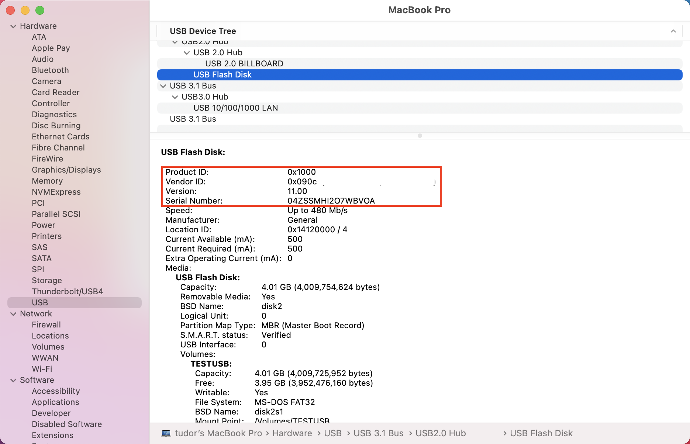

# <a name="device-control-for-macos"></a><span data-ttu-id="a76cf-104">Control de dispositivos para macOS</span><span class="sxs-lookup"><span data-stu-id="a76cf-104">Device control for macOS</span></span>

[!INCLUDE [Microsoft 365 Defender rebranding](../../includes/microsoft-defender.md)]

<span data-ttu-id="a76cf-105">**Se aplica a:**</span><span class="sxs-lookup"><span data-stu-id="a76cf-105">**Applies to:**</span></span>
- [<span data-ttu-id="a76cf-106">Microsoft Defender para punto de conexión</span><span class="sxs-lookup"><span data-stu-id="a76cf-106">Microsoft Defender for Endpoint</span></span>](https://go.microsoft.com/fwlink/p/?linkid=2154037)
- [<span data-ttu-id="a76cf-107">Microsoft 365 Defender</span><span class="sxs-lookup"><span data-stu-id="a76cf-107">Microsoft 365 Defender</span></span>](https://go.microsoft.com/fwlink/?linkid=2118804)

> <span data-ttu-id="a76cf-108">¿Desea experimentar Microsoft Defender para endpoint?</span><span class="sxs-lookup"><span data-stu-id="a76cf-108">Want to experience Microsoft Defender for Endpoint?</span></span> [<span data-ttu-id="a76cf-109">Regístrate para obtener una versión de prueba gratuita.</span><span class="sxs-lookup"><span data-stu-id="a76cf-109">Sign up for a free trial.</span></span>](https://www.microsoft.com/microsoft-365/windows/microsoft-defender-atp?ocid=docs-wdatp-exposedapis-abovefoldlink)

[!include[Prerelease information](../../includes/prerelease.md)]

## <a name="requirements"></a><span data-ttu-id="a76cf-110">Requisitos</span><span class="sxs-lookup"><span data-stu-id="a76cf-110">Requirements</span></span>

<span data-ttu-id="a76cf-111">El control de dispositivos para macOS tiene los siguientes requisitos previos:</span><span class="sxs-lookup"><span data-stu-id="a76cf-111">Device control for macOS has the following prerequisites:</span></span>

>[!div class="checklist"]
> - <span data-ttu-id="a76cf-112">Derechos de Microsoft Defender para extremo (puede ser de prueba)</span><span class="sxs-lookup"><span data-stu-id="a76cf-112">Microsoft Defender for Endpoint entitlement (can be trial)</span></span>
> - <span data-ttu-id="a76cf-113">Versión mínima del sistema operativo: macOS 10.15.4 o posterior</span><span class="sxs-lookup"><span data-stu-id="a76cf-113">Minimum OS version: macOS 10.15.4 or higher</span></span>
> - <span data-ttu-id="a76cf-114">Versión mínima del producto: 101.24.59</span><span class="sxs-lookup"><span data-stu-id="a76cf-114">Minimum product version: 101.24.59</span></span>
> - <span data-ttu-id="a76cf-115">El dispositivo debe ejecutarse con extensiones del sistema (este es el valor predeterminado en macOS 11 Big Sur).</span><span class="sxs-lookup"><span data-stu-id="a76cf-115">Your device must be running with system extensions (this is the default on macOS 11 Big Sur).</span></span> 
> 
>   <span data-ttu-id="a76cf-116">Para comprobar si el dispositivo se está ejecutando en extensiones del sistema, ejecute el siguiente comando y compruebe que se está imprimiendo `endpoint_security_extension` en la consola:</span><span class="sxs-lookup"><span data-stu-id="a76cf-116">You can check if your device is running on system extensions by running the following command and verify that it is printing `endpoint_security_extension` to the console:</span></span> 
> 
>   ```bash
>   mdatp health --field real_time_protection_subsystem 
>   ```
> - <span data-ttu-id="a76cf-117">El dispositivo debe estar en `Beta` el canal de actualización de Microsoft AutoUpdate (anteriormente denominado `InsiderFast` ) .</span><span class="sxs-lookup"><span data-stu-id="a76cf-117">Your device must be in `Beta` (previously called `InsiderFast`) Microsoft AutoUpdate update channel.</span></span> <span data-ttu-id="a76cf-118">Para obtener más información, vea [Deploy updates for Microsoft Defender for Endpoint on Mac](mac-updates.md).</span><span class="sxs-lookup"><span data-stu-id="a76cf-118">For more information, see [Deploy updates for Microsoft Defender for Endpoint on Mac](mac-updates.md).</span></span>
> 
>   <span data-ttu-id="a76cf-119">Puede comprobar el canal de actualización con el siguiente comando:</span><span class="sxs-lookup"><span data-stu-id="a76cf-119">You can check the update channel using the following command:</span></span> 
> 
>    ```bash
>    mdatp health --field release_ring 
>    ```
>
>    <span data-ttu-id="a76cf-120">Si el comando anterior no imprime ni `Beta` , ejecute el siguiente comando desde `InsiderFast` terminal.</span><span class="sxs-lookup"><span data-stu-id="a76cf-120">If the above command does not print either `Beta` or `InsiderFast`, execute the following command from the Terminal.</span></span> <span data-ttu-id="a76cf-121">La actualización de canal surte efecto la próxima vez que se inicie el producto (cuando se instale la siguiente actualización del producto o cuando se reinicie el dispositivo).</span><span class="sxs-lookup"><span data-stu-id="a76cf-121">The channel update takes effect next time the product starts (when the next product update is installed or when the device is rebooted).</span></span> 
> 
>    ```bash
>    defaults write com.microsoft.autoupdate2 ChannelName -string Beta
>    ```
>
>    <span data-ttu-id="a76cf-122">Como alternativa, si se encuentra en un entorno administrado (JAMF o Intune), puede configurar el canal de actualización de forma remota.</span><span class="sxs-lookup"><span data-stu-id="a76cf-122">Alternatively, if you are in a managed environment (JAMF or Intune), you can configure the update channel remotely.</span></span> <span data-ttu-id="a76cf-123">Para obtener más información, vea [Deploy updates for Microsoft Defender for Endpoint on Mac](mac-updates.md).</span><span class="sxs-lookup"><span data-stu-id="a76cf-123">For more information, see [Deploy updates for Microsoft Defender for Endpoint on Mac](mac-updates.md).</span></span> 

## <a name="device-control-policy"></a><span data-ttu-id="a76cf-124">Directiva de control de dispositivos</span><span class="sxs-lookup"><span data-stu-id="a76cf-124">Device control policy</span></span>

<span data-ttu-id="a76cf-125">Para configurar el control de dispositivos para macOS, debes crear una directiva que describa las restricciones que quieres establecer en tu organización.</span><span class="sxs-lookup"><span data-stu-id="a76cf-125">To configure device control for macOS, you must create a policy that describes the restrictions you want to put in place within your organization.</span></span>

<span data-ttu-id="a76cf-126">La directiva de control de dispositivos se incluye en el perfil de configuración que se usa para configurar el resto de opciones de producto.</span><span class="sxs-lookup"><span data-stu-id="a76cf-126">The device control policy is included in the configuration profile used to configure all other product settings.</span></span> <span data-ttu-id="a76cf-127">Para obtener más información, vea [Configuration profile structure](mac-preferences.md#configuration-profile-structure).</span><span class="sxs-lookup"><span data-stu-id="a76cf-127">For more information, see [Configuration profile structure](mac-preferences.md#configuration-profile-structure).</span></span>

<span data-ttu-id="a76cf-128">Dentro del perfil de configuración, la directiva de control de dispositivos se define en la siguiente sección:</span><span class="sxs-lookup"><span data-stu-id="a76cf-128">Within the configuration profile, the device control policy is defined in the following section:</span></span>

|<span data-ttu-id="a76cf-129">Sección</span><span class="sxs-lookup"><span data-stu-id="a76cf-129">Section</span></span>|<span data-ttu-id="a76cf-130">Valor</span><span class="sxs-lookup"><span data-stu-id="a76cf-130">Value</span></span>|
|:---|:---|
| <span data-ttu-id="a76cf-131">**Dominio**</span><span class="sxs-lookup"><span data-stu-id="a76cf-131">**Domain**</span></span> | `com.microsoft.wdav` |
| <span data-ttu-id="a76cf-132">**Clave**</span><span class="sxs-lookup"><span data-stu-id="a76cf-132">**Key**</span></span> | <span data-ttu-id="a76cf-133">deviceControl</span><span class="sxs-lookup"><span data-stu-id="a76cf-133">deviceControl</span></span> |
| <span data-ttu-id="a76cf-134">**Tipo de datos**</span><span class="sxs-lookup"><span data-stu-id="a76cf-134">**Data type**</span></span> | <span data-ttu-id="a76cf-135">Diccionario (preferencia anidada)</span><span class="sxs-lookup"><span data-stu-id="a76cf-135">Dictionary (nested preference)</span></span> |
| <span data-ttu-id="a76cf-136">**Comments**</span><span class="sxs-lookup"><span data-stu-id="a76cf-136">**Comments**</span></span> | <span data-ttu-id="a76cf-137">Vea las secciones siguientes para obtener una descripción del contenido del diccionario.</span><span class="sxs-lookup"><span data-stu-id="a76cf-137">See the following sections for a description of the dictionary contents.</span></span> |

<span data-ttu-id="a76cf-138">La directiva de control de dispositivos se puede usar para:</span><span class="sxs-lookup"><span data-stu-id="a76cf-138">The device control policy can be used to:</span></span>

- [<span data-ttu-id="a76cf-139">Personalizar el destino de dirección URL para las notificaciones que genera el control de dispositivos</span><span class="sxs-lookup"><span data-stu-id="a76cf-139">Customize the URL target for notifications raised by device control</span></span>](#customize-url-target-for-notifications-raised-by-device-control)
- [<span data-ttu-id="a76cf-140">Permitir o bloquear dispositivos extraíbles</span><span class="sxs-lookup"><span data-stu-id="a76cf-140">Allow or block removable devices</span></span>](#allow-or-block-removable-devices)

### <a name="customize-url-target-for-notifications-raised-by-device-control"></a><span data-ttu-id="a76cf-141">Personalizar el destino de dirección URL para las notificaciones que genera el control de dispositivos</span><span class="sxs-lookup"><span data-stu-id="a76cf-141">Customize URL target for notifications raised by device control</span></span>

<span data-ttu-id="a76cf-142">Cuando se aplica la directiva de control de dispositivos que has puesto en marcha en un dispositivo (por ejemplo, el acceso a un dispositivo multimedia extraíble está restringido), se muestra una notificación al usuario.</span><span class="sxs-lookup"><span data-stu-id="a76cf-142">When the device control policy that you have put in place is enforced on a device (for example, access to a removable media device is restricted), a notification is displayed to the user.</span></span>


<span data-ttu-id="a76cf-144">Cuando los usuarios finales hacen clic en esta notificación, se abre una página web en el explorador predeterminado.</span><span class="sxs-lookup"><span data-stu-id="a76cf-144">When end users click this notification, a web page is opened in the default browser.</span></span> <span data-ttu-id="a76cf-145">Puede configurar la dirección URL que se abre cuando los usuarios finales hacen clic en la notificación.</span><span class="sxs-lookup"><span data-stu-id="a76cf-145">You can configure the URL that is opened when end users click the notification.</span></span>

|<span data-ttu-id="a76cf-146">Sección</span><span class="sxs-lookup"><span data-stu-id="a76cf-146">Section</span></span>|<span data-ttu-id="a76cf-147">Valor</span><span class="sxs-lookup"><span data-stu-id="a76cf-147">Value</span></span>|
|:---|:---|
| <span data-ttu-id="a76cf-148">**Dominio**</span><span class="sxs-lookup"><span data-stu-id="a76cf-148">**Domain**</span></span> | `com.microsoft.wdav` |
| <span data-ttu-id="a76cf-149">**Clave**</span><span class="sxs-lookup"><span data-stu-id="a76cf-149">**Key**</span></span> | <span data-ttu-id="a76cf-150">navigationTarget</span><span class="sxs-lookup"><span data-stu-id="a76cf-150">navigationTarget</span></span> |
| <span data-ttu-id="a76cf-151">**Tipo de datos**</span><span class="sxs-lookup"><span data-stu-id="a76cf-151">**Data type**</span></span> | <span data-ttu-id="a76cf-152">Cadena</span><span class="sxs-lookup"><span data-stu-id="a76cf-152">String</span></span> |
| <span data-ttu-id="a76cf-153">**Comments**</span><span class="sxs-lookup"><span data-stu-id="a76cf-153">**Comments**</span></span> | <span data-ttu-id="a76cf-154">Si no se define, el producto usa una dirección URL predeterminada que apunta a una página genérica que explica la acción realizada por el producto.</span><span class="sxs-lookup"><span data-stu-id="a76cf-154">If not defined, the product uses a default URL pointing to a generic page explaining the action taken by the product.</span></span> |

### <a name="allow-or-block-removable-devices"></a><span data-ttu-id="a76cf-155">Permitir o bloquear dispositivos extraíbles</span><span class="sxs-lookup"><span data-stu-id="a76cf-155">Allow or block removable devices</span></span>

<span data-ttu-id="a76cf-156">La sección de medios extraíbles de la directiva de control de dispositivos se usa para restringir el acceso a medios extraíbles.</span><span class="sxs-lookup"><span data-stu-id="a76cf-156">The removable media section of the device control policy is used to restrict access to removable media.</span></span> 

> [!NOTE]
> <span data-ttu-id="a76cf-157">Actualmente se admiten los siguientes tipos de medios extraíbles y se pueden incluir en la directiva: dispositivos de almacenamiento USB.</span><span class="sxs-lookup"><span data-stu-id="a76cf-157">The following types of removable media are currently supported and can be included in the policy: USB storage devices.</span></span>

|<span data-ttu-id="a76cf-158">Sección</span><span class="sxs-lookup"><span data-stu-id="a76cf-158">Section</span></span>|<span data-ttu-id="a76cf-159">Valor</span><span class="sxs-lookup"><span data-stu-id="a76cf-159">Value</span></span>|
|:---|:---|
| <span data-ttu-id="a76cf-160">**Dominio**</span><span class="sxs-lookup"><span data-stu-id="a76cf-160">**Domain**</span></span> | `com.microsoft.wdav` |
| <span data-ttu-id="a76cf-161">**Clave**</span><span class="sxs-lookup"><span data-stu-id="a76cf-161">**Key**</span></span> | <span data-ttu-id="a76cf-162">removableMediaPolicy</span><span class="sxs-lookup"><span data-stu-id="a76cf-162">removableMediaPolicy</span></span> |
| <span data-ttu-id="a76cf-163">**Tipo de datos**</span><span class="sxs-lookup"><span data-stu-id="a76cf-163">**Data type**</span></span> | <span data-ttu-id="a76cf-164">Diccionario (preferencia anidada)</span><span class="sxs-lookup"><span data-stu-id="a76cf-164">Dictionary (nested preference)</span></span> |
| <span data-ttu-id="a76cf-165">**Comments**</span><span class="sxs-lookup"><span data-stu-id="a76cf-165">**Comments**</span></span> | <span data-ttu-id="a76cf-166">Vea las secciones siguientes para obtener una descripción del contenido del diccionario.</span><span class="sxs-lookup"><span data-stu-id="a76cf-166">See the following sections for a description of the dictionary contents.</span></span> |

<span data-ttu-id="a76cf-167">Esta sección de la directiva es jerárquica, lo que permite la máxima flexibilidad y cubre una amplia variedad de casos de uso.</span><span class="sxs-lookup"><span data-stu-id="a76cf-167">This section of the policy is hierarchical, allowing for maximum flexibility and covering a wide range of use cases.</span></span> <span data-ttu-id="a76cf-168">En el nivel superior se encuentran los proveedores, identificados por un identificador de proveedor.</span><span class="sxs-lookup"><span data-stu-id="a76cf-168">At the top level are vendors, identified by a vendor ID.</span></span> <span data-ttu-id="a76cf-169">Para cada proveedor, hay productos identificados por un identificador de producto.</span><span class="sxs-lookup"><span data-stu-id="a76cf-169">For each vendor, there are products, identified by a product ID.</span></span> <span data-ttu-id="a76cf-170">Por último, para cada producto hay números de serie que indican dispositivos específicos.</span><span class="sxs-lookup"><span data-stu-id="a76cf-170">Finally, for each product there are serial numbers denoting specific devices.</span></span>

```
|-- policy top level 
    |-- vendor 1 
        |-- product 1 
            |-- serial number 1 
            ...
            |-- serial number N 
        ...
        |-- product N 
    ...
    |-- vendor N
```

<span data-ttu-id="a76cf-171">Para obtener información sobre cómo encontrar los identificadores de dispositivo, consulta [Buscar identificadores de dispositivo.](#look-up-device-identifiers)</span><span class="sxs-lookup"><span data-stu-id="a76cf-171">For information on how to find the device identifiers, see [Look up device identifiers](#look-up-device-identifiers).</span></span>

<span data-ttu-id="a76cf-172">La directiva se evalúa desde la entrada más específica hasta la más general.</span><span class="sxs-lookup"><span data-stu-id="a76cf-172">The policy is evaluated from the most specific entry to the most general one.</span></span> <span data-ttu-id="a76cf-173">Es decir, cuando un dispositivo está conectado, el producto intenta encontrar la coincidencia más específica en la directiva para cada dispositivo multimedia extraíble y aplicar los permisos en ese nivel.</span><span class="sxs-lookup"><span data-stu-id="a76cf-173">Meaning, when a device is plugged in, the product tries to find the most specific match in the policy for each removable media device and apply the permissions at that level.</span></span> <span data-ttu-id="a76cf-174">Si no hay coincidencia, se aplica la siguiente mejor coincidencia, hasta el permiso especificado en el nivel superior, que es el valor predeterminado cuando un dispositivo no coincide con ninguna otra entrada de la directiva.</span><span class="sxs-lookup"><span data-stu-id="a76cf-174">If there is no match, then the next best match is applied, all the way to the permission specified at the top level, which is the default when a device does not match any other entry in the policy.</span></span>

#### <a name="policy-enforcement-level"></a><span data-ttu-id="a76cf-175">Nivel de aplicación de directivas</span><span class="sxs-lookup"><span data-stu-id="a76cf-175">Policy enforcement level</span></span>

<span data-ttu-id="a76cf-176">En la sección medios extraíbles, hay una opción para establecer el nivel de cumplimiento, que puede tener uno de los siguientes valores:</span><span class="sxs-lookup"><span data-stu-id="a76cf-176">Under the removable media section, there is an option to set the enforcement level, which can take one of the following values:</span></span>

- <span data-ttu-id="a76cf-177">`audit` - En este nivel de aplicación, si el acceso a un dispositivo está restringido, se muestra una notificación al usuario, pero aún se puede usar el dispositivo.</span><span class="sxs-lookup"><span data-stu-id="a76cf-177">`audit` - Under this enforcement level, if access to a device is restricted, a notification is displayed to the user, however the device can still be used.</span></span> <span data-ttu-id="a76cf-178">Este nivel de cumplimiento puede ser útil para evaluar la eficacia de una directiva.</span><span class="sxs-lookup"><span data-stu-id="a76cf-178">This enforcement level can be useful to evaluate the effectiveness of a policy.</span></span>
- <span data-ttu-id="a76cf-179">`block` - En este nivel de cumplimiento, las operaciones que el usuario puede realizar en el dispositivo se limitan a lo que se define en la directiva.</span><span class="sxs-lookup"><span data-stu-id="a76cf-179">`block` - Under this enforcement level, the operations that the user can perform on the device are limited to what is defined in the policy.</span></span> <span data-ttu-id="a76cf-180">Además, se genera una notificación al usuario.</span><span class="sxs-lookup"><span data-stu-id="a76cf-180">Furthermore, a notification is raised to the user.</span></span> 

|<span data-ttu-id="a76cf-181">Sección</span><span class="sxs-lookup"><span data-stu-id="a76cf-181">Section</span></span>|<span data-ttu-id="a76cf-182">Valor</span><span class="sxs-lookup"><span data-stu-id="a76cf-182">Value</span></span>|
|:---|:---|
| <span data-ttu-id="a76cf-183">**Dominio**</span><span class="sxs-lookup"><span data-stu-id="a76cf-183">**Domain**</span></span> | `com.microsoft.wdav` |
| <span data-ttu-id="a76cf-184">**Clave**</span><span class="sxs-lookup"><span data-stu-id="a76cf-184">**Key**</span></span> | <span data-ttu-id="a76cf-185">enforcementLevel</span><span class="sxs-lookup"><span data-stu-id="a76cf-185">enforcementLevel</span></span> |
| <span data-ttu-id="a76cf-186">**Tipo de datos**</span><span class="sxs-lookup"><span data-stu-id="a76cf-186">**Data type**</span></span> | <span data-ttu-id="a76cf-187">Cadena</span><span class="sxs-lookup"><span data-stu-id="a76cf-187">String</span></span> |
| <span data-ttu-id="a76cf-188">**Posibles valores**</span><span class="sxs-lookup"><span data-stu-id="a76cf-188">**Possible values**</span></span> | <span data-ttu-id="a76cf-189">auditoría (valor predeterminado)</span><span class="sxs-lookup"><span data-stu-id="a76cf-189">audit (default)</span></span> <br/> <span data-ttu-id="a76cf-190">bloque</span><span class="sxs-lookup"><span data-stu-id="a76cf-190">block</span></span> |

#### <a name="default-permission-level"></a><span data-ttu-id="a76cf-191">Nivel de permisos predeterminado</span><span class="sxs-lookup"><span data-stu-id="a76cf-191">Default permission level</span></span>

<span data-ttu-id="a76cf-192">En el nivel superior de la sección de medios extraíbles, puede configurar el nivel de permisos predeterminado para dispositivos que no coincidan con nada más en la directiva.</span><span class="sxs-lookup"><span data-stu-id="a76cf-192">At the top level of the removable media section, you can configure the default permission level for devices that do not match anything else in the policy.</span></span>

<span data-ttu-id="a76cf-193">Esta configuración se puede establecer en:</span><span class="sxs-lookup"><span data-stu-id="a76cf-193">This setting can be set to:</span></span>

- <span data-ttu-id="a76cf-194">`none` - No se pueden realizar operaciones en el dispositivo</span><span class="sxs-lookup"><span data-stu-id="a76cf-194">`none` - No operations can be performed on the device</span></span>
- <span data-ttu-id="a76cf-195">Una combinación de los siguientes valores:</span><span class="sxs-lookup"><span data-stu-id="a76cf-195">A combination of the following values:</span></span>
    - <span data-ttu-id="a76cf-196">`read` - Las operaciones de lectura están permitidas en el dispositivo</span><span class="sxs-lookup"><span data-stu-id="a76cf-196">`read` - Read operations are permitted on the device</span></span>
    - <span data-ttu-id="a76cf-197">`write` - Las operaciones de escritura están permitidas en el dispositivo</span><span class="sxs-lookup"><span data-stu-id="a76cf-197">`write` - Write operations are permitted on the device</span></span>
    - <span data-ttu-id="a76cf-198">`execute` - Las operaciones de ejecución están permitidas en el dispositivo</span><span class="sxs-lookup"><span data-stu-id="a76cf-198">`execute` - Execute operations are permitted on the device</span></span>

> [!NOTE]
> <span data-ttu-id="a76cf-199">Si `none` está presente en el nivel de permisos, cualquier otro permiso ( , , o ) se `read` `write` `execute` omitirá.</span><span class="sxs-lookup"><span data-stu-id="a76cf-199">If `none` is present in the permission level, any other permissions (`read`, `write`, or `execute`) will be ignored.</span></span>

> [!NOTE]
> <span data-ttu-id="a76cf-200">El `execute` permiso solo hace referencia a la ejecución de archivos binarios de Mach-O.</span><span class="sxs-lookup"><span data-stu-id="a76cf-200">The `execute` permission only refers to execution of Mach-O binaries.</span></span> <span data-ttu-id="a76cf-201">No incluye la ejecución de scripts u otros tipos de cargas.</span><span class="sxs-lookup"><span data-stu-id="a76cf-201">It does not include execution of scripts or other types of payloads.</span></span>

|<span data-ttu-id="a76cf-202">Sección</span><span class="sxs-lookup"><span data-stu-id="a76cf-202">Section</span></span>|<span data-ttu-id="a76cf-203">Valor</span><span class="sxs-lookup"><span data-stu-id="a76cf-203">Value</span></span>|
|:---|:---|
| <span data-ttu-id="a76cf-204">**Dominio**</span><span class="sxs-lookup"><span data-stu-id="a76cf-204">**Domain**</span></span> | `com.microsoft.wdav` |
| <span data-ttu-id="a76cf-205">**Clave**</span><span class="sxs-lookup"><span data-stu-id="a76cf-205">**Key**</span></span> | <span data-ttu-id="a76cf-206">permiso</span><span class="sxs-lookup"><span data-stu-id="a76cf-206">permission</span></span> |
| <span data-ttu-id="a76cf-207">**Tipo de datos**</span><span class="sxs-lookup"><span data-stu-id="a76cf-207">**Data type**</span></span> | <span data-ttu-id="a76cf-208">Matriz de cadenas</span><span class="sxs-lookup"><span data-stu-id="a76cf-208">Array of strings</span></span> |
| <span data-ttu-id="a76cf-209">**Posibles valores**</span><span class="sxs-lookup"><span data-stu-id="a76cf-209">**Possible values**</span></span> | <span data-ttu-id="a76cf-210">ninguno</span><span class="sxs-lookup"><span data-stu-id="a76cf-210">none</span></span> <br/> <span data-ttu-id="a76cf-211">read</span><span class="sxs-lookup"><span data-stu-id="a76cf-211">read</span></span> <br/> <span data-ttu-id="a76cf-212">write</span><span class="sxs-lookup"><span data-stu-id="a76cf-212">write</span></span> <br/> <span data-ttu-id="a76cf-213">execute</span><span class="sxs-lookup"><span data-stu-id="a76cf-213">execute</span></span> |

#### <a name="restrict-removable-media-by-vendor-product-and-serial-number"></a><span data-ttu-id="a76cf-214">Restringir medios extraíbles por proveedor, producto y número de serie</span><span class="sxs-lookup"><span data-stu-id="a76cf-214">Restrict removable media by vendor, product, and serial number</span></span>

<span data-ttu-id="a76cf-215">Como se describe en [Permitir](#allow-or-block-removable-devices)o bloquear dispositivos extraíbles, los medios extraíbles, como dispositivos USB, pueden identificarse mediante el identificador de proveedor, el identificador de producto y el número de serie.</span><span class="sxs-lookup"><span data-stu-id="a76cf-215">As described in [Allow or block removable devices](#allow-or-block-removable-devices), removable media such as USB devices can be identified by the vendor ID, product ID, and serial number.</span></span>

<span data-ttu-id="a76cf-216">En el nivel superior de la directiva de medios extraíbles, opcionalmente puede definir restricciones más granulares en el nivel de proveedor.</span><span class="sxs-lookup"><span data-stu-id="a76cf-216">At the top level of the removable media policy, you can optionally define more granular restrictions at the vendor level.</span></span> 

<span data-ttu-id="a76cf-217">El `vendors` diccionario contiene una o más entradas, con cada entrada identificada por el identificador de proveedor.</span><span class="sxs-lookup"><span data-stu-id="a76cf-217">The `vendors` dictionary contains one or more entries, with each entry being identified by the vendor ID.</span></span>

|<span data-ttu-id="a76cf-218">Sección</span><span class="sxs-lookup"><span data-stu-id="a76cf-218">Section</span></span>|<span data-ttu-id="a76cf-219">Valor</span><span class="sxs-lookup"><span data-stu-id="a76cf-219">Value</span></span>|
|:---|:---|
| <span data-ttu-id="a76cf-220">**Dominio**</span><span class="sxs-lookup"><span data-stu-id="a76cf-220">**Domain**</span></span> | `com.microsoft.wdav` |
| <span data-ttu-id="a76cf-221">**Clave**</span><span class="sxs-lookup"><span data-stu-id="a76cf-221">**Key**</span></span> | <span data-ttu-id="a76cf-222">proveedores</span><span class="sxs-lookup"><span data-stu-id="a76cf-222">vendors</span></span> |
| <span data-ttu-id="a76cf-223">**Tipo de datos**</span><span class="sxs-lookup"><span data-stu-id="a76cf-223">**Data type**</span></span> | <span data-ttu-id="a76cf-224">Diccionario (preferencia anidada)</span><span class="sxs-lookup"><span data-stu-id="a76cf-224">Dictionary (nested preference)</span></span> |

<span data-ttu-id="a76cf-225">Para cada proveedor, puede especificar el nivel de permisos deseado para los dispositivos de ese proveedor.</span><span class="sxs-lookup"><span data-stu-id="a76cf-225">For each vendor, you can specify the desired permission level for devices from that vendor.</span></span>

|<span data-ttu-id="a76cf-226">Sección</span><span class="sxs-lookup"><span data-stu-id="a76cf-226">Section</span></span>|<span data-ttu-id="a76cf-227">Valor</span><span class="sxs-lookup"><span data-stu-id="a76cf-227">Value</span></span>|
|:---|:---|
| <span data-ttu-id="a76cf-228">**Dominio**</span><span class="sxs-lookup"><span data-stu-id="a76cf-228">**Domain**</span></span> | `com.microsoft.wdav` |
| <span data-ttu-id="a76cf-229">**Clave**</span><span class="sxs-lookup"><span data-stu-id="a76cf-229">**Key**</span></span> | <span data-ttu-id="a76cf-230">permiso</span><span class="sxs-lookup"><span data-stu-id="a76cf-230">permission</span></span> |
| <span data-ttu-id="a76cf-231">**Tipo de datos**</span><span class="sxs-lookup"><span data-stu-id="a76cf-231">**Data type**</span></span> | <span data-ttu-id="a76cf-232">Matriz de cadenas</span><span class="sxs-lookup"><span data-stu-id="a76cf-232">Array of strings</span></span> |
| <span data-ttu-id="a76cf-233">**Posibles valores**</span><span class="sxs-lookup"><span data-stu-id="a76cf-233">**Possible values**</span></span> | <span data-ttu-id="a76cf-234">Igual que [el nivel de permisos predeterminado](#default-permission-level)</span><span class="sxs-lookup"><span data-stu-id="a76cf-234">Same as [Default permission level](#default-permission-level)</span></span> |

<span data-ttu-id="a76cf-235">Además, puede especificar opcionalmente el conjunto de productos que pertenecen a ese proveedor para el que se definen permisos más granulares.</span><span class="sxs-lookup"><span data-stu-id="a76cf-235">Furthermore, you can optionally specify the set of products belonging to that vendor for which more granular permissions are defined.</span></span> <span data-ttu-id="a76cf-236">El diccionario contiene una o más entradas, con `products` cada entrada identificada por el identificador del producto.</span><span class="sxs-lookup"><span data-stu-id="a76cf-236">The `products` dictionary contains one or more entries, with each entry being identified by the product ID.</span></span> 

|<span data-ttu-id="a76cf-237">Sección</span><span class="sxs-lookup"><span data-stu-id="a76cf-237">Section</span></span>|<span data-ttu-id="a76cf-238">Valor</span><span class="sxs-lookup"><span data-stu-id="a76cf-238">Value</span></span>|
|:---|:---|
| <span data-ttu-id="a76cf-239">**Dominio**</span><span class="sxs-lookup"><span data-stu-id="a76cf-239">**Domain**</span></span> | `com.microsoft.wdav` |
| <span data-ttu-id="a76cf-240">**Clave**</span><span class="sxs-lookup"><span data-stu-id="a76cf-240">**Key**</span></span> | <span data-ttu-id="a76cf-241">productos</span><span class="sxs-lookup"><span data-stu-id="a76cf-241">products</span></span> |
| <span data-ttu-id="a76cf-242">**Tipo de datos**</span><span class="sxs-lookup"><span data-stu-id="a76cf-242">**Data type**</span></span> | <span data-ttu-id="a76cf-243">Diccionario (preferencia anidada)</span><span class="sxs-lookup"><span data-stu-id="a76cf-243">Dictionary (nested preference)</span></span> |

<span data-ttu-id="a76cf-244">Para cada producto, puede especificar el nivel de permisos deseado para ese producto.</span><span class="sxs-lookup"><span data-stu-id="a76cf-244">For each product, you can specify the desired permission level for that product.</span></span>

|<span data-ttu-id="a76cf-245">Sección</span><span class="sxs-lookup"><span data-stu-id="a76cf-245">Section</span></span>|<span data-ttu-id="a76cf-246">Valor</span><span class="sxs-lookup"><span data-stu-id="a76cf-246">Value</span></span>|
|:---|:---|
| <span data-ttu-id="a76cf-247">**Dominio**</span><span class="sxs-lookup"><span data-stu-id="a76cf-247">**Domain**</span></span> | `com.microsoft.wdav` |
| <span data-ttu-id="a76cf-248">**Clave**</span><span class="sxs-lookup"><span data-stu-id="a76cf-248">**Key**</span></span> | <span data-ttu-id="a76cf-249">permiso</span><span class="sxs-lookup"><span data-stu-id="a76cf-249">permission</span></span> |
| <span data-ttu-id="a76cf-250">**Tipo de datos**</span><span class="sxs-lookup"><span data-stu-id="a76cf-250">**Data type**</span></span> | <span data-ttu-id="a76cf-251">Matriz de cadenas</span><span class="sxs-lookup"><span data-stu-id="a76cf-251">Array of strings</span></span> |
| <span data-ttu-id="a76cf-252">**Posibles valores**</span><span class="sxs-lookup"><span data-stu-id="a76cf-252">**Possible values**</span></span> | <span data-ttu-id="a76cf-253">Igual que [el nivel de permisos predeterminado](#default-permission-level)</span><span class="sxs-lookup"><span data-stu-id="a76cf-253">Same as [Default permission level](#default-permission-level)</span></span> |

<span data-ttu-id="a76cf-254">Además, puede especificar un conjunto opcional de números de serie para los que se definen permisos más granulares.</span><span class="sxs-lookup"><span data-stu-id="a76cf-254">Furthermore, you can specify an optional set of serial numbers for which more granular permissions are defined.</span></span>

<span data-ttu-id="a76cf-255">El `serialNumbers` diccionario contiene una o más entradas, con cada entrada identificada por el número de serie.</span><span class="sxs-lookup"><span data-stu-id="a76cf-255">The `serialNumbers` dictionary contains one or more entries, with each entry being identified by the serial number.</span></span>

|<span data-ttu-id="a76cf-256">Sección</span><span class="sxs-lookup"><span data-stu-id="a76cf-256">Section</span></span>|<span data-ttu-id="a76cf-257">Valor</span><span class="sxs-lookup"><span data-stu-id="a76cf-257">Value</span></span>|
|:---|:---|
| <span data-ttu-id="a76cf-258">**Dominio**</span><span class="sxs-lookup"><span data-stu-id="a76cf-258">**Domain**</span></span> | `com.microsoft.wdav` |
| <span data-ttu-id="a76cf-259">**Clave**</span><span class="sxs-lookup"><span data-stu-id="a76cf-259">**Key**</span></span> | <span data-ttu-id="a76cf-260">serialNumbers</span><span class="sxs-lookup"><span data-stu-id="a76cf-260">serialNumbers</span></span> |
| <span data-ttu-id="a76cf-261">**Tipo de datos**</span><span class="sxs-lookup"><span data-stu-id="a76cf-261">**Data type**</span></span> | <span data-ttu-id="a76cf-262">Diccionario (preferencia anidada)</span><span class="sxs-lookup"><span data-stu-id="a76cf-262">Dictionary (nested preference)</span></span> |

<span data-ttu-id="a76cf-263">Para cada número de serie, puede especificar el nivel de permisos deseado.</span><span class="sxs-lookup"><span data-stu-id="a76cf-263">For each serial number, you can specify the desired permission level.</span></span>

|<span data-ttu-id="a76cf-264">Sección</span><span class="sxs-lookup"><span data-stu-id="a76cf-264">Section</span></span>|<span data-ttu-id="a76cf-265">Valor</span><span class="sxs-lookup"><span data-stu-id="a76cf-265">Value</span></span>|
|:---|:---|
| <span data-ttu-id="a76cf-266">**Dominio**</span><span class="sxs-lookup"><span data-stu-id="a76cf-266">**Domain**</span></span> | `com.microsoft.wdav` |
| <span data-ttu-id="a76cf-267">**Clave**</span><span class="sxs-lookup"><span data-stu-id="a76cf-267">**Key**</span></span> | <span data-ttu-id="a76cf-268">permiso</span><span class="sxs-lookup"><span data-stu-id="a76cf-268">permission</span></span> |
| <span data-ttu-id="a76cf-269">**Tipo de datos**</span><span class="sxs-lookup"><span data-stu-id="a76cf-269">**Data type**</span></span> | <span data-ttu-id="a76cf-270">Matriz de cadenas</span><span class="sxs-lookup"><span data-stu-id="a76cf-270">Array of strings</span></span> |
| <span data-ttu-id="a76cf-271">**Posibles valores**</span><span class="sxs-lookup"><span data-stu-id="a76cf-271">**Possible values**</span></span> | <span data-ttu-id="a76cf-272">Igual que [el nivel de permisos predeterminado](#default-permission-level)</span><span class="sxs-lookup"><span data-stu-id="a76cf-272">Same as [Default permission level](#default-permission-level)</span></span> |

#### <a name="example-device-control-policy"></a><span data-ttu-id="a76cf-273">Ejemplo de directiva de control de dispositivos</span><span class="sxs-lookup"><span data-stu-id="a76cf-273">Example device control policy</span></span>

<span data-ttu-id="a76cf-274">En el siguiente ejemplo se muestra cómo se pueden combinar todos los conceptos anteriores en una directiva de control de dispositivos.</span><span class="sxs-lookup"><span data-stu-id="a76cf-274">The following example shows how all of the above concepts can be combined into a device control policy.</span></span> <span data-ttu-id="a76cf-275">En el ejemplo siguiente, tenga en cuenta la naturaleza jerárquica de la directiva de medios extraíble.</span><span class="sxs-lookup"><span data-stu-id="a76cf-275">In the following example, note the hierarchical nature of the removable media policy.</span></span>

```xml
<?xml version="1.0" encoding="UTF-8"?> 
<!DOCTYPE plist PUBLIC "-//Apple//DTD PLIST 1.0//EN" "http://www.apple.com/DTDs/PropertyList-1.0.dtd"> 
<plist version="1.0"> 
<dict> 
    <key>deviceControl</key> 
    <dict> 
        <key>navigationTarget</key> 
        <string>[custom URL for notifications]</string> 
        <key>removableMediaPolicy</key> 
        <dict> 
            <key>enforcementLevel</key> 
            <string>[enforcement level]</string> <!-- audit / block --> 
            <key>permission</key> 
            <array> 
                <string>[permission]</string> <!-- none / read / write / execute --> 
                <!-- other permissions -->
            </array> 
            <key>vendors</key> 
            <dict> 
                <key>[vendor id]</key> 
                <dict>
                    <key>permission</key> 
                    <array> 
                        <string>[permission]</string> <!-- none / read / write / execute --> 
                        <!-- other permissions -->
                    </array> 
                    <key>products</key> 
                    <dict> 
                        <key>[product id]</key> 
                        <dict> 
                            <key>permission</key> 
                            <array> 
                                <string>[permission]</string> <!-- none / read / write / execute --> 
                                <!-- other permissions -->
                            </array> 
                            <key>serialNumbers</key> 
                            <dict> 
                                <key>[serial-number]</key> 
                                <array> 
                                    <string>[permission]</string> <!-- none / read / write / execute --> 
                                    <!-- other permissions -->
                                </array> 
                                <!-- other serial numbers --> 
                            </dict> 
                        </dict> 
                        <!-- other products --> 
                    </dict> 
                </dict> 
                <!-- other vendors --> 
            </dict> 
        </dict> 
    </dict> 
</dict> 
</plist> 
```

<span data-ttu-id="a76cf-276">Hemos incluido más ejemplos de directivas de control de dispositivos en los siguientes documentos:</span><span class="sxs-lookup"><span data-stu-id="a76cf-276">We have included more examples of device control policies in the following documents:</span></span>

- [<span data-ttu-id="a76cf-277">Ejemplos de directivas de control de dispositivos para Intune</span><span class="sxs-lookup"><span data-stu-id="a76cf-277">Examples of device control policies for Intune</span></span>](mac-device-control-intune.md)
- [<span data-ttu-id="a76cf-278">Ejemplos de directivas de control de dispositivos para JAMF</span><span class="sxs-lookup"><span data-stu-id="a76cf-278">Examples of device control policies for JAMF</span></span>](mac-device-control-jamf.md)

#### <a name="look-up-device-identifiers"></a><span data-ttu-id="a76cf-279">Buscar identificadores de dispositivo</span><span class="sxs-lookup"><span data-stu-id="a76cf-279">Look up device identifiers</span></span>

<span data-ttu-id="a76cf-280">Para buscar el identificador de proveedor, el id. de producto y el número de serie de un dispositivo USB:</span><span class="sxs-lookup"><span data-stu-id="a76cf-280">To find the vendor ID, product ID, and serial number of a USB device:</span></span>

1. <span data-ttu-id="a76cf-281">Inicie sesión en un dispositivo Mac.</span><span class="sxs-lookup"><span data-stu-id="a76cf-281">Log into a Mac device.</span></span>
1. <span data-ttu-id="a76cf-282">Conecta el dispositivo USB para el que quieres buscar los identificadores.</span><span class="sxs-lookup"><span data-stu-id="a76cf-282">Plug in the USB device for which you want to look up the identifiers.</span></span>
1. <span data-ttu-id="a76cf-283">En el menú de nivel superior de macOS, seleccione **Acerca de este Mac**.</span><span class="sxs-lookup"><span data-stu-id="a76cf-283">In the top-level menu of macOS, select **About This Mac**.</span></span>

    

1. <span data-ttu-id="a76cf-285">Seleccione **Informe del sistema**.</span><span class="sxs-lookup"><span data-stu-id="a76cf-285">Select **System Report**.</span></span>

    

1. <span data-ttu-id="a76cf-287">En la columna izquierda, seleccione **USB**.</span><span class="sxs-lookup"><span data-stu-id="a76cf-287">From the left column, select **USB**.</span></span>

    

1. <span data-ttu-id="a76cf-289">En **Árbol de dispositivos USB,** vaya al dispositivo USB que enchufó.</span><span class="sxs-lookup"><span data-stu-id="a76cf-289">Under **USB Device Tree**, navigate to the USB device that you plugged in.</span></span>

    

1. <span data-ttu-id="a76cf-291">Se muestran el id. de proveedor, el id. de producto y el número de serie.</span><span class="sxs-lookup"><span data-stu-id="a76cf-291">The vendor ID, product ID, and serial number are displayed.</span></span> <span data-ttu-id="a76cf-292">Al agregar el identificador de proveedor y el id. de producto a la directiva de medios extraíbles, solo debe agregar la parte después de `0x` .</span><span class="sxs-lookup"><span data-stu-id="a76cf-292">When adding the vendor ID and product ID to the removable media policy, you must only add the part after `0x`.</span></span> <span data-ttu-id="a76cf-293">Por ejemplo, en la imagen siguiente, el id. de proveedor `1000` es y el id. de producto es `090c` .</span><span class="sxs-lookup"><span data-stu-id="a76cf-293">For example, in the below image, vendor ID is `1000` and product ID is `090c`.</span></span>

#### <a name="discover-usb-devices-in-your-organization"></a><span data-ttu-id="a76cf-294">Descubrir dispositivos USB en la organización</span><span class="sxs-lookup"><span data-stu-id="a76cf-294">Discover USB devices in your organization</span></span>

<span data-ttu-id="a76cf-295">Puedes ver eventos de montaje, desmontaje y cambio de volumen que se originen desde dispositivos USB en Microsoft Defender para la búsqueda avanzada de puntos de conexión.</span><span class="sxs-lookup"><span data-stu-id="a76cf-295">You can view mount, unmount, and volume change events originating from USB devices in Microsoft Defender for Endpoint advanced hunting.</span></span> <span data-ttu-id="a76cf-296">Estos eventos pueden ser útiles para identificar actividades de uso sospechosas o realizar investigaciones internas.</span><span class="sxs-lookup"><span data-stu-id="a76cf-296">These events can be helpful to identify suspicious usage activity or perform internal investigations.</span></span>

```
DeviceEvents 
    | where ActionType == "UsbDriveMounted" or ActionType == "UsbDriveUnmounted" or ActionType == "UsbDriveDriveLetterChanged"
    | where DeviceId == "<device ID>"
```

## <a name="device-control-policy-deployment"></a><span data-ttu-id="a76cf-297">Implementación de directivas de control de dispositivos</span><span class="sxs-lookup"><span data-stu-id="a76cf-297">Device control policy deployment</span></span>

<span data-ttu-id="a76cf-298">La directiva de control de dispositivos debe incluirse junto a la otra configuración del producto, como se describe en Establecer preferencias para Microsoft Defender para [Endpoint en macOS.](mac-preferences.md)</span><span class="sxs-lookup"><span data-stu-id="a76cf-298">The device control policy must be included next to the other product settings, as described in [Set preferences for Microsoft Defender for Endpoint on macOS](mac-preferences.md).</span></span>

<span data-ttu-id="a76cf-299">Este perfil se puede implementar con las instrucciones enumeradas en [Implementación de perfiles de configuración.](mac-preferences.md#configuration-profile-deployment)</span><span class="sxs-lookup"><span data-stu-id="a76cf-299">This profile can be deployed using the instructions listed in [Configuration profile deployment](mac-preferences.md#configuration-profile-deployment).</span></span>

## <a name="troubleshooting-tips"></a><span data-ttu-id="a76cf-300">Sugerencias para solucionar problemas</span><span class="sxs-lookup"><span data-stu-id="a76cf-300">Troubleshooting tips</span></span>

<span data-ttu-id="a76cf-301">Después de insertar el perfil de configuración a través de Intune o JAMF, puede comprobar si el producto lo ha seleccionado correctamente ejecutando el siguiente comando desde el Terminal:</span><span class="sxs-lookup"><span data-stu-id="a76cf-301">After pushing the configuration profile through Intune or JAMF, you can check if it was successfully picked up by the product by running the following command from the Terminal:</span></span>

```bash
mdatp device-control removable-media policy list
```

<span data-ttu-id="a76cf-302">Este comando imprimirá en salida estándar la directiva de control de dispositivos que usa el producto.</span><span class="sxs-lookup"><span data-stu-id="a76cf-302">This command will print to standard output the device control policy that the product is using.</span></span> <span data-ttu-id="a76cf-303">En caso de que esto se imprima, asegúrese de que (a) el perfil de configuración se haya instalado en el dispositivo desde la consola de administración y (b) sea una directiva de control de dispositivo válida, como se describe en este `Policy is empty` documento.</span><span class="sxs-lookup"><span data-stu-id="a76cf-303">In case this prints `Policy is empty`, make sure that (a) the configuration profile has indeed been pushed to your device from the management console, and (b) it is a valid device control policy, as described in this document.</span></span>

<span data-ttu-id="a76cf-304">En un dispositivo donde la directiva se ha entregado correctamente y donde hay uno o varios dispositivos conectados, puedes ejecutar el siguiente comando para enumerar todos los dispositivos y los permisos efectivos que se les aplican.</span><span class="sxs-lookup"><span data-stu-id="a76cf-304">On a device where the policy has been delivered successfully and where there are one or more devices plugged in, you can run the following command to list all devices and the effective permissions applied to them.</span></span>

```bash
mdatp device-control removable-media devices list
```

<span data-ttu-id="a76cf-305">Ejemplo de resultado:</span><span class="sxs-lookup"><span data-stu-id="a76cf-305">Example of output:</span></span>

```Output
.Device(s)
|-o Name: Untitled 1, Permission ["read", "execute"]
| |-o Vendor: General "fff0"
| |-o Product: USB Flash Disk "1000"
| |-o Serial number: "04ZSSMHI2O7WBVOA"
| |-o Mount point: "/Volumes/TESTUSB"
```

<span data-ttu-id="a76cf-306">En el ejemplo anterior, solo hay un dispositivo multimedia extraíble conectado y tiene y permisos, según la directiva de control de dispositivo que se entregó `read` `execute` al dispositivo.</span><span class="sxs-lookup"><span data-stu-id="a76cf-306">In the above example, there is only one removable media device plugged in and it has `read` and `execute` permissions, according to the device control policy that was delivered to the device.</span></span>

## <a name="related-topics"></a><span data-ttu-id="a76cf-307">Temas relacionados</span><span class="sxs-lookup"><span data-stu-id="a76cf-307">Related topics</span></span>

- [<span data-ttu-id="a76cf-308">Ejemplos de directivas de control de dispositivos para Intune</span><span class="sxs-lookup"><span data-stu-id="a76cf-308">Examples of device control policies for Intune</span></span>](mac-device-control-intune.md)
- [<span data-ttu-id="a76cf-309">Ejemplos de directivas de control de dispositivos para JAMF</span><span class="sxs-lookup"><span data-stu-id="a76cf-309">Examples of device control policies for JAMF</span></span>](mac-device-control-jamf.md)
