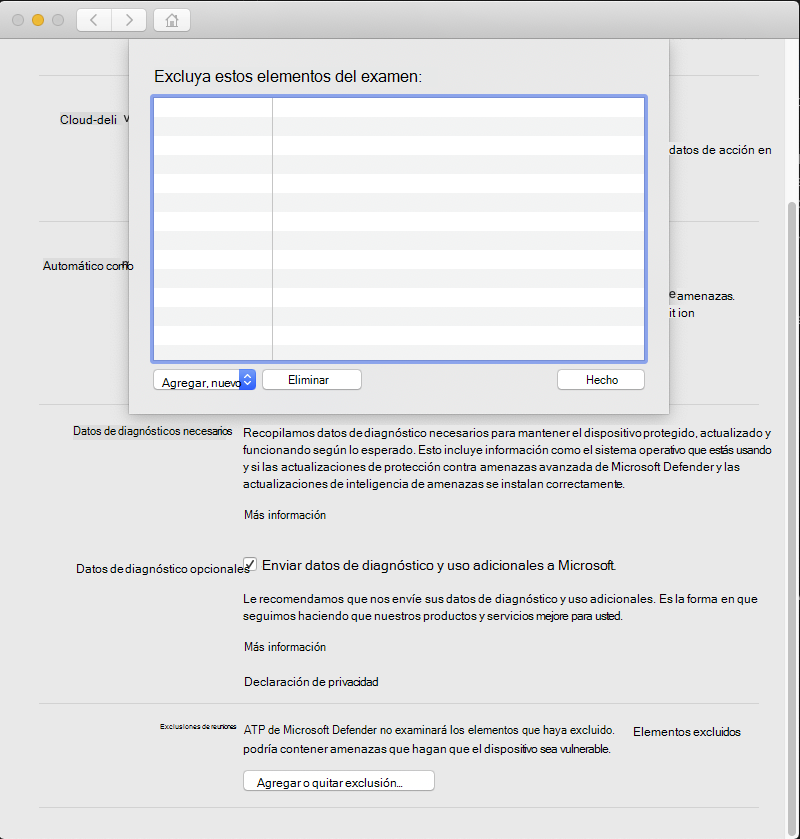

# <a name="configure-and-validate-exclusions-for-microsoft-defender-for-endpoint-on-macos"></a>Configurar y validar exclusiones para Microsoft Defender para endpoint en macOS

[!INCLUDE [Microsoft 365 Defender rebranding](../../includes/microsoft-defender.md)]


**Se aplica a:**
- [Microsoft Defender para punto de conexión](https://go.microsoft.com/fwlink/p/?linkid=2154037)
- [Microsoft 365 Defender](https://go.microsoft.com/fwlink/?linkid=2118804)

> ¿Desea experimentar Defender for Endpoint? [Regístrate para obtener una versión de prueba gratuita.](https://www.microsoft.com/microsoft-365/windows/microsoft-defender-atp?ocid=docs-wdatp-investigateip-abovefoldlink)

En este artículo se proporciona información sobre cómo definir exclusiones que se aplican a los exámenes a petición y la protección y supervisión en tiempo real.

>[!IMPORTANT]
>Las exclusiones descritas en este artículo no se aplican a otras funcionalidades de Defender para Endpoint en Mac, incluida la detección y respuesta de puntos de conexión (EDR). Los archivos que se excluyen mediante los métodos descritos en este artículo aún pueden desencadenar alertas de EDR y otras detecciones.

Puedes excluir determinados archivos, carpetas, procesos y archivos abiertos por proceso de los exámenes de Defender para Endpoint en Mac.

Las exclusiones pueden ser útiles para evitar detecciones incorrectas en archivos o software que son únicos o personalizados para su organización. También pueden ser útiles para mitigar los problemas de rendimiento causados por Defender para Endpoint en Mac.

>[!WARNING]
>La definición de exclusiones reduce la protección ofrecida por Defender para Endpoint en Mac. Siempre debe evaluar los riesgos asociados con la implementación de exclusiones y solo debe excluir los archivos que confía en que no son malintencionados.

## <a name="supported-exclusion-types"></a>Tipos de exclusión admitidos

En la tabla siguiente se muestran los tipos de exclusión admitidos por Defender para Endpoint en Mac.

Exclusión | Definición | Ejemplos
---|---|---
Extensión de archivo | Todos los archivos con la extensión, en cualquier lugar del equipo | `.test`
Archivo | Un archivo específico identificado por la ruta de acceso completa | `/var/log/test.log`<br/>`/var/log/*.log`<br/>`/var/log/install.?.log`
Folder | Todos los archivos de la carpeta especificada (recursivamente) | `/var/log/`<br/>`/var/*/`
Proceso | Un proceso específico (especificado por la ruta de acceso completa o el nombre de archivo) y todos los archivos abiertos por él | `/bin/cat`<br/>`cat`<br/>`c?t`

Las exclusiones de archivos, carpetas y procesos admiten los siguientes caracteres comodín:

Carácter comodín | Descripción | Ejemplo | Coincidencias | No coincide
---|---|---|---|---
\* |    Coincide con cualquier número de caracteres, incluido ninguno (tenga en cuenta que cuando se usa este comodín dentro de una ruta de acceso, solo sustituirá una carpeta) | `/var/*/*.log` | `/var/log/system.log` | `/var/log/nested/system.log`
? | Coincide con cualquier carácter | `file?.log` | `file1.log`<br/>`file2.log` | `file123.log`

>[!NOTE]
>El producto intenta resolver vínculos de firma al evaluar exclusiones. La resolución de firmlink no funciona cuando la exclusión contiene caracteres comodín o el archivo de destino (en el `Data` volumen) no existe.

## <a name="how-to-configure-the-list-of-exclusions"></a>Cómo configurar la lista de exclusiones

### <a name="from-the-management-console"></a>Desde la consola de administración

Para obtener más información sobre cómo configurar exclusiones de JAMF, Intune u otra consola de administración, consulta Establecer preferencias para [Defender para Endpoint en Mac](mac-preferences.md).

### <a name="from-the-user-interface"></a>Desde la interfaz de usuario

Abra la aplicación Defender para endpoint y vaya a **Administrar** la configuración Agregar o  >  **quitar exclusión...**, como se muestra en la siguiente captura de pantalla:



Seleccione el tipo de exclusión que desea agregar y siga las indicaciones.

## <a name="validate-exclusions-lists-with-the-eicar-test-file"></a>Validar listas de exclusiones con el archivo de prueba EICAR

Puede validar que las listas de exclusión funcionan mediante `curl` la descarga de un archivo de prueba.

En el siguiente fragmento de código Bash, reemplace `test.txt` por un archivo que cumpla las reglas de exclusión. Por ejemplo, si ha excluido la `.testing` extensión, reemplace `test.txt` por `test.testing` . Si está probando una ruta de acceso, asegúrese de ejecutar el comando dentro de esa ruta.

```bash
curl -o test.txt https://www.eicar.org/download/eicar.com.txt
```

Si Defender para Endpoint en Mac informa de malware, la regla no funciona. Si no hay ningún informe de malware y existe el archivo descargado, la exclusión funciona. Puede abrir el archivo para confirmar que el contenido es el mismo que el descrito en el sitio web del archivo [de prueba EICAR](http://2016.eicar.org/86-0-Intended-use.html).

Si no tiene acceso a Internet, puede crear su propio archivo de prueba EICAR. Escriba la cadena EICAR en un nuevo archivo de texto con el siguiente comando Bash:

```bash
echo 'X5O!P%@AP[4\PZX54(P^)7CC)7}$EICAR-STANDARD-ANTIVIRUS-TEST-FILE!$H+H*' > test.txt
```

También puede copiar la cadena en un archivo de texto en blanco e intentar guardarla con el nombre de archivo o en la carpeta que está intentando excluir.

## <a name="allow-threats"></a>Permitir amenazas

Además de excluir cierto contenido para que no se digitalizara, también puede configurar el producto para que no detecte algunas clases de amenazas (identificadas por el nombre de la amenaza). Debes tener cuidado al usar esta funcionalidad, ya que puede dejar el dispositivo desprotegido.

Para agregar un nombre de amenaza a la lista permitida, ejecute el siguiente comando:

```bash
mdatp threat allowed add --name [threat-name]
```

El nombre de la amenaza asociado a una detección en el dispositivo se puede obtener con el siguiente comando:

```bash
mdatp threat list
```

Por ejemplo, para agregar (el nombre de amenaza asociado con la detección `EICAR-Test-File (not a virus)` eicar) a la lista permitida, ejecute el siguiente comando:

```bash
mdatp threat allowed add --name "EICAR-Test-File (not a virus)"
```
