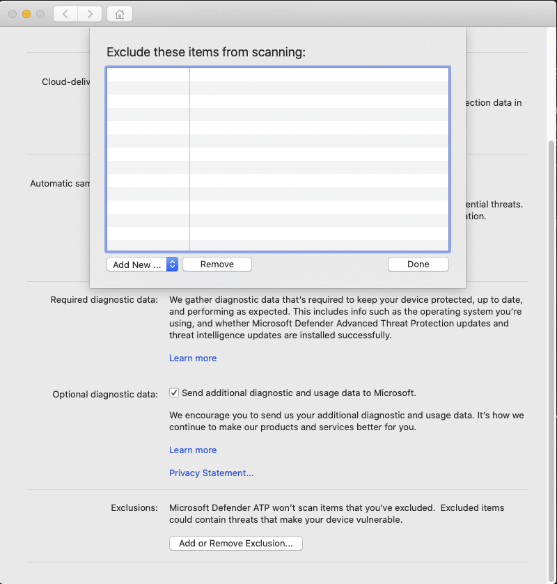

# <a name="configure-and-validate-exclusions-for-microsoft-defender-for-endpoint-for-mac"></a><span data-ttu-id="af9e0-105">Configurar y validar exclusiones para Microsoft Defender para Endpoint para Mac</span><span class="sxs-lookup"><span data-stu-id="af9e0-105">Configure and validate exclusions for Microsoft Defender for Endpoint for Mac</span></span>

[!INCLUDE [Microsoft 365 Defender rebranding](../../includes/microsoft-defender.md)]


<span data-ttu-id="af9e0-106">**Se aplica a:**</span><span class="sxs-lookup"><span data-stu-id="af9e0-106">**Applies to:**</span></span>
- [<span data-ttu-id="af9e0-107">Microsoft Defender para punto de conexión</span><span class="sxs-lookup"><span data-stu-id="af9e0-107">Microsoft Defender for Endpoint</span></span>](https://go.microsoft.com/fwlink/p/?linkid=2154037)
- [<span data-ttu-id="af9e0-108">Microsoft 365 Defender</span><span class="sxs-lookup"><span data-stu-id="af9e0-108">Microsoft 365 Defender</span></span>](https://go.microsoft.com/fwlink/?linkid=2118804)

> <span data-ttu-id="af9e0-109">¿Desea experimentar Defender for Endpoint?</span><span class="sxs-lookup"><span data-stu-id="af9e0-109">Want to experience Defender for Endpoint?</span></span> [<span data-ttu-id="af9e0-110">Regístrate para obtener una versión de prueba gratuita.</span><span class="sxs-lookup"><span data-stu-id="af9e0-110">Sign up for a free trial.</span></span>](https://www.microsoft.com/microsoft-365/windows/microsoft-defender-atp?ocid=docs-wdatp-investigateip-abovefoldlink)

<span data-ttu-id="af9e0-111">En este artículo se proporciona información sobre cómo definir exclusiones que se aplican a los exámenes a petición y la protección y supervisión en tiempo real.</span><span class="sxs-lookup"><span data-stu-id="af9e0-111">This article provides information on how to define exclusions that apply to on-demand scans, and real-time protection and monitoring.</span></span>

>[!IMPORTANT]
><span data-ttu-id="af9e0-112">Las exclusiones descritas en este artículo no se aplican a otras funcionalidades de Defender para Endpoint para Mac, incluida la detección y respuesta de puntos de conexión (EDR).</span><span class="sxs-lookup"><span data-stu-id="af9e0-112">The exclusions described in this article don't apply to other Defender for Endpoint for Mac capabilities, including endpoint detection and response (EDR).</span></span> <span data-ttu-id="af9e0-113">Los archivos que se excluyen mediante los métodos descritos en este artículo aún pueden desencadenar alertas de EDR y otras detecciones.</span><span class="sxs-lookup"><span data-stu-id="af9e0-113">Files that you exclude using the methods described in this article can still trigger EDR alerts and other detections.</span></span>

<span data-ttu-id="af9e0-114">Puedes excluir determinados archivos, carpetas, procesos y archivos abiertos por proceso de los exámenes de Defender para Endpoint para Mac.</span><span class="sxs-lookup"><span data-stu-id="af9e0-114">You can exclude certain files, folders, processes, and process-opened files from Defender for Endpoint for Mac scans.</span></span>

<span data-ttu-id="af9e0-115">Las exclusiones pueden ser útiles para evitar detecciones incorrectas en archivos o software que son únicos o personalizados para su organización.</span><span class="sxs-lookup"><span data-stu-id="af9e0-115">Exclusions can be useful to avoid incorrect detections on files or software that are unique or customized to your organization.</span></span> <span data-ttu-id="af9e0-116">También pueden ser útiles para mitigar los problemas de rendimiento causados por Defender para Endpoint para Mac.</span><span class="sxs-lookup"><span data-stu-id="af9e0-116">They can also be useful for mitigating performance issues caused by Defender for Endpoint for Mac.</span></span>

>[!WARNING]
><span data-ttu-id="af9e0-117">La definición de exclusiones reduce la protección ofrecida por Defender para Endpoint para Mac.</span><span class="sxs-lookup"><span data-stu-id="af9e0-117">Defining exclusions lowers the protection offered by Defender for Endpoint for Mac.</span></span> <span data-ttu-id="af9e0-118">Siempre debe evaluar los riesgos asociados con la implementación de exclusiones y solo debe excluir los archivos que confía en que no son malintencionados.</span><span class="sxs-lookup"><span data-stu-id="af9e0-118">You should always evaluate the risks that are associated with implementing exclusions, and you should only exclude files that you are confident are not malicious.</span></span>

## <a name="supported-exclusion-types"></a><span data-ttu-id="af9e0-119">Tipos de exclusión admitidos</span><span class="sxs-lookup"><span data-stu-id="af9e0-119">Supported exclusion types</span></span>

<span data-ttu-id="af9e0-120">En la tabla siguiente se muestran los tipos de exclusión admitidos por Defender para Endpoint para Mac.</span><span class="sxs-lookup"><span data-stu-id="af9e0-120">The follow table shows the exclusion types supported by Defender for Endpoint for Mac.</span></span>

<span data-ttu-id="af9e0-121">Exclusión</span><span class="sxs-lookup"><span data-stu-id="af9e0-121">Exclusion</span></span> | <span data-ttu-id="af9e0-122">Definición</span><span class="sxs-lookup"><span data-stu-id="af9e0-122">Definition</span></span> | <span data-ttu-id="af9e0-123">Ejemplos</span><span class="sxs-lookup"><span data-stu-id="af9e0-123">Examples</span></span>
---|---|---
<span data-ttu-id="af9e0-124">Extensión de archivo</span><span class="sxs-lookup"><span data-stu-id="af9e0-124">File extension</span></span> | <span data-ttu-id="af9e0-125">Todos los archivos con la extensión, en cualquier lugar del equipo</span><span class="sxs-lookup"><span data-stu-id="af9e0-125">All files with the extension, anywhere on the machine</span></span> | `.test`
<span data-ttu-id="af9e0-126">Archivo</span><span class="sxs-lookup"><span data-stu-id="af9e0-126">File</span></span> | <span data-ttu-id="af9e0-127">Un archivo específico identificado por la ruta de acceso completa</span><span class="sxs-lookup"><span data-stu-id="af9e0-127">A specific file identified by the full path</span></span> | `/var/log/test.log`<br/>`/var/log/*.log`<br/>`/var/log/install.?.log`
<span data-ttu-id="af9e0-128">Folder</span><span class="sxs-lookup"><span data-stu-id="af9e0-128">Folder</span></span> | <span data-ttu-id="af9e0-129">Todos los archivos de la carpeta especificada (recursivamente)</span><span class="sxs-lookup"><span data-stu-id="af9e0-129">All files under the specified folder (recursively)</span></span> | `/var/log/`<br/>`/var/*/`
<span data-ttu-id="af9e0-130">Proceso</span><span class="sxs-lookup"><span data-stu-id="af9e0-130">Process</span></span> | <span data-ttu-id="af9e0-131">Un proceso específico (especificado por la ruta de acceso completa o el nombre de archivo) y todos los archivos abiertos por él</span><span class="sxs-lookup"><span data-stu-id="af9e0-131">A specific process (specified either by the full path or file name) and all files opened by it</span></span> | `/bin/cat`<br/>`cat`<br/>`c?t`

<span data-ttu-id="af9e0-132">Las exclusiones de archivos, carpetas y procesos admiten los siguientes caracteres comodín:</span><span class="sxs-lookup"><span data-stu-id="af9e0-132">File, folder, and process exclusions support the following wildcards:</span></span>

<span data-ttu-id="af9e0-133">Carácter comodín</span><span class="sxs-lookup"><span data-stu-id="af9e0-133">Wildcard</span></span> | <span data-ttu-id="af9e0-134">Descripción</span><span class="sxs-lookup"><span data-stu-id="af9e0-134">Description</span></span> | <span data-ttu-id="af9e0-135">Ejemplo</span><span class="sxs-lookup"><span data-stu-id="af9e0-135">Example</span></span> | <span data-ttu-id="af9e0-136">Coincidencias</span><span class="sxs-lookup"><span data-stu-id="af9e0-136">Matches</span></span> | <span data-ttu-id="af9e0-137">No coincide</span><span class="sxs-lookup"><span data-stu-id="af9e0-137">Does not match</span></span>
---|---|---|---|---
\* |    <span data-ttu-id="af9e0-138">Coincide con cualquier número de caracteres, incluido ninguno (tenga en cuenta que cuando se usa este comodín dentro de una ruta de acceso, solo sustituirá una carpeta)</span><span class="sxs-lookup"><span data-stu-id="af9e0-138">Matches any number of any characters including none (note that when this wildcard is used inside a path it will substitute only one folder)</span></span> | `/var/*/*.log` | `/var/log/system.log` | `/var/log/nested/system.log`
<span data-ttu-id="af9e0-139">?</span><span class="sxs-lookup"><span data-stu-id="af9e0-139">?</span></span> | <span data-ttu-id="af9e0-140">Coincide con cualquier carácter</span><span class="sxs-lookup"><span data-stu-id="af9e0-140">Matches any single character</span></span> | `file?.log` | `file1.log`<br/>`file2.log` | `file123.log`

>[!NOTE]
><span data-ttu-id="af9e0-141">El producto intenta resolver vínculos de firma al evaluar exclusiones.</span><span class="sxs-lookup"><span data-stu-id="af9e0-141">The product attempts to resolve firmlinks when evaluating exclusions.</span></span> <span data-ttu-id="af9e0-142">La resolución de firmlink no funciona cuando la exclusión contiene caracteres comodín o el archivo de destino (en el `Data` volumen) no existe.</span><span class="sxs-lookup"><span data-stu-id="af9e0-142">Firmlink resolution does not work when the exclusion contains wildcards or the target file (on the `Data` volume) does not exist.</span></span>

## <a name="how-to-configure-the-list-of-exclusions"></a><span data-ttu-id="af9e0-143">Cómo configurar la lista de exclusiones</span><span class="sxs-lookup"><span data-stu-id="af9e0-143">How to configure the list of exclusions</span></span>

### <a name="from-the-management-console"></a><span data-ttu-id="af9e0-144">Desde la consola de administración</span><span class="sxs-lookup"><span data-stu-id="af9e0-144">From the management console</span></span>

<span data-ttu-id="af9e0-145">Para obtener más información sobre cómo configurar exclusiones de JAMF, Intune u otra consola de administración, consulta Establecer preferencias para [Defender para Endpoint para Mac](mac-preferences.md).</span><span class="sxs-lookup"><span data-stu-id="af9e0-145">For more information on how to configure exclusions from JAMF, Intune, or another management console, see [Set preferences for Defender for Endpoint for Mac](mac-preferences.md).</span></span>

### <a name="from-the-user-interface"></a><span data-ttu-id="af9e0-146">Desde la interfaz de usuario</span><span class="sxs-lookup"><span data-stu-id="af9e0-146">From the user interface</span></span>

<span data-ttu-id="af9e0-147">Abra la aplicación Defender para endpoint y vaya a **Administrar** la configuración Agregar o  >  **quitar exclusión...**, como se muestra en la siguiente captura de pantalla:</span><span class="sxs-lookup"><span data-stu-id="af9e0-147">Open the Defender for Endpoint application and navigate to **Manage settings** > **Add or Remove Exclusion...**, as shown in the following screenshot:</span></span>



<span data-ttu-id="af9e0-149">Seleccione el tipo de exclusión que desea agregar y siga las indicaciones.</span><span class="sxs-lookup"><span data-stu-id="af9e0-149">Select the type of exclusion that you wish to add and follow the prompts.</span></span>

## <a name="validate-exclusions-lists-with-the-eicar-test-file"></a><span data-ttu-id="af9e0-150">Validar listas de exclusiones con el archivo de prueba EICAR</span><span class="sxs-lookup"><span data-stu-id="af9e0-150">Validate exclusions lists with the EICAR test file</span></span>

<span data-ttu-id="af9e0-151">Puede validar que las listas de exclusión funcionan mediante `curl` la descarga de un archivo de prueba.</span><span class="sxs-lookup"><span data-stu-id="af9e0-151">You can validate that your exclusion lists are working by using `curl` to download a test file.</span></span>

<span data-ttu-id="af9e0-152">En el siguiente fragmento de código Bash, reemplace `test.txt` por un archivo que cumpla las reglas de exclusión.</span><span class="sxs-lookup"><span data-stu-id="af9e0-152">In the following Bash snippet, replace `test.txt` with a file that conforms to your exclusion rules.</span></span> <span data-ttu-id="af9e0-153">Por ejemplo, si ha excluido la `.testing` extensión, reemplace `test.txt` por `test.testing` .</span><span class="sxs-lookup"><span data-stu-id="af9e0-153">For example, if you have excluded the `.testing` extension, replace `test.txt` with `test.testing`.</span></span> <span data-ttu-id="af9e0-154">Si está probando una ruta de acceso, asegúrese de ejecutar el comando dentro de esa ruta.</span><span class="sxs-lookup"><span data-stu-id="af9e0-154">If you are testing a path, ensure that you run the command within that path.</span></span>

```bash
curl -o test.txt https://www.eicar.org/download/eicar.com.txt
```

<span data-ttu-id="af9e0-155">Si Defender para Endpoint para Mac informa de malware, la regla no funciona.</span><span class="sxs-lookup"><span data-stu-id="af9e0-155">If Defender for Endpoint for Mac reports malware, then the rule is not working.</span></span> <span data-ttu-id="af9e0-156">Si no hay ningún informe de malware y existe el archivo descargado, la exclusión funciona.</span><span class="sxs-lookup"><span data-stu-id="af9e0-156">If there is no report of malware, and the downloaded file exists, then the exclusion is working.</span></span> <span data-ttu-id="af9e0-157">Puede abrir el archivo para confirmar que el contenido es el mismo que el descrito en el sitio web del archivo [de prueba EICAR](http://2016.eicar.org/86-0-Intended-use.html).</span><span class="sxs-lookup"><span data-stu-id="af9e0-157">You can open the file to confirm that the contents are the same as what is described on the [EICAR test file website](http://2016.eicar.org/86-0-Intended-use.html).</span></span>

<span data-ttu-id="af9e0-158">Si no tiene acceso a Internet, puede crear su propio archivo de prueba EICAR.</span><span class="sxs-lookup"><span data-stu-id="af9e0-158">If you do not have Internet access, you can create your own EICAR test file.</span></span> <span data-ttu-id="af9e0-159">Escriba la cadena EICAR en un nuevo archivo de texto con el siguiente comando Bash:</span><span class="sxs-lookup"><span data-stu-id="af9e0-159">Write the EICAR string to a new text file with the following Bash command:</span></span>

```bash
echo 'X5O!P%@AP[4\PZX54(P^)7CC)7}$EICAR-STANDARD-ANTIVIRUS-TEST-FILE!$H+H*' > test.txt
```

<span data-ttu-id="af9e0-160">También puede copiar la cadena en un archivo de texto en blanco e intentar guardarla con el nombre de archivo o en la carpeta que está intentando excluir.</span><span class="sxs-lookup"><span data-stu-id="af9e0-160">You can also copy the string into a blank text file and attempt to save it with the file name or in the folder you are attempting to exclude.</span></span>

## <a name="allow-threats"></a><span data-ttu-id="af9e0-161">Permitir amenazas</span><span class="sxs-lookup"><span data-stu-id="af9e0-161">Allow threats</span></span>

<span data-ttu-id="af9e0-162">Además de excluir cierto contenido para que no se digitalizara, también puede configurar el producto para que no detecte algunas clases de amenazas (identificadas por el nombre de la amenaza).</span><span class="sxs-lookup"><span data-stu-id="af9e0-162">In addition to excluding certain content from being scanned, you can also configure the product not to detect some classes of threats (identified by the threat name).</span></span> <span data-ttu-id="af9e0-163">Debes tener cuidado al usar esta funcionalidad, ya que puede dejar el dispositivo desprotegido.</span><span class="sxs-lookup"><span data-stu-id="af9e0-163">You should exercise caution when using this functionality, as it can leave your device unprotected.</span></span>

<span data-ttu-id="af9e0-164">Para agregar un nombre de amenaza a la lista permitida, ejecute el siguiente comando:</span><span class="sxs-lookup"><span data-stu-id="af9e0-164">To add a threat name to the allowed list, execute the following command:</span></span>

```bash
mdatp threat allowed add --name [threat-name]
```

<span data-ttu-id="af9e0-165">El nombre de la amenaza asociado a una detección en el dispositivo se puede obtener con el siguiente comando:</span><span class="sxs-lookup"><span data-stu-id="af9e0-165">The threat name associated with a detection on your device can be obtained using the following command:</span></span>

```bash
mdatp threat list
```

<span data-ttu-id="af9e0-166">Por ejemplo, para agregar (el nombre de amenaza asociado con la detección `EICAR-Test-File (not a virus)` eicar) a la lista permitida, ejecute el siguiente comando:</span><span class="sxs-lookup"><span data-stu-id="af9e0-166">For example, to add `EICAR-Test-File (not a virus)` (the threat name associated with the EICAR detection) to the allowed list, execute the following command:</span></span>

```bash
mdatp threat allowed add --name "EICAR-Test-File (not a virus)"
```
