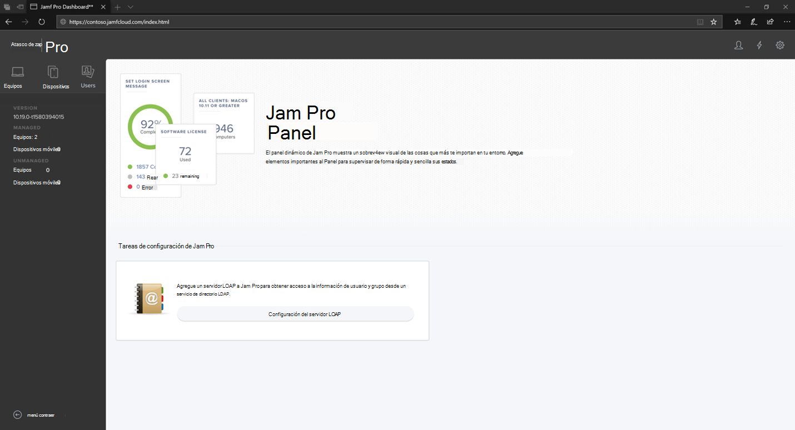
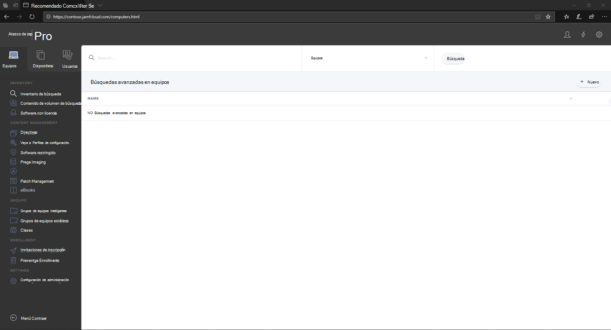

# Inicie sesión en Jamf Pro

[!INCLUDE [Microsoft 365 Defender rebranding](../../includes/microsoft-defender.md)]

**Se aplica a:**
- [Microsoft Defender para punto de conexión](https://go.microsoft.com/fwlink/p/?linkid=2146631)
- [Microsoft 365 Defender](https://go.microsoft.com/fwlink/?linkid=2118804)

> ¿Desea experimentar Defender for Endpoint? [Regístrate para obtener una versión de prueba gratuita.](https://www.microsoft.com/microsoft-365/windows/microsoft-defender-atp?ocid=docs-wdatp-investigateip-abovefoldlink)

1. Escriba sus credenciales.

    

2. Seleccione **Equipos**.

    

3. Verá la configuración que está disponible.

     

## Paso siguiente
[Configurar los grupos de dispositivos en Jamf Pro](mac-jamfpro-device-groups.md)

