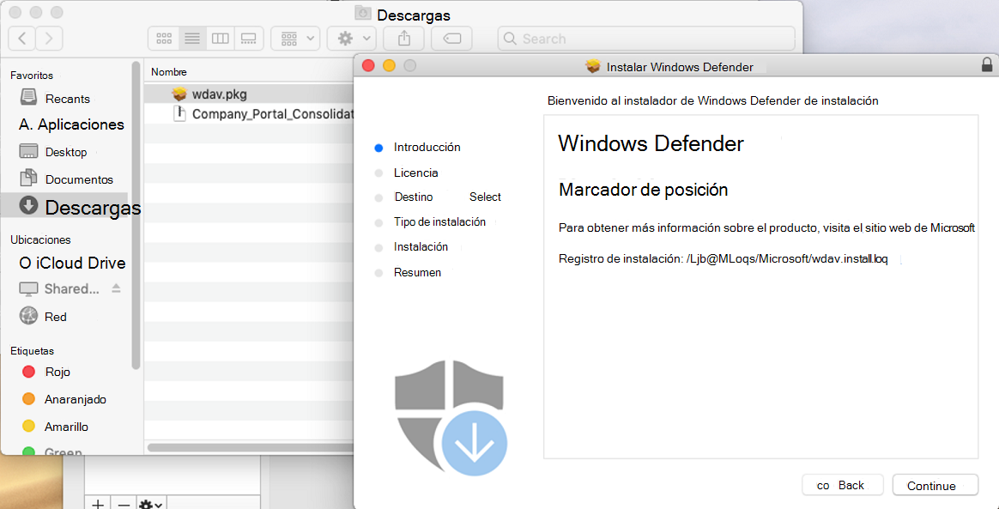
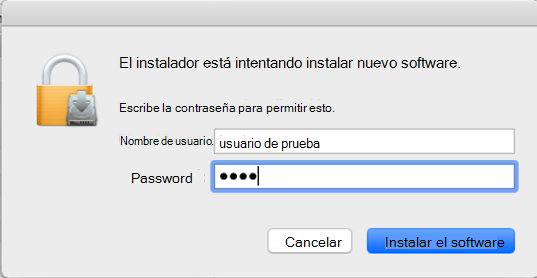
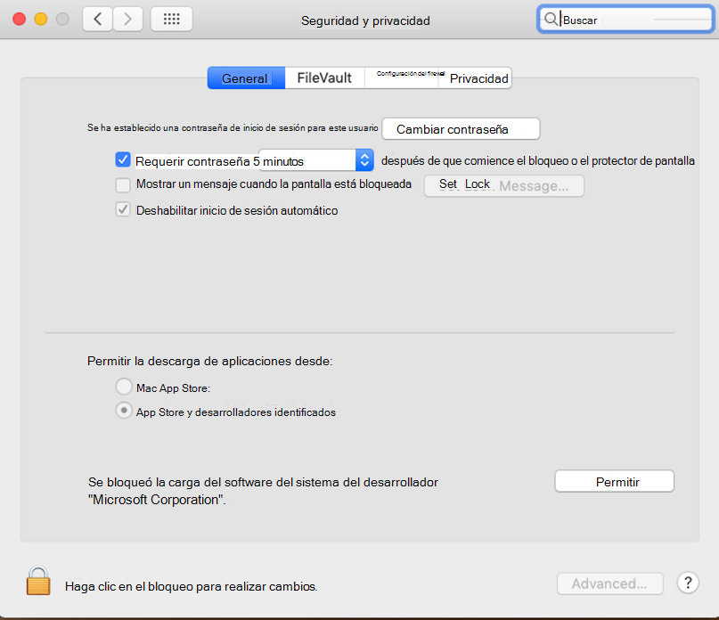

# <a name="manual-deployment-for-microsoft-defender-for-endpoint-for-macos"></a>Implementación manual de Microsoft Defender para endpoint para macOS

[!INCLUDE [Microsoft 365 Defender rebranding](../../includes/microsoft-defender.md)]

**Se aplica a:**
- [Microsoft Defender para punto de conexión](https://go.microsoft.com/fwlink/p/?linkid=2154037)
- [Microsoft 365 Defender](https://go.microsoft.com/fwlink/?linkid=2118804)

> ¿Desea experimentar Defender for Endpoint? [Regístrate para obtener una versión de prueba gratuita.](https://www.microsoft.com/microsoft-365/windows/microsoft-defender-atp?ocid=docs-wdatp-investigateip-abovefoldlink)

En este tema se describe cómo implementar Microsoft Defender para Endpoint para macOS manualmente. Una implementación correcta requiere la finalización de todos los pasos siguientes:
- [Descargar paquetes de instalación e incorporación](#download-installation-and-onboarding-packages)
- [Instalación de aplicaciones (macOS 10.15 y versiones anteriores)](#application-installation-macos-1015-and-older-versions)
- [Instalación de aplicaciones (macOS 11 y versiones más recientes)](#application-installation-macos-11-and-newer-versions)
- [Configuración de cliente](#client-configuration)

## <a name="prerequisites-and-system-requirements"></a>Requisitos previos y requisitos del sistema

Antes de empezar, consulte la página principal de Microsoft Defender para endpoint [para macOS](microsoft-defender-endpoint-mac.md) para obtener una descripción de los requisitos previos y los requisitos del sistema para la versión de software actual.

## <a name="download-installation-and-onboarding-packages"></a>Descargar paquetes de instalación e incorporación

Descargue los paquetes de instalación e incorporación del Centro de seguridad de Microsoft Defender:

1. En el Centro de seguridad de Microsoft Defender, vaya **a Configuración > Administración de dispositivos > incorporación**.
2. En la sección 1 de la página, establezca el sistema operativo en **macOS** y el método Deployment en **Script local**.
3. En la sección 2 de la página, seleccione **Descargar paquete de instalación**. Guárdelo como wdav.pkg en un directorio local.
4. En la sección 2 de la página, seleccione **Descargar paquete de incorporación**. Guárdelo WindowsDefenderATPOnboardingPackage.zip en el mismo directorio.

    

5. Desde un símbolo del sistema, compruebe que tiene los dos archivos.
    
## <a name="application-installation-macos-1015-and-older-versions"></a>Instalación de aplicaciones (macOS 10.15 y versiones anteriores)

Para completar este proceso, debes tener privilegios de administrador en el dispositivo.

1. Navegue hasta el wdav.pkg descargado en Finder y ábralo.

    

2. Seleccione **Continuar,** acepte los términos de licencia y escriba la contraseña cuando se le pida.

    

   > [!IMPORTANT]
   > Se le pedirá que permita que se instale un controlador de Microsoft (ya sea "System Extension Blocked" o "Installation is on hold" o ambos. Se debe permitir la instalación del controlador.

   

3. Seleccione **Abrir preferencias de seguridad** o Abrir preferencias del sistema > Seguridad & **privacidad**. Seleccione **Permitir**:

    

   La instalación continúa.

   > [!CAUTION]
   > Si no selecciona **Permitir,** la instalación continuará después de 5 minutos. Microsoft Defender para endpoint se cargará, pero algunas características, como la protección en tiempo real, se deshabilitarán. Consulte [Solucionar problemas de extensión del kernel](mac-support-kext.md) para obtener información sobre cómo resolver esto.

> [!NOTE]
> macOS puede solicitar reiniciar el dispositivo tras la primera instalación de Microsoft Defender para endpoint. La protección en tiempo real no estará disponible hasta que se reinicie el dispositivo.

## <a name="application-installation-macos-11-and-newer-versions"></a>Instalación de aplicaciones (macOS 11 y versiones más recientes)

Para completar este proceso, debes tener privilegios de administrador en el dispositivo.

1. Navegue hasta el wdav.pkg descargado en Finder y ábralo.

    

2. Seleccione **Continuar,** acepte los términos de licencia y escriba la contraseña cuando se le pida.

3. Al final del proceso de instalación, se te promocionará para aprobar las extensiones del sistema usadas por el producto. Seleccione **Abrir preferencias de seguridad**.

    

4. En la **ventana Seguridad & privacidad,** seleccione **Permitir**.

    

5. Repita los pasos 3 & 4 para todas las extensiones del sistema distribuidas con Microsoft Defender para Endpoint para Mac.

6. Como parte de las capacidades de detección y respuesta de puntos de conexión, Microsoft Defender para Endpoint para Mac inspecciona el tráfico de sockets e informa de esta información al portal del Centro de seguridad de Microsoft Defender. Cuando se le pida que conceda a Microsoft Defender permisos de extremo para filtrar el tráfico de red, seleccione **Permitir**.

    

7. Abra **System Preferences** Security & Privacidad y vaya a la pestaña Privacidad. Conceda permiso de acceso en disco completo a Atp de Microsoft Defender y Extensión de seguridad de punto de conexión de ATP de Microsoft  >   **Defender.**   

    

## <a name="client-configuration"></a>Configuración de clientes

1. Copia wdav.pkg y MicrosoftDefenderATPOnboardingMacOs.py en el dispositivo donde implementas Microsoft Defender para Endpoint para macOS.

    El dispositivo cliente no está asociado con org_id. Tenga en cuenta *que el org_id* está en blanco.

    ```bash
    mdatp health --field org_id
    ```

2. Ejecute el script de Python para instalar el archivo de configuración:

    ```bash
    /usr/bin/python MicrosoftDefenderATPOnboardingMacOs.py
    ```

3. Compruebe que el dispositivo esté asociado a su organización e informe de un identificador de organización válido:

    ```bash
    mdatp health --field org_id
    ```

    Después de la instalación, verás el icono de Microsoft Defender en la barra de estado de macOS en la esquina superior derecha.
    
    > [!div class="mx-imgBorder"]
    > 


## <a name="how-to-allow-full-disk-access"></a>Cómo permitir el acceso en disco completo

> [!CAUTION]
> macOS 10.15 (Catalina) contiene nuevas mejoras de seguridad y privacidad. A partir de esta versión, de forma predeterminada, las aplicaciones no pueden acceder a determinadas ubicaciones del disco (como Documentos, Descargas, Escritorio, etc.) sin consentimiento explícito. En ausencia de este consentimiento, Microsoft Defender para Endpoint no puede proteger completamente el dispositivo.

1. Para conceder el consentimiento, abra **Preferencias** del  >  **sistema Seguridad & Privacidad**  >  **Acceso** completo al  >  **disco**. Haga clic en el icono de bloqueo para realizar cambios (parte inferior del cuadro de diálogo). Seleccione Microsoft Defender para Endpoint.

2. Ejecute una prueba de detección de ANTIVIRUS para comprobar que el dispositivo está correctamente incorporado e informando al servicio. Realice los pasos siguientes en el dispositivo recién incorporado:

    1. Asegúrese de que la protección en tiempo real está habilitada (lo indica un resultado de 1 al ejecutar el siguiente comando):

        ```bash
        mdatp health --field real_time_protection_enabled
        ```

    1. Abra una ventana terminal. Copie y ejecute el siguiente comando:

        ```bash
        curl -o ~/Downloads/eicar.com.txt https://www.eicar.org/download/eicar.com.txt
        ```

    1. Defender for Endpoint for Mac debería haber puesto el archivo en cuarentena. Use el siguiente comando para enumerar todas las amenazas detectadas:

        ```bash
        mdatp threat list
        ```

3. Ejecute una prueba de detección de EDR para comprobar que el dispositivo está correctamente incorporado e informando al servicio. Realice los pasos siguientes en el dispositivo recién incorporado:

   1. En el explorador, como Microsoft Edge para Mac o Safari.

   1. Descargue MDATP MacOS DIY.zip https://aka.ms/mdatpmacosdiy y extraiga.

      Es posible que se le pida lo siguiente:

      > ¿Desea permitir descargas en "mdatpclientanalyzer.blob.core.windows.net"?<br/>
      > Puede cambiar los sitios web que pueden descargar archivos en Preferencias de sitios web.

4. Haga clic **en Permitir**.

5. Abra **Descargas**.

6. Debería ver **MDATP MacOS DIY**.

   > [!TIP]
   > Si hace doble clic, recibirá el siguiente mensaje:
   > 
   > > **"MDATP MacOS DIY" no se puede abrir porque el desarrollador no puede ser verificador.**<br/>
   > > macOS no puede comprobar que esta aplicación está libre de malware.<br/>
   > > **\[ Pasar a \] Cancelar papelera** **\[ \]** 
  
7. Haga clic en **Cancelar**.

8. Haga clic con el botón **secundario en MDATP MacOS DIY** y, a continuación, haga clic en **Abrir**. 

    El sistema debe mostrar el siguiente mensaje:

    > **macOS no puede comprobar el desarrollador de **MDATP MacOS DIY**. ¿Está seguro de que desea abrirlo?**<br/>
    > Al abrir esta aplicación, invalidará la seguridad del sistema, que puede exponer su equipo y su información personal a malware que pueda dañar su Mac o poner en peligro su privacidad.

10. Haga clic en **Open** (Abrir).

    El sistema debe mostrar el siguiente mensaje:

    > ATP de Microsoft Defender: archivo de prueba de BRICOLAJE de macOS EDR<br/>
    > La alerta correspondiente estará disponible en el portal MDATP.

11. Haga clic en **Open** (Abrir).

    En unos minutos se debe generar una alerta denominada "alerta de prueba de macOS EDR".

12. Vaya al Centro de seguridad de Microsoft Defender ( https://SecurityCenter.microsoft.com) .

13. Vaya a la cola de alertas.

    :::image type="content" source="images/b8db76c2-c368-49ad-970f-dcb87534d9be.png" alt-text="Ejemplo de una alerta de prueba de macOS EDR que muestra gravedad, categoría, origen de detección y un menú de acciones contraído.":::
    
    Consulta los detalles de la alerta y la escala de tiempo del dispositivo y realiza los pasos de investigación habituales.

## <a name="logging-installation-issues"></a>Problemas de instalación de registro

Consulte [Problemas de instalación de registro](mac-resources.md#logging-installation-issues) para obtener más información sobre cómo encontrar el registro generado automáticamente que crea el instalador cuando se produce un error.

## <a name="uninstallation"></a>Desinstalación

Consulta [Desinstalar para obtener](mac-resources.md#uninstalling) más información sobre cómo quitar Microsoft Defender para Endpoint para macOS de los dispositivos cliente.
