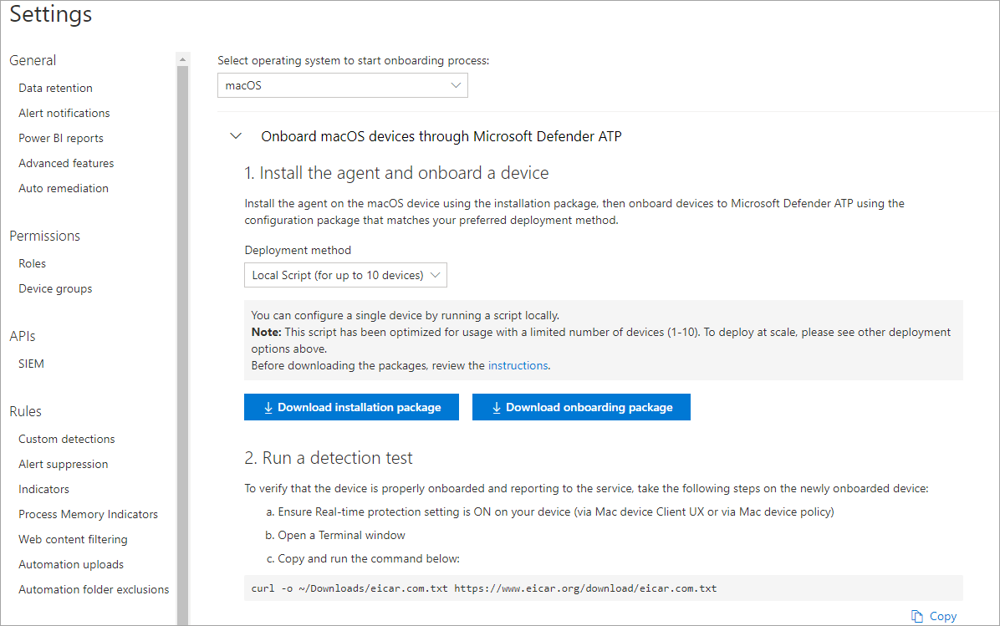
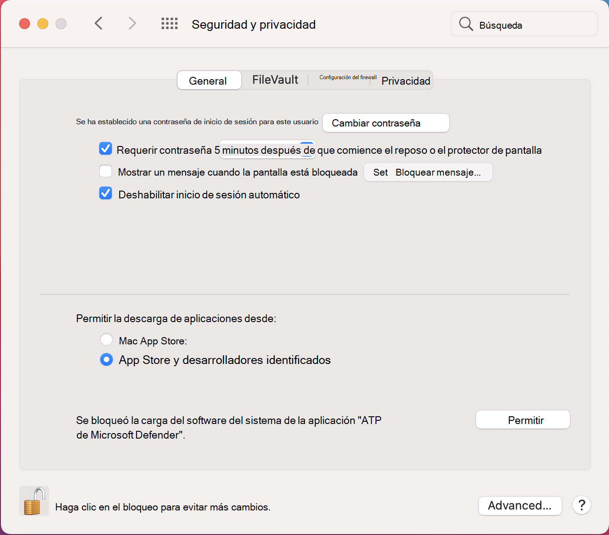
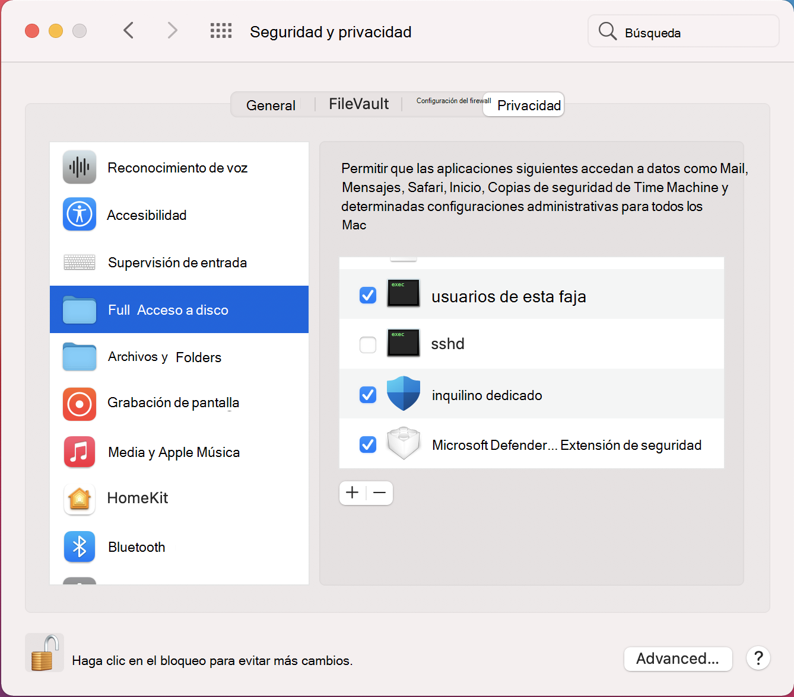

# <a name="manual-deployment-for-microsoft-defender-for-endpoint-for-macos"></a><span data-ttu-id="7d34e-104">Implementación manual de Microsoft Defender para endpoint para macOS</span><span class="sxs-lookup"><span data-stu-id="7d34e-104">Manual deployment for Microsoft Defender for Endpoint for macOS</span></span>

[!INCLUDE [Microsoft 365 Defender rebranding](../../includes/microsoft-defender.md)]

<span data-ttu-id="7d34e-105">**Se aplica a:**</span><span class="sxs-lookup"><span data-stu-id="7d34e-105">**Applies to:**</span></span>
- [<span data-ttu-id="7d34e-106">Microsoft Defender para punto de conexión</span><span class="sxs-lookup"><span data-stu-id="7d34e-106">Microsoft Defender for Endpoint</span></span>](https://go.microsoft.com/fwlink/p/?linkid=2154037)
- [<span data-ttu-id="7d34e-107">Microsoft 365 Defender</span><span class="sxs-lookup"><span data-stu-id="7d34e-107">Microsoft 365 Defender</span></span>](https://go.microsoft.com/fwlink/?linkid=2118804)

> <span data-ttu-id="7d34e-108">¿Desea experimentar Defender for Endpoint?</span><span class="sxs-lookup"><span data-stu-id="7d34e-108">Want to experience Defender for Endpoint?</span></span> [<span data-ttu-id="7d34e-109">Regístrate para obtener una versión de prueba gratuita.</span><span class="sxs-lookup"><span data-stu-id="7d34e-109">Sign up for a free trial.</span></span>](https://www.microsoft.com/microsoft-365/windows/microsoft-defender-atp?ocid=docs-wdatp-investigateip-abovefoldlink)

<span data-ttu-id="7d34e-110">En este tema se describe cómo implementar Microsoft Defender para Endpoint para macOS manualmente.</span><span class="sxs-lookup"><span data-stu-id="7d34e-110">This topic describes how to deploy Microsoft Defender for Endpoint for macOS manually.</span></span> <span data-ttu-id="7d34e-111">Una implementación correcta requiere la finalización de todos los pasos siguientes:</span><span class="sxs-lookup"><span data-stu-id="7d34e-111">A successful deployment requires the completion of all of the following steps:</span></span>
- [<span data-ttu-id="7d34e-112">Descargar paquetes de instalación e incorporación</span><span class="sxs-lookup"><span data-stu-id="7d34e-112">Download installation and onboarding packages</span></span>](#download-installation-and-onboarding-packages)
- [<span data-ttu-id="7d34e-113">Instalación de aplicaciones (macOS 10.15 y versiones anteriores)</span><span class="sxs-lookup"><span data-stu-id="7d34e-113">Application installation (macOS 10.15 and older versions)</span></span>](#application-installation-macos-1015-and-older-versions)
- [<span data-ttu-id="7d34e-114">Instalación de aplicaciones (macOS 11 y versiones más recientes)</span><span class="sxs-lookup"><span data-stu-id="7d34e-114">Application installation (macOS 11 and newer versions)</span></span>](#application-installation-macos-11-and-newer-versions)
- [<span data-ttu-id="7d34e-115">Configuración de cliente</span><span class="sxs-lookup"><span data-stu-id="7d34e-115">Client configuration</span></span>](#client-configuration)

## <a name="prerequisites-and-system-requirements"></a><span data-ttu-id="7d34e-116">Requisitos previos y requisitos del sistema</span><span class="sxs-lookup"><span data-stu-id="7d34e-116">Prerequisites and system requirements</span></span>

<span data-ttu-id="7d34e-117">Antes de empezar, consulte la página principal de Microsoft Defender para endpoint [para macOS](microsoft-defender-endpoint-mac.md) para obtener una descripción de los requisitos previos y los requisitos del sistema para la versión de software actual.</span><span class="sxs-lookup"><span data-stu-id="7d34e-117">Before you get started, see [the main Microsoft Defender for Endpoint for macOS page](microsoft-defender-endpoint-mac.md) for a description of prerequisites and system requirements for the current software version.</span></span>

## <a name="download-installation-and-onboarding-packages"></a><span data-ttu-id="7d34e-118">Descargar paquetes de instalación e incorporación</span><span class="sxs-lookup"><span data-stu-id="7d34e-118">Download installation and onboarding packages</span></span>

<span data-ttu-id="7d34e-119">Descargue los paquetes de instalación e incorporación del Centro de seguridad de Microsoft Defender:</span><span class="sxs-lookup"><span data-stu-id="7d34e-119">Download the installation and onboarding packages from Microsoft Defender Security Center:</span></span>

1. <span data-ttu-id="7d34e-120">En el Centro de seguridad de Microsoft Defender, vaya **a Configuración > Administración de dispositivos > incorporación**.</span><span class="sxs-lookup"><span data-stu-id="7d34e-120">In Microsoft Defender Security Center, go to **Settings > Device Management > Onboarding**.</span></span>
2. <span data-ttu-id="7d34e-121">En la sección 1 de la página, establezca el sistema operativo en **macOS** y el método Deployment en **Script local**.</span><span class="sxs-lookup"><span data-stu-id="7d34e-121">In Section 1 of the page, set operating system to **macOS** and Deployment method to **Local script**.</span></span>
3. <span data-ttu-id="7d34e-122">En la sección 2 de la página, seleccione **Descargar paquete de instalación**.</span><span class="sxs-lookup"><span data-stu-id="7d34e-122">In Section 2 of the page, select **Download installation package**.</span></span> <span data-ttu-id="7d34e-123">Guárdelo como wdav.pkg en un directorio local.</span><span class="sxs-lookup"><span data-stu-id="7d34e-123">Save it as wdav.pkg to a local directory.</span></span>
4. <span data-ttu-id="7d34e-124">En la sección 2 de la página, seleccione **Descargar paquete de incorporación**.</span><span class="sxs-lookup"><span data-stu-id="7d34e-124">In Section 2 of the page, select **Download onboarding package**.</span></span> <span data-ttu-id="7d34e-125">Guárdelo WindowsDefenderATPOnboardingPackage.zip en el mismo directorio.</span><span class="sxs-lookup"><span data-stu-id="7d34e-125">Save it as WindowsDefenderATPOnboardingPackage.zip to the same directory.</span></span>

    

5. <span data-ttu-id="7d34e-127">Desde un símbolo del sistema, compruebe que tiene los dos archivos.</span><span class="sxs-lookup"><span data-stu-id="7d34e-127">From a command prompt, verify that you have the two files.</span></span>
    
## <a name="application-installation-macos-1015-and-older-versions"></a><span data-ttu-id="7d34e-128">Instalación de aplicaciones (macOS 10.15 y versiones anteriores)</span><span class="sxs-lookup"><span data-stu-id="7d34e-128">Application installation (macOS 10.15 and older versions)</span></span>

<span data-ttu-id="7d34e-129">Para completar este proceso, debes tener privilegios de administrador en el dispositivo.</span><span class="sxs-lookup"><span data-stu-id="7d34e-129">To complete this process, you must have admin privileges on the device.</span></span>

1. <span data-ttu-id="7d34e-130">Navegue hasta el wdav.pkg descargado en Finder y ábralo.</span><span class="sxs-lookup"><span data-stu-id="7d34e-130">Navigate to the downloaded wdav.pkg in Finder and open it.</span></span>

    

2. <span data-ttu-id="7d34e-132">Seleccione **Continuar,** acepte los términos de licencia y escriba la contraseña cuando se le pida.</span><span class="sxs-lookup"><span data-stu-id="7d34e-132">Select **Continue**, agree with the License terms, and enter the password when prompted.</span></span>

    

   > [!IMPORTANT]
   > <span data-ttu-id="7d34e-134">Se le pedirá que permita que se instale un controlador de Microsoft (ya sea "System Extension Blocked" o "Installation is on hold" o ambos.</span><span class="sxs-lookup"><span data-stu-id="7d34e-134">You will be prompted to allow a driver from Microsoft to be installed (either "System Extension Blocked" or "Installation is on hold" or both.</span></span> <span data-ttu-id="7d34e-135">Se debe permitir la instalación del controlador.</span><span class="sxs-lookup"><span data-stu-id="7d34e-135">The driver must be allowed to be installed.</span></span>

   

3. <span data-ttu-id="7d34e-137">Seleccione **Abrir preferencias de seguridad** o Abrir preferencias del sistema > Seguridad & **privacidad**.</span><span class="sxs-lookup"><span data-stu-id="7d34e-137">Select **Open Security Preferences** or **Open System Preferences > Security & Privacy**.</span></span> <span data-ttu-id="7d34e-138">Seleccione **Permitir**:</span><span class="sxs-lookup"><span data-stu-id="7d34e-138">Select **Allow**:</span></span>

    

   <span data-ttu-id="7d34e-140">La instalación continúa.</span><span class="sxs-lookup"><span data-stu-id="7d34e-140">The installation proceeds.</span></span>

   > [!CAUTION]
   > <span data-ttu-id="7d34e-141">Si no selecciona **Permitir,** la instalación continuará después de 5 minutos.</span><span class="sxs-lookup"><span data-stu-id="7d34e-141">If you don't select **Allow**, the installation will proceed after 5 minutes.</span></span> <span data-ttu-id="7d34e-142">Microsoft Defender para endpoint se cargará, pero algunas características, como la protección en tiempo real, se deshabilitarán.</span><span class="sxs-lookup"><span data-stu-id="7d34e-142">Microsoft Defender for Endpoint will be loaded, but some features, such as real-time protection, will be disabled.</span></span> <span data-ttu-id="7d34e-143">Consulte [Solucionar problemas de extensión del kernel](mac-support-kext.md) para obtener información sobre cómo resolver esto.</span><span class="sxs-lookup"><span data-stu-id="7d34e-143">See [Troubleshoot kernel extension issues](mac-support-kext.md) for information on how to resolve this.</span></span>

> [!NOTE]
> <span data-ttu-id="7d34e-144">macOS puede solicitar reiniciar el dispositivo tras la primera instalación de Microsoft Defender para endpoint.</span><span class="sxs-lookup"><span data-stu-id="7d34e-144">macOS may request to reboot the device upon the first installation of Microsoft Defender for Endpoint.</span></span> <span data-ttu-id="7d34e-145">La protección en tiempo real no estará disponible hasta que se reinicie el dispositivo.</span><span class="sxs-lookup"><span data-stu-id="7d34e-145">Real-time protection will not be available until the device is rebooted.</span></span>

## <a name="application-installation-macos-11-and-newer-versions"></a><span data-ttu-id="7d34e-146">Instalación de aplicaciones (macOS 11 y versiones más recientes)</span><span class="sxs-lookup"><span data-stu-id="7d34e-146">Application installation (macOS 11 and newer versions)</span></span>

<span data-ttu-id="7d34e-147">Para completar este proceso, debes tener privilegios de administrador en el dispositivo.</span><span class="sxs-lookup"><span data-stu-id="7d34e-147">To complete this process, you must have admin privileges on the device.</span></span>

1. <span data-ttu-id="7d34e-148">Navegue hasta el wdav.pkg descargado en Finder y ábralo.</span><span class="sxs-lookup"><span data-stu-id="7d34e-148">Navigate to the downloaded wdav.pkg in Finder and open it.</span></span>

    

2. <span data-ttu-id="7d34e-150">Seleccione **Continuar,** acepte los términos de licencia y escriba la contraseña cuando se le pida.</span><span class="sxs-lookup"><span data-stu-id="7d34e-150">Select **Continue**, agree with the License terms, and enter the password when prompted.</span></span>

3. <span data-ttu-id="7d34e-151">Al final del proceso de instalación, se le promoverá para aprobar las extensiones del sistema usadas por el producto.</span><span class="sxs-lookup"><span data-stu-id="7d34e-151">At the end of the installation process, you will be promoted to approve the system extensions used by the product.</span></span> <span data-ttu-id="7d34e-152">Seleccione **Abrir preferencias de seguridad**.</span><span class="sxs-lookup"><span data-stu-id="7d34e-152">Select **Open Security Preferences**.</span></span>

    

4. <span data-ttu-id="7d34e-154">En la **ventana Seguridad & privacidad,** seleccione **Permitir**.</span><span class="sxs-lookup"><span data-stu-id="7d34e-154">From the **Security & Privacy** window, select **Allow**.</span></span>

    

5. <span data-ttu-id="7d34e-156">Repita los pasos 3 & 4 para todas las extensiones del sistema distribuidas con Microsoft Defender para Endpoint para Mac.</span><span class="sxs-lookup"><span data-stu-id="7d34e-156">Repeat steps 3 & 4 for all system extensions distributed with Microsoft Defender for Endpoint for Mac.</span></span>

6. <span data-ttu-id="7d34e-157">Como parte de las capacidades de detección y respuesta de puntos de conexión, Microsoft Defender para Endpoint para Mac inspecciona el tráfico de sockets e informa de esta información al portal del Centro de seguridad de Microsoft Defender.</span><span class="sxs-lookup"><span data-stu-id="7d34e-157">As part of the Endpoint Detection and Response capabilities, Microsoft Defender for Endpoint for Mac inspects socket traffic and reports this information to the Microsoft Defender Security Center portal.</span></span> <span data-ttu-id="7d34e-158">Cuando se le pida que conceda a Microsoft Defender permisos de extremo para filtrar el tráfico de red, seleccione **Permitir**.</span><span class="sxs-lookup"><span data-stu-id="7d34e-158">When prompted to grant Microsoft Defender for Endpoint permissions to filter network traffic, select **Allow**.</span></span>

    

7. <span data-ttu-id="7d34e-160">Abra **System Preferences** Security & Privacidad y vaya a la pestaña Privacidad. Conceda permiso de acceso en disco completo a Atp de Microsoft Defender y Extensión de seguridad de punto de conexión de ATP de Microsoft  >   **Defender.**   </span><span class="sxs-lookup"><span data-stu-id="7d34e-160">Open **System Preferences** > **Security & Privacy** and navigate to the **Privacy** tab. Grant **Full Disk Access** permission to **Microsoft Defender ATP** and **Microsoft Defender ATP Endpoint Security Extension**.</span></span>

    

## <a name="client-configuration"></a><span data-ttu-id="7d34e-162">Configuración de clientes</span><span class="sxs-lookup"><span data-stu-id="7d34e-162">Client configuration</span></span>

1. <span data-ttu-id="7d34e-163">Copia wdav.pkg y MicrosoftDefenderATPOnboardingMacOs.py en el dispositivo donde implementas Microsoft Defender para Endpoint para macOS.</span><span class="sxs-lookup"><span data-stu-id="7d34e-163">Copy wdav.pkg and MicrosoftDefenderATPOnboardingMacOs.py to the device where you deploy Microsoft Defender for Endpoint for macOS.</span></span>

    <span data-ttu-id="7d34e-164">El dispositivo cliente no está asociado con orgId.</span><span class="sxs-lookup"><span data-stu-id="7d34e-164">The client device is not associated with orgId.</span></span> <span data-ttu-id="7d34e-165">Tenga en cuenta que *el atributo orgId* está en blanco.</span><span class="sxs-lookup"><span data-stu-id="7d34e-165">Note that the *orgId* attribute is blank.</span></span>

    ```bash
    mdatp health --field org_id
    ```

2. <span data-ttu-id="7d34e-166">Ejecute el script de Python para instalar el archivo de configuración:</span><span class="sxs-lookup"><span data-stu-id="7d34e-166">Run the Python script to install the configuration file:</span></span>

    ```bash
    /usr/bin/python MicrosoftDefenderATPOnboardingMacOs.py
    ```

3. <span data-ttu-id="7d34e-167">Comprueba que el dispositivo está asociado a tu organización e informa de un *orgId válido:*</span><span class="sxs-lookup"><span data-stu-id="7d34e-167">Verify that the device is now associated with your organization and reports a valid *orgId*:</span></span>

    ```bash
    mdatp health --field org_id
    ```

<span data-ttu-id="7d34e-168">Después de la instalación, verás el icono de Microsoft Defender en la barra de estado de macOS en la esquina superior derecha.</span><span class="sxs-lookup"><span data-stu-id="7d34e-168">After installation, you'll see the Microsoft Defender icon in the macOS status bar in the top-right corner.</span></span>

   
   

## <a name="how-to-allow-full-disk-access"></a><span data-ttu-id="7d34e-170">Cómo permitir el acceso en disco completo</span><span class="sxs-lookup"><span data-stu-id="7d34e-170">How to Allow Full Disk Access</span></span>

> [!CAUTION]
> <span data-ttu-id="7d34e-171">macOS 10.15 (Catalina) contiene nuevas mejoras de seguridad y privacidad.</span><span class="sxs-lookup"><span data-stu-id="7d34e-171">macOS 10.15 (Catalina) contains new security and privacy enhancements.</span></span> <span data-ttu-id="7d34e-172">A partir de esta versión, de forma predeterminada, las aplicaciones no pueden acceder a determinadas ubicaciones del disco (como Documentos, Descargas, Escritorio, etc.) sin consentimiento explícito.</span><span class="sxs-lookup"><span data-stu-id="7d34e-172">Beginning with this version, by default, applications are not able to access certain locations on disk (such as Documents, Downloads, Desktop, etc.) without explicit consent.</span></span> <span data-ttu-id="7d34e-173">En ausencia de este consentimiento, Microsoft Defender para Endpoint no puede proteger completamente el dispositivo.</span><span class="sxs-lookup"><span data-stu-id="7d34e-173">In the absence of this consent, Microsoft Defender for Endpoint is not able to fully protect your device.</span></span>

<span data-ttu-id="7d34e-174">Para conceder el consentimiento, abra Preferencias del sistema -> Seguridad & privacidad -> privacidad -> acceso en disco completo.</span><span class="sxs-lookup"><span data-stu-id="7d34e-174">To grant consent, open System Preferences -> Security & Privacy -> Privacy -> Full Disk Access.</span></span> <span data-ttu-id="7d34e-175">Haga clic en el icono de bloqueo para realizar cambios (parte inferior del cuadro de diálogo).</span><span class="sxs-lookup"><span data-stu-id="7d34e-175">Click the lock icon to make changes (bottom of the dialog box).</span></span> <span data-ttu-id="7d34e-176">Seleccione Microsoft Defender para Endpoint.</span><span class="sxs-lookup"><span data-stu-id="7d34e-176">Select Microsoft Defender for Endpoint.</span></span>

## <a name="logging-installation-issues"></a><span data-ttu-id="7d34e-177">Problemas de instalación de registro</span><span class="sxs-lookup"><span data-stu-id="7d34e-177">Logging installation issues</span></span>

<span data-ttu-id="7d34e-178">Consulte [Problemas de instalación de registro](mac-resources.md#logging-installation-issues) para obtener más información sobre cómo encontrar el registro generado automáticamente que crea el instalador cuando se produce un error.</span><span class="sxs-lookup"><span data-stu-id="7d34e-178">See [Logging installation issues](mac-resources.md#logging-installation-issues) for more information on how to find the automatically generated log that is created by the installer when an error occurs.</span></span>

## <a name="uninstallation"></a><span data-ttu-id="7d34e-179">Desinstalación</span><span class="sxs-lookup"><span data-stu-id="7d34e-179">Uninstallation</span></span>

<span data-ttu-id="7d34e-180">Consulta [Desinstalar para obtener](mac-resources.md#uninstalling) más información sobre cómo quitar Microsoft Defender para Endpoint para macOS de los dispositivos cliente.</span><span class="sxs-lookup"><span data-stu-id="7d34e-180">See [Uninstalling](mac-resources.md#uninstalling) for details on how to remove Microsoft Defender for Endpoint for macOS from client devices.</span></span>
