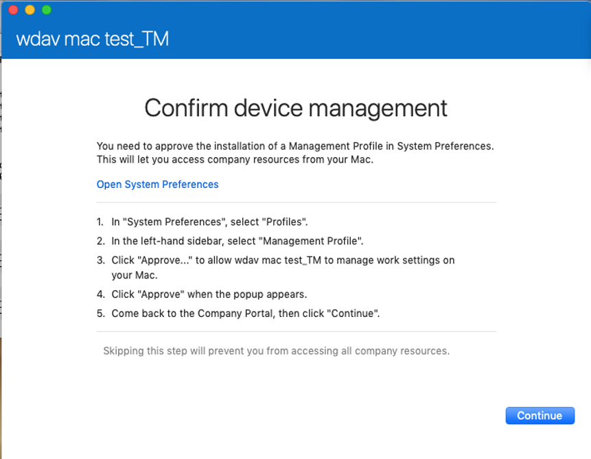

# <a name="intune-based-deployment-for-microsoft-defender-for-endpoint-for-mac"></a><span data-ttu-id="1f067-104">Implementación basada en Intune para Microsoft Defender para Endpoint para Mac</span><span class="sxs-lookup"><span data-stu-id="1f067-104">Intune-based deployment for Microsoft Defender for Endpoint for Mac</span></span>

[!INCLUDE [Microsoft 365 Defender rebranding](../../includes/microsoft-defender.md)]


> [!NOTE]
> <span data-ttu-id="1f067-105">En esta documentación se explica el método heredado para implementar y configurar Microsoft Defender para Endpoint en dispositivos macOS.</span><span class="sxs-lookup"><span data-stu-id="1f067-105">This documentation explains the legacy method for deploying and configuring Microsoft Defender for Endpoint on macOS devices.</span></span> <span data-ttu-id="1f067-106">La experiencia nativa ya está disponible en la consola de MEM.</span><span class="sxs-lookup"><span data-stu-id="1f067-106">The native experience is now available in the MEM console.</span></span> <span data-ttu-id="1f067-107">La versión de la interfaz de usuario nativa en la consola de MEM proporciona a los administradores una forma mucho más sencilla de configurar e implementar la aplicación y enviarla a dispositivos macOS.</span><span class="sxs-lookup"><span data-stu-id="1f067-107">The release of the native UI in the MEM console provide admins with a much simpler way to configure and deploy the application and send it down to macOS devices.</span></span> <br> <br>
><span data-ttu-id="1f067-108">La entrada de blog [MEM simplifica la implementación de Microsoft Defender para endpoint para macOS](https://techcommunity.microsoft.com/t5/microsoft-endpoint-manager-blog/microsoft-endpoint-manager-simplifies-deployment-of-microsoft/ba-p/1322995) explica las nuevas características.</span><span class="sxs-lookup"><span data-stu-id="1f067-108">The blog post [MEM simplifies deployment of Microsoft Defender for Endpoint for macOS](https://techcommunity.microsoft.com/t5/microsoft-endpoint-manager-blog/microsoft-endpoint-manager-simplifies-deployment-of-microsoft/ba-p/1322995) explains the new features.</span></span> <span data-ttu-id="1f067-109">Para configurar la aplicación, ve a [Configuración de Microsoft Defender para Endpoint para Mac en Microsoft InTune](https://docs.microsoft.com/mem/intune/protect/antivirus-microsoft-defender-settings-macos).</span><span class="sxs-lookup"><span data-stu-id="1f067-109">To configure the app, go to [Settings for Microsoft Defender for Endpoint for Mac in Microsoft InTune](https://docs.microsoft.com/mem/intune/protect/antivirus-microsoft-defender-settings-macos).</span></span> <span data-ttu-id="1f067-110">Para implementar la aplicación, vaya [a Agregar Microsoft Defender para endpoint a dispositivos macOS con Microsoft Intune](https://docs.microsoft.com/mem/intune/apps/apps-advanced-threat-protection-macos).</span><span class="sxs-lookup"><span data-stu-id="1f067-110">To deploy the app, go to [Add Microsoft Defender for Endpoint to macOS devices using Microsoft Intune](https://docs.microsoft.com/mem/intune/apps/apps-advanced-threat-protection-macos).</span></span>

<span data-ttu-id="1f067-111">**Se aplica a:**</span><span class="sxs-lookup"><span data-stu-id="1f067-111">**Applies to:**</span></span>

- [<span data-ttu-id="1f067-112">Microsoft Defender para punto de conexión para Mac</span><span class="sxs-lookup"><span data-stu-id="1f067-112">Microsoft Defender for Endpoint for Mac</span></span>](microsoft-defender-endpoint-mac.md)

<span data-ttu-id="1f067-113">En este tema se describe cómo implementar Microsoft Defender para Endpoint para Mac a través de Intune.</span><span class="sxs-lookup"><span data-stu-id="1f067-113">This topic describes how to deploy Microsoft Defender for Endpoint for Mac through Intune.</span></span> <span data-ttu-id="1f067-114">Una implementación correcta requiere la finalización de todos los pasos siguientes:</span><span class="sxs-lookup"><span data-stu-id="1f067-114">A successful deployment requires the completion of all of the following steps:</span></span>

1. [<span data-ttu-id="1f067-115">Descargar paquetes de instalación e incorporación</span><span class="sxs-lookup"><span data-stu-id="1f067-115">Download installation and onboarding packages</span></span>](#download-installation-and-onboarding-packages)
1. [<span data-ttu-id="1f067-116">Configuración del dispositivo cliente</span><span class="sxs-lookup"><span data-stu-id="1f067-116">Client device setup</span></span>](#client-device-setup)
1. [<span data-ttu-id="1f067-117">Aprobar extensiones del sistema</span><span class="sxs-lookup"><span data-stu-id="1f067-117">Approve system extensions</span></span>](#approve-system-extensions)
1. [<span data-ttu-id="1f067-118">Crear perfiles de configuración del sistema</span><span class="sxs-lookup"><span data-stu-id="1f067-118">Create System Configuration profiles</span></span>](#create-system-configuration-profiles)
1. [<span data-ttu-id="1f067-119">Publicar aplicación</span><span class="sxs-lookup"><span data-stu-id="1f067-119">Publish application</span></span>](#publish-application)

## <a name="prerequisites-and-system-requirements"></a><span data-ttu-id="1f067-120">Requisitos previos y requisitos del sistema</span><span class="sxs-lookup"><span data-stu-id="1f067-120">Prerequisites and system requirements</span></span>

<span data-ttu-id="1f067-121">Antes de empezar, consulta la página principal de [Microsoft Defender para](microsoft-defender-endpoint-mac.md) Endpoint para Mac para obtener una descripción de los requisitos previos y los requisitos del sistema para la versión de software actual.</span><span class="sxs-lookup"><span data-stu-id="1f067-121">Before you get started, see [the main Microsoft Defender for Endpoint for Mac page](microsoft-defender-endpoint-mac.md) for a description of prerequisites and system requirements for the current software version.</span></span>

## <a name="overview"></a><span data-ttu-id="1f067-122">Información general</span><span class="sxs-lookup"><span data-stu-id="1f067-122">Overview</span></span>

<span data-ttu-id="1f067-123">En la tabla siguiente se resumen los pasos que debe seguir para implementar y administrar Microsoft Defender para Endpoint for Macs, a través de Intune.</span><span class="sxs-lookup"><span data-stu-id="1f067-123">The following table summarizes the steps you would need to take to deploy and manage Microsoft Defender for Endpoint for Macs, via Intune.</span></span> <span data-ttu-id="1f067-124">Los pasos más detallados están disponibles a continuación.</span><span class="sxs-lookup"><span data-stu-id="1f067-124">More detailed steps are available below.</span></span>

| <span data-ttu-id="1f067-125">Paso</span><span class="sxs-lookup"><span data-stu-id="1f067-125">Step</span></span> | <span data-ttu-id="1f067-126">Nombres de archivo de ejemplo</span><span class="sxs-lookup"><span data-stu-id="1f067-126">Sample file names</span></span> | <span data-ttu-id="1f067-127">BundleIdentifier</span><span class="sxs-lookup"><span data-stu-id="1f067-127">BundleIdentifier</span></span> |
|-|-|-|
| [<span data-ttu-id="1f067-128">Descargar paquetes de instalación e incorporación</span><span class="sxs-lookup"><span data-stu-id="1f067-128">Download installation and onboarding packages</span></span>](#download-installation-and-onboarding-packages) | <span data-ttu-id="1f067-129">WindowsDefenderATPOnboarding__MDATP_wdav.atp.xml</span><span class="sxs-lookup"><span data-stu-id="1f067-129">WindowsDefenderATPOnboarding__MDATP_wdav.atp.xml</span></span> | <span data-ttu-id="1f067-130">com.microsoft.wdav.atp</span><span class="sxs-lookup"><span data-stu-id="1f067-130">com.microsoft.wdav.atp</span></span> |
| [<span data-ttu-id="1f067-131">Aprobar extensión del sistema para Microsoft Defender para endpoint</span><span class="sxs-lookup"><span data-stu-id="1f067-131">Approve System Extension for Microsoft Defender for Endpoint</span></span>](#approve-system-extensions) | <span data-ttu-id="1f067-132">MDATP_SysExt.xml</span><span class="sxs-lookup"><span data-stu-id="1f067-132">MDATP_SysExt.xml</span></span> | <span data-ttu-id="1f067-133">N/D</span><span class="sxs-lookup"><span data-stu-id="1f067-133">N/A</span></span> |
| [<span data-ttu-id="1f067-134">Aprobar extensión de kernel para Microsoft Defender para endpoint</span><span class="sxs-lookup"><span data-stu-id="1f067-134">Approve Kernel Extension for Microsoft Defender for Endpoint</span></span>](#download-installation-and-onboarding-packages) | <span data-ttu-id="1f067-135">MDATP_KExt.xml</span><span class="sxs-lookup"><span data-stu-id="1f067-135">MDATP_KExt.xml</span></span> | <span data-ttu-id="1f067-136">N/D</span><span class="sxs-lookup"><span data-stu-id="1f067-136">N/A</span></span> |
| [<span data-ttu-id="1f067-137">Conceder acceso en disco completo a Microsoft Defender para endpoint</span><span class="sxs-lookup"><span data-stu-id="1f067-137">Grant full disk access to Microsoft Defender for Endpoint</span></span>](#create-system-configuration-profiles-step-8) | <span data-ttu-id="1f067-138">MDATP_tcc_Catalina_or_newer.xml</span><span class="sxs-lookup"><span data-stu-id="1f067-138">MDATP_tcc_Catalina_or_newer.xml</span></span> | <span data-ttu-id="1f067-139">com.microsoft.wdav.tcc</span><span class="sxs-lookup"><span data-stu-id="1f067-139">com.microsoft.wdav.tcc</span></span> |
| [<span data-ttu-id="1f067-140">Directiva de extensión de red</span><span class="sxs-lookup"><span data-stu-id="1f067-140">Network Extension policy</span></span>](#create-system-configuration-profiles-step-9) | <span data-ttu-id="1f067-141">MDATP_NetExt.xml</span><span class="sxs-lookup"><span data-stu-id="1f067-141">MDATP_NetExt.xml</span></span> | <span data-ttu-id="1f067-142">N/D</span><span class="sxs-lookup"><span data-stu-id="1f067-142">N/A</span></span> |
| [<span data-ttu-id="1f067-143">Configurar Microsoft AutoUpdate (MAU)</span><span class="sxs-lookup"><span data-stu-id="1f067-143">Configure Microsoft AutoUpdate (MAU)</span></span>](https://docs.microsoft.com/microsoft-365/security/defender-endpoint/mac-updates#intune) | <span data-ttu-id="1f067-144">MDATP_Microsoft_AutoUpdate.xml</span><span class="sxs-lookup"><span data-stu-id="1f067-144">MDATP_Microsoft_AutoUpdate.xml</span></span> | <span data-ttu-id="1f067-145">com.microsoft.autoupdate2</span><span class="sxs-lookup"><span data-stu-id="1f067-145">com.microsoft.autoupdate2</span></span> |
| [<span data-ttu-id="1f067-146">Configuración de Microsoft Defender para puntos de conexión</span><span class="sxs-lookup"><span data-stu-id="1f067-146">Microsoft Defender for Endpoint configuration settings</span></span>](https://docs.microsoft.com/microsoft-365/security/defender-endpoint/mac-preferences#intune-profile-1)<br/><br/> <span data-ttu-id="1f067-147">**Nota:** Si está planeando ejecutar un ANTIVIRUS de terceros para macOS, establezca `passiveMode` en `true` .</span><span class="sxs-lookup"><span data-stu-id="1f067-147">**Note:** If you're planning to run a third-party AV for macOS, set `passiveMode` to `true`.</span></span> | <span data-ttu-id="1f067-148">MDATP_WDAV_and_exclusion_settings_Preferences.xml</span><span class="sxs-lookup"><span data-stu-id="1f067-148">MDATP_WDAV_and_exclusion_settings_Preferences.xml</span></span> | <span data-ttu-id="1f067-149">com.microsoft.wdav</span><span class="sxs-lookup"><span data-stu-id="1f067-149">com.microsoft.wdav</span></span> |
| [<span data-ttu-id="1f067-150">Configurar Microsoft Defender para notificaciones de punto de conexión y MS AutoUpdate (MAU)</span><span class="sxs-lookup"><span data-stu-id="1f067-150">Configure Microsoft Defender for Endpoint and MS AutoUpdate (MAU) notifications</span></span>](#create-system-configuration-profiles-step-10) | <span data-ttu-id="1f067-151">MDATP_MDAV_Tray_and_AutoUpdate2.mobileconfig</span><span class="sxs-lookup"><span data-stu-id="1f067-151">MDATP_MDAV_Tray_and_AutoUpdate2.mobileconfig</span></span> | <span data-ttu-id="1f067-152">com.microsoft.autoupdate2 o com.microsoft.wdav.tray</span><span class="sxs-lookup"><span data-stu-id="1f067-152">com.microsoft.autoupdate2 or com.microsoft.wdav.tray</span></span> |

## <a name="download-installation-and-onboarding-packages"></a><span data-ttu-id="1f067-153">Descargar paquetes de instalación e incorporación</span><span class="sxs-lookup"><span data-stu-id="1f067-153">Download installation and onboarding packages</span></span>

<span data-ttu-id="1f067-154">Descargue los paquetes de instalación e incorporación del Centro de seguridad de Microsoft Defender:</span><span class="sxs-lookup"><span data-stu-id="1f067-154">Download the installation and onboarding packages from Microsoft Defender Security Center:</span></span>

1. <span data-ttu-id="1f067-155">En el Centro de seguridad de Microsoft Defender, vaya **a Configuración** Incorporación de  >  **administración de**  >  **dispositivos**.</span><span class="sxs-lookup"><span data-stu-id="1f067-155">In Microsoft Defender Security Center, go to **Settings** > **Device Management** > **Onboarding**.</span></span>

2. <span data-ttu-id="1f067-156">Establezca el sistema operativo en **macOS** y el método de implementación en **Administración de dispositivos móviles / Microsoft Intune**.</span><span class="sxs-lookup"><span data-stu-id="1f067-156">Set the operating system to **macOS** and the deployment method to **Mobile Device Management / Microsoft Intune**.</span></span>

    

3. <span data-ttu-id="1f067-158">Seleccione **Descargar paquete de instalación**.</span><span class="sxs-lookup"><span data-stu-id="1f067-158">Select **Download installation package**.</span></span> <span data-ttu-id="1f067-159">Guárdelo _como wdav.pkg_ en un directorio local.</span><span class="sxs-lookup"><span data-stu-id="1f067-159">Save it as _wdav.pkg_ to a local directory.</span></span>

4. <span data-ttu-id="1f067-160">Seleccione **Descargar paquete de incorporación**.</span><span class="sxs-lookup"><span data-stu-id="1f067-160">Select **Download onboarding package**.</span></span> <span data-ttu-id="1f067-161">Guárdelo _WindowsDefenderATPOnboardingPackage.zip_ en el mismo directorio.</span><span class="sxs-lookup"><span data-stu-id="1f067-161">Save it as _WindowsDefenderATPOnboardingPackage.zip_ to the same directory.</span></span>

5. <span data-ttu-id="1f067-162">Descargue **IntuneAppUtil** desde [https://docs.microsoft.com/intune/lob-apps-macos](https://docs.microsoft.com/intune/lob-apps-macos) .</span><span class="sxs-lookup"><span data-stu-id="1f067-162">Download **IntuneAppUtil** from [https://docs.microsoft.com/intune/lob-apps-macos](https://docs.microsoft.com/intune/lob-apps-macos).</span></span>

6. <span data-ttu-id="1f067-163">Desde un símbolo del sistema, compruebe que tiene los tres archivos.</span><span class="sxs-lookup"><span data-stu-id="1f067-163">From a command prompt, verify that you have the three files.</span></span>
  

    ```bash
    ls -l
    ```

    ```Output
    total 721688
    -rw-r--r--  1 test  staff     269280 Mar 15 11:25 IntuneAppUtil
    -rw-r--r--  1 test  staff      11821 Mar 15 09:23 WindowsDefenderATPOnboardingPackage.zip
    -rw-r--r--  1 test  staff  354531845 Mar 13 08:57 wdav.pkg
    ```
7. <span data-ttu-id="1f067-164">Extraiga el contenido de los archivos .zip:</span><span class="sxs-lookup"><span data-stu-id="1f067-164">Extract the contents of the .zip files:</span></span>

    ```bash
    unzip WindowsDefenderATPOnboardingPackage.zip
    ```
    ```Output
    Archive:  WindowsDefenderATPOnboardingPackage.zip
    warning:  WindowsDefenderATPOnboardingPackage.zip appears to use backslashes as path separators
      inflating: intune/kext.xml
      inflating: intune/WindowsDefenderATPOnboarding.xml
      inflating: jamf/WindowsDefenderATPOnboarding.plist
    ```

8. <span data-ttu-id="1f067-165">Convertir IntuneAppUtil en ejecutable:</span><span class="sxs-lookup"><span data-stu-id="1f067-165">Make IntuneAppUtil an executable:</span></span>

    ```bash
    chmod +x IntuneAppUtil
    ```

9. <span data-ttu-id="1f067-166">Cree el paquete wdav.pkg.intunemac a partir de wdav.pkg:</span><span class="sxs-lookup"><span data-stu-id="1f067-166">Create the wdav.pkg.intunemac package from wdav.pkg:</span></span>

    ```bash
    ./IntuneAppUtil -c wdav.pkg -o . -i "com.microsoft.wdav" -n "1.0.0"
    ```
    ```Output
    Microsoft Intune Application Utility for Mac OS X
    Version: 1.0.0.0
    Copyright 2018 Microsoft Corporation

    Creating intunemac file for /Users/test/Downloads/wdav.pkg
    Composing the intunemac file output
    Output written to ./wdav.pkg.intunemac.

    IntuneAppUtil successfully processed "wdav.pkg",
    to deploy refer to the product documentation.
    ```

## <a name="client-device-setup"></a><span data-ttu-id="1f067-167">Configuración del dispositivo cliente</span><span class="sxs-lookup"><span data-stu-id="1f067-167">Client device setup</span></span>

<span data-ttu-id="1f067-168">No necesita ningún aprovisionamiento especial para un dispositivo Mac más allá de una instalación [estándar del Portal de empresa.](https://docs.microsoft.com/intune-user-help/enroll-your-device-in-intune-macos-cp)</span><span class="sxs-lookup"><span data-stu-id="1f067-168">You don't need any special provisioning for a Mac device beyond a standard [Company Portal installation](https://docs.microsoft.com/intune-user-help/enroll-your-device-in-intune-macos-cp).</span></span>

1. <span data-ttu-id="1f067-169">Confirme la administración de dispositivos.</span><span class="sxs-lookup"><span data-stu-id="1f067-169">Confirm device management.</span></span>

   

    <span data-ttu-id="1f067-171">Seleccione **Abrir preferencias del sistema,** busque **Perfil de administración** en la lista y seleccione **Aprobar...**. El perfil de administración se mostrará como **Verificado**:</span><span class="sxs-lookup"><span data-stu-id="1f067-171">Select **Open System Preferences**, locate **Management Profile** on the list, and select **Approve...**. Your Management Profile would be displayed as **Verified**:</span></span>

    

2. <span data-ttu-id="1f067-173">Seleccione **Continuar** y complete la inscripción.</span><span class="sxs-lookup"><span data-stu-id="1f067-173">Select **Continue** and complete the enrollment.</span></span>

   <span data-ttu-id="1f067-174">Ahora puede inscribir más dispositivos.</span><span class="sxs-lookup"><span data-stu-id="1f067-174">You may now enroll more devices.</span></span> <span data-ttu-id="1f067-175">También puede inscribirlos más adelante, una vez que haya terminado de aprovisionar paquetes de aplicación y configuración del sistema.</span><span class="sxs-lookup"><span data-stu-id="1f067-175">You can also enroll them later, after you have finished provisioning system configuration and application packages.</span></span>

3. <span data-ttu-id="1f067-176">En Intune, abra **Administrar**  >  **dispositivos**  >  **Todos los dispositivos**.</span><span class="sxs-lookup"><span data-stu-id="1f067-176">In Intune, open **Manage** > **Devices** > **All devices**.</span></span> <span data-ttu-id="1f067-177">Aquí puedes ver el dispositivo entre los que aparecen en la lista:</span><span class="sxs-lookup"><span data-stu-id="1f067-177">Here you can see your device among those listed:</span></span>

   > [!div class="mx-imgBorder"]
   > <span data-ttu-id="1f067-178"></span><span class="sxs-lookup"><span data-stu-id="1f067-178"></span></span>

## <a name="approve-system-extensions"></a><span data-ttu-id="1f067-179">Aprobar extensiones del sistema</span><span class="sxs-lookup"><span data-stu-id="1f067-179">Approve System Extensions</span></span>

<span data-ttu-id="1f067-180">Para aprobar las extensiones del sistema:</span><span class="sxs-lookup"><span data-stu-id="1f067-180">To approve the system extensions:</span></span>

1. <span data-ttu-id="1f067-181">En Intune, abra **Administrar configuración**  >  **de dispositivo.**</span><span class="sxs-lookup"><span data-stu-id="1f067-181">In Intune, open **Manage** > **Device configuration**.</span></span> <span data-ttu-id="1f067-182">Seleccione **Administrar**  >  **perfiles Crear**  >  **perfil**.</span><span class="sxs-lookup"><span data-stu-id="1f067-182">Select **Manage** > **Profiles** > **Create Profile**.</span></span>

2. <span data-ttu-id="1f067-183">Elija un nombre para el perfil.</span><span class="sxs-lookup"><span data-stu-id="1f067-183">Choose a name for the profile.</span></span> <span data-ttu-id="1f067-184">Cambiar **Platform=macOS** a **Profile type=Extensions**.</span><span class="sxs-lookup"><span data-stu-id="1f067-184">Change **Platform=macOS** to **Profile type=Extensions**.</span></span> <span data-ttu-id="1f067-185">Seleccione **Crear**.</span><span class="sxs-lookup"><span data-stu-id="1f067-185">Select **Create**.</span></span>

3. <span data-ttu-id="1f067-186">En la **pestaña Conceptos** básicos, asigne un nombre a este nuevo perfil.</span><span class="sxs-lookup"><span data-stu-id="1f067-186">In the **Basics** tab, give a name to this new profile.</span></span>

4. <span data-ttu-id="1f067-187">En la **pestaña Configuración,** agregue las siguientes entradas en la **sección Extensiones permitidas del sistema:**</span><span class="sxs-lookup"><span data-stu-id="1f067-187">In the **Configuration settings** tab, add the following entries in the **Allowed system extensions** section:</span></span>

    <span data-ttu-id="1f067-188">Identificador de agrupación</span><span class="sxs-lookup"><span data-stu-id="1f067-188">Bundle identifier</span></span>         | <span data-ttu-id="1f067-189">Identificador de equipo</span><span class="sxs-lookup"><span data-stu-id="1f067-189">Team identifier</span></span>
    --------------------------|----------------
    <span data-ttu-id="1f067-190">com.microsoft.wdav.epsext</span><span class="sxs-lookup"><span data-stu-id="1f067-190">com.microsoft.wdav.epsext</span></span> | <span data-ttu-id="1f067-191">UBF8T346G9</span><span class="sxs-lookup"><span data-stu-id="1f067-191">UBF8T346G9</span></span>
    <span data-ttu-id="1f067-192">com.microsoft.wdav.netext</span><span class="sxs-lookup"><span data-stu-id="1f067-192">com.microsoft.wdav.netext</span></span> | <span data-ttu-id="1f067-193">UBF8T346G9</span><span class="sxs-lookup"><span data-stu-id="1f067-193">UBF8T346G9</span></span>

    > [!div class="mx-imgBorder"]
    > <span data-ttu-id="1f067-194"></span><span class="sxs-lookup"><span data-stu-id="1f067-194"></span></span>

5. <span data-ttu-id="1f067-195">En la **pestaña Asignaciones,** asigne este perfil a **Todos los usuarios & Todos los dispositivos**.</span><span class="sxs-lookup"><span data-stu-id="1f067-195">In the **Assignments** tab, assign this profile to **All Users & All devices**.</span></span>

6. <span data-ttu-id="1f067-196">Revise y cree este perfil de configuración.</span><span class="sxs-lookup"><span data-stu-id="1f067-196">Review and create this configuration profile.</span></span>

## <a name="create-system-configuration-profiles"></a><span data-ttu-id="1f067-197">Crear perfiles de configuración del sistema</span><span class="sxs-lookup"><span data-stu-id="1f067-197">Create System Configuration profiles</span></span>

1. <span data-ttu-id="1f067-198">En Intune, abra **Administrar configuración**  >  **de dispositivo.**</span><span class="sxs-lookup"><span data-stu-id="1f067-198">In Intune, open **Manage** > **Device configuration**.</span></span> <span data-ttu-id="1f067-199">Seleccione **Administrar**  >  **perfiles Crear**  >  **perfil**.</span><span class="sxs-lookup"><span data-stu-id="1f067-199">Select **Manage** > **Profiles** > **Create Profile**.</span></span>

2. <span data-ttu-id="1f067-200">Elija un nombre para el perfil.</span><span class="sxs-lookup"><span data-stu-id="1f067-200">Choose a name for the profile.</span></span> <span data-ttu-id="1f067-201">Cambiar **Platform=macOS** a **Profile type=Custom**.</span><span class="sxs-lookup"><span data-stu-id="1f067-201">Change **Platform=macOS** to **Profile type=Custom**.</span></span> <span data-ttu-id="1f067-202">Seleccione **Configurar**.</span><span class="sxs-lookup"><span data-stu-id="1f067-202">Select **Configure**.</span></span>

3. <span data-ttu-id="1f067-203">Abra el perfil de configuración y cargue intune/kext.xml.</span><span class="sxs-lookup"><span data-stu-id="1f067-203">Open the configuration profile and upload intune/kext.xml.</span></span> <span data-ttu-id="1f067-204">Este archivo se creó en una de las secciones anteriores.</span><span class="sxs-lookup"><span data-stu-id="1f067-204">This file was created in one of the preceding sections.</span></span>

4. <span data-ttu-id="1f067-205">Elija **Aceptar**.</span><span class="sxs-lookup"><span data-stu-id="1f067-205">Select **OK**.</span></span>

    

5. <span data-ttu-id="1f067-207">Seleccione **Administrar**  >  **asignaciones**.</span><span class="sxs-lookup"><span data-stu-id="1f067-207">Select **Manage** > **Assignments**.</span></span> <span data-ttu-id="1f067-208">En la **pestaña Incluir,** seleccione **Asignar a todos los usuarios & Todos los dispositivos**.</span><span class="sxs-lookup"><span data-stu-id="1f067-208">In the **Include** tab, select **Assign to All Users & All devices**.</span></span>

6. <span data-ttu-id="1f067-209">Repita los pasos del 1 al 5 para obtener más perfiles.</span><span class="sxs-lookup"><span data-stu-id="1f067-209">Repeat steps 1 through 5 for more profiles.</span></span>

7. <span data-ttu-id="1f067-210">Cree otro perfil, así como un nombre y cargue el archivo intune/WindowsDefenderATPOnboarding.xml.</span><span class="sxs-lookup"><span data-stu-id="1f067-210">Create another profile, give it a name, and upload the intune/WindowsDefenderATPOnboarding.xml file.</span></span>

8. <span data-ttu-id="1f067-211">Descargue **fulldisk.mobileconfig** desde nuestro repositorio [de GitHub](https://raw.githubusercontent.com/microsoft/mdatp-xplat/master/macos/mobileconfig/profiles/fulldisk.mobileconfig) y guárdelo como **tcc.xml**.</span><span class="sxs-lookup"><span data-stu-id="1f067-211">Download **fulldisk.mobileconfig** from [our GitHub repository](https://raw.githubusercontent.com/microsoft/mdatp-xplat/master/macos/mobileconfig/profiles/fulldisk.mobileconfig) and save it as **tcc.xml**.</span></span> <span data-ttu-id="1f067-212">Crear otro perfil, darle cualquier nombre y cargar este archivo en él.<a name="create-system-configuration-profiles-step-8" id = "create-system-configuration-profiles-step-8"></a></span><span class="sxs-lookup"><span data-stu-id="1f067-212">Create another profile, give it any name and upload this file to it.<a name="create-system-configuration-profiles-step-8" id = "create-system-configuration-profiles-step-8"></a></span></span>

   > [!CAUTION]
   > <span data-ttu-id="1f067-213">macOS 10.15 (Catalina) contiene nuevas mejoras de seguridad y privacidad.</span><span class="sxs-lookup"><span data-stu-id="1f067-213">macOS 10.15 (Catalina) contains new security and privacy enhancements.</span></span> <span data-ttu-id="1f067-214">A partir de esta versión, de forma predeterminada, las aplicaciones no pueden acceder a determinadas ubicaciones del disco (como Documentos, Descargas, Escritorio, etc.) sin consentimiento explícito.</span><span class="sxs-lookup"><span data-stu-id="1f067-214">Beginning with this version, by default, applications are not able to access certain locations on disk (such as Documents, Downloads, Desktop, etc.) without explicit consent.</span></span> <span data-ttu-id="1f067-215">En ausencia de este consentimiento, Microsoft Defender para Endpoint no puede proteger completamente el dispositivo.</span><span class="sxs-lookup"><span data-stu-id="1f067-215">In the absence of this consent, Microsoft Defender for Endpoint is not able to fully protect your device.</span></span>
   >
   > <span data-ttu-id="1f067-216">Este perfil de configuración concede acceso en disco completo a Microsoft Defender para endpoint.</span><span class="sxs-lookup"><span data-stu-id="1f067-216">This configuration profile grants Full Disk Access to Microsoft Defender for Endpoint.</span></span> <span data-ttu-id="1f067-217">Si configuró anteriormente Microsoft Defender para Endpoint a través de Intune, se recomienda actualizar la implementación con este perfil de configuración.</span><span class="sxs-lookup"><span data-stu-id="1f067-217">If you previously configured Microsoft Defender for Endpoint through Intune, we recommend you update the deployment with this configuration profile.</span></span>

9. <span data-ttu-id="1f067-218">Como parte de las capacidades de detección y respuesta de puntos de conexión, Microsoft Defender para Endpoint para Mac inspecciona el tráfico de sockets e informa de esta información al portal del Centro de seguridad de Microsoft Defender.</span><span class="sxs-lookup"><span data-stu-id="1f067-218">As part of the Endpoint Detection and Response capabilities, Microsoft Defender for Endpoint for Mac inspects socket traffic and reports this information to the Microsoft Defender Security Center portal.</span></span> <span data-ttu-id="1f067-219">La siguiente directiva permite que la extensión de red realice esta funcionalidad.</span><span class="sxs-lookup"><span data-stu-id="1f067-219">The following policy allows the network extension to perform this functionality.</span></span> <span data-ttu-id="1f067-220">Descargue **netfilter.mobileconfig** desde nuestro repositorio de [GitHub,](https://raw.githubusercontent.com/microsoft/mdatp-xplat/master/macos/mobileconfig/profiles/netfilter.mobileconfig)guárdelo como netext.xml e impleméntelo con los mismos pasos que en las secciones anteriores.</span><span class="sxs-lookup"><span data-stu-id="1f067-220">Download **netfilter.mobileconfig** from [our GitHub repository](https://raw.githubusercontent.com/microsoft/mdatp-xplat/master/macos/mobileconfig/profiles/netfilter.mobileconfig), save it as netext.xml and deploy it using the same steps as in the previous sections.</span></span> <a name = "create-system-configuration-profiles-step-9" id = "create-system-configuration-profiles-step-9"></a>

10. <span data-ttu-id="1f067-221">Para permitir que Microsoft Defender para Endpoint para Mac y Microsoft Auto Update muestren notificaciones en la interfaz de usuario en macOS 10.15 (Catalina), descargue desde nuestro repositorio `notif.mobileconfig` [de GitHub](https://raw.githubusercontent.com/microsoft/mdatp-xplat/master/macos/mobileconfig/profiles/notif.mobileconfig) e impórtelo como una carga personalizada.</span><span class="sxs-lookup"><span data-stu-id="1f067-221">To allow Microsoft Defender for Endpoint for Mac and Microsoft Auto Update to display notifications in UI on macOS 10.15 (Catalina), download `notif.mobileconfig` from [our GitHub repository](https://raw.githubusercontent.com/microsoft/mdatp-xplat/master/macos/mobileconfig/profiles/notif.mobileconfig) and import it as a custom payload.</span></span> <a name = "create-system-configuration-profiles-step-10" id = "create-system-configuration-profiles-step-10"></a>

11. <span data-ttu-id="1f067-222">Seleccione **Administrar > asignaciones**.</span><span class="sxs-lookup"><span data-stu-id="1f067-222">Select **Manage > Assignments**.</span></span>  <span data-ttu-id="1f067-223">En la **pestaña Incluir,** seleccione **Asignar a todos los usuarios & Todos los dispositivos**.</span><span class="sxs-lookup"><span data-stu-id="1f067-223">In the **Include** tab, select **Assign to All Users & All devices**.</span></span>

<span data-ttu-id="1f067-224">Una vez que los cambios de Intune se propaguen a los dispositivos inscritos, puede verlos en **Estado**  >  **del dispositivo de supervisión:**</span><span class="sxs-lookup"><span data-stu-id="1f067-224">Once the Intune changes are propagated to the enrolled devices, you can see them listed under **Monitor** > **Device status**:</span></span>

> [!div class="mx-imgBorder"]
> <span data-ttu-id="1f067-225"></span><span class="sxs-lookup"><span data-stu-id="1f067-225"></span></span>

## <a name="publish-application"></a><span data-ttu-id="1f067-226">Publicar aplicación</span><span class="sxs-lookup"><span data-stu-id="1f067-226">Publish application</span></span>

1. <span data-ttu-id="1f067-227">En Intune, abra la hoja **Administrar > aplicaciones cliente.**</span><span class="sxs-lookup"><span data-stu-id="1f067-227">In Intune, open the **Manage > Client apps** blade.</span></span> <span data-ttu-id="1f067-228">Seleccione **Aplicaciones > Agregar**.</span><span class="sxs-lookup"><span data-stu-id="1f067-228">Select **Apps > Add**.</span></span>

2. <span data-ttu-id="1f067-229">Selecciona **Tipo de aplicación=Otra/Aplicación de línea de negocio.**</span><span class="sxs-lookup"><span data-stu-id="1f067-229">Select **App type=Other/Line-of-business app**.</span></span>

3. <span data-ttu-id="1f067-230">Seleccione **file=wdav.pkg.intunemac**.</span><span class="sxs-lookup"><span data-stu-id="1f067-230">Select **file=wdav.pkg.intunemac**.</span></span> <span data-ttu-id="1f067-231">Seleccione **Aceptar** para cargar.</span><span class="sxs-lookup"><span data-stu-id="1f067-231">Select **OK** to upload.</span></span>

4. <span data-ttu-id="1f067-232">Seleccione **Configurar** y agregue la información necesaria.</span><span class="sxs-lookup"><span data-stu-id="1f067-232">Select **Configure** and add the required information.</span></span>

5. <span data-ttu-id="1f067-233">Use **macOS High Sierra 10.14** como sistema operativo mínimo.</span><span class="sxs-lookup"><span data-stu-id="1f067-233">Use **macOS High Sierra 10.14** as the minimum OS.</span></span>

6. <span data-ttu-id="1f067-234">Establece *Omitir versión de la aplicación* en **Sí**.</span><span class="sxs-lookup"><span data-stu-id="1f067-234">Set *Ignore app version* to **Yes**.</span></span> <span data-ttu-id="1f067-235">Otras opciones de configuración pueden ser cualquier valor arbitrario.</span><span class="sxs-lookup"><span data-stu-id="1f067-235">Other settings can be any arbitrary value.</span></span>

    > [!CAUTION]
    > <span data-ttu-id="1f067-236">Establecer *Omitir versión de la aplicación* en **No** afecta a la capacidad de la aplicación para recibir actualizaciones a través de Microsoft AutoUpdate.</span><span class="sxs-lookup"><span data-stu-id="1f067-236">Setting *Ignore app version* to **No** impacts the ability of the application to receive updates through Microsoft AutoUpdate.</span></span> <span data-ttu-id="1f067-237">Consulta [Implementar actualizaciones para Microsoft Defender para Endpoint para Mac](mac-updates.md) para obtener información adicional sobre cómo se actualiza el producto.</span><span class="sxs-lookup"><span data-stu-id="1f067-237">See [Deploy updates for Microsoft Defender for Endpoint for Mac](mac-updates.md) for additional information about how the product is updated.</span></span>
    >
    > <span data-ttu-id="1f067-238">Si la versión cargada por Intune es inferior a la versión del dispositivo, se instalará la versión inferior, lo que degradará eficazmente Microsoft Defender para Endpoint.</span><span class="sxs-lookup"><span data-stu-id="1f067-238">If the version uploaded by Intune is lower than the version on the device, then the lower version will be installed, effectively downgrading Microsoft Defender for Endpoint.</span></span> <span data-ttu-id="1f067-239">Esto podría dar como resultado una aplicación que no funciona.</span><span class="sxs-lookup"><span data-stu-id="1f067-239">This could result in a non-functioning application.</span></span> <span data-ttu-id="1f067-240">Consulta [Implementar actualizaciones para Microsoft Defender para Endpoint para Mac](mac-updates.md) para obtener información adicional sobre cómo se actualiza el producto.</span><span class="sxs-lookup"><span data-stu-id="1f067-240">See [Deploy updates for Microsoft Defender for Endpoint for Mac](mac-updates.md) for additional information about how the product is updated.</span></span> <span data-ttu-id="1f067-241">Si implementaste Microsoft Defender para endpoint con *ignorar la* versión de la aplicación establecida en **No,** cámbiese a **Sí**.</span><span class="sxs-lookup"><span data-stu-id="1f067-241">If you deployed Microsoft Defender for Endpoint with *Ignore app version* set to **No**, please change it to **Yes**.</span></span> <span data-ttu-id="1f067-242">Si Microsoft Defender para endpoint aún no se puede instalar en un dispositivo cliente, desinstala Microsoft Defender para Endpoint e inserta la directiva actualizada.</span><span class="sxs-lookup"><span data-stu-id="1f067-242">If Microsoft Defender for Endpoint still cannot be installed on a client device, then uninstall Microsoft Defender for Endpoint and push the updated policy.</span></span>
     
    > [!div class="mx-imgBorder"]
    > <span data-ttu-id="1f067-243"></span><span class="sxs-lookup"><span data-stu-id="1f067-243"></span></span>

7. <span data-ttu-id="1f067-244">Seleccione **Aceptar** y **Agregar**.</span><span class="sxs-lookup"><span data-stu-id="1f067-244">Select **OK** and **Add**.</span></span>

    > [!div class="mx-imgBorder"]
    > <span data-ttu-id="1f067-245"></span><span class="sxs-lookup"><span data-stu-id="1f067-245"></span></span>

8. <span data-ttu-id="1f067-246">Puede tardar unos minutos en cargar el paquete.</span><span class="sxs-lookup"><span data-stu-id="1f067-246">It may take a few moments to upload the package.</span></span> <span data-ttu-id="1f067-247">Una vez terminado, seleccione el paquete de la lista y vaya a **Asignaciones** y **Agregar grupo**.</span><span class="sxs-lookup"><span data-stu-id="1f067-247">After it's done, select the package from the list and go to **Assignments** and **Add group**.</span></span>

    > [!div class="mx-imgBorder"]
    > <span data-ttu-id="1f067-248"></span><span class="sxs-lookup"><span data-stu-id="1f067-248"></span></span>

9. <span data-ttu-id="1f067-249">Cambie **el tipo de asignación** a **Obligatorio**.</span><span class="sxs-lookup"><span data-stu-id="1f067-249">Change **Assignment type** to **Required**.</span></span>

10. <span data-ttu-id="1f067-250">Seleccione **Grupos incluidos**.</span><span class="sxs-lookup"><span data-stu-id="1f067-250">Select **Included Groups**.</span></span> <span data-ttu-id="1f067-251">Selecciona **Hacer que esta aplicación sea necesaria para todos los dispositivos=Sí**.</span><span class="sxs-lookup"><span data-stu-id="1f067-251">Select **Make this app required for all devices=Yes**.</span></span> <span data-ttu-id="1f067-252">Seleccione **Seleccionar grupo para incluir y** agregar un grupo que contenga los usuarios a los que desea dirigirse.</span><span class="sxs-lookup"><span data-stu-id="1f067-252">Select **Select group to include** and add a group that contains the users you want to target.</span></span> <span data-ttu-id="1f067-253">Seleccione **Aceptar** y **Guardar**.</span><span class="sxs-lookup"><span data-stu-id="1f067-253">Select **OK** and **Save**.</span></span>

    > [!div class="mx-imgBorder"]
    > <span data-ttu-id="1f067-254"></span><span class="sxs-lookup"><span data-stu-id="1f067-254"></span></span>

11. <span data-ttu-id="1f067-255">Después de algún tiempo, la aplicación se publicará en todos los dispositivos inscritos.</span><span class="sxs-lookup"><span data-stu-id="1f067-255">After some time the application will be published to all enrolled devices.</span></span> <span data-ttu-id="1f067-256">Puedes verlo en Monitor  >  **Device**, en **Estado de instalación del dispositivo:**</span><span class="sxs-lookup"><span data-stu-id="1f067-256">You can see it listed in **Monitor** > **Device**, under **Device install status**:</span></span>

    > [!div class="mx-imgBorder"]
    > <span data-ttu-id="1f067-257"></span><span class="sxs-lookup"><span data-stu-id="1f067-257"></span></span>

## <a name="verify-client-device-state"></a><span data-ttu-id="1f067-258">Comprobar el estado del dispositivo cliente</span><span class="sxs-lookup"><span data-stu-id="1f067-258">Verify client device state</span></span>

1. <span data-ttu-id="1f067-259">Después de implementar los perfiles de configuración en los dispositivos, abre **Perfiles** de  >  **preferencias del sistema** en tu dispositivo Mac.</span><span class="sxs-lookup"><span data-stu-id="1f067-259">After the configuration profiles are deployed to your devices, open **System Preferences** > **Profiles** on your Mac device.</span></span>

    <span data-ttu-id="1f067-260"></span><span class="sxs-lookup"><span data-stu-id="1f067-260"></span></span><br/>
    <span data-ttu-id="1f067-261"></span><span class="sxs-lookup"><span data-stu-id="1f067-261"></span></span>

2. <span data-ttu-id="1f067-262">Compruebe que los siguientes perfiles de configuración están presentes e instalados.</span><span class="sxs-lookup"><span data-stu-id="1f067-262">Verify that the following configuration profiles are present and installed.</span></span> <span data-ttu-id="1f067-263">El **perfil de administración** debe ser el perfil del sistema de Intune.</span><span class="sxs-lookup"><span data-stu-id="1f067-263">The **Management Profile** should be the Intune system profile.</span></span> <span data-ttu-id="1f067-264">_Wdav-config y_ _wdav-kext_ son perfiles de configuración del sistema que se agregaron en Intune: Captura de pantalla </span><span class="sxs-lookup"><span data-stu-id="1f067-264">_Wdav-config_ and _wdav-kext_ are system configuration profiles that were added in Intune: </span></span>

3. <span data-ttu-id="1f067-265">También debería ver el icono de Microsoft Defender en la esquina superior derecha:</span><span class="sxs-lookup"><span data-stu-id="1f067-265">You should also see the Microsoft Defender icon in the top-right corner:</span></span>

    > [!div class="mx-imgBorder"]
    > <span data-ttu-id="1f067-266"></span><span class="sxs-lookup"><span data-stu-id="1f067-266"></span></span>

## <a name="troubleshooting"></a><span data-ttu-id="1f067-267">Solución de problemas</span><span class="sxs-lookup"><span data-stu-id="1f067-267">Troubleshooting</span></span>

<span data-ttu-id="1f067-268">Problema: no se encontró ninguna licencia</span><span class="sxs-lookup"><span data-stu-id="1f067-268">Issue: No license found</span></span>

<span data-ttu-id="1f067-269">Solución: siga los pasos anteriores para crear un perfil de dispositivo con WindowsDefenderATPOnboarding.xml</span><span class="sxs-lookup"><span data-stu-id="1f067-269">Solution: Follow the steps above to create a device profile using WindowsDefenderATPOnboarding.xml</span></span>

## <a name="logging-installation-issues"></a><span data-ttu-id="1f067-270">Problemas de instalación de registro</span><span class="sxs-lookup"><span data-stu-id="1f067-270">Logging installation issues</span></span>

<span data-ttu-id="1f067-271">Para obtener más información sobre cómo encontrar el registro generado automáticamente que crea el instalador cuando se produce un error, vea [Logging installation issues](mac-resources.md#logging-installation-issues).</span><span class="sxs-lookup"><span data-stu-id="1f067-271">For more information on how to find the automatically generated log that is created by the installer when an error occurs, see [Logging installation issues](mac-resources.md#logging-installation-issues).</span></span>

## <a name="uninstallation"></a><span data-ttu-id="1f067-272">Desinstalación</span><span class="sxs-lookup"><span data-stu-id="1f067-272">Uninstallation</span></span>

<span data-ttu-id="1f067-273">Consulta [Desinstalar para obtener](mac-resources.md#uninstalling) más información sobre cómo quitar Microsoft Defender para Endpoint para Mac de los dispositivos cliente.</span><span class="sxs-lookup"><span data-stu-id="1f067-273">See [Uninstalling](mac-resources.md#uninstalling) for details on how to remove Microsoft Defender for Endpoint for Mac from client devices.</span></span>
