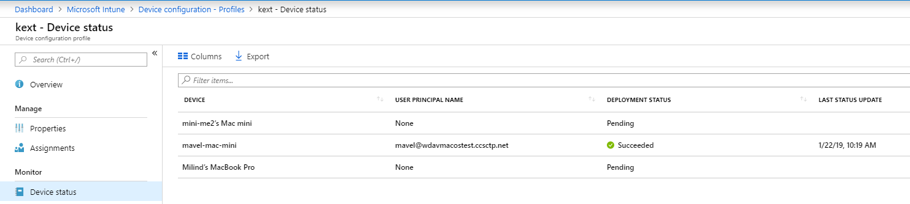

# <a name="intune-based-deployment-for-microsoft-defender-for-endpoint-on-macos"></a>Implementación basada en Intune para Microsoft Defender para endpoint en macOS


[!INCLUDE [Microsoft 365 Defender rebranding](../../includes/microsoft-defender.md)]


> [!NOTE]
> En esta documentación se explica el método heredado para implementar y configurar Microsoft Defender para Endpoint en dispositivos macOS. La experiencia nativa ya está disponible en la consola de MEM. La versión de la interfaz de usuario nativa en la consola de MEM proporciona a los administradores una forma mucho más sencilla de configurar e implementar la aplicación y enviarla a dispositivos macOS. <br> <br>
>La entrada de blog [MEM simplifica la implementación de Microsoft Defender para endpoint para macOS](https://techcommunity.microsoft.com/t5/microsoft-endpoint-manager-blog/microsoft-endpoint-manager-simplifies-deployment-of-microsoft/ba-p/1322995) explica las nuevas características. Para configurar la aplicación, ve a [Configuración de Microsoft Defender para endpoint en macOS en Microsoft InTune](https://docs.microsoft.com/mem/intune/protect/antivirus-microsoft-defender-settings-macos). Para implementar la aplicación, vaya [a Agregar Microsoft Defender para endpoint a dispositivos macOS con Microsoft Intune](https://docs.microsoft.com/mem/intune/apps/apps-advanced-threat-protection-macos).

**Se aplica a:**

- [Microsoft Defender para punto de conexión en macOS](microsoft-defender-endpoint-mac.md)

En este tema se describe cómo implementar Microsoft Defender para Endpoint en macOS a través de Intune. Una implementación correcta requiere la finalización de todos los pasos siguientes:

1. [Descargar paquetes de instalación e incorporación](#download-installation-and-onboarding-packages)
1. [Configuración del dispositivo cliente](#client-device-setup)
1. [Aprobar extensiones del sistema](#approve-system-extensions)
1. [Crear perfiles de configuración del sistema](#create-system-configuration-profiles)
1. [Publicar aplicación](#publish-application)

## <a name="prerequisites-and-system-requirements"></a>Requisitos previos y requisitos del sistema

Antes de empezar, consulta la página principal de Microsoft Defender para Endpoint [en macOS](microsoft-defender-endpoint-mac.md) para obtener una descripción de los requisitos previos y los requisitos del sistema para la versión de software actual.


## <a name="overview"></a>Información general

En la tabla siguiente se resumen los pasos que debe seguir para implementar y administrar Microsoft Defender para Endpoint en Macs, a través de Intune. Los pasos más detallados están disponibles a continuación.

| Paso | Nombres de archivo de ejemplo | BundleIdentifier |
|-|-|-|
| [Descargar paquetes de instalación e incorporación](#download-installation-and-onboarding-packages) | WindowsDefenderATPOnboarding__MDATP_wdav.atp.xml | com.microsoft.wdav.atp |
| [Aprobar extensión del sistema para Microsoft Defender para endpoint](#approve-system-extensions) | MDATP_SysExt.xml | N/D |
| [Aprobar extensión de kernel para Microsoft Defender para endpoint](#download-installation-and-onboarding-packages) | MDATP_KExt.xml | N/D |
| [Conceder acceso en disco completo a Microsoft Defender para endpoint](#create-system-configuration-profiles-step-8) | MDATP_tcc_Catalina_or_newer.xml | com.microsoft.wdav.tcc |
| [Directiva de extensión de red](#create-system-configuration-profiles-step-9) | MDATP_NetExt.xml | N/D |
| [Configurar Microsoft AutoUpdate (MAU)](https://docs.microsoft.com/microsoft-365/security/defender-endpoint/mac-updates#intune) | MDATP_Microsoft_AutoUpdate.xml | com.microsoft.autoupdate2 |
| [Configuración de Microsoft Defender para puntos de conexión](https://docs.microsoft.com/microsoft-365/security/defender-endpoint/mac-preferences#intune-profile-1)<br/><br/> **Nota:** Si está planeando ejecutar un ANTIVIRUS de terceros para macOS, establezca `passiveMode` en `true` . | MDATP_WDAV_and_exclusion_settings_Preferences.xml | com.microsoft.wdav |
| [Configurar Microsoft Defender para notificaciones de punto de conexión y MS AutoUpdate (MAU)](#create-system-configuration-profiles-step-10) | MDATP_MDAV_Tray_and_AutoUpdate2.mobileconfig | com.microsoft.autoupdate2 o com.microsoft.wdav.tray |

## <a name="download-installation-and-onboarding-packages"></a>Descargar paquetes de instalación e incorporación

Descargue los paquetes de instalación e incorporación del Centro de seguridad de Microsoft Defender:

1. En el Centro de seguridad de Microsoft Defender, vaya **a Configuración** Incorporación de  >  **administración de**  >  **dispositivos**.

2. Establezca el sistema operativo en **macOS** y el método de implementación en **Administración de dispositivos móviles / Microsoft Intune**.

    

3. Seleccione **Descargar paquete de instalación**. Guárdelo _como wdav.pkg_ en un directorio local.

4. Seleccione **Descargar paquete de incorporación**. Guárdelo _WindowsDefenderATPOnboardingPackage.zip_ en el mismo directorio.

5. Descargue **IntuneAppUtil** desde [https://docs.microsoft.com/intune/lob-apps-macos](https://docs.microsoft.com/intune/lob-apps-macos) .

6. Desde un símbolo del sistema, compruebe que tiene los tres archivos.
  

    ```bash
    ls -l
    ```

    ```Output
    total 721688
    -rw-r--r--  1 test  staff     269280 Mar 15 11:25 IntuneAppUtil
    -rw-r--r--  1 test  staff      11821 Mar 15 09:23 WindowsDefenderATPOnboardingPackage.zip
    -rw-r--r--  1 test  staff  354531845 Mar 13 08:57 wdav.pkg
    ```
7. Extraiga el contenido de los archivos .zip:

    ```bash
    unzip WindowsDefenderATPOnboardingPackage.zip
    ```
    ```Output
    Archive:  WindowsDefenderATPOnboardingPackage.zip
    warning:  WindowsDefenderATPOnboardingPackage.zip appears to use backslashes as path separators
      inflating: intune/kext.xml
      inflating: intune/WindowsDefenderATPOnboarding.xml
      inflating: jamf/WindowsDefenderATPOnboarding.plist
    ```

8. Convertir IntuneAppUtil en ejecutable:

    ```bash
    chmod +x IntuneAppUtil
    ```

9. Cree el paquete wdav.pkg.intunemac a partir de wdav.pkg:

    ```bash
    ./IntuneAppUtil -c wdav.pkg -o . -i "com.microsoft.wdav" -n "1.0.0"
    ```
    ```Output
    Microsoft Intune Application Utility for Mac OS X
    Version: 1.0.0.0
    Copyright 2018 Microsoft Corporation

    Creating intunemac file for /Users/test/Downloads/wdav.pkg
    Composing the intunemac file output
    Output written to ./wdav.pkg.intunemac.

    IntuneAppUtil successfully processed "wdav.pkg",
    to deploy refer to the product documentation.
    ```

## <a name="client-device-setup"></a>Configuración del dispositivo cliente

No necesita ningún aprovisionamiento especial para un dispositivo Mac más allá de una instalación [estándar del Portal de empresa.](https://docs.microsoft.com/intune-user-help/enroll-your-device-in-intune-macos-cp)

1. Confirme la administración de dispositivos.

   

    Seleccione **Abrir preferencias del sistema,** busque **Perfil de administración** en la lista y seleccione **Aprobar...**. El perfil de administración se mostrará como **Verificado**:

    

2. Seleccione **Continuar** y complete la inscripción.

   Ahora puede inscribir más dispositivos. También puede inscribirlos más adelante, una vez que haya terminado de aprovisionar paquetes de aplicación y configuración del sistema.

3. En Intune, abra **Administrar**  >  **dispositivos**  >  **Todos los dispositivos**. Aquí puedes ver el dispositivo entre los que aparecen en la lista:

   > [!div class="mx-imgBorder"]
   > 

## <a name="approve-system-extensions"></a>Aprobar extensiones del sistema

Para aprobar las extensiones del sistema:

1. En Intune, abra **Administrar configuración**  >  **de dispositivo.** Seleccione **Administrar**  >  **perfiles Crear**  >  **perfil**.

2. Elija un nombre para el perfil. Cambiar **Platform=macOS** a **Profile type=Extensions**. Seleccione **Crear**.

3. En la **pestaña Conceptos** básicos, asigne un nombre a este nuevo perfil.

4. En la **pestaña Configuración,** agregue las siguientes entradas en la **sección Extensiones permitidas del sistema:**

    Identificador de agrupación         | Identificador de equipo
    --------------------------|----------------
    com.microsoft.wdav.epsext | UBF8T346G9
    com.microsoft.wdav.netext | UBF8T346G9

    > [!div class="mx-imgBorder"]
    > 

5. En la **pestaña Asignaciones,** asigne este perfil a **Todos los usuarios & Todos los dispositivos**.

6. Revise y cree este perfil de configuración.

## <a name="create-system-configuration-profiles"></a>Crear perfiles de configuración del sistema

1. En Intune, abra **Administrar configuración**  >  **de dispositivo.** Seleccione **Administrar**  >  **perfiles Crear**  >  **perfil**.

2. Elija un nombre para el perfil. Cambiar **Platform=macOS** a **Profile type=Custom**. Seleccione **Configurar**.

3. Abra el perfil de configuración y cargue intune/kext.xml. Este archivo se creó en una de las secciones anteriores.

4. Seleccione **Aceptar**.

    

5. Seleccione **Administrar**  >  **asignaciones**. En la **pestaña Incluir,** seleccione **Asignar a todos los usuarios & Todos los dispositivos**.

6. Repita los pasos del 1 al 5 para obtener más perfiles.

7. Cree otro perfil, así como un nombre y cargue el archivo intune/WindowsDefenderATPOnboarding.xml.

8. Descargue **fulldisk.mobileconfig** desde nuestro repositorio [de GitHub](https://raw.githubusercontent.com/microsoft/mdatp-xplat/master/macos/mobileconfig/profiles/fulldisk.mobileconfig) y guárdelo como **tcc.xml**. Crear otro perfil, darle cualquier nombre y cargar este archivo en él.<a name="create-system-configuration-profiles-step-8" id = "create-system-configuration-profiles-step-8"></a>

   > [!CAUTION]
   > macOS 10.15 (Catalina) contiene nuevas mejoras de seguridad y privacidad. A partir de esta versión, de forma predeterminada, las aplicaciones no pueden acceder a determinadas ubicaciones del disco (como Documentos, Descargas, Escritorio, etc.) sin consentimiento explícito. En ausencia de este consentimiento, Microsoft Defender para Endpoint no puede proteger completamente el dispositivo.
   >
   > Este perfil de configuración concede acceso en disco completo a Microsoft Defender para endpoint. Si configuró anteriormente Microsoft Defender para Endpoint a través de Intune, se recomienda actualizar la implementación con este perfil de configuración.

9. Como parte de las capacidades de detección y respuesta de puntos de conexión, Microsoft Defender para Endpoint en macOS inspecciona el tráfico de sockets e informa de esta información al portal del Centro de seguridad de Microsoft Defender. La siguiente directiva permite que la extensión de red realice esta funcionalidad. Descargue **netfilter.mobileconfig** desde nuestro repositorio de [GitHub,](https://raw.githubusercontent.com/microsoft/mdatp-xplat/master/macos/mobileconfig/profiles/netfilter.mobileconfig)guárdelo como netext.xml e impleméntelo con los mismos pasos que en las secciones anteriores. <a name = "create-system-configuration-profiles-step-9" id = "create-system-configuration-profiles-step-9"></a>

10. Para permitir que Microsoft Defender para endpoint en macOS y Microsoft Auto Update muestre notificaciones en la interfaz de usuario en macOS 10.15 (Catalina), descargue desde nuestro repositorio `notif.mobileconfig` [de GitHub](https://raw.githubusercontent.com/microsoft/mdatp-xplat/master/macos/mobileconfig/profiles/notif.mobileconfig) e impórtelo como una carga personalizada. <a name = "create-system-configuration-profiles-step-10" id = "create-system-configuration-profiles-step-10"></a>

11. Seleccione **Administrar > asignaciones**.  En la **pestaña Incluir,** seleccione **Asignar a todos los usuarios & Todos los dispositivos**.

Una vez que los cambios de Intune se propaguen a los dispositivos inscritos, puede verlos en **Estado**  >  **del dispositivo de supervisión:**

> [!div class="mx-imgBorder"]
> 

## <a name="publish-application"></a>Publicar aplicación

1. En Intune, abra la hoja **Administrar > aplicaciones cliente.** Seleccione **Aplicaciones > Agregar**.

2. Selecciona **Tipo de aplicación=Otra/Aplicación de línea de negocio.**

3. Seleccione **file=wdav.pkg.intunemac**. Seleccione **Aceptar** para cargar.

4. Seleccione **Configurar** y agregue la información necesaria.

5. Use **macOS High Sierra 10.14** como sistema operativo mínimo.

6. Establece *Omitir versión de la aplicación* en **Sí**. Otras opciones de configuración pueden ser cualquier valor arbitrario.

    > [!CAUTION]
    > Establecer *Omitir versión de la aplicación* en **No** afecta a la capacidad de la aplicación para recibir actualizaciones a través de Microsoft AutoUpdate. Consulte [Deploy updates for Microsoft Defender for Endpoint on macOS](mac-updates.md) para obtener información adicional sobre cómo se actualiza el producto.
    >
    > Si la versión cargada por Intune es inferior a la versión del dispositivo, se instalará la versión inferior, lo que degradará eficazmente Microsoft Defender para Endpoint. Esto podría dar como resultado una aplicación que no funciona. Consulte [Deploy updates for Microsoft Defender for Endpoint on macOS](mac-updates.md) para obtener información adicional sobre cómo se actualiza el producto. Si implementaste Microsoft Defender para endpoint con *ignorar la* versión de la aplicación establecida en **No,** cámbiese a **Sí**. Si Microsoft Defender para endpoint aún no se puede instalar en un dispositivo cliente, desinstala Microsoft Defender para Endpoint e inserta la directiva actualizada.
     
    > [!div class="mx-imgBorder"]
    > 

7. Seleccione **Aceptar** y **Agregar**.

    > [!div class="mx-imgBorder"]
    > 

8. Puede tardar unos minutos en cargar el paquete. Una vez terminado, seleccione el paquete de la lista y vaya a **Asignaciones** y **Agregar grupo**.

    > [!div class="mx-imgBorder"]
    > 

9. Cambie **el tipo de asignación** a **Obligatorio**.

10. Seleccione **Grupos incluidos**. Selecciona **Hacer que esta aplicación sea necesaria para todos los dispositivos=Sí**. Seleccione **Seleccionar grupo para incluir y** agregar un grupo que contenga los usuarios a los que desea dirigirse. Seleccione **Aceptar** y **Guardar**.

    > [!div class="mx-imgBorder"]
    > 

11. Después de algún tiempo, la aplicación se publicará en todos los dispositivos inscritos. Puedes verlo en Monitor  >  **Device**, en **Estado de instalación del dispositivo:**

    > [!div class="mx-imgBorder"]
    > 

## <a name="verify-client-device-state"></a>Comprobar el estado del dispositivo cliente

1. Después de implementar los perfiles de configuración en los dispositivos, abre **Perfiles** de  >  **preferencias del sistema** en tu dispositivo Mac.

    <br/>
    

2. Compruebe que los siguientes perfiles de configuración están presentes e instalados. El **perfil de administración** debe ser el perfil del sistema de Intune. _Wdav-config y_ _wdav-kext_ son perfiles de configuración del sistema que se agregaron en Intune: Captura de pantalla 

3. También debería ver el icono de Microsoft Defender en la esquina superior derecha:

    > [!div class="mx-imgBorder"]
    > 

## <a name="troubleshooting"></a>Solución de problemas

Problema: no se encontró ninguna licencia

Solución: siga los pasos anteriores para crear un perfil de dispositivo con WindowsDefenderATPOnboarding.xml

## <a name="logging-installation-issues"></a>Problemas de instalación de registro

Para obtener más información sobre cómo encontrar el registro generado automáticamente que crea el instalador cuando se produce un error, vea [Logging installation issues](mac-resources.md#logging-installation-issues).

## <a name="uninstallation"></a>Desinstalación

Consulta [Desinstalar para obtener](mac-resources.md#uninstalling) más información sobre cómo quitar Microsoft Defender para Endpoint en macOS de los dispositivos cliente.
