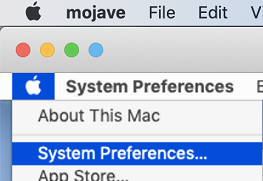

# <a name="intune-based-deployment-for-microsoft-defender-for-endpoint-on-macos"></a>Implementación basada en Intune para Microsoft Defender para endpoint en macOS

[!INCLUDE [Microsoft 365 Defender rebranding](../../includes/microsoft-defender.md)]

**Se aplica a:**

- [Microsoft Defender para punto de conexión en macOS](microsoft-defender-endpoint-mac.md)

En este tema se describe cómo implementar Microsoft Defender para Endpoint en macOS a través de Intune. Una implementación correcta requiere la finalización de todos los pasos siguientes:

1. [Descargar el paquete de incorporación](#download-the-onboarding-package)
1. [Configuración del dispositivo cliente](#client-device-setup)
1. [Aprobar extensiones del sistema](#approve-system-extensions)
1. [Crear perfiles de configuración del sistema](#create-system-configuration-profiles)
1. [Publicar aplicación](#publish-application)

## <a name="prerequisites-and-system-requirements"></a>Requisitos previos y requisitos del sistema

Antes de empezar, consulta la página principal de Microsoft Defender para Endpoint [en macOS](microsoft-defender-endpoint-mac.md) para obtener una descripción de los requisitos previos y los requisitos del sistema para la versión de software actual.

## <a name="overview"></a>Información general

En la tabla siguiente se resumen los pasos que debe seguir para implementar y administrar Microsoft Defender para Endpoint en Macs, a través de Intune. Los pasos más detallados están disponibles a continuación.

| Paso | Nombres de archivo de ejemplo | BundleIdentifier |
|-|-|-|
| [Descargar el paquete de incorporación](#download-the-onboarding-package) | WindowsDefenderATPOnboarding__MDATP_wdav.atp.xml | com.microsoft.wdav.atp |
| [Aprobar extensión del sistema para Microsoft Defender para endpoint](#approve-system-extensions) | MDATP_SysExt.xml | N/D |
| [Aprobar extensión de kernel para Microsoft Defender para endpoint](#download-the-onboarding-package) | MDATP_KExt.xml | N/D |
| [Conceder acceso en disco completo a Microsoft Defender para endpoint](#full-disk-access) | MDATP_tcc_Catalina_or_newer.xml | com.microsoft.wdav.tcc |
| [Directiva de extensión de red](#network-filter) | MDATP_NetExt.xml | N/D |
| [Configurar Microsoft AutoUpdate (MAU)](mac-updates.md#intune) | MDATP_Microsoft_AutoUpdate.xml | com.microsoft.autoupdate2 |
| [Configuración de Microsoft Defender para puntos de conexión](mac-preferences.md#intune-profile-1)<br/><br/> **Nota:** Si está planeando ejecutar un ANTIVIRUS de terceros para macOS, establezca `passiveMode` en `true` . | MDATP_WDAV_and_exclusion_settings_Preferences.xml | com.microsoft.wdav |
| [Configurar Microsoft Defender para notificaciones de punto de conexión y MS AutoUpdate (MAU)](mac-updates.md) | MDATP_MDAV_Tray_and_AutoUpdate2.mobileconfig | com.microsoft.autoupdate2 o com.microsoft.wdav.tray |


## <a name="download-the-onboarding-package"></a>Descargar el paquete de incorporación

Descargue los paquetes de incorporación desde Centro de seguridad de Microsoft Defender:

1. En Centro de seguridad de Microsoft Defender, vaya **a Configuración** Incorporación de  >  **administración de**  >  **dispositivos**.

2. Establezca el sistema operativo en **macOS** y el método de implementación en Administración de dispositivos móviles **/ Microsoft Intune**.

    

3. Seleccione **Descargar paquete de incorporación**. Guárdelo _WindowsDefenderATPOnboardingPackage.zip_ en el mismo directorio.

4. Extraiga el contenido del .zip archivo:

    ```bash
    unzip WindowsDefenderATPOnboardingPackage.zip
    ```
    ```Output
    Archive:  WindowsDefenderATPOnboardingPackage.zip
    warning:  WindowsDefenderATPOnboardingPackage.zip appears to use backslashes as path separators
      inflating: intune/kext.xml
      inflating: intune/WindowsDefenderATPOnboarding.xml
      inflating: jamf/WindowsDefenderATPOnboarding.plist
    ```

## <a name="create-system-configuration-profiles"></a>Crear perfiles de configuración del sistema

El siguiente paso es crear perfiles de configuración del sistema que Necesita Microsoft Defender para endpoint.
En el [Centro Microsoft Endpoint Manager administración,](https://endpoint.microsoft.com/)abra **Perfiles de** configuración de  >  **dispositivos**.

### <a name="onboarding-blob"></a>Blob de incorporación

Este perfil contiene una información de licencia para Microsoft Defender para Endpoint, sin que informe de que no tiene licencia.

1. Seleccione **Crear perfil en** **Perfiles de configuración**.
1. Seleccione **Plataforma** = **macOS**, Tipo de perfil  = **Plantillas**. **Nombre de plantilla** = **Personalizado**. Haga clic en **Crear**.

    > [!div class="mx-imgBorder"]
    > 

1. Elija un nombre para el perfil, por ejemplo, "MDATP incorporación para macOS". Haga clic en **Siguiente**.

    > [!div class="mx-imgBorder"]
    > 

1. Elija un nombre para el nombre del perfil de configuración, por ejemplo, "MDATP incorporación para macOS".
1. Seleccione intune/WindowsDefenderATPOnboarding.xml que extrajo del paquete de incorporación anterior como archivo de perfil de configuración.

    > [!div class="mx-imgBorder"]
    > 

1. Haga clic en **Siguiente**.
1. Asignar dispositivos en la **pestaña** Asignación. Haga clic **en Siguiente**.

    > [!div class="mx-imgBorder"]
    > 

1. Revisar y **crear**.
1. Abra   >  **perfiles de configuración de dispositivos,** puede ver el perfil creado allí.

    > [!div class="mx-imgBorder"]
    > 

### <a name="approve-system-extensions"></a>Aprobar extensiones del sistema

Este perfil es necesario para macOS 10.15 (Catalina) o posterior. Se omitirá en macOS antiguos.

1. Seleccione **Crear perfil en** **Perfiles de configuración**.
1. Seleccione **Plataforma** = **macOS**, Tipo de perfil  = **Plantillas**. **Nombre de plantilla** = **Extensiones**. Haga clic en **Crear**.
1. En la **pestaña Conceptos** básicos, asigne un nombre a este nuevo perfil.
1. En la **pestaña Configuración,** expanda **Extensiones del sistema** agregue las siguientes entradas en la sección Extensiones **permitidas del** sistema:

    Identificador de agrupación         | Identificador de equipo
    --------------------------|----------------
    com.microsoft.wdav.epsext | UBF8T346G9
    com.microsoft.wdav.netext | UBF8T346G9

    > [!div class="mx-imgBorder"]
    > 

1. En la **pestaña Asignaciones,** asigne este perfil a **Todos los usuarios & Todos los dispositivos**.
1. Revise y cree este perfil de configuración.

### <a name="kernel-extensions"></a>Extensiones de kernel

Este perfil es necesario para macOS 10.15 (Catalina) o versiones anteriores. Se omitirá en macOS más reciente.

> [!CAUTION]
> Los dispositivos Apple Silicon (M1) no son compatibles con KEXT. La instalación de un perfil de configuración que consta de directivas KEXT producirá un error en estos dispositivos.

1. Seleccione **Crear perfil en** **Perfiles de configuración**.
1. Seleccione **Plataforma** = **macOS**, Tipo de perfil  = **Plantillas**. **Nombre de plantilla** = **Extensiones**. Haga clic en **Crear**.
1. En la **pestaña Conceptos** básicos, asigne un nombre a este nuevo perfil.
1. En la **pestaña Configuración,** expanda **Extensiones de kernel**.
1. Establezca **el identificador de** equipo en **UBF8T346G9** y haga clic en **Siguiente**.

    > [!div class="mx-imgBorder"]
    > 

1. En la **pestaña Asignaciones,** asigne este perfil a **Todos los usuarios & Todos los dispositivos**.
1. Revise y cree este perfil de configuración.

### <a name="full-disk-access"></a>Acceso en disco completo

   > [!CAUTION]
   > macOS 10.15 (Catalina) contiene nuevas mejoras de seguridad y privacidad. A partir de esta versión, de forma predeterminada, las aplicaciones no pueden acceder a determinadas ubicaciones del disco (como Documentos, Descargas, Escritorio, etc.) sin consentimiento explícito. En ausencia de este consentimiento, Microsoft Defender para Endpoint no puede proteger completamente el dispositivo.
   >
   > Este perfil de configuración concede acceso en disco completo a Microsoft Defender para endpoint. Si configuró anteriormente Microsoft Defender para Endpoint a través de Intune, se recomienda actualizar la implementación con este perfil de configuración.

Descargue [**fulldisk.mobileconfig**](https://raw.githubusercontent.com/microsoft/mdatp-xplat/master/macos/mobileconfig/profiles/fulldisk.mobileconfig) desde [nuestro repositorio GitHub archivo](https://github.com/microsoft/mdatp-xplat/tree/master/macos/mobileconfig/profiles).

Siga las instrucciones para incorporar [blobs](#onboarding-blob) desde arriba, usando "MDATP Full Disk Access" como nombre de perfil y **descargado fulldisk.mobileconfig** como nombre de perfil de configuración.

### <a name="network-filter"></a>Filtro de red

Como parte de las capacidades de detección y respuesta de puntos de conexión, Microsoft Defender para endpoint en macOS inspecciona el tráfico de sockets e informa de esta información al portal Centro de seguridad de Microsoft Defender web. La siguiente directiva permite que la extensión de red realice esta funcionalidad.

Descargue [**netfilter.mobileconfig**](https://raw.githubusercontent.com/microsoft/mdatp-xplat/master/macos/mobileconfig/profiles/netfilter.mobileconfig) desde [nuestro GitHub de archivos](https://github.com/microsoft/mdatp-xplat/tree/master/macos/mobileconfig/profiles).

Siga las instrucciones para incorporar [blobs](#onboarding-blob) desde arriba, usando "MDATP Network Filter" como nombre de perfil y **descargado netfilter.mobileconfig** como nombre de perfil de configuración.

### <a name="notifications"></a>Notificaciones

Este perfil se usa para permitir que Microsoft Defender para Endpoint en macOS y Microsoft Auto Update muestren notificaciones en la interfaz de usuario en macOS 10.15 (Catalina) o versiones posteriores.

Descargue [**notif.mobileconfig**](https://raw.githubusercontent.com/microsoft/mdatp-xplat/master/macos/mobileconfig/profiles/notif.mobileconfig) desde [nuestro repositorio GitHub archivo](https://github.com/microsoft/mdatp-xplat/tree/master/macos/mobileconfig/profiles).

Siga las instrucciones para incorporar [blobs](#onboarding-blob) desde arriba, usando "MDATP Network Filter" como nombre de perfil y descargado **notif.mobileconfig** como nombre de perfil de configuración.

### <a name="view-status"></a>Ver estado

Una vez que los cambios de Intune se propaguen a los dispositivos inscritos, puede verlos en **Estado**  >  **del dispositivo de supervisión:**

> [!div class="mx-imgBorder"]
> 

## <a name="publish-application"></a>Publicar aplicación

Este paso permite implementar Microsoft Defender para Endpoint en equipos inscritos.

1. En el [Centro Microsoft Endpoint Manager administración,](https://endpoint.microsoft.com/)abra **Aplicaciones**.

    > [!div class="mx-imgBorder"]
    > 

1. Seleccione Por plataforma > macOS > Agregar.
1. Elija **Tipo de** aplicación = **macOS**, haga clic en **Seleccionar**.

    > [!div class="mx-imgBorder"]
    > 

1. Mantenga los valores predeterminados, haga clic **en Siguiente**.

    > [!div class="mx-imgBorder"]
    > 

1. Agregar asignaciones, haga clic en **Siguiente**.

    > [!div class="mx-imgBorder"]
    > 

1. Revisar y **crear**.
1. Puedes visitar **Aplicaciones**  >  **por plataforma**  >  **macOS** para verlo en la lista de todas las aplicaciones.

    > [!div class="mx-imgBorder"]
    > 

(Puede encontrar información detallada en la página de Intune para la implementación [de Defender](/mem/intune/apps/apps-advanced-threat-protection-macos)).)

   > [!CAUTION]
   > Debe crear todos los perfiles de configuración necesarios e insertarlos en todas las máquinas, como se explicó anteriormente.

## <a name="client-device-setup"></a>Configuración del dispositivo cliente

No necesitas ningún aprovisionamiento especial para un dispositivo Mac más allá de una instalación [Portal de empresa estándar.](/intune-user-help/enroll-your-device-in-intune-macos-cp)

1. Confirme la administración de dispositivos.

    > [!div class="mx-imgBorder"]
    > 

    Seleccione **Abrir preferencias del sistema,** busque **Perfil de administración** en la lista y seleccione **Aprobar...**. El perfil de administración se mostrará como **Verificado**:

    

2. Seleccione **Continuar** y complete la inscripción.

   Ahora puede inscribir más dispositivos. También puede inscribirlos más adelante, una vez que haya terminado de aprovisionar paquetes de aplicación y configuración del sistema.

3. En Intune, abra **Administrar**  >  **dispositivos**  >  **Todos los dispositivos**. Aquí puedes ver el dispositivo entre los que aparecen en la lista:

   > [!div class="mx-imgBorder"]
   > 

## <a name="verify-client-device-state"></a>Comprobar el estado del dispositivo cliente

1. Después de implementar los perfiles de configuración en los dispositivos, abre **Perfiles** de  >  **preferencias del sistema** en tu dispositivo Mac.

    > [!div class="mx-imgBorder"]
    > 

    

2. Compruebe que los siguientes perfiles de configuración están presentes e instalados. El **perfil de administración** debe ser el perfil del sistema de Intune. _Wdav-config y_ _wdav-kext_ son perfiles de configuración del sistema que se agregaron en Intune:

    

3. También debería ver el icono de Microsoft Defender para endpoint en la esquina superior derecha:

    > [!div class="mx-imgBorder"]
    > 

## <a name="troubleshooting"></a>Solución de problemas

Problema: no se encontró ninguna licencia.

Solución: siga los pasos anteriores para crear un perfil de dispositivo mediante WindowsDefenderATPOnboarding.xml.

## <a name="logging-installation-issues"></a>Problemas de instalación de registro

Para obtener más información sobre cómo encontrar el registro generado automáticamente que crea el instalador cuando se produce un error, vea [Logging installation issues](mac-resources.md#logging-installation-issues).

## <a name="uninstallation"></a>Desinstalación

Consulta [Desinstalar para obtener](mac-resources.md#uninstalling) más información sobre cómo quitar Microsoft Defender para Endpoint en macOS de los dispositivos cliente.
