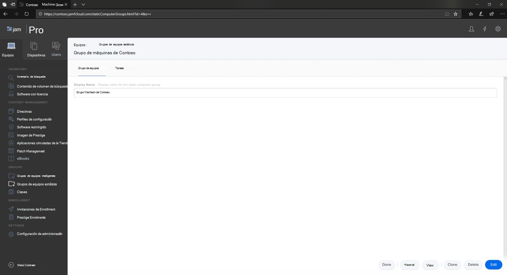
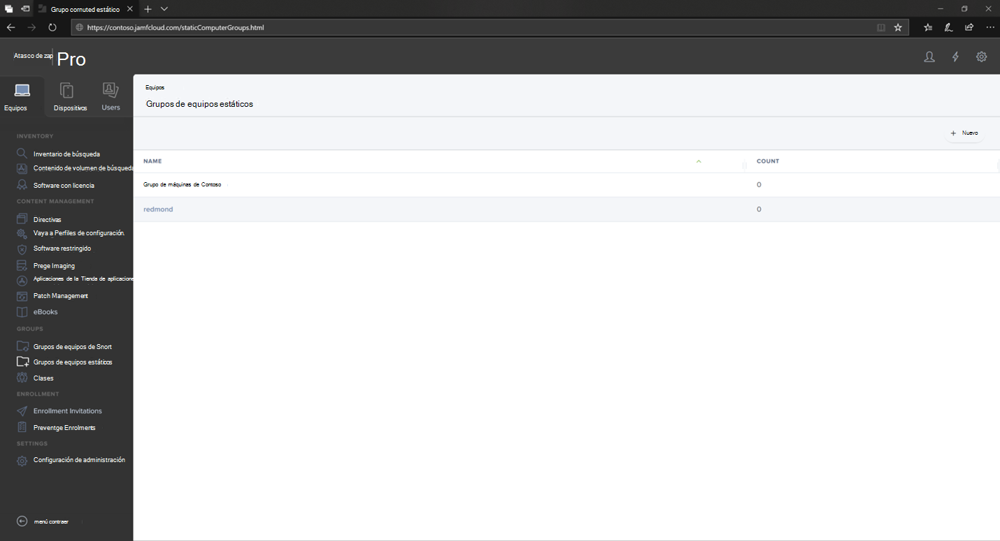

# Configurar Microsoft Defender para endpoint en grupos de dispositivos macOS en Jamf ProSet up Microsoft Defender for Endpoint on macOS device groups in Jamf Pro

[!INCLUDE [Microsoft 365 Defender rebranding](../../includes/microsoft-defender.md)]

**Se aplica a:****Applies to:**
- [Microsoft Defender para punto de conexiónMicrosoft Defender for Endpoint](https://go.microsoft.com/fwlink/p/?linkid=2154037)
- [Microsoft 365 DefenderMicrosoft 365 Defender](https://go.microsoft.com/fwlink/?linkid=2118804)

> ¿Desea experimentar Defender for Endpoint?Want to experience Defender for Endpoint? [Regístrate para obtener una versión de prueba gratuita.Sign up for a free trial.](https://www.microsoft.com/microsoft-365/windows/microsoft-defender-atp?ocid=docs-wdatp-investigateip-abovefoldlink)

Configure los grupos de dispositivos de forma similar a la organización de directivas de grupo unirse (UNIDADES), la colección de dispositivos de Microsoft Endpoint Configuration Manager y los grupos de dispositivos de Intune.Set up the device groups similar to Group policy  organizational unite (OUs), Microsoft Endpoint Configuration Manager's device collection, and Intune's device groups.

1. Vaya a **Grupos de equipos estáticos**.Navigate to **Static Computer Groups**.

2. Seleccione **Nuevo**.Select **New**. 

    

3. Proporcione un nombre para mostrar y seleccione **Guardar**.Provide a display name and select **Save**.

    

4. Ahora verá el grupo de máquinas **de Contoso en** Grupos de equipos **estáticos**.Now you will see the **Contoso's Machine Group** under **Static Computer Groups**.

    

## Paso siguienteNext step
- [Configurar Microsoft Defender para endpoint en directivas de macOS en Jamf ProSet up Microsoft Defender for Endpoint on macOS policies in Jamf Pro](mac-jamfpro-policies.md)
