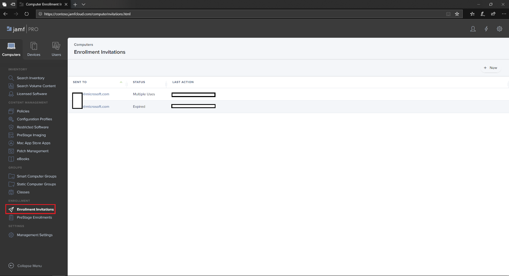

# Inscribir Microsoft Defender para endpoint en dispositivos macOS en Jamf Pro 

[!INCLUDE [Microsoft 365 Defender rebranding](../../includes/microsoft-defender.md)]

**Se aplica a:**
- [Microsoft Defender para punto de conexión](https://go.microsoft.com/fwlink/p/?linkid=2154037)
- [Microsoft 365 Defender](https://go.microsoft.com/fwlink/?linkid=2118804)

> ¿Desea experimentar Defender for Endpoint? [Regístrate para obtener una versión de prueba gratuita.](https://www.microsoft.com/microsoft-365/windows/microsoft-defender-atp?ocid=docs-wdatp-investigateip-abovefoldlink)

## Inscribir dispositivos macOS

Existen varios métodos para inscribirse en JamF.

Este artículo le guiará en dos métodos:

- [Método 1: Invitaciones de inscripción](#enrollment-method-1-enrollment-invitations)
- [Método 2: Inscripción de prestage](#enrollment-method-2-prestage-enrollments)

Para obtener una lista completa, vea [About Computer Enrollment](https://docs.jamf.com/9.9/casper-suite/administrator-guide/About_Computer_Enrollment.html).

## Método de inscripción 1: Invitaciones de inscripción

1. En el panel de Jamf Pro, vaya a **Invitaciones de inscripción**.

    

2. Seleccione **+ Nuevo**.

    

3. En **Especificar destinatarios para la lista** de > en Direcciones de correo electrónico, escriba las direcciones de correo electrónico de los destinatarios. 

    

    

    Por ejemplo: janedoe@contoso.com

    

4. Configure el mensaje de la invitación.

    

    

    

    

## Método enrollment 2: Prestage Enrollments

1. En el panel de Jamf Pro, vaya a **Prestage enrollments**.

    

2. Siga las instrucciones de [Computer PreStage Enrollments](https://docs.jamf.com/9.9/casper-suite/administrator-guide/Computer_PreStage_Enrollments.html).

## Inscribir dispositivo macOS

1. Seleccione **Continuar** e instale el certificado de ca desde una **ventana preferencias del** sistema.

    

2. Una vez instalado el certificado de entidad de certificación, vuelva a la ventana del explorador y seleccione **Continuar** e instale el perfil mdm. 

    

3. Selecciona **Permitir** descargas desde JAMF.

    

4. Selecciona **Continuar** para continuar con la instalación del perfil MDM. 

    

5. Selecciona **Continuar** para instalar el perfil mdm.

    

6. Seleccione **Continuar**  para completar la configuración. 

    
