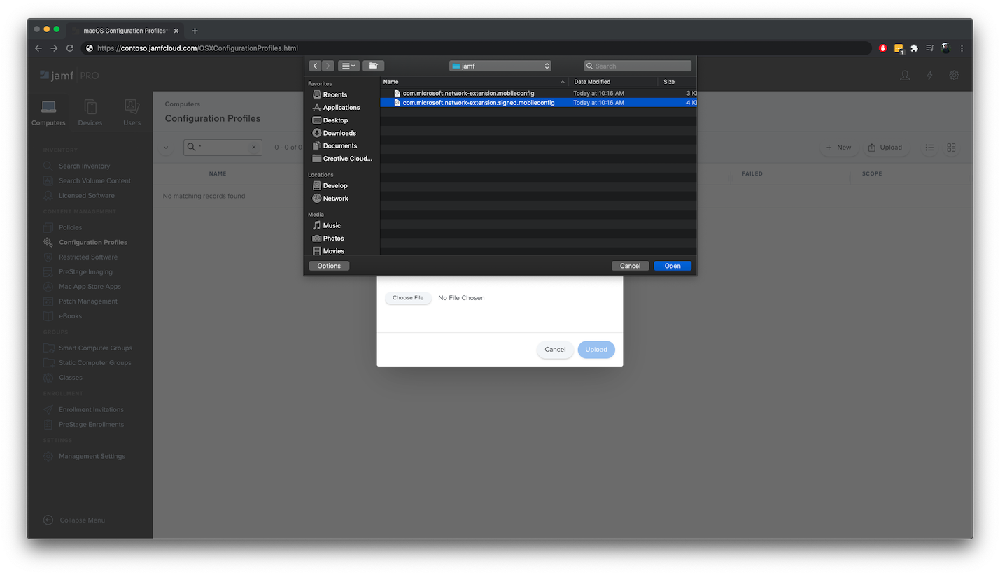

# <a name="set-up-the-microsoft-defender-for-endpoint-for-macos-policies-in-jamf-pro"></a><span data-ttu-id="9a11d-104">Configurar Microsoft Defender para endpoint para directivas de macOS en Jamf Pro</span><span class="sxs-lookup"><span data-stu-id="9a11d-104">Set up the Microsoft Defender for Endpoint for macOS policies in Jamf Pro</span></span>

[!INCLUDE [Microsoft 365 Defender rebranding](../../includes/microsoft-defender.md)]


<span data-ttu-id="9a11d-105">**Se aplica a:**</span><span class="sxs-lookup"><span data-stu-id="9a11d-105">**Applies to:**</span></span>

- [<span data-ttu-id="9a11d-106">Defender para Endpoint para Mac</span><span class="sxs-lookup"><span data-stu-id="9a11d-106">Defender for Endpoint for Mac</span></span>](microsoft-defender-endpoint-mac.md)

<span data-ttu-id="9a11d-107">Esta página le guiará a través de los pasos que debe seguir para configurar directivas de macOS en Jamf Pro.</span><span class="sxs-lookup"><span data-stu-id="9a11d-107">This page will guide you through the steps you need to take to set up macOS policies in Jamf Pro.</span></span>

<span data-ttu-id="9a11d-108">Deberá seguir los pasos siguientes:</span><span class="sxs-lookup"><span data-stu-id="9a11d-108">You'll need to take the following steps:</span></span>

1. [<span data-ttu-id="9a11d-109">Obtener el paquete de incorporación de Microsoft Defender para endpoint</span><span class="sxs-lookup"><span data-stu-id="9a11d-109">Get the Microsoft Defender for Endpoint onboarding package</span></span>](#step-1-get-the-microsoft-defender-for-endpoint-onboarding-package)

2. [<span data-ttu-id="9a11d-110">Crear un perfil de configuración en Jamf Pro con el paquete de incorporación</span><span class="sxs-lookup"><span data-stu-id="9a11d-110">Create a configuration profile in Jamf Pro using the onboarding package</span></span>](#step-2-create-a-configuration-profile-in-jamf-pro-using-the-onboarding-package)

3. [<span data-ttu-id="9a11d-111">Configurar Microsoft Defender para la configuración del punto de conexión</span><span class="sxs-lookup"><span data-stu-id="9a11d-111">Configure Microsoft Defender for Endpoint settings</span></span>](#step-3-configure-microsoft-defender-for-endpoint-settings)

4. [<span data-ttu-id="9a11d-112">Configurar Microsoft Defender para la configuración de notificación de extremo</span><span class="sxs-lookup"><span data-stu-id="9a11d-112">Configure Microsoft Defender for Endpoint notification settings</span></span>](#step-4-configure-notifications-settings)

5. [<span data-ttu-id="9a11d-113">Configurar Microsoft AutoUpdate (MAU)</span><span class="sxs-lookup"><span data-stu-id="9a11d-113">Configure Microsoft AutoUpdate (MAU)</span></span>](#step-5-configure-microsoft-autoupdate-mau)

6. [<span data-ttu-id="9a11d-114">Conceder acceso en disco completo a Microsoft Defender para endpoint</span><span class="sxs-lookup"><span data-stu-id="9a11d-114">Grant full disk access to Microsoft Defender for Endpoint</span></span>](#step-6-grant-full-disk-access-to-microsoft-defender-for-endpoint)

7. [<span data-ttu-id="9a11d-115">Aprobar extensión de kernel para Microsoft Defender para endpoint</span><span class="sxs-lookup"><span data-stu-id="9a11d-115">Approve Kernel extension for Microsoft Defender for Endpoint</span></span>](#step-7-approve-kernel-extension-for-microsoft-defender-for-endpoint)

8. [<span data-ttu-id="9a11d-116">Aprobar extensiones del sistema para Microsoft Defender para endpoint</span><span class="sxs-lookup"><span data-stu-id="9a11d-116">Approve System extensions for Microsoft Defender for Endpoint</span></span>](#step-8-approve-system-extensions-for-microsoft-defender-for-endpoint)

9. [<span data-ttu-id="9a11d-117">Configurar extensión de red</span><span class="sxs-lookup"><span data-stu-id="9a11d-117">Configure Network Extension</span></span>](#step-9-configure-network-extension)

10. [<span data-ttu-id="9a11d-118">Programar exámenes con Microsoft Defender para endpoint para Mac</span><span class="sxs-lookup"><span data-stu-id="9a11d-118">Schedule scans with Microsoft Defender for Endpoint for Mac</span></span>](https://docs.microsoft.com/windows/security/threat-protection/microsoft-defender-atp/mac-schedule-scan-atp)

11. [<span data-ttu-id="9a11d-119">Implementar Microsoft Defender para endpoint para macOS</span><span class="sxs-lookup"><span data-stu-id="9a11d-119">Deploy Microsoft Defender for Endpoint for macOS</span></span>](#step-11-deploy-microsoft-defender-for-endpoint-for-macos)


## <a name="step-1-get-the-microsoft-defender-for-endpoint-onboarding-package"></a><span data-ttu-id="9a11d-120">Paso 1: Obtener el paquete de incorporación de Microsoft Defender para endpoint</span><span class="sxs-lookup"><span data-stu-id="9a11d-120">Step 1: Get the Microsoft Defender for Endpoint onboarding package</span></span>

1. <span data-ttu-id="9a11d-121">En [el Centro de seguridad de Microsoft Defender,](https://securitycenter.microsoft.com )vaya a Configuración > **incorporación**.</span><span class="sxs-lookup"><span data-stu-id="9a11d-121">In [Microsoft Defender Security Center](https://securitycenter.microsoft.com ), navigate to **Settings > Onboarding**.</span></span> 

2. <span data-ttu-id="9a11d-122">Seleccione macOS como sistema operativo y Administración de dispositivos móviles /Microsoft Intune como método de implementación.</span><span class="sxs-lookup"><span data-stu-id="9a11d-122">Select macOS as the operating system and Mobile Device Management / Microsoft Intune as the deployment method.</span></span>

    

3. <span data-ttu-id="9a11d-124">Seleccione **Descargar paquete de incorporación** (WindowsDefenderATPOnboardingPackage.zip).</span><span class="sxs-lookup"><span data-stu-id="9a11d-124">Select **Download onboarding package** (WindowsDefenderATPOnboardingPackage.zip).</span></span>

4. <span data-ttu-id="9a11d-125">Extraer `WindowsDefenderATPOnboardingPackage.zip` .</span><span class="sxs-lookup"><span data-stu-id="9a11d-125">Extract `WindowsDefenderATPOnboardingPackage.zip`.</span></span>

5. <span data-ttu-id="9a11d-126">Copie el archivo en su ubicación preferida.</span><span class="sxs-lookup"><span data-stu-id="9a11d-126">Copy the file to your preferred location.</span></span> <span data-ttu-id="9a11d-127">Por ejemplo, `C:\Users\JaneDoe_or_JohnDoe.contoso\Downloads\WindowsDefenderATPOnboardingPackage_macOS_MDM_contoso\jamf\WindowsDefenderATPOnboarding.plist`.</span><span class="sxs-lookup"><span data-stu-id="9a11d-127">For example,  `C:\Users\JaneDoe_or_JohnDoe.contoso\Downloads\WindowsDefenderATPOnboardingPackage_macOS_MDM_contoso\jamf\WindowsDefenderATPOnboarding.plist`.</span></span>


## <a name="step-2-create-a-configuration-profile-in-jamf-pro-using-the-onboarding-package"></a><span data-ttu-id="9a11d-128">Paso 2: Crear un perfil de configuración en Jamf Pro con el paquete de incorporación</span><span class="sxs-lookup"><span data-stu-id="9a11d-128">Step 2: Create a configuration profile in Jamf Pro using the onboarding package</span></span>

1. <span data-ttu-id="9a11d-129">Busque el archivo `WindowsDefenderATPOnboarding.plist` de la sección anterior.</span><span class="sxs-lookup"><span data-stu-id="9a11d-129">Locate the file `WindowsDefenderATPOnboarding.plist` from the previous section.</span></span>

   

 
2. <span data-ttu-id="9a11d-131">En el panel de Jamf Pro, seleccione **Nuevo**.</span><span class="sxs-lookup"><span data-stu-id="9a11d-131">In the Jamf Pro dashboard, select **New**.</span></span>

    

3. <span data-ttu-id="9a11d-133">Escriba los siguientes detalles:</span><span class="sxs-lookup"><span data-stu-id="9a11d-133">Enter the following details:</span></span>

   <span data-ttu-id="9a11d-134">**General**</span><span class="sxs-lookup"><span data-stu-id="9a11d-134">**General**</span></span>
   - <span data-ttu-id="9a11d-135">Nombre: incorporación de MDATP para macOS</span><span class="sxs-lookup"><span data-stu-id="9a11d-135">Name: MDATP onboarding for macOS</span></span>
   - <span data-ttu-id="9a11d-136">Descripción: incorporación de MDATP EDR para macOS</span><span class="sxs-lookup"><span data-stu-id="9a11d-136">Description: MDATP EDR onboarding for macOS</span></span>
   - <span data-ttu-id="9a11d-137">Categoría: Ninguna</span><span class="sxs-lookup"><span data-stu-id="9a11d-137">Category: None</span></span>
   - <span data-ttu-id="9a11d-138">Método distribution: Install Automatically</span><span class="sxs-lookup"><span data-stu-id="9a11d-138">Distribution Method: Install Automatically</span></span>
   - <span data-ttu-id="9a11d-139">Nivel: Nivel de equipo</span><span class="sxs-lookup"><span data-stu-id="9a11d-139">Level: Computer Level</span></span>

4. <span data-ttu-id="9a11d-140">En **Configuración & configuración personalizada,** seleccione **Configurar**.</span><span class="sxs-lookup"><span data-stu-id="9a11d-140">In **Application & Custom Settings** select **Configure**.</span></span>

    

5. <span data-ttu-id="9a11d-142">Seleccione **Cargar archivo (archivo PLIST) y,** a continuación, en **Dominio de preferencia** escriba: `com.microsoft.wdav.atp` .</span><span class="sxs-lookup"><span data-stu-id="9a11d-142">Select **Upload File (PLIST file)** then in **Preference Domain** enter: `com.microsoft.wdav.atp`.</span></span> 

    

    

7. <span data-ttu-id="9a11d-145">Seleccione **Abrir** y seleccione el archivo de incorporación.</span><span class="sxs-lookup"><span data-stu-id="9a11d-145">Select **Open** and select the onboarding file.</span></span>

    

8. <span data-ttu-id="9a11d-147">Seleccione **Cargar**.</span><span class="sxs-lookup"><span data-stu-id="9a11d-147">Select **Upload**.</span></span> 

    


9. <span data-ttu-id="9a11d-149">Seleccione la **pestaña** Ámbito.</span><span class="sxs-lookup"><span data-stu-id="9a11d-149">Select the **Scope** tab.</span></span>

    

10. <span data-ttu-id="9a11d-151">Seleccione los equipos de destino.</span><span class="sxs-lookup"><span data-stu-id="9a11d-151">Select the target computers.</span></span>

    

     

11. <span data-ttu-id="9a11d-154">Seleccione **Guardar**.</span><span class="sxs-lookup"><span data-stu-id="9a11d-154">Select **Save**.</span></span>

    

    

12. <span data-ttu-id="9a11d-157">Seleccione **Listo**.</span><span class="sxs-lookup"><span data-stu-id="9a11d-157">Select **Done**.</span></span>

    

    

## <a name="step-3-configure-microsoft-defender-for-endpoint-settings"></a><span data-ttu-id="9a11d-160">Paso 3: Configurar Microsoft Defender para la configuración del punto de conexión</span><span class="sxs-lookup"><span data-stu-id="9a11d-160">Step 3: Configure Microsoft Defender for Endpoint settings</span></span>

1.  <span data-ttu-id="9a11d-161">Use las siguientes opciones de configuración de Microsoft Defender para puntos de conexión:</span><span class="sxs-lookup"><span data-stu-id="9a11d-161">Use the following Microsoft Defender for Endpoint configuration settings:</span></span>

    - <span data-ttu-id="9a11d-162">enableRealTimeProtection</span><span class="sxs-lookup"><span data-stu-id="9a11d-162">enableRealTimeProtection</span></span>
    - <span data-ttu-id="9a11d-163">passiveMode</span><span class="sxs-lookup"><span data-stu-id="9a11d-163">passiveMode</span></span>
    
    >[!NOTE]
    ><span data-ttu-id="9a11d-164">No activado de forma predeterminada, si está planeando ejecutar un ANTIVIRUS de terceros para macOS, estafórlo en `true` .</span><span class="sxs-lookup"><span data-stu-id="9a11d-164">Not turned on by default, if you are planning to run a third-party AV for macOS, set it to `true`.</span></span>

    - <span data-ttu-id="9a11d-165">exclusiones</span><span class="sxs-lookup"><span data-stu-id="9a11d-165">exclusions</span></span>
    - <span data-ttu-id="9a11d-166">excludedPath</span><span class="sxs-lookup"><span data-stu-id="9a11d-166">excludedPath</span></span>
    - <span data-ttu-id="9a11d-167">excludedFileExtension</span><span class="sxs-lookup"><span data-stu-id="9a11d-167">excludedFileExtension</span></span>
    - <span data-ttu-id="9a11d-168">excludedFileName</span><span class="sxs-lookup"><span data-stu-id="9a11d-168">excludedFileName</span></span>
    - <span data-ttu-id="9a11d-169">exclusionsMergePolicy</span><span class="sxs-lookup"><span data-stu-id="9a11d-169">exclusionsMergePolicy</span></span>
    - <span data-ttu-id="9a11d-170">allowedThreats</span><span class="sxs-lookup"><span data-stu-id="9a11d-170">allowedThreats</span></span>
    
    >[!NOTE]
    ><span data-ttu-id="9a11d-171">EICAR está en la muestra, si está pasando por una prueba de concepto, quítela especialmente si está probando EICAR.</span><span class="sxs-lookup"><span data-stu-id="9a11d-171">EICAR is on the sample, if you are going through a proof-of-concept, remove it especially if you are testing EICAR.</span></span>
        
    - <span data-ttu-id="9a11d-172">disallowedThreatActions</span><span class="sxs-lookup"><span data-stu-id="9a11d-172">disallowedThreatActions</span></span>
    - <span data-ttu-id="9a11d-173">potentially_unwanted_application</span><span class="sxs-lookup"><span data-stu-id="9a11d-173">potentially_unwanted_application</span></span>
    - <span data-ttu-id="9a11d-174">archive_bomb</span><span class="sxs-lookup"><span data-stu-id="9a11d-174">archive_bomb</span></span>
    - <span data-ttu-id="9a11d-175">cloudService</span><span class="sxs-lookup"><span data-stu-id="9a11d-175">cloudService</span></span>
    - <span data-ttu-id="9a11d-176">automaticSampleSubmission</span><span class="sxs-lookup"><span data-stu-id="9a11d-176">automaticSampleSubmission</span></span>
    - <span data-ttu-id="9a11d-177">tags</span><span class="sxs-lookup"><span data-stu-id="9a11d-177">tags</span></span>
    - <span data-ttu-id="9a11d-178">hideStatusMenuIcon</span><span class="sxs-lookup"><span data-stu-id="9a11d-178">hideStatusMenuIcon</span></span>
    
     <span data-ttu-id="9a11d-179">Para obtener información, vea [Lista de propiedades para el perfil de configuración de Jamf](mac-preferences.md#property-list-for-jamf-configuration-profile).</span><span class="sxs-lookup"><span data-stu-id="9a11d-179">For information, see [Property list for Jamf configuration profile](mac-preferences.md#property-list-for-jamf-configuration-profile).</span></span>

     ```XML
     <?xml version="1.0" encoding="UTF-8"?>
     <!DOCTYPE plist PUBLIC "-//Apple//DTD PLIST 1.0//EN" "http://www.apple.com/DTDs/PropertyList-1.0.dtd">
     <plist version="1.0">
     <dict>
         <key>antivirusEngine</key>
         <dict>
             <key>enableRealTimeProtection</key>
             <true/>
             <key>passiveMode</key>
             <false/>
             <key>exclusions</key>
             <array>
                 <dict>
                     <key>$type</key>
                     <string>excludedPath</string>
                     <key>isDirectory</key>
                     <false/>
                     <key>path</key>
                     <string>/var/log/system.log</string>
                 </dict>
                 <dict>
                     <key>$type</key>
                     <string>excludedPath</string>
                     <key>isDirectory</key>
                     <true/>
                     <key>path</key>
                     <string>/home</string>
                 </dict>
                 <dict>
                     <key>$type</key>
                     <string>excludedFileExtension</string>
                     <key>extension</key>
                     <string>pdf</string>
                 </dict>
                 <dict>
                     <key>$type</key>
                     <string>excludedFileName</string>
                     <key>name</key>
                     <string>cat</string>
                 </dict>
             </array>
             <key>exclusionsMergePolicy</key>
             <string>merge</string>
             <key>allowedThreats</key>
             <array>
                 <string>EICAR-Test-File (not a virus)</string>
             </array>
             <key>disallowedThreatActions</key>
             <array>
                 <string>allow</string>
                 <string>restore</string>
             </array>
             <key>threatTypeSettings</key>
             <array>
                 <dict>
                     <key>key</key>
                     <string>potentially_unwanted_application</string>
                     <key>value</key>
                     <string>block</string>
                 </dict>
                 <dict>
                     <key>key</key>
                     <string>archive_bomb</string>
                     <key>value</key>
                     <string>audit</string>
                 </dict>
             </array>
             <key>threatTypeSettingsMergePolicy</key>
             <string>merge</string>
         </dict>
         <key>cloudService</key>
         <dict>
             <key>enabled</key>
             <true/>
             <key>diagnosticLevel</key>
             <string>optional</string>
             <key>automaticSampleSubmission</key>
             <true/>
         </dict>
         <key>edr</key>
         <dict>
             <key>tags</key>
             <array>
                 <dict>
                     <key>key</key>
                     <string>GROUP</string>
                     <key>value</key>
                     <string>ExampleTag</string>
                 </dict>
             </array>
         </dict>
         <key>userInterface</key>
         <dict>
             <key>hideStatusMenuIcon</key>
             <false/>
         </dict>
     </dict>
     </plist>
     ```

2. <span data-ttu-id="9a11d-180">Guarde el archivo como `MDATP_MDAV_configuration_settings.plist` .</span><span class="sxs-lookup"><span data-stu-id="9a11d-180">Save the file as `MDATP_MDAV_configuration_settings.plist`.</span></span>


3.  <span data-ttu-id="9a11d-181">En el panel de Jamf Pro, seleccione **General**.</span><span class="sxs-lookup"><span data-stu-id="9a11d-181">In the Jamf Pro dashboard, select **General**.</span></span>

    

4. <span data-ttu-id="9a11d-183">Escriba los siguientes detalles:</span><span class="sxs-lookup"><span data-stu-id="9a11d-183">Enter the following details:</span></span>

    <span data-ttu-id="9a11d-184">**General**</span><span class="sxs-lookup"><span data-stu-id="9a11d-184">**General**</span></span>
    
    - <span data-ttu-id="9a11d-185">Nombre: opciones de configuración de MDATP MDAV</span><span class="sxs-lookup"><span data-stu-id="9a11d-185">Name: MDATP MDAV configuration settings</span></span>
    - <span data-ttu-id="9a11d-186">Descripción:\<blank\></span><span class="sxs-lookup"><span data-stu-id="9a11d-186">Description:\<blank\></span></span>
    - <span data-ttu-id="9a11d-187">Categoría: Ninguno (predeterminado)</span><span class="sxs-lookup"><span data-stu-id="9a11d-187">Category: None (default)</span></span>
    - <span data-ttu-id="9a11d-188">Método distribution: Install Automatically (default)</span><span class="sxs-lookup"><span data-stu-id="9a11d-188">Distribution Method: Install Automatically(default)</span></span>
    - <span data-ttu-id="9a11d-189">Nivel: Nivel del equipo (predeterminado)</span><span class="sxs-lookup"><span data-stu-id="9a11d-189">Level: Computer Level(default)</span></span>

    

5. <span data-ttu-id="9a11d-191">En **Configuración & configuración personalizada,** seleccione **Configurar**.</span><span class="sxs-lookup"><span data-stu-id="9a11d-191">In **Application & Custom Settings** select **Configure**.</span></span>

    

6. <span data-ttu-id="9a11d-193">Seleccione **Cargar archivo (archivo PLIST).**</span><span class="sxs-lookup"><span data-stu-id="9a11d-193">Select **Upload File (PLIST file)**.</span></span>

    

7. <span data-ttu-id="9a11d-195">En **Dominio de preferencias,** escriba `com.microsoft.wdav` y, a continuación,  **seleccione Cargar archivo PLIST**.</span><span class="sxs-lookup"><span data-stu-id="9a11d-195">In **Preferences Domain**, enter `com.microsoft.wdav`, then select  **Upload PLIST File**.</span></span>

    

8. <span data-ttu-id="9a11d-197">Seleccione **Elegir archivo**.</span><span class="sxs-lookup"><span data-stu-id="9a11d-197">Select **Choose File**.</span></span>

    

9. <span data-ttu-id="9a11d-199">Seleccione el **MDATP_MDAV_configuration_settings.plist** y, a continuación, **seleccione Abrir**.</span><span class="sxs-lookup"><span data-stu-id="9a11d-199">Select the **MDATP_MDAV_configuration_settings.plist**, then select **Open**.</span></span>

    

10. <span data-ttu-id="9a11d-201">Seleccione **Cargar**.</span><span class="sxs-lookup"><span data-stu-id="9a11d-201">Select **Upload**.</span></span>

    

    

    >[!NOTE]
    ><span data-ttu-id="9a11d-204">Si se carga el archivo de Intune, se producirá el siguiente error:</span><span class="sxs-lookup"><span data-stu-id="9a11d-204">If you happen to upload the Intune file, you'll get the following error:</span></span><br>
    ><span data-ttu-id="9a11d-205"></span><span class="sxs-lookup"><span data-stu-id="9a11d-205"></span></span>


11. <span data-ttu-id="9a11d-206">Seleccione **Guardar**.</span><span class="sxs-lookup"><span data-stu-id="9a11d-206">Select **Save**.</span></span> 

    

12. <span data-ttu-id="9a11d-208">El archivo se carga.</span><span class="sxs-lookup"><span data-stu-id="9a11d-208">The file is uploaded.</span></span>

    

    

13. <span data-ttu-id="9a11d-211">Seleccione la **pestaña** Ámbito.</span><span class="sxs-lookup"><span data-stu-id="9a11d-211">Select the **Scope** tab.</span></span>

    

14. <span data-ttu-id="9a11d-213">Seleccione **Grupo de máquinas de Contoso**.</span><span class="sxs-lookup"><span data-stu-id="9a11d-213">Select **Contoso's Machine Group**.</span></span> 

15. <span data-ttu-id="9a11d-214">Seleccione **Agregar** y, a continuación, **seleccione Guardar**.</span><span class="sxs-lookup"><span data-stu-id="9a11d-214">Select **Add**, then select **Save**.</span></span>

    

    

16. <span data-ttu-id="9a11d-217">Seleccione **Listo**.</span><span class="sxs-lookup"><span data-stu-id="9a11d-217">Select **Done**.</span></span> <span data-ttu-id="9a11d-218">Verá el nuevo perfil **de configuración**.</span><span class="sxs-lookup"><span data-stu-id="9a11d-218">You'll see the new **Configuration profile**.</span></span>

    


## <a name="step-4-configure-notifications-settings"></a><span data-ttu-id="9a11d-220">Paso 4: Configurar la configuración de notificaciones</span><span class="sxs-lookup"><span data-stu-id="9a11d-220">Step 4: Configure notifications settings</span></span>

<span data-ttu-id="9a11d-221">Estos pasos son aplicables a macOS 10.15 (Catalina) o versiones posteriores.</span><span class="sxs-lookup"><span data-stu-id="9a11d-221">These steps are applicable of macOS 10.15 (Catalina) or newer.</span></span>

1. <span data-ttu-id="9a11d-222">Descargar `notif.mobileconfig` desde nuestro repositorio de [GitHub](https://raw.githubusercontent.com/microsoft/mdatp-xplat/master/macos/mobileconfig/profiles/notif.mobileconfig)</span><span class="sxs-lookup"><span data-stu-id="9a11d-222">Download `notif.mobileconfig` from [our GitHub repository](https://raw.githubusercontent.com/microsoft/mdatp-xplat/master/macos/mobileconfig/profiles/notif.mobileconfig)</span></span>

2. <span data-ttu-id="9a11d-223">Guárdelo como `MDATP_MDAV_notification_settings.plist` .</span><span class="sxs-lookup"><span data-stu-id="9a11d-223">Save it as `MDATP_MDAV_notification_settings.plist`.</span></span>

3. <span data-ttu-id="9a11d-224">En el panel de Jamf Pro, seleccione **General**.</span><span class="sxs-lookup"><span data-stu-id="9a11d-224">In the Jamf Pro dashboard, select **General**.</span></span> 
       
4. <span data-ttu-id="9a11d-225">Escriba los siguientes detalles:</span><span class="sxs-lookup"><span data-stu-id="9a11d-225">Enter the following details:</span></span>

    <span data-ttu-id="9a11d-226">**General**</span><span class="sxs-lookup"><span data-stu-id="9a11d-226">**General**</span></span> 
    
    - <span data-ttu-id="9a11d-227">Nombre: configuración de notificación MDATP MDAV</span><span class="sxs-lookup"><span data-stu-id="9a11d-227">Name: MDATP MDAV Notification settings</span></span>
    - <span data-ttu-id="9a11d-228">Descripción: macOS 10.15 (Catalina) o posterior</span><span class="sxs-lookup"><span data-stu-id="9a11d-228">Description: macOS 10.15 (Catalina) or newer</span></span>
    - <span data-ttu-id="9a11d-229">Categoría: Ninguno (predeterminado)</span><span class="sxs-lookup"><span data-stu-id="9a11d-229">Category: None (default)</span></span>
    - <span data-ttu-id="9a11d-230">Método distribution: Install Automatically (default)</span><span class="sxs-lookup"><span data-stu-id="9a11d-230">Distribution Method: Install Automatically(default)</span></span>
    - <span data-ttu-id="9a11d-231">Nivel: Nivel del equipo (predeterminado)</span><span class="sxs-lookup"><span data-stu-id="9a11d-231">Level: Computer Level(default)</span></span>

    


5. <span data-ttu-id="9a11d-233">Seleccione **Cargar archivo (archivo PLIST).**</span><span class="sxs-lookup"><span data-stu-id="9a11d-233">Select **Upload File (PLIST file)**.</span></span>

    
 

6. <span data-ttu-id="9a11d-235">Seleccione **Elegir archivo**  >  **MDATP_MDAV_Notification_Settings.plist**.</span><span class="sxs-lookup"><span data-stu-id="9a11d-235">Select **Choose File** > **MDATP_MDAV_Notification_Settings.plist**.</span></span>


    


    

7. <span data-ttu-id="9a11d-238">Seleccione **Abrir**  >  **cargar**.</span><span class="sxs-lookup"><span data-stu-id="9a11d-238">Select **Open** > **Upload**.</span></span>

    


    

8. <span data-ttu-id="9a11d-241">Seleccione la **pestaña Ámbito** y, a continuación, **seleccione Agregar**.</span><span class="sxs-lookup"><span data-stu-id="9a11d-241">Select the **Scope** tab, then select **Add**.</span></span>

    


9. <span data-ttu-id="9a11d-243">Seleccione **Grupo de máquinas de Contoso**.</span><span class="sxs-lookup"><span data-stu-id="9a11d-243">Select **Contoso's Machine Group**.</span></span> 

10. <span data-ttu-id="9a11d-244">Seleccione **Agregar** y, a continuación, **seleccione Guardar**.</span><span class="sxs-lookup"><span data-stu-id="9a11d-244">Select **Add**, then select **Save**.</span></span>
    
    

    
    

11. <span data-ttu-id="9a11d-247">Seleccione **Listo**.</span><span class="sxs-lookup"><span data-stu-id="9a11d-247">Select **Done**.</span></span> <span data-ttu-id="9a11d-248">Verá el nuevo perfil **de configuración**.</span><span class="sxs-lookup"><span data-stu-id="9a11d-248">You'll see the new **Configuration profile**.</span></span>
    <span data-ttu-id="9a11d-249"></span><span class="sxs-lookup"><span data-stu-id="9a11d-249"></span></span>

## <a name="step-5-configure-microsoft-autoupdate-mau"></a><span data-ttu-id="9a11d-250">Paso 5: Configurar Microsoft AutoUpdate (MAU)</span><span class="sxs-lookup"><span data-stu-id="9a11d-250">Step 5: Configure Microsoft AutoUpdate (MAU)</span></span>

1. <span data-ttu-id="9a11d-251">Use las siguientes opciones de configuración de Microsoft Defender para puntos de conexión:</span><span class="sxs-lookup"><span data-stu-id="9a11d-251">Use the following Microsoft Defender for Endpoint configuration settings:</span></span>

      ```XML
   <?xml version="1.0" encoding="UTF-8"?>
   <!DOCTYPE plist PUBLIC "-//Apple//DTD PLIST 1.0//EN" "http://www.apple.com/DTDs/PropertyList-1.0.dtd">
   <plist version="1.0">
   <dict>
    <key>ChannelName</key>
    <string>Current</string>
    <key>HowToCheck</key>
    <string>AutomaticDownload</string>
    <key>EnableCheckForUpdatesButton</key>
    <true/>
    <key>DisableInsiderCheckbox</key>
    <false/>
    <key>SendAllTelemetryEnabled</key>
    <true/>
   </dict>
   </plist>
   ```

2. <span data-ttu-id="9a11d-252">Guárdelo como `MDATP_MDAV_MAU_settings.plist` .</span><span class="sxs-lookup"><span data-stu-id="9a11d-252">Save it as `MDATP_MDAV_MAU_settings.plist`.</span></span>

3. <span data-ttu-id="9a11d-253">En el panel de Jamf Pro, seleccione **General**.</span><span class="sxs-lookup"><span data-stu-id="9a11d-253">In the Jamf Pro dashboard, select **General**.</span></span> 

    

4. <span data-ttu-id="9a11d-255">Escriba los siguientes detalles:</span><span class="sxs-lookup"><span data-stu-id="9a11d-255">Enter the following details:</span></span>

    <span data-ttu-id="9a11d-256">**General**</span><span class="sxs-lookup"><span data-stu-id="9a11d-256">**General**</span></span> 
    
    - <span data-ttu-id="9a11d-257">Nombre: configuración de MDATP MDAV MAU</span><span class="sxs-lookup"><span data-stu-id="9a11d-257">Name: MDATP MDAV MAU settings</span></span>
    - <span data-ttu-id="9a11d-258">Descripción: Configuración de Microsoft AutoUpdate para MDATP para macOS</span><span class="sxs-lookup"><span data-stu-id="9a11d-258">Description: Microsoft AutoUpdate settings for MDATP for macOS</span></span>
    - <span data-ttu-id="9a11d-259">Categoría: Ninguno (predeterminado)</span><span class="sxs-lookup"><span data-stu-id="9a11d-259">Category: None (default)</span></span>
    - <span data-ttu-id="9a11d-260">Método distribution: Install Automatically (default)</span><span class="sxs-lookup"><span data-stu-id="9a11d-260">Distribution Method: Install Automatically(default)</span></span>
    - <span data-ttu-id="9a11d-261">Nivel: Nivel del equipo (predeterminado)</span><span class="sxs-lookup"><span data-stu-id="9a11d-261">Level: Computer Level(default)</span></span>

5. <span data-ttu-id="9a11d-262">En **Configuración & configuración personalizada,** seleccione **Configurar**.</span><span class="sxs-lookup"><span data-stu-id="9a11d-262">In **Application & Custom Settings** select **Configure**.</span></span>

    

6. <span data-ttu-id="9a11d-264">Seleccione **Cargar archivo (archivo PLIST).**</span><span class="sxs-lookup"><span data-stu-id="9a11d-264">Select **Upload File (PLIST file)**.</span></span>

      

7. <span data-ttu-id="9a11d-266">En **Dominio de preferencia** escriba: , luego seleccione Cargar archivo `com.microsoft.autoupdate2` **PLIST**.</span><span class="sxs-lookup"><span data-stu-id="9a11d-266">In **Preference Domain** enter: `com.microsoft.autoupdate2`, then select **Upload PLIST File**.</span></span>

    

8. <span data-ttu-id="9a11d-268">Seleccione **Elegir archivo**.</span><span class="sxs-lookup"><span data-stu-id="9a11d-268">Select **Choose File**.</span></span>

    

9. <span data-ttu-id="9a11d-270">Seleccione **MDATP_MDAV_MAU_settings.plist**.</span><span class="sxs-lookup"><span data-stu-id="9a11d-270">Select **MDATP_MDAV_MAU_settings.plist**.</span></span>

    

10. <span data-ttu-id="9a11d-272">Seleccione **Cargar**.</span><span class="sxs-lookup"><span data-stu-id="9a11d-272">Select **Upload**.</span></span>
    <span data-ttu-id="9a11d-273"></span><span class="sxs-lookup"><span data-stu-id="9a11d-273"></span></span>

    

11. <span data-ttu-id="9a11d-275">Seleccione **Guardar**.</span><span class="sxs-lookup"><span data-stu-id="9a11d-275">Select **Save**.</span></span>

    

12. <span data-ttu-id="9a11d-277">Seleccione la **pestaña** Ámbito.</span><span class="sxs-lookup"><span data-stu-id="9a11d-277">Select the **Scope** tab.</span></span>
   
     

13. <span data-ttu-id="9a11d-279">Seleccione **Agregar**.</span><span class="sxs-lookup"><span data-stu-id="9a11d-279">Select **Add**.</span></span>
    
    

    

    

14. <span data-ttu-id="9a11d-283">Seleccione **Listo**.</span><span class="sxs-lookup"><span data-stu-id="9a11d-283">Select **Done**.</span></span>
    
    

## <a name="step-6-grant-full-disk-access-to-microsoft-defender-for-endpoint"></a><span data-ttu-id="9a11d-285">Paso 6: Conceder acceso en disco completo a Microsoft Defender para endpoint</span><span class="sxs-lookup"><span data-stu-id="9a11d-285">Step 6: Grant full disk access to Microsoft Defender for Endpoint</span></span>

1. <span data-ttu-id="9a11d-286">En el panel de Jamf Pro, seleccione **Perfiles de configuración**.</span><span class="sxs-lookup"><span data-stu-id="9a11d-286">In the Jamf Pro dashboard, select **Configuration Profiles**.</span></span>

    

2. <span data-ttu-id="9a11d-288">Seleccione **+ Nuevo**.</span><span class="sxs-lookup"><span data-stu-id="9a11d-288">Select **+ New**.</span></span> 

3. <span data-ttu-id="9a11d-289">Escriba los siguientes detalles:</span><span class="sxs-lookup"><span data-stu-id="9a11d-289">Enter the following details:</span></span>

    <span data-ttu-id="9a11d-290">**General**</span><span class="sxs-lookup"><span data-stu-id="9a11d-290">**General**</span></span> 
    - <span data-ttu-id="9a11d-291">Nombre: MDATP MDAV: conceder acceso en disco completo a EDR y AV</span><span class="sxs-lookup"><span data-stu-id="9a11d-291">Name: MDATP MDAV - grant Full Disk Access to EDR and AV</span></span>
    - <span data-ttu-id="9a11d-292">Descripción: en macOS Catalina o versiones posteriores, el nuevo control de directiva de preferencias de privacidad</span><span class="sxs-lookup"><span data-stu-id="9a11d-292">Description: On macOS Catalina or newer, the new Privacy Preferences Policy Control</span></span>
    - <span data-ttu-id="9a11d-293">Categoría: Ninguna</span><span class="sxs-lookup"><span data-stu-id="9a11d-293">Category: None</span></span>
    - <span data-ttu-id="9a11d-294">Método de distribución: Instalar automáticamente</span><span class="sxs-lookup"><span data-stu-id="9a11d-294">Distribution method: Install Automatically</span></span>
    - <span data-ttu-id="9a11d-295">Nivel: nivel de equipo</span><span class="sxs-lookup"><span data-stu-id="9a11d-295">Level: Computer level</span></span>


    

4. <span data-ttu-id="9a11d-297">En **Configurar el control de directiva de preferencias de privacidad,** seleccione **Configurar**.</span><span class="sxs-lookup"><span data-stu-id="9a11d-297">In **Configure Privacy Preferences Policy Control** select **Configure**.</span></span>

    

5. <span data-ttu-id="9a11d-299">En **Control de directiva de preferencias de** privacidad, escriba los siguientes detalles:</span><span class="sxs-lookup"><span data-stu-id="9a11d-299">In **Privacy Preferences Policy Control**, enter the following details:</span></span>

    - <span data-ttu-id="9a11d-300">Identificador: `com.microsoft.wdav`</span><span class="sxs-lookup"><span data-stu-id="9a11d-300">Identifier: `com.microsoft.wdav`</span></span>
    - <span data-ttu-id="9a11d-301">Tipo de identificador: Id. de agrupación</span><span class="sxs-lookup"><span data-stu-id="9a11d-301">Identifier Type: Bundle ID</span></span>
    - <span data-ttu-id="9a11d-302">Requisito de código: `identifier "com.microsoft.wdav" and anchor apple generic and certificate 1[field.1.2.840.113635.100.6.2.6] /* exists */ and certificate leaf[field.1.2.840.113635.100.6.1.13] /* exists */ and certificate leaf[subject.OU] = UBF8T346G9`</span><span class="sxs-lookup"><span data-stu-id="9a11d-302">Code Requirement: `identifier "com.microsoft.wdav" and anchor apple generic and certificate 1[field.1.2.840.113635.100.6.2.6] /* exists */ and certificate leaf[field.1.2.840.113635.100.6.1.13] /* exists */ and certificate leaf[subject.OU] = UBF8T346G9`</span></span>


    

6. <span data-ttu-id="9a11d-304">Seleccione **+ Agregar**.</span><span class="sxs-lookup"><span data-stu-id="9a11d-304">Select **+ Add**.</span></span>

    

    - <span data-ttu-id="9a11d-306">En Aplicación o servicio: Establecer en **SystemPolicyAllFiles**</span><span class="sxs-lookup"><span data-stu-id="9a11d-306">Under App or service: Set to **SystemPolicyAllFiles**</span></span>

    - <span data-ttu-id="9a11d-307">En "access": Set to **Allow**</span><span class="sxs-lookup"><span data-stu-id="9a11d-307">Under "access": Set to **Allow**</span></span>

7. <span data-ttu-id="9a11d-308">Seleccione **Guardar** (no el que se encuentra en la parte inferior derecha).</span><span class="sxs-lookup"><span data-stu-id="9a11d-308">Select **Save** (not the one at the bottom right).</span></span>

    

8. <span data-ttu-id="9a11d-310">Haga clic `+` en el signo situado junto a App **Access** para agregar una nueva entrada.</span><span class="sxs-lookup"><span data-stu-id="9a11d-310">Click the `+` sign next to **App Access** to add a new entry.</span></span>

    

9. <span data-ttu-id="9a11d-312">Escriba los siguientes detalles:</span><span class="sxs-lookup"><span data-stu-id="9a11d-312">Enter the following details:</span></span>

    - <span data-ttu-id="9a11d-313">Identificador: `com.microsoft.wdav.epsext`</span><span class="sxs-lookup"><span data-stu-id="9a11d-313">Identifier: `com.microsoft.wdav.epsext`</span></span>
    - <span data-ttu-id="9a11d-314">Tipo de identificador: Id. de agrupación</span><span class="sxs-lookup"><span data-stu-id="9a11d-314">Identifier Type: Bundle ID</span></span>
    - <span data-ttu-id="9a11d-315">Requisito de código: `identifier "com.microsoft.wdav.epsext" and anchor apple generic and certificate 1[field.1.2.840.113635.100.6.2.6] /* exists */ and certificate leaf[field.1.2.840.113635.100.6.1.13] /* exists */ and certificate leaf[subject.OU] = UBF8T346G9`</span><span class="sxs-lookup"><span data-stu-id="9a11d-315">Code Requirement: `identifier "com.microsoft.wdav.epsext" and anchor apple generic and certificate 1[field.1.2.840.113635.100.6.2.6] /* exists */ and certificate leaf[field.1.2.840.113635.100.6.1.13] /* exists */ and certificate leaf[subject.OU] = UBF8T346G9`</span></span>

10. <span data-ttu-id="9a11d-316">Seleccione **+ Agregar**.</span><span class="sxs-lookup"><span data-stu-id="9a11d-316">Select **+ Add**.</span></span>

    

    - <span data-ttu-id="9a11d-318">En Aplicación o servicio: Establecer en **SystemPolicyAllFiles**</span><span class="sxs-lookup"><span data-stu-id="9a11d-318">Under App or service: Set to **SystemPolicyAllFiles**</span></span>

    - <span data-ttu-id="9a11d-319">En "access": Set to **Allow**</span><span class="sxs-lookup"><span data-stu-id="9a11d-319">Under "access": Set to **Allow**</span></span>

11. <span data-ttu-id="9a11d-320">Seleccione **Guardar** (no el que se encuentra en la parte inferior derecha).</span><span class="sxs-lookup"><span data-stu-id="9a11d-320">Select **Save** (not the one at the bottom right).</span></span>

    

12. <span data-ttu-id="9a11d-322">Seleccione la **pestaña** Ámbito.</span><span class="sxs-lookup"><span data-stu-id="9a11d-322">Select the **Scope** tab.</span></span>

    

13. <span data-ttu-id="9a11d-324">Seleccione **+ Agregar**.</span><span class="sxs-lookup"><span data-stu-id="9a11d-324">Select **+ Add**.</span></span>

    

14. <span data-ttu-id="9a11d-326">Seleccione **Grupos de** equipos > en Nombre **de** grupo > seleccione **MachineGroup de Contoso**.</span><span class="sxs-lookup"><span data-stu-id="9a11d-326">Select **Computer Groups** > under **Group Name** > select **Contoso's MachineGroup**.</span></span> 

    

15. <span data-ttu-id="9a11d-328">Seleccione **Agregar**.</span><span class="sxs-lookup"><span data-stu-id="9a11d-328">Select **Add**.</span></span> 

16. <span data-ttu-id="9a11d-329">Seleccione **Guardar**.</span><span class="sxs-lookup"><span data-stu-id="9a11d-329">Select **Save**.</span></span> 
    
17. <span data-ttu-id="9a11d-330">Seleccione **Listo**.</span><span class="sxs-lookup"><span data-stu-id="9a11d-330">Select **Done**.</span></span>
    
    
    
    


## <a name="step-7-approve-kernel-extension-for-microsoft-defender-for-endpoint"></a><span data-ttu-id="9a11d-333">Paso 7: Aprobar extensión de kernel para Microsoft Defender para endpoint</span><span class="sxs-lookup"><span data-stu-id="9a11d-333">Step 7: Approve Kernel extension for Microsoft Defender for Endpoint</span></span>

1. <span data-ttu-id="9a11d-334">En **perfiles de configuración,** seleccione **+ Nuevo**.</span><span class="sxs-lookup"><span data-stu-id="9a11d-334">In the **Configuration Profiles**, select **+ New**.</span></span>

    

2. <span data-ttu-id="9a11d-336">Escriba los siguientes detalles:</span><span class="sxs-lookup"><span data-stu-id="9a11d-336">Enter the following details:</span></span>

    <span data-ttu-id="9a11d-337">**General**</span><span class="sxs-lookup"><span data-stu-id="9a11d-337">**General**</span></span> 
    
    - <span data-ttu-id="9a11d-338">Nombre: MDATP MDAV Kernel Extension</span><span class="sxs-lookup"><span data-stu-id="9a11d-338">Name: MDATP MDAV Kernel Extension</span></span>
    - <span data-ttu-id="9a11d-339">Descripción: extensión de kernel MDATP (kext)</span><span class="sxs-lookup"><span data-stu-id="9a11d-339">Description: MDATP kernel extension (kext)</span></span>
    - <span data-ttu-id="9a11d-340">Categoría: Ninguna</span><span class="sxs-lookup"><span data-stu-id="9a11d-340">Category: None</span></span>
    - <span data-ttu-id="9a11d-341">Método distribution: Install Automatically</span><span class="sxs-lookup"><span data-stu-id="9a11d-341">Distribution Method: Install Automatically</span></span>
    - <span data-ttu-id="9a11d-342">Nivel: Nivel de equipo</span><span class="sxs-lookup"><span data-stu-id="9a11d-342">Level: Computer Level</span></span>

    

3. <span data-ttu-id="9a11d-344">En **Configurar extensiones de kernel aprobadas,** seleccione **Configurar**.</span><span class="sxs-lookup"><span data-stu-id="9a11d-344">In **Configure Approved Kernel Extensions** select **Configure**.</span></span>

    

   
4. <span data-ttu-id="9a11d-346">En **Extensiones de kernel aprobadas,** escriba los siguientes detalles:</span><span class="sxs-lookup"><span data-stu-id="9a11d-346">In **Approved Kernel Extensions** Enter the following details:</span></span>

    - <span data-ttu-id="9a11d-347">Nombre para mostrar: Microsoft Corp.</span><span class="sxs-lookup"><span data-stu-id="9a11d-347">Display Name: Microsoft Corp.</span></span>
    - <span data-ttu-id="9a11d-348">Id. de equipo: UBF8T346G9</span><span class="sxs-lookup"><span data-stu-id="9a11d-348">Team ID: UBF8T346G9</span></span>

    

5. <span data-ttu-id="9a11d-350">Seleccione la **pestaña** Ámbito.</span><span class="sxs-lookup"><span data-stu-id="9a11d-350">Select the **Scope** tab.</span></span>

    

6. <span data-ttu-id="9a11d-352">Seleccione **+ Agregar**.</span><span class="sxs-lookup"><span data-stu-id="9a11d-352">Select **+ Add**.</span></span>

7. <span data-ttu-id="9a11d-353">Seleccione **Grupos de** equipos > en Nombre **de** grupo > seleccione Grupo de máquinas **de Contoso**.</span><span class="sxs-lookup"><span data-stu-id="9a11d-353">Select **Computer Groups** > under **Group Name** > select **Contoso's Machine Group**.</span></span>

8. <span data-ttu-id="9a11d-354">Seleccione **+ Agregar**.</span><span class="sxs-lookup"><span data-stu-id="9a11d-354">Select **+ Add**.</span></span>

    

9. <span data-ttu-id="9a11d-356">Seleccione **Guardar**.</span><span class="sxs-lookup"><span data-stu-id="9a11d-356">Select **Save**.</span></span>

    

10. <span data-ttu-id="9a11d-358">Seleccione **Listo**.</span><span class="sxs-lookup"><span data-stu-id="9a11d-358">Select **Done**.</span></span>

    


## <a name="step-8-approve-system-extensions-for-microsoft-defender-for-endpoint"></a><span data-ttu-id="9a11d-360">Paso 8: Aprobar extensiones de sistema para Microsoft Defender para endpoint</span><span class="sxs-lookup"><span data-stu-id="9a11d-360">Step 8: Approve System extensions for Microsoft Defender for Endpoint</span></span>

1. <span data-ttu-id="9a11d-361">En **perfiles de configuración,** seleccione **+ Nuevo**.</span><span class="sxs-lookup"><span data-stu-id="9a11d-361">In the **Configuration Profiles**, select **+ New**.</span></span>

    

2. <span data-ttu-id="9a11d-363">Escriba los siguientes detalles:</span><span class="sxs-lookup"><span data-stu-id="9a11d-363">Enter the following details:</span></span>

    <span data-ttu-id="9a11d-364">**General**</span><span class="sxs-lookup"><span data-stu-id="9a11d-364">**General**</span></span>
    
    - <span data-ttu-id="9a11d-365">Nombre: MDATP MDAV System Extensions</span><span class="sxs-lookup"><span data-stu-id="9a11d-365">Name: MDATP MDAV System Extensions</span></span>
    - <span data-ttu-id="9a11d-366">Descripción: extensiones del sistema MDATP</span><span class="sxs-lookup"><span data-stu-id="9a11d-366">Description: MDATP system extensions</span></span>
    - <span data-ttu-id="9a11d-367">Categoría: Ninguna</span><span class="sxs-lookup"><span data-stu-id="9a11d-367">Category: None</span></span>
    - <span data-ttu-id="9a11d-368">Método distribution: Install Automatically</span><span class="sxs-lookup"><span data-stu-id="9a11d-368">Distribution Method: Install Automatically</span></span>
    - <span data-ttu-id="9a11d-369">Nivel: Nivel de equipo</span><span class="sxs-lookup"><span data-stu-id="9a11d-369">Level: Computer Level</span></span>

    

3. <span data-ttu-id="9a11d-371">En **Extensiones del sistema,** seleccione **Configurar**.</span><span class="sxs-lookup"><span data-stu-id="9a11d-371">In **System Extensions** select **Configure**.</span></span>

   

4. <span data-ttu-id="9a11d-373">En **Extensiones del sistema,** escriba los siguientes detalles:</span><span class="sxs-lookup"><span data-stu-id="9a11d-373">In **System Extensions** enter the following details:</span></span>

   - <span data-ttu-id="9a11d-374">Nombre para mostrar: Microsoft Corp. Extensiones del sistema</span><span class="sxs-lookup"><span data-stu-id="9a11d-374">Display Name: Microsoft Corp. System Extensions</span></span>
   - <span data-ttu-id="9a11d-375">Tipos de extensión del sistema: extensiones de sistema permitidas</span><span class="sxs-lookup"><span data-stu-id="9a11d-375">System Extension Types: Allowed System Extensions</span></span>
   - <span data-ttu-id="9a11d-376">Identificador de equipo: UBF8T346G9</span><span class="sxs-lookup"><span data-stu-id="9a11d-376">Team Identifier: UBF8T346G9</span></span>
   - <span data-ttu-id="9a11d-377">Extensiones de sistema permitidas:</span><span class="sxs-lookup"><span data-stu-id="9a11d-377">Allowed System Extensions:</span></span>
     - <span data-ttu-id="9a11d-378">**com.microsoft.wdav.epsext**</span><span class="sxs-lookup"><span data-stu-id="9a11d-378">**com.microsoft.wdav.epsext**</span></span>
     - <span data-ttu-id="9a11d-379">**com.microsoft.wdav.netext**</span><span class="sxs-lookup"><span data-stu-id="9a11d-379">**com.microsoft.wdav.netext**</span></span>

    

5. <span data-ttu-id="9a11d-381">Seleccione la **pestaña** Ámbito.</span><span class="sxs-lookup"><span data-stu-id="9a11d-381">Select the **Scope** tab.</span></span>

    

6. <span data-ttu-id="9a11d-383">Seleccione **+ Agregar**.</span><span class="sxs-lookup"><span data-stu-id="9a11d-383">Select **+ Add**.</span></span>

7. <span data-ttu-id="9a11d-384">Seleccione **Grupos de** equipos > en Nombre **de** grupo > seleccione Grupo de máquinas **de Contoso**.</span><span class="sxs-lookup"><span data-stu-id="9a11d-384">Select **Computer Groups** > under **Group Name** > select **Contoso's Machine Group**.</span></span>

8. <span data-ttu-id="9a11d-385">Seleccione **+ Agregar**.</span><span class="sxs-lookup"><span data-stu-id="9a11d-385">Select **+ Add**.</span></span>

   

9. <span data-ttu-id="9a11d-387">Seleccione **Guardar**.</span><span class="sxs-lookup"><span data-stu-id="9a11d-387">Select **Save**.</span></span>

   

10. <span data-ttu-id="9a11d-389">Seleccione **Listo**.</span><span class="sxs-lookup"><span data-stu-id="9a11d-389">Select **Done**.</span></span>

    

## <a name="step-9-configure-network-extension"></a><span data-ttu-id="9a11d-391">Paso 9: Configurar extensión de red</span><span class="sxs-lookup"><span data-stu-id="9a11d-391">Step 9: Configure Network Extension</span></span>

<span data-ttu-id="9a11d-392">Como parte de las capacidades de detección y respuesta de puntos de conexión, Microsoft Defender para Endpoint para Mac inspecciona el tráfico de sockets e informa de esta información al portal del Centro de seguridad de Microsoft Defender.</span><span class="sxs-lookup"><span data-stu-id="9a11d-392">As part of the Endpoint Detection and Response capabilities, Microsoft Defender for Endpoint for Mac inspects socket traffic and reports this information to the Microsoft Defender Security Center portal.</span></span> <span data-ttu-id="9a11d-393">La siguiente directiva permite que la extensión de red realice esta funcionalidad.</span><span class="sxs-lookup"><span data-stu-id="9a11d-393">The following policy allows the network extension to perform this functionality.</span></span>

>[!NOTE]
><span data-ttu-id="9a11d-394">JAMF no tiene compatibilidad integrada con directivas de filtrado de contenido, que son un requisito previo para habilitar las extensiones de red que Microsoft Defender para Endpoint para Mac instala en el dispositivo.</span><span class="sxs-lookup"><span data-stu-id="9a11d-394">JAMF doesn’t have built-in support for content filtering policies, which are a pre-requisite for enabling the network extensions that Microsoft Defender for Endpoint for Mac installs on the device.</span></span> <span data-ttu-id="9a11d-395">Además, JAMF a veces cambia el contenido de las directivas que se implementan.</span><span class="sxs-lookup"><span data-stu-id="9a11d-395">Furthermore, JAMF sometimes changes the content of the policies being deployed.</span></span>
><span data-ttu-id="9a11d-396">Por lo tanto, los siguientes pasos proporcionan una solución alternativa que implica firmar el perfil de configuración.</span><span class="sxs-lookup"><span data-stu-id="9a11d-396">As such, the following steps provide a workaround that involve signing the configuration profile.</span></span>

1. <span data-ttu-id="9a11d-397">Descargar `netfilter.mobileconfig` desde nuestro repositorio de [GitHub](https://raw.githubusercontent.com/microsoft/mdatp-xplat/master/macos/mobileconfig/profiles/netfilter.mobileconfig) en el dispositivo y guardarlo como `com.microsoft.network-extension.mobileconfig`</span><span class="sxs-lookup"><span data-stu-id="9a11d-397">Download `netfilter.mobileconfig` from [our GitHub repository](https://raw.githubusercontent.com/microsoft/mdatp-xplat/master/macos/mobileconfig/profiles/netfilter.mobileconfig) to your device and save it as `com.microsoft.network-extension.mobileconfig`</span></span>

2. <span data-ttu-id="9a11d-398">Siga las instrucciones de [esta página para](https://www.jamf.com/jamf-nation/articles/649/creating-a-signing-certificate-using-jamf-pro-s-built-in-certificate-authority) crear un certificado de firma con la entidad de certificación integrada de JAMF</span><span class="sxs-lookup"><span data-stu-id="9a11d-398">Follow the instructions on [this page](https://www.jamf.com/jamf-nation/articles/649/creating-a-signing-certificate-using-jamf-pro-s-built-in-certificate-authority) to create a signing certificate using JAMF’s built-in certificate authority</span></span>

3. <span data-ttu-id="9a11d-399">Después de crear e instalar el certificado en el dispositivo, ejecute el siguiente comando desde el Terminal desde un dispositivo macOS:</span><span class="sxs-lookup"><span data-stu-id="9a11d-399">After the certificate is created and installed to your device, run the following command from the Terminal from a macOS device:</span></span>

   ```bash
   $ security cms -S -N "<certificate name>" -i com.microsoft.network-extension.mobileconfig -o com.microsoft.network-extension.signed.mobileconfig
   ```

   

4. <span data-ttu-id="9a11d-401">En el portal jamf, vaya a **Perfiles de configuración** y haga clic en **el botón** Cargar.</span><span class="sxs-lookup"><span data-stu-id="9a11d-401">From the JAMF portal, navigate to **Configuration Profiles** and click the **Upload** button.</span></span> 

   

5. <span data-ttu-id="9a11d-403">Seleccione **Elegir archivo y** seleccione `microsoft.network-extension.signed.mobileconfig` .</span><span class="sxs-lookup"><span data-stu-id="9a11d-403">Select **Choose File** and select `microsoft.network-extension.signed.mobileconfig`.</span></span>

   

6. <span data-ttu-id="9a11d-405">Seleccione **Cargar**.</span><span class="sxs-lookup"><span data-stu-id="9a11d-405">Select **Upload**.</span></span>

   

7. <span data-ttu-id="9a11d-407">Después de cargar el archivo, se le redirige a una nueva página para finalizar la creación de este perfil.</span><span class="sxs-lookup"><span data-stu-id="9a11d-407">After uploading the file, you are redirected to a new page to finalize the creation of this profile.</span></span>

   

8. <span data-ttu-id="9a11d-409">Seleccione la **pestaña** Ámbito.</span><span class="sxs-lookup"><span data-stu-id="9a11d-409">Select the **Scope** tab.</span></span>

   

9. <span data-ttu-id="9a11d-411">Seleccione **+ Agregar**.</span><span class="sxs-lookup"><span data-stu-id="9a11d-411">Select **+ Add**.</span></span>

10. <span data-ttu-id="9a11d-412">Seleccione **Grupos de** equipos > en Nombre **de** grupo > seleccione Grupo de máquinas **de Contoso**.</span><span class="sxs-lookup"><span data-stu-id="9a11d-412">Select **Computer Groups** > under **Group Name** > select **Contoso's Machine Group**.</span></span>

11. <span data-ttu-id="9a11d-413">Seleccione **+ Agregar**.</span><span class="sxs-lookup"><span data-stu-id="9a11d-413">Select **+ Add**.</span></span>

    

12. <span data-ttu-id="9a11d-415">Seleccione **Guardar**.</span><span class="sxs-lookup"><span data-stu-id="9a11d-415">Select **Save**.</span></span>

    

13. <span data-ttu-id="9a11d-417">Seleccione **Listo**.</span><span class="sxs-lookup"><span data-stu-id="9a11d-417">Select **Done**.</span></span>

    

## <a name="step-10-schedule-scans-with-microsoft-defender-for-endpoint-for-mac"></a><span data-ttu-id="9a11d-419">Paso 10: Programar exámenes con Microsoft Defender para endpoint para Mac</span><span class="sxs-lookup"><span data-stu-id="9a11d-419">Step 10: Schedule scans with Microsoft Defender for Endpoint for Mac</span></span>
<span data-ttu-id="9a11d-420">Siga las instrucciones de [Programar exámenes con Microsoft Defender para Endpoint para Mac](https://docs.microsoft.com/windows/security/threat-protection/microsoft-defender-atp/mac-schedule-scan-atp).</span><span class="sxs-lookup"><span data-stu-id="9a11d-420">Follow the instructions on [Schedule scans with Microsoft Defender for Endpoint for Mac](https://docs.microsoft.com/windows/security/threat-protection/microsoft-defender-atp/mac-schedule-scan-atp).</span></span>

## <a name="step-11-deploy-microsoft-defender-for-endpoint-for-macos"></a><span data-ttu-id="9a11d-421">Paso 11: Implementar Microsoft Defender para endpoint para macOS</span><span class="sxs-lookup"><span data-stu-id="9a11d-421">Step 11: Deploy Microsoft Defender for Endpoint for macOS</span></span>

1. <span data-ttu-id="9a11d-422">Navegue hasta donde guardó `wdav.pkg` .</span><span class="sxs-lookup"><span data-stu-id="9a11d-422">Navigate to where you saved `wdav.pkg`.</span></span>

    

2. <span data-ttu-id="9a11d-424">Cámbiele el nombre a `wdav_MDM_Contoso_200329.pkg` .</span><span class="sxs-lookup"><span data-stu-id="9a11d-424">Rename it to `wdav_MDM_Contoso_200329.pkg`.</span></span>

    

3. <span data-ttu-id="9a11d-426">Abra el panel de Jamf Pro.</span><span class="sxs-lookup"><span data-stu-id="9a11d-426">Open the Jamf Pro dashboard.</span></span>

    

4. <span data-ttu-id="9a11d-428">Seleccione el equipo y haga clic en el icono de engranaje en la parte superior y, a continuación, seleccione **Administración del equipo**.</span><span class="sxs-lookup"><span data-stu-id="9a11d-428">Select your computer and click the gear icon at the top, then select **Computer Management**.</span></span>

    

5. <span data-ttu-id="9a11d-430">En **Paquetes**, seleccione **+ Nuevo**.</span><span class="sxs-lookup"><span data-stu-id="9a11d-430">In **Packages**, select **+ New**.</span></span> 
    <span data-ttu-id="9a11d-431"></span><span class="sxs-lookup"><span data-stu-id="9a11d-431"></span></span>

6. <span data-ttu-id="9a11d-432">En **Nuevo paquete,** escriba los siguientes detalles:</span><span class="sxs-lookup"><span data-stu-id="9a11d-432">In **New Package** Enter the following details:</span></span>

    <span data-ttu-id="9a11d-433">**Ficha General**</span><span class="sxs-lookup"><span data-stu-id="9a11d-433">**General tab**</span></span>
    - <span data-ttu-id="9a11d-434">Nombre para mostrar: déjelo en blanco por ahora.</span><span class="sxs-lookup"><span data-stu-id="9a11d-434">Display Name: Leave it blank for now.</span></span> <span data-ttu-id="9a11d-435">Porque se restablecerá al elegir el paquete.</span><span class="sxs-lookup"><span data-stu-id="9a11d-435">Because it will be reset when you choose your pkg.</span></span>
    - <span data-ttu-id="9a11d-436">Categoría: Ninguno (predeterminado)</span><span class="sxs-lookup"><span data-stu-id="9a11d-436">Category: None (default)</span></span>
    - <span data-ttu-id="9a11d-437">Filename: Choose File</span><span class="sxs-lookup"><span data-stu-id="9a11d-437">Filename: Choose File</span></span>

    

    <span data-ttu-id="9a11d-439">Abra el archivo y apunte a `wdav.pkg` o `wdav_MDM_Contoso_200329.pkg` .</span><span class="sxs-lookup"><span data-stu-id="9a11d-439">Open the file and point it to `wdav.pkg` or `wdav_MDM_Contoso_200329.pkg`.</span></span>
    
    

7. <span data-ttu-id="9a11d-441">Seleccione **Abrir**.</span><span class="sxs-lookup"><span data-stu-id="9a11d-441">Select **Open**.</span></span> <span data-ttu-id="9a11d-442">Establece el **nombre para mostrar en** Protección contra amenazas avanzada de Microsoft Defender y Antivirus de Microsoft **Defender**.</span><span class="sxs-lookup"><span data-stu-id="9a11d-442">Set the **Display Name** to **Microsoft Defender Advanced Threat Protection and Microsoft Defender Antivirus**.</span></span>

    <span data-ttu-id="9a11d-443">**El archivo de** manifiesto no es necesario.</span><span class="sxs-lookup"><span data-stu-id="9a11d-443">**Manifest File** is not required.</span></span> <span data-ttu-id="9a11d-444">La Protección contra amenazas avanzada de Microsoft Defender funciona sin archivo de manifiesto.</span><span class="sxs-lookup"><span data-stu-id="9a11d-444">Microsoft Defender Advanced Threat Protection works without Manifest File.</span></span>
    
    <span data-ttu-id="9a11d-445">**Pestaña Opciones**</span><span class="sxs-lookup"><span data-stu-id="9a11d-445">**Options tab**</span></span><br> <span data-ttu-id="9a11d-446">Mantenga los valores predeterminados.</span><span class="sxs-lookup"><span data-stu-id="9a11d-446">Keep default values.</span></span>

    <span data-ttu-id="9a11d-447">**Pestaña Limitaciones**</span><span class="sxs-lookup"><span data-stu-id="9a11d-447">**Limitations tab**</span></span><br> <span data-ttu-id="9a11d-448">Mantenga los valores predeterminados.</span><span class="sxs-lookup"><span data-stu-id="9a11d-448">Keep default values.</span></span>
    
     
   
8. <span data-ttu-id="9a11d-450">Seleccione **Guardar**.</span><span class="sxs-lookup"><span data-stu-id="9a11d-450">Select **Save**.</span></span> <span data-ttu-id="9a11d-451">El paquete se carga en Jamf Pro.</span><span class="sxs-lookup"><span data-stu-id="9a11d-451">The package is uploaded to Jamf Pro.</span></span> 

   

   <span data-ttu-id="9a11d-453">El paquete puede tardar unos minutos en estar disponible para la implementación.</span><span class="sxs-lookup"><span data-stu-id="9a11d-453">It can take a few minutes for the package to be available for deployment.</span></span>
   
   

9. <span data-ttu-id="9a11d-455">Vaya a la **página Directivas.**</span><span class="sxs-lookup"><span data-stu-id="9a11d-455">Navigate to the **Policies** page.</span></span>

    

10. <span data-ttu-id="9a11d-457">Seleccione **+ Nuevo** para crear una nueva directiva.</span><span class="sxs-lookup"><span data-stu-id="9a11d-457">Select **+ New** to create a new policy.</span></span>

    


11. <span data-ttu-id="9a11d-459">En **General,** escriba los siguientes detalles:</span><span class="sxs-lookup"><span data-stu-id="9a11d-459">In **General** Enter the following details:</span></span>

    - <span data-ttu-id="9a11d-460">Nombre para mostrar: MDATP Onboarding Contoso 200329 v100.86.92 o posterior</span><span class="sxs-lookup"><span data-stu-id="9a11d-460">Display name: MDATP Onboarding Contoso 200329 v100.86.92 or later</span></span>

    

12. <span data-ttu-id="9a11d-462">Seleccione **Check-in periódico**.</span><span class="sxs-lookup"><span data-stu-id="9a11d-462">Select **Recurring Check-in**.</span></span> 
    
    

  
13. <span data-ttu-id="9a11d-464">Seleccione **Guardar**.</span><span class="sxs-lookup"><span data-stu-id="9a11d-464">Select **Save**.</span></span> 
 
14. <span data-ttu-id="9a11d-465">Seleccione **Paquetes > Configurar**.</span><span class="sxs-lookup"><span data-stu-id="9a11d-465">Select **Packages > Configure**.</span></span>
 
    

15. <span data-ttu-id="9a11d-467">Selecciona el **botón Agregar** junto a Protección contra amenazas avanzada de Microsoft Defender y Antivirus de **Microsoft Defender.**</span><span class="sxs-lookup"><span data-stu-id="9a11d-467">Select the **Add** button next to **Microsoft Defender Advanced Threat Protection and Microsoft Defender Antivirus**.</span></span>

    

16. <span data-ttu-id="9a11d-469">Seleccione **Guardar**.</span><span class="sxs-lookup"><span data-stu-id="9a11d-469">Select **Save**.</span></span>

    

17. <span data-ttu-id="9a11d-471">Seleccione la **pestaña** Ámbito.</span><span class="sxs-lookup"><span data-stu-id="9a11d-471">Select the **Scope** tab.</span></span>  

    

18. <span data-ttu-id="9a11d-473">Seleccione los equipos de destino.</span><span class="sxs-lookup"><span data-stu-id="9a11d-473">Select the target computers.</span></span>

    

    <span data-ttu-id="9a11d-475">**Scope**</span><span class="sxs-lookup"><span data-stu-id="9a11d-475">**Scope**</span></span>
    
    <span data-ttu-id="9a11d-476">Seleccione **Agregar**.</span><span class="sxs-lookup"><span data-stu-id="9a11d-476">Select **Add**.</span></span>
    
    

    

    <span data-ttu-id="9a11d-479">**Autoservicio**</span><span class="sxs-lookup"><span data-stu-id="9a11d-479">**Self-Service**</span></span>
    
    

19. <span data-ttu-id="9a11d-481">Seleccione **Listo**.</span><span class="sxs-lookup"><span data-stu-id="9a11d-481">Select **Done**.</span></span> 

    

    


