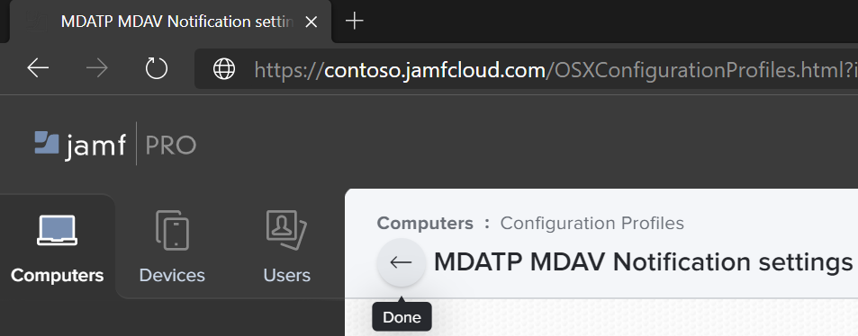
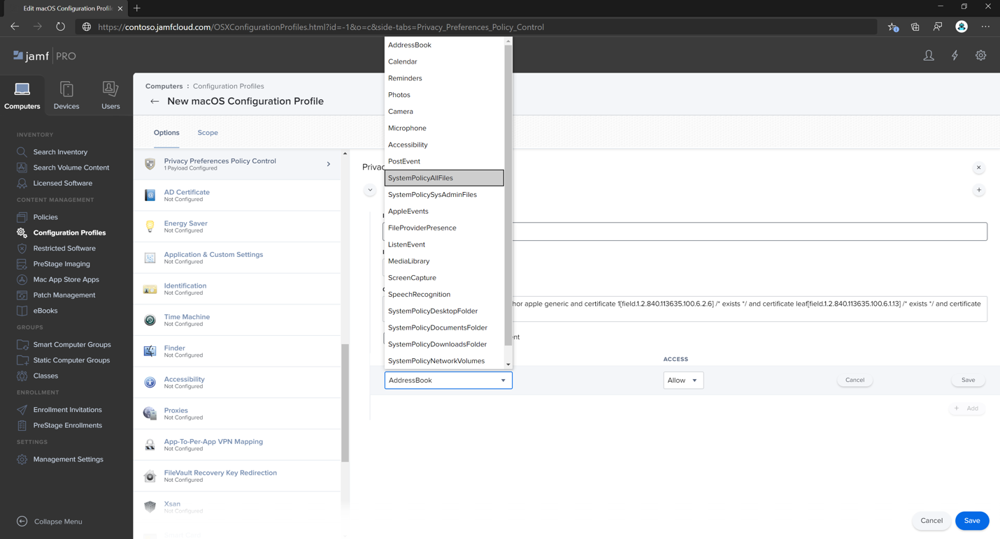
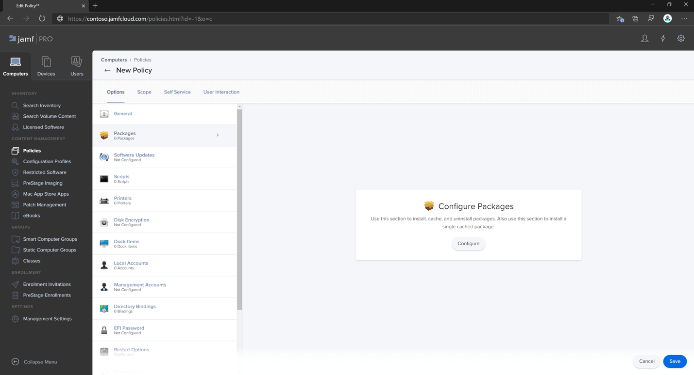

# <a name="set-up-the-microsoft-defender-for-endpoint-for-macos-policies-in-jamf-pro"></a><span data-ttu-id="3b36c-104">Configurar Microsoft Defender para endpoint para directivas de macOS en Jamf Pro</span><span class="sxs-lookup"><span data-stu-id="3b36c-104">Set up the Microsoft Defender for Endpoint for macOS policies in Jamf Pro</span></span>

[!INCLUDE [Microsoft 365 Defender rebranding](../../includes/microsoft-defender.md)]


<span data-ttu-id="3b36c-105">**Se aplica a:**</span><span class="sxs-lookup"><span data-stu-id="3b36c-105">**Applies to:**</span></span>

- [<span data-ttu-id="3b36c-106">Defender para Endpoint para Mac</span><span class="sxs-lookup"><span data-stu-id="3b36c-106">Defender for Endpoint for Mac</span></span>](microsoft-defender-endpoint-mac.md)

<span data-ttu-id="3b36c-107">Esta página le guiará a través de los pasos que debe seguir para configurar directivas de macOS en Jamf Pro.</span><span class="sxs-lookup"><span data-stu-id="3b36c-107">This page will guide you through the steps you need to take to set up macOS policies in Jamf Pro.</span></span>

<span data-ttu-id="3b36c-108">Deberá seguir los pasos siguientes:</span><span class="sxs-lookup"><span data-stu-id="3b36c-108">You'll need to take the following steps:</span></span>

1. [<span data-ttu-id="3b36c-109">Obtener el paquete de incorporación de Microsoft Defender para endpoint</span><span class="sxs-lookup"><span data-stu-id="3b36c-109">Get the Microsoft Defender for Endpoint onboarding package</span></span>](#step-1-get-the-microsoft-defender-for-endpoint-onboarding-package)

2. [<span data-ttu-id="3b36c-110">Crear un perfil de configuración en Jamf Pro con el paquete de incorporación</span><span class="sxs-lookup"><span data-stu-id="3b36c-110">Create a configuration profile in Jamf Pro using the onboarding package</span></span>](#step-2-create-a-configuration-profile-in-jamf-pro-using-the-onboarding-package)

3. [<span data-ttu-id="3b36c-111">Configurar Microsoft Defender para la configuración del punto de conexión</span><span class="sxs-lookup"><span data-stu-id="3b36c-111">Configure Microsoft Defender for Endpoint settings</span></span>](#step-3-configure-microsoft-defender-for-endpoint-settings)

4. [<span data-ttu-id="3b36c-112">Configurar Microsoft Defender para la configuración de notificación de extremo</span><span class="sxs-lookup"><span data-stu-id="3b36c-112">Configure Microsoft Defender for Endpoint notification settings</span></span>](#step-4-configure-notifications-settings)

5. [<span data-ttu-id="3b36c-113">Configurar Microsoft AutoUpdate (MAU)</span><span class="sxs-lookup"><span data-stu-id="3b36c-113">Configure Microsoft AutoUpdate (MAU)</span></span>](#step-5-configure-microsoft-autoupdate-mau)

6. [<span data-ttu-id="3b36c-114">Conceder acceso en disco completo a Microsoft Defender para endpoint</span><span class="sxs-lookup"><span data-stu-id="3b36c-114">Grant full disk access to Microsoft Defender for Endpoint</span></span>](#step-6-grant-full-disk-access-to-microsoft-defender-for-endpoint)

7. [<span data-ttu-id="3b36c-115">Aprobar extensión de kernel para Microsoft Defender para endpoint</span><span class="sxs-lookup"><span data-stu-id="3b36c-115">Approve Kernel extension for Microsoft Defender for Endpoint</span></span>](#step-7-approve-kernel-extension-for-microsoft-defender-for-endpoint)

8. [<span data-ttu-id="3b36c-116">Aprobar extensiones del sistema para Microsoft Defender para endpoint</span><span class="sxs-lookup"><span data-stu-id="3b36c-116">Approve System extensions for Microsoft Defender for Endpoint</span></span>](#step-8-approve-system-extensions-for-microsoft-defender-for-endpoint)

9. [<span data-ttu-id="3b36c-117">Configurar extensión de red</span><span class="sxs-lookup"><span data-stu-id="3b36c-117">Configure Network Extension</span></span>](#step-9-configure-network-extension)

10. [<span data-ttu-id="3b36c-118">Programar exámenes con Microsoft Defender para endpoint para Mac</span><span class="sxs-lookup"><span data-stu-id="3b36c-118">Schedule scans with Microsoft Defender for Endpoint for Mac</span></span>](https://docs.microsoft.com/windows/security/threat-protection/microsoft-defender-atp/mac-schedule-scan-atp)

11. [<span data-ttu-id="3b36c-119">Implementar Microsoft Defender para endpoint para macOS</span><span class="sxs-lookup"><span data-stu-id="3b36c-119">Deploy Microsoft Defender for Endpoint for macOS</span></span>](#step-11-deploy-microsoft-defender-for-endpoint-for-macos)


## <a name="step-1-get-the-microsoft-defender-for-endpoint-onboarding-package"></a><span data-ttu-id="3b36c-120">Paso 1: Obtener el paquete de incorporación de Microsoft Defender para endpoint</span><span class="sxs-lookup"><span data-stu-id="3b36c-120">Step 1: Get the Microsoft Defender for Endpoint onboarding package</span></span>

1. <span data-ttu-id="3b36c-121">En [el Centro de seguridad de Microsoft Defender,](https://securitycenter.microsoft.com )vaya a Configuración > **incorporación**.</span><span class="sxs-lookup"><span data-stu-id="3b36c-121">In [Microsoft Defender Security Center](https://securitycenter.microsoft.com ), navigate to **Settings > Onboarding**.</span></span> 

2. <span data-ttu-id="3b36c-122">Seleccione macOS como sistema operativo y Administración de dispositivos móviles /Microsoft Intune como método de implementación.</span><span class="sxs-lookup"><span data-stu-id="3b36c-122">Select macOS as the operating system and Mobile Device Management / Microsoft Intune as the deployment method.</span></span>

    

3. <span data-ttu-id="3b36c-124">Seleccione **Descargar paquete de incorporación** (WindowsDefenderATPOnboardingPackage.zip).</span><span class="sxs-lookup"><span data-stu-id="3b36c-124">Select **Download onboarding package** (WindowsDefenderATPOnboardingPackage.zip).</span></span>

4. <span data-ttu-id="3b36c-125">Extraer `WindowsDefenderATPOnboardingPackage.zip` .</span><span class="sxs-lookup"><span data-stu-id="3b36c-125">Extract `WindowsDefenderATPOnboardingPackage.zip`.</span></span>

5. <span data-ttu-id="3b36c-126">Copie el archivo en su ubicación preferida.</span><span class="sxs-lookup"><span data-stu-id="3b36c-126">Copy the file to your preferred location.</span></span> <span data-ttu-id="3b36c-127">Por ejemplo, `C:\Users\JaneDoe_or_JohnDoe.contoso\Downloads\WindowsDefenderATPOnboardingPackage_macOS_MDM_contoso\jamf\WindowsDefenderATPOnboarding.plist`.</span><span class="sxs-lookup"><span data-stu-id="3b36c-127">For example,  `C:\Users\JaneDoe_or_JohnDoe.contoso\Downloads\WindowsDefenderATPOnboardingPackage_macOS_MDM_contoso\jamf\WindowsDefenderATPOnboarding.plist`.</span></span>


## <a name="step-2-create-a-configuration-profile-in-jamf-pro-using-the-onboarding-package"></a><span data-ttu-id="3b36c-128">Paso 2: Crear un perfil de configuración en Jamf Pro con el paquete de incorporación</span><span class="sxs-lookup"><span data-stu-id="3b36c-128">Step 2: Create a configuration profile in Jamf Pro using the onboarding package</span></span>

1. <span data-ttu-id="3b36c-129">Busque el archivo `WindowsDefenderATPOnboarding.plist` de la sección anterior.</span><span class="sxs-lookup"><span data-stu-id="3b36c-129">Locate the file `WindowsDefenderATPOnboarding.plist` from the previous section.</span></span>

   

 
2. <span data-ttu-id="3b36c-131">En el panel de Jamf Pro, seleccione **Nuevo**.</span><span class="sxs-lookup"><span data-stu-id="3b36c-131">In the Jamf Pro dashboard, select **New**.</span></span>

    

3. <span data-ttu-id="3b36c-133">Escriba los siguientes detalles:</span><span class="sxs-lookup"><span data-stu-id="3b36c-133">Enter the following details:</span></span>

   <span data-ttu-id="3b36c-134">**General**</span><span class="sxs-lookup"><span data-stu-id="3b36c-134">**General**</span></span>
   - <span data-ttu-id="3b36c-135">Nombre: incorporación de MDATP para macOS</span><span class="sxs-lookup"><span data-stu-id="3b36c-135">Name: MDATP onboarding for macOS</span></span>
   - <span data-ttu-id="3b36c-136">Descripción: incorporación de MDATP EDR para macOS</span><span class="sxs-lookup"><span data-stu-id="3b36c-136">Description: MDATP EDR onboarding for macOS</span></span>
   - <span data-ttu-id="3b36c-137">Categoría: Ninguna</span><span class="sxs-lookup"><span data-stu-id="3b36c-137">Category: None</span></span>
   - <span data-ttu-id="3b36c-138">Método distribution: Install Automatically</span><span class="sxs-lookup"><span data-stu-id="3b36c-138">Distribution Method: Install Automatically</span></span>
   - <span data-ttu-id="3b36c-139">Nivel: Nivel de equipo</span><span class="sxs-lookup"><span data-stu-id="3b36c-139">Level: Computer Level</span></span>

4. <span data-ttu-id="3b36c-140">En **Configuración & configuración personalizada,** seleccione **Configurar**.</span><span class="sxs-lookup"><span data-stu-id="3b36c-140">In **Application & Custom Settings** select **Configure**.</span></span>

    

5. <span data-ttu-id="3b36c-142">Seleccione **Cargar archivo (archivo PLIST) y,** a continuación, en **Dominio de preferencia** escriba: `com.microsoft.wdav.atp` .</span><span class="sxs-lookup"><span data-stu-id="3b36c-142">Select **Upload File (PLIST file)** then in **Preference Domain** enter: `com.microsoft.wdav.atp`.</span></span> 

    

    

7. <span data-ttu-id="3b36c-145">Seleccione **Abrir** y seleccione el archivo de incorporación.</span><span class="sxs-lookup"><span data-stu-id="3b36c-145">Select **Open** and select the onboarding file.</span></span>

    

8. <span data-ttu-id="3b36c-147">Seleccione **Cargar**.</span><span class="sxs-lookup"><span data-stu-id="3b36c-147">Select **Upload**.</span></span> 

    


9. <span data-ttu-id="3b36c-149">Seleccione la **pestaña** Ámbito.</span><span class="sxs-lookup"><span data-stu-id="3b36c-149">Select the **Scope** tab.</span></span>

    

10. <span data-ttu-id="3b36c-151">Seleccione los equipos de destino.</span><span class="sxs-lookup"><span data-stu-id="3b36c-151">Select the target computers.</span></span>

    

     

11. <span data-ttu-id="3b36c-154">Seleccione **Guardar**.</span><span class="sxs-lookup"><span data-stu-id="3b36c-154">Select **Save**.</span></span>

    

    

12. <span data-ttu-id="3b36c-157">Seleccione **Listo**.</span><span class="sxs-lookup"><span data-stu-id="3b36c-157">Select **Done**.</span></span>

    

    

## <a name="step-3-configure-microsoft-defender-for-endpoint-settings"></a><span data-ttu-id="3b36c-160">Paso 3: Configurar Microsoft Defender para la configuración del punto de conexión</span><span class="sxs-lookup"><span data-stu-id="3b36c-160">Step 3: Configure Microsoft Defender for Endpoint settings</span></span>

1.  <span data-ttu-id="3b36c-161">Use las siguientes opciones de configuración de Microsoft Defender para puntos de conexión:</span><span class="sxs-lookup"><span data-stu-id="3b36c-161">Use the following Microsoft Defender for Endpoint configuration settings:</span></span>

    - <span data-ttu-id="3b36c-162">enableRealTimeProtection</span><span class="sxs-lookup"><span data-stu-id="3b36c-162">enableRealTimeProtection</span></span>
    - <span data-ttu-id="3b36c-163">passiveMode</span><span class="sxs-lookup"><span data-stu-id="3b36c-163">passiveMode</span></span>
    
    >[!NOTE]
    ><span data-ttu-id="3b36c-164">No activado de forma predeterminada, si está planeando ejecutar un ANTIVIRUS de terceros para macOS, estafórlo en `true` .</span><span class="sxs-lookup"><span data-stu-id="3b36c-164">Not turned on by default, if you are planning to run a third-party AV for macOS, set it to `true`.</span></span>

    - <span data-ttu-id="3b36c-165">exclusiones</span><span class="sxs-lookup"><span data-stu-id="3b36c-165">exclusions</span></span>
    - <span data-ttu-id="3b36c-166">excludedPath</span><span class="sxs-lookup"><span data-stu-id="3b36c-166">excludedPath</span></span>
    - <span data-ttu-id="3b36c-167">excludedFileExtension</span><span class="sxs-lookup"><span data-stu-id="3b36c-167">excludedFileExtension</span></span>
    - <span data-ttu-id="3b36c-168">excludedFileName</span><span class="sxs-lookup"><span data-stu-id="3b36c-168">excludedFileName</span></span>
    - <span data-ttu-id="3b36c-169">exclusionsMergePolicy</span><span class="sxs-lookup"><span data-stu-id="3b36c-169">exclusionsMergePolicy</span></span>
    - <span data-ttu-id="3b36c-170">allowedThreats</span><span class="sxs-lookup"><span data-stu-id="3b36c-170">allowedThreats</span></span>
    
    >[!NOTE]
    ><span data-ttu-id="3b36c-171">EICAR está en la muestra, si está pasando por una prueba de concepto, quítela especialmente si está probando EICAR.</span><span class="sxs-lookup"><span data-stu-id="3b36c-171">EICAR is on the sample, if you are going through a proof-of-concept, remove it especially if you are testing EICAR.</span></span>
        
    - <span data-ttu-id="3b36c-172">disallowedThreatActions</span><span class="sxs-lookup"><span data-stu-id="3b36c-172">disallowedThreatActions</span></span>
    - <span data-ttu-id="3b36c-173">potentially_unwanted_application</span><span class="sxs-lookup"><span data-stu-id="3b36c-173">potentially_unwanted_application</span></span>
    - <span data-ttu-id="3b36c-174">archive_bomb</span><span class="sxs-lookup"><span data-stu-id="3b36c-174">archive_bomb</span></span>
    - <span data-ttu-id="3b36c-175">cloudService</span><span class="sxs-lookup"><span data-stu-id="3b36c-175">cloudService</span></span>
    - <span data-ttu-id="3b36c-176">automaticSampleSubmission</span><span class="sxs-lookup"><span data-stu-id="3b36c-176">automaticSampleSubmission</span></span>
    - <span data-ttu-id="3b36c-177">tags</span><span class="sxs-lookup"><span data-stu-id="3b36c-177">tags</span></span>
    - <span data-ttu-id="3b36c-178">hideStatusMenuIcon</span><span class="sxs-lookup"><span data-stu-id="3b36c-178">hideStatusMenuIcon</span></span>
    
     <span data-ttu-id="3b36c-179">Para obtener información, vea [Lista de propiedades para el perfil de configuración de Jamf](mac-preferences.md#property-list-for-jamf-configuration-profile).</span><span class="sxs-lookup"><span data-stu-id="3b36c-179">For information, see [Property list for Jamf configuration profile](mac-preferences.md#property-list-for-jamf-configuration-profile).</span></span>

     ```XML
     <?xml version="1.0" encoding="UTF-8"?>
     <!DOCTYPE plist PUBLIC "-//Apple//DTD PLIST 1.0//EN" "http://www.apple.com/DTDs/PropertyList-1.0.dtd">
     <plist version="1.0">
     <dict>
         <key>antivirusEngine</key>
         <dict>
             <key>enableRealTimeProtection</key>
             <true/>
             <key>passiveMode</key>
             <false/>
             <key>exclusions</key>
             <array>
                 <dict>
                     <key>$type</key>
                     <string>excludedPath</string>
                     <key>isDirectory</key>
                     <false/>
                     <key>path</key>
                     <string>/var/log/system.log</string>
                 </dict>
                 <dict>
                     <key>$type</key>
                     <string>excludedPath</string>
                     <key>isDirectory</key>
                     <true/>
                     <key>path</key>
                     <string>/home</string>
                 </dict>
                 <dict>
                     <key>$type</key>
                     <string>excludedFileExtension</string>
                     <key>extension</key>
                     <string>pdf</string>
                 </dict>
                 <dict>
                     <key>$type</key>
                     <string>excludedFileName</string>
                     <key>name</key>
                     <string>cat</string>
                 </dict>
             </array>
             <key>exclusionsMergePolicy</key>
             <string>merge</string>
             <key>allowedThreats</key>
             <array>
                 <string>EICAR-Test-File (not a virus)</string>
             </array>
             <key>disallowedThreatActions</key>
             <array>
                 <string>allow</string>
                 <string>restore</string>
             </array>
             <key>threatTypeSettings</key>
             <array>
                 <dict>
                     <key>key</key>
                     <string>potentially_unwanted_application</string>
                     <key>value</key>
                     <string>block</string>
                 </dict>
                 <dict>
                     <key>key</key>
                     <string>archive_bomb</string>
                     <key>value</key>
                     <string>audit</string>
                 </dict>
             </array>
             <key>threatTypeSettingsMergePolicy</key>
             <string>merge</string>
         </dict>
         <key>cloudService</key>
         <dict>
             <key>enabled</key>
             <true/>
             <key>diagnosticLevel</key>
             <string>optional</string>
             <key>automaticSampleSubmission</key>
             <true/>
         </dict>
         <key>edr</key>
         <dict>
             <key>tags</key>
             <array>
                 <dict>
                     <key>key</key>
                     <string>GROUP</string>
                     <key>value</key>
                     <string>ExampleTag</string>
                 </dict>
             </array>
         </dict>
         <key>userInterface</key>
         <dict>
             <key>hideStatusMenuIcon</key>
             <false/>
         </dict>
     </dict>
     </plist>
     ```

2. <span data-ttu-id="3b36c-180">Guarde el archivo como `MDATP_MDAV_configuration_settings.plist` .</span><span class="sxs-lookup"><span data-stu-id="3b36c-180">Save the file as `MDATP_MDAV_configuration_settings.plist`.</span></span>


3.  <span data-ttu-id="3b36c-181">En el panel de Jamf Pro, seleccione **General**.</span><span class="sxs-lookup"><span data-stu-id="3b36c-181">In the Jamf Pro dashboard, select **General**.</span></span>

    

4. <span data-ttu-id="3b36c-183">Escriba los siguientes detalles:</span><span class="sxs-lookup"><span data-stu-id="3b36c-183">Enter the following details:</span></span>

    <span data-ttu-id="3b36c-184">**General**</span><span class="sxs-lookup"><span data-stu-id="3b36c-184">**General**</span></span>
    
    - <span data-ttu-id="3b36c-185">Nombre: opciones de configuración de MDATP MDAV</span><span class="sxs-lookup"><span data-stu-id="3b36c-185">Name: MDATP MDAV configuration settings</span></span>
    - <span data-ttu-id="3b36c-186">Descripción:\<blank\></span><span class="sxs-lookup"><span data-stu-id="3b36c-186">Description:\<blank\></span></span>
    - <span data-ttu-id="3b36c-187">Categoría: Ninguno (predeterminado)</span><span class="sxs-lookup"><span data-stu-id="3b36c-187">Category: None (default)</span></span>
    - <span data-ttu-id="3b36c-188">Método distribution: Install Automatically (default)</span><span class="sxs-lookup"><span data-stu-id="3b36c-188">Distribution Method: Install Automatically(default)</span></span>
    - <span data-ttu-id="3b36c-189">Nivel: Nivel del equipo (predeterminado)</span><span class="sxs-lookup"><span data-stu-id="3b36c-189">Level: Computer Level(default)</span></span>

    

5. <span data-ttu-id="3b36c-191">En **Configuración & configuración personalizada,** seleccione **Configurar**.</span><span class="sxs-lookup"><span data-stu-id="3b36c-191">In **Application & Custom Settings** select **Configure**.</span></span>

    

6. <span data-ttu-id="3b36c-193">Seleccione **Cargar archivo (archivo PLIST).**</span><span class="sxs-lookup"><span data-stu-id="3b36c-193">Select **Upload File (PLIST file)**.</span></span>

    

7. <span data-ttu-id="3b36c-195">En **Dominio de preferencias,** escriba `com.microsoft.wdav` y, a continuación,  **seleccione Cargar archivo PLIST**.</span><span class="sxs-lookup"><span data-stu-id="3b36c-195">In **Preferences Domain**, enter `com.microsoft.wdav`, then select  **Upload PLIST File**.</span></span>

    

8. <span data-ttu-id="3b36c-197">Seleccione **Elegir archivo**.</span><span class="sxs-lookup"><span data-stu-id="3b36c-197">Select **Choose File**.</span></span>

    

9. <span data-ttu-id="3b36c-199">Seleccione el **MDATP_MDAV_configuration_settings.plist** y, a continuación, **seleccione Abrir**.</span><span class="sxs-lookup"><span data-stu-id="3b36c-199">Select the **MDATP_MDAV_configuration_settings.plist**, then select **Open**.</span></span>

    

10. <span data-ttu-id="3b36c-201">Seleccione **Cargar**.</span><span class="sxs-lookup"><span data-stu-id="3b36c-201">Select **Upload**.</span></span>

    

    

    >[!NOTE]
    ><span data-ttu-id="3b36c-204">Si se carga el archivo de Intune, se producirá el siguiente error:</span><span class="sxs-lookup"><span data-stu-id="3b36c-204">If you happen to upload the Intune file, you'll get the following error:</span></span><br>
    ><span data-ttu-id="3b36c-205"></span><span class="sxs-lookup"><span data-stu-id="3b36c-205"></span></span>


11. <span data-ttu-id="3b36c-206">Seleccione **Guardar**.</span><span class="sxs-lookup"><span data-stu-id="3b36c-206">Select **Save**.</span></span> 

    

12. <span data-ttu-id="3b36c-208">El archivo se carga.</span><span class="sxs-lookup"><span data-stu-id="3b36c-208">The file is uploaded.</span></span>

    

    

13. <span data-ttu-id="3b36c-211">Seleccione la **pestaña** Ámbito.</span><span class="sxs-lookup"><span data-stu-id="3b36c-211">Select the **Scope** tab.</span></span>

    

14. <span data-ttu-id="3b36c-213">Seleccione **Grupo de máquinas de Contoso**.</span><span class="sxs-lookup"><span data-stu-id="3b36c-213">Select **Contoso's Machine Group**.</span></span> 

15. <span data-ttu-id="3b36c-214">Seleccione **Agregar** y, a continuación, **seleccione Guardar**.</span><span class="sxs-lookup"><span data-stu-id="3b36c-214">Select **Add**, then select **Save**.</span></span>

    

    

16. <span data-ttu-id="3b36c-217">Seleccione **Listo**.</span><span class="sxs-lookup"><span data-stu-id="3b36c-217">Select **Done**.</span></span> <span data-ttu-id="3b36c-218">Verá el nuevo perfil **de configuración**.</span><span class="sxs-lookup"><span data-stu-id="3b36c-218">You'll see the new **Configuration profile**.</span></span>

    


## <a name="step-4-configure-notifications-settings"></a><span data-ttu-id="3b36c-220">Paso 4: Configurar la configuración de notificaciones</span><span class="sxs-lookup"><span data-stu-id="3b36c-220">Step 4: Configure notifications settings</span></span>

<span data-ttu-id="3b36c-221">Estos pasos son aplicables a macOS 10.15 (Catalina) o versiones posteriores.</span><span class="sxs-lookup"><span data-stu-id="3b36c-221">These steps are applicable of macOS 10.15 (Catalina) or newer.</span></span>

1. <span data-ttu-id="3b36c-222">En el panel de Jamf Pro, seleccione **Equipos** y, a continuación, **Perfiles de configuración.**</span><span class="sxs-lookup"><span data-stu-id="3b36c-222">In the Jamf Pro dashboard, select **Computers**, then **Configuration Profiles**.</span></span>

2. <span data-ttu-id="3b36c-223">Haga **clic en** Nuevo y escriba los siguientes detalles para **Opciones:**</span><span class="sxs-lookup"><span data-stu-id="3b36c-223">Click **New**, and enter the following details for **Options**:</span></span>
    
    - <span data-ttu-id="3b36c-224">Ficha **General**:</span><span class="sxs-lookup"><span data-stu-id="3b36c-224">Tab **General**:</span></span> 
        - <span data-ttu-id="3b36c-225">**Nombre:** configuración de notificación MDATP MDAV</span><span class="sxs-lookup"><span data-stu-id="3b36c-225">**Name**: MDATP MDAV Notification settings</span></span>
        - <span data-ttu-id="3b36c-226">**Descripción:** macOS 10.15 (Catalina) o posterior</span><span class="sxs-lookup"><span data-stu-id="3b36c-226">**Description**: macOS 10.15 (Catalina) or newer</span></span>
        - <span data-ttu-id="3b36c-227">**Categoría**: None *(valor predeterminado)*</span><span class="sxs-lookup"><span data-stu-id="3b36c-227">**Category**: None *(default)*</span></span>
        - <span data-ttu-id="3b36c-228">**Método Distribution:** Instalar automáticamente *(predeterminado)*</span><span class="sxs-lookup"><span data-stu-id="3b36c-228">**Distribution Method**: Install Automatically *(default)*</span></span>
        - <span data-ttu-id="3b36c-229">**Nivel:** Nivel de equipo *(predeterminado)*</span><span class="sxs-lookup"><span data-stu-id="3b36c-229">**Level**: Computer Level *(default)*</span></span>

        

    - <span data-ttu-id="3b36c-231">Tab **Notifications**, click **Add** y escriba los siguientes valores:</span><span class="sxs-lookup"><span data-stu-id="3b36c-231">Tab **Notifications**, click **Add**, and enter the following values:</span></span>
        - <span data-ttu-id="3b36c-232">**Id. de agrupación:**`com.microsoft.wdav.tray`</span><span class="sxs-lookup"><span data-stu-id="3b36c-232">**Bundle ID**: `com.microsoft.wdav.tray`</span></span>
        - <span data-ttu-id="3b36c-233">**Alertas críticas:** haga clic **en Deshabilitar**</span><span class="sxs-lookup"><span data-stu-id="3b36c-233">**Critical Alerts**: Click **Disable**</span></span>
        - <span data-ttu-id="3b36c-234">**Notificaciones:** haga clic en **Habilitar**</span><span class="sxs-lookup"><span data-stu-id="3b36c-234">**Notifications**: Click **Enable**</span></span>
        - <span data-ttu-id="3b36c-235">**Tipo de alerta de banner:** Seleccione **Incluir** y **Temporal** *(predeterminado)*</span><span class="sxs-lookup"><span data-stu-id="3b36c-235">**Banner alert type**: Select **Include** and **Temporary** *(default)*</span></span>
        - <span data-ttu-id="3b36c-236">**Notificaciones en la pantalla de bloqueo:** Haga clic **en Ocultar**</span><span class="sxs-lookup"><span data-stu-id="3b36c-236">**Notifications on lock screen**: Click **Hide**</span></span>
        - <span data-ttu-id="3b36c-237">**Notificaciones en el Centro de notificaciones:** haga clic en **Mostrar**</span><span class="sxs-lookup"><span data-stu-id="3b36c-237">**Notifications in Notification Center**: Click **Display**</span></span>
        - <span data-ttu-id="3b36c-238">**Icono de aplicación de distintivo:** Haga clic en **Mostrar**</span><span class="sxs-lookup"><span data-stu-id="3b36c-238">**Badge app icon**: Click **Display**</span></span>

        

    - <span data-ttu-id="3b36c-240">Tab **Notifications**, click **Add** one more time, scroll down to **New Notifications Settings**</span><span class="sxs-lookup"><span data-stu-id="3b36c-240">Tab **Notifications**, click **Add** one more time, scroll down to **New Notifications Settings**</span></span>
        - <span data-ttu-id="3b36c-241">**Id. de agrupación:**`com.microsoft.autoupdate2`</span><span class="sxs-lookup"><span data-stu-id="3b36c-241">**Bundle ID**: `com.microsoft.autoupdate2`</span></span>
        - <span data-ttu-id="3b36c-242">Configure el resto de la configuración en los mismos valores anteriores</span><span class="sxs-lookup"><span data-stu-id="3b36c-242">Configure the rest of the settings to the same values as above</span></span>

        

        <span data-ttu-id="3b36c-244">Ten en cuenta que ahora tienes dos "tablas" con configuraciones de notificación, una para id. de **agrupación: com.microsoft.wdav.tray** y otra para id. de **lote: com.microsoft.autoupdate2**.</span><span class="sxs-lookup"><span data-stu-id="3b36c-244">Note that now you have two 'tables' with notification configurations, one for **Bundle ID: com.microsoft.wdav.tray**, and another for **Bundle ID: com.microsoft.autoupdate2**.</span></span> <span data-ttu-id="3b36c-245">Aunque puede configurar la configuración de alertas según sus **requisitos,** los IDs de agrupación deben ser exactamente los mismos que se han descrito anteriormente y el modificador **Include** debe estar **En** para notificaciones.</span><span class="sxs-lookup"><span data-stu-id="3b36c-245">While you can configure alert settings per your requirements, Bundle IDs must be exactly the same as described before, and **Include** switch must be **On** for **Notifications**.</span></span>

3. <span data-ttu-id="3b36c-246">Seleccione la **pestaña Ámbito** y, a continuación, **seleccione Agregar**.</span><span class="sxs-lookup"><span data-stu-id="3b36c-246">Select the **Scope** tab, then select **Add**.</span></span>

    

4. <span data-ttu-id="3b36c-248">Seleccione **Grupo de máquinas de Contoso**.</span><span class="sxs-lookup"><span data-stu-id="3b36c-248">Select **Contoso's Machine Group**.</span></span> 

5. <span data-ttu-id="3b36c-249">Seleccione **Agregar** y, a continuación, **seleccione Guardar**.</span><span class="sxs-lookup"><span data-stu-id="3b36c-249">Select **Add**, then select **Save**.</span></span>
    
    
    
    

6. <span data-ttu-id="3b36c-252">Seleccione **Listo**.</span><span class="sxs-lookup"><span data-stu-id="3b36c-252">Select **Done**.</span></span> <span data-ttu-id="3b36c-253">Verá el nuevo perfil **de configuración**.</span><span class="sxs-lookup"><span data-stu-id="3b36c-253">You'll see the new **Configuration profile**.</span></span>
    <span data-ttu-id="3b36c-254"></span><span class="sxs-lookup"><span data-stu-id="3b36c-254"></span></span>

## <a name="step-5-configure-microsoft-autoupdate-mau"></a><span data-ttu-id="3b36c-255">Paso 5: Configurar Microsoft AutoUpdate (MAU)</span><span class="sxs-lookup"><span data-stu-id="3b36c-255">Step 5: Configure Microsoft AutoUpdate (MAU)</span></span>

1. <span data-ttu-id="3b36c-256">Use las siguientes opciones de configuración de Microsoft Defender para puntos de conexión:</span><span class="sxs-lookup"><span data-stu-id="3b36c-256">Use the following Microsoft Defender for Endpoint configuration settings:</span></span>

      ```XML
   <?xml version="1.0" encoding="UTF-8"?>
   <!DOCTYPE plist PUBLIC "-//Apple//DTD PLIST 1.0//EN" "http://www.apple.com/DTDs/PropertyList-1.0.dtd">
   <plist version="1.0">
   <dict>
    <key>ChannelName</key>
    <string>Current</string>
    <key>HowToCheck</key>
    <string>AutomaticDownload</string>
    <key>EnableCheckForUpdatesButton</key>
    <true/>
    <key>DisableInsiderCheckbox</key>
    <false/>
    <key>SendAllTelemetryEnabled</key>
    <true/>
   </dict>
   </plist>
   ```

2. <span data-ttu-id="3b36c-257">Guárdelo como `MDATP_MDAV_MAU_settings.plist` .</span><span class="sxs-lookup"><span data-stu-id="3b36c-257">Save it as `MDATP_MDAV_MAU_settings.plist`.</span></span>

3. <span data-ttu-id="3b36c-258">En el panel de Jamf Pro, seleccione **General**.</span><span class="sxs-lookup"><span data-stu-id="3b36c-258">In the Jamf Pro dashboard, select **General**.</span></span> 

    

4. <span data-ttu-id="3b36c-260">Escriba los siguientes detalles:</span><span class="sxs-lookup"><span data-stu-id="3b36c-260">Enter the following details:</span></span>

    <span data-ttu-id="3b36c-261">**General**</span><span class="sxs-lookup"><span data-stu-id="3b36c-261">**General**</span></span> 
    
    - <span data-ttu-id="3b36c-262">Nombre: configuración de MDATP MDAV MAU</span><span class="sxs-lookup"><span data-stu-id="3b36c-262">Name: MDATP MDAV MAU settings</span></span>
    - <span data-ttu-id="3b36c-263">Descripción: Configuración de Microsoft AutoUpdate para MDATP para macOS</span><span class="sxs-lookup"><span data-stu-id="3b36c-263">Description: Microsoft AutoUpdate settings for MDATP for macOS</span></span>
    - <span data-ttu-id="3b36c-264">Categoría: Ninguno (predeterminado)</span><span class="sxs-lookup"><span data-stu-id="3b36c-264">Category: None (default)</span></span>
    - <span data-ttu-id="3b36c-265">Método distribution: Install Automatically (default)</span><span class="sxs-lookup"><span data-stu-id="3b36c-265">Distribution Method: Install Automatically(default)</span></span>
    - <span data-ttu-id="3b36c-266">Nivel: Nivel del equipo (predeterminado)</span><span class="sxs-lookup"><span data-stu-id="3b36c-266">Level: Computer Level(default)</span></span>

5. <span data-ttu-id="3b36c-267">En **Configuración & configuración personalizada,** seleccione **Configurar**.</span><span class="sxs-lookup"><span data-stu-id="3b36c-267">In **Application & Custom Settings** select **Configure**.</span></span>

    

6. <span data-ttu-id="3b36c-269">Seleccione **Cargar archivo (archivo PLIST).**</span><span class="sxs-lookup"><span data-stu-id="3b36c-269">Select **Upload File (PLIST file)**.</span></span>

      

7. <span data-ttu-id="3b36c-271">En **Dominio de preferencia** escriba: , luego seleccione Cargar archivo `com.microsoft.autoupdate2` **PLIST**.</span><span class="sxs-lookup"><span data-stu-id="3b36c-271">In **Preference Domain** enter: `com.microsoft.autoupdate2`, then select **Upload PLIST File**.</span></span>

    

8. <span data-ttu-id="3b36c-273">Seleccione **Elegir archivo**.</span><span class="sxs-lookup"><span data-stu-id="3b36c-273">Select **Choose File**.</span></span>

    

9. <span data-ttu-id="3b36c-275">Seleccione **MDATP_MDAV_MAU_settings.plist**.</span><span class="sxs-lookup"><span data-stu-id="3b36c-275">Select **MDATP_MDAV_MAU_settings.plist**.</span></span>

    

10. <span data-ttu-id="3b36c-277">Seleccione **Cargar**.</span><span class="sxs-lookup"><span data-stu-id="3b36c-277">Select **Upload**.</span></span>
    <span data-ttu-id="3b36c-278"></span><span class="sxs-lookup"><span data-stu-id="3b36c-278"></span></span>

    

11. <span data-ttu-id="3b36c-280">Seleccione **Guardar**.</span><span class="sxs-lookup"><span data-stu-id="3b36c-280">Select **Save**.</span></span>

    

12. <span data-ttu-id="3b36c-282">Seleccione la **pestaña** Ámbito.</span><span class="sxs-lookup"><span data-stu-id="3b36c-282">Select the **Scope** tab.</span></span>
   
     

13. <span data-ttu-id="3b36c-284">Elija **Agregar**.</span><span class="sxs-lookup"><span data-stu-id="3b36c-284">Select **Add**.</span></span>
    
    

    

    

14. <span data-ttu-id="3b36c-288">Seleccione **Listo**.</span><span class="sxs-lookup"><span data-stu-id="3b36c-288">Select **Done**.</span></span>
    
    

## <a name="step-6-grant-full-disk-access-to-microsoft-defender-for-endpoint"></a><span data-ttu-id="3b36c-290">Paso 6: Conceder acceso en disco completo a Microsoft Defender para endpoint</span><span class="sxs-lookup"><span data-stu-id="3b36c-290">Step 6: Grant full disk access to Microsoft Defender for Endpoint</span></span>

1. <span data-ttu-id="3b36c-291">En el panel de Jamf Pro, seleccione **Perfiles de configuración**.</span><span class="sxs-lookup"><span data-stu-id="3b36c-291">In the Jamf Pro dashboard, select **Configuration Profiles**.</span></span>

    

2. <span data-ttu-id="3b36c-293">Seleccione **+ Nuevo**.</span><span class="sxs-lookup"><span data-stu-id="3b36c-293">Select **+ New**.</span></span> 

3. <span data-ttu-id="3b36c-294">Escriba los siguientes detalles:</span><span class="sxs-lookup"><span data-stu-id="3b36c-294">Enter the following details:</span></span>

    <span data-ttu-id="3b36c-295">**General**</span><span class="sxs-lookup"><span data-stu-id="3b36c-295">**General**</span></span> 
    - <span data-ttu-id="3b36c-296">Nombre: MDATP MDAV: conceder acceso en disco completo a EDR y AV</span><span class="sxs-lookup"><span data-stu-id="3b36c-296">Name: MDATP MDAV - grant Full Disk Access to EDR and AV</span></span>
    - <span data-ttu-id="3b36c-297">Descripción: en macOS Catalina o versiones posteriores, el nuevo control de directiva de preferencias de privacidad</span><span class="sxs-lookup"><span data-stu-id="3b36c-297">Description: On macOS Catalina or newer, the new Privacy Preferences Policy Control</span></span>
    - <span data-ttu-id="3b36c-298">Categoría: Ninguna</span><span class="sxs-lookup"><span data-stu-id="3b36c-298">Category: None</span></span>
    - <span data-ttu-id="3b36c-299">Método de distribución: Instalar automáticamente</span><span class="sxs-lookup"><span data-stu-id="3b36c-299">Distribution method: Install Automatically</span></span>
    - <span data-ttu-id="3b36c-300">Nivel: nivel de equipo</span><span class="sxs-lookup"><span data-stu-id="3b36c-300">Level: Computer level</span></span>


    

4. <span data-ttu-id="3b36c-302">En **Configurar el control de directiva de preferencias de privacidad,** seleccione **Configurar**.</span><span class="sxs-lookup"><span data-stu-id="3b36c-302">In **Configure Privacy Preferences Policy Control** select **Configure**.</span></span>

    

5. <span data-ttu-id="3b36c-304">En **Control de directiva de preferencias de** privacidad, escriba los siguientes detalles:</span><span class="sxs-lookup"><span data-stu-id="3b36c-304">In **Privacy Preferences Policy Control**, enter the following details:</span></span>

    - <span data-ttu-id="3b36c-305">Identificador: `com.microsoft.wdav`</span><span class="sxs-lookup"><span data-stu-id="3b36c-305">Identifier: `com.microsoft.wdav`</span></span>
    - <span data-ttu-id="3b36c-306">Tipo de identificador: Id. de agrupación</span><span class="sxs-lookup"><span data-stu-id="3b36c-306">Identifier Type: Bundle ID</span></span>
    - <span data-ttu-id="3b36c-307">Requisito de código: `identifier "com.microsoft.wdav" and anchor apple generic and certificate 1[field.1.2.840.113635.100.6.2.6] /* exists */ and certificate leaf[field.1.2.840.113635.100.6.1.13] /* exists */ and certificate leaf[subject.OU] = UBF8T346G9`</span><span class="sxs-lookup"><span data-stu-id="3b36c-307">Code Requirement: `identifier "com.microsoft.wdav" and anchor apple generic and certificate 1[field.1.2.840.113635.100.6.2.6] /* exists */ and certificate leaf[field.1.2.840.113635.100.6.1.13] /* exists */ and certificate leaf[subject.OU] = UBF8T346G9`</span></span>


    

6. <span data-ttu-id="3b36c-309">Seleccione **+ Agregar**.</span><span class="sxs-lookup"><span data-stu-id="3b36c-309">Select **+ Add**.</span></span>

    

    - <span data-ttu-id="3b36c-311">En Aplicación o servicio: Establecer en **SystemPolicyAllFiles**</span><span class="sxs-lookup"><span data-stu-id="3b36c-311">Under App or service: Set to **SystemPolicyAllFiles**</span></span>

    - <span data-ttu-id="3b36c-312">En "access": Set to **Allow**</span><span class="sxs-lookup"><span data-stu-id="3b36c-312">Under "access": Set to **Allow**</span></span>

7. <span data-ttu-id="3b36c-313">Seleccione **Guardar** (no el que se encuentra en la parte inferior derecha).</span><span class="sxs-lookup"><span data-stu-id="3b36c-313">Select **Save** (not the one at the bottom right).</span></span>

    

8. <span data-ttu-id="3b36c-315">Haga clic `+` en el signo situado junto a App **Access** para agregar una nueva entrada.</span><span class="sxs-lookup"><span data-stu-id="3b36c-315">Click the `+` sign next to **App Access** to add a new entry.</span></span>

    

9. <span data-ttu-id="3b36c-317">Escriba los siguientes detalles:</span><span class="sxs-lookup"><span data-stu-id="3b36c-317">Enter the following details:</span></span>

    - <span data-ttu-id="3b36c-318">Identificador: `com.microsoft.wdav.epsext`</span><span class="sxs-lookup"><span data-stu-id="3b36c-318">Identifier: `com.microsoft.wdav.epsext`</span></span>
    - <span data-ttu-id="3b36c-319">Tipo de identificador: Id. de agrupación</span><span class="sxs-lookup"><span data-stu-id="3b36c-319">Identifier Type: Bundle ID</span></span>
    - <span data-ttu-id="3b36c-320">Requisito de código: `identifier "com.microsoft.wdav.epsext" and anchor apple generic and certificate 1[field.1.2.840.113635.100.6.2.6] /* exists */ and certificate leaf[field.1.2.840.113635.100.6.1.13] /* exists */ and certificate leaf[subject.OU] = UBF8T346G9`</span><span class="sxs-lookup"><span data-stu-id="3b36c-320">Code Requirement: `identifier "com.microsoft.wdav.epsext" and anchor apple generic and certificate 1[field.1.2.840.113635.100.6.2.6] /* exists */ and certificate leaf[field.1.2.840.113635.100.6.1.13] /* exists */ and certificate leaf[subject.OU] = UBF8T346G9`</span></span>

10. <span data-ttu-id="3b36c-321">Seleccione **+ Agregar**.</span><span class="sxs-lookup"><span data-stu-id="3b36c-321">Select **+ Add**.</span></span>

    

    - <span data-ttu-id="3b36c-323">En Aplicación o servicio: Establecer en **SystemPolicyAllFiles**</span><span class="sxs-lookup"><span data-stu-id="3b36c-323">Under App or service: Set to **SystemPolicyAllFiles**</span></span>

    - <span data-ttu-id="3b36c-324">En "access": Set to **Allow**</span><span class="sxs-lookup"><span data-stu-id="3b36c-324">Under "access": Set to **Allow**</span></span>

11. <span data-ttu-id="3b36c-325">Seleccione **Guardar** (no el que se encuentra en la parte inferior derecha).</span><span class="sxs-lookup"><span data-stu-id="3b36c-325">Select **Save** (not the one at the bottom right).</span></span>

    

12. <span data-ttu-id="3b36c-327">Seleccione la **pestaña** Ámbito.</span><span class="sxs-lookup"><span data-stu-id="3b36c-327">Select the **Scope** tab.</span></span>

    

13. <span data-ttu-id="3b36c-329">Seleccione **+ Agregar**.</span><span class="sxs-lookup"><span data-stu-id="3b36c-329">Select **+ Add**.</span></span>

    

14. <span data-ttu-id="3b36c-331">Seleccione **Grupos de** equipos > en Nombre **de** grupo > seleccione **MachineGroup de Contoso**.</span><span class="sxs-lookup"><span data-stu-id="3b36c-331">Select **Computer Groups** > under **Group Name** > select **Contoso's MachineGroup**.</span></span> 

    

15. <span data-ttu-id="3b36c-333">Elija **Agregar**.</span><span class="sxs-lookup"><span data-stu-id="3b36c-333">Select **Add**.</span></span> 

16. <span data-ttu-id="3b36c-334">Seleccione **Guardar**.</span><span class="sxs-lookup"><span data-stu-id="3b36c-334">Select **Save**.</span></span> 
    
17. <span data-ttu-id="3b36c-335">Seleccione **Listo**.</span><span class="sxs-lookup"><span data-stu-id="3b36c-335">Select **Done**.</span></span>
    
    
    
    

<span data-ttu-id="3b36c-338">Como alternativa, puede descargar [fulldisk.mobileconfig](https://github.com/microsoft/mdatp-xplat/blob/master/macos/mobileconfig/profiles/fulldisk.mobileconfig) y cargarlo en los perfiles de configuración de JAMF, como se describe en [Deploying Custom Configuration Profiles using Jamf Pro| Método 2: Cargar un perfil de configuración en Jamf Pro](https://www.jamf.com/jamf-nation/articles/648/deploying-custom-configuration-profiles-using-jamf-pro).</span><span class="sxs-lookup"><span data-stu-id="3b36c-338">Alternatively, you can download [fulldisk.mobileconfig](https://github.com/microsoft/mdatp-xplat/blob/master/macos/mobileconfig/profiles/fulldisk.mobileconfig) and upload it to JAMF Configuration Profiles as described in [Deploying Custom Configuration Profiles using Jamf Pro|Method 2: Upload a Configuration Profile to Jamf Pro](https://www.jamf.com/jamf-nation/articles/648/deploying-custom-configuration-profiles-using-jamf-pro).</span></span>

## <a name="step-7-approve-kernel-extension-for-microsoft-defender-for-endpoint"></a><span data-ttu-id="3b36c-339">Paso 7: Aprobar extensión de kernel para Microsoft Defender para endpoint</span><span class="sxs-lookup"><span data-stu-id="3b36c-339">Step 7: Approve Kernel extension for Microsoft Defender for Endpoint</span></span>

> [!CAUTION]
> <span data-ttu-id="3b36c-340">Los dispositivos Apple Silicon (M1) no son compatibles con KEXT.</span><span class="sxs-lookup"><span data-stu-id="3b36c-340">Apple Silicon (M1) devices do not support KEXT.</span></span> <span data-ttu-id="3b36c-341">La instalación de un perfil de configuración que consta de directivas KEXT producirá un error en estos dispositivos.</span><span class="sxs-lookup"><span data-stu-id="3b36c-341">Installation of a configuration profile consisting KEXT policies will fail on these devices.</span></span>

1. <span data-ttu-id="3b36c-342">En **perfiles de configuración,** seleccione **+ Nuevo**.</span><span class="sxs-lookup"><span data-stu-id="3b36c-342">In the **Configuration Profiles**, select **+ New**.</span></span>

    

2. <span data-ttu-id="3b36c-344">Escriba los siguientes detalles:</span><span class="sxs-lookup"><span data-stu-id="3b36c-344">Enter the following details:</span></span>

    <span data-ttu-id="3b36c-345">**General**</span><span class="sxs-lookup"><span data-stu-id="3b36c-345">**General**</span></span> 
    
    - <span data-ttu-id="3b36c-346">Nombre: MDATP MDAV Kernel Extension</span><span class="sxs-lookup"><span data-stu-id="3b36c-346">Name: MDATP MDAV Kernel Extension</span></span>
    - <span data-ttu-id="3b36c-347">Descripción: extensión de kernel MDATP (kext)</span><span class="sxs-lookup"><span data-stu-id="3b36c-347">Description: MDATP kernel extension (kext)</span></span>
    - <span data-ttu-id="3b36c-348">Categoría: Ninguna</span><span class="sxs-lookup"><span data-stu-id="3b36c-348">Category: None</span></span>
    - <span data-ttu-id="3b36c-349">Método distribution: Install Automatically</span><span class="sxs-lookup"><span data-stu-id="3b36c-349">Distribution Method: Install Automatically</span></span>
    - <span data-ttu-id="3b36c-350">Nivel: Nivel de equipo</span><span class="sxs-lookup"><span data-stu-id="3b36c-350">Level: Computer Level</span></span>

    

3. <span data-ttu-id="3b36c-352">En **Configurar extensiones de kernel aprobadas,** seleccione **Configurar**.</span><span class="sxs-lookup"><span data-stu-id="3b36c-352">In **Configure Approved Kernel Extensions** select **Configure**.</span></span>

    

   
4. <span data-ttu-id="3b36c-354">En **Extensiones de kernel aprobadas,** escriba los siguientes detalles:</span><span class="sxs-lookup"><span data-stu-id="3b36c-354">In **Approved Kernel Extensions** Enter the following details:</span></span>

    - <span data-ttu-id="3b36c-355">Nombre para mostrar: Microsoft Corp.</span><span class="sxs-lookup"><span data-stu-id="3b36c-355">Display Name: Microsoft Corp.</span></span>
    - <span data-ttu-id="3b36c-356">Id. de equipo: UBF8T346G9</span><span class="sxs-lookup"><span data-stu-id="3b36c-356">Team ID: UBF8T346G9</span></span>

    

5. <span data-ttu-id="3b36c-358">Seleccione la **pestaña** Ámbito.</span><span class="sxs-lookup"><span data-stu-id="3b36c-358">Select the **Scope** tab.</span></span>

    

6. <span data-ttu-id="3b36c-360">Seleccione **+ Agregar**.</span><span class="sxs-lookup"><span data-stu-id="3b36c-360">Select **+ Add**.</span></span>

7. <span data-ttu-id="3b36c-361">Seleccione **Grupos de** equipos > en Nombre **de** grupo > seleccione Grupo de máquinas **de Contoso**.</span><span class="sxs-lookup"><span data-stu-id="3b36c-361">Select **Computer Groups** > under **Group Name** > select **Contoso's Machine Group**.</span></span>

8. <span data-ttu-id="3b36c-362">Seleccione **+ Agregar**.</span><span class="sxs-lookup"><span data-stu-id="3b36c-362">Select **+ Add**.</span></span>

    

9. <span data-ttu-id="3b36c-364">Seleccione **Guardar**.</span><span class="sxs-lookup"><span data-stu-id="3b36c-364">Select **Save**.</span></span>

    

10. <span data-ttu-id="3b36c-366">Seleccione **Listo**.</span><span class="sxs-lookup"><span data-stu-id="3b36c-366">Select **Done**.</span></span>

    

<span data-ttu-id="3b36c-368">Como alternativa, puede descargar [kext.mobileconfig](https://github.com/microsoft/mdatp-xplat/blob/master/macos/mobileconfig/profiles/kext.mobileconfig) y cargarlo en los perfiles de configuración de JAMF, como se describe en [Deploying Custom Configuration Profiles using Jamf Pro| Método 2: Cargar un perfil de configuración en Jamf Pro](https://www.jamf.com/jamf-nation/articles/648/deploying-custom-configuration-profiles-using-jamf-pro).</span><span class="sxs-lookup"><span data-stu-id="3b36c-368">Alternatively, you can download [kext.mobileconfig](https://github.com/microsoft/mdatp-xplat/blob/master/macos/mobileconfig/profiles/kext.mobileconfig) and upload it to JAMF Configuration Profiles as described in [Deploying Custom Configuration Profiles using Jamf Pro|Method 2: Upload a Configuration Profile to Jamf Pro](https://www.jamf.com/jamf-nation/articles/648/deploying-custom-configuration-profiles-using-jamf-pro).</span></span>

## <a name="step-8-approve-system-extensions-for-microsoft-defender-for-endpoint"></a><span data-ttu-id="3b36c-369">Paso 8: Aprobar extensiones de sistema para Microsoft Defender para endpoint</span><span class="sxs-lookup"><span data-stu-id="3b36c-369">Step 8: Approve System extensions for Microsoft Defender for Endpoint</span></span>

1. <span data-ttu-id="3b36c-370">En **perfiles de configuración,** seleccione **+ Nuevo**.</span><span class="sxs-lookup"><span data-stu-id="3b36c-370">In the **Configuration Profiles**, select **+ New**.</span></span>

    

2. <span data-ttu-id="3b36c-372">Escriba los siguientes detalles:</span><span class="sxs-lookup"><span data-stu-id="3b36c-372">Enter the following details:</span></span>

    <span data-ttu-id="3b36c-373">**General**</span><span class="sxs-lookup"><span data-stu-id="3b36c-373">**General**</span></span>
    
    - <span data-ttu-id="3b36c-374">Nombre: MDATP MDAV System Extensions</span><span class="sxs-lookup"><span data-stu-id="3b36c-374">Name: MDATP MDAV System Extensions</span></span>
    - <span data-ttu-id="3b36c-375">Descripción: extensiones del sistema MDATP</span><span class="sxs-lookup"><span data-stu-id="3b36c-375">Description: MDATP system extensions</span></span>
    - <span data-ttu-id="3b36c-376">Categoría: Ninguna</span><span class="sxs-lookup"><span data-stu-id="3b36c-376">Category: None</span></span>
    - <span data-ttu-id="3b36c-377">Método distribution: Install Automatically</span><span class="sxs-lookup"><span data-stu-id="3b36c-377">Distribution Method: Install Automatically</span></span>
    - <span data-ttu-id="3b36c-378">Nivel: Nivel de equipo</span><span class="sxs-lookup"><span data-stu-id="3b36c-378">Level: Computer Level</span></span>

    

3. <span data-ttu-id="3b36c-380">En **Extensiones del sistema,** seleccione **Configurar**.</span><span class="sxs-lookup"><span data-stu-id="3b36c-380">In **System Extensions** select **Configure**.</span></span>

   

4. <span data-ttu-id="3b36c-382">En **Extensiones del sistema,** escriba los siguientes detalles:</span><span class="sxs-lookup"><span data-stu-id="3b36c-382">In **System Extensions** enter the following details:</span></span>

   - <span data-ttu-id="3b36c-383">Nombre para mostrar: Microsoft Corp. Extensiones del sistema</span><span class="sxs-lookup"><span data-stu-id="3b36c-383">Display Name: Microsoft Corp. System Extensions</span></span>
   - <span data-ttu-id="3b36c-384">Tipos de extensión del sistema: extensiones de sistema permitidas</span><span class="sxs-lookup"><span data-stu-id="3b36c-384">System Extension Types: Allowed System Extensions</span></span>
   - <span data-ttu-id="3b36c-385">Identificador de equipo: UBF8T346G9</span><span class="sxs-lookup"><span data-stu-id="3b36c-385">Team Identifier: UBF8T346G9</span></span>
   - <span data-ttu-id="3b36c-386">Extensiones de sistema permitidas:</span><span class="sxs-lookup"><span data-stu-id="3b36c-386">Allowed System Extensions:</span></span>
     - <span data-ttu-id="3b36c-387">**com.microsoft.wdav.epsext**</span><span class="sxs-lookup"><span data-stu-id="3b36c-387">**com.microsoft.wdav.epsext**</span></span>
     - <span data-ttu-id="3b36c-388">**com.microsoft.wdav.netext**</span><span class="sxs-lookup"><span data-stu-id="3b36c-388">**com.microsoft.wdav.netext**</span></span>

    

5. <span data-ttu-id="3b36c-390">Seleccione la **pestaña** Ámbito.</span><span class="sxs-lookup"><span data-stu-id="3b36c-390">Select the **Scope** tab.</span></span>

    

6. <span data-ttu-id="3b36c-392">Seleccione **+ Agregar**.</span><span class="sxs-lookup"><span data-stu-id="3b36c-392">Select **+ Add**.</span></span>

7. <span data-ttu-id="3b36c-393">Seleccione **Grupos de** equipos > en Nombre **de** grupo > seleccione Grupo de máquinas **de Contoso**.</span><span class="sxs-lookup"><span data-stu-id="3b36c-393">Select **Computer Groups** > under **Group Name** > select **Contoso's Machine Group**.</span></span>

8. <span data-ttu-id="3b36c-394">Seleccione **+ Agregar**.</span><span class="sxs-lookup"><span data-stu-id="3b36c-394">Select **+ Add**.</span></span>

   

9. <span data-ttu-id="3b36c-396">Seleccione **Guardar**.</span><span class="sxs-lookup"><span data-stu-id="3b36c-396">Select **Save**.</span></span>

   

10. <span data-ttu-id="3b36c-398">Seleccione **Listo**.</span><span class="sxs-lookup"><span data-stu-id="3b36c-398">Select **Done**.</span></span>

    

## <a name="step-9-configure-network-extension"></a><span data-ttu-id="3b36c-400">Paso 9: Configurar extensión de red</span><span class="sxs-lookup"><span data-stu-id="3b36c-400">Step 9: Configure Network Extension</span></span>

<span data-ttu-id="3b36c-401">Como parte de las capacidades de detección y respuesta de puntos de conexión, Microsoft Defender para Endpoint para Mac inspecciona el tráfico de sockets e informa de esta información al portal del Centro de seguridad de Microsoft Defender.</span><span class="sxs-lookup"><span data-stu-id="3b36c-401">As part of the Endpoint Detection and Response capabilities, Microsoft Defender for Endpoint for Mac inspects socket traffic and reports this information to the Microsoft Defender Security Center portal.</span></span> <span data-ttu-id="3b36c-402">La siguiente directiva permite que la extensión de red realice esta funcionalidad.</span><span class="sxs-lookup"><span data-stu-id="3b36c-402">The following policy allows the network extension to perform this functionality.</span></span>

<span data-ttu-id="3b36c-403">Estos pasos son aplicables a macOS 10.15 (Catalina) o versiones posteriores.</span><span class="sxs-lookup"><span data-stu-id="3b36c-403">These steps are applicable of macOS 10.15 (Catalina) or newer.</span></span>

1. <span data-ttu-id="3b36c-404">En el panel de Jamf Pro, seleccione **Equipos** y, a continuación, **Perfiles de configuración.**</span><span class="sxs-lookup"><span data-stu-id="3b36c-404">In the Jamf Pro dashboard, select **Computers**, then **Configuration Profiles**.</span></span>

2. <span data-ttu-id="3b36c-405">Haga **clic en** Nuevo y escriba los siguientes detalles para **Opciones:**</span><span class="sxs-lookup"><span data-stu-id="3b36c-405">Click **New**, and enter the following details for **Options**:</span></span>

    - <span data-ttu-id="3b36c-406">Ficha **General**:</span><span class="sxs-lookup"><span data-stu-id="3b36c-406">Tab **General**:</span></span> 
        - <span data-ttu-id="3b36c-407">**Nombre**: Extensión de red atp de Microsoft Defender</span><span class="sxs-lookup"><span data-stu-id="3b36c-407">**Name**: Microsoft Defender ATP Network Extension</span></span>
        - <span data-ttu-id="3b36c-408">**Descripción:** macOS 10.15 (Catalina) o posterior</span><span class="sxs-lookup"><span data-stu-id="3b36c-408">**Description**: macOS 10.15 (Catalina) or newer</span></span>
        - <span data-ttu-id="3b36c-409">**Categoría**: None *(valor predeterminado)*</span><span class="sxs-lookup"><span data-stu-id="3b36c-409">**Category**: None *(default)*</span></span>
        - <span data-ttu-id="3b36c-410">**Método Distribution:** Instalar automáticamente *(predeterminado)*</span><span class="sxs-lookup"><span data-stu-id="3b36c-410">**Distribution Method**: Install Automatically *(default)*</span></span>
        - <span data-ttu-id="3b36c-411">**Nivel:** Nivel de equipo *(predeterminado)*</span><span class="sxs-lookup"><span data-stu-id="3b36c-411">**Level**: Computer Level *(default)*</span></span>

    - <span data-ttu-id="3b36c-412">Filtro **de contenido de pestaña**:</span><span class="sxs-lookup"><span data-stu-id="3b36c-412">Tab **Content Filter**:</span></span>
        - <span data-ttu-id="3b36c-413">**Nombre del filtro:** Filtro de contenido de ATP de Microsoft Defender</span><span class="sxs-lookup"><span data-stu-id="3b36c-413">**Filter Name**: Microsoft Defender ATP Content Filter</span></span>
        - <span data-ttu-id="3b36c-414">**Identificador**: `com.microsoft.wdav`</span><span class="sxs-lookup"><span data-stu-id="3b36c-414">**Identifier**: `com.microsoft.wdav`</span></span>
        - <span data-ttu-id="3b36c-415">Dejar **en blanco dirección de** servicio , **organización**, nombre **de** usuario , **contraseña**, **certificado** (**Incluir** *no está* seleccionado)</span><span class="sxs-lookup"><span data-stu-id="3b36c-415">Leave **Service Address**, **Organization**, **User Name**, **Password**, **Certificate** blank (**Include** is *not* selected)</span></span>
        - <span data-ttu-id="3b36c-416">**Orden de filtro:** Inspector</span><span class="sxs-lookup"><span data-stu-id="3b36c-416">**Filter Order**: Inspector</span></span>
        - <span data-ttu-id="3b36c-417">**Filtro de sockets**: `com.microsoft.wdav.netext`</span><span class="sxs-lookup"><span data-stu-id="3b36c-417">**Socket Filter**: `com.microsoft.wdav.netext`</span></span>
        - <span data-ttu-id="3b36c-418">**Requisito designado del filtro de socket:**`identifier "com.microsoft.wdav.netext" and anchor apple generic and certificate 1[field.1.2.840.113635.100.6.2.6] /* exists */ and certificate leaf[field.1.2.840.113635.100.6.1.13] /* exists */ and certificate leaf[subject.OU] = UBF8T346G9`</span><span class="sxs-lookup"><span data-stu-id="3b36c-418">**Socket Filter Designated Requirement**: `identifier "com.microsoft.wdav.netext" and anchor apple generic and certificate 1[field.1.2.840.113635.100.6.2.6] /* exists */ and certificate leaf[field.1.2.840.113635.100.6.1.13] /* exists */ and certificate leaf[subject.OU] = UBF8T346G9`</span></span>
        - <span data-ttu-id="3b36c-419">Dejar **campos de filtro de** red en blanco (**Incluir** no *está* seleccionado)</span><span class="sxs-lookup"><span data-stu-id="3b36c-419">Leave **Network Filter** fields blank (**Include** is *not* selected)</span></span>

        <span data-ttu-id="3b36c-420">Tenga en cuenta que los valores **exactos identificador**, filtro de **socket** y filtro **de** socket designados como se especifica anteriormente.</span><span class="sxs-lookup"><span data-stu-id="3b36c-420">Note that **Identifier**, **Socket Filter** and **Socket Filter Designated Requirement** exact values as specified above.</span></span>

        

3. <span data-ttu-id="3b36c-422">Seleccione la **pestaña** Ámbito.</span><span class="sxs-lookup"><span data-stu-id="3b36c-422">Select the **Scope** tab.</span></span>

   

4. <span data-ttu-id="3b36c-424">Seleccione **+ Agregar**.</span><span class="sxs-lookup"><span data-stu-id="3b36c-424">Select **+ Add**.</span></span>

5. <span data-ttu-id="3b36c-425">Seleccione **Grupos de** equipos > en Nombre **de** grupo > seleccione Grupo de máquinas **de Contoso**.</span><span class="sxs-lookup"><span data-stu-id="3b36c-425">Select **Computer Groups** > under **Group Name** > select **Contoso's Machine Group**.</span></span>

6. <span data-ttu-id="3b36c-426">Seleccione **+ Agregar**.</span><span class="sxs-lookup"><span data-stu-id="3b36c-426">Select **+ Add**.</span></span>

    

7. <span data-ttu-id="3b36c-428">Seleccione **Guardar**.</span><span class="sxs-lookup"><span data-stu-id="3b36c-428">Select **Save**.</span></span>

    

8. <span data-ttu-id="3b36c-430">Seleccione **Listo**.</span><span class="sxs-lookup"><span data-stu-id="3b36c-430">Select **Done**.</span></span>

    

<span data-ttu-id="3b36c-432">Como alternativa, puede descargar [netfilter.mobileconfig](https://github.com/microsoft/mdatp-xplat/blob/master/macos/mobileconfig/profiles/netfilter.mobileconfig) y cargarlo en los perfiles de configuración de JAMF, como se describe en [Deploying Custom Configuration Profiles using Jamf Pro| Método 2: Cargar un perfil de configuración en Jamf Pro](https://www.jamf.com/jamf-nation/articles/648/deploying-custom-configuration-profiles-using-jamf-pro).</span><span class="sxs-lookup"><span data-stu-id="3b36c-432">Alternatively, you can download [netfilter.mobileconfig](https://github.com/microsoft/mdatp-xplat/blob/master/macos/mobileconfig/profiles/netfilter.mobileconfig) and upload it to JAMF Configuration Profiles as described in [Deploying Custom Configuration Profiles using Jamf Pro|Method 2: Upload a Configuration Profile to Jamf Pro](https://www.jamf.com/jamf-nation/articles/648/deploying-custom-configuration-profiles-using-jamf-pro).</span></span>

## <a name="step-10-schedule-scans-with-microsoft-defender-for-endpoint-for-mac"></a><span data-ttu-id="3b36c-433">Paso 10: Programar exámenes con Microsoft Defender para endpoint para Mac</span><span class="sxs-lookup"><span data-stu-id="3b36c-433">Step 10: Schedule scans with Microsoft Defender for Endpoint for Mac</span></span>
<span data-ttu-id="3b36c-434">Siga las instrucciones de [Programar exámenes con Microsoft Defender para Endpoint para Mac](https://docs.microsoft.com/windows/security/threat-protection/microsoft-defender-atp/mac-schedule-scan-atp).</span><span class="sxs-lookup"><span data-stu-id="3b36c-434">Follow the instructions on [Schedule scans with Microsoft Defender for Endpoint for Mac](https://docs.microsoft.com/windows/security/threat-protection/microsoft-defender-atp/mac-schedule-scan-atp).</span></span>

## <a name="step-11-deploy-microsoft-defender-for-endpoint-for-macos"></a><span data-ttu-id="3b36c-435">Paso 11: Implementar Microsoft Defender para endpoint para macOS</span><span class="sxs-lookup"><span data-stu-id="3b36c-435">Step 11: Deploy Microsoft Defender for Endpoint for macOS</span></span>

1. <span data-ttu-id="3b36c-436">Navegue hasta donde guardó `wdav.pkg` .</span><span class="sxs-lookup"><span data-stu-id="3b36c-436">Navigate to where you saved `wdav.pkg`.</span></span>

    

2. <span data-ttu-id="3b36c-438">Cámbiele el nombre a `wdav_MDM_Contoso_200329.pkg` .</span><span class="sxs-lookup"><span data-stu-id="3b36c-438">Rename it to `wdav_MDM_Contoso_200329.pkg`.</span></span>

    

3. <span data-ttu-id="3b36c-440">Abra el panel de Jamf Pro.</span><span class="sxs-lookup"><span data-stu-id="3b36c-440">Open the Jamf Pro dashboard.</span></span>

    

4. <span data-ttu-id="3b36c-442">Seleccione el equipo y haga clic en el icono de engranaje en la parte superior y, a continuación, seleccione **Administración del equipo**.</span><span class="sxs-lookup"><span data-stu-id="3b36c-442">Select your computer and click the gear icon at the top, then select **Computer Management**.</span></span>

    

5. <span data-ttu-id="3b36c-444">En **Paquetes**, seleccione **+ Nuevo**.</span><span class="sxs-lookup"><span data-stu-id="3b36c-444">In **Packages**, select **+ New**.</span></span> 
    <span data-ttu-id="3b36c-445"></span><span class="sxs-lookup"><span data-stu-id="3b36c-445"></span></span>

6. <span data-ttu-id="3b36c-446">En **Nuevo paquete,** escriba los siguientes detalles:</span><span class="sxs-lookup"><span data-stu-id="3b36c-446">In **New Package** Enter the following details:</span></span>

    <span data-ttu-id="3b36c-447">**Ficha General**</span><span class="sxs-lookup"><span data-stu-id="3b36c-447">**General tab**</span></span>
    - <span data-ttu-id="3b36c-448">Nombre para mostrar: déjelo en blanco por ahora.</span><span class="sxs-lookup"><span data-stu-id="3b36c-448">Display Name: Leave it blank for now.</span></span> <span data-ttu-id="3b36c-449">Porque se restablecerá al elegir el paquete.</span><span class="sxs-lookup"><span data-stu-id="3b36c-449">Because it will be reset when you choose your pkg.</span></span>
    - <span data-ttu-id="3b36c-450">Categoría: Ninguno (predeterminado)</span><span class="sxs-lookup"><span data-stu-id="3b36c-450">Category: None (default)</span></span>
    - <span data-ttu-id="3b36c-451">Filename: Choose File</span><span class="sxs-lookup"><span data-stu-id="3b36c-451">Filename: Choose File</span></span>

    

    <span data-ttu-id="3b36c-453">Abra el archivo y apunte a `wdav.pkg` o `wdav_MDM_Contoso_200329.pkg` .</span><span class="sxs-lookup"><span data-stu-id="3b36c-453">Open the file and point it to `wdav.pkg` or `wdav_MDM_Contoso_200329.pkg`.</span></span>
    
    

7. <span data-ttu-id="3b36c-455">Seleccione **Abrir**.</span><span class="sxs-lookup"><span data-stu-id="3b36c-455">Select **Open**.</span></span> <span data-ttu-id="3b36c-456">Establece el **nombre para mostrar en** Protección contra amenazas avanzada de Microsoft Defender y Antivirus de Microsoft **Defender**.</span><span class="sxs-lookup"><span data-stu-id="3b36c-456">Set the **Display Name** to **Microsoft Defender Advanced Threat Protection and Microsoft Defender Antivirus**.</span></span>

    <span data-ttu-id="3b36c-457">**El archivo de** manifiesto no es necesario.</span><span class="sxs-lookup"><span data-stu-id="3b36c-457">**Manifest File** is not required.</span></span> <span data-ttu-id="3b36c-458">La Protección contra amenazas avanzada de Microsoft Defender funciona sin archivo de manifiesto.</span><span class="sxs-lookup"><span data-stu-id="3b36c-458">Microsoft Defender Advanced Threat Protection works without Manifest File.</span></span>
    
    <span data-ttu-id="3b36c-459">**Pestaña Opciones**</span><span class="sxs-lookup"><span data-stu-id="3b36c-459">**Options tab**</span></span><br> <span data-ttu-id="3b36c-460">Mantenga los valores predeterminados.</span><span class="sxs-lookup"><span data-stu-id="3b36c-460">Keep default values.</span></span>

    <span data-ttu-id="3b36c-461">**Pestaña Limitaciones**</span><span class="sxs-lookup"><span data-stu-id="3b36c-461">**Limitations tab**</span></span><br> <span data-ttu-id="3b36c-462">Mantenga los valores predeterminados.</span><span class="sxs-lookup"><span data-stu-id="3b36c-462">Keep default values.</span></span>
    
     
   
8. <span data-ttu-id="3b36c-464">Seleccione **Guardar**.</span><span class="sxs-lookup"><span data-stu-id="3b36c-464">Select **Save**.</span></span> <span data-ttu-id="3b36c-465">El paquete se carga en Jamf Pro.</span><span class="sxs-lookup"><span data-stu-id="3b36c-465">The package is uploaded to Jamf Pro.</span></span> 

   

   <span data-ttu-id="3b36c-467">El paquete puede tardar unos minutos en estar disponible para la implementación.</span><span class="sxs-lookup"><span data-stu-id="3b36c-467">It can take a few minutes for the package to be available for deployment.</span></span>
   
   

9. <span data-ttu-id="3b36c-469">Vaya a la **página Directivas.**</span><span class="sxs-lookup"><span data-stu-id="3b36c-469">Navigate to the **Policies** page.</span></span>

    

10. <span data-ttu-id="3b36c-471">Seleccione **+ Nuevo** para crear una nueva directiva.</span><span class="sxs-lookup"><span data-stu-id="3b36c-471">Select **+ New** to create a new policy.</span></span>

    


11. <span data-ttu-id="3b36c-473">En **General,** escriba los siguientes detalles:</span><span class="sxs-lookup"><span data-stu-id="3b36c-473">In **General** Enter the following details:</span></span>

    - <span data-ttu-id="3b36c-474">Nombre para mostrar: MDATP Onboarding Contoso 200329 v100.86.92 o posterior</span><span class="sxs-lookup"><span data-stu-id="3b36c-474">Display name: MDATP Onboarding Contoso 200329 v100.86.92 or later</span></span>

    

12. <span data-ttu-id="3b36c-476">Seleccione **Check-in periódico**.</span><span class="sxs-lookup"><span data-stu-id="3b36c-476">Select **Recurring Check-in**.</span></span> 
    
    

  
13. <span data-ttu-id="3b36c-478">Seleccione **Guardar**.</span><span class="sxs-lookup"><span data-stu-id="3b36c-478">Select **Save**.</span></span> 
 
14. <span data-ttu-id="3b36c-479">Seleccione **Paquetes > Configurar**.</span><span class="sxs-lookup"><span data-stu-id="3b36c-479">Select **Packages > Configure**.</span></span>
 
    

15. <span data-ttu-id="3b36c-481">Selecciona el **botón Agregar** junto a Protección contra amenazas avanzada de Microsoft Defender y Antivirus de **Microsoft Defender.**</span><span class="sxs-lookup"><span data-stu-id="3b36c-481">Select the **Add** button next to **Microsoft Defender Advanced Threat Protection and Microsoft Defender Antivirus**.</span></span>

    

16. <span data-ttu-id="3b36c-483">Seleccione **Guardar**.</span><span class="sxs-lookup"><span data-stu-id="3b36c-483">Select **Save**.</span></span>

    

17. <span data-ttu-id="3b36c-485">Seleccione la **pestaña** Ámbito.</span><span class="sxs-lookup"><span data-stu-id="3b36c-485">Select the **Scope** tab.</span></span>  

    

18. <span data-ttu-id="3b36c-487">Seleccione los equipos de destino.</span><span class="sxs-lookup"><span data-stu-id="3b36c-487">Select the target computers.</span></span>

    

    <span data-ttu-id="3b36c-489">**Scope**</span><span class="sxs-lookup"><span data-stu-id="3b36c-489">**Scope**</span></span>
    
    <span data-ttu-id="3b36c-490">Elija **Agregar**.</span><span class="sxs-lookup"><span data-stu-id="3b36c-490">Select **Add**.</span></span>
    
    

    

    <span data-ttu-id="3b36c-493">**Autoservicio**</span><span class="sxs-lookup"><span data-stu-id="3b36c-493">**Self-Service**</span></span>
    
    

19. <span data-ttu-id="3b36c-495">Seleccione **Listo**.</span><span class="sxs-lookup"><span data-stu-id="3b36c-495">Select **Done**.</span></span> 

    

    


