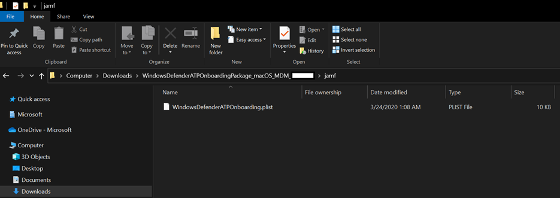
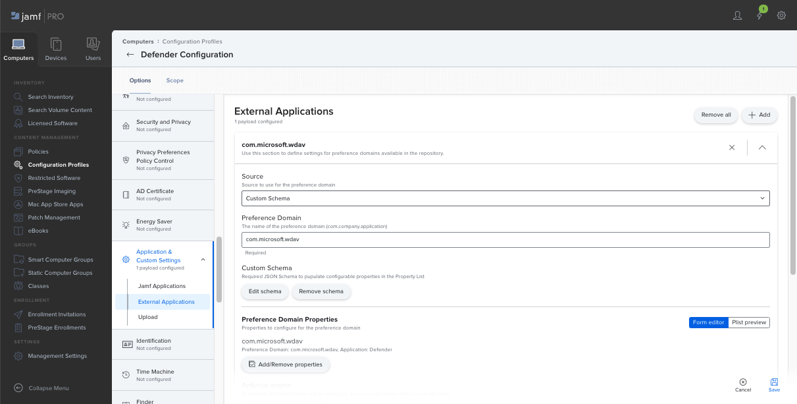
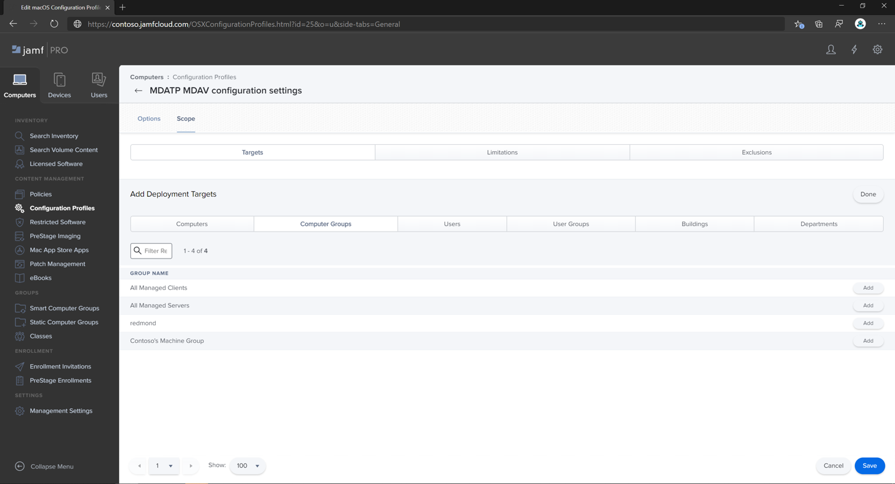
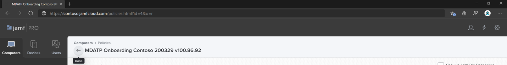

# <a name="set-up-the-microsoft-defender-for-endpoint-on-macos-policies-in-jamf-pro"></a><span data-ttu-id="263dc-104">Configurar las directivas de Microsoft Defender para endpoint en macOS en Jamf Pro</span><span class="sxs-lookup"><span data-stu-id="263dc-104">Set up the Microsoft Defender for Endpoint on macOS policies in Jamf Pro</span></span>

[!INCLUDE [Microsoft 365 Defender rebranding](../../includes/microsoft-defender.md)]


<span data-ttu-id="263dc-105">**Se aplica a:**</span><span class="sxs-lookup"><span data-stu-id="263dc-105">**Applies to:**</span></span>

- [<span data-ttu-id="263dc-106">Defender para endpoint en Mac</span><span class="sxs-lookup"><span data-stu-id="263dc-106">Defender for Endpoint on Mac</span></span>](microsoft-defender-endpoint-mac.md)

<span data-ttu-id="263dc-107">Esta página le guiará a través de los pasos que debe seguir para configurar directivas de macOS en Jamf Pro.</span><span class="sxs-lookup"><span data-stu-id="263dc-107">This page will guide you through the steps you need to take to set up macOS policies in Jamf Pro.</span></span>

<span data-ttu-id="263dc-108">Deberá seguir los pasos siguientes:</span><span class="sxs-lookup"><span data-stu-id="263dc-108">You'll need to take the following steps:</span></span>

1. [<span data-ttu-id="263dc-109">Obtener el paquete de incorporación de Microsoft Defender para endpoint</span><span class="sxs-lookup"><span data-stu-id="263dc-109">Get the Microsoft Defender for Endpoint onboarding package</span></span>](#step-1-get-the-microsoft-defender-for-endpoint-onboarding-package)

2. [<span data-ttu-id="263dc-110">Crear un perfil de configuración en Jamf Pro el paquete de incorporación</span><span class="sxs-lookup"><span data-stu-id="263dc-110">Create a configuration profile in Jamf Pro using the onboarding package</span></span>](#step-2-create-a-configuration-profile-in-jamf-pro-using-the-onboarding-package)

3. [<span data-ttu-id="263dc-111">Configurar Microsoft Defender para la configuración del punto de conexión</span><span class="sxs-lookup"><span data-stu-id="263dc-111">Configure Microsoft Defender for Endpoint settings</span></span>](#step-3-configure-microsoft-defender-for-endpoint-settings)

4. [<span data-ttu-id="263dc-112">Configurar Microsoft Defender para la configuración de notificación de extremo</span><span class="sxs-lookup"><span data-stu-id="263dc-112">Configure Microsoft Defender for Endpoint notification settings</span></span>](#step-4-configure-notifications-settings)

5. [<span data-ttu-id="263dc-113">Configurar Microsoft AutoUpdate (MAU)</span><span class="sxs-lookup"><span data-stu-id="263dc-113">Configure Microsoft AutoUpdate (MAU)</span></span>](#step-5-configure-microsoft-autoupdate-mau)

6. [<span data-ttu-id="263dc-114">Conceder acceso en disco completo a Microsoft Defender para endpoint</span><span class="sxs-lookup"><span data-stu-id="263dc-114">Grant full disk access to Microsoft Defender for Endpoint</span></span>](#step-6-grant-full-disk-access-to-microsoft-defender-for-endpoint)

7. [<span data-ttu-id="263dc-115">Aprobar extensión de kernel para Microsoft Defender para endpoint</span><span class="sxs-lookup"><span data-stu-id="263dc-115">Approve Kernel extension for Microsoft Defender for Endpoint</span></span>](#step-7-approve-kernel-extension-for-microsoft-defender-for-endpoint)

8. [<span data-ttu-id="263dc-116">Aprobar extensiones del sistema para Microsoft Defender para endpoint</span><span class="sxs-lookup"><span data-stu-id="263dc-116">Approve System extensions for Microsoft Defender for Endpoint</span></span>](#step-8-approve-system-extensions-for-microsoft-defender-for-endpoint)

9. [<span data-ttu-id="263dc-117">Configurar extensión de red</span><span class="sxs-lookup"><span data-stu-id="263dc-117">Configure Network Extension</span></span>](#step-9-configure-network-extension)

10. [<span data-ttu-id="263dc-118">Programar exámenes con Microsoft Defender para endpoint en macOS</span><span class="sxs-lookup"><span data-stu-id="263dc-118">Schedule scans with Microsoft Defender for Endpoint on macOS</span></span>](/windows/security/threat-protection/microsoft-defender-atp/mac-schedule-scan-atp)

11. [<span data-ttu-id="263dc-119">Implementar Microsoft Defender para endpoint en macOS</span><span class="sxs-lookup"><span data-stu-id="263dc-119">Deploy Microsoft Defender for Endpoint on macOS</span></span>](#step-11-deploy-microsoft-defender-for-endpoint-on-macos)


## <a name="step-1-get-the-microsoft-defender-for-endpoint-onboarding-package"></a><span data-ttu-id="263dc-120">Paso 1: Obtener el paquete de incorporación de Microsoft Defender para endpoint</span><span class="sxs-lookup"><span data-stu-id="263dc-120">Step 1: Get the Microsoft Defender for Endpoint onboarding package</span></span>

1. <span data-ttu-id="263dc-121">En [Centro de seguridad de Microsoft Defender](https://securitycenter.microsoft.com), vaya **a Configuración > Onboarding**.</span><span class="sxs-lookup"><span data-stu-id="263dc-121">In [Microsoft Defender Security Center](https://securitycenter.microsoft.com), navigate to **Settings > Onboarding**.</span></span>

2. <span data-ttu-id="263dc-122">Seleccione macOS como sistema operativo y Administración de dispositivos móviles /Microsoft Intune como método de implementación.</span><span class="sxs-lookup"><span data-stu-id="263dc-122">Select macOS as the operating system and Mobile Device Management / Microsoft Intune as the deployment method.</span></span>

    

3. <span data-ttu-id="263dc-124">Seleccione **Descargar paquete de incorporación** (WindowsDefenderATPOnboardingPackage.zip).</span><span class="sxs-lookup"><span data-stu-id="263dc-124">Select **Download onboarding package** (WindowsDefenderATPOnboardingPackage.zip).</span></span>

4. <span data-ttu-id="263dc-125">Extraer `WindowsDefenderATPOnboardingPackage.zip` .</span><span class="sxs-lookup"><span data-stu-id="263dc-125">Extract `WindowsDefenderATPOnboardingPackage.zip`.</span></span>

5. <span data-ttu-id="263dc-126">Copie el archivo en su ubicación preferida.</span><span class="sxs-lookup"><span data-stu-id="263dc-126">Copy the file to your preferred location.</span></span> <span data-ttu-id="263dc-127">Por ejemplo, `C:\Users\JaneDoe_or_JohnDoe.contoso\Downloads\WindowsDefenderATPOnboardingPackage_macOS_MDM_contoso\jamf\WindowsDefenderATPOnboarding.plist`.</span><span class="sxs-lookup"><span data-stu-id="263dc-127">For example,  `C:\Users\JaneDoe_or_JohnDoe.contoso\Downloads\WindowsDefenderATPOnboardingPackage_macOS_MDM_contoso\jamf\WindowsDefenderATPOnboarding.plist`.</span></span>


## <a name="step-2-create-a-configuration-profile-in-jamf-pro-using-the-onboarding-package"></a><span data-ttu-id="263dc-128">Paso 2: Crear un perfil de configuración en Jamf Pro el paquete de incorporación</span><span class="sxs-lookup"><span data-stu-id="263dc-128">Step 2: Create a configuration profile in Jamf Pro using the onboarding package</span></span>

1. <span data-ttu-id="263dc-129">Busque el archivo `WindowsDefenderATPOnboarding.plist` de la sección anterior.</span><span class="sxs-lookup"><span data-stu-id="263dc-129">Locate the file `WindowsDefenderATPOnboarding.plist` from the previous section.</span></span>

   


2. <span data-ttu-id="263dc-131">En el panel de Pro Jamf, seleccione **Nuevo**.</span><span class="sxs-lookup"><span data-stu-id="263dc-131">In the Jamf Pro dashboard, select **New**.</span></span>

    

3. <span data-ttu-id="263dc-133">Escriba los siguientes detalles:</span><span class="sxs-lookup"><span data-stu-id="263dc-133">Enter the following details:</span></span>

   <span data-ttu-id="263dc-134">**General**</span><span class="sxs-lookup"><span data-stu-id="263dc-134">**General**</span></span>
   - <span data-ttu-id="263dc-135">Nombre: incorporación de MDATP para macOS</span><span class="sxs-lookup"><span data-stu-id="263dc-135">Name: MDATP onboarding for macOS</span></span>
   - <span data-ttu-id="263dc-136">Descripción: MDATP EDR incorporación para macOS</span><span class="sxs-lookup"><span data-stu-id="263dc-136">Description: MDATP EDR onboarding for macOS</span></span>
   - <span data-ttu-id="263dc-137">Categoría: Ninguna</span><span class="sxs-lookup"><span data-stu-id="263dc-137">Category: None</span></span>
   - <span data-ttu-id="263dc-138">Método distribution: Install Automatically</span><span class="sxs-lookup"><span data-stu-id="263dc-138">Distribution Method: Install Automatically</span></span>
   - <span data-ttu-id="263dc-139">Nivel: Nivel de equipo</span><span class="sxs-lookup"><span data-stu-id="263dc-139">Level: Computer Level</span></span>

4. <span data-ttu-id="263dc-140">En **Application & Custom Configuración** seleccione **Configure**.</span><span class="sxs-lookup"><span data-stu-id="263dc-140">In **Application & Custom Settings** select **Configure**.</span></span>

    

5. <span data-ttu-id="263dc-142">Seleccione **Upload archivo (archivo PLIST)** y, a continuación, en **Dominio de preferencia** escriba: `com.microsoft.wdav.atp` .</span><span class="sxs-lookup"><span data-stu-id="263dc-142">Select **Upload File (PLIST file)** then in **Preference Domain** enter: `com.microsoft.wdav.atp`.</span></span>

    

    

6. <span data-ttu-id="263dc-145">Seleccione **Abrir** y seleccione el archivo de incorporación.</span><span class="sxs-lookup"><span data-stu-id="263dc-145">Select **Open** and select the onboarding file.</span></span>

    

7. <span data-ttu-id="263dc-147">Seleccione **Upload**.</span><span class="sxs-lookup"><span data-stu-id="263dc-147">Select **Upload**.</span></span>

    

8. <span data-ttu-id="263dc-149">Seleccione la **pestaña** Ámbito.</span><span class="sxs-lookup"><span data-stu-id="263dc-149">Select the **Scope** tab.</span></span>

    

9. <span data-ttu-id="263dc-151">Seleccione los equipos de destino.</span><span class="sxs-lookup"><span data-stu-id="263dc-151">Select the target computers.</span></span>

    

    

10. <span data-ttu-id="263dc-154">Seleccione **Guardar**.</span><span class="sxs-lookup"><span data-stu-id="263dc-154">Select **Save**.</span></span>

    

    

11. <span data-ttu-id="263dc-157">Seleccione **Listo**.</span><span class="sxs-lookup"><span data-stu-id="263dc-157">Select **Done**.</span></span>

    

    

## <a name="step-3-configure-microsoft-defender-for-endpoint-settings"></a><span data-ttu-id="263dc-160">Paso 3: Configurar Microsoft Defender para la configuración del punto de conexión</span><span class="sxs-lookup"><span data-stu-id="263dc-160">Step 3: Configure Microsoft Defender for Endpoint settings</span></span>

<span data-ttu-id="263dc-161">Puede usar JAMF Pro GUI para editar configuraciones individuales de la configuración de Microsoft Defender o usar el método heredado mediante la creación de un Plist de configuración en un editor de texto y la carga en JAMF Pro.</span><span class="sxs-lookup"><span data-stu-id="263dc-161">You can either use JAMF Pro GUI to edit individual settings of the Microsoft Defender configuration, or use the legacy method by creating a configuration Plist in a text editor, and uploading it to JAMF Pro.</span></span>

<span data-ttu-id="263dc-162">Tenga en cuenta que debe usar exactamente como dominio de preferencia `com.microsoft.wdav` , Microsoft Defender usa solo este nombre y para cargar su configuración  `com.microsoft.wdav.ext` administrada.</span><span class="sxs-lookup"><span data-stu-id="263dc-162">Note that you must use exact `com.microsoft.wdav` as the **Preference Domain**, Microsoft Defender uses only this name and `com.microsoft.wdav.ext` to load its managed settings!</span></span>

<span data-ttu-id="263dc-163">(La versión puede usarse en raras ocasiones cuando prefiera usar el método GUI, pero también necesita configurar una configuración que aún no se haya agregado al `com.microsoft.wdav.ext` esquema).</span><span class="sxs-lookup"><span data-stu-id="263dc-163">(The `com.microsoft.wdav.ext` version may be used in rare cases when you prefer to use GUI method, but also need to configure a setting that has not been added to the schema yet.)</span></span>

### <a name="gui-method"></a><span data-ttu-id="263dc-164">Método GUI</span><span class="sxs-lookup"><span data-stu-id="263dc-164">GUI method</span></span>

1. <span data-ttu-id="263dc-165">Descargue schema.jsarchivo desde el repositorio [de GitHub defender](https://github.com/microsoft/mdatp-xplat/tree/master/macos/schema) y guárdelo en un archivo local:</span><span class="sxs-lookup"><span data-stu-id="263dc-165">Download schema.json file from [Defender's GitHub repository](https://github.com/microsoft/mdatp-xplat/tree/master/macos/schema) and save it to a local file:</span></span>

    ```bash
    curl -o ~/Documents/schema.json https://raw.githubusercontent.com/microsoft/mdatp-xplat/master/macos/schema/schema.json
    ```

2. <span data-ttu-id="263dc-166">Cree un nuevo perfil de configuración en Equipos -> perfiles de configuración, escriba los siguientes detalles en la **ficha General:**</span><span class="sxs-lookup"><span data-stu-id="263dc-166">Create a new Configuration Profile under Computers -> Configuration Profiles, enter the following details on the **General** tab:</span></span>

    

    - <span data-ttu-id="263dc-168">Nombre: opciones de configuración de MDATP MDAV</span><span class="sxs-lookup"><span data-stu-id="263dc-168">Name: MDATP MDAV configuration settings</span></span>
    - <span data-ttu-id="263dc-169">Descripción:\<blank\></span><span class="sxs-lookup"><span data-stu-id="263dc-169">Description:\<blank\></span></span>
    - <span data-ttu-id="263dc-170">Categoría: Ninguno (predeterminado)</span><span class="sxs-lookup"><span data-stu-id="263dc-170">Category: None (default)</span></span>
    - <span data-ttu-id="263dc-171">Nivel: Nivel de equipo (predeterminado)</span><span class="sxs-lookup"><span data-stu-id="263dc-171">Level: Computer Level (default)</span></span>
    - <span data-ttu-id="263dc-172">Método Distribution: Instalar automáticamente (valor predeterminado)</span><span class="sxs-lookup"><span data-stu-id="263dc-172">Distribution Method: Install Automatically (default)</span></span>

3. <span data-ttu-id="263dc-173">Desplácese hacia abajo hasta la pestaña & **personalizado Configuración,** seleccione  Aplicaciones **externas,** haga clic en Agregar y use **el** esquema personalizado como origen para usarlo para el dominio de preferencia.</span><span class="sxs-lookup"><span data-stu-id="263dc-173">Scroll down to the **Application & Custom Settings** tab, select **External Applications**, click **Add** and use **Custom Schema** as Source to use for the preference domain.</span></span>

    

4. <span data-ttu-id="263dc-175">Escribe como dominio de preferencia, haz clic en Agregar esquema y Upload la schema.jsarchivo descargado `com.microsoft.wdav` en el paso 1.  </span><span class="sxs-lookup"><span data-stu-id="263dc-175">Enter `com.microsoft.wdav` as the Preference Domain, click on **Add Schema** and **Upload** the schema.json file downloaded on Step 1.</span></span> <span data-ttu-id="263dc-176">Haga clic en **Guardar**.</span><span class="sxs-lookup"><span data-stu-id="263dc-176">Click **Save**.</span></span>

    

5. <span data-ttu-id="263dc-178">Puede ver todas las opciones de configuración admitidas de Microsoft Defender a continuación, en **Propiedades del dominio de preferencia**.</span><span class="sxs-lookup"><span data-stu-id="263dc-178">You can see all supported Microsoft Defender configuration settings below, under **Preference Domain Properties**.</span></span> <span data-ttu-id="263dc-179">Haga **clic en Agregar o quitar propiedades** para seleccionar la configuración que desea administrar y haga clic en **Aceptar** para guardar los cambios.</span><span class="sxs-lookup"><span data-stu-id="263dc-179">Click **Add/Remove properties** to select the settings that you want to be managed, and click **Ok** to save your changes.</span></span> <span data-ttu-id="263dc-180">(Configuración izquierda no seleccionada no se incluirá en la configuración administrada, un usuario final podrá configurar dichas opciones en sus máquinas).</span><span class="sxs-lookup"><span data-stu-id="263dc-180">(Settings left unselected will not be included into the managed configuration, an end user will be able to configure those settings on their machines.)</span></span>

    

6. <span data-ttu-id="263dc-182">Cambie los valores de la configuración a los valores deseados.</span><span class="sxs-lookup"><span data-stu-id="263dc-182">Change values of the settings to desired values.</span></span> <span data-ttu-id="263dc-183">Puede hacer clic **en Más información para** obtener documentación sobre una configuración determinada.</span><span class="sxs-lookup"><span data-stu-id="263dc-183">You can click **More information** to get documentation for a particular setting.</span></span> <span data-ttu-id="263dc-184">(Puede hacer clic en **Vista previa de Plist** para inspeccionar cómo será la lista de configuración.</span><span class="sxs-lookup"><span data-stu-id="263dc-184">(You may click **Plist preview** to inspect what the configuration plist will look like.</span></span> <span data-ttu-id="263dc-185">Haga **clic en Editor** de formularios para volver al editor visual).</span><span class="sxs-lookup"><span data-stu-id="263dc-185">Click **Form editor** to return to the visual editor.)</span></span>

    

7. <span data-ttu-id="263dc-187">Seleccione la **pestaña** Ámbito.</span><span class="sxs-lookup"><span data-stu-id="263dc-187">Select the **Scope** tab.</span></span>

    

8. <span data-ttu-id="263dc-189">Seleccione **Grupo de máquinas de Contoso**.</span><span class="sxs-lookup"><span data-stu-id="263dc-189">Select **Contoso's Machine Group**.</span></span>

9. <span data-ttu-id="263dc-190">Seleccione **Agregar** y, a continuación, **seleccione Guardar**.</span><span class="sxs-lookup"><span data-stu-id="263dc-190">Select **Add**, then select **Save**.</span></span>

    

    

10. <span data-ttu-id="263dc-193">Seleccione **Listo**.</span><span class="sxs-lookup"><span data-stu-id="263dc-193">Select **Done**.</span></span> <span data-ttu-id="263dc-194">Verá el nuevo perfil **de configuración**.</span><span class="sxs-lookup"><span data-stu-id="263dc-194">You'll see the new **Configuration profile**.</span></span>

    

<span data-ttu-id="263dc-196">Microsoft Defender agrega nueva configuración con el tiempo.</span><span class="sxs-lookup"><span data-stu-id="263dc-196">Microsoft Defender adds new settings over time.</span></span> <span data-ttu-id="263dc-197">Esta nueva configuración se agregará al esquema y se publicará una nueva versión en Github.</span><span class="sxs-lookup"><span data-stu-id="263dc-197">These new settings will be added to the schema, and a new version will be published to Github.</span></span>
<span data-ttu-id="263dc-198">Todo lo que necesita hacer para tener actualizaciones es descargar un esquema actualizado, editar el perfil de configuración existente y **editar** el esquema en la pestaña Aplicación & configuración **Configuración** usuario.</span><span class="sxs-lookup"><span data-stu-id="263dc-198">All you need to do to have updates is to download an updated schema, edit existing configuration profile, and **Edit schema** at the **Application & Custom Settings** tab.</span></span>

### <a name="legacy-method"></a><span data-ttu-id="263dc-199">Método Legacy</span><span class="sxs-lookup"><span data-stu-id="263dc-199">Legacy method</span></span>

1. <span data-ttu-id="263dc-200">Use las siguientes opciones de configuración de Microsoft Defender para puntos de conexión:</span><span class="sxs-lookup"><span data-stu-id="263dc-200">Use the following Microsoft Defender for Endpoint configuration settings:</span></span>

    - <span data-ttu-id="263dc-201">enableRealTimeProtection</span><span class="sxs-lookup"><span data-stu-id="263dc-201">enableRealTimeProtection</span></span>
    - <span data-ttu-id="263dc-202">passiveMode</span><span class="sxs-lookup"><span data-stu-id="263dc-202">passiveMode</span></span>

    >[!NOTE]
    ><span data-ttu-id="263dc-203">No activado de forma predeterminada, si está planeando ejecutar un ANTIVIRUS de terceros para macOS, estafórlo en `true` .</span><span class="sxs-lookup"><span data-stu-id="263dc-203">Not turned on by default, if you are planning to run a third-party AV for macOS, set it to `true`.</span></span>

    - <span data-ttu-id="263dc-204">exclusiones</span><span class="sxs-lookup"><span data-stu-id="263dc-204">exclusions</span></span>
    - <span data-ttu-id="263dc-205">excludedPath</span><span class="sxs-lookup"><span data-stu-id="263dc-205">excludedPath</span></span>
    - <span data-ttu-id="263dc-206">excludedFileExtension</span><span class="sxs-lookup"><span data-stu-id="263dc-206">excludedFileExtension</span></span>
    - <span data-ttu-id="263dc-207">excludedFileName</span><span class="sxs-lookup"><span data-stu-id="263dc-207">excludedFileName</span></span>
    - <span data-ttu-id="263dc-208">exclusionsMergePolicy</span><span class="sxs-lookup"><span data-stu-id="263dc-208">exclusionsMergePolicy</span></span>
    - <span data-ttu-id="263dc-209">allowedThreats</span><span class="sxs-lookup"><span data-stu-id="263dc-209">allowedThreats</span></span>

    >[!NOTE]
    ><span data-ttu-id="263dc-210">EICAR está en la muestra, si está pasando por una prueba de concepto, quítela especialmente si está probando EICAR.</span><span class="sxs-lookup"><span data-stu-id="263dc-210">EICAR is on the sample, if you are going through a proof-of-concept, remove it especially if you are testing EICAR.</span></span>

    - <span data-ttu-id="263dc-211">disallowedThreatActions</span><span class="sxs-lookup"><span data-stu-id="263dc-211">disallowedThreatActions</span></span>
    - <span data-ttu-id="263dc-212">potentially_unwanted_application</span><span class="sxs-lookup"><span data-stu-id="263dc-212">potentially_unwanted_application</span></span>
    - <span data-ttu-id="263dc-213">archive_bomb</span><span class="sxs-lookup"><span data-stu-id="263dc-213">archive_bomb</span></span>
    - <span data-ttu-id="263dc-214">cloudService</span><span class="sxs-lookup"><span data-stu-id="263dc-214">cloudService</span></span>
    - <span data-ttu-id="263dc-215">automaticSampleSubmission</span><span class="sxs-lookup"><span data-stu-id="263dc-215">automaticSampleSubmission</span></span>
    - <span data-ttu-id="263dc-216">etiquetas</span><span class="sxs-lookup"><span data-stu-id="263dc-216">tags</span></span>
    - <span data-ttu-id="263dc-217">hideStatusMenuIcon</span><span class="sxs-lookup"><span data-stu-id="263dc-217">hideStatusMenuIcon</span></span>

     <span data-ttu-id="263dc-218">Para obtener información, vea [Lista de propiedades para el perfil de configuración de Jamf](mac-preferences.md#property-list-for-jamf-configuration-profile).</span><span class="sxs-lookup"><span data-stu-id="263dc-218">For information, see [Property list for Jamf configuration profile](mac-preferences.md#property-list-for-jamf-configuration-profile).</span></span>

     ```XML
     <?xml version="1.0" encoding="UTF-8"?>
     <!DOCTYPE plist PUBLIC "-//Apple//DTD PLIST 1.0//EN" "http://www.apple.com/DTDs/PropertyList-1.0.dtd">
     <plist version="1.0">
     <dict>
         <key>antivirusEngine</key>
         <dict>
             <key>enableRealTimeProtection</key>
             <true/>
             <key>passiveMode</key>
             <false/>
             <key>exclusions</key>
             <array>
                 <dict>
                     <key>$type</key>
                     <string>excludedPath</string>
                     <key>isDirectory</key>
                     <false/>
                     <key>path</key>
                     <string>/var/log/system.log</string>
                 </dict>
                 <dict>
                     <key>$type</key>
                     <string>excludedPath</string>
                     <key>isDirectory</key>
                     <true/>
                     <key>path</key>
                     <string>/home</string>
                 </dict>
                 <dict>
                     <key>$type</key>
                     <string>excludedFileExtension</string>
                     <key>extension</key>
                     <string>pdf</string>
                 </dict>
                 <dict>
                     <key>$type</key>
                     <string>excludedFileName</string>
                     <key>name</key>
                     <string>cat</string>
                 </dict>
             </array>
             <key>exclusionsMergePolicy</key>
             <string>merge</string>
             <key>allowedThreats</key>
             <array>
                 <string>EICAR-Test-File (not a virus)</string>
             </array>
             <key>disallowedThreatActions</key>
             <array>
                 <string>allow</string>
                 <string>restore</string>
             </array>
             <key>threatTypeSettings</key>
             <array>
                 <dict>
                     <key>key</key>
                     <string>potentially_unwanted_application</string>
                     <key>value</key>
                     <string>block</string>
                 </dict>
                 <dict>
                     <key>key</key>
                     <string>archive_bomb</string>
                     <key>value</key>
                     <string>audit</string>
                 </dict>
             </array>
             <key>threatTypeSettingsMergePolicy</key>
             <string>merge</string>
         </dict>
         <key>cloudService</key>
         <dict>
             <key>enabled</key>
             <true/>
             <key>diagnosticLevel</key>
             <string>optional</string>
             <key>automaticSampleSubmission</key>
             <true/>
         </dict>
         <key>edr</key>
         <dict>
             <key>tags</key>
             <array>
                 <dict>
                     <key>key</key>
                     <string>GROUP</string>
                     <key>value</key>
                     <string>ExampleTag</string>
                 </dict>
             </array>
         </dict>
         <key>userInterface</key>
         <dict>
             <key>hideStatusMenuIcon</key>
             <false/>
         </dict>
     </dict>
     </plist>
     ```

2. <span data-ttu-id="263dc-219">Guarde el archivo como `MDATP_MDAV_configuration_settings.plist` .</span><span class="sxs-lookup"><span data-stu-id="263dc-219">Save the file as `MDATP_MDAV_configuration_settings.plist`.</span></span>

3. <span data-ttu-id="263dc-220">En el panel de Pro Jamf, abra **Equipos** y allí **Perfiles de configuración**.</span><span class="sxs-lookup"><span data-stu-id="263dc-220">In the Jamf Pro dashboard, open **Computers**, and there **Configuration Profiles**.</span></span> <span data-ttu-id="263dc-221">Haga clic en \**Nuevo(* y cambie a la **pestaña General.**</span><span class="sxs-lookup"><span data-stu-id="263dc-221">Click \**New(* and switch to the **General** tab.</span></span>

    

4. <span data-ttu-id="263dc-223">Escriba los siguientes detalles:</span><span class="sxs-lookup"><span data-stu-id="263dc-223">Enter the following details:</span></span>

    <span data-ttu-id="263dc-224">**General**</span><span class="sxs-lookup"><span data-stu-id="263dc-224">**General**</span></span>

    - <span data-ttu-id="263dc-225">Nombre: opciones de configuración de MDATP MDAV</span><span class="sxs-lookup"><span data-stu-id="263dc-225">Name: MDATP MDAV configuration settings</span></span>
    - <span data-ttu-id="263dc-226">Descripción:\<blank\></span><span class="sxs-lookup"><span data-stu-id="263dc-226">Description:\<blank\></span></span>
    - <span data-ttu-id="263dc-227">Categoría: Ninguno (predeterminado)</span><span class="sxs-lookup"><span data-stu-id="263dc-227">Category: None (default)</span></span>
    - <span data-ttu-id="263dc-228">Método distribution: Install Automatically (default)</span><span class="sxs-lookup"><span data-stu-id="263dc-228">Distribution Method: Install Automatically(default)</span></span>
    - <span data-ttu-id="263dc-229">Nivel: Nivel del equipo (predeterminado)</span><span class="sxs-lookup"><span data-stu-id="263dc-229">Level: Computer Level(default)</span></span>

    

5. <span data-ttu-id="263dc-231">En **Application & Custom Configuración** seleccione **Configure**.</span><span class="sxs-lookup"><span data-stu-id="263dc-231">In **Application & Custom Settings** select **Configure**.</span></span>

    

6. <span data-ttu-id="263dc-233">Seleccione **Upload archivo (archivo PLIST).**</span><span class="sxs-lookup"><span data-stu-id="263dc-233">Select **Upload File (PLIST file)**.</span></span>

    

7. <span data-ttu-id="263dc-235">En **Dominio de preferencias,** escriba , `com.microsoft.wdav` a **continuación, seleccione Upload archivo PLIST**.</span><span class="sxs-lookup"><span data-stu-id="263dc-235">In **Preferences Domain**, enter `com.microsoft.wdav`, then select  **Upload PLIST File**.</span></span>

    

8. <span data-ttu-id="263dc-237">Seleccione **Elegir archivo**.</span><span class="sxs-lookup"><span data-stu-id="263dc-237">Select **Choose File**.</span></span>

    

9. <span data-ttu-id="263dc-239">Seleccione el **MDATP_MDAV_configuration_settings.plist** y, a continuación, **seleccione Abrir**.</span><span class="sxs-lookup"><span data-stu-id="263dc-239">Select the **MDATP_MDAV_configuration_settings.plist**, then select **Open**.</span></span>

    

10. <span data-ttu-id="263dc-241">Seleccione **Upload**.</span><span class="sxs-lookup"><span data-stu-id="263dc-241">Select **Upload**.</span></span>

    

    

    >[!NOTE]
    ><span data-ttu-id="263dc-244">Si se carga el archivo de Intune, se producirá el siguiente error:</span><span class="sxs-lookup"><span data-stu-id="263dc-244">If you happen to upload the Intune file, you'll get the following error:</span></span><br>
    ><span data-ttu-id="263dc-245"></span><span class="sxs-lookup"><span data-stu-id="263dc-245"></span></span>


11. <span data-ttu-id="263dc-246">Seleccione **Guardar**.</span><span class="sxs-lookup"><span data-stu-id="263dc-246">Select **Save**.</span></span>

    

12. <span data-ttu-id="263dc-248">El archivo se carga.</span><span class="sxs-lookup"><span data-stu-id="263dc-248">The file is uploaded.</span></span>

    

    

13. <span data-ttu-id="263dc-251">Seleccione la **pestaña** Ámbito.</span><span class="sxs-lookup"><span data-stu-id="263dc-251">Select the **Scope** tab.</span></span>

    

14. <span data-ttu-id="263dc-253">Seleccione **Grupo de máquinas de Contoso**.</span><span class="sxs-lookup"><span data-stu-id="263dc-253">Select **Contoso's Machine Group**.</span></span>

15. <span data-ttu-id="263dc-254">Seleccione **Agregar** y, a continuación, **seleccione Guardar**.</span><span class="sxs-lookup"><span data-stu-id="263dc-254">Select **Add**, then select **Save**.</span></span>

    

    

16. <span data-ttu-id="263dc-257">Seleccione **Listo**.</span><span class="sxs-lookup"><span data-stu-id="263dc-257">Select **Done**.</span></span> <span data-ttu-id="263dc-258">Verá el nuevo perfil **de configuración**.</span><span class="sxs-lookup"><span data-stu-id="263dc-258">You'll see the new **Configuration profile**.</span></span>

    

## <a name="step-4-configure-notifications-settings"></a><span data-ttu-id="263dc-260">Paso 4: Configurar la configuración de notificaciones</span><span class="sxs-lookup"><span data-stu-id="263dc-260">Step 4: Configure notifications settings</span></span>

<span data-ttu-id="263dc-261">Estos pasos son aplicables a macOS 10.15 (Catalina) o versiones posteriores.</span><span class="sxs-lookup"><span data-stu-id="263dc-261">These steps are applicable of macOS 10.15 (Catalina) or newer.</span></span>

1. <span data-ttu-id="263dc-262">En el panel de Pro Jamf, seleccione **Equipos** y, a continuación, **Perfiles de configuración.**</span><span class="sxs-lookup"><span data-stu-id="263dc-262">In the Jamf Pro dashboard, select **Computers**, then **Configuration Profiles**.</span></span>

2. <span data-ttu-id="263dc-263">Haga **clic en** Nuevo y escriba los siguientes detalles para **Opciones:**</span><span class="sxs-lookup"><span data-stu-id="263dc-263">Click **New**, and enter the following details for **Options**:</span></span>

    - <span data-ttu-id="263dc-264">Ficha **General**:</span><span class="sxs-lookup"><span data-stu-id="263dc-264">Tab **General**:</span></span>
        - <span data-ttu-id="263dc-265">**Nombre:** configuración de notificación MDATP MDAV</span><span class="sxs-lookup"><span data-stu-id="263dc-265">**Name**: MDATP MDAV Notification settings</span></span>
        - <span data-ttu-id="263dc-266">**Descripción:** macOS 10.15 (Catalina) o posterior</span><span class="sxs-lookup"><span data-stu-id="263dc-266">**Description**: macOS 10.15 (Catalina) or newer</span></span>
        - <span data-ttu-id="263dc-267">**Categoría**: None *(valor predeterminado)*</span><span class="sxs-lookup"><span data-stu-id="263dc-267">**Category**: None *(default)*</span></span>
        - <span data-ttu-id="263dc-268">**Método Distribution:** Instalar automáticamente *(predeterminado)*</span><span class="sxs-lookup"><span data-stu-id="263dc-268">**Distribution Method**: Install Automatically *(default)*</span></span>
        - <span data-ttu-id="263dc-269">**Nivel:** Nivel de equipo *(predeterminado)*</span><span class="sxs-lookup"><span data-stu-id="263dc-269">**Level**: Computer Level *(default)*</span></span>

        

    - <span data-ttu-id="263dc-271">Tab **Notifications**, click **Add** y escriba los siguientes valores:</span><span class="sxs-lookup"><span data-stu-id="263dc-271">Tab **Notifications**, click **Add**, and enter the following values:</span></span>
        - <span data-ttu-id="263dc-272">**Id. de agrupación:**`com.microsoft.wdav.tray`</span><span class="sxs-lookup"><span data-stu-id="263dc-272">**Bundle ID**: `com.microsoft.wdav.tray`</span></span>
        - <span data-ttu-id="263dc-273">**Alertas críticas:** haga clic **en Deshabilitar**</span><span class="sxs-lookup"><span data-stu-id="263dc-273">**Critical Alerts**: Click **Disable**</span></span>
        - <span data-ttu-id="263dc-274">**Notificaciones:** haga clic en **Habilitar**</span><span class="sxs-lookup"><span data-stu-id="263dc-274">**Notifications**: Click **Enable**</span></span>
        - <span data-ttu-id="263dc-275">**Tipo de alerta de banner:** Seleccione **Incluir** y **Temporal** *(predeterminado)*</span><span class="sxs-lookup"><span data-stu-id="263dc-275">**Banner alert type**: Select **Include** and **Temporary** *(default)*</span></span>
        - <span data-ttu-id="263dc-276">**Notificaciones en la pantalla de bloqueo:** Haga clic **en Ocultar**</span><span class="sxs-lookup"><span data-stu-id="263dc-276">**Notifications on lock screen**: Click **Hide**</span></span>
        - <span data-ttu-id="263dc-277">**Notificaciones en el Centro de notificaciones:** haga clic en **Mostrar**</span><span class="sxs-lookup"><span data-stu-id="263dc-277">**Notifications in Notification Center**: Click **Display**</span></span>
        - <span data-ttu-id="263dc-278">**Icono de aplicación de distintivo:** Haga clic en **Mostrar**</span><span class="sxs-lookup"><span data-stu-id="263dc-278">**Badge app icon**: Click **Display**</span></span>

        

    - <span data-ttu-id="263dc-280">Tab **Notifications**, click **Add** one more time, scroll down to **New Notifications Configuración**</span><span class="sxs-lookup"><span data-stu-id="263dc-280">Tab **Notifications**, click **Add** one more time, scroll down to **New Notifications Settings**</span></span>
        - <span data-ttu-id="263dc-281">**Id. de agrupación:**`com.microsoft.autoupdate2`</span><span class="sxs-lookup"><span data-stu-id="263dc-281">**Bundle ID**: `com.microsoft.autoupdate2`</span></span>
        - <span data-ttu-id="263dc-282">Configure el resto de la configuración en los mismos valores anteriores</span><span class="sxs-lookup"><span data-stu-id="263dc-282">Configure the rest of the settings to the same values as above</span></span>

        

        <span data-ttu-id="263dc-284">Ten en cuenta que ahora tienes dos "tablas" con configuraciones de notificación, una para id. de **agrupación: com.microsoft.wdav.tray** y otra para id. de **lote: com.microsoft.autoupdate2**.</span><span class="sxs-lookup"><span data-stu-id="263dc-284">Note that now you have two 'tables' with notification configurations, one for **Bundle ID: com.microsoft.wdav.tray**, and another for **Bundle ID: com.microsoft.autoupdate2**.</span></span> <span data-ttu-id="263dc-285">Aunque puede configurar la configuración de alertas según sus **requisitos,** los IDs de agrupación deben ser exactamente los mismos que se han descrito anteriormente y el modificador **Include** debe estar **En** para notificaciones.</span><span class="sxs-lookup"><span data-stu-id="263dc-285">While you can configure alert settings per your requirements, Bundle IDs must be exactly the same as described before, and **Include** switch must be **On** for **Notifications**.</span></span>

3. <span data-ttu-id="263dc-286">Seleccione la **pestaña Ámbito** y, a continuación, **seleccione Agregar**.</span><span class="sxs-lookup"><span data-stu-id="263dc-286">Select the **Scope** tab, then select **Add**.</span></span>

    

4. <span data-ttu-id="263dc-288">Seleccione **Grupo de máquinas de Contoso**.</span><span class="sxs-lookup"><span data-stu-id="263dc-288">Select **Contoso's Machine Group**.</span></span>

5. <span data-ttu-id="263dc-289">Seleccione **Agregar** y, a continuación, **seleccione Guardar**.</span><span class="sxs-lookup"><span data-stu-id="263dc-289">Select **Add**, then select **Save**.</span></span>

    

    

6. <span data-ttu-id="263dc-292">Seleccione **Listo**.</span><span class="sxs-lookup"><span data-stu-id="263dc-292">Select **Done**.</span></span> <span data-ttu-id="263dc-293">Verá el nuevo perfil **de configuración**.</span><span class="sxs-lookup"><span data-stu-id="263dc-293">You'll see the new **Configuration profile**.</span></span>
    <span data-ttu-id="263dc-294"></span><span class="sxs-lookup"><span data-stu-id="263dc-294"></span></span>

## <a name="step-5-configure-microsoft-autoupdate-mau"></a><span data-ttu-id="263dc-295">Paso 5: Configurar Microsoft AutoUpdate (MAU)</span><span class="sxs-lookup"><span data-stu-id="263dc-295">Step 5: Configure Microsoft AutoUpdate (MAU)</span></span>

1. <span data-ttu-id="263dc-296">Use las siguientes opciones de configuración de Microsoft Defender para puntos de conexión:</span><span class="sxs-lookup"><span data-stu-id="263dc-296">Use the following Microsoft Defender for Endpoint configuration settings:</span></span>

      ```XML
   <?xml version="1.0" encoding="UTF-8"?>
   <!DOCTYPE plist PUBLIC "-//Apple//DTD PLIST 1.0//EN" "http://www.apple.com/DTDs/PropertyList-1.0.dtd">
   <plist version="1.0">
   <dict>
    <key>ChannelName</key>
    <string>Current</string>
    <key>HowToCheck</key>
    <string>AutomaticDownload</string>
    <key>EnableCheckForUpdatesButton</key>
    <true/>
    <key>DisableInsiderCheckbox</key>
    <false/>
    <key>SendAllTelemetryEnabled</key>
    <true/>
   </dict>
   </plist>
   ```

2. <span data-ttu-id="263dc-297">Guárdelo como `MDATP_MDAV_MAU_settings.plist` .</span><span class="sxs-lookup"><span data-stu-id="263dc-297">Save it as `MDATP_MDAV_MAU_settings.plist`.</span></span>

3. <span data-ttu-id="263dc-298">En el panel de Pro Jamf, seleccione **General**.</span><span class="sxs-lookup"><span data-stu-id="263dc-298">In the Jamf Pro dashboard, select **General**.</span></span>

    

4. <span data-ttu-id="263dc-300">Escriba los siguientes detalles:</span><span class="sxs-lookup"><span data-stu-id="263dc-300">Enter the following details:</span></span>

    <span data-ttu-id="263dc-301">**General**</span><span class="sxs-lookup"><span data-stu-id="263dc-301">**General**</span></span>

    - <span data-ttu-id="263dc-302">Nombre: configuración de MDATP MDAV MAU</span><span class="sxs-lookup"><span data-stu-id="263dc-302">Name: MDATP MDAV MAU settings</span></span>
    - <span data-ttu-id="263dc-303">Descripción: Configuración de Microsoft AutoUpdate para MDATP para macOS</span><span class="sxs-lookup"><span data-stu-id="263dc-303">Description: Microsoft AutoUpdate settings for MDATP for macOS</span></span>
    - <span data-ttu-id="263dc-304">Categoría: Ninguno (predeterminado)</span><span class="sxs-lookup"><span data-stu-id="263dc-304">Category: None (default)</span></span>
    - <span data-ttu-id="263dc-305">Método distribution: Install Automatically (default)</span><span class="sxs-lookup"><span data-stu-id="263dc-305">Distribution Method: Install Automatically(default)</span></span>
    - <span data-ttu-id="263dc-306">Nivel: Nivel del equipo (predeterminado)</span><span class="sxs-lookup"><span data-stu-id="263dc-306">Level: Computer Level(default)</span></span>

5. <span data-ttu-id="263dc-307">En **Application & Custom Configuración** seleccione **Configure**.</span><span class="sxs-lookup"><span data-stu-id="263dc-307">In **Application & Custom Settings** select **Configure**.</span></span>

    

6. <span data-ttu-id="263dc-309">Seleccione **Upload archivo (archivo PLIST).**</span><span class="sxs-lookup"><span data-stu-id="263dc-309">Select **Upload File (PLIST file)**.</span></span>

    

7. <span data-ttu-id="263dc-311">En **Dominio de preferencia** escriba: , luego seleccione Upload archivo `com.microsoft.autoupdate2` **PLIST**.</span><span class="sxs-lookup"><span data-stu-id="263dc-311">In **Preference Domain** enter: `com.microsoft.autoupdate2`, then select **Upload PLIST File**.</span></span>

    

8. <span data-ttu-id="263dc-313">Seleccione **Elegir archivo**.</span><span class="sxs-lookup"><span data-stu-id="263dc-313">Select **Choose File**.</span></span>

    

9. <span data-ttu-id="263dc-315">Seleccione **MDATP_MDAV_MAU_settings.plist**.</span><span class="sxs-lookup"><span data-stu-id="263dc-315">Select **MDATP_MDAV_MAU_settings.plist**.</span></span>

    

10. <span data-ttu-id="263dc-317">Seleccione **Upload**.</span><span class="sxs-lookup"><span data-stu-id="263dc-317">Select **Upload**.</span></span>
    <span data-ttu-id="263dc-318"></span><span class="sxs-lookup"><span data-stu-id="263dc-318"></span></span>

    

11. <span data-ttu-id="263dc-320">Seleccione **Guardar**.</span><span class="sxs-lookup"><span data-stu-id="263dc-320">Select **Save**.</span></span>

    

12. <span data-ttu-id="263dc-322">Seleccione la **pestaña** Ámbito.</span><span class="sxs-lookup"><span data-stu-id="263dc-322">Select the **Scope** tab.</span></span>

     

13. <span data-ttu-id="263dc-324">Seleccione **Agregar**.</span><span class="sxs-lookup"><span data-stu-id="263dc-324">Select **Add**.</span></span>

    

    

    

14. <span data-ttu-id="263dc-328">Seleccione **Listo**.</span><span class="sxs-lookup"><span data-stu-id="263dc-328">Select **Done**.</span></span>

    

## <a name="step-6-grant-full-disk-access-to-microsoft-defender-for-endpoint"></a><span data-ttu-id="263dc-330">Paso 6: Conceder acceso en disco completo a Microsoft Defender para endpoint</span><span class="sxs-lookup"><span data-stu-id="263dc-330">Step 6: Grant full disk access to Microsoft Defender for Endpoint</span></span>

1. <span data-ttu-id="263dc-331">En el panel de Pro Jamf, seleccione **Perfiles de configuración**.</span><span class="sxs-lookup"><span data-stu-id="263dc-331">In the Jamf Pro dashboard, select **Configuration Profiles**.</span></span>

    

2. <span data-ttu-id="263dc-333">Seleccione **+ Nuevo**.</span><span class="sxs-lookup"><span data-stu-id="263dc-333">Select **+ New**.</span></span>

3. <span data-ttu-id="263dc-334">Escriba los siguientes detalles:</span><span class="sxs-lookup"><span data-stu-id="263dc-334">Enter the following details:</span></span>

    <span data-ttu-id="263dc-335">**General**</span><span class="sxs-lookup"><span data-stu-id="263dc-335">**General**</span></span>
    - <span data-ttu-id="263dc-336">Nombre: MDATP MDAV: conceder acceso en disco completo a EDR y AV</span><span class="sxs-lookup"><span data-stu-id="263dc-336">Name: MDATP MDAV - grant Full Disk Access to EDR and AV</span></span>
    - <span data-ttu-id="263dc-337">Descripción: en macOS Catalina o versiones posteriores, el nuevo control de directiva de preferencias de privacidad</span><span class="sxs-lookup"><span data-stu-id="263dc-337">Description: On macOS Catalina or newer, the new Privacy Preferences Policy Control</span></span>
    - <span data-ttu-id="263dc-338">Categoría: Ninguna</span><span class="sxs-lookup"><span data-stu-id="263dc-338">Category: None</span></span>
    - <span data-ttu-id="263dc-339">Método de distribución: Instalar automáticamente</span><span class="sxs-lookup"><span data-stu-id="263dc-339">Distribution method: Install Automatically</span></span>
    - <span data-ttu-id="263dc-340">Nivel: nivel de equipo</span><span class="sxs-lookup"><span data-stu-id="263dc-340">Level: Computer level</span></span>


    

4. <span data-ttu-id="263dc-342">En **Configurar el control de directiva de preferencias de privacidad,** seleccione **Configurar**.</span><span class="sxs-lookup"><span data-stu-id="263dc-342">In **Configure Privacy Preferences Policy Control** select **Configure**.</span></span>

    

5. <span data-ttu-id="263dc-344">En **Control de directiva de preferencias de** privacidad, escriba los siguientes detalles:</span><span class="sxs-lookup"><span data-stu-id="263dc-344">In **Privacy Preferences Policy Control**, enter the following details:</span></span>

    - <span data-ttu-id="263dc-345">Identificador: `com.microsoft.wdav`</span><span class="sxs-lookup"><span data-stu-id="263dc-345">Identifier: `com.microsoft.wdav`</span></span>
    - <span data-ttu-id="263dc-346">Tipo de identificador: Id. de agrupación</span><span class="sxs-lookup"><span data-stu-id="263dc-346">Identifier Type: Bundle ID</span></span>
    - <span data-ttu-id="263dc-347">Requisito de código: `identifier "com.microsoft.wdav" and anchor apple generic and certificate 1[field.1.2.840.113635.100.6.2.6] /* exists */ and certificate leaf[field.1.2.840.113635.100.6.1.13] /* exists */ and certificate leaf[subject.OU] = UBF8T346G9`</span><span class="sxs-lookup"><span data-stu-id="263dc-347">Code Requirement: `identifier "com.microsoft.wdav" and anchor apple generic and certificate 1[field.1.2.840.113635.100.6.2.6] /* exists */ and certificate leaf[field.1.2.840.113635.100.6.1.13] /* exists */ and certificate leaf[subject.OU] = UBF8T346G9`</span></span>


    

6. <span data-ttu-id="263dc-349">Seleccione **+ Agregar**.</span><span class="sxs-lookup"><span data-stu-id="263dc-349">Select **+ Add**.</span></span>

    

    - <span data-ttu-id="263dc-351">En Aplicación o servicio: Establecer en **SystemPolicyAllFiles**</span><span class="sxs-lookup"><span data-stu-id="263dc-351">Under App or service: Set to **SystemPolicyAllFiles**</span></span>

    - <span data-ttu-id="263dc-352">En "access": Set to **Allow**</span><span class="sxs-lookup"><span data-stu-id="263dc-352">Under "access": Set to **Allow**</span></span>

7. <span data-ttu-id="263dc-353">Seleccione **Guardar** (no el que se encuentra en la parte inferior derecha).</span><span class="sxs-lookup"><span data-stu-id="263dc-353">Select **Save** (not the one at the bottom right).</span></span>

    

8. <span data-ttu-id="263dc-355">Haga clic `+` en el signo situado junto a App **Access** para agregar una nueva entrada.</span><span class="sxs-lookup"><span data-stu-id="263dc-355">Click the `+` sign next to **App Access** to add a new entry.</span></span>

    

9. <span data-ttu-id="263dc-357">Escriba los siguientes detalles:</span><span class="sxs-lookup"><span data-stu-id="263dc-357">Enter the following details:</span></span>

    - <span data-ttu-id="263dc-358">Identificador: `com.microsoft.wdav.epsext`</span><span class="sxs-lookup"><span data-stu-id="263dc-358">Identifier: `com.microsoft.wdav.epsext`</span></span>
    - <span data-ttu-id="263dc-359">Tipo de identificador: Id. de agrupación</span><span class="sxs-lookup"><span data-stu-id="263dc-359">Identifier Type: Bundle ID</span></span>
    - <span data-ttu-id="263dc-360">Requisito de código: `identifier "com.microsoft.wdav.epsext" and anchor apple generic and certificate 1[field.1.2.840.113635.100.6.2.6] /* exists */ and certificate leaf[field.1.2.840.113635.100.6.1.13] /* exists */ and certificate leaf[subject.OU] = UBF8T346G9`</span><span class="sxs-lookup"><span data-stu-id="263dc-360">Code Requirement: `identifier "com.microsoft.wdav.epsext" and anchor apple generic and certificate 1[field.1.2.840.113635.100.6.2.6] /* exists */ and certificate leaf[field.1.2.840.113635.100.6.1.13] /* exists */ and certificate leaf[subject.OU] = UBF8T346G9`</span></span>

10. <span data-ttu-id="263dc-361">Seleccione **+ Agregar**.</span><span class="sxs-lookup"><span data-stu-id="263dc-361">Select **+ Add**.</span></span>

    

    - <span data-ttu-id="263dc-363">En Aplicación o servicio: Establecer en **SystemPolicyAllFiles**</span><span class="sxs-lookup"><span data-stu-id="263dc-363">Under App or service: Set to **SystemPolicyAllFiles**</span></span>

    - <span data-ttu-id="263dc-364">En "access": Set to **Allow**</span><span class="sxs-lookup"><span data-stu-id="263dc-364">Under "access": Set to **Allow**</span></span>

11. <span data-ttu-id="263dc-365">Seleccione **Guardar** (no el que se encuentra en la parte inferior derecha).</span><span class="sxs-lookup"><span data-stu-id="263dc-365">Select **Save** (not the one at the bottom right).</span></span>

    

12. <span data-ttu-id="263dc-367">Seleccione la **pestaña** Ámbito.</span><span class="sxs-lookup"><span data-stu-id="263dc-367">Select the **Scope** tab.</span></span>

    

13. <span data-ttu-id="263dc-369">Seleccione **+ Agregar**.</span><span class="sxs-lookup"><span data-stu-id="263dc-369">Select **+ Add**.</span></span>

    

14. <span data-ttu-id="263dc-371">Seleccione **Grupos de** equipos > en Nombre **de** grupo > seleccione **MachineGroup de Contoso**.</span><span class="sxs-lookup"><span data-stu-id="263dc-371">Select **Computer Groups** > under **Group Name** > select **Contoso's MachineGroup**.</span></span>

    

15. <span data-ttu-id="263dc-373">Seleccione **Agregar**.</span><span class="sxs-lookup"><span data-stu-id="263dc-373">Select **Add**.</span></span>

16. <span data-ttu-id="263dc-374">Seleccione **Guardar**.</span><span class="sxs-lookup"><span data-stu-id="263dc-374">Select **Save**.</span></span>

17. <span data-ttu-id="263dc-375">Seleccione **Listo**.</span><span class="sxs-lookup"><span data-stu-id="263dc-375">Select **Done**.</span></span>

    

    

<span data-ttu-id="263dc-378">Como alternativa, puede descargar [fulldisk.mobileconfig](https://github.com/microsoft/mdatp-xplat/blob/master/macos/mobileconfig/profiles/fulldisk.mobileconfig) y cargarlo en los perfiles de configuración de JAMF, como se describe en [Deploying Custom Configuration Profiles using Jamf Pro| Método 2: Upload un perfil de configuración a Jamf Pro](https://www.jamf.com/jamf-nation/articles/648/deploying-custom-configuration-profiles-using-jamf-pro).</span><span class="sxs-lookup"><span data-stu-id="263dc-378">Alternatively, you can download [fulldisk.mobileconfig](https://github.com/microsoft/mdatp-xplat/blob/master/macos/mobileconfig/profiles/fulldisk.mobileconfig) and upload it to JAMF Configuration Profiles as described in [Deploying Custom Configuration Profiles using Jamf Pro|Method 2: Upload a Configuration Profile to Jamf Pro](https://www.jamf.com/jamf-nation/articles/648/deploying-custom-configuration-profiles-using-jamf-pro).</span></span>

## <a name="step-7-approve-kernel-extension-for-microsoft-defender-for-endpoint"></a><span data-ttu-id="263dc-379">Paso 7: Aprobar extensión de kernel para Microsoft Defender para endpoint</span><span class="sxs-lookup"><span data-stu-id="263dc-379">Step 7: Approve Kernel extension for Microsoft Defender for Endpoint</span></span>

> [!CAUTION]
> <span data-ttu-id="263dc-380">Los dispositivos Apple Silicon (M1) no son compatibles con KEXT.</span><span class="sxs-lookup"><span data-stu-id="263dc-380">Apple Silicon (M1) devices do not support KEXT.</span></span> <span data-ttu-id="263dc-381">La instalación de un perfil de configuración que consta de directivas KEXT producirá un error en estos dispositivos.</span><span class="sxs-lookup"><span data-stu-id="263dc-381">Installation of a configuration profile consisting KEXT policies will fail on these devices.</span></span>

1. <span data-ttu-id="263dc-382">En **perfiles de configuración,** seleccione **+ Nuevo**.</span><span class="sxs-lookup"><span data-stu-id="263dc-382">In the **Configuration Profiles**, select **+ New**.</span></span>

    

2. <span data-ttu-id="263dc-384">Escriba los siguientes detalles:</span><span class="sxs-lookup"><span data-stu-id="263dc-384">Enter the following details:</span></span>

    <span data-ttu-id="263dc-385">**General**</span><span class="sxs-lookup"><span data-stu-id="263dc-385">**General**</span></span>

    - <span data-ttu-id="263dc-386">Nombre: MDATP MDAV Kernel Extension</span><span class="sxs-lookup"><span data-stu-id="263dc-386">Name: MDATP MDAV Kernel Extension</span></span>
    - <span data-ttu-id="263dc-387">Descripción: extensión de kernel MDATP (kext)</span><span class="sxs-lookup"><span data-stu-id="263dc-387">Description: MDATP kernel extension (kext)</span></span>
    - <span data-ttu-id="263dc-388">Categoría: Ninguna</span><span class="sxs-lookup"><span data-stu-id="263dc-388">Category: None</span></span>
    - <span data-ttu-id="263dc-389">Método distribution: Install Automatically</span><span class="sxs-lookup"><span data-stu-id="263dc-389">Distribution Method: Install Automatically</span></span>
    - <span data-ttu-id="263dc-390">Nivel: Nivel de equipo</span><span class="sxs-lookup"><span data-stu-id="263dc-390">Level: Computer Level</span></span>

    

3. <span data-ttu-id="263dc-392">En **Configurar extensiones de kernel aprobadas,** seleccione **Configurar**.</span><span class="sxs-lookup"><span data-stu-id="263dc-392">In **Configure Approved Kernel Extensions** select **Configure**.</span></span>

    


4. <span data-ttu-id="263dc-394">En **Extensiones de kernel aprobadas,** escriba los siguientes detalles:</span><span class="sxs-lookup"><span data-stu-id="263dc-394">In **Approved Kernel Extensions** Enter the following details:</span></span>

    - <span data-ttu-id="263dc-395">Nombre para mostrar: Microsoft Corp.</span><span class="sxs-lookup"><span data-stu-id="263dc-395">Display Name: Microsoft Corp.</span></span>
    - <span data-ttu-id="263dc-396">Id. de equipo: UBF8T346G9</span><span class="sxs-lookup"><span data-stu-id="263dc-396">Team ID: UBF8T346G9</span></span>

    

5. <span data-ttu-id="263dc-398">Seleccione la **pestaña** Ámbito.</span><span class="sxs-lookup"><span data-stu-id="263dc-398">Select the **Scope** tab.</span></span>

    

6. <span data-ttu-id="263dc-400">Seleccione **+ Agregar**.</span><span class="sxs-lookup"><span data-stu-id="263dc-400">Select **+ Add**.</span></span>

7. <span data-ttu-id="263dc-401">Seleccione **Grupos de** equipos > en Nombre **de** grupo > seleccione Grupo de máquinas **de Contoso**.</span><span class="sxs-lookup"><span data-stu-id="263dc-401">Select **Computer Groups** > under **Group Name** > select **Contoso's Machine Group**.</span></span>

8. <span data-ttu-id="263dc-402">Seleccione **+ Agregar**.</span><span class="sxs-lookup"><span data-stu-id="263dc-402">Select **+ Add**.</span></span>

    

9. <span data-ttu-id="263dc-404">Seleccione **Guardar**.</span><span class="sxs-lookup"><span data-stu-id="263dc-404">Select **Save**.</span></span>

    

10. <span data-ttu-id="263dc-406">Seleccione **Listo**.</span><span class="sxs-lookup"><span data-stu-id="263dc-406">Select **Done**.</span></span>

    

<span data-ttu-id="263dc-408">Como alternativa, puede descargar [kext.mobileconfig](https://github.com/microsoft/mdatp-xplat/blob/master/macos/mobileconfig/profiles/kext.mobileconfig) y cargarlo en los perfiles de configuración de JAMF, como se describe en [Deploying Custom Configuration Profiles using Jamf Pro| Método 2: Upload un perfil de configuración a Jamf Pro](https://www.jamf.com/jamf-nation/articles/648/deploying-custom-configuration-profiles-using-jamf-pro).</span><span class="sxs-lookup"><span data-stu-id="263dc-408">Alternatively, you can download [kext.mobileconfig](https://github.com/microsoft/mdatp-xplat/blob/master/macos/mobileconfig/profiles/kext.mobileconfig) and upload it to JAMF Configuration Profiles as described in [Deploying Custom Configuration Profiles using Jamf Pro|Method 2: Upload a Configuration Profile to Jamf Pro](https://www.jamf.com/jamf-nation/articles/648/deploying-custom-configuration-profiles-using-jamf-pro).</span></span>

## <a name="step-8-approve-system-extensions-for-microsoft-defender-for-endpoint"></a><span data-ttu-id="263dc-409">Paso 8: Aprobar extensiones de sistema para Microsoft Defender para endpoint</span><span class="sxs-lookup"><span data-stu-id="263dc-409">Step 8: Approve System extensions for Microsoft Defender for Endpoint</span></span>

1. <span data-ttu-id="263dc-410">En **perfiles de configuración,** seleccione **+ Nuevo**.</span><span class="sxs-lookup"><span data-stu-id="263dc-410">In the **Configuration Profiles**, select **+ New**.</span></span>

    

2. <span data-ttu-id="263dc-412">Escriba los siguientes detalles:</span><span class="sxs-lookup"><span data-stu-id="263dc-412">Enter the following details:</span></span>

    <span data-ttu-id="263dc-413">**General**</span><span class="sxs-lookup"><span data-stu-id="263dc-413">**General**</span></span>

    - <span data-ttu-id="263dc-414">Nombre: MDATP MDAV System Extensions</span><span class="sxs-lookup"><span data-stu-id="263dc-414">Name: MDATP MDAV System Extensions</span></span>
    - <span data-ttu-id="263dc-415">Descripción: extensiones del sistema MDATP</span><span class="sxs-lookup"><span data-stu-id="263dc-415">Description: MDATP system extensions</span></span>
    - <span data-ttu-id="263dc-416">Categoría: Ninguna</span><span class="sxs-lookup"><span data-stu-id="263dc-416">Category: None</span></span>
    - <span data-ttu-id="263dc-417">Método distribution: Install Automatically</span><span class="sxs-lookup"><span data-stu-id="263dc-417">Distribution Method: Install Automatically</span></span>
    - <span data-ttu-id="263dc-418">Nivel: Nivel de equipo</span><span class="sxs-lookup"><span data-stu-id="263dc-418">Level: Computer Level</span></span>

    

3. <span data-ttu-id="263dc-420">En **Extensiones del sistema,** seleccione **Configurar**.</span><span class="sxs-lookup"><span data-stu-id="263dc-420">In **System Extensions** select **Configure**.</span></span>

   

4. <span data-ttu-id="263dc-422">En **Extensiones del sistema,** escriba los siguientes detalles:</span><span class="sxs-lookup"><span data-stu-id="263dc-422">In **System Extensions** enter the following details:</span></span>

   - <span data-ttu-id="263dc-423">Nombre para mostrar: Microsoft Corp. Extensiones del sistema</span><span class="sxs-lookup"><span data-stu-id="263dc-423">Display Name: Microsoft Corp. System Extensions</span></span>
   - <span data-ttu-id="263dc-424">Tipos de extensión del sistema: extensiones de sistema permitidas</span><span class="sxs-lookup"><span data-stu-id="263dc-424">System Extension Types: Allowed System Extensions</span></span>
   - <span data-ttu-id="263dc-425">Identificador de equipo: UBF8T346G9</span><span class="sxs-lookup"><span data-stu-id="263dc-425">Team Identifier: UBF8T346G9</span></span>
   - <span data-ttu-id="263dc-426">Extensiones de sistema permitidas:</span><span class="sxs-lookup"><span data-stu-id="263dc-426">Allowed System Extensions:</span></span>
     - <span data-ttu-id="263dc-427">**com.microsoft.wdav.epsext**</span><span class="sxs-lookup"><span data-stu-id="263dc-427">**com.microsoft.wdav.epsext**</span></span>
     - <span data-ttu-id="263dc-428">**com.microsoft.wdav.netext**</span><span class="sxs-lookup"><span data-stu-id="263dc-428">**com.microsoft.wdav.netext**</span></span>

    

5. <span data-ttu-id="263dc-430">Seleccione la **pestaña** Ámbito.</span><span class="sxs-lookup"><span data-stu-id="263dc-430">Select the **Scope** tab.</span></span>

    

6. <span data-ttu-id="263dc-432">Seleccione **+ Agregar**.</span><span class="sxs-lookup"><span data-stu-id="263dc-432">Select **+ Add**.</span></span>

7. <span data-ttu-id="263dc-433">Seleccione **Grupos de** equipos > en Nombre **de** grupo > seleccione Grupo de máquinas **de Contoso**.</span><span class="sxs-lookup"><span data-stu-id="263dc-433">Select **Computer Groups** > under **Group Name** > select **Contoso's Machine Group**.</span></span>

8. <span data-ttu-id="263dc-434">Seleccione **+ Agregar**.</span><span class="sxs-lookup"><span data-stu-id="263dc-434">Select **+ Add**.</span></span>

   

9. <span data-ttu-id="263dc-436">Seleccione **Guardar**.</span><span class="sxs-lookup"><span data-stu-id="263dc-436">Select **Save**.</span></span>

   

10. <span data-ttu-id="263dc-438">Seleccione **Listo**.</span><span class="sxs-lookup"><span data-stu-id="263dc-438">Select **Done**.</span></span>

    

## <a name="step-9-configure-network-extension"></a><span data-ttu-id="263dc-440">Paso 9: Configurar extensión de red</span><span class="sxs-lookup"><span data-stu-id="263dc-440">Step 9: Configure Network Extension</span></span>

<span data-ttu-id="263dc-441">Como parte de las capacidades de detección y respuesta de puntos de conexión, Microsoft Defender para endpoint en macOS inspecciona el tráfico de sockets e informa de esta información al portal Centro de seguridad de Microsoft Defender web.</span><span class="sxs-lookup"><span data-stu-id="263dc-441">As part of the Endpoint Detection and Response capabilities, Microsoft Defender for Endpoint on macOS inspects socket traffic and reports this information to the Microsoft Defender Security Center portal.</span></span> <span data-ttu-id="263dc-442">La siguiente directiva permite que la extensión de red realice esta funcionalidad.</span><span class="sxs-lookup"><span data-stu-id="263dc-442">The following policy allows the network extension to perform this functionality.</span></span>

<span data-ttu-id="263dc-443">Estos pasos son aplicables a macOS 10.15 (Catalina) o versiones posteriores.</span><span class="sxs-lookup"><span data-stu-id="263dc-443">These steps are applicable of macOS 10.15 (Catalina) or newer.</span></span>

1. <span data-ttu-id="263dc-444">En el panel de Pro Jamf, seleccione **Equipos** y, a continuación, **Perfiles de configuración.**</span><span class="sxs-lookup"><span data-stu-id="263dc-444">In the Jamf Pro dashboard, select **Computers**, then **Configuration Profiles**.</span></span>

2. <span data-ttu-id="263dc-445">Haga **clic en** Nuevo y escriba los siguientes detalles para **Opciones:**</span><span class="sxs-lookup"><span data-stu-id="263dc-445">Click **New**, and enter the following details for **Options**:</span></span>

    - <span data-ttu-id="263dc-446">Ficha **General**:</span><span class="sxs-lookup"><span data-stu-id="263dc-446">Tab **General**:</span></span>
        - <span data-ttu-id="263dc-447">**Nombre**: Extensión de red atp de Microsoft Defender</span><span class="sxs-lookup"><span data-stu-id="263dc-447">**Name**: Microsoft Defender ATP Network Extension</span></span>
        - <span data-ttu-id="263dc-448">**Descripción:** macOS 10.15 (Catalina) o posterior</span><span class="sxs-lookup"><span data-stu-id="263dc-448">**Description**: macOS 10.15 (Catalina) or newer</span></span>
        - <span data-ttu-id="263dc-449">**Categoría**: None *(valor predeterminado)*</span><span class="sxs-lookup"><span data-stu-id="263dc-449">**Category**: None *(default)*</span></span>
        - <span data-ttu-id="263dc-450">**Método Distribution:** Instalar automáticamente *(predeterminado)*</span><span class="sxs-lookup"><span data-stu-id="263dc-450">**Distribution Method**: Install Automatically *(default)*</span></span>
        - <span data-ttu-id="263dc-451">**Nivel:** Nivel de equipo *(predeterminado)*</span><span class="sxs-lookup"><span data-stu-id="263dc-451">**Level**: Computer Level *(default)*</span></span>

    - <span data-ttu-id="263dc-452">Filtro **de contenido de pestaña**:</span><span class="sxs-lookup"><span data-stu-id="263dc-452">Tab **Content Filter**:</span></span>
        - <span data-ttu-id="263dc-453">**Nombre del filtro:** Filtro de contenido de ATP de Microsoft Defender</span><span class="sxs-lookup"><span data-stu-id="263dc-453">**Filter Name**: Microsoft Defender ATP Content Filter</span></span>
        - <span data-ttu-id="263dc-454">**Identificador**: `com.microsoft.wdav`</span><span class="sxs-lookup"><span data-stu-id="263dc-454">**Identifier**: `com.microsoft.wdav`</span></span>
        - <span data-ttu-id="263dc-455">Dejar **en blanco dirección de** servicio , **organización**, nombre **de** usuario , **contraseña**, **certificado** (**Incluir** *no está* seleccionado)</span><span class="sxs-lookup"><span data-stu-id="263dc-455">Leave **Service Address**, **Organization**, **User Name**, **Password**, **Certificate** blank (**Include** is *not* selected)</span></span>
        - <span data-ttu-id="263dc-456">**Orden de filtro:** Inspector</span><span class="sxs-lookup"><span data-stu-id="263dc-456">**Filter Order**: Inspector</span></span>
        - <span data-ttu-id="263dc-457">**Filtro de sockets**: `com.microsoft.wdav.netext`</span><span class="sxs-lookup"><span data-stu-id="263dc-457">**Socket Filter**: `com.microsoft.wdav.netext`</span></span>
        - <span data-ttu-id="263dc-458">**Requisito designado del filtro de socket:**`identifier "com.microsoft.wdav.netext" and anchor apple generic and certificate 1[field.1.2.840.113635.100.6.2.6] /* exists */ and certificate leaf[field.1.2.840.113635.100.6.1.13] /* exists */ and certificate leaf[subject.OU] = UBF8T346G9`</span><span class="sxs-lookup"><span data-stu-id="263dc-458">**Socket Filter Designated Requirement**: `identifier "com.microsoft.wdav.netext" and anchor apple generic and certificate 1[field.1.2.840.113635.100.6.2.6] /* exists */ and certificate leaf[field.1.2.840.113635.100.6.1.13] /* exists */ and certificate leaf[subject.OU] = UBF8T346G9`</span></span>
        - <span data-ttu-id="263dc-459">Dejar **campos de filtro de** red en blanco (**Incluir** no *está* seleccionado)</span><span class="sxs-lookup"><span data-stu-id="263dc-459">Leave **Network Filter** fields blank (**Include** is *not* selected)</span></span>

        <span data-ttu-id="263dc-460">Tenga en cuenta que los valores **exactos identificador**, filtro de **socket** y filtro **de** socket designados como se especifica anteriormente.</span><span class="sxs-lookup"><span data-stu-id="263dc-460">Note that **Identifier**, **Socket Filter** and **Socket Filter Designated Requirement** exact values as specified above.</span></span>

        

3. <span data-ttu-id="263dc-462">Seleccione la **pestaña** Ámbito.</span><span class="sxs-lookup"><span data-stu-id="263dc-462">Select the **Scope** tab.</span></span>

   

4. <span data-ttu-id="263dc-464">Seleccione **+ Agregar**.</span><span class="sxs-lookup"><span data-stu-id="263dc-464">Select **+ Add**.</span></span>

5. <span data-ttu-id="263dc-465">Seleccione **Grupos de** equipos > en Nombre **de** grupo > seleccione Grupo de máquinas **de Contoso**.</span><span class="sxs-lookup"><span data-stu-id="263dc-465">Select **Computer Groups** > under **Group Name** > select **Contoso's Machine Group**.</span></span>

6. <span data-ttu-id="263dc-466">Seleccione **+ Agregar**.</span><span class="sxs-lookup"><span data-stu-id="263dc-466">Select **+ Add**.</span></span>

    

7. <span data-ttu-id="263dc-468">Seleccione **Guardar**.</span><span class="sxs-lookup"><span data-stu-id="263dc-468">Select **Save**.</span></span>

    

8. <span data-ttu-id="263dc-470">Seleccione **Listo**.</span><span class="sxs-lookup"><span data-stu-id="263dc-470">Select **Done**.</span></span>

    

<span data-ttu-id="263dc-472">Como alternativa, puede descargar [netfilter.mobileconfig](https://github.com/microsoft/mdatp-xplat/blob/master/macos/mobileconfig/profiles/netfilter.mobileconfig) y cargarlo en los perfiles de configuración de JAMF, como se describe en [Deploying Custom Configuration Profiles using Jamf Pro| Método 2: Upload un perfil de configuración a Jamf Pro](https://www.jamf.com/jamf-nation/articles/648/deploying-custom-configuration-profiles-using-jamf-pro).</span><span class="sxs-lookup"><span data-stu-id="263dc-472">Alternatively, you can download [netfilter.mobileconfig](https://github.com/microsoft/mdatp-xplat/blob/master/macos/mobileconfig/profiles/netfilter.mobileconfig) and upload it to JAMF Configuration Profiles as described in [Deploying Custom Configuration Profiles using Jamf Pro|Method 2: Upload a Configuration Profile to Jamf Pro](https://www.jamf.com/jamf-nation/articles/648/deploying-custom-configuration-profiles-using-jamf-pro).</span></span>


## <a name="step-10-schedule-scans-with-microsoft-defender-for-endpoint-on-macos"></a><span data-ttu-id="263dc-473">Paso 10: Programar exámenes con Microsoft Defender para endpoint en macOS</span><span class="sxs-lookup"><span data-stu-id="263dc-473">Step 10: Schedule scans with Microsoft Defender for Endpoint on macOS</span></span>
<span data-ttu-id="263dc-474">Siga las instrucciones de [Programar exámenes con Microsoft Defender para Endpoint en macOS](/windows/security/threat-protection/microsoft-defender-atp/mac-schedule-scan-atp).</span><span class="sxs-lookup"><span data-stu-id="263dc-474">Follow the instructions on [Schedule scans with Microsoft Defender for Endpoint on macOS](/windows/security/threat-protection/microsoft-defender-atp/mac-schedule-scan-atp).</span></span>


## <a name="step-11-deploy-microsoft-defender-for-endpoint-on-macos"></a><span data-ttu-id="263dc-475">Paso 11: Implementar Microsoft Defender para endpoint en macOS</span><span class="sxs-lookup"><span data-stu-id="263dc-475">Step 11: Deploy Microsoft Defender for Endpoint on macOS</span></span>

1. <span data-ttu-id="263dc-476">Navegue hasta donde guardó `wdav.pkg` .</span><span class="sxs-lookup"><span data-stu-id="263dc-476">Navigate to where you saved `wdav.pkg`.</span></span>

    

2. <span data-ttu-id="263dc-478">Cámbiele el nombre a `wdav_MDM_Contoso_200329.pkg` .</span><span class="sxs-lookup"><span data-stu-id="263dc-478">Rename it to `wdav_MDM_Contoso_200329.pkg`.</span></span>

    

3. <span data-ttu-id="263dc-480">Abra el panel de Pro Jamf.</span><span class="sxs-lookup"><span data-stu-id="263dc-480">Open the Jamf Pro dashboard.</span></span>

    

4. <span data-ttu-id="263dc-482">Seleccione el equipo y haga clic en el icono de engranaje en la parte superior y, a continuación, seleccione **Administración del equipo**.</span><span class="sxs-lookup"><span data-stu-id="263dc-482">Select your computer and click the gear icon at the top, then select **Computer Management**.</span></span>

    

5. <span data-ttu-id="263dc-484">En **Paquetes**, seleccione **+ Nuevo**.</span><span class="sxs-lookup"><span data-stu-id="263dc-484">In **Packages**, select **+ New**.</span></span>
    <span data-ttu-id="263dc-485"></span><span class="sxs-lookup"><span data-stu-id="263dc-485"></span></span>

6. <span data-ttu-id="263dc-486">En **Nuevo paquete,** escriba los siguientes detalles:</span><span class="sxs-lookup"><span data-stu-id="263dc-486">In **New Package** Enter the following details:</span></span>

    <span data-ttu-id="263dc-487">**Ficha General**</span><span class="sxs-lookup"><span data-stu-id="263dc-487">**General tab**</span></span>
    - <span data-ttu-id="263dc-488">Nombre para mostrar: déjelo en blanco por ahora.</span><span class="sxs-lookup"><span data-stu-id="263dc-488">Display Name: Leave it blank for now.</span></span> <span data-ttu-id="263dc-489">Porque se restablecerá al elegir el paquete.</span><span class="sxs-lookup"><span data-stu-id="263dc-489">Because it will be reset when you choose your pkg.</span></span>
    - <span data-ttu-id="263dc-490">Categoría: Ninguno (predeterminado)</span><span class="sxs-lookup"><span data-stu-id="263dc-490">Category: None (default)</span></span>
    - <span data-ttu-id="263dc-491">Filename: Choose File</span><span class="sxs-lookup"><span data-stu-id="263dc-491">Filename: Choose File</span></span>

    

    <span data-ttu-id="263dc-493">Abra el archivo y apunte a `wdav.pkg` o `wdav_MDM_Contoso_200329.pkg` .</span><span class="sxs-lookup"><span data-stu-id="263dc-493">Open the file and point it to `wdav.pkg` or `wdav_MDM_Contoso_200329.pkg`.</span></span>

    

7. <span data-ttu-id="263dc-495">Seleccione **Abrir**.</span><span class="sxs-lookup"><span data-stu-id="263dc-495">Select **Open**.</span></span> <span data-ttu-id="263dc-496">Establezca el **nombre para mostrar** en Protección contra amenazas avanzada de Microsoft Defender y **Antivirus de Microsoft Defender**.</span><span class="sxs-lookup"><span data-stu-id="263dc-496">Set the **Display Name** to **Microsoft Defender Advanced Threat Protection and Microsoft Defender Antivirus**.</span></span>

    <span data-ttu-id="263dc-497">**El archivo de** manifiesto no es necesario.</span><span class="sxs-lookup"><span data-stu-id="263dc-497">**Manifest File** is not required.</span></span> <span data-ttu-id="263dc-498">Microsoft Defender para endpoint funciona sin archivo de manifiesto.</span><span class="sxs-lookup"><span data-stu-id="263dc-498">Microsoft Defender for Endpoint works without Manifest File.</span></span>

    <span data-ttu-id="263dc-499">**Pestaña Opciones**</span><span class="sxs-lookup"><span data-stu-id="263dc-499">**Options tab**</span></span><br> <span data-ttu-id="263dc-500">Mantenga los valores predeterminados.</span><span class="sxs-lookup"><span data-stu-id="263dc-500">Keep default values.</span></span>

    <span data-ttu-id="263dc-501">**Pestaña Limitaciones**</span><span class="sxs-lookup"><span data-stu-id="263dc-501">**Limitations tab**</span></span><br> <span data-ttu-id="263dc-502">Mantenga los valores predeterminados.</span><span class="sxs-lookup"><span data-stu-id="263dc-502">Keep default values.</span></span>

     

8. <span data-ttu-id="263dc-504">Seleccione **Guardar**.</span><span class="sxs-lookup"><span data-stu-id="263dc-504">Select **Save**.</span></span> <span data-ttu-id="263dc-505">El paquete se carga en Jamf Pro.</span><span class="sxs-lookup"><span data-stu-id="263dc-505">The package is uploaded to Jamf Pro.</span></span>

   

   <span data-ttu-id="263dc-507">El paquete puede tardar unos minutos en estar disponible para la implementación.</span><span class="sxs-lookup"><span data-stu-id="263dc-507">It can take a few minutes for the package to be available for deployment.</span></span>

   

9. <span data-ttu-id="263dc-509">Vaya a la **página Directivas.**</span><span class="sxs-lookup"><span data-stu-id="263dc-509">Navigate to the **Policies** page.</span></span>

    

10. <span data-ttu-id="263dc-511">Seleccione **+ Nuevo** para crear una nueva directiva.</span><span class="sxs-lookup"><span data-stu-id="263dc-511">Select **+ New** to create a new policy.</span></span>

    


11. <span data-ttu-id="263dc-513">En **General,** escriba los siguientes detalles:</span><span class="sxs-lookup"><span data-stu-id="263dc-513">In **General** Enter the following details:</span></span>

    - <span data-ttu-id="263dc-514">Nombre para mostrar: MDATP Onboarding Contoso 200329 v100.86.92 o posterior</span><span class="sxs-lookup"><span data-stu-id="263dc-514">Display name: MDATP Onboarding Contoso 200329 v100.86.92 or later</span></span>

    

12. <span data-ttu-id="263dc-516">Seleccione **Check-in periódico**.</span><span class="sxs-lookup"><span data-stu-id="263dc-516">Select **Recurring Check-in**.</span></span>

    


13. <span data-ttu-id="263dc-518">Seleccione **Guardar**.</span><span class="sxs-lookup"><span data-stu-id="263dc-518">Select **Save**.</span></span>

14. <span data-ttu-id="263dc-519">Seleccione **Paquetes > Configurar**.</span><span class="sxs-lookup"><span data-stu-id="263dc-519">Select **Packages > Configure**.</span></span>

    

15. <span data-ttu-id="263dc-521">Selecciona el **botón** Agregar junto a Protección contra amenazas **avanzada de Microsoft Defender y Antivirus de Microsoft Defender**.</span><span class="sxs-lookup"><span data-stu-id="263dc-521">Select the **Add** button next to **Microsoft Defender Advanced Threat Protection and Microsoft Defender Antivirus**.</span></span>

    

16. <span data-ttu-id="263dc-523">Seleccione **Guardar**.</span><span class="sxs-lookup"><span data-stu-id="263dc-523">Select **Save**.</span></span>

    

17. <span data-ttu-id="263dc-525">Seleccione la **pestaña** Ámbito.</span><span class="sxs-lookup"><span data-stu-id="263dc-525">Select the **Scope** tab.</span></span>

    

18. <span data-ttu-id="263dc-527">Seleccione los equipos de destino.</span><span class="sxs-lookup"><span data-stu-id="263dc-527">Select the target computers.</span></span>

    

    <span data-ttu-id="263dc-529">**Scope**</span><span class="sxs-lookup"><span data-stu-id="263dc-529">**Scope**</span></span>

    <span data-ttu-id="263dc-530">Seleccione **Agregar**.</span><span class="sxs-lookup"><span data-stu-id="263dc-530">Select **Add**.</span></span>

    

    

    <span data-ttu-id="263dc-533">**Autoservicio**</span><span class="sxs-lookup"><span data-stu-id="263dc-533">**Self-Service**</span></span>

    

19. <span data-ttu-id="263dc-535">Seleccione **Listo**.</span><span class="sxs-lookup"><span data-stu-id="263dc-535">Select **Done**.</span></span>

    

    


