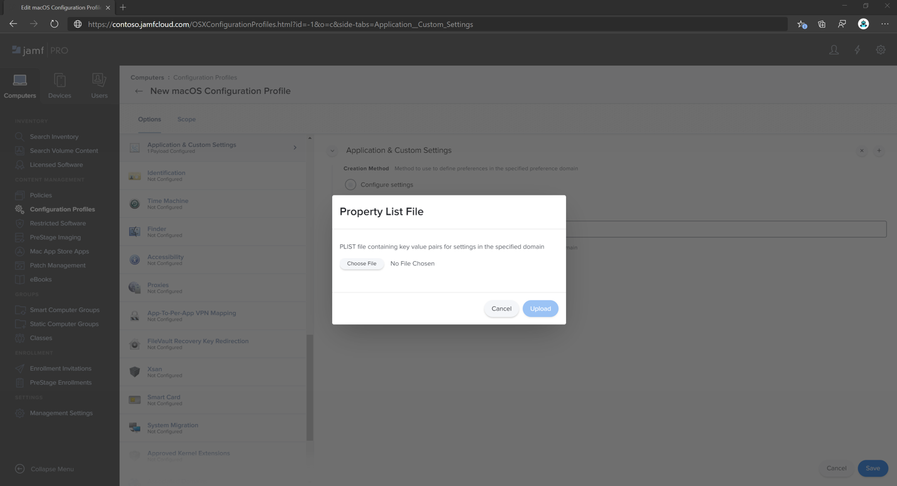

# <a name="set-up-the-microsoft-defender-for-endpoint-for-macos-policies-in-jamf-pro"></a>Configurar Microsoft Defender para endpoint para directivas de macOS en Jamf Pro

[!INCLUDE [Microsoft 365 Defender rebranding](../../includes/microsoft-defender.md)]


**Se aplica a:**

- [Defender para Endpoint para Mac](microsoft-defender-endpoint-mac.md)

Esta página le guiará a través de los pasos que debe seguir para configurar directivas de macOS en Jamf Pro.

Deberá seguir los pasos siguientes:

1. [Obtener el paquete de incorporación de Microsoft Defender para endpoint](#step-1-get-the-microsoft-defender-for-endpoint-onboarding-package)

2. [Crear un perfil de configuración en Jamf Pro con el paquete de incorporación](#step-2-create-a-configuration-profile-in-jamf-pro-using-the-onboarding-package)

3. [Configurar Microsoft Defender para la configuración del punto de conexión](#step-3-configure-microsoft-defender-for-endpoint-settings)

4. [Configurar Microsoft Defender para la configuración de notificación de extremo](#step-4-configure-notifications-settings)

5. [Configurar Microsoft AutoUpdate (MAU)](#step-5-configure-microsoft-autoupdate-mau)

6. [Conceder acceso en disco completo a Microsoft Defender para endpoint](#step-6-grant-full-disk-access-to-microsoft-defender-for-endpoint)

7. [Aprobar extensión de kernel para Microsoft Defender para endpoint](#step-7-approve-kernel-extension-for-microsoft-defender-for-endpoint)

8. [Aprobar extensiones del sistema para Microsoft Defender para endpoint](#step-8-approve-system-extensions-for-microsoft-defender-for-endpoint)

9. [Configurar extensión de red](#step-9-configure-network-extension)

10. [Programar exámenes con Microsoft Defender para endpoint para Mac](https://docs.microsoft.com/windows/security/threat-protection/microsoft-defender-atp/mac-schedule-scan-atp)

11. [Implementar Microsoft Defender para endpoint para macOS](#step-11-deploy-microsoft-defender-for-endpoint-for-macos)


## <a name="step-1-get-the-microsoft-defender-for-endpoint-onboarding-package"></a>Paso 1: Obtener el paquete de incorporación de Microsoft Defender para endpoint

1. En [el Centro de seguridad de Microsoft Defender,](https://securitycenter.microsoft.com )vaya a Configuración > **incorporación**. 

2. Seleccione macOS como sistema operativo y Administración de dispositivos móviles /Microsoft Intune como método de implementación.

    

3. Seleccione **Descargar paquete de incorporación** (WindowsDefenderATPOnboardingPackage.zip).

4. Extraer `WindowsDefenderATPOnboardingPackage.zip` .

5. Copie el archivo en su ubicación preferida. Por ejemplo, `C:\Users\JaneDoe_or_JohnDoe.contoso\Downloads\WindowsDefenderATPOnboardingPackage_macOS_MDM_contoso\jamf\WindowsDefenderATPOnboarding.plist`.


## <a name="step-2-create-a-configuration-profile-in-jamf-pro-using-the-onboarding-package"></a>Paso 2: Crear un perfil de configuración en Jamf Pro con el paquete de incorporación

1. Busque el archivo `WindowsDefenderATPOnboarding.plist` de la sección anterior.

   

 
2. En el panel de Jamf Pro, seleccione **Nuevo**.

    

3. Escriba los siguientes detalles:

   **General**
   - Nombre: incorporación de MDATP para macOS
   - Descripción: incorporación de MDATP EDR para macOS
   - Categoría: Ninguna
   - Método distribution: Install Automatically
   - Nivel: Nivel de equipo

4. En **Configuración & configuración personalizada,** seleccione **Configurar**.

    

5. Seleccione **Cargar archivo (archivo PLIST) y,** a continuación, en **Dominio de preferencia** escriba: `com.microsoft.wdav.atp` . 

    

    

7. Seleccione **Abrir** y seleccione el archivo de incorporación.

    

8. Seleccione **Cargar**. 

    


9. Seleccione la **pestaña** Ámbito.

    

10. Seleccione los equipos de destino.

    

     

11. Seleccione **Guardar**.

    

    

12. Seleccione **Listo**.

    

    

## <a name="step-3-configure-microsoft-defender-for-endpoint-settings"></a>Paso 3: Configurar Microsoft Defender para la configuración del punto de conexión

1.  Use las siguientes opciones de configuración de Microsoft Defender para puntos de conexión:

    - enableRealTimeProtection
    - passiveMode
    
    >[!NOTE]
    >No activado de forma predeterminada, si está planeando ejecutar un ANTIVIRUS de terceros para macOS, estafórlo en `true` .

    - exclusiones
    - excludedPath
    - excludedFileExtension
    - excludedFileName
    - exclusionsMergePolicy
    - allowedThreats
    
    >[!NOTE]
    >EICAR está en la muestra, si está pasando por una prueba de concepto, quítela especialmente si está probando EICAR.
        
    - disallowedThreatActions
    - potentially_unwanted_application
    - archive_bomb
    - cloudService
    - automaticSampleSubmission
    - tags
    - hideStatusMenuIcon
    
     Para obtener información, vea [Lista de propiedades para el perfil de configuración de Jamf](mac-preferences.md#property-list-for-jamf-configuration-profile).

     ```XML
     <?xml version="1.0" encoding="UTF-8"?>
     <!DOCTYPE plist PUBLIC "-//Apple//DTD PLIST 1.0//EN" "http://www.apple.com/DTDs/PropertyList-1.0.dtd">
     <plist version="1.0">
     <dict>
         <key>antivirusEngine</key>
         <dict>
             <key>enableRealTimeProtection</key>
             <true/>
             <key>passiveMode</key>
             <false/>
             <key>exclusions</key>
             <array>
                 <dict>
                     <key>$type</key>
                     <string>excludedPath</string>
                     <key>isDirectory</key>
                     <false/>
                     <key>path</key>
                     <string>/var/log/system.log</string>
                 </dict>
                 <dict>
                     <key>$type</key>
                     <string>excludedPath</string>
                     <key>isDirectory</key>
                     <true/>
                     <key>path</key>
                     <string>/home</string>
                 </dict>
                 <dict>
                     <key>$type</key>
                     <string>excludedFileExtension</string>
                     <key>extension</key>
                     <string>pdf</string>
                 </dict>
                 <dict>
                     <key>$type</key>
                     <string>excludedFileName</string>
                     <key>name</key>
                     <string>cat</string>
                 </dict>
             </array>
             <key>exclusionsMergePolicy</key>
             <string>merge</string>
             <key>allowedThreats</key>
             <array>
                 <string>EICAR-Test-File (not a virus)</string>
             </array>
             <key>disallowedThreatActions</key>
             <array>
                 <string>allow</string>
                 <string>restore</string>
             </array>
             <key>threatTypeSettings</key>
             <array>
                 <dict>
                     <key>key</key>
                     <string>potentially_unwanted_application</string>
                     <key>value</key>
                     <string>block</string>
                 </dict>
                 <dict>
                     <key>key</key>
                     <string>archive_bomb</string>
                     <key>value</key>
                     <string>audit</string>
                 </dict>
             </array>
             <key>threatTypeSettingsMergePolicy</key>
             <string>merge</string>
         </dict>
         <key>cloudService</key>
         <dict>
             <key>enabled</key>
             <true/>
             <key>diagnosticLevel</key>
             <string>optional</string>
             <key>automaticSampleSubmission</key>
             <true/>
         </dict>
         <key>edr</key>
         <dict>
             <key>tags</key>
             <array>
                 <dict>
                     <key>key</key>
                     <string>GROUP</string>
                     <key>value</key>
                     <string>ExampleTag</string>
                 </dict>
             </array>
         </dict>
         <key>userInterface</key>
         <dict>
             <key>hideStatusMenuIcon</key>
             <false/>
         </dict>
     </dict>
     </plist>
     ```

2. Guarde el archivo como `MDATP_MDAV_configuration_settings.plist` .


3.  En el panel de Jamf Pro, seleccione **General**.

    

4. Escriba los siguientes detalles:

    **General**
    
    - Nombre: opciones de configuración de MDATP MDAV
    - Descripción:\<blank\>
    - Categoría: Ninguno (predeterminado)
    - Método distribution: Install Automatically (default)
    - Nivel: Nivel del equipo (predeterminado)

    

5. En **Configuración & configuración personalizada,** seleccione **Configurar**.

    

6. Seleccione **Cargar archivo (archivo PLIST).**

    

7. En **Dominio de preferencias,** escriba `com.microsoft.wdav` y, a continuación,  **seleccione Cargar archivo PLIST**.

    

8. Seleccione **Elegir archivo**.

    

9. Seleccione el **MDATP_MDAV_configuration_settings.plist** y, a continuación, **seleccione Abrir**.

    

10. Seleccione **Cargar**.

    

    

    >[!NOTE]
    >Si se carga el archivo de Intune, se producirá el siguiente error:<br>
    >


11. Seleccione **Guardar**. 

    

12. El archivo se carga.

    

    

13. Seleccione la **pestaña** Ámbito.

    

14. Seleccione **Grupo de máquinas de Contoso**. 

15. Seleccione **Agregar** y, a continuación, **seleccione Guardar**.

    

    

16. Seleccione **Listo**. Verá el nuevo perfil **de configuración**.

    


## <a name="step-4-configure-notifications-settings"></a>Paso 4: Configurar la configuración de notificaciones

Estos pasos son aplicables a macOS 10.15 (Catalina) o versiones posteriores.

1. En el panel de Jamf Pro, seleccione **Equipos** y, a continuación, **Perfiles de configuración.**

2. Haga **clic en** Nuevo y escriba los siguientes detalles para **Opciones:**
    
    - Ficha **General**: 
        - **Nombre:** configuración de notificación MDATP MDAV
        - **Descripción:** macOS 10.15 (Catalina) o posterior
        - **Categoría**: None *(valor predeterminado)*
        - **Método Distribution:** Instalar automáticamente *(predeterminado)*
        - **Nivel:** Nivel de equipo *(predeterminado)*

        

    - Tab **Notifications**, click **Add** y escriba los siguientes valores:
        - **Id. de agrupación:**`com.microsoft.wdav.tray`
        - **Alertas críticas:** haga clic **en Deshabilitar**
        - **Notificaciones:** haga clic en **Habilitar**
        - **Tipo de alerta de banner:** Seleccione **Incluir** y **Temporal** *(predeterminado)*
        - **Notificaciones en la pantalla de bloqueo:** Haga clic **en Ocultar**
        - **Notificaciones en el Centro de notificaciones:** haga clic en **Mostrar**
        - **Icono de aplicación de distintivo:** Haga clic en **Mostrar**

        

    - Tab **Notifications**, click **Add** one more time, scroll down to **New Notifications Settings**
        - **Id. de agrupación:**`com.microsoft.autoupdate2`
        - Configure el resto de la configuración en los mismos valores anteriores

        

        Ten en cuenta que ahora tienes dos "tablas" con configuraciones de notificación, una para id. de **agrupación: com.microsoft.wdav.tray** y otra para id. de **lote: com.microsoft.autoupdate2**. Aunque puede configurar la configuración de alertas según sus **requisitos,** los IDs de agrupación deben ser exactamente los mismos que se han descrito anteriormente y el modificador **Include** debe estar **En** para notificaciones.

3. Seleccione la **pestaña Ámbito** y, a continuación, **seleccione Agregar**.

    

4. Seleccione **Grupo de máquinas de Contoso**. 

5. Seleccione **Agregar** y, a continuación, **seleccione Guardar**.
    
    
    
    

6. Seleccione **Listo**. Verá el nuevo perfil **de configuración**.
    

## <a name="step-5-configure-microsoft-autoupdate-mau"></a>Paso 5: Configurar Microsoft AutoUpdate (MAU)

1. Use las siguientes opciones de configuración de Microsoft Defender para puntos de conexión:

      ```XML
   <?xml version="1.0" encoding="UTF-8"?>
   <!DOCTYPE plist PUBLIC "-//Apple//DTD PLIST 1.0//EN" "http://www.apple.com/DTDs/PropertyList-1.0.dtd">
   <plist version="1.0">
   <dict>
    <key>ChannelName</key>
    <string>Current</string>
    <key>HowToCheck</key>
    <string>AutomaticDownload</string>
    <key>EnableCheckForUpdatesButton</key>
    <true/>
    <key>DisableInsiderCheckbox</key>
    <false/>
    <key>SendAllTelemetryEnabled</key>
    <true/>
   </dict>
   </plist>
   ```

2. Guárdelo como `MDATP_MDAV_MAU_settings.plist` .

3. En el panel de Jamf Pro, seleccione **General**. 

    

4. Escriba los siguientes detalles:

    **General** 
    
    - Nombre: configuración de MDATP MDAV MAU
    - Descripción: Configuración de Microsoft AutoUpdate para MDATP para macOS
    - Categoría: Ninguno (predeterminado)
    - Método distribution: Install Automatically (default)
    - Nivel: Nivel del equipo (predeterminado)

5. En **Configuración & configuración personalizada,** seleccione **Configurar**.

    

6. Seleccione **Cargar archivo (archivo PLIST).**

      

7. En **Dominio de preferencia** escriba: , luego seleccione Cargar archivo `com.microsoft.autoupdate2` **PLIST**.

    

8. Seleccione **Elegir archivo**.

    

9. Seleccione **MDATP_MDAV_MAU_settings.plist**.

    

10. Seleccione **Cargar**.
    

    

11. Seleccione **Guardar**.

    

12. Seleccione la **pestaña** Ámbito.
   
     

13. Elija **Agregar**.
    
    

    

    

14. Seleccione **Listo**.
    
    

## <a name="step-6-grant-full-disk-access-to-microsoft-defender-for-endpoint"></a>Paso 6: Conceder acceso en disco completo a Microsoft Defender para endpoint

1. En el panel de Jamf Pro, seleccione **Perfiles de configuración**.

    

2. Seleccione **+ Nuevo**. 

3. Escriba los siguientes detalles:

    **General** 
    - Nombre: MDATP MDAV: conceder acceso en disco completo a EDR y AV
    - Descripción: en macOS Catalina o versiones posteriores, el nuevo control de directiva de preferencias de privacidad
    - Categoría: Ninguna
    - Método de distribución: Instalar automáticamente
    - Nivel: nivel de equipo


    

4. En **Configurar el control de directiva de preferencias de privacidad,** seleccione **Configurar**.

    

5. En **Control de directiva de preferencias de** privacidad, escriba los siguientes detalles:

    - Identificador: `com.microsoft.wdav`
    - Tipo de identificador: Id. de agrupación
    - Requisito de código: `identifier "com.microsoft.wdav" and anchor apple generic and certificate 1[field.1.2.840.113635.100.6.2.6] /* exists */ and certificate leaf[field.1.2.840.113635.100.6.1.13] /* exists */ and certificate leaf[subject.OU] = UBF8T346G9`


    

6. Seleccione **+ Agregar**.

    

    - En Aplicación o servicio: Establecer en **SystemPolicyAllFiles**

    - En "access": Set to **Allow**

7. Seleccione **Guardar** (no el que se encuentra en la parte inferior derecha).

    

8. Haga clic `+` en el signo situado junto a App **Access** para agregar una nueva entrada.

    

9. Escriba los siguientes detalles:

    - Identificador: `com.microsoft.wdav.epsext`
    - Tipo de identificador: Id. de agrupación
    - Requisito de código: `identifier "com.microsoft.wdav.epsext" and anchor apple generic and certificate 1[field.1.2.840.113635.100.6.2.6] /* exists */ and certificate leaf[field.1.2.840.113635.100.6.1.13] /* exists */ and certificate leaf[subject.OU] = UBF8T346G9`

10. Seleccione **+ Agregar**.

    

    - En Aplicación o servicio: Establecer en **SystemPolicyAllFiles**

    - En "access": Set to **Allow**

11. Seleccione **Guardar** (no el que se encuentra en la parte inferior derecha).

    

12. Seleccione la **pestaña** Ámbito.

    

13. Seleccione **+ Agregar**.

    

14. Seleccione **Grupos de** equipos > en Nombre **de** grupo > seleccione **MachineGroup de Contoso**. 

    

15. Elija **Agregar**. 

16. Seleccione **Guardar**. 
    
17. Seleccione **Listo**.
    
    
    
    

Como alternativa, puede descargar [fulldisk.mobileconfig](https://github.com/microsoft/mdatp-xplat/blob/master/macos/mobileconfig/profiles/fulldisk.mobileconfig) y cargarlo en los perfiles de configuración de JAMF, como se describe en [Deploying Custom Configuration Profiles using Jamf Pro| Método 2: Cargar un perfil de configuración en Jamf Pro](https://www.jamf.com/jamf-nation/articles/648/deploying-custom-configuration-profiles-using-jamf-pro).

## <a name="step-7-approve-kernel-extension-for-microsoft-defender-for-endpoint"></a>Paso 7: Aprobar extensión de kernel para Microsoft Defender para endpoint

> [!CAUTION]
> Los dispositivos Apple Silicon (M1) no son compatibles con KEXT. La instalación de un perfil de configuración que consta de directivas KEXT producirá un error en estos dispositivos.

1. En **perfiles de configuración,** seleccione **+ Nuevo**.

    

2. Escriba los siguientes detalles:

    **General** 
    
    - Nombre: MDATP MDAV Kernel Extension
    - Descripción: extensión de kernel MDATP (kext)
    - Categoría: Ninguna
    - Método distribution: Install Automatically
    - Nivel: Nivel de equipo

    

3. En **Configurar extensiones de kernel aprobadas,** seleccione **Configurar**.

    

   
4. En **Extensiones de kernel aprobadas,** escriba los siguientes detalles:

    - Nombre para mostrar: Microsoft Corp.
    - Id. de equipo: UBF8T346G9

    

5. Seleccione la **pestaña** Ámbito.

    

6. Seleccione **+ Agregar**.

7. Seleccione **Grupos de** equipos > en Nombre **de** grupo > seleccione Grupo de máquinas **de Contoso**.

8. Seleccione **+ Agregar**.

    

9. Seleccione **Guardar**.

    

10. Seleccione **Listo**.

    

Como alternativa, puede descargar [kext.mobileconfig](https://github.com/microsoft/mdatp-xplat/blob/master/macos/mobileconfig/profiles/kext.mobileconfig) y cargarlo en los perfiles de configuración de JAMF, como se describe en [Deploying Custom Configuration Profiles using Jamf Pro| Método 2: Cargar un perfil de configuración en Jamf Pro](https://www.jamf.com/jamf-nation/articles/648/deploying-custom-configuration-profiles-using-jamf-pro).

## <a name="step-8-approve-system-extensions-for-microsoft-defender-for-endpoint"></a>Paso 8: Aprobar extensiones de sistema para Microsoft Defender para endpoint

1. En **perfiles de configuración,** seleccione **+ Nuevo**.

    

2. Escriba los siguientes detalles:

    **General**
    
    - Nombre: MDATP MDAV System Extensions
    - Descripción: extensiones del sistema MDATP
    - Categoría: Ninguna
    - Método distribution: Install Automatically
    - Nivel: Nivel de equipo

    

3. En **Extensiones del sistema,** seleccione **Configurar**.

   

4. En **Extensiones del sistema,** escriba los siguientes detalles:

   - Nombre para mostrar: Microsoft Corp. Extensiones del sistema
   - Tipos de extensión del sistema: extensiones de sistema permitidas
   - Identificador de equipo: UBF8T346G9
   - Extensiones de sistema permitidas:
     - **com.microsoft.wdav.epsext**
     - **com.microsoft.wdav.netext**

    

5. Seleccione la **pestaña** Ámbito.

    

6. Seleccione **+ Agregar**.

7. Seleccione **Grupos de** equipos > en Nombre **de** grupo > seleccione Grupo de máquinas **de Contoso**.

8. Seleccione **+ Agregar**.

   

9. Seleccione **Guardar**.

   

10. Seleccione **Listo**.

    

## <a name="step-9-configure-network-extension"></a>Paso 9: Configurar extensión de red

Como parte de las capacidades de detección y respuesta de puntos de conexión, Microsoft Defender para Endpoint para Mac inspecciona el tráfico de sockets e informa de esta información al portal del Centro de seguridad de Microsoft Defender. La siguiente directiva permite que la extensión de red realice esta funcionalidad.

Estos pasos son aplicables a macOS 10.15 (Catalina) o versiones posteriores.

1. En el panel de Jamf Pro, seleccione **Equipos** y, a continuación, **Perfiles de configuración.**

2. Haga **clic en** Nuevo y escriba los siguientes detalles para **Opciones:**

    - Ficha **General**: 
        - **Nombre**: Extensión de red atp de Microsoft Defender
        - **Descripción:** macOS 10.15 (Catalina) o posterior
        - **Categoría**: None *(valor predeterminado)*
        - **Método Distribution:** Instalar automáticamente *(predeterminado)*
        - **Nivel:** Nivel de equipo *(predeterminado)*

    - Filtro **de contenido de pestaña**:
        - **Nombre del filtro:** Filtro de contenido de ATP de Microsoft Defender
        - **Identificador**: `com.microsoft.wdav`
        - Dejar **en blanco dirección de** servicio , **organización**, nombre **de** usuario , **contraseña**, **certificado** (**Incluir** *no está* seleccionado)
        - **Orden de filtro:** Inspector
        - **Filtro de sockets**: `com.microsoft.wdav.netext`
        - **Requisito designado del filtro de socket:**`identifier "com.microsoft.wdav.netext" and anchor apple generic and certificate 1[field.1.2.840.113635.100.6.2.6] /* exists */ and certificate leaf[field.1.2.840.113635.100.6.1.13] /* exists */ and certificate leaf[subject.OU] = UBF8T346G9`
        - Dejar **campos de filtro de** red en blanco (**Incluir** no *está* seleccionado)

        Tenga en cuenta que los valores **exactos identificador**, filtro de **socket** y filtro **de** socket designados como se especifica anteriormente.

        

3. Seleccione la **pestaña** Ámbito.

   

4. Seleccione **+ Agregar**.

5. Seleccione **Grupos de** equipos > en Nombre **de** grupo > seleccione Grupo de máquinas **de Contoso**.

6. Seleccione **+ Agregar**.

    

7. Seleccione **Guardar**.

    

8. Seleccione **Listo**.

    

Como alternativa, puede descargar [netfilter.mobileconfig](https://github.com/microsoft/mdatp-xplat/blob/master/macos/mobileconfig/profiles/netfilter.mobileconfig) y cargarlo en los perfiles de configuración de JAMF, como se describe en [Deploying Custom Configuration Profiles using Jamf Pro| Método 2: Cargar un perfil de configuración en Jamf Pro](https://www.jamf.com/jamf-nation/articles/648/deploying-custom-configuration-profiles-using-jamf-pro).

## <a name="step-10-schedule-scans-with-microsoft-defender-for-endpoint-for-mac"></a>Paso 10: Programar exámenes con Microsoft Defender para endpoint para Mac
Siga las instrucciones de [Programar exámenes con Microsoft Defender para Endpoint para Mac](https://docs.microsoft.com/windows/security/threat-protection/microsoft-defender-atp/mac-schedule-scan-atp).

## <a name="step-11-deploy-microsoft-defender-for-endpoint-for-macos"></a>Paso 11: Implementar Microsoft Defender para endpoint para macOS

1. Navegue hasta donde guardó `wdav.pkg` .

    

2. Cámbiele el nombre a `wdav_MDM_Contoso_200329.pkg` .

    

3. Abra el panel de Jamf Pro.

    

4. Seleccione el equipo y haga clic en el icono de engranaje en la parte superior y, a continuación, seleccione **Administración del equipo**.

    

5. En **Paquetes**, seleccione **+ Nuevo**. 
    

6. En **Nuevo paquete,** escriba los siguientes detalles:

    **Ficha General**
    - Nombre para mostrar: déjelo en blanco por ahora. Porque se restablecerá al elegir el paquete.
    - Categoría: Ninguno (predeterminado)
    - Filename: Choose File

    

    Abra el archivo y apunte a `wdav.pkg` o `wdav_MDM_Contoso_200329.pkg` .
    
    

7. Seleccione **Abrir**. Establece el **nombre para mostrar en** Protección contra amenazas avanzada de Microsoft Defender y Antivirus de Microsoft **Defender**.

    **El archivo de** manifiesto no es necesario. La Protección contra amenazas avanzada de Microsoft Defender funciona sin archivo de manifiesto.
    
    **Pestaña Opciones**<br> Mantenga los valores predeterminados.

    **Pestaña Limitaciones**<br> Mantenga los valores predeterminados.
    
     
   
8. Seleccione **Guardar**. El paquete se carga en Jamf Pro. 

   

   El paquete puede tardar unos minutos en estar disponible para la implementación.
   
   

9. Vaya a la **página Directivas.**

    

10. Seleccione **+ Nuevo** para crear una nueva directiva.

    


11. En **General,** escriba los siguientes detalles:

    - Nombre para mostrar: MDATP Onboarding Contoso 200329 v100.86.92 o posterior

    

12. Seleccione **Check-in periódico**. 
    
    

  
13. Seleccione **Guardar**. 
 
14. Seleccione **Paquetes > Configurar**.
 
    

15. Selecciona el **botón Agregar** junto a Protección contra amenazas avanzada de Microsoft Defender y Antivirus de **Microsoft Defender.**

    

16. Seleccione **Guardar**.

    

17. Seleccione la **pestaña** Ámbito.  

    

18. Seleccione los equipos de destino.

    

    **Scope**
    
    Elija **Agregar**.
    
    

    

    **Autoservicio**
    
    

19. Seleccione **Listo**. 

    

    


