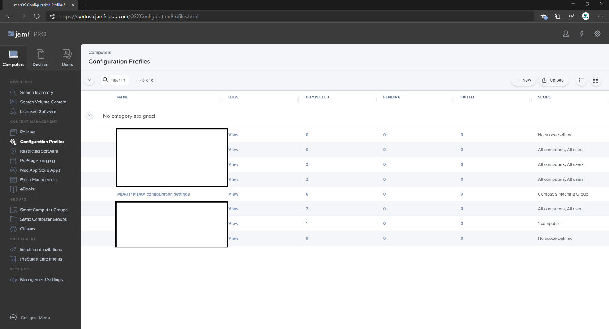

# <a name="set-up-the-microsoft-defender-for-endpoint-on-macos-policies-in-jamf-pro"></a>Configuración de la Microsoft Defender para punto de conexión en directivas de macOS en Jamf Pro

[!INCLUDE [Microsoft 365 Defender rebranding](../../includes/microsoft-defender.md)]


**Se aplica a:**
- [Defender para punto de conexión en Mac](microsoft-defender-endpoint-mac.md)
- [Microsoft Defender para punto de conexión Plan 1](https://go.microsoft.com/fwlink/p/?linkid=2154037)
- [Microsoft Defender para punto de conexión Plan 2](https://go.microsoft.com/fwlink/p/?linkid=2154037)

Esta página le guiará a través de los pasos que debe seguir para configurar directivas de macOS en Jamf Pro.

Tendrá que realizar los pasos siguientes:

1. [Obtención del paquete de incorporación de Microsoft Defender para punto de conexión](#step-1-get-the-microsoft-defender-for-endpoint-onboarding-package)
2. [Creación de un perfil de configuración en Jamf Pro mediante el paquete de incorporación](#step-2-create-a-configuration-profile-in-jamf-pro-using-the-onboarding-package)
3. [Configuración de Microsoft Defender para punto de conexión](#step-3-configure-microsoft-defender-for-endpoint-settings)
4. [Configuración de las notificaciones de Microsoft Defender para punto de conexión](#step-4-configure-notifications-settings)
5. [Configuración de Microsoft AutoUpdate (MAU)](#step-5-configure-microsoft-autoupdate-mau)
6. [Conceder acceso completo al disco a Microsoft Defender para punto de conexión](#step-6-grant-full-disk-access-to-microsoft-defender-for-endpoint)
7. [Aprobación de la extensión kernel para Microsoft Defender para punto de conexión](#step-7-approve-kernel-extension-for-microsoft-defender-for-endpoint)
8. [Aprobar extensiones del sistema para Microsoft Defender para punto de conexión](#step-8-approve-system-extensions-for-microsoft-defender-for-endpoint)
9. [Configuración de la extensión de red](#step-9-configure-network-extension)
10. [Programación de exámenes con Microsoft Defender para punto de conexión en macOS](/windows/security/threat-protection/microsoft-defender-atp/mac-schedule-scan-atp)
11. [Implementación de Microsoft Defender para punto de conexión en macOS](#step-11-deploy-microsoft-defender-for-endpoint-on-macos)

## <a name="step-1-get-the-microsoft-defender-for-endpoint-onboarding-package"></a>Paso 1: Obtener el paquete de incorporación de Microsoft Defender para punto de conexión

1. En [Microsoft 365 Defender](https://security.microsoft.com), vaya a **Configuración > puntos de conexión > incorporación**.

2. Seleccione macOS como sistema operativo y Mobile Administración de dispositivos/Microsoft Intune como método de implementación.

   :::image type="content" source="images/onboarding-macos.png" alt-text="La página Configuración de la Centro de seguridad de Microsoft Defender" lightbox="images/onboarding-macos.png":::

3. Seleccione **Descargar paquete de incorporación** (WindowsDefenderATPOnboardingPackage.zip).

4. Extraiga `WindowsDefenderATPOnboardingPackage.zip`.

5. Copie el archivo en la ubicación que prefiera. Por ejemplo, `C:\Users\JaneDoe_or_JohnDoe.contoso\Downloads\WindowsDefenderATPOnboardingPackage_macOS_MDM_contoso\jamf\WindowsDefenderATPOnboarding.plist`.

## <a name="step-2-create-a-configuration-profile-in-jamf-pro-using-the-onboarding-package"></a>Paso 2: Creación de un perfil de configuración en Jamf Pro mediante el paquete de incorporación

1. Busque el archivo `WindowsDefenderATPOnboarding.plist` de la sección anterior.

   :::image type="content" source="images/plist-onboarding-file.png" alt-text="El archivo de incorporación de ATP Windows Defender" lightbox="images/plist-onboarding-file.png":::

2. Inicie sesión en Jamf Pro, vaya a **Perfiles de configuración** de **equipos** >  y seleccione **Nuevo**.

   :::image type="content" source="images/jamf-pro-configure-profile.png" alt-text="Página en la que se crea un nuevo panel de Jamf Pro" lightbox="images/jamf-pro-configure-profile.png":::

3. Escriba los detalles siguientes:

   **General**:

   - Nombre: Incorporación de MDE para macOS
   - Descripción: Incorporación de MDE EDR para macOS
   - Categoría: Ninguna
   - Método de distribución: Instalar automáticamente
   - Nivel: Nivel de equipo

4.  Vaya a la página **Application & Custom Settings (Configuración personalizada)** y seleccione **Upload Add (Cargar** > **agregar).**

   :::image type="content" source="images/jamfpro-mac-profile.png" alt-text="Configuración de la aplicación y la configuración personalizada" lightbox="images/jamfpro-mac-profile.png":::

5. Seleccione **Cargar archivo (archivo PLIST)** y, a continuación, en **Dominio de preferencia** escriba: `com.microsoft.wdav.atp`.

   :::image type="content" source="images/jamfpro-plist-upload.png" alt-text="El archivo de carga de jamfpro plist" lightbox="images/jamfpro-plist-upload.png":::

   :::image type="content" source="images/jamfpro-plist-file.png" alt-text="Archivo de lista de la propiedad de archivo de carga" lightbox="images/jamfpro-plist-file.png":::

6. Seleccione **Abrir** y seleccione el archivo de incorporación.

   :::image type="content" source="images/jamfpro-plist-file-onboard.png" alt-text="El archivo de incorporación" lightbox="images/jamfpro-plist-file-onboard.png":::

7. Seleccione **Cargar**.

   :::image type="content" source="images/jamfpro-upload-plist.png" alt-text="El archivo plist de carga" lightbox="images/jamfpro-upload-plist.png":::

8. Seleccione la pestaña **Ámbito** .

   :::image type="content" source="images/jamfpro-scope-tab.png" alt-text="Pestaña Ámbito" lightbox="images/jamfpro-scope-tab.png":::

9. Seleccione los equipos de destino.

   :::image type="content" source="images/jamfpro-target-computer.png" alt-text="Equipos de destino" lightbox="images/jamfpro-target-computer.png":::

   :::image type="content" source="images/jamfpro-targets.png" alt-text="Los destinos" lightbox="images/jamfpro-targets.png":::

10. Seleccione **Guardar**.

   :::image type="content" source="images/jamfpro-deployment-target.png" alt-text="Implementación de equipos de destino" lightbox="images/jamfpro-deployment-target.png":::

   :::image type="content" source="images/jamfpro-target-selected.png" alt-text="Selección de equipos de destino" lightbox="images/jamfpro-target-selected.png":::

11. Seleccione **Listo**.

    :::image type="content" source="images/jamfpro-target-group.png" alt-text="Los equipos de un grupo de destino" lightbox="images/jamfpro-target-group.png":::

    :::image type="content" source="images/jamfpro-configuration-policies.png" alt-text="Lista de perfiles de configuración" lightbox="images/jamfpro-configuration-policies.png":::

## <a name="step-3-configure-microsoft-defender-for-endpoint-settings"></a>Paso 3: Configuración de Microsoft Defender para punto de conexión

Puede usar JAMF Pro GUI para editar valores individuales de la configuración de Microsoft Defender para punto de conexión, o bien usar el método heredado mediante la creación de una lista Plist de configuración en un editor de texto y su carga en JAMF Pro.

Tenga en cuenta que debe usar exactamente `com.microsoft.wdav` como dominio de **preferencias**, Microsoft Defender para punto de conexión solo usa este nombre y `com.microsoft.wdav.ext` para cargar su configuración administrada.

(La `com.microsoft.wdav.ext` versión se puede usar en raras ocasiones cuando se prefiere usar el método de GUI, pero también es necesario configurar una configuración que aún no se ha agregado al esquema).

### <a name="gui-method"></a>Método de GUI

1. Descargue el archivo schema.json del [repositorio de GitHub de Defender](https://github.com/microsoft/mdatp-xplat/tree/master/macos/schema) y guárdelo en un archivo local:

    ```bash
    curl -o ~/Documents/schema.json https://raw.githubusercontent.com/microsoft/mdatp-xplat/master/macos/schema/schema.json
    ```

2. Cree un nuevo perfil de configuración en Equipos -> Perfiles de configuración, escriba los detalles siguientes en la pestaña **General** :

   :::image type="content" source="images/644e0f3af40c29e80ca1443535b2fe32.png" alt-text="Un nuevo perfil" lightbox="images/644e0f3af40c29e80ca1443535b2fe32.png":::

    - Nombre: Configuración de MDATP MDAV
    - Descripción:\<blank\>
    - Categoría: Ninguno (valor predeterminado)
    - Nivel: Nivel de equipo (valor predeterminado)
    - Método de distribución: Instalar automáticamente (valor predeterminado)

3. Desplácese hacia abajo hasta la pestaña **Configuración personalizada & aplicación** , seleccione **Aplicaciones externas**, haga clic en **Agregar** y use **Esquema personalizado** como origen para usar para el dominio de preferencia.

   :::image type="content" source="images/4137189bc3204bb09eed3aabc41afd78.png" alt-text="Agregar esquema personalizado" lightbox="images/4137189bc3204bb09eed3aabc41afd78.png":::

4. Escriba `com.microsoft.wdav` como dominio de preferencias, haga clic en **Agregar esquema** y **cargue** el archivo schema.json descargado en el paso 1. Haga clic en **Guardar**.

   :::image type="content" source="images/a6f9f556037c42fabcfdcb1b697244cf.png" alt-text="Cargar esquema" lightbox="images/a6f9f556037c42fabcfdcb1b697244cf.png":::

5. Puede ver todos los valores de configuración de Microsoft Defender para punto de conexión admitidos a continuación, en **Propiedades del dominio de preferencias**. Haga clic en **Agregar o quitar propiedades** para seleccionar la configuración que desea administrar y haga clic en **Aceptar** para guardar los cambios. (La configuración no seleccionada no se incluirá en la configuración administrada; un usuario final podrá configurar esas opciones en sus máquinas).

   :::image type="content" source="images/817b3b760d11467abe9bdd519513f54f.png" alt-text="La configuración administrada elegida" lightbox="images/817b3b760d11467abe9bdd519513f54f.png":::

6. Cambie los valores de la configuración a los valores deseados. Puede hacer clic en **Más información** para obtener documentación sobre una configuración determinada. (Puede hacer clic en **Plist preview (Vista previa de Plist)** para inspeccionar el aspecto de la lista de configuración. Haga clic en **Editor de formularios** para volver al editor visual).

   :::image type="content" source="images/a14a79efd5c041bb8974cb5b12b3a9b6.png" alt-text="Página en la que se cambian los valores de configuración" lightbox="images/a14a79efd5c041bb8974cb5b12b3a9b6.png":::

7. Seleccione la pestaña **Ámbito** .

   :::image type="content" source="images/9fc17529e5577eefd773c658ec576a7d.png" alt-text="Ámbito del perfil de configuración" lightbox="images/9fc17529e5577eefd773c658ec576a7d.png":::

8. Seleccione **Grupo de máquinas de Contoso**.

9. Seleccione **Agregar** y, a continuación, **seleccione Guardar**.

   :::image type="content" source="images/cf30438b5512ac89af1d11cbf35219a6.png" alt-text="Página en la que puede agregar la configuración" lightbox="images/cf30438b5512ac89af1d11cbf35219a6.png":::

   :::image type="content" source="images/6f093e42856753a3955cab7ee14f12d9.png" alt-text="Página en la que puede guardar la configuración" lightbox="images/6f093e42856753a3955cab7ee14f12d9.png":::

10. Seleccione **Listo**. Verá el nuevo **perfil de configuración**.

    :::image type="content" source="images/dd55405106da0dfc2f50f8d4525b01c8.png" alt-text="Página en la que se completan las opciones de configuración" lightbox="images/dd55405106da0dfc2f50f8d4525b01c8.png":::

Microsoft Defender para punto de conexión agrega una nueva configuración con el tiempo. Esta nueva configuración se agregará al esquema y se publicará una nueva versión en Github.
Todo lo que necesita hacer para tener actualizaciones es descargar un esquema actualizado, editar el perfil de configuración existente y **editar el esquema** en la pestaña **Application & Custom Settings (Configuración personalizada de la aplicación &** ).

### <a name="legacy-method"></a>Método heredado

1. Use los siguientes valores de configuración de Microsoft Defender para punto de conexión:

    - enableRealTimeProtection
    - passiveMode

    > [!NOTE]
    > No está activado de forma predeterminada, si planea ejecutar un antivirus de terceros para macOS, establézcalo en `true`.

    - Exclusiones
    - excludedPath
    - excludedFileExtension
    - excludedFileName
    - exclusionesMergePolicy
    - allowedThreats

    > [!NOTE]
    > EICAR está en el ejemplo, si va a pasar por una prueba de concepto, quítelo especialmente si está probando EICAR.

    - disallowedThreatActions
    - potentially_unwanted_application
    - archive_bomb
    - cloudService
    - automaticSampleSubmission
    - tags
    - hideStatusMenuIcon

     Para obtener información, vea [Lista de propiedades para el perfil de configuración completa de JAMF](mac-preferences.md#property-list-for-jamf-full-configuration-profile).

     ```XML
     <?xml version="1.0" encoding="UTF-8"?>
     <!DOCTYPE plist PUBLIC "-//Apple//DTD PLIST 1.0//EN" "http://www.apple.com/DTDs/PropertyList-1.0.dtd">
     <plist version="1.0">
     <dict>
         <key>antivirusEngine</key>
         <dict>
             <key>enableRealTimeProtection</key>
             <true/>
             <key>passiveMode</key>
             <false/>
             <key>exclusions</key>
             <array>
                 <dict>
                     <key>$type</key>
                     <string>excludedPath</string>
                     <key>isDirectory</key>
                     <false/>
                     <key>path</key>
                     <string>/var/log/system.log</string>
                 </dict>
                 <dict>
                     <key>$type</key>
                     <string>excludedPath</string>
                     <key>isDirectory</key>
                     <true/>
                     <key>path</key>
                     <string>/home</string>
                 </dict>
                 <dict>
                     <key>$type</key>
                     <string>excludedFileExtension</string>
                     <key>extension</key>
                     <string>pdf</string>
                 </dict>
                 <dict>
                     <key>$type</key>
                     <string>excludedFileName</string>
                     <key>name</key>
                     <string>cat</string>
                 </dict>
             </array>
             <key>exclusionsMergePolicy</key>
             <string>merge</string>
             <key>allowedThreats</key>
             <array>
                 <string>EICAR-Test-File (not a virus)</string>
             </array>
             <key>disallowedThreatActions</key>
             <array>
                 <string>allow</string>
                 <string>restore</string>
             </array>
             <key>threatTypeSettings</key>
             <array>
                 <dict>
                     <key>key</key>
                     <string>potentially_unwanted_application</string>
                     <key>value</key>
                     <string>block</string>
                 </dict>
                 <dict>
                     <key>key</key>
                     <string>archive_bomb</string>
                     <key>value</key>
                     <string>audit</string>
                 </dict>
             </array>
             <key>threatTypeSettingsMergePolicy</key>
             <string>merge</string>
         </dict>
         <key>cloudService</key>
         <dict>
             <key>enabled</key>
             <true/>
             <key>diagnosticLevel</key>
             <string>optional</string>
             <key>automaticSampleSubmission</key>
             <true/>
         </dict>
         <key>edr</key>
         <dict>
             <key>tags</key>
             <array>
                 <dict>
                     <key>key</key>
                     <string>GROUP</string>
                     <key>value</key>
                     <string>ExampleTag</string>
                 </dict>
             </array>
         </dict>
         <key>userInterface</key>
         <dict>
             <key>hideStatusMenuIcon</key>
             <false/>
         </dict>
     </dict>
     </plist>
     ```

2. Guarde el archivo como `MDATP_MDAV_configuration_settings.plist`.

3. En el panel de Jamf Pro, abra **Equipos** y sus **perfiles de configuración**. Haga clic en **Nuevo** y cambie a la pestaña **General** .

   :::image type="content" source="images/644e0f3af40c29e80ca1443535b2fe32.png" alt-text="Página que muestra un nuevo perfil" lightbox="images/644e0f3af40c29e80ca1443535b2fe32.png":::

4. Escriba los detalles siguientes:

    **General**

    - Nombre: Configuración de MDATP MDAV
    - Descripción:\<blank\>
    - Categoría: Ninguno (valor predeterminado)
    - Método de distribución: Instalar automáticamente (valor predeterminado)
    - Nivel: Nivel de equipo (valor predeterminado)

    :::image type="content" source="images/3160906404bc5a2edf84d1d015894e3b.png" alt-text="Las opciones de configuración de MDATP MDAV" lightbox="images/3160906404bc5a2edf84d1d015894e3b.png":::

5. En **Application & Custom Settings (Configuración personalizada)** seleccione **Configurar**.

   :::image type="content" source="images/e1cc1e48ec9d5d688087b4d771e668d2.png" alt-text="La aplicación y la configuración personalizada" lightbox="images/e1cc1e48ec9d5d688087b4d771e668d2.png":::

6. Seleccione **Cargar archivo (archivo PLIST).**

   :::image type="content" source="images/6f85269276b2278eca4bce84f935f87b.png" alt-text="El archivo plist de configuración" lightbox="images/6f85269276b2278eca4bce84f935f87b.png":::

7. En **Dominio de preferencias**, escriba `com.microsoft.wdav`y seleccione  **Cargar archivo PLIST**.

   :::image type="content" source="images/db15f147dd959e872a044184711d7d46.png" alt-text="Dominio de preferencias de configuración" lightbox="images/db15f147dd959e872a044184711d7d46.png":::

8. Seleccione **Elegir archivo**.

    :::image type="content" source="images/526e978761fc571cca06907da7b01fd6.png" alt-text="Símbolo del sistema para elegir el archivo plist" lightbox="images/526e978761fc571cca06907da7b01fd6.png":::

9. Seleccione el **archivo MDATP_MDAV_configuration_settings.plist** y, a continuación, seleccione **Abrir**.

   :::image type="content" source="images/98acea3750113b8dbab334296e833003.png" alt-text="Los valores de configuración de mdatpmdav" lightbox="images/98acea3750113b8dbab334296e833003.png":::

10. Seleccione **Cargar**.

    :::image type="content" source="images/0adb21c13206861ba9b30a879ade93d3.png" alt-text="Carga de la configuración" lightbox="images/0adb21c13206861ba9b30a879ade93d3.png":::

    :::image type="content" source="images/f624de59b3cc86e3e2d32ae5de093e02.png" alt-text="Símbolo del sistema para cargar la imagen relacionada con los valores de configuración" lightbox="images/f624de59b3cc86e3e2d32ae5de093e02.png":::

    > [!NOTE]
    > Si carga el archivo Intune, obtendrá el siguiente error:
    >
    > :::image type="content" source="images/8e69f867664668796a3b2904896f0436.png" alt-text="El símbolo del sistema para cargar el archivo de Intune relacionado con la configuración" lightbox="images/8e69f867664668796a3b2904896f0436.png":::

11. Seleccione **Guardar**.

    :::image type="content" source="images/1b6b5a4edcb42d97f1e70a6a0fa48e3a.png" alt-text="Opción para guardar la imagen relacionada con los valores de configuración" lightbox="images/1b6b5a4edcb42d97f1e70a6a0fa48e3a.png":::

12. Se carga el archivo.

    :::image type="content" source="images/33e2b2a1611fdddf6b5b79e54496e3bb.png" alt-text="El archivo cargado relacionado con los valores de configuración" lightbox="images/33e2b2a1611fdddf6b5b79e54496e3bb.png":::

    :::image type="content" source="images/a422e57fe8d45689227e784443e51bd1.png" alt-text="Página de configuración" lightbox="images/a422e57fe8d45689227e784443e51bd1.png":::

13. Seleccione la pestaña **Ámbito** .

    :::image type="content" source="images/9fc17529e5577eefd773c658ec576a7d.png" alt-text="Ámbito de las opciones de configuración" lightbox="images/9fc17529e5577eefd773c658ec576a7d.png":::

14. Seleccione **Grupo de máquinas de Contoso**.

15. Seleccione **Agregar** y, a continuación, **seleccione Guardar**.

    :::image type="content" source="images/cf30438b5512ac89af1d11cbf35219a6.png" alt-text="La configuración agregaav" lightbox="images/cf30438b5512ac89af1d11cbf35219a6.png":::

    :::image type="content" source="images/6f093e42856753a3955cab7ee14f12d9.png" alt-text="Notificación de la configuración" lightbox="images/6f093e42856753a3955cab7ee14f12d9.png":::

16. Seleccione **Listo**. Verá el nuevo **perfil de configuración**.

    
     :::image type="content" source="images/dd55405106da0dfc2f50f8d4525b01c8.png" alt-text="Configuración del perfil de configuración" lightbox="images/dd55405106da0dfc2f50f8d4525b01c8.png":::

## <a name="step-4-configure-notifications-settings"></a>Paso 4: Configuración de las notificaciones

Estos pasos son aplicables a macOS 10.15 (Catalina) o posterior.

1. En el panel de Jamf Pro, seleccione **Equipos** y, a continuación, **Perfiles de configuración**.

2. Haga clic en **Nuevo** y escriba los siguientes detalles para **Opciones**:

    - Pestaña **General**:
        - **Nombre**: Configuración de notificación mdav de MDATP
        - **Descripción**: macOS 10.15 (Catalina) o posterior
        - **Categoría**: Ninguno *(valor predeterminado)*
        - **Método de distribución**: Instalar automáticamente *(valor predeterminado)*
        - **Nivel**: Nivel de equipo *(valor predeterminado)*

        :::image type="content" source="images/c9820a5ff84aaf21635c04a23a97ca93.png" alt-text="Página del nuevo perfil de configuración de macOS" lightbox="images/c9820a5ff84aaf21635c04a23a97ca93.png":::

    - Pestaña **Notificaciones**, haga clic en **Agregar** y escriba los valores siguientes:
        - **Id. de lote**: `com.microsoft.wdav.tray`
        - **Alertas críticas**: haga clic en **Deshabilitar**
        - **Notificaciones**: haga clic en **Habilitar**
        - **Tipo de alerta de banner**: seleccione **Incluir** y **temporal** *(valor predeterminado)*
        - **Notificaciones en la pantalla de bloqueo**: haga clic en **Ocultar**
        - **Notificaciones en el Centro de notificaciones**: Haga clic en **Mostrar**
        - **Icono de la aplicación badge**: haga clic en **Mostrar**

        :::image type="content" source="images/7f9138053dbcbf928e5182ee7b295ebe.png" alt-text="La bandeja de notificaciones mdatpmdav de configuración" lightbox="images/7f9138053dbcbf928e5182ee7b295ebe.png":::

    - **Pestaña Notificaciones**, haga clic en **Agregar** una vez más, desplácese hacia abajo hasta **Nueva configuración de notificaciones**
        - **Id. de lote**: `com.microsoft.autoupdate.fba`
        - Configure el resto de los valores en los mismos valores que los anteriores.

        :::image type="content" source="images/4bac6ce277aedfb4a674f2d9fcb2599a.png" alt-text="La configuración mdatpmdav notifications mau" lightbox="images/4bac6ce277aedfb4a674f2d9fcb2599a.png":::

        Tenga en cuenta que ahora tiene dos "tablas" con configuraciones de notificación, una para el **identificador de lote: com.microsoft.wdav.tray** y otra para **el identificador de lote: com.microsoft.autoupdate.fba**. Aunque puede configurar las opciones de alerta según sus requisitos, los identificadores de agrupación deben ser exactamente los mismos que se han descrito antes y el modificador **Incluir** debe estar **activado** para **las notificaciones**.

3. Seleccione la pestaña **Ámbito** y, a continuación, **seleccione Agregar**.

   :::image type="content" source="images/441aa2ecd36abadcdd8aed03556080b5.png" alt-text="Página en la que puede agregar valores para los valores de configuración." lightbox="images/441aa2ecd36abadcdd8aed03556080b5.png":::

4. Seleccione **Grupo de máquinas de Contoso**.

5. Seleccione **Agregar** y, a continuación, **seleccione Guardar**.

   :::image type="content" source="images/09a275e321268e5e3ac0c0865d3e2db5.png" alt-text="Página en la que puede guardar valores para el grupo de máquinas contoso de configuración." lightbox="images/09a275e321268e5e3ac0c0865d3e2db5.png":::

   :::image type="content" source="images/4d2d1d4ee13d3f840f425924c3df0d51.png" alt-text="Página que muestra la notificación de finalización de los valores de configuración" lightbox="images/4d2d1d4ee13d3f840f425924c3df0d51.png":::

6. Seleccione **Listo**. Verá el nuevo **perfil de configuración**.

   :::image type="content" source="images/633ad26b8bf24ec683c98b2feb884bdf.png" alt-text="Los valores de configuración completados" lightbox="images/633ad26b8bf24ec683c98b2feb884bdf.png":::

## <a name="step-5-configure-microsoft-autoupdate-mau"></a>Paso 5: Configurar Microsoft AutoUpdate (MAU)

1. Use los siguientes valores de configuración de Microsoft Defender para punto de conexión:

      ```XML
   <?xml version="1.0" encoding="UTF-8"?>
   <!DOCTYPE plist PUBLIC "-//Apple//DTD PLIST 1.0//EN" "http://www.apple.com/DTDs/PropertyList-1.0.dtd">
   <plist version="1.0">
   <dict>
    <key>ChannelName</key>
    <string>Current</string>
    <key>HowToCheck</key>
    <string>AutomaticDownload</string>
    <key>EnableCheckForUpdatesButton</key>
    <true/>
    <key>DisableInsiderCheckbox</key>
    <false/>
    <key>SendAllTelemetryEnabled</key>
    <true/>
   </dict>
   </plist>
   ```

2. Guárdelo como `MDATP_MDAV_MAU_settings.plist`.

3. En el panel de Jamf Pro, seleccione **General**.

   :::image type="content" source="images/eaba2a23dd34f73bf59e826217ba6f15.png" alt-text="Los valores de configuración" lightbox="images/eaba2a23dd34f73bf59e826217ba6f15.png":::

4. Escriba los detalles siguientes:

    **General**

    - Nombre: configuración de MDATP MDAV MAU
    - Descripción: Configuración de Microsoft AutoUpdate para MDATP para macOS
    - Categoría: Ninguno (valor predeterminado)
    - Método de distribución: Instalar automáticamente (valor predeterminado)
    - Nivel: Nivel de equipo (valor predeterminado)

5. En **Application & Custom Settings (Configuración personalizada)** seleccione **Configurar**.

   :::image type="content" source="images/1f72e9c15eaafcabf1504397e99be311.png" alt-text="La aplicación de configuración y la configuración personalizada" lightbox="images/1f72e9c15eaafcabf1504397e99be311.png":::

6. Seleccione **Cargar archivo (archivo PLIST).**

7. En **Dominio de preferencia** escriba: `com.microsoft.autoupdate2`y, a continuación, seleccione **Cargar archivo PLIST**.

   :::image type="content" source="images/1213872db5833aa8be535da57653219f.png" alt-text="Dominio de preferencia de configuración" lightbox="images/1213872db5833aa8be535da57653219f.png":::
    

8. Seleccione **Elegir archivo**.

   :::image type="content" source="images/335aff58950ce62d1dabc289ecdce9ed.png" alt-text="El símbolo del sistema para elegir el archivo con respecto a la configuración" lightbox="images/335aff58950ce62d1dabc289ecdce9ed.png":::

9. Seleccione **MDATP_MDAV_MAU_settings.plist**.

   :::image type="content" source="images/a26bd4967cd54bb113a2c8d32894c3de.png" alt-text="Configuración de mdatpmdavmau" lightbox="images/a26bd4967cd54bb113a2c8d32894c3de.png":::

10. Seleccione **Cargar**.
    :::image type="content" source="images/4239ca0528efb0734e4ca0b490bfb22d.png" alt-text="Carga del archivo con respecto a la configuración" lightbox="images/4239ca0528efb0734e4ca0b490bfb22d.png":::

    :::image type="content" source="images/4ec20e72c8aed9a4c16912e01692436a.png" alt-text="Página en la que se muestra la opción de carga del archivo con respecto a la configuración" lightbox="images/4ec20e72c8aed9a4c16912e01692436a.png":::

11. Seleccione **Guardar**.

    :::image type="content" source="images/253274b33e74f3f5b8d475cf8692ce4e.png" alt-text="Página en la que se muestra la opción guardar del archivo con respecto a la configuración" lightbox="images/253274b33e74f3f5b8d475cf8692ce4e.png":::

12. Seleccione la pestaña **Ámbito** .

    :::image type="content" source="images/10ab98358b2d602f3f67618735fa82fb.png" alt-text="Pestaña Ámbito de los valores de configuración" lightbox="images/10ab98358b2d602f3f67618735fa82fb.png":::

13. Seleccione **Agregar**.

    :::image type="content" source="images/56e6f6259b9ce3c1706ed8d666ae4947.png" alt-text="Opción para agregar destinos de implementación" lightbox="images/56e6f6259b9ce3c1706ed8d666ae4947.png":::

    :::image type="content" source="images/38c67ee1905c4747c3b26c8eba57726b.png" alt-text="Página en la que se agregan más valores a los valores de configuración" lightbox="images/38c67ee1905c4747c3b26c8eba57726b.png":::

    :::image type="content" source="images/321ba245f14743c1d5d51c15e99deecc.png" alt-text="Página en la que puede agregar más valores a la configuración" lightbox="images/321ba245f14743c1d5d51c15e99deecc.png":::

14. Seleccione **Listo**.

    :::image type="content" source="images/ba44cdb77e4781aa8b940fb83e3c21f7.png" alt-text="La notificación de finalización con respecto a los valores de configuración" lightbox="images/ba44cdb77e4781aa8b940fb83e3c21f7.png":::

## <a name="step-6-grant-full-disk-access-to-microsoft-defender-for-endpoint"></a>Paso 6: Conceder acceso completo al disco a Microsoft Defender para punto de conexión

1. En el panel de Jamf Pro, seleccione **Perfiles de configuración**.

   :::image type="content" source="images/264493cd01e62c7085659d6fdc26dc91.png" alt-text="Perfil para el que se va a configurar la configuración" lightbox="images/264493cd01e62c7085659d6fdc26dc91.png":::

2. Seleccione **+ Nuevo**.

3. Escriba los detalles siguientes:

    **General**
    - Nombre: MDATP MDAV: conceder acceso completo al disco a EDR y AV
    - Descripción: en macOS Catalina o versiones posteriores, el nuevo control de directiva de preferencias de privacidad
    - Categoría: Ninguna
    - Método de distribución: Instalar automáticamente
    - Nivel: Nivel de equipo

    :::image type="content" source="images/ba3d40399e1a6d09214ecbb2b341923f.png" alt-text="La configuración en general" lightbox="images/ba3d40399e1a6d09214ecbb2b341923f.png":::
    

4. En **Configurar el control de directivas de preferencias de privacidad** , seleccione **Configurar**.

   :::image type="content" source="images/715ae7ec8d6a262c489f94d14e1e51bb.png" alt-text="Control de directiva de privacidad de configuración" lightbox="images/715ae7ec8d6a262c489f94d14e1e51bb.png":::

5. En **Control de directivas de preferencias de privacidad**, escriba los detalles siguientes:

    - Identificador: `com.microsoft.wdav`
    - Tipo de identificador: id. de lote
    - Requisito de código: `identifier "com.microsoft.wdav" and anchor apple generic and certificate 1[field.1.2.840.113635.100.6.2.6] /* exists */ and certificate leaf[field.1.2.840.113635.100.6.1.13] /* exists */ and certificate leaf[subject.OU] = UBF8T346G9`

    :::image type="content" source="images/22cb439de958101c0a12f3038f905b27.png" alt-text="Detalles del control de directiva de preferencias de privacidad de configuración" lightbox="images/22cb439de958101c0a12f3038f905b27.png":::

6. Seleccione **+ Agregar**.

   :::image type="content" source="images/bd93e78b74c2660a0541af4690dd9485.png" alt-text="La opción de configuración add system policy all files (Agregar directiva del sistema todos los archivos)" lightbox="images/bd93e78b74c2660a0541af4690dd9485.png":::

    - En Aplicación o servicio: establezca en **SystemPolicyAllFiles**.

    - En "access": establezca en **Allow (Permitir).**

7. Seleccione **Guardar** (no la de la parte inferior derecha).

   :::image type="content" source="images/6de50b4a897408ddc6ded56a09c09fe2.png" alt-text="La operación de guardar para la configuración" lightbox="images/6de50b4a897408ddc6ded56a09c09fe2.png":::

8. Haga clic en el `+` signo situado junto a **App Access** para agregar una nueva entrada.

   :::image type="content" source="images/tcc-add-entry.png" alt-text="La operación de guardado relacionada con la configuración" lightbox="images/tcc-add-entry.png":::

9. Escriba los detalles siguientes:

    - Identificador: `com.microsoft.wdav.epsext`
    - Tipo de identificador: id. de lote
    - Requisito de código: `identifier "com.microsoft.wdav.epsext" and anchor apple generic and certificate 1[field.1.2.840.113635.100.6.2.6] /* exists */ and certificate leaf[field.1.2.840.113635.100.6.1.13] /* exists */ and certificate leaf[subject.OU] = UBF8T346G9`

10. Seleccione **+ Agregar**.

    :::image type="content" source="images/tcc-epsext-entry.png" alt-text="La entrada tcc epsext de configuración" lightbox="images/tcc-epsext-entry.png":::

    - En Aplicación o servicio: establezca en **SystemPolicyAllFiles**.

    - En "access": establezca en **Allow (Permitir).**

11. Seleccione **Guardar** (no la de la parte inferior derecha).

    :::image type="content" source="images/tcc-epsext-entry2.png" alt-text="La otra instancia de configuración de tcc epsext" lightbox="images/tcc-epsext-entry2.png":::

12. Seleccione la pestaña **Ámbito** .

    :::image type="content" source="images/2c49b16cd112729b3719724f581e6882.png" alt-text="Página que muestra el ámbito de la configuración" lightbox="images/2c49b16cd112729b3719724f581e6882.png":::

13. Seleccione **+ Agregar**.

    :::image type="content" source="images/57cef926d1b9260fb74a5f460cee887a.png" alt-text="Página en la que se muestra la configuración" lightbox="images/57cef926d1b9260fb74a5f460cee887a.png":::

14. Seleccione **Grupos de equipos** > en **Nombre de grupo** > seleccione **MachineGroup de Contoso**.

    :::image type="content" source="images/368d35b3d6179af92ffdbfd93b226b69.png" alt-text="Configuración del grupo de máquinas contoso" lightbox="images/368d35b3d6179af92ffdbfd93b226b69.png":::

15. Seleccione **Agregar**.

16. Seleccione **Guardar**.

17. Seleccione **Listo**.

    :::image type="content" source="images/809cef630281b64b8f07f20913b0039b.png" alt-text="Configuración de contoso machine-group" lightbox="images/809cef630281b64b8f07f20913b0039b.png":::

    :::image type="content" source="images/6c8b406ee224335a8c65d06953dc756e.png" alt-text="Ilustración de la configuración" lightbox="images/6c8b406ee224335a8c65d06953dc756e.png":::

Como alternativa, puede descargar [fulldisk.mobileconfig](https://github.com/microsoft/mdatp-xplat/blob/master/macos/mobileconfig/profiles/fulldisk.mobileconfig) y cargarlo en perfiles de configuración de JAMF como se describe en [Implementación de perfiles de configuración personalizados mediante Jamf Pro| Método 2: Cargar un perfil de configuración en Jamf Pro](https://www.jamf.com/jamf-nation/articles/648/deploying-custom-configuration-profiles-using-jamf-pro).

## <a name="step-7-approve-kernel-extension-for-microsoft-defender-for-endpoint"></a>Paso 7: Aprobar la extensión del kernel para Microsoft Defender para punto de conexión

> [!CAUTION]
> Los dispositivos Apple Silicon (M1) no admiten KEXT. Se producirá un error en la instalación de un perfil de configuración que consta de directivas KEXT en estos dispositivos.

1. En **Perfiles de configuración**, seleccione **+ Nuevo**.

   :::image type="content" source="images/6c8b406ee224335a8c65d06953dc756e.png" alt-text="La publicación de redes sociales Descripción generada automáticamente" lightbox="images/6c8b406ee224335a8c65d06953dc756e.png":::

2. Escriba los detalles siguientes:

    **General**

    - Nombre: MDATP MDAV Kernel Extension
    - Descripción: Extensión de kernel MDATP (kext)
    - Categoría: Ninguna
    - Método de distribución: Instalar automáticamente
    - Nivel: Nivel de equipo

    :::image type="content" source="images/24e290f5fc309932cf41f3a280d22c14.png" alt-text="Configuración del kernel mdatpmdav" lightbox="images/24e290f5fc309932cf41f3a280d22c14.png":::

3. En **Configurar extensiones de kernel aprobadas** , seleccione **Configurar**.

   :::image type="content" source="images/30be88b63abc5e8dde11b73f1b1ade6a.png" alt-text="Página en la que se muestran las extensiones de kernel aprobadas por la configuración" lightbox="images/30be88b63abc5e8dde11b73f1b1ade6a.png":::

4. En **Extensiones de kernel aprobadas** , escriba los detalles siguientes:

    - Nombre para mostrar: Microsoft Corp.
    - Id. de equipo: UBF8T346G9

    :::image type="content" source="images/39cf120d3ac3652292d8d1b6d057bd60.png" alt-text="Panel Extensiones de kernel aprobadas" lightbox="images/39cf120d3ac3652292d8d1b6d057bd60.png":::

5. Seleccione la pestaña **Ámbito** .

   :::image type="content" source="images/0df36fc308ba569db204ee32db3fb40a.png" alt-text="Pestaña Ámbito de la configuración" lightbox="images/0df36fc308ba569db204ee32db3fb40a.png":::

6. Seleccione **+ Agregar**.

7. Seleccione **Grupos de equipos** > en Nombre de **grupo** > seleccione **Grupo de equipos de Contoso**.

8. Seleccione **+ Agregar**.

   :::image type="content" source="images/0dde8a4c41110dbc398c485433a81359.png" alt-text="Página en la que se definen valores adicionales para los valores de configuración" lightbox="images/0dde8a4c41110dbc398c485433a81359.png":::

9. Seleccione **Guardar**.

   :::image type="content" source="images/0add8019b85a453b47fa5c402c72761b.png" alt-text="Extensión de kernel MDAV de MDATP" lightbox="images/0add8019b85a453b47fa5c402c72761b.png":::

10. Seleccione **Listo**.

    :::image type="content" source="images/1c9bd3f68db20b80193dac18f33c22d0.png" alt-text="Página de detalles de perfiles de configuración" lightbox="images/1c9bd3f68db20b80193dac18f33c22d0.png":::

Como alternativa, puede descargar [kext.mobileconfig](https://github.com/microsoft/mdatp-xplat/blob/master/macos/mobileconfig/profiles/kext.mobileconfig) y cargarlo en perfiles de configuración de JAMF como se describe en [Implementación de perfiles de configuración personalizados mediante Jamf Pro| Método 2: Cargar un perfil de configuración en Jamf Pro](https://www.jamf.com/jamf-nation/articles/648/deploying-custom-configuration-profiles-using-jamf-pro).

## <a name="step-8-approve-system-extensions-for-microsoft-defender-for-endpoint"></a>Paso 8: Aprobar extensiones del sistema para Microsoft Defender para punto de conexión

1. En **Perfiles de configuración**, seleccione **+ Nuevo**.

   :::image type="content" source="images/6c8b406ee224335a8c65d06953dc756e.png" alt-text="Descripción de la publicación de redes sociales generada automáticamente" lightbox="images/6c8b406ee224335a8c65d06953dc756e.png":::

2. Escriba los detalles siguientes:

    **General**

    - Nombre: Extensiones del sistema MDAV de MDATP
    - Descripción: Extensiones del sistema MDATP
    - Categoría: Ninguna
    - Método de distribución: Instalar automáticamente
    - Nivel: Nivel de equipo

    :::image type="content" source="images/sysext-new-profile.png" alt-text="Los valores de configuración sysext nuevo perfil" lightbox="images/sysext-new-profile.png":::

3. En **Extensiones del sistema** , seleccione **Configurar**.

   :::image type="content" source="images/sysext-configure.png" alt-text="Panel con la opción Configurar para las extensiones del sistema" lightbox="images/sysext-configure.png":::

4. En **Extensiones del sistema** , escriba los detalles siguientes:

   - Nombre para mostrar: Extensiones del sistema de Microsoft Corp.
   - Tipos de extensión del sistema: extensiones del sistema permitidas
   - Identificador de equipo: UBF8T346G9
   - Extensiones de sistema permitidas:
     - **com.microsoft.wdav.epsext**
     - **com.microsoft.wdav.netext**

    :::image type="content" source="images/sysext-configure2.png" alt-text="Panel Extensiones del sistema MDAV de MDATP" lightbox="images/sysext-configure2.png":::

5. Seleccione la pestaña **Ámbito** .

   :::image type="content" source="images/0df36fc308ba569db204ee32db3fb40a.png" alt-text="Panel de selección Equipos de destino" lightbox="images/0df36fc308ba569db204ee32db3fb40a.png":::

6. Seleccione **+ Agregar**.

7. Seleccione **Grupos de equipos** > en Nombre de **grupo** > seleccione **Grupo de equipos de Contoso**.

8. Seleccione **+ Agregar**.

   :::image type="content" source="images/0dde8a4c41110dbc398c485433a81359.png" alt-text="Panel Nuevo perfil de configuración de macOS" lightbox="images/0dde8a4c41110dbc398c485433a81359.png":::

9. Seleccione **Guardar**.

   :::image type="content" source="images/sysext-scope.png" alt-text="Visualización de opciones relacionadas con las extensiones de sistema MDAV de MDATP" lightbox="images/sysext-scope.png":::

10. Seleccione **Listo**.

    :::image type="content" source="images/sysext-final.png" alt-text="La configuración sysext- final" lightbox="images/sysext-final.png":::

## <a name="step-9-configure-network-extension"></a>Paso 9: Configurar la extensión de red

Como parte de las funcionalidades de detección y respuesta de puntos de conexión, Microsoft Defender para punto de conexión en macOS inspecciona el tráfico de socket e informa de esta información al portal de Microsoft 365 Defender. La siguiente directiva permite que la extensión de red realice esta funcionalidad.

Estos pasos son aplicables a macOS 10.15 (Catalina) o posterior.

1. En el panel de Jamf Pro, seleccione **Equipos** y, a continuación, **Perfiles de configuración**.

2. Haga clic en **Nuevo** y escriba los siguientes detalles para **Opciones**:

    - Pestaña **General**:
        - **Nombre**: Microsoft Defender extensión de red
        - **Descripción**: macOS 10.15 (Catalina) o posterior
        - **Categoría**: Ninguno *(valor predeterminado)*
        - **Método de distribución**: Instalar automáticamente *(valor predeterminado)*
        - **Nivel**: Nivel de equipo *(valor predeterminado)*

    - **Filtro de contenido de** pestaña:
        - **Nombre del filtro**: filtro de contenido Microsoft Defender
        - **Identificador**: `com.microsoft.wdav`
        - Deje **en blanco la dirección del servicio**, **la organización**, **el nombre de usuario**, la **contraseña**, **el certificado** (*no* está seleccionada **la opción Incluir**)
        - **Orden de filtro**: Inspector
        - **Filtro de socket**: `com.microsoft.wdav.netext`
        - **Requisito designado de filtro de socket**: `identifier "com.microsoft.wdav.netext" and anchor apple generic and certificate 1[field.1.2.840.113635.100.6.2.6] /* exists */ and certificate leaf[field.1.2.840.113635.100.6.1.13] /* exists */ and certificate leaf[subject.OU] = UBF8T346G9`
        - Deje los campos **Filtro de red** en blanco (*No* está seleccionada **la opción Incluir**)

        Tenga en cuenta que **los valores exactos Identificador**, **Filtro de socket** y **Requisito designado de filtro de socket** , tal como se especificó anteriormente.

        :::image type="content" source="images/netext-create-profile.png" alt-text="Configuración de mdatpmdav" lightbox="images/netext-create-profile.png":::

3. Seleccione la pestaña **Ámbito** .

   :::image type="content" source="images/0df36fc308ba569db204ee32db3fb40a.png" alt-text="Pestaña ámbito de configuración" lightbox="images/0df36fc308ba569db204ee32db3fb40a.png":::

4. Seleccione **+ Agregar**.

5. Seleccione **Grupos de equipos** > en Nombre de **grupo** > seleccione **Grupo de equipos de Contoso**.

6. Seleccione **+ Agregar**.

   :::image type="content" source="images/0dde8a4c41110dbc398c485433a81359.png" alt-text="Los valores de configuración adim" lightbox="images/0dde8a4c41110dbc398c485433a81359.png":::

7. Seleccione **Guardar**.

   :::image type="content" source="images/netext-scope.png" alt-text="Panel Filtro de contenido" lightbox="images/netext-scope.png":::

8. Seleccione **Listo**.

   :::image type="content" source="images/netext-final.png" alt-text="El texto netext de configuración: final" lightbox="images/netext-final.png":::

Como alternativa, puede descargar [netfilter.mobileconfig](https://github.com/microsoft/mdatp-xplat/blob/master/macos/mobileconfig/profiles/netfilter.mobileconfig) y cargarlo en perfiles de configuración de JAMF como se describe en [Implementación de perfiles de configuración personalizados mediante Jamf Pro| Método 2: Cargar un perfil de configuración en Jamf Pro](https://www.jamf.com/jamf-nation/articles/648/deploying-custom-configuration-profiles-using-jamf-pro).

## <a name="step-10-schedule-scans-with-microsoft-defender-for-endpoint-on-macos"></a>Paso 10: Programar exámenes con Microsoft Defender para punto de conexión en macOS

Siga las instrucciones de [Programación de exámenes con Microsoft Defender para punto de conexión en macOS](/windows/security/threat-protection/microsoft-defender-atp/mac-schedule-scan-atp).

## <a name="step-11-deploy-microsoft-defender-for-endpoint-on-macos"></a>Paso 11: Implementación de Microsoft Defender para punto de conexión en macOS

1. Vaya a donde guardó `wdav.pkg`.

   :::image type="content" source="images/8dde76b5463047423f8637c86b05c29d.png" alt-text="El paquete wdav del explorador de archivos" lightbox="images/8dde76b5463047423f8637c86b05c29d.png":::

2. Cámbiele el nombre a `wdav_MDM_Contoso_200329.pkg`.

   :::image type="content" source="images/fb2220fed3a530f4b3ef36f600da0c27.png" alt-text="El paquete wdavmdm del explorador de archivos1" lightbox="images/fb2220fed3a530f4b3ef36f600da0c27.png":::

3. Abra el panel de Jamf Pro.

   :::image type="content" source="images/990742cd9a15ca9fdd37c9f695d1b9f4.png" alt-text="Los valores de configuración de jamfpro" lightbox="images/990742cd9a15ca9fdd37c9f695d1b9f4.png":::

4. Seleccione el equipo y haga clic en el icono de engranaje de la parte superior y, a continuación, seleccione **Administración de equipos**.

   :::image type="content" source="images/b6d671b2f18b89d96c1c8e2ea1991242.png" alt-text="Opciones de configuración: administración de equipos" lightbox="images/b6d671b2f18b89d96c1c8e2ea1991242.png":::

5. En **Paquetes**, seleccione **+ Nuevo**.
   :::image type="content" source="images/57aa4d21e2ccc65466bf284701d4e961.png" alt-text="La descripción del pájaro de un paquete generado automáticamente" lightbox="images/57aa4d21e2ccc65466bf284701d4e961.png":::

6. En **Nuevo paquete** , escriba los detalles siguientes:

    **Pestaña General**
    - Nombre para mostrar: déjelo en blanco por ahora. Porque se restablecerá cuando elija el archivo pkg.
    - Categoría: Ninguno (valor predeterminado)
    - Nombre de archivo: Elegir archivo

    :::image type="content" source="images/21de3658bf58b1b767a17358a3f06341.png" alt-text="Pestaña General para la configuración" lightbox="images/21de3658bf58b1b767a17358a3f06341.png":::

    Abra el archivo y apunte a `wdav.pkg` o `wdav_MDM_Contoso_200329.pkg`.

    :::image type="content" source="images/1aa5aaa0a387f4e16ce55b66facc77d1.png" alt-text="Pantalla del equipo que muestra la descripción de un paquete generado automáticamente" lightbox="images/1aa5aaa0a387f4e16ce55b66facc77d1.png":::

7. Seleccione **Abrir**. Establezca el **nombre para mostrar** en **Microsoft Defender Advanced Threat Protection y Microsoft Defender Antivirus**.

    **El archivo de manifiesto** no es necesario. Microsoft Defender para punto de conexión funciona sin archivo de manifiesto.

    **Pestaña Opciones**: mantenga los valores predeterminados.

    **Pestaña Limitaciones**: mantenga los valores predeterminados.

    :::image type="content" source="images/56dac54634d13b2d3948ab50e8d3ef21.png" alt-text="Pestaña de limitación de los valores de configuración" lightbox="images/56dac54634d13b2d3948ab50e8d3ef21.png":::

8. Seleccione **Guardar**. El paquete se carga en Jamf Pro.

   :::image type="content" source="images/33f1ecdc7d4872555418bbc3efe4b7a3.png" alt-text="Proceso de carga del paquete de configuración para el paquete relacionado con los valores de configuración" lightbox="images/33f1ecdc7d4872555418bbc3efe4b7a3.png":::

   El paquete puede tardar unos minutos en estar disponible para la implementación.

   :::image type="content" source="images/1626d138e6309c6e87bfaab64f5ccf7b.png" alt-text="Una instancia de carga del paquete para la configuración" lightbox="images/1626d138e6309c6e87bfaab64f5ccf7b.png":::

9. Vaya a la página **Directivas** .

   :::image type="content" source="images/f878f8efa5ebc92d069f4b8f79f62c7f.png" alt-text="Directivas de configuración" lightbox="images/f878f8efa5ebc92d069f4b8f79f62c7f.png":::

10. Seleccione **+ Nuevo** para crear una nueva directiva.

    :::image type="content" source="images/847b70e54ed04787e415f5180414b310.png" alt-text="Nueva directiva de configuración" lightbox="images/847b70e54ed04787e415f5180414b310.png":::


11. En **General** , escriba los detalles siguientes:

    - Nombre para mostrar: Incorporación de MDATP Contoso 200329 v100.86.92 o posterior

      :::image type="content" source="images/625ba6d19e8597f05e4907298a454d28.png" alt-text="Opciones de configuración: incorporación de MDATP" lightbox="images/625ba6d19e8597f05e4907298a454d28.png":::

12. Seleccione **Registro periódico**.

    :::image type="content" source="images/68bdbc5754dfc80aa1a024dde0fce7b0.png" alt-text="La comprobación periódica de los valores de configuración" lightbox="images/68bdbc5754dfc80aa1a024dde0fce7b0.png":::

13. Seleccione **Guardar**.

14. Seleccione **Paquetes > Configurar**.

    :::image type="content" source="images/8fb4cc03721e1efb4a15867d5241ebfb.png" alt-text="La opción para configurar paquetes" lightbox="images/8fb4cc03721e1efb4a15867d5241ebfb.png":::

15. Seleccione el botón **Agregar** situado junto a **Microsoft Defender Advanced Threat Protection y Microsoft Defender Antivirus**.

    :::image type="content" source="images/526b83fbdbb31265b3d0c1e5fbbdc33a.png" alt-text="Opción para agregar más opciones a MDATP MDA" lightbox="images/526b83fbdbb31265b3d0c1e5fbbdc33a.png":::

16. Seleccione **Guardar**.

    :::image type="content" source="images/9d6e5386e652e00715ff348af72671c6.png" alt-text="Opción de guardar para los valores de configuración" lightbox="images/9d6e5386e652e00715ff348af72671c6.png":::

17. Seleccione la pestaña **Ámbito** .

    :::image type="content" source="images/8d80fe378a31143db9be0bacf7ddc5a3.png" alt-text="Pestaña Ámbito relacionada con los valores de configuración" lightbox="images/8d80fe378a31143db9be0bacf7ddc5a3.png":::

18. Seleccione los equipos de destino.

    :::image type="content" source="images/6eda18a64a660fa149575454e54e7156.png" alt-text="Opción para agregar grupos de equipos" lightbox="images/6eda18a64a660fa149575454e54e7156.png":::

    **Scope**

    Seleccione **Agregar**.

    :::image type="content" source="images/1c08d097829863778d562c10c5f92b67.png" alt-text="Opciones de configuración: ad1" lightbox="images/1c08d097829863778d562c10c5f92b67.png":::

    :::image type="content" source="images/216253cbfb6ae738b9f13496b9c799fd.png" alt-text="Opciones de configuración: ad2" lightbox="images/216253cbfb6ae738b9f13496b9c799fd.png":::

    **Autoservicio**

    :::image type="content" source="images/c9f85bba3e96d627fe00fc5a8363b83a.png" alt-text="Pestaña Autoservicio para las opciones de configuración" lightbox="images/c9f85bba3e96d627fe00fc5a8363b83a.png":::

19. Seleccione **Listo**.

    :::image type="content" source="images/99679a7835b0d27d0a222bc3fdaf7f3b.png" alt-text="Estado de incorporación de Contoso con una opción para completarlo" lightbox="images/99679a7835b0d27d0a222bc3fdaf7f3b.png":::

    :::image type="content" source="images/632aaab79ae18d0d2b8e0c16b6ba39e2.png" alt-text="Página directivas" lightbox="images/632aaab79ae18d0d2b8e0c16b6ba39e2.png":::
