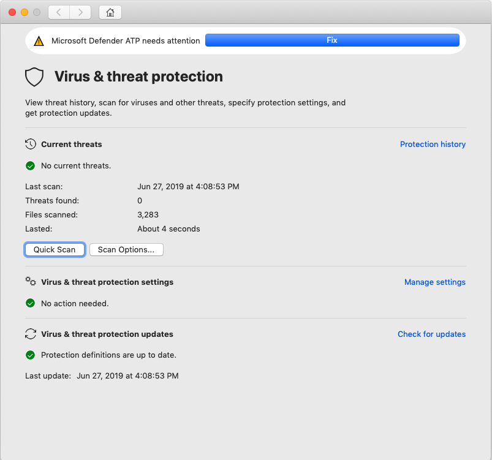
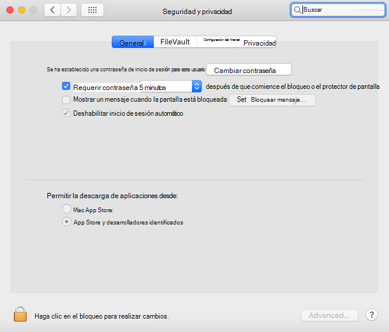

# <a name="troubleshoot-kernel-extension-issues-in-microsoft-defender-for-endpoint-on-macos"></a><span data-ttu-id="04457-104">Solucionar problemas de extensión de kernel en Microsoft Defender para endpoint en macOS</span><span class="sxs-lookup"><span data-stu-id="04457-104">Troubleshoot kernel extension issues in Microsoft Defender for Endpoint on macOS</span></span>

[!INCLUDE [Microsoft 365 Defender rebranding](../../includes/microsoft-defender.md)]


<span data-ttu-id="04457-105">**Se aplica a:**</span><span class="sxs-lookup"><span data-stu-id="04457-105">**Applies to:**</span></span>

- [<span data-ttu-id="04457-106">Microsoft Defender para punto de conexión en macOS</span><span class="sxs-lookup"><span data-stu-id="04457-106">Microsoft Defender for Endpoint on macOS</span></span>](microsoft-defender-endpoint-mac.md)
- [<span data-ttu-id="04457-107">Microsoft Defender para punto de conexión</span><span class="sxs-lookup"><span data-stu-id="04457-107">Microsoft Defender for Endpoint</span></span>](https://go.microsoft.com/fwlink/p/?linkid=2154037)
- [<span data-ttu-id="04457-108">Microsoft 365 Defender</span><span class="sxs-lookup"><span data-stu-id="04457-108">Microsoft 365 Defender</span></span>](https://go.microsoft.com/fwlink/?linkid=2118804)

> <span data-ttu-id="04457-109">¿Desea experimentar Microsoft Defender para endpoint?</span><span class="sxs-lookup"><span data-stu-id="04457-109">Want to experience Microsoft Defender for Endpoint?</span></span> [<span data-ttu-id="04457-110">Regístrate para obtener una versión de prueba gratuita.</span><span class="sxs-lookup"><span data-stu-id="04457-110">Sign up for a free trial.</span></span>](https://www.microsoft.com/microsoft-365/windows/microsoft-defender-atp?ocid=docs-wdatp-exposedapis-abovefoldlink)

<span data-ttu-id="04457-111">En este artículo se proporciona información sobre cómo solucionar problemas con la extensión del kernel que se instala como parte de Microsoft Defender para endpoint en macOS.</span><span class="sxs-lookup"><span data-stu-id="04457-111">This article provides information on how to troubleshoot issues with the kernel extension that is installed as part of Microsoft Defender for Endpoint on macOS.</span></span>

<span data-ttu-id="04457-112">A partir de macOS High Sierra (10.13), macOS requiere que todas las extensiones de kernel se aprueben explícitamente antes de que puedan ejecutarse en el dispositivo.</span><span class="sxs-lookup"><span data-stu-id="04457-112">Starting with macOS High Sierra (10.13), macOS requires all kernel extensions to be explicitly approved before they're allowed to run on the device.</span></span>

<span data-ttu-id="04457-113">Si no aprobaba la extensión del kernel durante la implementación o instalación de Microsoft Defender para Endpoint en macOS, la aplicación muestra un banner que le pide que lo habilite:</span><span class="sxs-lookup"><span data-stu-id="04457-113">If you didn't approve the kernel extension during the deployment/installation of Microsoft Defender for Endpoint on macOS, the application displays a banner prompting you to enable it:</span></span>

   

<span data-ttu-id="04457-115">También puede ejecutar ```mdatp health``` .</span><span class="sxs-lookup"><span data-stu-id="04457-115">You can also run ```mdatp health```.</span></span> <span data-ttu-id="04457-116">Informa si la protección en tiempo real está habilitada pero no está disponible.</span><span class="sxs-lookup"><span data-stu-id="04457-116">It reports if real-time protection is enabled but not available.</span></span> <span data-ttu-id="04457-117">Esto indica que la extensión del kernel no está aprobada para ejecutarse en el dispositivo.</span><span class="sxs-lookup"><span data-stu-id="04457-117">This indicates that the kernel extension isn't approved to run on your device.</span></span>

```bash
mdatp health
```
```Output
...
real_time_protection_enabled                : false
real_time_protection_available              : true
...
```

<span data-ttu-id="04457-118">Las secciones siguientes proporcionan instrucciones sobre cómo solucionar este problema, en función del método que usó para implementar Microsoft Defender para endpoint en macOS.</span><span class="sxs-lookup"><span data-stu-id="04457-118">The following sections provide guidance on how to address this issue, depending on the method that you used to deploy Microsoft Defender for Endpoint on macOS.</span></span>

## <a name="managed-deployment"></a><span data-ttu-id="04457-119">Implementación administrada</span><span class="sxs-lookup"><span data-stu-id="04457-119">Managed deployment</span></span>

<span data-ttu-id="04457-120">Vea las instrucciones correspondientes a la herramienta de administración que usó para implementar el producto:</span><span class="sxs-lookup"><span data-stu-id="04457-120">See the instructions corresponding to the management tool that you used to deploy the product:</span></span>

- [<span data-ttu-id="04457-121">Implementación basada en JAMF</span><span class="sxs-lookup"><span data-stu-id="04457-121">JAMF-based deployment</span></span>](mac-install-with-jamf.md)
- [<span data-ttu-id="04457-122">Implementación basada en Microsoft Intune</span><span class="sxs-lookup"><span data-stu-id="04457-122">Microsoft Intune-based deployment</span></span>](mac-install-with-intune.md#create-system-configuration-profiles)

## <a name="manual-deployment"></a><span data-ttu-id="04457-123">Implementación manual</span><span class="sxs-lookup"><span data-stu-id="04457-123">Manual deployment</span></span>

<span data-ttu-id="04457-124">Si han transcurrido menos de 30 minutos desde que se instaló el producto, vaya a Seguridad de preferencias del sistema & Privacidad, donde debe permitir el software del sistema de desarrolladores  >  "Microsoft Corporation". </span><span class="sxs-lookup"><span data-stu-id="04457-124">If less than 30 minutes have passed since the product was installed, navigate to **System Preferences** > **Security & Privacy**, where you have to **Allow** system software from developers "Microsoft Corporation".</span></span>

<span data-ttu-id="04457-125">Si no ves este mensaje, significa que han transcurrido 30 o más minutos y la extensión del kernel aún no se ha aprobado para ejecutarse en el dispositivo:</span><span class="sxs-lookup"><span data-stu-id="04457-125">If you don't see this prompt, it means that 30 or more minutes have passed, and the kernel extension still not been approved to run on your device:</span></span>



<span data-ttu-id="04457-127">En este caso, debe realizar los siguientes pasos para desencadenar de nuevo el flujo de aprobación.</span><span class="sxs-lookup"><span data-stu-id="04457-127">In this case, you need to perform the following steps to trigger the approval flow again.</span></span>

1. <span data-ttu-id="04457-128">En Terminal, intente instalar el controlador.</span><span class="sxs-lookup"><span data-stu-id="04457-128">In Terminal, attempt to install the driver.</span></span> <span data-ttu-id="04457-129">La siguiente operación producirá un error, ya que la extensión del kernel no se aprobó para ejecutarse en el dispositivo.</span><span class="sxs-lookup"><span data-stu-id="04457-129">The following operation will fail, because the kernel extension wasn't approved to run on the device.</span></span> <span data-ttu-id="04457-130">Sin embargo, volverá a desencadenar el flujo de aprobación.</span><span class="sxs-lookup"><span data-stu-id="04457-130">However, it will trigger the approval flow again.</span></span>

    ```bash
    sudo kextutil /Library/Extensions/wdavkext.kext
    ```
    
    ```Output
    Kext rejected due to system policy: <OSKext 0x7fc34d528390 [0x7fffa74aa8e0]> { URL = "file:///Library/StagedExtensions/Library/Extensions/wdavkext.kext/", ID = "com.microsoft.wdavkext" }
    Kext rejected due to system policy: <OSKext 0x7fc34d528390 [0x7fffa74aa8e0]> { URL = "file:///Library/StagedExtensions/Library/Extensions/wdavkext.kext/", ID = "com.microsoft.wdavkext" }
    Diagnostics for /Library/Extensions/wdavkext.kext:
    ```

2. <span data-ttu-id="04457-131">Abra **Preferencias**  >  **del sistema Seguridad & privacidad** desde el menú.</span><span class="sxs-lookup"><span data-stu-id="04457-131">Open **System Preferences** > **Security & Privacy** from the menu.</span></span> <span data-ttu-id="04457-132">(Cierre primero, si está abierto).</span><span class="sxs-lookup"><span data-stu-id="04457-132">(Close it first, if it's opened.)</span></span>

3. <span data-ttu-id="04457-133">**Permitir** software del sistema de desarrolladores "Microsoft Corporation"</span><span class="sxs-lookup"><span data-stu-id="04457-133">**Allow** system software from developers "Microsoft Corporation"</span></span>

4. <span data-ttu-id="04457-134">En Terminal, vuelva a instalar el controlador.</span><span class="sxs-lookup"><span data-stu-id="04457-134">In Terminal, install the driver again.</span></span> <span data-ttu-id="04457-135">Esta vez, la operación se realizará correctamente:</span><span class="sxs-lookup"><span data-stu-id="04457-135">This time the operation will succeed:</span></span>

    ```bash
    sudo kextutil /Library/Extensions/wdavkext.kext
    ```

    <span data-ttu-id="04457-136">El banner debe desaparecer de la aplicación defender y ahora debe informar de que la protección en tiempo ```mdatp health``` real está habilitada y disponible:</span><span class="sxs-lookup"><span data-stu-id="04457-136">The banner should disappear from the Defender application, and ```mdatp health``` should now report that real-time protection is both enabled and available:</span></span>

    ```bash
    mdatp health
    ```

    ```Output
    ...
    real_time_protection_enabled                : true
    real_time_protection_available              : true
    ...
    ```
