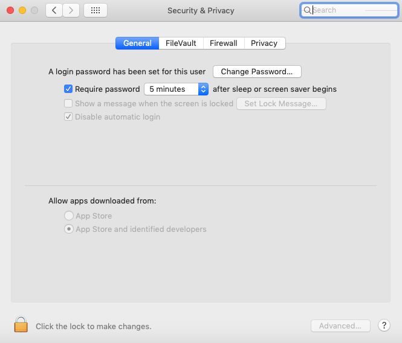

# <a name="troubleshoot-kernel-extension-issues-in-microsoft-defender-for-endpoint-on-macos"></a>Solucionar problemas de extensión de kernel en Microsoft Defender para endpoint en macOS

[!INCLUDE [Microsoft 365 Defender rebranding](../../includes/microsoft-defender.md)]


**Se aplica a:**

- [Microsoft Defender para endpoint en macOS](microsoft-defender-endpoint-mac.md)
- [Microsoft Defender para punto de conexión](https://go.microsoft.com/fwlink/p/?linkid=2154037)
- [Microsoft 365 Defender](https://go.microsoft.com/fwlink/?linkid=2118804)

> ¿Desea experimentar Microsoft Defender para endpoint? [Regístrate para obtener una versión de prueba gratuita.](https://www.microsoft.com/microsoft-365/windows/microsoft-defender-atp?ocid=docs-wdatp-exposedapis-abovefoldlink)

En este artículo se proporciona información sobre cómo solucionar problemas con la extensión del kernel que se instala como parte de Microsoft Defender para endpoint en macOS.

A partir de macOS High Sierra (10.13), macOS requiere que todas las extensiones de kernel se aprueben explícitamente antes de que puedan ejecutarse en el dispositivo.

Si no aprobaba la extensión del kernel durante la implementación o instalación de Microsoft Defender para Endpoint en macOS, la aplicación muestra un banner que le pide que lo habilite:

   

También puede ejecutar ```mdatp health``` . Informa si la protección en tiempo real está habilitada pero no está disponible. Esto indica que la extensión del kernel no está aprobada para ejecutarse en el dispositivo.

```bash
mdatp health
```
```Output
...
real_time_protection_enabled                : false
real_time_protection_available              : true
...
```

Las secciones siguientes proporcionan instrucciones sobre cómo solucionar este problema, en función del método que usó para implementar Microsoft Defender para endpoint en macOS.

## <a name="managed-deployment"></a>Implementación administrada

Vea las instrucciones correspondientes a la herramienta de administración que usó para implementar el producto:

- [Implementación basada en JAMF](mac-install-with-jamf.md)
- [Implementación basada en Microsoft Intune](mac-install-with-intune.md#create-system-configuration-profiles)

## <a name="manual-deployment"></a>Implementación manual

Si han transcurrido menos de 30 minutos desde que se instaló el producto, vaya a Seguridad de preferencias del sistema & Privacidad, donde debe permitir el software del sistema de desarrolladores  >  "Microsoft Corporation". 

Si no ves este mensaje, significa que han transcurrido 30 o más minutos y la extensión del kernel aún no se ha aprobado para ejecutarse en el dispositivo:



En este caso, debe realizar los siguientes pasos para desencadenar de nuevo el flujo de aprobación.

1. En Terminal, intente instalar el controlador. La siguiente operación producirá un error, ya que la extensión del kernel no se aprobó para ejecutarse en el dispositivo. Sin embargo, volverá a desencadenar el flujo de aprobación.

    ```bash
    sudo kextutil /Library/Extensions/wdavkext.kext
    ```
    
    ```Output
    Kext rejected due to system policy: <OSKext 0x7fc34d528390 [0x7fffa74aa8e0]> { URL = "file:///Library/StagedExtensions/Library/Extensions/wdavkext.kext/", ID = "com.microsoft.wdavkext" }
    Kext rejected due to system policy: <OSKext 0x7fc34d528390 [0x7fffa74aa8e0]> { URL = "file:///Library/StagedExtensions/Library/Extensions/wdavkext.kext/", ID = "com.microsoft.wdavkext" }
    Diagnostics for /Library/Extensions/wdavkext.kext:
    ```

2. Abra **Preferencias**  >  **del sistema Seguridad & privacidad** desde el menú. (Cierre primero, si está abierto).

3. **Permitir** software del sistema de desarrolladores "Microsoft Corporation"

4. En Terminal, vuelva a instalar el controlador. Esta vez, la operación se realizará correctamente:

    ```bash
    sudo kextutil /Library/Extensions/wdavkext.kext
    ```

    El banner debe desaparecer de la aplicación defender y ahora debe informar de que la protección en tiempo ```mdatp health``` real está habilitada y disponible:

    ```bash
    mdatp health
    ```

    ```Output
    ...
    real_time_protection_enabled                : true
    real_time_protection_available              : true
    ...
    ```
