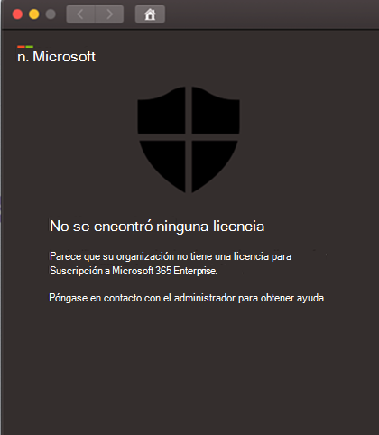

# Solucionar problemas de licencia para Microsoft Defender para Endpoint en macOSTroubleshoot license issues for Microsoft Defender for Endpoint on macOS

[!INCLUDE [Microsoft 365 Defender rebranding](../../includes/microsoft-defender.md)]

**Se aplica a:****Applies to:**

- [Microsoft Defender para punto de conexión en macOSMicrosoft Defender for Endpoint on macOS](microsoft-defender-endpoint-mac.md)
- [Microsoft Defender para punto de conexiónMicrosoft Defender for Endpoint](https://go.microsoft.com/fwlink/p/?linkid=2154037)
- [Microsoft 365 DefenderMicrosoft 365 Defender](https://go.microsoft.com/fwlink/?linkid=2118804)

> ¿Desea experimentar Microsoft Defender para endpoint?Want to experience Microsoft Defender for Endpoint? [Regístrate para obtener una versión de prueba gratuita.Sign up for a free trial.](https://www.microsoft.com/microsoft-365/windows/microsoft-defender-atp?ocid=docs-wdatp-exposedapis-abovefoldlink)

Mientras estás pasando por Microsoft Defender para endpoint en [macOS](microsoft-defender-endpoint-mac.md) [y](mac-install-manually.md) pruebas de implementación manual o una prueba de concepto (PoC), es posible que recibas el siguiente error:While you are going through [Microsoft Defender for Endpoint on macOS](microsoft-defender-endpoint-mac.md) and [Manual deployment](mac-install-manually.md) testing or a Proof Of Concept (PoC), you might get the following error:

**Mensaje:****Message:** 

No se encontró ninguna licenciaNo license found

Parece que su organización no tiene una licencia para Microsoft 365 Enterprise suscripción.Looks like your organization does not have a license for Microsoft 365 Enterprise subscription.

Póngase en contacto con el administrador para obtener ayuda.Contact your administrator for help.

**Causa:****Cause:** 

Implementó o instaló el paquete de Microsoft Defender para endpoint para macOS (&quot;Descargar paquete de instalación"), pero es posible que haya ejecutado el script de configuración ("Descargar paquete de incorporación") o que no haya asignado una licencia al usuario.You deployed and/or installed the Microsoft Defender for Endpoint for macOS package ("Download installation package"), but you might have run the configuration script ("Download onboarding package"), or you have not assigned a license to the user.

**Solución:****Solution:**

Siga las instrucciones MicrosoftDefenderATPOnboardingMacOs.py documentadas aquí: [Configuración de cliente](mac-install-manually.md#client-configuration)Follow the MicrosoftDefenderATPOnboardingMacOs.py instructions documented here: [Client configuration](mac-install-manually.md#client-configuration)
