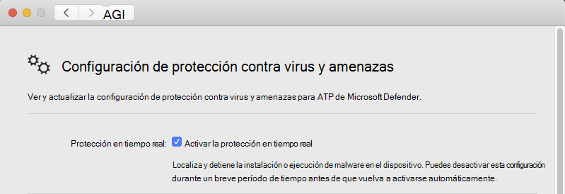

# <a name="troubleshoot-performance-issues-for-microsoft-defender-for-endpoint-on-macos"></a>Solucionar problemas de rendimiento de Microsoft Defender para Endpoint en macOS

[!INCLUDE [Microsoft 365 Defender rebranding](../../includes/microsoft-defender.md)]


**Se aplica a:**

- [Microsoft Defender para endpoint en macOS](microsoft-defender-endpoint-mac.md)
- [Microsoft Defender para punto de conexión](https://go.microsoft.com/fwlink/p/?linkid=2154037)
- [Microsoft 365 Defender](https://go.microsoft.com/fwlink/?linkid=2118804)

> ¿Desea experimentar Microsoft Defender para endpoint? [Regístrate para obtener una versión de prueba gratuita.](https://www.microsoft.com/microsoft-365/windows/microsoft-defender-atp?ocid=docs-wdatp-exposedapis-abovefoldlink)

En este tema se proporcionan algunos pasos generales que se pueden usar para limitar los problemas de rendimiento relacionados con Microsoft Defender para Endpoint en macOS.

La protección en tiempo real (RTP) es una característica de Microsoft Defender para Endpoint en macOS que supervisa y protege continuamente el dispositivo contra amenazas. Consiste en la supervisión de archivos y procesos y otras heurísticas.

Según las aplicaciones que ejecutes y las características del dispositivo, es posible que experimentes un rendimiento subóptimo al ejecutar Microsoft Defender para Endpoint en macOS. En particular, las aplicaciones o los procesos del sistema que tienen acceso a muchos recursos en un período de tiempo corto pueden provocar problemas de rendimiento en Microsoft Defender para Endpoint en macOS.

Se pueden usar los siguientes pasos para solucionar y mitigar estos problemas:

1. Deshabilite la protección en tiempo real con uno de los siguientes métodos y observe si el rendimiento mejora. Este enfoque ayuda a limitar si Microsoft Defender para Endpoint en macOS está contribuyendo a los problemas de rendimiento.

      Si su organización no administra el dispositivo, la protección en tiempo real se puede deshabilitar mediante una de las siguientes opciones:

    - Desde la interfaz de usuario. Abra Microsoft Defender para endpoint en macOS y vaya a **Administrar configuración**.

      

    - Desde el terminal. Por motivos de seguridad, esta operación requiere elevación.

      ```bash
      mdatp config real-time-protection --value disabled
      ```

      Si su organización administra el dispositivo, el administrador puede deshabilitar la protección en tiempo real con las instrucciones de Establecer preferencias para Microsoft Defender para endpoint [en macOS](mac-preferences.md).
      
      Si el problema de rendimiento persiste mientras la protección en tiempo real está desactivada, el origen del problema podría ser el componente de detección y respuesta del extremo. En este caso, póngase en contacto con el servicio de soporte al cliente para obtener más instrucciones y mitigación.

2. Abra Finder y vaya a  >  **Utilidades de aplicaciones**. Abra **El Monitor de** actividad y analice qué aplicaciones usan los recursos del sistema. Algunos ejemplos típicos son los actualizadores de software y los compiladores.

1. Para buscar las aplicaciones que están desencadenando la mayoría de los exámenes, puedes usar estadísticas en tiempo real recopiladas por Defender para Endpoint para Mac.

      > [!NOTE]
      > Esta característica está disponible en la versión 100.90.70 o posterior.
      Esta característica está habilitada de forma predeterminada en los canales **Dogfood** **e InsiderFast.** Si usa un canal de actualización diferente, esta característica se puede habilitar desde la línea de comandos:
      ```bash
      mdatp config real-time-protection-statistics  --value enabled
      ```

      Esta característica requiere protección en tiempo real para habilitarse. Para comprobar el estado de la protección en tiempo real, ejecute el siguiente comando:

      ```bash
      mdatp health --field real_time_protection_enabled
      ```

    Compruebe que la **real_time_protection_enabled** es true. De lo contrario, ejecute el siguiente comando para habilitarlo:

      ```bash
      mdatp config real-time-protection --value enabled
      ```

      ```output
      Configuration property updated
      ```

      Para recopilar estadísticas actuales, ejecute:

      ```bash
      mdatp config real-time-protection --value enabled
      ```

      > [!NOTE]
      > El **uso de --output json** (tenga en cuenta el guión doble) garantiza que el formato de salida esté listo para el análisis.
      El resultado de este comando mostrará todos los procesos y su actividad de examen asociada.

1. En el sistema Mac, descargue el analizador python de ejemplo high_cpu_parser.py mediante el comando:

    ```bash
    wget -c https://raw.githubusercontent.com/microsoft/mdatp-xplat/master/linux/diagnostic/high_cpu_parser.py
    ```

    El resultado de este comando debe ser similar al siguiente:

    ```Output
    --2020-11-14 11:27:27-- https://raw.githubusercontent.com/microsoft.
    mdatp-xplat/master/linus/diagnostic/high_cpu_parser.py
    Resolving raw.githubusercontent.com (raw.githubusercontent.com)... 151.101.xxx.xxx
    Connecting to raw.githubusercontent.com (raw.githubusercontent.com)| 151.101.xxx.xxx| :443... connected.
    HTTP request sent, awaiting response... 200 OK
    Length: 1020 [text/plain]
    Saving to: 'high_cpu_parser.py'
    100%[===========================================>] 1,020    --.-K/s   in 
    0s
    ```

1. A continuación, escriba los siguientes comandos:

      ```bash
        chmod +x high_cpu_parser.py
      ```

      ```bash
        cat real_time_protection.json | python high_cpu_parser.py  > real_time_protection.log
      ```

      El resultado de lo anterior es una lista de los principales colaboradores de problemas de rendimiento. La primera columna es el identificador de proceso (PID), la segunda columna es el nombre del proceso y la última columna es el número de archivos examinados, ordenados por impacto.

      Por ejemplo, el resultado del comando será algo parecido al siguiente:

      ```output
        ... > python ~/repo/mdatp-xplat/linux/diagnostic/high_cpu_parser.py <~Downloads/output.json | head -n 10
        27432 None 76703
        73467 actool     1249
        73914 xcodebuild 1081
        73873 bash 1050
        27475 None 836
        1    launchd    407
        73468 ibtool     344
        549  telemetryd_v1   325
        4764 None 228
        125  CrashPlanService 164
      ```

      Para mejorar el rendimiento de Defender para Endpoint en Mac, busca el que tiene el número más alto en la fila Total de archivos analizados y agrega una exclusión para él. Para obtener más información, vea [Configure and validate exclusions for Defender for Endpoint on Linux](linux-exclusions.md).

      > [!NOTE]
      > La aplicación almacena estadísticas en la memoria y solo realiza un seguimiento de la actividad del archivo desde que se inició y se ha habilitado la protección en tiempo real. Los procesos que se iniciaron antes o durante períodos en los que la protección en tiempo real estaba desactivada no se cuentan. Además, solo se cuentan los eventos que desencadenaron exámenes.
      > 
1. Configure Microsoft Defender para endpoint en macOS con exclusiones para los procesos o ubicaciones de disco que contribuyen a los problemas de rendimiento y vuelva a habilitar la protección en tiempo real.

     Consulta [Configurar y validar exclusiones para Microsoft Defender para Endpoint en macOS](mac-exclusions.md) para obtener más información.
