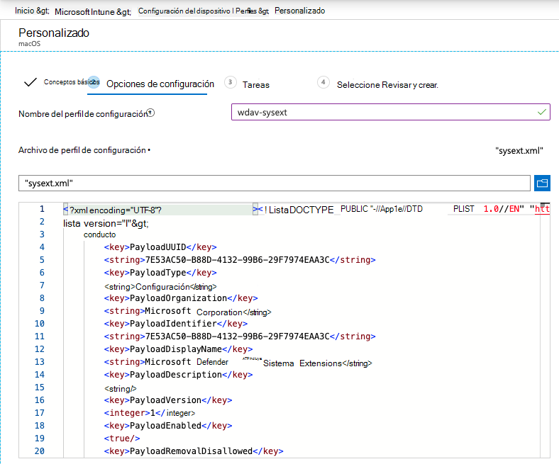

# <a name="new-configuration-profiles-for-macos-catalina-and-newer-versions-of-macos"></a><span data-ttu-id="ef740-104">Nuevos perfiles de configuración para macOS Catalina y versiones más recientes de macOS</span><span class="sxs-lookup"><span data-stu-id="ef740-104">New configuration profiles for macOS Catalina and newer versions of macOS</span></span>

[!INCLUDE [Microsoft 365 Defender rebranding](../../includes/microsoft-defender.md)]

<span data-ttu-id="ef740-105">**Se aplica a:**</span><span class="sxs-lookup"><span data-stu-id="ef740-105">**Applies to:**</span></span>
- [<span data-ttu-id="ef740-106">Microsoft Defender para punto de conexión</span><span class="sxs-lookup"><span data-stu-id="ef740-106">Microsoft Defender for Endpoint</span></span>](https://go.microsoft.com/fwlink/p/?linkid=2154037)
- [<span data-ttu-id="ef740-107">Microsoft 365 Defender</span><span class="sxs-lookup"><span data-stu-id="ef740-107">Microsoft 365 Defender</span></span>](https://go.microsoft.com/fwlink/?linkid=2118804)

> <span data-ttu-id="ef740-108">¿Desea experimentar Microsoft Defender para endpoint?</span><span class="sxs-lookup"><span data-stu-id="ef740-108">Want to experience Microsoft Defender for Endpoint?</span></span> [<span data-ttu-id="ef740-109">Regístrate para obtener una versión de prueba gratuita.</span><span class="sxs-lookup"><span data-stu-id="ef740-109">Sign up for a free trial.</span></span>](https://www.microsoft.com/microsoft-365/windows/microsoft-defender-atp?ocid=docs-wdatp-exposedapis-abovefoldlink)

<span data-ttu-id="ef740-110">En alineación con la evolución de macOS, estamos preparando una actualización de Microsoft Defender para Endpoint en macOS que aprovecha las extensiones del sistema en lugar de las extensiones de kernel.</span><span class="sxs-lookup"><span data-stu-id="ef740-110">In alignment with macOS evolution, we are preparing a Microsoft Defender for Endpoint on macOS update that leverages system extensions instead of kernel extensions.</span></span> <span data-ttu-id="ef740-111">Esta actualización solo se aplicará a macOS Catalina (10.15.4) y versiones más recientes de macOS.</span><span class="sxs-lookup"><span data-stu-id="ef740-111">This update will only be applicable to macOS Catalina (10.15.4) and newer versions of macOS.</span></span>

<span data-ttu-id="ef740-112">Si has implementado Microsoft Defender para Endpoint en macOS en un entorno administrado (a través de JAMF, Intune u otra solución MDM), debes implementar nuevos perfiles de configuración.</span><span class="sxs-lookup"><span data-stu-id="ef740-112">If you have deployed Microsoft Defender for Endpoint on macOS in a managed environment (through JAMF, Intune, or another MDM solution), you must deploy new configuration profiles.</span></span> <span data-ttu-id="ef740-113">Si no se hacen estos pasos, los usuarios recibirán solicitudes de aprobación para ejecutar estos nuevos componentes.</span><span class="sxs-lookup"><span data-stu-id="ef740-113">Failure to do these steps will result in users getting approval prompts to run these new components.</span></span>

## <a name="jamf"></a><span data-ttu-id="ef740-114">JAMF</span><span class="sxs-lookup"><span data-stu-id="ef740-114">JAMF</span></span>

### <a name="system-extensions-policy"></a><span data-ttu-id="ef740-115">Directiva de extensiones del sistema</span><span class="sxs-lookup"><span data-stu-id="ef740-115">System Extensions Policy</span></span>

<span data-ttu-id="ef740-116">Para aprobar las extensiones del sistema, cree la siguiente carga:</span><span class="sxs-lookup"><span data-stu-id="ef740-116">To approve the system extensions, create the following payload:</span></span>

1. <span data-ttu-id="ef740-117">En **Equipos > de configuración seleccione** Opciones > Extensiones del **sistema**.</span><span class="sxs-lookup"><span data-stu-id="ef740-117">In **Computers > Configuration Profiles** select **Options > System Extensions**.</span></span>
2. <span data-ttu-id="ef740-118">Seleccione **Extensiones de sistema permitidas en** la lista desplegable Tipos **de** extensión del sistema.</span><span class="sxs-lookup"><span data-stu-id="ef740-118">Select **Allowed System Extensions** from the **System Extension Types** drop-down list.</span></span>
3. <span data-ttu-id="ef740-119">Usa **UBF8T346G9 para** id. de equipo.</span><span class="sxs-lookup"><span data-stu-id="ef740-119">Use **UBF8T346G9** for Team Id.</span></span>
4. <span data-ttu-id="ef740-120">Agregue los siguientes identificadores de agrupación a la **lista Extensiones de sistema permitidas:**</span><span class="sxs-lookup"><span data-stu-id="ef740-120">Add the following bundle identifiers to the **Allowed System Extensions** list:</span></span>

    - <span data-ttu-id="ef740-121">**com.microsoft.wdav.epsext**</span><span class="sxs-lookup"><span data-stu-id="ef740-121">**com.microsoft.wdav.epsext**</span></span>
    - <span data-ttu-id="ef740-122">**com.microsoft.wdav.netext**</span><span class="sxs-lookup"><span data-stu-id="ef740-122">**com.microsoft.wdav.netext**</span></span>

    

### <a name="privacy-preferences-policy-control"></a><span data-ttu-id="ef740-124">Control de directiva de preferencias de privacidad</span><span class="sxs-lookup"><span data-stu-id="ef740-124">Privacy Preferences Policy Control</span></span>

<span data-ttu-id="ef740-125">Agregue la siguiente carga de JAMF para conceder acceso en disco completo a Microsoft Defender para endpoint security extension.</span><span class="sxs-lookup"><span data-stu-id="ef740-125">Add the following JAMF payload to grant Full Disk Access to the Microsoft Defender for Endpoint Endpoint Security Extension.</span></span> <span data-ttu-id="ef740-126">Esta directiva es un requisito previo para ejecutar la extensión en el dispositivo.</span><span class="sxs-lookup"><span data-stu-id="ef740-126">This policy is a pre-requisite for running the extension on your device.</span></span>

1. <span data-ttu-id="ef740-127">Seleccione **Opciones Control de** directiva de  >  **preferencias de privacidad**.</span><span class="sxs-lookup"><span data-stu-id="ef740-127">Select **Options** > **Privacy Preferences Policy Control**.</span></span>
2. <span data-ttu-id="ef740-128">Se `com.microsoft.wdav.epsext` usa como identificador **y** como tipo `Bundle ID` de **agrupación**.</span><span class="sxs-lookup"><span data-stu-id="ef740-128">Use `com.microsoft.wdav.epsext` as the **Identifier** and `Bundle ID` as **Bundle type**.</span></span>
3. <span data-ttu-id="ef740-129">Establecer el requisito de código en `identifier "com.microsoft.wdav.epsext" and anchor apple generic and certificate 1[field.1.2.840.113635.100.6.2.6] /* exists */ and certificate leaf[field.1.2.840.113635.100.6.1.13] /* exists */ and certificate leaf[subject.OU] = UBF8T346G9`</span><span class="sxs-lookup"><span data-stu-id="ef740-129">Set Code Requirement to `identifier "com.microsoft.wdav.epsext" and anchor apple generic and certificate 1[field.1.2.840.113635.100.6.2.6] /* exists */ and certificate leaf[field.1.2.840.113635.100.6.1.13] /* exists */ and certificate leaf[subject.OU] = UBF8T346G9`</span></span>
4. <span data-ttu-id="ef740-130">Establezca **Aplicación o servicio en** **SystemPolicyAllFiles** y acceso a **Permitir**.</span><span class="sxs-lookup"><span data-stu-id="ef740-130">Set **App or service** to **SystemPolicyAllFiles** and access to **Allow**.</span></span>

    

### <a name="network-extension-policy"></a><span data-ttu-id="ef740-132">Directiva de extensión de red</span><span class="sxs-lookup"><span data-stu-id="ef740-132">Network Extension Policy</span></span>

<span data-ttu-id="ef740-133">Como parte de las capacidades de detección y respuesta de puntos de conexión, Microsoft Defender para Endpoint en macOS inspecciona el tráfico de sockets e informa de esta información al portal del Centro de seguridad de Microsoft Defender.</span><span class="sxs-lookup"><span data-stu-id="ef740-133">As part of the Endpoint Detection and Response capabilities, Microsoft Defender for Endpoint on macOS inspects socket traffic and reports this information to the Microsoft Defender Security Center portal.</span></span> <span data-ttu-id="ef740-134">La siguiente directiva permite que la extensión de red realice esta funcionalidad.</span><span class="sxs-lookup"><span data-stu-id="ef740-134">The following policy allows the network extension to perform this functionality.</span></span>

>[!NOTE]
><span data-ttu-id="ef740-135">JAMF no tiene compatibilidad integrada con directivas de filtrado de contenido, que son un requisito previo para habilitar las extensiones de red que Microsoft Defender para Endpoint en macOS instala en el dispositivo.</span><span class="sxs-lookup"><span data-stu-id="ef740-135">JAMF doesn’t have built-in support for content filtering policies, which are a pre-requisite for enabling the network extensions that Microsoft Defender for Endpoint on macOS installs on the device.</span></span> <span data-ttu-id="ef740-136">Además, JAMF a veces cambia el contenido de las directivas que se implementan.</span><span class="sxs-lookup"><span data-stu-id="ef740-136">Furthermore, JAMF sometimes changes the content of the policies being deployed.</span></span>
><span data-ttu-id="ef740-137">Por lo tanto, los siguientes pasos proporcionan una solución alternativa que implica firmar el perfil de configuración.</span><span class="sxs-lookup"><span data-stu-id="ef740-137">As such, the following steps provide a workaround that involve signing the configuration profile.</span></span>

1. <span data-ttu-id="ef740-138">Guarde el siguiente contenido en el dispositivo como `com.microsoft.network-extension.mobileconfig` si usara un editor de texto:</span><span class="sxs-lookup"><span data-stu-id="ef740-138">Save the following content to your device as `com.microsoft.network-extension.mobileconfig` using a text editor:</span></span>

    ```xml
    <?xml version="1.0" encoding="UTF-8"?><!DOCTYPE plist PUBLIC "-//Apple//DTD PLIST 1.0//EN" "http://www.apple.com/DTDs/PropertyList-1.0.dtd">
    <plist version="1">
        <dict>
            <key>PayloadUUID</key>
            <string>DA2CC794-488B-4AFF-89F7-6686A7E7B8AB</string>
            <key>PayloadType</key>
            <string>Configuration</string>
            <key>PayloadOrganization</key>
            <string>Microsoft Corporation</string>
            <key>PayloadIdentifier</key>
            <string>DA2CC794-488B-4AFF-89F7-6686A7E7B8AB</string>
            <key>PayloadDisplayName</key>
            <string>Microsoft Defender ATP Network Extension</string>
            <key>PayloadDescription</key>
            <string/>
            <key>PayloadVersion</key>
            <integer>1</integer>
            <key>PayloadEnabled</key>
            <true/>
            <key>PayloadRemovalDisallowed</key>
            <true/>
            <key>PayloadScope</key>
            <string>System</string>
            <key>PayloadContent</key>
            <array>
                <dict>
                    <key>PayloadUUID</key>
                    <string>2BA070D9-2233-4827-AFC1-1F44C8C8E527</string>
                    <key>PayloadType</key>
                    <string>com.apple.webcontent-filter</string>
                    <key>PayloadOrganization</key>
                    <string>Microsoft Corporation</string>
                    <key>PayloadIdentifier</key>
                    <string>CEBF7A71-D9A1-48BD-8CCF-BD9D18EC155A</string>
                    <key>PayloadDisplayName</key>
                    <string>Approved Network Extension</string>
                    <key>PayloadDescription</key>
                    <string/>
                    <key>PayloadVersion</key>
                    <integer>1</integer>
                    <key>PayloadEnabled</key>
                    <true/>
                    <key>FilterType</key>
                    <string>Plugin</string>
                    <key>UserDefinedName</key>
                    <string>Microsoft Defender ATP Network Extension</string>
                    <key>PluginBundleID</key>
                    <string>com.microsoft.wdav</string>
                    <key>FilterSockets</key>
                    <true/>
                    <key>FilterDataProviderBundleIdentifier</key>
                    <string>com.microsoft.wdav.netext</string>
                    <key>FilterDataProviderDesignatedRequirement</key>
                    <string>identifier "com.microsoft.wdav.netext" and anchor apple generic and certificate 1[field.1.2.840.113635.100.6.2.6] /* exists */ and certificate leaf[field.1.2.840.113635.100.6.1.13] /* exists */ and certificate leaf[subject.OU] = UBF8T346G9</string>
                </dict>
            </array>
        </dict>
    </plist>
    ```

2. <span data-ttu-id="ef740-139">Compruebe que el archivo anterior se copió correctamente ejecutando la `plutil` utilidad en el Terminal:</span><span class="sxs-lookup"><span data-stu-id="ef740-139">Verify that the above file was copied correctly by running the `plutil` utility in the Terminal:</span></span>

    ```bash
    $ plutil -lint <PathToFile>/com.microsoft.network-extension.mobileconfig
    ```

    <span data-ttu-id="ef740-140">Por ejemplo, si el archivo se almacenaba en Documentos:</span><span class="sxs-lookup"><span data-stu-id="ef740-140">For example, if the file was stored in Documents:</span></span>

    ```bash
    $ plutil -lint ~/Documents/com.microsoft.network-extension.mobileconfig
    ```
    
    <span data-ttu-id="ef740-141">Compruebe que el comando genera `OK` .</span><span class="sxs-lookup"><span data-stu-id="ef740-141">Verify that the command outputs `OK`.</span></span>
        
    ```bash
    <PathToFile>/com.microsoft.network-extension.mobileconfig: OK
    ```
    
3. <span data-ttu-id="ef740-142">Siga las instrucciones de [esta página para](https://www.jamf.com/jamf-nation/articles/649/creating-a-signing-certificate-using-jamf-pro-s-built-in-certificate-authority) crear un certificado de firma con la entidad de certificación integrada de JAMF.</span><span class="sxs-lookup"><span data-stu-id="ef740-142">Follow the instructions on [this page](https://www.jamf.com/jamf-nation/articles/649/creating-a-signing-certificate-using-jamf-pro-s-built-in-certificate-authority) to create a signing certificate using JAMF’s built-in certificate authority.</span></span>

4. <span data-ttu-id="ef740-143">Después de crear e instalar el certificado en el dispositivo, ejecute el siguiente comando desde el Terminal para firmar el archivo:</span><span class="sxs-lookup"><span data-stu-id="ef740-143">After the certificate is created and installed to your device, run the following command from the Terminal to sign the file:</span></span>

    ```bash
    $ security cms -S -N "<CertificateName>" -i <PathToFile>/com.microsoft.network-extension.mobileconfig -o <PathToSignedFile>/com.microsoft.network-extension.signed.mobileconfig
    ```
    
    <span data-ttu-id="ef740-144">Por ejemplo, si el nombre del certificado es **SigningCertificate** y el archivo firmado se va a almacenar en Documentos:</span><span class="sxs-lookup"><span data-stu-id="ef740-144">For example, if the certificate name is **SigningCertificate** and the signed file is going to be stored in Documents:</span></span>
    
    ```bash
    $ security cms -S -N "SigningCertificate" -i ~/Documents/com.microsoft.network-extension.mobileconfig -o ~/Documents/com.microsoft.network-extension.signed.mobileconfig
    ```
    
5. <span data-ttu-id="ef740-145">En el portal jamf, vaya a **Perfiles de configuración** y haga clic en **el botón** Cargar.</span><span class="sxs-lookup"><span data-stu-id="ef740-145">From the JAMF portal, navigate to **Configuration Profiles** and click the **Upload** button.</span></span> <span data-ttu-id="ef740-146">Seleccione `com.microsoft.network-extension.signed.mobileconfig` cuando se le pida el archivo.</span><span class="sxs-lookup"><span data-stu-id="ef740-146">Select `com.microsoft.network-extension.signed.mobileconfig` when prompted for the file.</span></span>

## <a name="intune"></a><span data-ttu-id="ef740-147">Intune</span><span class="sxs-lookup"><span data-stu-id="ef740-147">Intune</span></span>

### <a name="system-extensions-policy"></a><span data-ttu-id="ef740-148">Directiva de extensiones del sistema</span><span class="sxs-lookup"><span data-stu-id="ef740-148">System Extensions Policy</span></span>

<span data-ttu-id="ef740-149">Para aprobar las extensiones del sistema:</span><span class="sxs-lookup"><span data-stu-id="ef740-149">To approve the system extensions:</span></span>

1. <span data-ttu-id="ef740-150">En Intune, abra **Administrar configuración**  >  **de dispositivo.**</span><span class="sxs-lookup"><span data-stu-id="ef740-150">In Intune, open **Manage** > **Device configuration**.</span></span> <span data-ttu-id="ef740-151">Seleccione **Administrar**  >  **perfiles Crear**  >  **perfil**.</span><span class="sxs-lookup"><span data-stu-id="ef740-151">Select **Manage** > **Profiles** > **Create Profile**.</span></span>
2. <span data-ttu-id="ef740-152">Elija un nombre para el perfil.</span><span class="sxs-lookup"><span data-stu-id="ef740-152">Choose a name for the profile.</span></span> <span data-ttu-id="ef740-153">Cambiar **Platform=macOS** a **Profile type=Extensions**.</span><span class="sxs-lookup"><span data-stu-id="ef740-153">Change **Platform=macOS** to **Profile type=Extensions**.</span></span> <span data-ttu-id="ef740-154">Seleccione **Crear**.</span><span class="sxs-lookup"><span data-stu-id="ef740-154">Select **Create**.</span></span>
3. <span data-ttu-id="ef740-155">En la `Basics` pestaña, asigne un nombre a este nuevo perfil.</span><span class="sxs-lookup"><span data-stu-id="ef740-155">In the `Basics` tab, give a name to this new profile.</span></span>
4. <span data-ttu-id="ef740-156">En la `Configuration settings` pestaña, agregue las siguientes entradas en la `Allowed system extensions` sección:</span><span class="sxs-lookup"><span data-stu-id="ef740-156">In the `Configuration settings` tab, add the following entries in the `Allowed system extensions` section:</span></span>

    <span data-ttu-id="ef740-157">Identificador de agrupación</span><span class="sxs-lookup"><span data-stu-id="ef740-157">Bundle identifier</span></span>         | <span data-ttu-id="ef740-158">Identificador de equipo</span><span class="sxs-lookup"><span data-stu-id="ef740-158">Team identifier</span></span>
    --------------------------|----------------
    <span data-ttu-id="ef740-159">com.microsoft.wdav.epsext</span><span class="sxs-lookup"><span data-stu-id="ef740-159">com.microsoft.wdav.epsext</span></span> | <span data-ttu-id="ef740-160">UBF8T346G9</span><span class="sxs-lookup"><span data-stu-id="ef740-160">UBF8T346G9</span></span>
    <span data-ttu-id="ef740-161">com.microsoft.wdav.netext</span><span class="sxs-lookup"><span data-stu-id="ef740-161">com.microsoft.wdav.netext</span></span> | <span data-ttu-id="ef740-162">UBF8T346G9</span><span class="sxs-lookup"><span data-stu-id="ef740-162">UBF8T346G9</span></span>

    

5. <span data-ttu-id="ef740-164">En la `Assignments` pestaña, asigne este perfil a **Todos los usuarios & Todos los dispositivos**.</span><span class="sxs-lookup"><span data-stu-id="ef740-164">In the `Assignments` tab, assign this profile to **All Users & All devices**.</span></span>
6. <span data-ttu-id="ef740-165">Revise y cree este perfil de configuración.</span><span class="sxs-lookup"><span data-stu-id="ef740-165">Review and create this configuration profile.</span></span>

### <a name="create-and-deploy-the-custom-configuration-profile"></a><span data-ttu-id="ef740-166">Crear e implementar el perfil de configuración personalizado</span><span class="sxs-lookup"><span data-stu-id="ef740-166">Create and deploy the Custom Configuration Profile</span></span>

<span data-ttu-id="ef740-167">El siguiente perfil de configuración habilita la extensión de red y concede acceso en disco completo a la extensión del sistema endpoint security.</span><span class="sxs-lookup"><span data-stu-id="ef740-167">The following configuration profile enables the network extension and grants Full Disk Access to the Endpoint Security system extension.</span></span> 

<span data-ttu-id="ef740-168">Guarde el siguiente contenido en un archivo denominado **sysext.xml**:</span><span class="sxs-lookup"><span data-stu-id="ef740-168">Save the following content to a file named **sysext.xml**:</span></span>

```xml
<?xml version="1.0" encoding="UTF-8"?><!DOCTYPE plist PUBLIC "-//Apple//DTD PLIST 1.0//EN" "http://www.apple.com/DTDs/PropertyList-1.0.dtd">
<plist version="1">
    <dict>
        <key>PayloadUUID</key>
        <string>7E53AC50-B88D-4132-99B6-29F7974EAA3C</string>
        <key>PayloadType</key>
        <string>Configuration</string>
        <key>PayloadOrganization</key>
        <string>Microsoft Corporation</string>
        <key>PayloadIdentifier</key>
        <string>7E53AC50-B88D-4132-99B6-29F7974EAA3C</string>
        <key>PayloadDisplayName</key>
        <string>Microsoft Defender ATP System Extensions</string>
        <key>PayloadDescription</key>
        <string/>
        <key>PayloadVersion</key>
        <integer>1</integer>
        <key>PayloadEnabled</key>
        <true/>
        <key>PayloadRemovalDisallowed</key>
        <true/>
        <key>PayloadScope</key>
        <string>System</string>
        <key>PayloadContent</key>
        <array>
            <dict>
                <key>PayloadUUID</key>
                <string>2BA070D9-2233-4827-AFC1-1F44C8C8E527</string>
                <key>PayloadType</key>
                <string>com.apple.webcontent-filter</string>
                <key>PayloadOrganization</key>
                <string>Microsoft Corporation</string>
                <key>PayloadIdentifier</key>
                <string>CEBF7A71-D9A1-48BD-8CCF-BD9D18EC155A</string>
                <key>PayloadDisplayName</key>
                <string>Approved Network Extension</string>
                <key>PayloadDescription</key>
                <string/>
                <key>PayloadVersion</key>
                <integer>1</integer>
                <key>PayloadEnabled</key>
                <true/>
                <key>FilterType</key>
                <string>Plugin</string>
                <key>UserDefinedName</key>
                <string>Microsoft Defender ATP Network Extension</string>
                <key>PluginBundleID</key>
                <string>com.microsoft.wdav</string>
                <key>FilterSockets</key>
                <true/>
                <key>FilterDataProviderBundleIdentifier</key>
                <string>com.microsoft.wdav.netext</string>
                <key>FilterDataProviderDesignatedRequirement</key>
                <string>identifier &quot;com.microsoft.wdav.netext&quot; and anchor apple generic and certificate 1[field.1.2.840.113635.100.6.2.6] /* exists */ and certificate leaf[field.1.2.840.113635.100.6.1.13] /* exists */ and certificate leaf[subject.OU] = UBF8T346G9</string>
            </dict>
            <dict>
                <key>PayloadUUID</key>
                <string>56105E89-C7C8-4A95-AEE6-E11B8BEA0366</string>
                <key>PayloadType</key>
                <string>com.apple.TCC.configuration-profile-policy</string>
                <key>PayloadOrganization</key>
                <string>Microsoft Corporation</string>
                <key>PayloadIdentifier</key>
                <string>56105E89-C7C8-4A95-AEE6-E11B8BEA0366</string>
                <key>PayloadDisplayName</key>
                <string>Privacy Preferences Policy Control</string>
                <key>PayloadDescription</key>
                <string/>
                <key>PayloadVersion</key>
                <integer>1</integer>
                <key>PayloadEnabled</key>
                <true/>
                <key>Services</key>
                <dict>
                    <key>SystemPolicyAllFiles</key>
                    <array>
                        <dict>
                            <key>Identifier</key>
                            <string>com.microsoft.wdav.epsext</string>
                            <key>CodeRequirement</key>
                            <string>identifier "com.microsoft.wdav.epsext" and anchor apple generic and certificate 1[field.1.2.840.113635.100.6.2.6] /* exists */ and certificate leaf[field.1.2.840.113635.100.6.1.13] /* exists */ and certificate leaf[subject.OU] = UBF8T346G9</string>
                            <key>IdentifierType</key>
                            <string>bundleID</string>
                            <key>StaticCode</key>
                            <integer>0</integer>
                            <key>Allowed</key>
                            <integer>1</integer>
                        </dict>
                    </array>
                </dict>
            </dict>
        </array>
    </dict>
</plist>
```

<span data-ttu-id="ef740-169">Compruebe que el archivo anterior se copió correctamente.</span><span class="sxs-lookup"><span data-stu-id="ef740-169">Verify that the above file was copied correctly.</span></span> <span data-ttu-id="ef740-170">Desde el Terminal, ejecute el siguiente comando y compruebe que emite `OK` :</span><span class="sxs-lookup"><span data-stu-id="ef740-170">From the Terminal, run the following command and verify that it outputs `OK`:</span></span>

```bash
$ plutil -lint sysext.xml
sysext.xml: OK
```

<span data-ttu-id="ef740-171">Para implementar este perfil de configuración personalizado:</span><span class="sxs-lookup"><span data-stu-id="ef740-171">To deploy this custom configuration profile:</span></span>

1.  <span data-ttu-id="ef740-172">En Intune, abra **Administrar configuración**  >  **de dispositivo.**</span><span class="sxs-lookup"><span data-stu-id="ef740-172">In Intune, open **Manage** > **Device configuration**.</span></span> <span data-ttu-id="ef740-173">Seleccione **Administrar**  >  **perfiles Crear**  >  **perfil**.</span><span class="sxs-lookup"><span data-stu-id="ef740-173">Select **Manage** > **Profiles** > **Create profile**.</span></span>
2. <span data-ttu-id="ef740-174">Elija un nombre para el perfil.</span><span class="sxs-lookup"><span data-stu-id="ef740-174">Choose a name for the profile.</span></span> <span data-ttu-id="ef740-175">Cambiar **Platform=macOS** y **Profile type=Custom**.</span><span class="sxs-lookup"><span data-stu-id="ef740-175">Change **Platform=macOS** and **Profile type=Custom**.</span></span> <span data-ttu-id="ef740-176">Seleccione **Configurar**.</span><span class="sxs-lookup"><span data-stu-id="ef740-176">Select **Configure**.</span></span>
3.  <span data-ttu-id="ef740-177">Abra el perfil de configuración y cargue **sysext.xml**.</span><span class="sxs-lookup"><span data-stu-id="ef740-177">Open the configuration profile and upload **sysext.xml**.</span></span> <span data-ttu-id="ef740-178">Este archivo se creó en el paso anterior.</span><span class="sxs-lookup"><span data-stu-id="ef740-178">This file was created in the preceding step.</span></span>
4.  <span data-ttu-id="ef740-179">Elija **Aceptar**.</span><span class="sxs-lookup"><span data-stu-id="ef740-179">Select **OK**.</span></span>

    

5. <span data-ttu-id="ef740-181">En la `Assignments` pestaña, asigne este perfil a **Todos los usuarios & Todos los dispositivos**.</span><span class="sxs-lookup"><span data-stu-id="ef740-181">In the `Assignments` tab, assign this profile to **All Users & All devices**.</span></span>
6. <span data-ttu-id="ef740-182">Revise y cree este perfil de configuración.</span><span class="sxs-lookup"><span data-stu-id="ef740-182">Review and create this configuration profile.</span></span>
