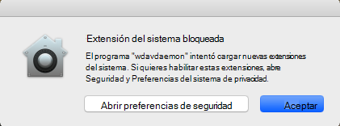
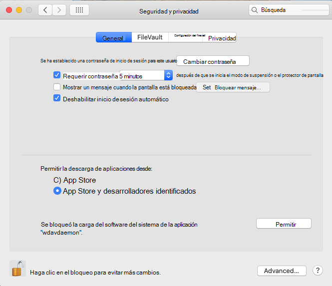
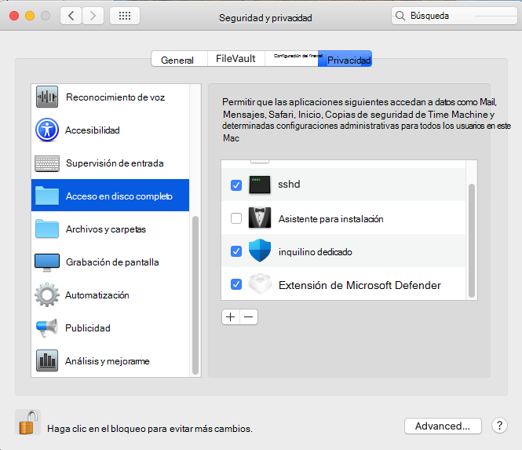

# <a name="microsoft-defender-for-endpoint-for-mac---system-extensions-public-preview"></a>Microsoft Defender para Endpoint para Mac: versión preliminar pública de extensiones del sistema)

**Se aplica a:**
- [Microsoft Defender para punto de conexión](https://go.microsoft.com/fwlink/p/?linkid=2154037)
- [Microsoft 365 Defender](https://go.microsoft.com/fwlink/?linkid=2118804)

> ¿Desea experimentar Microsoft Defender para endpoint? [Regístrate para obtener una versión de prueba gratuita.](https://www.microsoft.com/microsoft-365/windows/microsoft-defender-atp?ocid=docs-wdatp-exposedapis-abovefoldlink)

En alineación con la evolución de macOS, estamos preparando una actualización de Defender para Endpoint para Mac que aprovecha las extensiones del sistema en lugar de las extensiones de kernel. Esta actualización solo se aplicará a macOS Catalina (10.15.4) y versiones posteriores de macOS.

Esta funcionalidad está actualmente en versión preliminar pública. En este artículo se describe cómo habilitar esta funcionalidad en el dispositivo. Puedes probar esta característica localmente en tu propio dispositivo o configurarla de forma remota a través de una herramienta de administración.

Estos pasos suponen que ya tienes Defender for Endpoint ejecutándose en el dispositivo. Para obtener más información, consulte [esta página](microsoft-defender-endpoint-mac.md).

## <a name="known-issues"></a>Problemas conocidos

- Hemos recibido informes sobre la extensión de red que interfiere con la extensión Kerberos de SSO de Apple.
- La versión actual del producto sigue instalando una extensión de kernel. La extensión del kernel solo se usa como mecanismo de reserva y se quitará antes de que esta característica llegue a la versión preliminar pública.
- Todavía estamos trabajando en una versión de producto que implementa y funciona correctamente en macOS 11 Big Sur.

## <a name="deployment-prerequisites"></a>Requisitos previos de implementación

- Versión mínima del sistema operativo macOS: **10.15.4**
- Versión mínima del producto: **101.03.73**
- El dispositivo debe estar en el canal **de actualización rápida de Insider**. Puede comprobar el canal de actualización mediante el siguiente comando:

  ```bash
  mdatp health --field release_ring
  ```

  Si el dispositivo aún no está en el canal de actualización rápida de Insider, ejecuta el siguiente comando desde el Terminal. La actualización de canal surte efecto la próxima vez que se inicie el producto (cuando se instale la siguiente actualización del producto o cuando se reinicie el dispositivo).

  ```bash
  defaults write com.microsoft.autoupdate2 ChannelName -string Beta
  ```

  Como alternativa, si está en un entorno administrado (JAMF o Intune), puede configurar el canal de actualización de forma remota. Para obtener más información, vea [Deploy updates for Microsoft Defender ATP for Mac: Set the channel name](mac-updates.md#set-the-channel-name).

## <a name="deployment-steps"></a>Pasos para la implementación

Siga los pasos de implementación correspondientes al entorno y al método preferido para probar esta característica.

### <a name="manual-deployment"></a>Implementación manual

#### <a name="approve-the-system-extensions-and-enable-the-network-extension"></a>Aprobar las extensiones del sistema y habilitar la extensión de red

1. Una vez que se cumplan todos los requisitos previos de implementación, reinicia el dispositivo para iniciar el proceso de aprobación y activación de la extensión del sistema.

   Verá una serie de avisos del sistema para aprobar las extensiones del sistema Defender for Endpoint. Debes aprobar **todos los** mensajes de la serie, ya que macOS requiere una aprobación explícita para cada extensión que Defender para Endpoint para Mac instala en el dispositivo.
   
   Para cada aprobación, seleccione **Abrir preferencias de** seguridad y, a continuación, **seleccione Permitir** para permitir que se ejecute la extensión del sistema.

   > [!IMPORTANT]
   > Debe cerrar y volver a abrir la ventana **Seguridad** de preferencias  >  **del & privacidad** entre las aprobaciones posteriores. De lo contrario, macOS no mostrará la siguiente aprobación.

   > [!IMPORTANT]
   > Hay un tiempo de espera de un minuto antes de que el producto vuelva a la extensión del kernel. Esto garantiza que el dispositivo está protegido.
   >
   > Si transcurre más de un minuto, reinicie el demonio reiniciando el dispositivo o usando para desencadenar de nuevo `sudo killall -9 wdavdaemon` el flujo de aprobación.

   

   

1. Una vez aprobadas las extensiones del sistema, macOS solicita una aprobación para permitir el filtrado del tráfico de red. Haga clic **en Permitir**.

   

#### <a name="grant-full-disk-access-to-the-endpoint-security-system-extension"></a>Conceder acceso en disco completo a la extensión del sistema Endpoint Security

Abra la **pestaña Seguridad de &** preferencias del sistema y conceda acceso en disco completo a la extensión de seguridad de extremo  >    >   de Microsoft **Defender.** 



#### <a name="reboot-your-device"></a>Reiniciar el dispositivo

Para que los cambios entren en vigor, debes reiniciar el dispositivo.

#### <a name="verify-that-the-system-extensions-are-running"></a>Comprobar que las extensiones del sistema se están ejecutando

Desde el Terminal, ejecute el siguiente comando:

```bash
mdatp health --field real_time_protection_subsystem
```

La salida `endpoint_security_extension` de terminal indica que el producto usa la funcionalidad de extensiones del sistema.

### <a name="managed-deployment"></a>Implementación administrada

Consulte Nuevos perfiles de configuración para macOS Catalina y versiones más recientes de [macOS: JAMF](mac-sysext-policies.md#jamf) para los nuevos perfiles de configuración que debe implementar para esta nueva característica.

Además de estos perfiles, asegúrese de configurar los dispositivos de destino para que se encuentran en el canal de actualización rápida de Insider, como se describe en [Requisitos previos de implementación.](#deployment-prerequisites)

En un dispositivo donde se cumplan todos los requisitos previos y se hayan implementado los nuevos perfiles de configuración, ejecute el siguiente comando:

```bash
$ mdatp health --field real_time_protection_subsystem
```

Si este comando imprime `endpoint_security_extension` , el producto usa la funcionalidad de extensiones del sistema.

## <a name="validate-basic-scenarios"></a>Validar escenarios básicos

1. Probar la detección del Instituto Europeo de Investigación de Antivirus informáticos (EICAR). Desde una ventana de Terminal, ejecute el siguiente comando:

   ```bash
   curl -o eicar.txt https://secure.eicar.org/eicar.com.txt
   ```

   Compruebe que el archivo EICAR está en cuarentena. Puede comprobar el estado del archivo en la página Historial de protección de la interfaz de usuario o desde una línea de comandos mediante el siguiente comando:

    ```bash
    mdatp threat list
    ```

2. Pruebe el escenario DE DEtección y respuesta de puntos de conexión (EDR) DE BRICOLAJE. Desde una ventana de terminal, ejecute el siguiente comando:

   ```bash
   curl -o "MDATP MacOS DIY.zip" https://aka.ms/mdatpmacosdiy
   ```

   Valide que se han publicado dos alertas en el portal en la página del equipo para escenarios DE BRICOLAJE de EICAR y EDR.

## <a name="frequently-asked-questions"></a>Preguntas más frecuentes

- P: ¿Por qué todavía veo `kernel_extension` cuando se `mdatp health --field real_time_protection_subsystem` ejecuta?

    A: Vuelva a consultar la sección [Requisitos previos de implementación](#deployment-prerequisites) y compruebe que se cumplen todos los requisitos previos. Si se cumplen todos los requisitos previos, reinicia el dispositivo y vuelve a comprobarlo.

- P: ¿Cuándo se admite macOS 11 Big Sur?

    A: Estamos trabajando activamente en agregar compatibilidad con macOS 11. Publicaremos más información en la [página Novedades.](mac-whatsnew.md)
