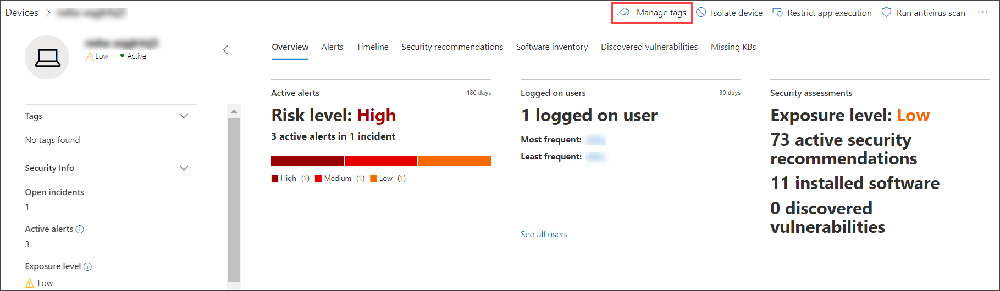

# Crear y administrar etiquetas de dispositivos

[!INCLUDE [Microsoft 365 Defender rebranding](../../includes/microsoft-defender.md)]

**Se aplica a:**
- [Microsoft Defender para punto de conexión](https://go.microsoft.com/fwlink/p/?linkid=2154037)
- [Microsoft 365 Defender](https://go.microsoft.com/fwlink/?linkid=2118804)

> ¿Desea experimentar Microsoft Defender para endpoint? [Regístrate para obtener una versión de prueba gratuita.](https://www.microsoft.com/microsoft-365/windows/microsoft-defender-atp?ocid=docs-wdatp-exposedapis-abovefoldlink)

Agregue etiquetas en los dispositivos para crear una afiliación de grupos lógica. Las etiquetas de dispositivo son compatibles con la asignación adecuada de la red, lo que permite adjuntar diferentes etiquetas para capturar contexto y habilitar la creación de listas dinámicas como parte de un incidente. Las etiquetas se pueden usar como filtro en la **vista de lista** Dispositivos o para agrupar dispositivos. Para obtener más información sobre la agrupación de dispositivos, consulta [Crear y administrar grupos de dispositivos.](machine-groups.md)

Puedes agregar etiquetas en dispositivos de las siguientes maneras:

- Usando el portal
- Estableciendo un valor de clave de registro

> [!NOTE]
> Puede haber cierta latencia entre el momento en que se agrega una etiqueta a un dispositivo y su disponibilidad en la lista de dispositivos y la página del dispositivo.  

Para agregar etiquetas de dispositivo con la API, consulte [API para agregar o quitar etiquetas de dispositivo](add-or-remove-machine-tags.md).

## Agregar y administrar etiquetas de dispositivo con el portal

1. Seleccione el dispositivo en el que quiere administrar las etiquetas. Puede seleccionar o buscar un dispositivo desde cualquiera de las siguientes vistas:

   - **Panel de operaciones de seguridad:** seleccione el nombre del dispositivo en la sección Dispositivos principales con alertas activas.
   - **Cola de alertas**: seleccione el nombre del dispositivo junto al icono de dispositivo en la cola de alertas.
   - **Lista de dispositivos**: seleccione el nombre del dispositivo de la lista de dispositivos.
   - **Cuadro de búsqueda**: seleccione Dispositivo en el menú desplegable y escriba el nombre del dispositivo.

     También puede acceder a la página de la alerta a través del archivo y las vistas IP.

2. Seleccione **Administrar etiquetas** en la fila Acciones de respuesta.

    

3. Tipo para buscar o crear etiquetas

    

Las etiquetas se agregan a la vista de dispositivo y también se reflejarán en la **vista de lista Dispositivos.** A continuación, puede usar el **filtro Etiquetas** para ver la lista relevante de dispositivos.

>[!NOTE]
> Es posible que el filtrado no funcione en nombres de etiquetas que contengan paréntesis. 
> Al crear una etiqueta nueva, se muestra una lista de etiquetas existentes. La lista solo muestra las etiquetas creadas a través del portal. Las etiquetas existentes creadas a partir de dispositivos cliente no se mostrarán.

También puede eliminar etiquetas de esta vista.

## Agregar etiquetas de dispositivo estableciendo un valor de clave del Registro

>[!NOTE]
> Solo se aplica a los siguientes dispositivos:
>- Windows 10, versión 1709 o posterior
>- Windows Servidor, versión 1803 o posterior
>- Windows Server 2016
>- Windows Server 2012 R2
>- Windows Server 2008 R2 SP1
>- Windows 8.1
>- Windows 7 SP1

> [!NOTE] 
> El número máximo de caracteres que se pueden establecer en una etiqueta es 200.

Los dispositivos con etiquetas similares pueden ser útiles cuando necesitas aplicar una acción contextual en una lista específica de dispositivos.

Use la siguiente entrada de clave del Registro para agregar una etiqueta a un dispositivo:

- Clave del Registro: `HKEY_LOCAL_MACHINE\SOFTWARE\Policies\Microsoft\Windows Advanced Threat Protection\DeviceTagging\`
- Valor de clave del Registro (REG_SZ): `Group`
- Datos de clave del Registro: `Name of the tag you want to set`

>[!NOTE]
>La etiqueta de dispositivo forma parte del informe de información del dispositivo que se genera una vez al día. Como alternativa, puede optar por reiniciar el punto de conexión que transferiría un nuevo informe de información del dispositivo.
> 
> Si necesita quitar una etiqueta que se agregó con la clave del Registro anterior, desactive el contenido de los datos de la clave del Registro en lugar de quitar la clave "Grupo".
