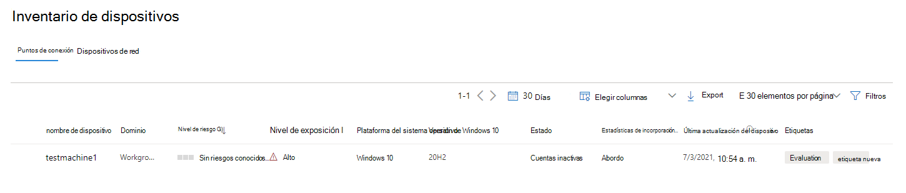
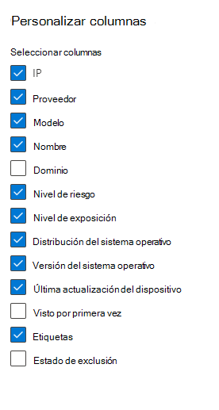
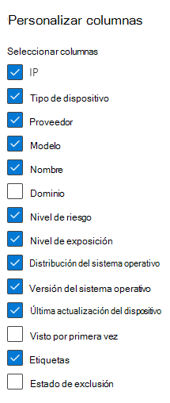

# Inventario de dispositivos

[!INCLUDE [Microsoft 365 Defender rebranding](../../includes/microsoft-defender.md)]

**Se aplica a:**

- [Microsoft Defender para punto de conexión Plan 1](https://go.microsoft.com/fwlink/p/?linkid=2154037)
- [Microsoft Defender para punto de conexión Plan 2](https://go.microsoft.com/fwlink/p/?linkid=2154037)
- [Administración de vulnerabilidades de Microsoft Defender](../defender-vulnerability-management/index.yml)
- [Microsoft 365 Defender](https://go.microsoft.com/fwlink/?linkid=2118804)

> ¿Quiere experimentar Defender para punto de conexión? [Regístrese para obtener una prueba gratuita.](https://signup.microsoft.com/create-account/signup?products=7f379fee-c4f9-4278-b0a1-e4c8c2fcdf7e&ru=https://aka.ms/MDEp2OpenTrial?ocid=docs-wdatp-machinesview-abovefoldlink)

El **inventario de** dispositivos muestra una lista de los dispositivos de la red donde se generaron alertas. De forma predeterminada, la cola muestra los dispositivos vistos en los últimos 30 días.

De un vistazo verá información como dominio, nivel de riesgo, plataforma del sistema operativo y otros detalles para facilitar la identificación de los dispositivos más en riesgo.

> [!NOTE]
> El inventario de dispositivos está disponible en diferentes servicios de Microsoft 365 Defender. La información disponible para usted variará en función de su licencia. Obtendrá el conjunto más completo de funcionalidades al usar [Microsoft Defender para punto de conexión plan 2](https://go.microsoft.com/fwlink/p/?linkid=2154037).

Hay varias opciones entre las que puede elegir para personalizar la vista de lista de dispositivos. En la navegación superior, puede hacer lo siguiente:

- Agregar o quitar columnas
- Exportación de toda la lista en formato CSV
- Seleccionar el número de elementos que se van a mostrar por página
- Aplicar filtros

Durante el proceso de incorporación, la **lista Dispositivos** se rellena gradualmente con dispositivos a medida que comienzan a notificar los datos del sensor. Use esta vista para realizar un seguimiento de los puntos de conexión incorporados a medida que se conecten o descargue la lista completa de puntos de conexión como un archivo CSV para el análisis sin conexión.

> [!NOTE]
> Si exporta la lista de dispositivos, contendrá todos los dispositivos de la organización. La descarga puede tardar mucho tiempo, en función del tamaño de su organización. La exportación de la lista en formato CSV muestra los datos de forma no filtrada. El archivo CSV incluirá todos los dispositivos de la organización, independientemente de los filtros aplicados en la propia vista.

:::image type="content" source="images/device-inventory.png" alt-text="La lista de dispositivos" lightbox="images/device-inventory.png":::

## Ordenar y filtrar la lista de dispositivos

Puede aplicar los siguientes filtros para limitar la lista de alertas y obtener una vista más centrada.

### Nombre del dispositivo

Durante el proceso de incorporación de Microsoft Defender para punto de conexión, los dispositivos incorporados a MDE se rellenan gradualmente en el inventario de dispositivos a medida que comienzan a notificar los datos del sensor. A continuación, los dispositivos que se detectan en la red a través del proceso de detección de dispositivos rellenan el inventario de dispositivos. El inventario de dispositivos tiene tres pestañas que enumeran los dispositivos por:

- **Equipos y dispositivos móviles**: puntos de conexión empresariales (estaciones de trabajo, servidores y dispositivos móviles)
- **Dispositivos de red**: dispositivos como enrutadores y conmutadores
- **Dispositivos IoT**: dispositivos como impresoras y cámaras

## Vaya a la página Inventario de dispositivos

Para acceder a la página de inventario de dispositivos, seleccione **Inventario** de dispositivos en el menú de navegación **Puntos de conexión** del [portal de Microsoft 365 Defender](/microsoft-365/security/defender-business/mdb-get-started).

## Información general del inventario de dispositivos

El inventario de dispositivos se abre en la pestaña **Equipos y dispositivos móviles** . De un vistazo verá información como el nombre del dispositivo, el dominio, el nivel de riesgo, el nivel de exposición, la plataforma del sistema operativo, el estado de incorporación, el estado de mantenimiento del sensor y otros detalles para facilitar la identificación de los dispositivos más en riesgo.

Use la columna **Estado de incorporación** para ordenar y filtrar por dispositivos detectados y los que ya están incorporados a Microsoft Defender para punto de conexión.

En las pestañas **Dispositivos de red** y **Dispositivos ioT** , también verá información como proveedor, modelo y tipo de dispositivo:

En la parte superior de cada pestaña de inventario de dispositivos, puede ver el número total de dispositivos, el número de dispositivos que aún no están incorporados y el número de dispositivos que se han identificado como un mayor riesgo para su organización. Puede usar esta información para ayudarle a priorizar los dispositivos para mejorar la posición de seguridad.

El recuento **de dispositivos recién detectados** para los dispositivos de red y las pestañas de dispositivos IoT muestra el número de nuevos dispositivos detectados, en los últimos 7 días, enumerados en la vista actual.

## Exploración del inventario de dispositivos

Hay varias opciones entre las que puede elegir para personalizar la vista de inventario de dispositivos. En la navegación superior de cada pestaña, puede hacer lo siguiente:

- Búsqueda de un dispositivo por nombre
- Busque un dispositivo con el prefijo de dirección IP o dirección IP usado más recientemente.
- Agregar o quitar columnas
- Exportación de toda la lista en formato CSV para el análisis sin conexión
- Seleccione el intervalo de fechas que se va a mostrar.
- Aplicar filtros

> [!NOTE]
> Si exporta la lista de dispositivos, contendrá todos los dispositivos de la organización. La descarga puede tardar mucho tiempo, en función del tamaño de su organización. La exportación de la lista en formato CSV muestra los datos de forma no filtrada. El archivo CSV incluirá todos los dispositivos de la organización, independientemente de los filtros aplicados en la propia vista.

Puede usar la funcionalidad de ordenación y filtro disponible en cada pestaña de inventario de dispositivos para obtener una vista más centrada y ayudarle a evaluar y administrar los dispositivos de su organización.

Los recuentos en la parte superior de cada pestaña se actualizarán en función de la vista actual.

## Uso de filtros para personalizar las vistas de inventario de dispositivos

Filtro | Descripción
:---|:---
**Nivel de riesgo**   | El nivel de riesgo refleja la evaluación general del riesgo del dispositivo en función de una combinación de factores, incluidos los tipos y la gravedad de las alertas activas en el dispositivo. La resolución de alertas activas, la aprobación de actividades de corrección y la supresión de las alertas posteriores pueden reducir el nivel de riesgo.
**Nivel de exposición**   | El nivel de exposición refleja la exposición actual del dispositivo en función del impacto acumulado de sus recomendaciones de seguridad pendientes. Los niveles posibles son bajo, medio y alto. Una exposición baja significa que los dispositivos son menos vulnerables a la explotación.     Si el nivel de exposición indica "No hay datos disponibles", hay algunas razones por las que puede ser así: - El dispositivo dejó de informar durante más de 30 días. En ese caso, se considera inactivo y la exposición no se calcula. - No se admite el sistema operativo del dispositivo: consulte [los requisitos mínimos para Microsoft Defender para punto de conexión](/microsoft-365/security/defender-endpoint/minimum-requirements). - Dispositivo con agente obsoleto (poco probable).
**Tags**   | Filtre la lista en función de la agrupación y el etiquetado que haya agregado a dispositivos individuales. Consulte [Creación y administración de etiquetas de dispositivo](machine-tags.md).
**Valor del dispositivo**  | Filtre la lista en función de si el dispositivo se ha marcado como valor alto o bajo.
**Estado de exclusión**   | Filtre la lista en función de si el dispositivo se ha excluido o no. Para obtener más información, consulte [Excluir dispositivos](exclude-devices.md).
**Plataforma del sistema operativo**  | Filtrar por las plataformas del sistema operativo que le interesan investigar   (_Solo equipos y dispositivos móviles e IoT_)
**Primero visto**   | Filtre la vista en función de cuándo se vio el dispositivo por primera vez en la red o cuando el sensor de Microsoft Defender para punto de conexión lo notificó por primera vez.  (_Solo equipos y dispositivos móviles e IoT_)
**Versión de Windows**   | Filtre por las versiones de Windows que le interese investigar.   (_Solo equipos y dispositivos móviles_)
**Estado del sensor**   | Filtre por los siguientes estados de mantenimiento del sensor para los dispositivos incorporados a Microsoft Defender para punto de conexión:  - **Activo**: dispositivos que informan activamente de los datos del sensor al servicio.  - **Inactivo**: dispositivos que han dejado de enviar señales durante más de 7 días.   - **Mal configurado**: los dispositivos que han deteriorado las comunicaciones con el servicio o no pueden enviar datos del sensor.   Los dispositivos mal configurados se pueden clasificar aún más en:    - Sin datos del sensor    - Comunicaciones afectadas    Para obtener más información sobre cómo solucionar problemas en dispositivos mal configurados, consulte [Corrección de sensores incorrectos](/microsoft-365/security/defender-endpoint/fix-unhealthy-sensors).   (_Solo equipos y dispositivos móviles_)
**Estado de incorporación**   | El estado de incorporación indica si el dispositivo está incorporado actualmente a Microsoft Defender para punto de conexión o no. Puede filtrar por los siguientes estados:   - **Incorporado**: el punto de conexión se incorpora a Microsoft Defender para punto de conexión.    - **Se puede incorporar**: el punto de conexión se detectó en la red como un dispositivo compatible, pero no está incorporado actualmente. Microsoft recomienda encarecidamente la incorporación de estos dispositivos.   - **No compatible**: el punto de conexión se detectó en la red, pero no es compatible con Microsoft Defender para punto de conexión.   - **Información insuficiente**: el sistema no pudo determinar la compatibilidad del dispositivo.   (_Solo equipos y dispositivos móviles_)
**Estado del antivirus**   | Filtre la vista en función de si el estado del antivirus está deshabilitado, no actualizado o desconocido.   (_Solo equipos y dispositivos móviles_)
**Grupo**   | Filtre la lista según el grupo que le interesa investigar.    (_Solo equipos y dispositivos móviles_)
**Administrado por**   | Administrado por indica cómo se administra el dispositivo. Se puede filtrar por:  - Microsoft Defender para punto de conexión  - Microsoft Endpoint Manager (MEM), incluida la administración conjunta con Microsoft Configuration Manager a través de la asociación de inquilinos - Microsoft Configuration Manager (ConfigMgr)  - Desconocido: esto podría deberse a la ejecución de una versión de Windows obsoleta, administración de GPO u otro MDM de terceros.   (_Solo equipos y dispositivos móviles_) 
**Tipo de dispositivo**   | Filtre por el tipo de dispositivo que le interesa investigar.   (_solo dispositivos IoT_)

## Uso de columnas para personalizar las vistas de inventario de dispositivos

Puede agregar o quitar columnas de la vista y ordenar las entradas haciendo clic en un encabezado de columna disponible.

En la pestaña **Equipo y dispositivos móviles** , seleccione **Personalizar columnas** para ver las columnas disponibles. Los valores predeterminados se comprueban en la imagen siguiente:

En la pestaña **Dispositivos de red** , seleccione **Personalizar columnas** para ver las columnas disponibles. Los valores predeterminados se comprueban en la imagen siguiente:

En la pestaña **Dispositivos IoT** , seleccione **Personalizar columnas** para ver las columnas disponibles. Los valores predeterminados se comprueban en la imagen siguiente:

## Artículos relacionados

[Investigación de dispositivos en la lista de dispositivos Microsoft Defender para punto de conexión](investigate-machines.md)
