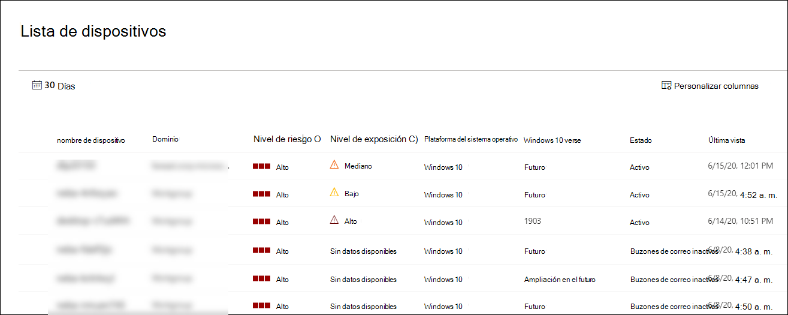

# Ver y organizar la lista de Microsoft Defender para dispositivos de punto de conexiónView and organize the Microsoft Defender for Endpoint Devices list

[!INCLUDE [Microsoft 365 Defender rebranding](../../includes/microsoft-defender.md)]

**Se aplica a:****Applies to:**
- [Microsoft Defender para punto de conexiónMicrosoft Defender for Endpoint](https://go.microsoft.com/fwlink/p/?linkid=2154037)
- [Microsoft 365 DefenderMicrosoft 365 Defender](https://go.microsoft.com/fwlink/?linkid=2118804)

> ¿Desea experimentar Defender for Endpoint?Want to experience Defender for Endpoint? [Regístrate para obtener una versión de prueba gratuita.Sign up for a free trial.](https://www.microsoft.com/microsoft-365/windows/microsoft-defender-atp?ocid=docs-wdatp-machinesview-abovefoldlink)

La **lista Dispositivos** muestra una lista de los dispositivos de la red donde se generaron alertas.The **Devices list** shows a list of the devices in your network where alerts were generated. De forma predeterminada, la cola muestra los dispositivos vistos en los últimos 30 días.By default, the queue displays devices seen in the last 30 days.  

De un vistazo verá información como dominio, nivel de riesgo, plataforma del sistema operativo y otros detalles para facilitar la identificación de los dispositivos más en riesgo.At a glance you'll see information such as domain, risk level, OS platform, and other details for easy identification of devices most at risk.

Hay varias opciones entre las que puedes elegir para personalizar la vista de lista de dispositivos.There are several options you can choose from to customize the devices list view. En la navegación superior puede:On the top navigation you can:

- Agregar o quitar columnasAdd or remove columns
- Exportar toda la lista en formato CSVExport the entire list in CSV format
- Seleccionar el número de elementos que se mostrarán por páginaSelect the number of items to show per page
- Aplicar filtrosApply filters

Durante el proceso de incorporación, la lista **de** dispositivos se rellena gradualmente con dispositivos a medida que comienzan a informar de los datos del sensor.During the onboarding process, the **Devices list** is gradually populated with devices as they begin to report sensor data. Use esta vista para realizar un seguimiento de los puntos de conexión incorporados a medida que se en línea o descargue la lista completa de puntos de conexión como un archivo CSV para el análisis sin conexión.Use this view to track your onboarded endpoints as they come online, or download the complete endpoint list as a CSV file for offline analysis.

>[!NOTE]
> Si exportas la lista de dispositivos, contendrá todos los dispositivos de tu organización.If you export the device list, it will contain every device in your organization. Puede tardar mucho tiempo en descargarse, según el tamaño de la organización.It might take a significant amount of time to download, depending on how large your organization is. Al exportar la lista en formato CSV, se muestran los datos sin filtrar.Exporting the list in CSV format displays the data in an unfiltered manner. El archivo CSV incluirá todos los dispositivos de la organización, independientemente de cualquier filtrado aplicado en la vista en sí.The CSV file will include all devices in the organization, regardless of any filtering applied in the view itself.

## Ordenar y filtrar la lista de dispositivosSort and filter the device list

Puede aplicar los siguientes filtros para limitar la lista de alertas y obtener una vista más centrada.You can apply the following filters to limit the list of alerts and get a more focused view.

### Nivel de riesgoRisk level

El nivel de riesgo refleja la evaluación general del riesgo del dispositivo en función de una combinación de factores, incluidos los tipos y la gravedad de las alertas activas en el dispositivo.The risk level reflects the overall risk assessment of the device based on a combination of factors, including the types and severity of active alerts on the device. Resolver alertas activas, aprobar actividades de corrección y suprimir alertas posteriores puede reducir el nivel de riesgo.Resolving active alerts, approving remediation activities, and suppressing subsequent alerts can lower the risk level.

### Nivel de exposiciónExposure level

El nivel de exposición refleja la exposición actual del dispositivo en función del impacto acumulado de sus recomendaciones de seguridad pendientes.The exposure level reflects the current exposure of the device based on the cumulative impact of its pending security recommendations. Los niveles posibles son bajos, medianos y altos.The possible levels are low, medium, and high. Una exposición baja significa que los dispositivos son menos vulnerables a la explotación.Low exposure means your devices are less vulnerable from exploitation.

Si el nivel de exposición indica "No hay datos disponibles", hay algunas razones por las que esto puede ser así:If the exposure level says "No data available," there are a few reasons why this may be the case:

- El dispositivo dejó de informar durante más de 30 días; en ese caso, se considera inactivo y no se calcula la exposiciónDevice stopped reporting for more than 30 days – in that case it is considered inactive, and the exposure isn't computed
- Sistema operativo de dispositivo no compatible: consulta [requisitos mínimos para Microsoft Defender para endpoint](minimum-requirements.md)Device OS not supported - see [minimum requirements for Microsoft Defender for Endpoint](minimum-requirements.md)
- Dispositivo con agente obsoleto (muy poco probable)Device with stale agent (very unlikely)

### Plataforma del sistema operativoOS Platform

Seleccione solo las plataformas del sistema operativo que le interesa investigar.Select only the OS platforms you're interested in investigating.

### EstadoHealth state

Filtre por los siguientes estados de estado del dispositivo:Filter by the following device health states:

- **Activo:** dispositivos que informan activamente de los datos del sensor al servicio.**Active** – Devices that are actively reporting sensor data to the service.
- **Inactivo:** dispositivos que han dejado de enviar señales por completo durante más de 7 días.**Inactive** – Devices that have completely stopped sending signals for more than 7 days.
- **Configuración errónea: dispositivos** que tienen comunicaciones deficientes con el servicio o que no pueden enviar datos del sensor.**Misconfigured** – Devices that have impaired communications with service or are unable to send sensor data. Los dispositivos mal configurados se pueden clasificar en:Misconfigured devices can further be classified to:
  - Sin datos del sensorNo sensor data
  - Comunicaciones deficientesImpaired communications

  Para obtener más información sobre cómo solucionar problemas en dispositivos mal configurados, consulte [Fix unhealthy sensors](fix-unhealthy-sensors.md).For more information on how to address issues on misconfigured devices see, [Fix unhealthy sensors](fix-unhealthy-sensors.md).

### Estado del antivirusAntivirus status

Filtrar dispositivos por estado antivirus.Filter devices by antivirus status. Solo se aplica a dispositivos Windows 10 activos.Applies to active Windows 10 devices only.

- **Deshabilitado:** la protección contra & virus está desactivada.**Disabled** - Virus & threat protection is turned off.
- **Not reporting:** la protección contra & amenazas de virus no está informando.**Not reporting** - Virus & threat protection is not reporting.
- **No actualizado:** la protección contra & virus no está actualizada.**Not updated** - Virus & threat protection is not up to date.

Para obtener más información, [vea View the Threat & Vulnerability Management dashboard](tvm-dashboard-insights.md).For more information, see [View the Threat & Vulnerability Management dashboard](tvm-dashboard-insights.md).

### Estado de mitigación de amenazasThreat mitigation status

Para ver los dispositivos que pueden verse afectados por una amenaza determinada, selecciona la amenaza en el menú desplegable y, a continuación, selecciona qué aspecto de vulnerabilidad debe mitigarse.To view devices that may be affected by a certain threat, select the threat from the dropdown menu, and then select what vulnerability aspect needs to be mitigated.

Para obtener más información sobre determinadas amenazas, consulte [Análisis de amenazas.](threat-analytics.md)To learn more about certain threats, see [Threat analytics](threat-analytics.md). Para obtener información sobre mitigación, [vea Threat & Vulnerability Management](next-gen-threat-and-vuln-mgt.md).For mitigation information, see [Threat & Vulnerability Management](next-gen-threat-and-vuln-mgt.md).

### Versión de Windows 10Windows 10 version

Selecciona solo las versiones de Windows 10 que te interesan investigar.Select only the Windows 10 versions you're interested in investigating.

### Etiquetas & gruposTags & Groups

Filtre la lista en función de la agrupación y el etiquetado que haya agregado a dispositivos individuales.Filter the list based on the grouping and tagging that you've added to individual devices. Consulta [Crear y administrar etiquetas de dispositivo](machine-tags.md) y Crear y administrar grupos de [dispositivos.](machine-groups.md)See [Create and manage device tags](machine-tags.md) and [Create and manage device groups](machine-groups.md).

## Temas relacionadosRelated topics

- [Investigar dispositivos en la lista Microsoft Defender para dispositivos de punto de conexiónInvestigate devices in the Microsoft Defender for Endpoint Devices list](investigate-machines.md)
