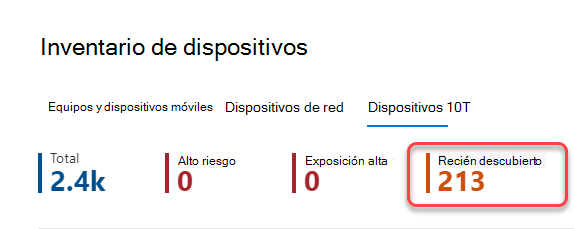

# Inventario de dispositivos

[!INCLUDE [Microsoft 365 Defender rebranding](../../includes/microsoft-defender.md)]

**Se aplica a:**

- [Microsoft Defender para punto de conexión Plan 1](https://go.microsoft.com/fwlink/p/?linkid=2154037)
- [Microsoft Defender para punto de conexión Plan 2](https://go.microsoft.com/fwlink/p/?linkid=2154037)
- [Microsoft 365 Defender](https://go.microsoft.com/fwlink/?linkid=2118804)

> ¿Desea experimentar Defender for Endpoint? [Regístrese para obtener una prueba gratuita.](https://signup.microsoft.com/create-account/signup?products=7f379fee-c4f9-4278-b0a1-e4c8c2fcdf7e&ru=https://aka.ms/MDEp2OpenTrial?ocid=docs-wdatp-machinesview-abovefoldlink)

La **lista Dispositivos** muestra una lista de los dispositivos de la red donde se generaron alertas. De forma predeterminada, la cola muestra los dispositivos vistos en los últimos 30 días.

De un vistazo verá información como dominio, nivel de riesgo, plataforma del sistema operativo y otros detalles para facilitar la identificación de los dispositivos más en riesgo.

Hay varias opciones entre las que puedes elegir para personalizar la vista de lista de dispositivos. En la navegación superior puede:

- Agregar o quitar columnas
- Exportar toda la lista en formato CSV
- Seleccionar el número de elementos que se mostrarán por página
- Aplicar filtros

Durante el proceso de incorporación, la lista **de** dispositivos se rellena gradualmente con dispositivos a medida que comienzan a informar de los datos del sensor. Use esta vista para realizar un seguimiento de los puntos de conexión incorporados a medida que se en línea o descargue la lista completa de puntos de conexión como un archivo CSV para el análisis sin conexión.

> [!NOTE]
> Si exportas la lista de dispositivos, contendrá todos los dispositivos de tu organización. Puede tardar mucho tiempo en descargarse, según el tamaño de la organización. Al exportar la lista en formato CSV, se muestran los datos sin filtrar. El archivo CSV incluirá todos los dispositivos de la organización, independientemente de cualquier filtrado aplicado en la vista en sí.

:::image type="content" source="images/device-inventory.png" alt-text="La lista de dispositivos" lightbox="images/device-inventory.png":::

## Ordenar y filtrar la lista de dispositivos

Puede aplicar los siguientes filtros para limitar la lista de alertas y obtener una vista más centrada.

### Nombre del dispositivo

Durante el proceso de incorporación de Microsoft Defender para endpoints, los dispositivos incorporados a MDE se rellenan gradualmente en el inventario de dispositivos a medida que comienzan a informar de los datos del sensor. A continuación, el inventario de dispositivos se rellena con dispositivos que se detectan en la red a través del proceso de detección de dispositivos. El inventario de dispositivos tiene tres pestañas que enumeran los dispositivos mediante:

- **Equipos y dispositivos** móviles: Enterprise de conexión (estaciones de trabajo, servidores y dispositivos móviles)
- **Dispositivos de red**: dispositivos como enrutadores y conmutadores
- **Dispositivos IoT**: dispositivos como impresoras y cámaras

## Vaya a la página Inventario de dispositivos

Para obtener acceso a la página de inventario de dispositivos, seleccione **Inventario** de **dispositivos** en el menú de navegación Puntos de conexión [del portal Microsoft 365 Defender dispositivo](/defender/microsoft-365-security-center-mde).

## Introducción al inventario de dispositivos

El inventario de dispositivos se abre en la **pestaña Equipos y** móviles. De un vistazo, verá información como el nombre del dispositivo, el dominio, el nivel de riesgo, el nivel de exposición, la plataforma del sistema operativo, el estado de incorporación, el estado de mantenimiento del sensor y otros detalles para identificar fácilmente los dispositivos más en riesgo.

Usa la **columna Estado de incorporación** para ordenar y filtrar por dispositivos detectados y aquellos que ya están incorporados a Microsoft Defender para endpoint.

En las **pestañas Dispositivos de** red y Dispositivos **ioT** , también verá información como proveedor, modelo y tipo de dispositivo:

En la parte superior de cada pestaña de inventario de dispositivos, puedes ver el número total de dispositivos, el número de dispositivos que aún no están incorporados y el número de dispositivos que se han identificado como un riesgo mayor para la organización. Puedes usar esta información para ayudarte a priorizar los dispositivos para mejorar la posición de seguridad.

El **recuento de** dispositivos recién detectados para dispositivos de red y pestañas de dispositivos IoT, muestra el número de nuevos dispositivos detectados, en los últimos 7 días, enumerados en la vista actual.

## Explorar el inventario de dispositivos

Hay varias opciones entre las que puedes elegir para personalizar la vista de inventario de dispositivos. En la navegación superior de cada pestaña puede:

- Buscar un dispositivo por su nombre
- Buscar un dispositivo mediante el prefijo de dirección IP o dirección IP usado más recientemente
- Agregar o quitar columnas
- Exportar toda la lista en formato CSV para el análisis sin conexión
- Seleccionar el intervalo de fechas que se va a mostrar
- Aplicar filtros

> [!NOTE]
> Si exportas la lista de dispositivos, contendrá todos los dispositivos de tu organización. Puede tardar mucho tiempo en descargarse, según el tamaño de la organización. Al exportar la lista en formato CSV, se muestran los datos sin filtrar. El archivo CSV incluirá todos los dispositivos de la organización, independientemente de cualquier filtrado aplicado en la vista en sí.

Puedes usar la funcionalidad de ordenación y filtro disponible en cada pestaña de inventario de dispositivos para obtener una vista más centrada y ayudarte a evaluar y administrar los dispositivos de tu organización.

Los recuentos de la parte superior de cada pestaña se actualizarán en función de la vista actual.

## Usar filtros para personalizar las vistas de inventario de dispositivos

Filtro | Descripción
:---|:---
**Nivel de riesgo**   | El nivel de riesgo refleja la evaluación general del riesgo del dispositivo en función de una combinación de factores, incluidos los tipos y la gravedad de las alertas activas en el dispositivo. Resolver alertas activas, aprobar actividades de corrección y suprimir alertas posteriores puede reducir el nivel de riesgo.
**Nivel de exposición**   | El nivel de exposición refleja la exposición actual del dispositivo en función del impacto acumulado de sus recomendaciones de seguridad pendientes. Los niveles posibles son bajos, medianos y altos. Una exposición baja significa que los dispositivos son menos vulnerables a la explotación.     Si el nivel de exposición indica "No hay datos disponibles", hay algunas razones por las que esto puede ser así: - El dispositivo dejó de informar durante más de 30 días. En ese caso, se considera inactivo y no se calcula la exposición. - El sistema operativo del dispositivo no es compatible: consulta [requisitos mínimos para Microsoft Defender para endpoint](https://microsoft-my.sharepoint.com/personal/siosulli_microsoft_com/Documents/Security%20Posture/TVM/minimum-requirements.md). - Dispositivo con agente obsoleto (poco probable).
**Tags**   | Filtre la lista en función de la agrupación y el etiquetado que haya agregado a dispositivos individuales. Consulta [Crear y administrar etiquetas de dispositivo](machine-tags.md).
**Valor de dispositivo**  | Filtra la lista en función de si el dispositivo se ha marcado como valor alto o bajo.
**Estado de exclusión**   | Filtra la lista en función de si el dispositivo se ha excluido o no. Para obtener más información, consulta [Excluir dispositivos](exclude-devices.md).
**Plataforma del sistema operativo**  | Filtrar por las plataformas del sistema operativo que le interesa investigar   (_Solo equipos y dispositivos móviles e IoT_)
**Primera vista**   | Filtra la vista en función del momento en que el dispositivo se vio por primera vez en la red o cuando el sensor de Microsoft Defender para endpoints lo informó por primera vez.  (_Solo equipos y dispositivos móviles e IoT_)
**Versión de Windows**   | Filtra por las Windows que estás interesado en investigar.   (_Solo equipos y dispositivos móviles_)
**Estado del sensor**   | Filtra por los siguientes estados de mantenimiento del sensor, para dispositivos incorporados a Microsoft Defender para endpoint:  - **Activo**: dispositivos que informan activamente de los datos del sensor al servicio.  - **Inactivo**: dispositivos que han dejado de enviar señales durante más de 7 días.   - **Configuración errónea: dispositivos** que tienen comunicaciones deficientes con el servicio o que no pueden enviar datos del sensor.   Los dispositivos mal configurados se pueden clasificar en:    - Sin datos de sensor    - Comunicaciones deficientes    Para obtener más información sobre cómo solucionar problemas en dispositivos mal configurados, consulte [Fix unhealthy sensors](https://microsoft-my.sharepoint.com/personal/siosulli_microsoft_com/Documents/Security%20Posture/TVM/fix-unhealthy-sensors.md).   (_Solo equipos y dispositivos móviles_)
**Estado de incorporación**   | El estado de incorporación indica si el dispositivo está incorporado actualmente a Microsoft Defender para Endpoint o no. Puede filtrar por los siguientes estados:   - **Incorporado**: el punto de conexión se incorpora a Microsoft Defender para endpoint.    - **Se puede incorporar**: el punto de conexión se descubrió en la red como un dispositivo compatible, pero no está incorporado actualmente. Microsoft recomienda encarecidamente la incorporación de estos dispositivos.   - **No compatible**: el punto de conexión se ha detectado en la red, pero Microsoft Defender no admite endpoint.   - **Información insuficiente**: el sistema no pudo determinar la compatibilidad del dispositivo.   (_Solo equipos y dispositivos móviles_)
**Estado del antivirus**   | Filtre la vista en función de si el estado del antivirus está deshabilitado, no actualizado o desconocido.   (_Solo equipos y dispositivos móviles_)
**Grupo**   | Filtra la lista en función del grupo que estés interesado en investigar.    (_Solo equipos y dispositivos móviles_)
**Administrado por**   | Managed by indica cómo se está administrando el dispositivo. Se puede filtrar por: - Microsoft Defender para endpoint   - Administración de dispositivos móviles (MDM)  - Desconocido: esto podría deberse a la ejecución de una versión de Windows obsoleta, sccm en su lugar u otro MDM de terceros.   (_Solo equipos y dispositivos móviles_)
**Tipo de dispositivo**   | Filtra por el tipo de dispositivo que te interesa investigar.   (_Solo dispositivos IoT_)

## Usar columnas para personalizar las vistas de inventario de dispositivos

Puede agregar o quitar columnas de la vista y ordenar las entradas haciendo clic en un encabezado de columna disponible.

En la **pestaña Equipo y móviles** , seleccione **Personalizar columnas** para ver las columnas disponibles. Los valores predeterminados se comprueban en la imagen siguiente:

En la **pestaña Dispositivos de** red, seleccione **Personalizar columnas** para ver las columnas disponibles. Los valores predeterminados se comprueban en la imagen siguiente:

En la **pestaña Dispositivos ioT** , seleccione **Personalizar columnas** para ver las columnas disponibles. Los valores predeterminados se comprueban en la imagen siguiente:

## Artículos relacionados

[Investigar dispositivos en la lista Microsoft Defender para dispositivos de punto de conexión](investigate-machines.md)
