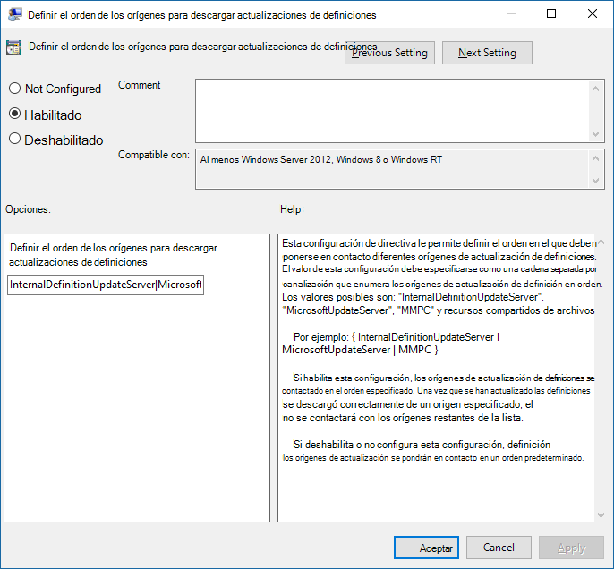

# <a name="manage-the-sources-for-microsoft-defender-antivirus-protection-updates"></a>Administrar el original para las actualizaciones de protección del Antivirus de Windows Defender

[!INCLUDE [Microsoft 365 Defender rebranding](../../includes/microsoft-defender.md)]


**Se aplica a:**

- [Microsoft Defender para punto de conexión](https://go.microsoft.com/fwlink/p/?linkid=22154037)

<a id="protection-updates"></a>
<!-- this has been used as anchor in VDI content -->

Mantener la protección antivirus actualizada es fundamental. Hay dos componentes para administrar actualizaciones de protección para Antivirus de Microsoft Defender: 
- *Desde* donde se descargan las actualizaciones; y 
- *Cuando* las actualizaciones se descargan y se aplican. 

En este artículo se describe cómo especificar desde dónde deben descargarse las actualizaciones (esto también se conoce como orden de reserva). Consulte [Manage Antivirus de Microsoft Defender updates and apply baselines](manage-updates-baselines-microsoft-defender-antivirus.md) topic para obtener información general sobre cómo funcionan las actualizaciones y cómo configurar otros aspectos de las actualizaciones (como las actualizaciones de programación).

> [!IMPORTANT]
> Antivirus de Microsoft Defender Las actualizaciones de inteligencia de seguridad se entregan a través de Windows Update y, a partir del lunes 21 de octubre de 2019, todas las actualizaciones de inteligencia de seguridad se firmarán exclusivamente con SHA-2. Los dispositivos deben actualizarse para admitir SHA-2 con el fin de actualizar la inteligencia de seguridad. Para obtener más información, vea [2019 SHA-2 Code Signing Support requirement for Windows and WSUS](https://support.microsoft.com/help/4472027/2019-sha-2-code-signing-support-requirement-for-windows-and-wsus).  


<a id="fallback-order"></a>

## <a name="fallback-order"></a>Orden de reserva

Normalmente, los puntos de conexión se configuran para descargar actualizaciones individualmente de un origen principal seguidos de otros orígenes en orden de prioridad, en función de la configuración de red. Las actualizaciones se obtienen de orígenes en el orden especificado. Si un origen no está disponible, el siguiente origen de la lista se usa inmediatamente.

Cuando se publican actualizaciones, se aplica cierta lógica para minimizar el tamaño de la actualización. En la mayoría de los casos, solo se descargan y aplican las diferencias entre la actualización más reciente y la actualización que está instalada actualmente (esto se conoce como delta) en el dispositivo. Sin embargo, el tamaño del delta depende de dos factores principales:
- La antigüedad de la última actualización del dispositivo; y 
- El origen usado para descargar y aplicar actualizaciones. 

Cuanto más antiguas sean las actualizaciones de un punto de conexión, mayor será la descarga. Sin embargo, también debe considerar la frecuencia de descarga. Una programación de actualización más frecuente puede provocar un mayor uso de la red, mientras que una programación menos frecuente puede dar como resultado tamaños de archivo más grandes por descarga. 

Hay cinco ubicaciones donde puede especificar dónde debe obtener actualizaciones un punto de conexión: 

- [Microsoft Update](https://support.microsoft.com/help/12373/windows-update-faq)
- [Windows Servicio de actualización de servidor](/windows-server/administration/windows-server-update-services/get-started/windows-server-update-services-wsus)
- [Microsoft Endpoint Configuration Manager](/configmgr/core/servers/manage/updates)
- [Recurso compartido de archivos de red](#unc-share)
- [Actualizaciones de inteligencia de](https://www.microsoft.com/en-us/wdsi/defenderupdates) seguridad para Antivirus de Microsoft Defender y otros antimalware de Microsoft (Es posible que la directiva y el registro tengan esta lista como inteligencia de seguridad de Centro de protección contra malware de Microsoft (MMPC), su nombre anterior).

Para garantizar el mejor nivel de protección, Microsoft Update permite versiones rápidas, lo que significa descargas más pequeñas con frecuencia. El Windows de actualización de servidor, los Microsoft Endpoint Configuration Manager y los orígenes de actualizaciones de inteligencia de seguridad de Microsoft proporcionan actualizaciones menos frecuentes. Por lo tanto, el delta puede ser más grande, lo que da como resultado descargas más grandes. 

> [!IMPORTANT]
> Si ha establecido las actualizaciones de la página de inteligencia de Seguridad de [Microsoft](https://www.microsoft.com/security/portal/definitions/adl.aspx) como origen de reserva después de Windows Server Update Service o Microsoft Update, las actualizaciones solo se descargan de las actualizaciones de inteligencia de seguridad cuando la actualización actual se considera anticuada. (De forma predeterminada, se trata de siete días consecutivos de no poder aplicar actualizaciones de los servicios Windows Server Update Service o Microsoft Update).
> Sin embargo, puede establecer el número de días antes de que se notifica la protección [como desaprotebada](/windows/threat-protection/microsoft-defender-antivirus/manage-outdated-endpoints-microsoft-defender-antivirus#set-the-number-of-days-before-protection-is-reported-as-out-of-date).<p>
> A partir del lunes 21 de octubre de 2019, las actualizaciones de inteligencia de seguridad se firmarán exclusivamente con SHA-2. Los dispositivos deben actualizarse para admitir SHA-2 con el fin de obtener las últimas actualizaciones de inteligencia de seguridad. Para obtener más información, vea [2019 SHA-2 Code Signing Support requirement for Windows and WSUS](https://support.microsoft.com/help/4472027/2019-sha-2-code-signing-support-requirement-for-windows-and-wsus).

Cada origen tiene escenarios típicos que dependen de la configuración de la red, además de la frecuencia con la que publican actualizaciones, como se describe en la tabla siguiente:

|Ubicación | Ejemplo ficticio |
|---|---|
|Windows Servicio de actualización de servidor | Está usando el Windows de actualización de servidor para administrar las actualizaciones de la red.|
|Microsoft Update | Desea que los puntos de conexión se conecten directamente a Microsoft Update. Esto puede ser útil para los puntos de conexión que se conectan de forma irregular a la red empresarial, o si no usa Windows servicio de actualización de servidor para administrar las actualizaciones.|
|Compartir archivos | Tiene dispositivos no conectados a Internet (como máquinas virtuales). Puede usar el host de vm conectado a Internet para descargar las actualizaciones en un recurso compartido de red, desde el que las máquinas virtuales pueden obtener las actualizaciones. Consulte la [guía de implementación de VDI](deployment-vdi-microsoft-defender-antivirus.md) para obtener información sobre cómo se pueden usar recursos compartidos de archivos en entornos de infraestructura de escritorio virtual (VDI).|
|Microsoft Endpoint Manager | Está usando Microsoft Endpoint Manager para actualizar los puntos de conexión.|
|Actualizaciones de inteligencia de seguridad Antivirus de Microsoft Defender y otros antimalware de Microsoft (anteriormente denominadas MMPC) |[Asegúrese de que los dispositivos estén actualizados para admitir SHA-2](https://support.microsoft.com/help/4472027/2019-sha-2-code-signing-support-requirement-for-windows-and-wsus). Antivirus de Microsoft Defender Las actualizaciones de inteligencia de seguridad se entregan a través de Windows Update y, a partir del lunes 21 de octubre de 2019, las actualizaciones de inteligencia de seguridad se firmarán exclusivamente con SHA-2. <br/>Descargue las actualizaciones de protección más recientes debido a una infección reciente o para ayudar a aprovisionar una imagen base sólida para la [implementación de VDI](deployment-vdi-microsoft-defender-antivirus.md). Por lo general, esta opción solo se debe usar como origen final de reserva y no como origen principal. Solo se usará si las actualizaciones no se pueden descargar desde Windows Server Update Service o Microsoft Update durante un número especificado [de días](/windows/threat-protection/microsoft-defender-antivirus/manage-outdated-endpoints-microsoft-defender-antivirus#set-the-number-of-days-before-protection-is-reported-as-out-of-date).|

Puede administrar el orden en que se usan los orígenes de actualización con la directiva de grupo, los Microsoft Endpoint Configuration Manager, los cmdlets de PowerShell y WMI.

> [!IMPORTANT]
> Si establece el Windows de actualización de servidor como una ubicación de descarga, debe aprobar las actualizaciones, independientemente de la herramienta de administración que use para especificar la ubicación. Puede configurar una regla de aprobación automática con Windows servicio de actualización de servidor, lo que puede resultar útil a medida que las actualizaciones llegan al menos una vez al día. Para obtener más información, vea [synchronize endpoint protection updates in standalone Windows Server Update Service](/configmgr/protect/deploy-use/endpoint-definitions-wsus#to-synchronize-endpoint-protection-definition-updates-in-standalone-wsus).

En los procedimientos de este artículo se describe primero cómo establecer el orden y, a continuación, cómo configurar la opción **Recurso** compartido de archivos si la ha habilitado.

## <a name="use-group-policy-to-manage-the-update-location"></a>Usar la directiva de grupo para administrar la ubicación de actualización

1. En el equipo de administración de directivas de grupo, abra la Consola de administración de directivas de [grupo,](/previous-versions/windows/it-pro/windows-server-2008-R2-and-2008/cc731212(v=ws.11))haga clic con el botón secundario en el objeto de directiva de grupo que desea configurar y haga clic en **Editar**.

2. En el **Editor de administración de directivas de grupo** vaya a Configuración del **equipo.**

3. Haga clic **en Directivas** **y, a continuación, en Plantillas administrativas.**

4. Expanda el árbol para Windows **componentes > Windows Defender > actualizaciones de firma** y configure las siguientes opciones:

   1.  Haga doble clic en **la opción Definir el orden de los orígenes para** descargar actualizaciones de inteligencia de seguridad y establezca la opción en **Habilitado**.

   2.  Escriba el orden de los orígenes, separados por una sola canalización, por ejemplo: , como `InternalDefinitionUpdateServer|MicrosoftUpdateServer|MMPC` se muestra en la siguiente captura de pantalla.

   

   3. Haga clic en **Aceptar**. Esto establecerá el orden de los orígenes de actualización de protección.

   4. Haga doble clic en la **opción Definir recursos compartidos de** archivos para descargar actualizaciones de inteligencia de seguridad y establezca la opción en **Habilitado**.

   5. Escriba el origen del recurso compartido de archivos. Si tiene varios orígenes, escriba cada origen en el orden en que deben usarse, separados por una sola canalización. Use [la notación UNC estándar](/openspecs/windows_protocols/ms-dtyp/62e862f4-2a51-452e-8eeb-dc4ff5ee33cc) para denoticar la ruta de acceso, por ejemplo: `\\host-name1\share-name\object-name|\\host-name2\share-name\object-name` .  Si no escribe ninguna ruta de acceso, se omitirá este origen cuando se actualice la máquina virtual.

   6. Haga clic en **Aceptar**. Esto establecerá el orden de los recursos compartidos de archivos cuando se haga referencia a ese origen en la configuración de directiva de grupo Definir **el orden de orígenes...**

> [!NOTE]
> Para Windows 10, versiones 1703 hasta 1809 incluidas, la ruta de acceso de directiva es **componentes de Windows** > Antivirus de Microsoft Defender > Actualizaciones de firma Para Windows 10, versión 1903, la ruta de acceso de directiva es Windows Components > Antivirus de Microsoft Defender > Security Intelligence **Updates**

## <a name="use-configuration-manager-to-manage-the-update-location"></a>Usar Configuration Manager para administrar la ubicación de actualización

Consulte [Configure Security intelligence Updates for Endpoint Protection](/configmgr/protect/deploy-use/endpoint-definition-updates) para obtener más información sobre cómo configurar Microsoft Endpoint Manager (rama actual).


## <a name="use-powershell-cmdlets-to-manage-the-update-location"></a>Usar cmdlets de PowerShell para administrar la ubicación de actualización

Use los siguientes cmdlets de PowerShell para establecer el orden de actualización.

```PowerShell
Set-MpPreference -SignatureFallbackOrder {LOCATION|LOCATION|LOCATION|LOCATION}
Set-MpPreference -SignatureDefinitionUpdateFileSharesSource {\\UNC SHARE PATH|\\UNC SHARE PATH}
```
Vea los siguientes artículos para obtener más información:
- [Set-MpPreference -SignatureFallbackOrder](/powershell/module/defender/set-mppreference)
- [Set-MpPreference -SignatureDefinitionUpdateFileSharesSource](/powershell/module/defender/set-mppreference#-signaturedefinitionupdatefilesharessources)
- [Use cmdlets de PowerShell para configurar y ejecutar Antivirus de Microsoft Defender](use-powershell-cmdlets-microsoft-defender-antivirus.md)
- [Cmdlets de Defender](/powershell/module/defender/index)

## <a name="use-windows-management-instruction-wmi-to-manage-the-update-location"></a>Use Windows Management Instruction (WMI) para administrar la ubicación de actualización

Utilice el [ **método Set** de la **clase MSFT_MpPreference**](/previous-versions/windows/desktop/legacy/dn455323(v=vs.85)) para las siguientes propiedades:

```WMI
SignatureFallbackOrder
SignatureDefinitionUpdateFileSharesSource
```

Vea los siguientes artículos para obtener más información:
- [Windows Defender API wmiv2](/previous-versions/windows/desktop/defender/windows-defender-wmiv2-apis-portal)

## <a name="use-mobile-device-management-mdm-to-manage-the-update-location"></a>Usar administración de dispositivos móviles (MDM) para administrar la ubicación de actualización

Consulta [Policy CSP - Defender/SignatureUpdateFallbackOrder](/windows/client-management/mdm/policy-csp-defender#defender-signatureupdatefallbackorder) para obtener más información sobre cómo configurar MDM.

## <a name="what-if-were-using-a-third-party-vendor"></a>¿Qué ocurre si estamos usando un proveedor de terceros?

En este artículo se describe cómo configurar y administrar actualizaciones para Antivirus de Microsoft Defender. Sin embargo, se pueden usar proveedores de terceros para realizar estas tareas. 

Por ejemplo, supongamos que Contoso ha contratado Fabrikam para administrar su solución de seguridad, que incluye Antivirus de Microsoft Defender. Fabrikam suele usar [Windows Management Instrumentation,](./use-wmi-microsoft-defender-antivirus.md)cmdlets de [PowerShell](./use-powershell-cmdlets-microsoft-defender-antivirus.md)o Windows línea de comandos [para](./command-line-arguments-microsoft-defender-antivirus.md) implementar revisiones y actualizaciones. 

> [!NOTE]
> Microsoft no prueba soluciones de terceros para administrar Antivirus de Microsoft Defender.

<a id="unc-share"></a>
## <a name="create-a-unc-share-for-security-intelligence-updates"></a>Crear un recurso compartido UNC para actualizaciones de inteligencia de seguridad

Configurar un recurso compartido de archivos de red (unidad asignada o UNC) para descargar actualizaciones de inteligencia de seguridad desde el sitio MMPC mediante una tarea programada.

1. En el sistema en el que desea aprovisionar el recurso compartido y descargar las actualizaciones, cree una carpeta en la que guardará el script.
    ```DOS
    Start, CMD (Run as admin)
    MD C:\Tool\PS-Scripts\
    ```

2. Cree la carpeta en la que guardará las actualizaciones de firma.
    ```DOS
    MD C:\Temp\TempSigs\x64
    MD C:\Temp\TempSigs\x86
    ```

3. Descargue el script de PowerShell desde [www.powershellgallery.com/packages/SignatureDownloadCustomTask/1.4](https://www.powershellgallery.com/packages/SignatureDownloadCustomTask/1.4).

4. Haga **clic en Descargar manualmente**.

5. Haga **clic en Descargar el archivo nupkg sin formato**.

6. Extraiga el archivo.

7. Copie el archivo SignatureDownloadCustomTask.ps1 a la carpeta que creó anteriormente, C:\Tool\PS-Scripts\ .

8. Use la línea de comandos para configurar la tarea programada.
    > [!NOTE]
    > Hay dos tipos de actualizaciones: full y delta.
   - Para x64 delta:

       ```DOS
       Powershell (Run as admin)
    
       C:\Tool\PS-Scripts\
    
       “.\SignatureDownloadCustomTask.ps1 -action create -arch x64 -isDelta $true -destDir C:\Temp\TempSigs\x64 -scriptPath C:\Tool\PS-Scripts\SignatureDownloadCustomTask.ps1 -daysInterval 1”
       ```

   - Para x64 completo:

       ```DOS
       Powershell (Run as admin)
    
       C:\Tool\PS-Scripts\
    
       “.\SignatureDownloadCustomTask.ps1 -action create -arch x64 -isDelta $false -destDir C:\Temp\TempSigs\x64 -scriptPath C:\Tool\PS-Scripts\SignatureDownloadCustomTask.ps1 -daysInterval 1”
       ```

   - Para x86 delta:

       ```DOS
       Powershell (Run as admin)
    
       C:\Tool\PS-Scripts\
    
       “.\SignatureDownloadCustomTask.ps1 -action create -arch x86 -isDelta $true -destDir C:\Temp\TempSigs\x86 -scriptPath C:\Tool\PS-Scripts\SignatureDownloadCustomTask.ps1 -daysInterval 1”
       ```

   - Para x86 completo:

       ```DOS
       Powershell (Run as admin)
    
       C:\Tool\PS-Scripts\
    
       “.\SignatureDownloadCustomTask.ps1 -action create -arch x86 -isDelta $false -destDir C:\Temp\TempSigs\x86 -scriptPath C:\Tool\PS-Scripts\SignatureDownloadCustomTask.ps1 -daysInterval 1”
       ```

    > [!NOTE]
    > Cuando se crean las tareas programadas, puede encontrar estas en el Programador de tareas en Microsoft\Windows\Windows Defender
9. Ejecute cada tarea manualmente y compruebe que tiene datos (mpam-d.exe, mpam-fe.exe y nis_full.exe) en las siguientes carpetas (es posible que haya elegido diferentes ubicaciones):

   - C:\Temp\TempSigs\x86
   - C:\Temp\TempSigs\x64

   Si se produce un error en la tarea programada, ejecute los siguientes comandos:

    ```DOS
    C:\windows\system32\windowspowershell\v1.0\powershell.exe -NoProfile -executionpolicy allsigned -command “&\”C:\Tool\PS-Scripts\SignatureDownloadCustomTask.ps1\” -action run -arch x64 -isDelta $False -destDir C:\Temp\TempSigs\x64″
    
    C:\windows\system32\windowspowershell\v1.0\powershell.exe -NoProfile -executionpolicy allsigned -command “&\”C:\Tool\PS-Scripts\SignatureDownloadCustomTask.ps1\” -action run -arch x64 -isDelta $True -destDir C:\Temp\TempSigs\x64″
    
    C:\windows\system32\windowspowershell\v1.0\powershell.exe -NoProfile -executionpolicy allsigned -command “&\”C:\Tool\PS-Scripts\SignatureDownloadCustomTask.ps1\” -action run -arch x86 -isDelta $False -destDir C:\Temp\TempSigs\x86″
    
    C:\windows\system32\windowspowershell\v1.0\powershell.exe -NoProfile -executionpolicy allsigned -command “&\”C:\Tool\PS-Scripts\SignatureDownloadCustomTask.ps1\” -action run -arch x86 -isDelta $True -destDir C:\Temp\TempSigs\x86″
    ```
    > [!NOTE]
    > Los problemas también podrían deberse a la directiva de ejecución.
    
10. Cree un recurso compartido que apunte a C:\Temp\TempSigs (por \\ ejemplo, server\updates).
    > [!NOTE]
    > Como mínimo, los usuarios autenticados deben tener acceso de "Lectura".
11. Establezca la ubicación del recurso compartido en la directiva en el recurso compartido.

    > [!NOTE]
    > No agregue la carpeta x64 (o x86) en la ruta de acceso. El mpcmdrun.exe agrega automáticamente.

## <a name="related-articles"></a>Artículos relacionados

- [Implementar Antivirus de Microsoft Defender](deploy-manage-report-microsoft-defender-antivirus.md)
- [Administrar Antivirus de Microsoft Defender actualizaciones y aplicar líneas base](manage-updates-baselines-microsoft-defender-antivirus.md)
- [Administrar actualizaciones de puntos de conexión que están des actualizadas](manage-outdated-endpoints-microsoft-defender-antivirus.md)
- [Administrar las actualizaciones forzadas basadas en eventos](manage-event-based-updates-microsoft-defender-antivirus.md)
- [Administrar actualizaciones para dispositivos móviles y máquinas virtuales](manage-updates-mobile-devices-vms-microsoft-defender-antivirus.md)
- [Antivirus de Microsoft Defender en Windows 10](microsoft-defender-antivirus-in-windows-10.md)