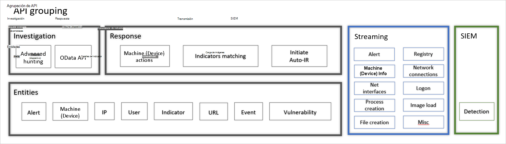

# Introducción a la administración y las APIOverview of management and APIs 

[!INCLUDE [Microsoft 365 Defender rebranding](../../includes/microsoft-defender.md)]

**Se aplica a:****Applies to:**
- [Microsoft Defender para punto de conexiónMicrosoft Defender for Endpoint](https://go.microsoft.com/fwlink/p/?linkid=2154037)
- [Microsoft 365 DefenderMicrosoft 365 Defender](https://go.microsoft.com/fwlink/?linkid=2118804)

> ¿Desea experimentar Defender for Endpoint?Want to experience Defender for Endpoint? [Regístrate para obtener una versión de prueba gratuita.Sign up for a free trial.](https://www.microsoft.com/microsoft-365/windows/microsoft-defender-atp?ocid=docs-mgt-apis-abovefoldlink)

Defender for Endpoint admite una amplia variedad de opciones para garantizar que los clientes puedan adoptar fácilmente la plataforma.Defender for Endpoint supports a wide variety of options to ensure that customers can easily adopt the platform. 

Reconociendo que los entornos y estructuras de los clientes pueden variar, Defender for Endpoint se creó con flexibilidad y control pormenorizado para adaptarse a los distintos requisitos del cliente.Acknowledging that customer environments and structures can vary, Defender for Endpoint was created with flexibility and granular control to fit varying customer requirements. 

## Incorporación de puntos de conexión y acceso al portalEndpoint onboarding and portal access 

La incorporación de dispositivos está totalmente integrada en Microsoft Endpoint Manager y Microsoft Intune para dispositivos cliente y Azure Security Center para dispositivos de servidor, lo que proporciona una experiencia completa de extremo a extremo de configuración, implementación y supervisión.Device onboarding is fully integrated into Microsoft Endpoint Manager and Microsoft Intune for client devices and Azure Security Center for server devices, providing complete end-to-end experience of configuration, deployment, and monitoring. Además, Microsoft Defender para endpoint admite la directiva de grupo y otras herramientas de terceros usadas para la administración de dispositivos.In addition, Microsoft Defender for Endpoint supports Group Policy and other third-party tools used for devices management.

Defender for Endpoint proporciona un control preciso sobre lo que los usuarios con acceso al portal pueden ver y hacer a través de la flexibilidad del control de acceso basado en roles (RBAC).Defender for Endpoint provides fine-grained control over what users with access to the portal can see and do through the flexibility of role-based access control (RBAC). El modelo RBAC admite todos los sabores de la estructura de los equipos de seguridad:The RBAC model supports all flavors of security teams structure:
- Organizaciones distribuidas globalmente y equipos de seguridadGlobally distributed organizations and security teams
- Equipos de operaciones de seguridad de modelos en nivelesTiered model security operations teams
- Divisiones totalmente segregadas con equipos de operaciones de seguridad global centralizados únicosFully segregated divisions with single centralized global security operations teams 

## API disponiblesAvailable APIs
La solución de Microsoft Defender para endpoint se basa en una plataforma lista para la integración.The Microsoft Defender for Endpoint solution is built on top of an integration-ready platform.

Defender for Endpoint expone gran parte de sus datos y acciones a través de un conjunto de API programáticas.Defender for Endpoint exposes much of its data and actions through a set of programmatic APIs. Estas API le permitirán automatizar flujos de trabajo e innovar en función de las capacidades de Defender para endpoints.Those APIs will enable you to automate workflows and innovate based on Defender for Endpoint capabilities.

  

Las API de Defender for Endpoint se pueden agrupar en tres:The Defender for Endpoint APIs can be grouped into three:
- Microsoft Defender para api de punto de conexiónMicrosoft Defender for Endpoint APIs 
- API de streaming de datos sin procesarRaw data streaming API
- Integración de SIEMSIEM integration

## Microsoft Defender para api de punto de conexiónMicrosoft Defender for Endpoint APIs

Defender for Endpoint ofrece un modelo de API en capas que expone datos y capacidades en un modelo estructurado, claro y fácil de usar, expuesto a través de un modelo estándar de autenticación y autorización basado en Azure AD que permite el acceso en contexto de usuarios o aplicaciones SaaS.Defender for Endpoint offers a layered API model exposing data and capabilities in a structured, clear, and easy to use model, exposed through a standard Azure  AD-based authentication and authorization model allowing access in context of users or SaaS applications. El modelo de API se diseñó para exponer entidades y funcionalidades de forma coherente.The API model was designed to expose entities and capabilities in a consistent form. 

Vea este vídeo para obtener una introducción rápida a las API de Defender para Endpoint.Watch this video for a quick overview of Defender for Endpoint's APIs. 
>[!VIDEO https://www.microsoft.com/en-us/videoplayer/embed/RE4d73M]

La **API** de investigación expone la riqueza de Defender para endpoint: expone entidades calculadas o "perfiladas" (por ejemplo, dispositivo, usuario y archivo) y eventos discretos (por ejemplo, creación de procesos y creación de archivos) que normalmente describen un comportamiento relacionado con una entidad, lo que habilita el acceso a los datos a través de interfaces de investigación que permiten un acceso basado en consultas a los datos.The **Investigation API** exposes the richness of Defender for Endpoint - exposing calculated or 'profiled' entities (for example, device, user, and file) and discrete events (for example, process creation and file creation) which typically describes a behavior related to an entity, enabling access to data via investigation interfaces allowing a query-based access to data. Para obtener más información, vea [Supported API](exposed-apis-list.md).For more information, see [Supported APIs](exposed-apis-list.md).

La **API** de respuesta expone la capacidad de realizar acciones en el servicio y en los dispositivos, lo que permite a los clientes ingerir indicadores, administrar la configuración, el estado de alerta, así como realizar acciones de respuesta en dispositivos mediante programación, como aislar dispositivos de la red, archivos de cuarentena y otros.The **Response API** exposes the ability to take actions in the service and on devices, enabling customers to ingest indicators, manage settings, alert status, as well as take response actions on devices programmatically such as isolate devices from the network, quarantine files, and others. 

## API de streaming de datos sin procesarRaw data streaming API 
La API de streaming de datos sin procesar de Defender for Endpoint ofrece a los clientes la capacidad de enviar eventos y alertas en tiempo real desde sus instancias a medida que se producen en un único flujo de datos, lo que proporciona un mecanismo de entrega de baja latencia y alto rendimiento.Defender for Endpoint raw data streaming API provides the ability for customers to ship real-time events and alerts from their instances as they occur within a single data stream, providing a low latency, high throughput delivery mechanism.

La información del evento Defender for Endpoint se inserta directamente en Azure Storage para la retención de datos a largo plazo, o en Azure Event Hubs para su consumo por parte de servicios de visualización o motores de procesamiento de datos adicionales.The Defender for Endpoint event information is pushed directly to Azure storage for long-term data retention, or to Azure Event Hubs for consumption by visualization services or additional data processing engines. 

Para obtener más información, vea [Raw data streaming API](raw-data-export.md).For more information, see [Raw data streaming API](raw-data-export.md).

## SIEM APISIEM API
Al habilitar la integración de la información de seguridad y la administración de eventos (SIEM), permite extraer detecciones del Centro de seguridad de Microsoft Defender mediante la solución SIEM o mediante la conexión directa a la API rest de detecciones.When you enable security information and event management (SIEM) integration, it allows you to pull detections from Microsoft Defender Security Center using your SIEM solution or by connecting directly to the detections REST API. Esto activa la sección detalles de acceso al conector SIEM con valores rellenados previamente y se crea una aplicación en el inquilino de Azure Active Directory (Azure AD).This activates the SIEM connector access details section with pre-populated values and an application is created under your Azure Active Directory (Azure AD) tenant. Para obtener más información, vea [Integración siem](enable-siem-integration.md).For more information, see [SIEM integration](enable-siem-integration.md).

## Temas relacionadosRelated topics
- [Obtener acceso a las API de Microsoft Defender para puntos de conexión Access the Microsoft Defender for Endpoint APIs ](apis-intro.md)
- [API compatiblesSupported APIs](exposed-apis-list.md)
- [Oportunidades para asociados técnicosTechnical partner opportunities](partner-integration.md)

