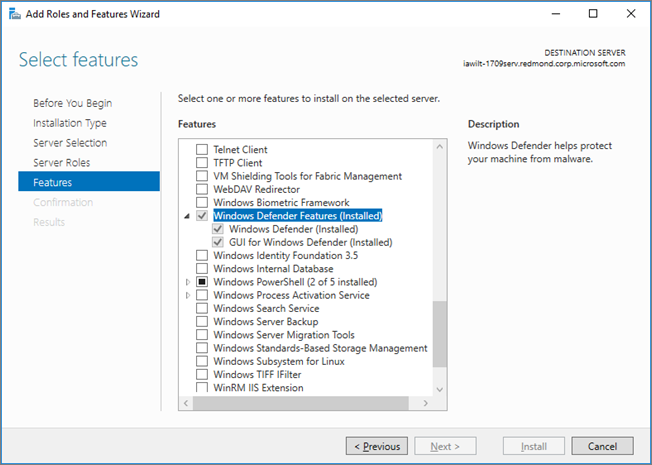

# <a name="microsoft-defender-antivirus-on-windows-server"></a><span data-ttu-id="e10f2-104">Antivirus de Microsoft Defender en Windows Server</span><span class="sxs-lookup"><span data-stu-id="e10f2-104">Microsoft Defender Antivirus on Windows Server</span></span>

[!INCLUDE [Microsoft 365 Defender rebranding](../../includes/microsoft-defender.md)]

<span data-ttu-id="e10f2-105">**Se aplica a:**</span><span class="sxs-lookup"><span data-stu-id="e10f2-105">**Applies to:**</span></span>

- [<span data-ttu-id="e10f2-106">Microsoft Defender para punto de conexión</span><span class="sxs-lookup"><span data-stu-id="e10f2-106">Microsoft Defender for Endpoint</span></span>](/microsoft-365/security/defender-endpoint/)

<span data-ttu-id="e10f2-107">Antivirus de Microsoft Defender está disponible en las siguientes ediciones o versiones de Windows Server:</span><span class="sxs-lookup"><span data-stu-id="e10f2-107">Microsoft Defender Antivirus is available on the following editions/versions of Windows Server:</span></span>
- <span data-ttu-id="e10f2-108">Windows Server 2019</span><span class="sxs-lookup"><span data-stu-id="e10f2-108">Windows Server 2019</span></span>
- <span data-ttu-id="e10f2-109">Windows Server, versión 1803 o posterior</span><span class="sxs-lookup"><span data-stu-id="e10f2-109">Windows Server, version  1803 or later</span></span>
- <span data-ttu-id="e10f2-110">Windows Server 2016.</span><span class="sxs-lookup"><span data-stu-id="e10f2-110">Windows Server 2016.</span></span> 

<span data-ttu-id="e10f2-111">En algunos casos, Antivirus de Microsoft Defender se conoce como *Endpoint Protection*; sin embargo, el motor de protección es el mismo.</span><span class="sxs-lookup"><span data-stu-id="e10f2-111">In some instances, Microsoft Defender Antivirus is referred to as *Endpoint Protection*; however, the protection engine is the same.</span></span> <span data-ttu-id="e10f2-112">Aunque la funcionalidad, configuración y administración son en gran medida las mismas para Antivirus de Microsoft Defender en [Windows 10,](microsoft-defender-antivirus-in-windows-10.md)existen algunas diferencias clave en Windows Server:</span><span class="sxs-lookup"><span data-stu-id="e10f2-112">Although the functionality, configuration, and management are largely the same for [Microsoft Defender Antivirus on Windows 10](microsoft-defender-antivirus-in-windows-10.md), there are a few key differences on Windows Server:</span></span>

- <span data-ttu-id="e10f2-113">En Windows Server, [las exclusiones automáticas](configure-server-exclusions-microsoft-defender-antivirus.md) se aplican en función del rol de servidor definido.</span><span class="sxs-lookup"><span data-stu-id="e10f2-113">On Windows Server, [automatic exclusions](configure-server-exclusions-microsoft-defender-antivirus.md) are applied based on your defined Server Role.</span></span>
 
- <span data-ttu-id="e10f2-114">En Windows Server, si está ejecutando una solución antivirus o antimalware que no sea de Microsoft, Antivirus de Microsoft Defender no entra en modo pasivo ni en modo deshabilitado automáticamente.</span><span class="sxs-lookup"><span data-stu-id="e10f2-114">On Windows Server, if you are running a non-Microsoft antivirus/antimalware solution, Microsoft Defender Antivirus does not go into either passive mode or disabled mode automatically.</span></span> <span data-ttu-id="e10f2-115">Sin embargo, puedes establecer Antivirus de Microsoft Defender en modo pasivo o deshabilitado manualmente.</span><span class="sxs-lookup"><span data-stu-id="e10f2-115">However, you can set Microsoft Defender Antivirus to passive or disabled mode manually.</span></span>

## <a name="setting-up-microsoft-defender-antivirus-on-windows-server"></a><span data-ttu-id="e10f2-116">Configuración del Antivirus de Microsoft Defender en Windows Server</span><span class="sxs-lookup"><span data-stu-id="e10f2-116">Setting up Microsoft Defender Antivirus on Windows Server</span></span>

<span data-ttu-id="e10f2-117">El proceso de configuración y ejecución de Antivirus de Microsoft Defender en una plataforma de servidor incluye varios pasos:</span><span class="sxs-lookup"><span data-stu-id="e10f2-117">The process of setting up and running Microsoft Defender Antivirus on a server platform includes several steps:</span></span>

1. <span data-ttu-id="e10f2-118">[Habilitar la interfaz](#enable-the-user-interface-on-windows-server).</span><span class="sxs-lookup"><span data-stu-id="e10f2-118">[Enable the interface](#enable-the-user-interface-on-windows-server).</span></span>
2. <span data-ttu-id="e10f2-119">[Instalar Antivirus de Microsoft Defender](#install-microsoft-defender-antivirus-on-windows-server).</span><span class="sxs-lookup"><span data-stu-id="e10f2-119">[Install Microsoft Defender Antivirus](#install-microsoft-defender-antivirus-on-windows-server).</span></span>
3. <span data-ttu-id="e10f2-120">[Compruebe que antivirus de Microsoft Defender se está ejecutando](#verify-microsoft-defender-antivirus-is-running).</span><span class="sxs-lookup"><span data-stu-id="e10f2-120">[Verify Microsoft Defender Antivirus is running](#verify-microsoft-defender-antivirus-is-running).</span></span>
4. <span data-ttu-id="e10f2-121">[Actualizar la inteligencia de seguridad antimalware](#update-antimalware-security-intelligence).</span><span class="sxs-lookup"><span data-stu-id="e10f2-121">[Update your antimalware Security intelligence](#update-antimalware-security-intelligence).</span></span>
5. <span data-ttu-id="e10f2-122">(Según sea necesario) [Enviar ejemplos](#submit-samples).</span><span class="sxs-lookup"><span data-stu-id="e10f2-122">(As needed) [Submit samples](#submit-samples).</span></span>
6. <span data-ttu-id="e10f2-123">(Según sea necesario) [Configurar exclusiones automáticas](#configure-automatic-exclusions).</span><span class="sxs-lookup"><span data-stu-id="e10f2-123">(As needed) [Configure automatic exclusions](#configure-automatic-exclusions).</span></span>
7. <span data-ttu-id="e10f2-124">(Solo si es necesario) [Establece Antivirus de Microsoft Defender en modo pasivo](#need-to-set-microsoft-defender-antivirus-to-passive-mode).</span><span class="sxs-lookup"><span data-stu-id="e10f2-124">(Only if necessary) [Set Microsoft Defender Antivirus to passive mode](#need-to-set-microsoft-defender-antivirus-to-passive-mode).</span></span>

## <a name="enable-the-user-interface-on-windows-server"></a><span data-ttu-id="e10f2-125">Habilitar la interfaz de usuario en Windows Server</span><span class="sxs-lookup"><span data-stu-id="e10f2-125">Enable the user interface on Windows Server</span></span>

<span data-ttu-id="e10f2-126">De forma predeterminada, Antivirus de Microsoft Defender está instalado y funciona en Windows Server.</span><span class="sxs-lookup"><span data-stu-id="e10f2-126">By default, Microsoft Defender Antivirus is installed and functional on Windows Server.</span></span> <span data-ttu-id="e10f2-127">A veces, la interfaz de usuario (GUI) se instala de forma predeterminada, pero no es necesaria.</span><span class="sxs-lookup"><span data-stu-id="e10f2-127">Sometimes, the user interface (GUI) is installed by default, but the GUI is not required.</span></span> <span data-ttu-id="e10f2-128">Puede usar PowerShell, directiva de grupo u otros métodos para administrar Antivirus de Microsoft Defender.</span><span class="sxs-lookup"><span data-stu-id="e10f2-128">You can use PowerShell, Group Policy, or other methods to manage Microsoft Defender Antivirus.</span></span> 

<span data-ttu-id="e10f2-129">Si la GUI no está instalada en el servidor y desea instalarla, el Asistente para agregar **roles** y características o cmdlets de PowerShell.</span><span class="sxs-lookup"><span data-stu-id="e10f2-129">If the GUI is not installed on your server, and you want to install it, either the **Add Roles and Features** wizard or PowerShell cmdlets.</span></span>

### <a name="turn-on-the-gui-using-the-add-roles-and-features-wizard"></a><span data-ttu-id="e10f2-130">Activar la GUI mediante el Asistente para agregar roles y características</span><span class="sxs-lookup"><span data-stu-id="e10f2-130">Turn on the GUI using the Add Roles and Features Wizard</span></span>

1. <span data-ttu-id="e10f2-131">Consulte [Instalar roles, servicios de roles](/windows-server/administration/server-manager/install-or-uninstall-roles-role-services-or-features#install-roles-role-services-and-features-by-using-the-add-roles-and-features-wizard)y características mediante el Asistente para agregar roles y características y usar el Asistente para agregar roles y **características.**</span><span class="sxs-lookup"><span data-stu-id="e10f2-131">See [Install roles, role services, and features by using the add Roles and Features Wizard](/windows-server/administration/server-manager/install-or-uninstall-roles-role-services-or-features#install-roles-role-services-and-features-by-using-the-add-roles-and-features-wizard), and use the **Add Roles and Features Wizard**.</span></span>

2. <span data-ttu-id="e10f2-132">Cuando llegue al paso **Características** del asistente, en **Windows Defender,** seleccione la **guia para Windows Defender.**</span><span class="sxs-lookup"><span data-stu-id="e10f2-132">When you get to the **Features** step of the wizard, under **Windows Defender Features**, select the **GUI for Windows Defender** option.</span></span>

   <span data-ttu-id="e10f2-133">En Windows Server 2016, el Asistente para agregar **roles y** características tiene este aspecto:</span><span class="sxs-lookup"><span data-stu-id="e10f2-133">In Windows Server 2016, the **Add Roles and Features Wizard** looks like this:</span></span>

   

   <span data-ttu-id="e10f2-135">En Windows Server 2019, el Asistente para agregar roles y **características** es similar.</span><span class="sxs-lookup"><span data-stu-id="e10f2-135">In Windows Server 2019, the **Add Roles and Feature Wizard** is similar.</span></span>

### <a name="turn-on-the-gui-using-powershell"></a><span data-ttu-id="e10f2-136">Activar la GUI con PowerShell</span><span class="sxs-lookup"><span data-stu-id="e10f2-136">Turn on the GUI using PowerShell</span></span>

<span data-ttu-id="e10f2-137">El siguiente cmdlet de PowerShell habilitará la interfaz:</span><span class="sxs-lookup"><span data-stu-id="e10f2-137">The following PowerShell cmdlet will enable the interface:</span></span> 

```PowerShell
Install-WindowsFeature -Name Windows-Defender-GUI
```

## <a name="install-microsoft-defender-antivirus-on-windows-server"></a><span data-ttu-id="e10f2-138">Instalar Antivirus de Microsoft Defender en Windows Server</span><span class="sxs-lookup"><span data-stu-id="e10f2-138">Install Microsoft Defender Antivirus on Windows Server</span></span>

<span data-ttu-id="e10f2-139">Si necesitas instalar o reinstalar Antivirus de Microsoft Defender en Windows Server, puedes hacerlo con el Asistente para agregar **roles** y características o PowerShell.</span><span class="sxs-lookup"><span data-stu-id="e10f2-139">If you need to install or reinstall Microsoft Defender Antivirus on Windows Server, you can do that using either the **Add Roles and Features Wizard** or PowerShell.</span></span>

### <a name="use-the-add-roles-and-features-wizard-to-install-microsoft-defender-antivirus"></a><span data-ttu-id="e10f2-140">Usar el Asistente para agregar roles y características para instalar Antivirus de Microsoft Defender</span><span class="sxs-lookup"><span data-stu-id="e10f2-140">Use the Add Roles and Features Wizard to install Microsoft Defender Antivirus</span></span>

1. <span data-ttu-id="e10f2-141">Consulte este [artículo y](/windows-server/administration/server-manager/install-or-uninstall-roles-role-services-or-features#install-roles-role-services-and-features-by-using-the-add-roles-and-features-wizard)use el Asistente para agregar roles **y características.**</span><span class="sxs-lookup"><span data-stu-id="e10f2-141">Refer to [this article](/windows-server/administration/server-manager/install-or-uninstall-roles-role-services-or-features#install-roles-role-services-and-features-by-using-the-add-roles-and-features-wizard), and use the **Add Roles and Features Wizard**.</span></span>

2. <span data-ttu-id="e10f2-142">Cuando llegues al paso **Características** del asistente, selecciona la opción Antivirus de Microsoft Defender.</span><span class="sxs-lookup"><span data-stu-id="e10f2-142">When you get to the **Features** step of the wizard, select the Microsoft Defender Antivirus option.</span></span> <span data-ttu-id="e10f2-143">También seleccione la **GUI para Windows Defender** opción.</span><span class="sxs-lookup"><span data-stu-id="e10f2-143">Also select the **GUI for Windows Defender** option.</span></span>

### <a name="use-powershell-to-install-microsoft-defender-antivirus"></a><span data-ttu-id="e10f2-144">Usar PowerShell para instalar Antivirus de Microsoft Defender</span><span class="sxs-lookup"><span data-stu-id="e10f2-144">Use PowerShell to install Microsoft Defender Antivirus</span></span>

<span data-ttu-id="e10f2-145">Para usar PowerShell para instalar Microsoft Defender Antivirus, ejecute el siguiente cmdlet:</span><span class="sxs-lookup"><span data-stu-id="e10f2-145">To use PowerShell to install Microsoft Defender Antivirus, run the following cmdlet:</span></span>

```PowerShell
Install-WindowsFeature -Name Windows-Defender
```

<span data-ttu-id="e10f2-146">Los mensajes de evento para el motor de antimalware incluido con Antivirus de Microsoft Defender se pueden encontrar en [Eventos AV de Microsoft Defender.](troubleshoot-microsoft-defender-antivirus.md)</span><span class="sxs-lookup"><span data-stu-id="e10f2-146">Event messages for the antimalware engine included with Microsoft Defender Antivirus can be found in [Microsoft Defender AV Events](troubleshoot-microsoft-defender-antivirus.md).</span></span>


## <a name="verify-microsoft-defender-antivirus-is-running"></a><span data-ttu-id="e10f2-147">Comprobar que antivirus de Microsoft Defender se está ejecutando</span><span class="sxs-lookup"><span data-stu-id="e10f2-147">Verify Microsoft Defender Antivirus is running</span></span>

<span data-ttu-id="e10f2-148">Una vez instalado Antivirus de Microsoft Defender, el siguiente paso es comprobar que se está ejecutando.</span><span class="sxs-lookup"><span data-stu-id="e10f2-148">Once Microsoft Defender Antivirus is installed, your next step is to verify that it's running.</span></span> <span data-ttu-id="e10f2-149">En el extremo de Windows Server, ejecute el siguiente cmdlet de PowerShell:</span><span class="sxs-lookup"><span data-stu-id="e10f2-149">On your Windows Server endpoint, run the following PowerShell cmdlet:</span></span>

```PowerShell
Get-Service -Name windefend
```

<span data-ttu-id="e10f2-150">Para comprobar que la protección del firewall está activada, ejecute el siguiente cmdlet de PowerShell:</span><span class="sxs-lookup"><span data-stu-id="e10f2-150">To verify that firewall protection is turned on, run the following PowerShell cmdlet:</span></span>

```PowerShell 
Get-Service -Name mpssvc
```

<span data-ttu-id="e10f2-151">Como alternativa a PowerShell, puede usar el símbolo del sistema para comprobar que se está ejecutando Antivirus de Microsoft Defender.</span><span class="sxs-lookup"><span data-stu-id="e10f2-151">As an alternative to PowerShell, you can use Command Prompt to verify that Microsoft Defender Antivirus is running.</span></span> <span data-ttu-id="e10f2-152">Para ello, ejecute el siguiente comando desde un símbolo del sistema:</span><span class="sxs-lookup"><span data-stu-id="e10f2-152">To do that, run the following command from a command prompt:</span></span> 

```console
sc query Windefend
```

<span data-ttu-id="e10f2-153">El `sc query` comando devuelve información sobre el servicio Antivirus de Microsoft Defender.</span><span class="sxs-lookup"><span data-stu-id="e10f2-153">The `sc query` command returns information about the Microsoft Defender Antivirus service.</span></span> <span data-ttu-id="e10f2-154">Cuando se ejecuta Antivirus de Microsoft Defender, `STATE` el valor muestra `RUNNING` .</span><span class="sxs-lookup"><span data-stu-id="e10f2-154">When Microsoft Defender Antivirus is running, the `STATE` value displays `RUNNING`.</span></span>

## <a name="update-antimalware-security-intelligence"></a><span data-ttu-id="e10f2-155">Actualizar inteligencia de seguridad antimalware</span><span class="sxs-lookup"><span data-stu-id="e10f2-155">Update antimalware Security intelligence</span></span> 

<span data-ttu-id="e10f2-156">Para obtener la inteligencia de seguridad antimalware actualizada, debe tener el servicio Windows Update en ejecución.</span><span class="sxs-lookup"><span data-stu-id="e10f2-156">To get updated antimalware security intelligence, you must have the Windows Update service running.</span></span> <span data-ttu-id="e10f2-157">Si usas un servicio de administración de actualizaciones, como Windows Server Update Services (WSUS), asegúrate de que las actualizaciones de inteligencia de Seguridad antivirus de Microsoft Defender estén aprobadas para los equipos que administras.</span><span class="sxs-lookup"><span data-stu-id="e10f2-157">If you use an update management service, like Windows Server Update Services (WSUS), make sure that updates for Microsoft Defender Antivirus Security intelligence are approved for the computers you manage.</span></span>

<span data-ttu-id="e10f2-158">De forma predeterminada, Windows Update no descarga e instala actualizaciones automáticamente en Windows Server 2019 o Windows Server 2016.</span><span class="sxs-lookup"><span data-stu-id="e10f2-158">By default, Windows Update does not download and install updates automatically on Windows Server 2019 or Windows Server 2016.</span></span> <span data-ttu-id="e10f2-159">Puede cambiar esta configuración mediante uno de los métodos siguientes:</span><span class="sxs-lookup"><span data-stu-id="e10f2-159">You can change this configuration by using one of the following methods:</span></span>


|<span data-ttu-id="e10f2-160">Método</span><span class="sxs-lookup"><span data-stu-id="e10f2-160">Method</span></span>  |<span data-ttu-id="e10f2-161">Descripción</span><span class="sxs-lookup"><span data-stu-id="e10f2-161">Description</span></span>  |
|---------|---------|
|<span data-ttu-id="e10f2-162">**Windows Update** en el Panel de control</span><span class="sxs-lookup"><span data-stu-id="e10f2-162">**Windows Update** in Control Panel</span></span>     |<span data-ttu-id="e10f2-163">- **Instalar actualizaciones automáticamente da como** resultado que todas las actualizaciones se instalen automáticamente, incluidas Windows Defender de inteligencia de seguridad.</span><span class="sxs-lookup"><span data-stu-id="e10f2-163">- **Install updates automatically** results in all updates being automatically installed, including Windows Defender Security intelligence updates.</span></span> <br/><span data-ttu-id="e10f2-164">- **Descargue las actualizaciones, pero permítanme** elegir si instalarlas permite a Windows Defender descargar e instalar actualizaciones de inteligencia de seguridad automáticamente, pero otras actualizaciones no se instalan automáticamente.</span><span class="sxs-lookup"><span data-stu-id="e10f2-164">- **Download updates but let me choose whether to install them** allows Windows Defender to download and install Security intelligence updates automatically, but other updates are not automatically installed.</span></span>       |
|<span data-ttu-id="e10f2-165">**Directiva de grupo**</span><span class="sxs-lookup"><span data-stu-id="e10f2-165">**Group Policy**</span></span>     | <span data-ttu-id="e10f2-166">Puedes configurar y administrar Windows Update mediante la configuración disponible en la directiva de grupo, en la siguiente ruta de acceso: **Plantillas administrativas\Componentes de Windows\Windows Update\Configurar actualizaciones automáticas**</span><span class="sxs-lookup"><span data-stu-id="e10f2-166">You can set up and manage Windows Update by using the settings available in Group Policy, in the following path: **Administrative Templates\Windows Components\Windows Update\Configure Automatic Updates**</span></span>         |
|<span data-ttu-id="e10f2-167">La **clave del Registro AUOptions**</span><span class="sxs-lookup"><span data-stu-id="e10f2-167">The **AUOptions** registry key</span></span>     |<span data-ttu-id="e10f2-168">Los dos valores siguientes permiten a Windows Update descargar e instalar automáticamente las actualizaciones de inteligencia de seguridad:</span><span class="sxs-lookup"><span data-stu-id="e10f2-168">The following two values allow Windows Update to automatically download and install Security intelligence updates:</span></span> <br/><span data-ttu-id="e10f2-169">- **4**  -  **Instalar actualizaciones automáticamente**.</span><span class="sxs-lookup"><span data-stu-id="e10f2-169">- **4** - **Install updates automatically**.</span></span> <span data-ttu-id="e10f2-170">Este valor da como resultado que todas las actualizaciones se instalen automáticamente, incluidas Windows Defender de inteligencia de seguridad.</span><span class="sxs-lookup"><span data-stu-id="e10f2-170">This value results in all updates being automatically installed, including Windows Defender Security intelligence updates.</span></span> <br/><span data-ttu-id="e10f2-171">- **3**  -  **Descargue las actualizaciones, pero permítanme elegir si desea instalarlas.**</span><span class="sxs-lookup"><span data-stu-id="e10f2-171">- **3** - **Download updates but let me choose whether to install them**.</span></span>  <span data-ttu-id="e10f2-172">Este valor permite Windows Defender descargar e instalar actualizaciones de inteligencia de seguridad automáticamente, pero otras actualizaciones no se instalan automáticamente.</span><span class="sxs-lookup"><span data-stu-id="e10f2-172">This value allows Windows Defender to download and install Security intelligence updates automatically, but other updates are not automatically installed.</span></span>         |

<span data-ttu-id="e10f2-173">Para garantizar que se mantiene la protección contra malware, se recomienda habilitar los siguientes servicios:</span><span class="sxs-lookup"><span data-stu-id="e10f2-173">To ensure that protection from malware is maintained, we recommend that you enable the following services:</span></span>

- <span data-ttu-id="e10f2-174">Servicio de informes de errores de Windows</span><span class="sxs-lookup"><span data-stu-id="e10f2-174">Windows Error Reporting service</span></span>

- <span data-ttu-id="e10f2-175">Servicio de Windows Update</span><span class="sxs-lookup"><span data-stu-id="e10f2-175">Windows Update service</span></span>

<span data-ttu-id="e10f2-176">En la tabla siguiente se enumeran los servicios de Antivirus de Microsoft Defender y los servicios dependientes.</span><span class="sxs-lookup"><span data-stu-id="e10f2-176">The following table lists the services for Microsoft Defender Antivirus and the dependent services.</span></span>

|<span data-ttu-id="e10f2-177">Nombre del servicio</span><span class="sxs-lookup"><span data-stu-id="e10f2-177">Service Name</span></span>|<span data-ttu-id="e10f2-178">Ubicación del archivo</span><span class="sxs-lookup"><span data-stu-id="e10f2-178">File Location</span></span>|<span data-ttu-id="e10f2-179">Descripción</span><span class="sxs-lookup"><span data-stu-id="e10f2-179">Description</span></span>|
|--------|---------|--------|
|<span data-ttu-id="e10f2-180">Windows Defender (WinDefend)</span><span class="sxs-lookup"><span data-stu-id="e10f2-180">Windows Defender Service (WinDefend)</span></span>|`C:\Program Files\Windows Defender\MsMpEng.exe`|<span data-ttu-id="e10f2-181">Este es el servicio antivirus principal de Microsoft Defender que debe ejecutarse en todo momento.</span><span class="sxs-lookup"><span data-stu-id="e10f2-181">This is the main Microsoft Defender Antivirus service that needs to be running at all times.</span></span>|
|<span data-ttu-id="e10f2-182">Servicio de informes de errores de Windows (Wersvc)</span><span class="sxs-lookup"><span data-stu-id="e10f2-182">Windows Error Reporting Service (Wersvc)</span></span>|`C:\WINDOWS\System32\svchost.exe -k WerSvcGroup`|<span data-ttu-id="e10f2-183">Este servicio devuelve informes de error a Microsoft.</span><span class="sxs-lookup"><span data-stu-id="e10f2-183">This service sends error reports back to Microsoft.</span></span>|
|<span data-ttu-id="e10f2-184">Windows Defender firewall (MpsSvc)</span><span class="sxs-lookup"><span data-stu-id="e10f2-184">Windows Defender Firewall (MpsSvc)</span></span>|`C:\WINDOWS\system32\svchost.exe -k LocalServiceNoNetwork`|<span data-ttu-id="e10f2-185">Se recomienda dejar el servicio Windows Defender firewall habilitado.</span><span class="sxs-lookup"><span data-stu-id="e10f2-185">We recommend leaving the Windows Defender Firewall service enabled.</span></span>|
|<span data-ttu-id="e10f2-186">Windows Update (Wuauserv)</span><span class="sxs-lookup"><span data-stu-id="e10f2-186">Windows Update (Wuauserv)</span></span>|`C:\WINDOWS\system32\svchost.exe -k netsvcs`|<span data-ttu-id="e10f2-187">Windows Update es necesario para obtener actualizaciones de inteligencia de seguridad y actualizaciones del motor de antimalware</span><span class="sxs-lookup"><span data-stu-id="e10f2-187">Windows Update is needed to get Security intelligence updates and antimalware engine updates</span></span>|

## <a name="submit-samples"></a><span data-ttu-id="e10f2-188">Enviar ejemplos</span><span class="sxs-lookup"><span data-stu-id="e10f2-188">Submit samples</span></span>

<span data-ttu-id="e10f2-189">El envío de ejemplo permite a Microsoft recopilar muestras de software potencialmente malintencionado.</span><span class="sxs-lookup"><span data-stu-id="e10f2-189">Sample submission allows Microsoft to collect samples of potentially malicious software.</span></span> <span data-ttu-id="e10f2-190">Para ayudar a proporcionar una protección continua y actualizada, los investigadores de Microsoft usan estas muestras para analizar actividades sospechosas y producir inteligencia de seguridad antimalware actualizada.</span><span class="sxs-lookup"><span data-stu-id="e10f2-190">To help provide continued and up-to-date protection, Microsoft researchers use these samples to analyze suspicious activities and produce updated antimalware Security intelligence.</span></span> <span data-ttu-id="e10f2-191">Recopilamos archivos ejecutables del programa, como .exe archivos y .dll archivos.</span><span class="sxs-lookup"><span data-stu-id="e10f2-191">We collect program executable files, such as .exe files and .dll files.</span></span> <span data-ttu-id="e10f2-192">No recopilamos archivos que contienen datos personales, como documentos de Microsoft Word y archivos PDF.</span><span class="sxs-lookup"><span data-stu-id="e10f2-192">We do not collect files that contain personal data, like Microsoft Word documents and PDF files.</span></span>

### <a name="submit-a-file"></a><span data-ttu-id="e10f2-193">Enviar un archivo</span><span class="sxs-lookup"><span data-stu-id="e10f2-193">Submit a file</span></span>

1. <span data-ttu-id="e10f2-194">Revise la [guía de envío](/windows/security/threat-protection/intelligence/submission-guide).</span><span class="sxs-lookup"><span data-stu-id="e10f2-194">Review the [submission guide](/windows/security/threat-protection/intelligence/submission-guide).</span></span>

2. <span data-ttu-id="e10f2-195">Visite el portal [de envío de ejemplo](https://www.microsoft.com/wdsi/filesubmission)y envíe el archivo.</span><span class="sxs-lookup"><span data-stu-id="e10f2-195">Visit the [sample submission portal](https://www.microsoft.com/wdsi/filesubmission), and submit your file.</span></span>


### <a name="enable-automatic-sample-submission"></a><span data-ttu-id="e10f2-196">Habilitar el envío automático de muestra</span><span class="sxs-lookup"><span data-stu-id="e10f2-196">Enable automatic sample submission</span></span>

<span data-ttu-id="e10f2-197">Para habilitar el envío automático de ejemplo, inicie una consola Windows PowerShell como administrador y establezca los datos de valor **SubmitSamplesConsent** de acuerdo con una de las opciones siguientes:</span><span class="sxs-lookup"><span data-stu-id="e10f2-197">To enable automatic sample submission, start a Windows PowerShell console as an administrator, and set the **SubmitSamplesConsent** value data according to one of the following settings:</span></span>

|<span data-ttu-id="e10f2-198">Configuración</span><span class="sxs-lookup"><span data-stu-id="e10f2-198">Setting</span></span>  |<span data-ttu-id="e10f2-199">Descripción</span><span class="sxs-lookup"><span data-stu-id="e10f2-199">Description</span></span>  |
|---------|---------|
|<span data-ttu-id="e10f2-200">**0**  -  **Preguntar siempre**</span><span class="sxs-lookup"><span data-stu-id="e10f2-200">**0** - **Always prompt**</span></span>     |<span data-ttu-id="e10f2-201">El servicio Antivirus de Microsoft Defender le pide que confirme el envío de todos los archivos necesarios.</span><span class="sxs-lookup"><span data-stu-id="e10f2-201">The Microsoft Defender Antivirus service prompts you to confirm submission of all required files.</span></span> <span data-ttu-id="e10f2-202">Esta es la configuración predeterminada para Antivirus de Microsoft Defender, pero no se recomienda para instalaciones en Windows Server 2016 o 2019 sin una GUI.</span><span class="sxs-lookup"><span data-stu-id="e10f2-202">This is the default setting for Microsoft Defender Antivirus, but is not recommended for installations on Windows Server 2016 or 2019 without a GUI.</span></span>         |
|<span data-ttu-id="e10f2-203">**1**   -  **Enviar muestras seguras automáticamente**</span><span class="sxs-lookup"><span data-stu-id="e10f2-203">**1**  - **Send safe samples automatically**</span></span>     |<span data-ttu-id="e10f2-204">El servicio Antivirus de Microsoft Defender envía todos los archivos marcados como "seguros" y solicita el resto de los archivos.</span><span class="sxs-lookup"><span data-stu-id="e10f2-204">The Microsoft Defender Antivirus service sends all files marked as "safe" and prompts for the remainder of the files.</span></span>         |
|<span data-ttu-id="e10f2-205">**2**  -  **Nunca enviar**</span><span class="sxs-lookup"><span data-stu-id="e10f2-205">**2** - **Never send**</span></span>      |<span data-ttu-id="e10f2-206">El servicio antivirus de Microsoft Defender no solicita y no envía ningún archivo.</span><span class="sxs-lookup"><span data-stu-id="e10f2-206">The Microsoft Defender Antivirus service does not prompt and does not send any files.</span></span>         |
|<span data-ttu-id="e10f2-207">**3**  -  **Enviar todas las muestras automáticamente**</span><span class="sxs-lookup"><span data-stu-id="e10f2-207">**3** - **Send all samples automatically**</span></span>     |<span data-ttu-id="e10f2-208">El servicio Antivirus de Microsoft Defender envía todos los archivos sin necesidad de confirmación.</span><span class="sxs-lookup"><span data-stu-id="e10f2-208">The Microsoft Defender Antivirus service sends all files without a prompt for confirmation.</span></span>         |

## <a name="configure-automatic-exclusions"></a><span data-ttu-id="e10f2-209">Configurar exclusiones automáticas</span><span class="sxs-lookup"><span data-stu-id="e10f2-209">Configure automatic exclusions</span></span>

<span data-ttu-id="e10f2-210">Para garantizar la seguridad y el rendimiento, se agregan automáticamente determinadas exclusiones en función de los roles y características que instales al usar Antivirus de Microsoft Defender en Windows Server 2016 o 2019.</span><span class="sxs-lookup"><span data-stu-id="e10f2-210">To help ensure security and performance, certain exclusions are automatically added based on the roles and features you install when using Microsoft Defender Antivirus on Windows Server 2016 or 2019.</span></span>

<span data-ttu-id="e10f2-211">Consulta [Configurar exclusiones en Antivirus de Microsoft Defender en Windows Server](configure-server-exclusions-microsoft-defender-antivirus.md).</span><span class="sxs-lookup"><span data-stu-id="e10f2-211">See [Configure exclusions in Microsoft Defender Antivirus on Windows Server](configure-server-exclusions-microsoft-defender-antivirus.md).</span></span> 

## <a name="need-to-set-microsoft-defender-antivirus-to-passive-mode"></a><span data-ttu-id="e10f2-212">¿Necesita establecer Antivirus de Microsoft Defender en modo pasivo?</span><span class="sxs-lookup"><span data-stu-id="e10f2-212">Need to set Microsoft Defender Antivirus to passive mode?</span></span>

<span data-ttu-id="e10f2-213">Si usas un producto antivirus que no sea de Microsoft como solución antivirus principal en Windows Server, debes establecer Antivirus de Microsoft Defender en modo pasivo o en modo deshabilitado.</span><span class="sxs-lookup"><span data-stu-id="e10f2-213">If you are using a non-Microsoft antivirus product as your primary antivirus solution on Windows Server, you must set Microsoft Defender Antivirus to passive mode or disabled mode.</span></span>

- <span data-ttu-id="e10f2-214">En Windows Server, versión 1803 o posterior, o Windows Server 2019, puedes establecer Antivirus de Microsoft Defender en modo pasivo.</span><span class="sxs-lookup"><span data-stu-id="e10f2-214">On Windows Server, version 1803 or newer, or Windows Server 2019, you can set Microsoft Defender Antivirus to passive mode.</span></span>  

- <span data-ttu-id="e10f2-215">En Windows Server 2016, antivirus de Microsoft Defender no se admite junto con un producto antivirus o antimalware que no sea de Microsoft.</span><span class="sxs-lookup"><span data-stu-id="e10f2-215">On Windows Server 2016, Microsoft Defender Antivirus is not supported alongside a non-Microsoft antivirus/antimalware product.</span></span> <span data-ttu-id="e10f2-216">En estos casos, debes establecer Antivirus de Microsoft Defender en modo deshabilitado.</span><span class="sxs-lookup"><span data-stu-id="e10f2-216">In these cases, you must set Microsoft Defender Antivirus to disabled mode.</span></span>

### <a name="set-microsoft-defender-antivirus-to-passive-mode-using-powershell"></a><span data-ttu-id="e10f2-217">Establecer Antivirus de Microsoft Defender en modo pasivo con PowerShell</span><span class="sxs-lookup"><span data-stu-id="e10f2-217">Set Microsoft Defender Antivirus to passive mode using PowerShell</span></span>

<span data-ttu-id="e10f2-218">Si usa Windows Server, versión 1803 o Windows Server 2019, puede establecer Antivirus de Microsoft Defender en modo pasivo mediante el siguiente cmdlet de PowerShell:</span><span class="sxs-lookup"><span data-stu-id="e10f2-218">If you are using Windows Server, version 1803 or Windows Server 2019, you can set Microsoft Defender Antivirus to passive mode by using the following PowerShell cmdlet:</span></span>

`CMDLET NEEDED`

### <a name="set-microsoft-defender-antivirus-to-passive-mode-using-group-policy"></a><span data-ttu-id="e10f2-219">Establecer El Antivirus de Microsoft Defender en modo pasivo mediante la directiva de grupo</span><span class="sxs-lookup"><span data-stu-id="e10f2-219">Set Microsoft Defender Antivirus to passive mode using Group Policy</span></span>

<span data-ttu-id="e10f2-220">PROCEDIMIENTO NECESARIO</span><span class="sxs-lookup"><span data-stu-id="e10f2-220">PROCEDURE NEEDED</span></span>

### <a name="set-microsoft-defender-antivirus-to-passive-mode-using-a-registry-key"></a><span data-ttu-id="e10f2-221">Establecer Antivirus de Microsoft Defender en modo pasivo con una clave del Registro</span><span class="sxs-lookup"><span data-stu-id="e10f2-221">Set Microsoft Defender Antivirus to passive mode using a registry key</span></span>

<span data-ttu-id="e10f2-222">Si usa Windows Server, versión 1803 o Windows Server 2019, puede establecer Antivirus de Microsoft Defender en modo pasivo estableciendo la siguiente clave del Registro:</span><span class="sxs-lookup"><span data-stu-id="e10f2-222">If you are using Windows Server, version 1803 or Windows Server 2019, you can set Microsoft Defender Antivirus to passive mode by setting the following registry key:</span></span>
- <span data-ttu-id="e10f2-223">Ruta de acceso: `HKLM\SOFTWARE\Policies\Microsoft\Windows Advanced Threat Protection`</span><span class="sxs-lookup"><span data-stu-id="e10f2-223">Path: `HKLM\SOFTWARE\Policies\Microsoft\Windows Advanced Threat Protection`</span></span>
- <span data-ttu-id="e10f2-224">Nombre: `ForceDefenderPassiveMode`</span><span class="sxs-lookup"><span data-stu-id="e10f2-224">Name: `ForceDefenderPassiveMode`</span></span>
- <span data-ttu-id="e10f2-225">Tipo: `REG_DWORD`</span><span class="sxs-lookup"><span data-stu-id="e10f2-225">Type: `REG_DWORD`</span></span>
- <span data-ttu-id="e10f2-226">Valor: `1`</span><span class="sxs-lookup"><span data-stu-id="e10f2-226">Value: `1`</span></span>

### <a name="disable-microsoft-defender-antivirus-using-the-remove-roles-and-features-wizard"></a><span data-ttu-id="e10f2-227">Deshabilitar Antivirus de Microsoft Defender con el Asistente para quitar roles y características</span><span class="sxs-lookup"><span data-stu-id="e10f2-227">Disable Microsoft Defender Antivirus using the Remove Roles and Features wizard</span></span>

1. <span data-ttu-id="e10f2-228">Vea [Instalar o desinstalar roles, servicios de roles o características](/windows-server/administration/server-manager/install-or-uninstall-roles-role-services-or-features#remove-roles-role-services-and-features-by-using-the-remove-roles-and-features-wizard)y use el Asistente para quitar roles y **características.**</span><span class="sxs-lookup"><span data-stu-id="e10f2-228">See [Install or Uninstall Roles, Role Services, or Features](/windows-server/administration/server-manager/install-or-uninstall-roles-role-services-or-features#remove-roles-role-services-and-features-by-using-the-remove-roles-and-features-wizard), and use the **Remove Roles and Features Wizard**.</span></span> 

2. <span data-ttu-id="e10f2-229">Cuando llegue al paso **Características** del asistente, desactive la **opción Windows Defender Características.**</span><span class="sxs-lookup"><span data-stu-id="e10f2-229">When you get to the **Features** step of the wizard, clear the **Windows Defender Features** option.</span></span> 

    <span data-ttu-id="e10f2-230">Si borras **Windows Defender** en la sección Características de **Windows Defender,** se te pedirá que quites la gui de opción de interfaz para **Windows Defender**.</span><span class="sxs-lookup"><span data-stu-id="e10f2-230">If you clear **Windows Defender** by itself under the **Windows Defender Features** section, you will be prompted to remove the interface option **GUI for Windows Defender**.</span></span> 
    
    <span data-ttu-id="e10f2-231">Antivirus de Microsoft Defender seguirá ejecundo normalmente sin la interfaz de usuario, pero la interfaz de usuario no se puede habilitar si deshabilita la característica **principal Windows Defender** usuario.</span><span class="sxs-lookup"><span data-stu-id="e10f2-231">Microsoft Defender Antivirus will still run normally without the user interface, but the user interface cannot be enabled if you disable the core **Windows Defender** feature.</span></span>

### <a name="turn-off-the-microsoft-defender-antivirus-user-interface-using-powershell"></a><span data-ttu-id="e10f2-232">Desactivar la interfaz de usuario de Antivirus de Microsoft Defender con PowerShell</span><span class="sxs-lookup"><span data-stu-id="e10f2-232">Turn off the Microsoft Defender Antivirus user interface using PowerShell</span></span>

<span data-ttu-id="e10f2-233">Para desactivar la GUI de Antivirus de Microsoft Defender, use el siguiente cmdlet de PowerShell:</span><span class="sxs-lookup"><span data-stu-id="e10f2-233">To turn off the Microsoft Defender Antivirus GUI, use the following PowerShell cmdlet:</span></span>

```PowerShell
Uninstall-WindowsFeature -Name Windows-Defender-GUI
```

### <a name="are-you-using-windows-server-2016"></a><span data-ttu-id="e10f2-234">¿Estás usando Windows Server 2016?</span><span class="sxs-lookup"><span data-stu-id="e10f2-234">Are you using Windows Server 2016?</span></span>

<span data-ttu-id="e10f2-235">Si usas Windows Server 2016 y un producto antivirus o antimalware de terceros que Microsoft no ofrece ni desarrolla, tendrás que deshabilitar o desinstalar Antivirus de Microsoft Defender.</span><span class="sxs-lookup"><span data-stu-id="e10f2-235">If you are using Windows Server 2016 and a third-party antimalware/antivirus product that is not offered or developed by Microsoft, you'll need to disable/uninstall Microsoft Defender Antivirus.</span></span> 

> [!NOTE]
> <span data-ttu-id="e10f2-236">No puedes desinstalar la aplicación seguridad de Windows, pero puedes deshabilitar la interfaz con estas instrucciones.</span><span class="sxs-lookup"><span data-stu-id="e10f2-236">You can't uninstall the Windows Security app, but you can disable the interface with these instructions.</span></span>

<span data-ttu-id="e10f2-237">El siguiente cmdlet de PowerShell desinstala Antivirus de Microsoft Defender en Windows Server 2016:</span><span class="sxs-lookup"><span data-stu-id="e10f2-237">The following PowerShell cmdlet uninstalls Microsoft Defender Antivirus on Windows Server 2016:</span></span>

```PowerShell
Uninstall-WindowsFeature -Name Windows-Defender
```

<span data-ttu-id="e10f2-238">Para deshabilitar Antivirus de Microsoft Defender en Windows Server 2016, use el siguiente cmdlet de PowerShell:</span><span class="sxs-lookup"><span data-stu-id="e10f2-238">To disable Microsoft Defender Antivirus on Windows Server 2016, use the following PowerShell cmdlet:</span></span>

```PowerShell
Set-MpPreference -DisableRealtimeMonitoring $true
```

## <a name="see-also"></a><span data-ttu-id="e10f2-239">Vea también</span><span class="sxs-lookup"><span data-stu-id="e10f2-239">See also</span></span>

- [<span data-ttu-id="e10f2-240">Antivirus de Microsoft Defender en Windows 10</span><span class="sxs-lookup"><span data-stu-id="e10f2-240">Microsoft Defender Antivirus in Windows 10</span></span>](microsoft-defender-antivirus-in-windows-10.md)
- [<span data-ttu-id="e10f2-241">Compatibilidad con Antivirus de Microsoft Defender</span><span class="sxs-lookup"><span data-stu-id="e10f2-241">Microsoft Defender Antivirus compatibility</span></span>](microsoft-defender-antivirus-compatibility.md)
