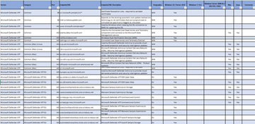

# <a name="microsoft-defender-for-endpoint-for-mac"></a><span data-ttu-id="03dc2-104">Microsoft Defender para endpoint para Mac</span><span class="sxs-lookup"><span data-stu-id="03dc2-104">Microsoft Defender for Endpoint for Mac</span></span>

[!INCLUDE [Microsoft 365 Defender rebranding](../../includes/microsoft-defender.md)]

<span data-ttu-id="03dc2-105">**Se aplica a:**</span><span class="sxs-lookup"><span data-stu-id="03dc2-105">**Applies to:**</span></span>
- [<span data-ttu-id="03dc2-106">Microsoft Defender para punto de conexión</span><span class="sxs-lookup"><span data-stu-id="03dc2-106">Microsoft Defender for Endpoint</span></span>](https://go.microsoft.com/fwlink/p/?linkid=2154037)
- [<span data-ttu-id="03dc2-107">Microsoft 365 Defender</span><span class="sxs-lookup"><span data-stu-id="03dc2-107">Microsoft 365 Defender</span></span>](https://go.microsoft.com/fwlink/?linkid=2118804)

> <span data-ttu-id="03dc2-108">¿Desea experimentar Microsoft Defender para endpoint?</span><span class="sxs-lookup"><span data-stu-id="03dc2-108">Want to experience Microsoft Defender for Endpoint?</span></span> [<span data-ttu-id="03dc2-109">Regístrate para obtener una versión de prueba gratuita.</span><span class="sxs-lookup"><span data-stu-id="03dc2-109">Sign up for a free trial.</span></span>](https://www.microsoft.com/microsoft-365/windows/microsoft-defender-atp?ocid=docs-wdatp-exposedapis-abovefoldlink)

<span data-ttu-id="03dc2-110">En este tema se describe cómo instalar, configurar, actualizar y usar Defender para Endpoint para Mac.</span><span class="sxs-lookup"><span data-stu-id="03dc2-110">This topic describes how to install, configure, update, and use Defender for Endpoint for Mac.</span></span>

> [!CAUTION]
> <span data-ttu-id="03dc2-111">Es probable que la ejecución de otros productos de protección de puntos de conexión de terceros junto con Defender para Endpoint para Mac lleve a problemas de rendimiento y efectos secundarios impredecibles.</span><span class="sxs-lookup"><span data-stu-id="03dc2-111">Running other third-party endpoint protection products alongside Defender for Endpoint for Mac is likely to lead to performance problems and unpredictable side effects.</span></span> <span data-ttu-id="03dc2-112">Si la protección de extremo que no es de Microsoft es un requisito absoluto en su entorno, puede aprovechar de forma segura la funcionalidad MDATP para Mac EDR después de configurar la funcionalidad del antivirus MDATP para Mac para que se ejecute en modo [pasivo.](mac-preferences.md#enable--disable-passive-mode)</span><span class="sxs-lookup"><span data-stu-id="03dc2-112">If non-Microsoft endpoint protection is an absolute requirement in your environment, you can still safely take advantage of MDATP for Mac EDR functionality after configuring MDATP for Mac antivirus functionality to run in [Passive mode](mac-preferences.md#enable--disable-passive-mode).</span></span>

## <a name="whats-new-in-the-latest-release"></a><span data-ttu-id="03dc2-113">Novedades de la versión más reciente</span><span class="sxs-lookup"><span data-stu-id="03dc2-113">What’s new in the latest release</span></span>

[<span data-ttu-id="03dc2-114">Novedades de Microsoft Defender para endpoint</span><span class="sxs-lookup"><span data-stu-id="03dc2-114">What's new in Microsoft Defender for Endpoint</span></span>](whats-new-in-microsoft-defender-atp.md)

[<span data-ttu-id="03dc2-115">Novedades de Microsoft Defender para Endpoint para Mac</span><span class="sxs-lookup"><span data-stu-id="03dc2-115">What's new in Microsoft Defender for Endpoint for Mac</span></span>](mac-whatsnew.md)

> [!TIP]
> <span data-ttu-id="03dc2-116">Si tienes algún comentario que quieras compartir, envíalo abriendo Microsoft Defender para Endpoint para Mac en el dispositivo y navegando a **Ayuda** para  >  **enviar comentarios**.</span><span class="sxs-lookup"><span data-stu-id="03dc2-116">If you have any feedback that you would like to share, submit it by opening Microsoft Defender for Endpoint for Mac on your device and navigating to **Help** > **Send feedback**.</span></span>

<span data-ttu-id="03dc2-117">Para obtener las características más recientes, incluidas las funcionalidades de vista previa (como la detección de puntos de conexión y la respuesta para los dispositivos Mac), configura el dispositivo macOS que ejecuta Microsoft Defender para Endpoint para que sea un dispositivo "Insider".</span><span class="sxs-lookup"><span data-stu-id="03dc2-117">To get the latest features, including preview capabilities (such as endpoint detection and response for your Mac devices), configure your macOS device running Microsoft Defender for Endpoint to be an "Insider" device.</span></span>

## <a name="how-to-install-microsoft-defender-for-endpoint-for-mac"></a><span data-ttu-id="03dc2-118">Cómo instalar Microsoft Defender para Endpoint para Mac</span><span class="sxs-lookup"><span data-stu-id="03dc2-118">How to install Microsoft Defender for Endpoint for Mac</span></span>

### <a name="prerequisites"></a><span data-ttu-id="03dc2-119">Requisitos previos</span><span class="sxs-lookup"><span data-stu-id="03dc2-119">Prerequisites</span></span>

- <span data-ttu-id="03dc2-120">Una suscripción a Defender for Endpoint y acceso al portal del Centro de seguridad de Microsoft Defender</span><span class="sxs-lookup"><span data-stu-id="03dc2-120">A Defender for Endpoint subscription and access to the Microsoft Defender Security Center portal</span></span>
- <span data-ttu-id="03dc2-121">Experiencia de nivel principiante en scripting de macOS y BASH</span><span class="sxs-lookup"><span data-stu-id="03dc2-121">Beginner-level experience in macOS and BASH scripting</span></span>
- <span data-ttu-id="03dc2-122">Privilegios administrativos en el dispositivo (en caso de implementación manual)</span><span class="sxs-lookup"><span data-stu-id="03dc2-122">Administrative privileges on the device (in case of manual deployment)</span></span>

### <a name="installation-instructions"></a><span data-ttu-id="03dc2-123">Instrucciones de instalación</span><span class="sxs-lookup"><span data-stu-id="03dc2-123">Installation instructions</span></span>

<span data-ttu-id="03dc2-124">Existen varios métodos y herramientas de implementación que puede usar para instalar y configurar Defender para Endpoint para Mac.</span><span class="sxs-lookup"><span data-stu-id="03dc2-124">There are several methods and deployment tools that you can use to install and configure Defender for Endpoint for Mac.</span></span>

- <span data-ttu-id="03dc2-125">Herramientas de administración de terceros:</span><span class="sxs-lookup"><span data-stu-id="03dc2-125">Third-party management tools:</span></span>
    - [<span data-ttu-id="03dc2-126">Implementación basada en Microsoft Intune</span><span class="sxs-lookup"><span data-stu-id="03dc2-126">Microsoft Intune-based deployment</span></span>](mac-install-with-intune.md)
    - [<span data-ttu-id="03dc2-127">Implementación basada en JAMF</span><span class="sxs-lookup"><span data-stu-id="03dc2-127">JAMF-based deployment</span></span>](mac-install-with-jamf.md)
    - [<span data-ttu-id="03dc2-128">Otros productos MDM</span><span class="sxs-lookup"><span data-stu-id="03dc2-128">Other MDM products</span></span>](mac-install-with-other-mdm.md)

- <span data-ttu-id="03dc2-129">Herramienta de línea de comandos:</span><span class="sxs-lookup"><span data-stu-id="03dc2-129">Command-line tool:</span></span>
    - [<span data-ttu-id="03dc2-130">Implementación manual</span><span class="sxs-lookup"><span data-stu-id="03dc2-130">Manual deployment</span></span>](mac-install-manually.md)

### <a name="system-requirements"></a><span data-ttu-id="03dc2-131">Requisitos del sistema</span><span class="sxs-lookup"><span data-stu-id="03dc2-131">System requirements</span></span>

<span data-ttu-id="03dc2-132">Se admiten las tres versiones principales más recientes de macOS.</span><span class="sxs-lookup"><span data-stu-id="03dc2-132">The three most recent major releases of macOS are supported.</span></span>

> [!IMPORTANT]
> <span data-ttu-id="03dc2-133">En macOS 11 (Big Sur), Microsoft Defender para Endpoint requiere perfiles de configuración adicionales.</span><span class="sxs-lookup"><span data-stu-id="03dc2-133">On macOS 11 (Big Sur), Microsoft Defender for Endpoint requires additional configuration profiles.</span></span> <span data-ttu-id="03dc2-134">Si es un cliente existente que actualiza desde versiones anteriores de macOS, asegúrese de implementar los perfiles de configuración adicionales enumerados en Nuevos perfiles de configuración para [macOS Catalina](mac-sysext-policies.md)y versiones más recientes de macOS .</span><span class="sxs-lookup"><span data-stu-id="03dc2-134">If you are an existing customer upgrading from earlier versions of macOS, make sure to deploy the additional configuration profiles listed on [New configuration profiles for macOS Catalina and newer versions of macOS](mac-sysext-policies.md).</span></span>

> [!IMPORTANT]
> <span data-ttu-id="03dc2-135">La compatibilidad con macOS 10.13 (High Sierra) se interrumpirá el 15 de febrero de 2021.</span><span class="sxs-lookup"><span data-stu-id="03dc2-135">Support for macOS 10.13 (High Sierra) will be discontinued on February 15th, 2021.</span></span>

- <span data-ttu-id="03dc2-136">11 (Big Sur), 10,15 (Catalina), 10,14 (Mojave), 10,13 (Sierra Alta)</span><span class="sxs-lookup"><span data-stu-id="03dc2-136">11 (Big Sur), 10.15 (Catalina), 10.14 (Mojave), 10.13 (High Sierra)</span></span>
- <span data-ttu-id="03dc2-137">Espacio en disco: 1 GB</span><span class="sxs-lookup"><span data-stu-id="03dc2-137">Disk space: 1GB</span></span>

<span data-ttu-id="03dc2-138">No se admiten versiones beta de macOS.</span><span class="sxs-lookup"><span data-stu-id="03dc2-138">Beta versions of macOS are not supported.</span></span>

<span data-ttu-id="03dc2-139">Después de habilitar el servicio, es posible que deba configurar la red o el firewall para permitir conexiones salientes entre él y los puntos de conexión.</span><span class="sxs-lookup"><span data-stu-id="03dc2-139">After you've enabled the service, you may need to configure your network or firewall to allow outbound connections between it and your endpoints.</span></span>

### <a name="licensing-requirements"></a><span data-ttu-id="03dc2-140">Requisitos de licencia</span><span class="sxs-lookup"><span data-stu-id="03dc2-140">Licensing requirements</span></span>

<span data-ttu-id="03dc2-141">Microsoft Defender para Endpoint para Mac requiere una de las siguientes ofertas de licencias por volumen de Microsoft:</span><span class="sxs-lookup"><span data-stu-id="03dc2-141">Microsoft Defender for Endpoint for Mac requires one of the following Microsoft Volume Licensing offers:</span></span>

- <span data-ttu-id="03dc2-142">Microsoft 365 E5 (M365 E5)</span><span class="sxs-lookup"><span data-stu-id="03dc2-142">Microsoft 365 E5 (M365 E5)</span></span>
- <span data-ttu-id="03dc2-143">Seguridad de Microsoft 365 E5</span><span class="sxs-lookup"><span data-stu-id="03dc2-143">Microsoft 365 E5 Security</span></span>
- <span data-ttu-id="03dc2-144">Microsoft 365 A5 (M365 A5)</span><span class="sxs-lookup"><span data-stu-id="03dc2-144">Microsoft 365 A5 (M365 A5)</span></span>

> [!NOTE]
> <span data-ttu-id="03dc2-145">Los usuarios con licencia elegibles pueden usar Microsoft Defender para Endpoint en hasta cinco dispositivos simultáneos.</span><span class="sxs-lookup"><span data-stu-id="03dc2-145">Eligible licensed users may use Microsoft Defender for Endpoint on up to five concurrent devices.</span></span>
> <span data-ttu-id="03dc2-146">Microsoft Defender para endpoint también está disponible para la compra de un proveedor de soluciones en la nube (CSP).</span><span class="sxs-lookup"><span data-stu-id="03dc2-146">Microsoft Defender for Endpoint is also available for purchase from a Cloud Solution Provider (CSP).</span></span> <span data-ttu-id="03dc2-147">Cuando se compra a través de un CSP, no requiere ofertas de licencias por volumen de Microsoft enumeradas.</span><span class="sxs-lookup"><span data-stu-id="03dc2-147">When purchased via a CSP, it does not require Microsoft Volume Licensing offers listed.</span></span>

### <a name="network-connections"></a><span data-ttu-id="03dc2-148">Conexiones de red</span><span class="sxs-lookup"><span data-stu-id="03dc2-148">Network connections</span></span>

<span data-ttu-id="03dc2-149">En la siguiente hoja de cálculo descargable se enumeran los servicios y sus direcciones URL asociadas a las que la red debe poder conectarse.</span><span class="sxs-lookup"><span data-stu-id="03dc2-149">The following downloadable spreadsheet lists the services and their associated URLs that your network must be able to connect to.</span></span> <span data-ttu-id="03dc2-150">Debe asegurarse de que no hay reglas de filtrado de red o firewall que denieguen el acceso *a* estas direcciones URL, o puede que necesite crear una regla de permitir específicamente para ellas.</span><span class="sxs-lookup"><span data-stu-id="03dc2-150">You should ensure that there are no firewall or network filtering rules that would deny access to these URLs, or you may need to create an *allow* rule specifically for them.</span></span>


|<span data-ttu-id="03dc2-151">**Hoja de cálculo de la lista de dominios**</span><span class="sxs-lookup"><span data-stu-id="03dc2-151">**Spreadsheet of domains list**</span></span>|<span data-ttu-id="03dc2-152">**Descripción**</span><span class="sxs-lookup"><span data-stu-id="03dc2-152">**Description**</span></span>|
|:-----|:-----|
|<br/>  | <span data-ttu-id="03dc2-154">Hoja de cálculo de registros DNS específicos para ubicaciones de servicio, ubicaciones geográficas y sistema operativo.</span><span class="sxs-lookup"><span data-stu-id="03dc2-154">Spreadsheet of specific DNS records for service locations, geographic locations, and OS.</span></span> <br><br><span data-ttu-id="03dc2-155">Descargue la hoja de cálculo aquí: [mdatp-urls.xlsx](https://download.microsoft.com/download/8/a/5/8a51eee5-cd02-431c-9d78-a58b7f77c070/mde-urls.xlsx).</span><span class="sxs-lookup"><span data-stu-id="03dc2-155">Download the spreadsheet here: [mdatp-urls.xlsx](https://download.microsoft.com/download/8/a/5/8a51eee5-cd02-431c-9d78-a58b7f77c070/mde-urls.xlsx).</span></span>

<span data-ttu-id="03dc2-156">Microsoft Defender para endpoint puede detectar un servidor proxy mediante los siguientes métodos de detección:</span><span class="sxs-lookup"><span data-stu-id="03dc2-156">Microsoft Defender for Endpoint can discover a proxy server by using the following discovery methods:</span></span>
- <span data-ttu-id="03dc2-157">Proxy autoconfig (PAC)</span><span class="sxs-lookup"><span data-stu-id="03dc2-157">Proxy autoconfig (PAC)</span></span>
- <span data-ttu-id="03dc2-158">Protocolo de detección automática de proxy web (WPAD)</span><span class="sxs-lookup"><span data-stu-id="03dc2-158">Web Proxy Autodiscovery Protocol (WPAD)</span></span>
- <span data-ttu-id="03dc2-159">Configuración manual de proxy estático</span><span class="sxs-lookup"><span data-stu-id="03dc2-159">Manual static proxy configuration</span></span>

<span data-ttu-id="03dc2-160">Si un proxy o firewall bloquea el tráfico anónimo, asegúrese de que el tráfico anónimo está permitido en las direcciones URL enumeradas anteriormente.</span><span class="sxs-lookup"><span data-stu-id="03dc2-160">If a proxy or firewall is blocking anonymous traffic, make sure that anonymous traffic is permitted in the previously listed URLs.</span></span>

> [!WARNING]
> <span data-ttu-id="03dc2-161">No se admiten servidores proxy autenticados.</span><span class="sxs-lookup"><span data-stu-id="03dc2-161">Authenticated proxies are not supported.</span></span> <span data-ttu-id="03dc2-162">Asegúrese de que solo se usa PAC, WPAD o un proxy estático.</span><span class="sxs-lookup"><span data-stu-id="03dc2-162">Ensure that only PAC, WPAD, or a static proxy is being used.</span></span>
>
> <span data-ttu-id="03dc2-163">Los servidores proxy de inspección e interceptación de SSL tampoco se admiten por motivos de seguridad.</span><span class="sxs-lookup"><span data-stu-id="03dc2-163">SSL inspection and intercepting proxies are also not supported for security reasons.</span></span> <span data-ttu-id="03dc2-164">Configure una excepción para la inspección SSL y el servidor proxy para pasar directamente los datos de Microsoft Defender para Endpoint para Mac a las direcciones URL relevantes sin interceptación.</span><span class="sxs-lookup"><span data-stu-id="03dc2-164">Configure an exception for SSL inspection and your proxy server to directly pass through data from Microsoft Defender for Endpoint for Mac to the relevant URLs without interception.</span></span> <span data-ttu-id="03dc2-165">Agregar el certificado de interceptación al almacén global no permitirá la interceptación.</span><span class="sxs-lookup"><span data-stu-id="03dc2-165">Adding your interception certificate to the global store will not allow for interception.</span></span>

<span data-ttu-id="03dc2-166">Para probar que una conexión no está bloqueada, abra [https://x.cp.wd.microsoft.com/api/report](https://x.cp.wd.microsoft.com/api/report) y [https://cdn.x.cp.wd.microsoft.com/ping](https://cdn.x.cp.wd.microsoft.com/ping) en un explorador.</span><span class="sxs-lookup"><span data-stu-id="03dc2-166">To test that a connection is not blocked, open [https://x.cp.wd.microsoft.com/api/report](https://x.cp.wd.microsoft.com/api/report) and [https://cdn.x.cp.wd.microsoft.com/ping](https://cdn.x.cp.wd.microsoft.com/ping) in a browser.</span></span>

<span data-ttu-id="03dc2-167">Si prefiere la línea de comandos, también puede comprobar la conexión ejecutando el siguiente comando en Terminal:</span><span class="sxs-lookup"><span data-stu-id="03dc2-167">If you prefer the command line, you can also check the connection by running the following command in Terminal:</span></span>

```bash
curl -w ' %{url_effective}\n' 'https://x.cp.wd.microsoft.com/api/report' 'https://cdn.x.cp.wd.microsoft.com/ping'
```

<span data-ttu-id="03dc2-168">El resultado de este comando debe ser similar al siguiente:</span><span class="sxs-lookup"><span data-stu-id="03dc2-168">The output from this command should be similar to the following:</span></span>

 `OK https://x.cp.wd.microsoft.com/api/report`

 `OK https://cdn.x.cp.wd.microsoft.com/ping`

> [!CAUTION]
> <span data-ttu-id="03dc2-169">Se recomienda mantener la Protección de [integridad del](https://support.apple.com/en-us/HT204899) sistema (SIP) habilitada en dispositivos cliente.</span><span class="sxs-lookup"><span data-stu-id="03dc2-169">We recommend that you keep [System Integrity Protection](https://support.apple.com/en-us/HT204899) (SIP) enabled on client devices.</span></span> <span data-ttu-id="03dc2-170">SIP es una característica de seguridad de macOS integrada que evita la manipulación de bajo nivel con el sistema operativo y está habilitada de forma predeterminada.</span><span class="sxs-lookup"><span data-stu-id="03dc2-170">SIP is a built-in macOS security feature that prevents low-level tampering with the OS, and is enabled by default.</span></span>

<span data-ttu-id="03dc2-171">Una vez instalado Microsoft Defender para endpoint, la conectividad se puede validar ejecutando el siguiente comando en Terminal:</span><span class="sxs-lookup"><span data-stu-id="03dc2-171">Once Microsoft Defender for Endpoint is installed, connectivity can be validated by running the following command in Terminal:</span></span>
```bash
mdatp connectivity test
```

## <a name="how-to-update-microsoft-defender-for-endpoint-for-mac"></a><span data-ttu-id="03dc2-172">Cómo actualizar Microsoft Defender para Endpoint para Mac</span><span class="sxs-lookup"><span data-stu-id="03dc2-172">How to update Microsoft Defender for Endpoint for Mac</span></span>

<span data-ttu-id="03dc2-173">Microsoft publica periódicamente actualizaciones de software para mejorar el rendimiento, la seguridad y ofrecer nuevas características.</span><span class="sxs-lookup"><span data-stu-id="03dc2-173">Microsoft regularly publishes software updates to improve performance, security, and to deliver new features.</span></span> <span data-ttu-id="03dc2-174">Para actualizar Microsoft Defender para Endpoint para Mac, se usa un programa denominado Microsoft AutoUpdate (MAU).</span><span class="sxs-lookup"><span data-stu-id="03dc2-174">To update Microsoft Defender for Endpoint for Mac, a program named Microsoft AutoUpdate (MAU) is used.</span></span> <span data-ttu-id="03dc2-175">Para obtener más información, vea [Deploy updates for Microsoft Defender for Endpoint for Mac](mac-updates.md).</span><span class="sxs-lookup"><span data-stu-id="03dc2-175">To learn more, see [Deploy updates for Microsoft Defender for Endpoint for Mac](mac-updates.md).</span></span>

## <a name="how-to-configure-microsoft-defender-for-endpoint-for-mac"></a><span data-ttu-id="03dc2-176">Cómo configurar Microsoft Defender para Endpoint para Mac</span><span class="sxs-lookup"><span data-stu-id="03dc2-176">How to configure Microsoft Defender for Endpoint for Mac</span></span>

<span data-ttu-id="03dc2-177">Las instrucciones sobre cómo configurar el producto en entornos empresariales están disponibles en Establecer preferencias para [Microsoft Defender para Endpoint para Mac](mac-preferences.md).</span><span class="sxs-lookup"><span data-stu-id="03dc2-177">Guidance for how to configure the product in enterprise environments is available in [Set preferences for Microsoft Defender for Endpoint for Mac](mac-preferences.md).</span></span>

## <a name="macos-kernel-and-system-extensions"></a><span data-ttu-id="03dc2-178">Extensiones de kernel y sistema de macOS</span><span class="sxs-lookup"><span data-stu-id="03dc2-178">macOS kernel and system extensions</span></span>

<span data-ttu-id="03dc2-179">En alineación con la evolución de macOS, estamos preparando una actualización de Microsoft Defender para Endpoint para Mac que aprovecha las extensiones del sistema en lugar de las extensiones de kernel.</span><span class="sxs-lookup"><span data-stu-id="03dc2-179">In alignment with macOS evolution, we are preparing a Microsoft Defender for Endpoint for Mac update that leverages system extensions instead of kernel extensions.</span></span> <span data-ttu-id="03dc2-180">Para obtener información relevante, consulta [Novedades de Microsoft Defender para Endpoint para Mac](mac-whatsnew.md).</span><span class="sxs-lookup"><span data-stu-id="03dc2-180">For relevant details, see [What's new in Microsoft Defender for Endpoint for Mac](mac-whatsnew.md).</span></span>

## <a name="resources"></a><span data-ttu-id="03dc2-181">Recursos</span><span class="sxs-lookup"><span data-stu-id="03dc2-181">Resources</span></span>

- <span data-ttu-id="03dc2-182">Para obtener más información sobre el registro, la desinstalación u otros temas, vea [Resources for Microsoft Defender for Endpoint for Mac](mac-resources.md).</span><span class="sxs-lookup"><span data-stu-id="03dc2-182">For more information about logging, uninstalling, or other topics, see [Resources for Microsoft Defender for Endpoint for Mac](mac-resources.md).</span></span>

- <span data-ttu-id="03dc2-183">[Privacidad de Microsoft Defender para Endpoint para Mac](mac-privacy.md).</span><span class="sxs-lookup"><span data-stu-id="03dc2-183">[Privacy for Microsoft Defender for Endpoint for Mac](mac-privacy.md).</span></span>
