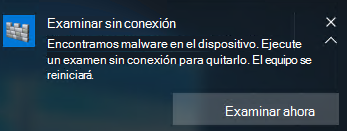
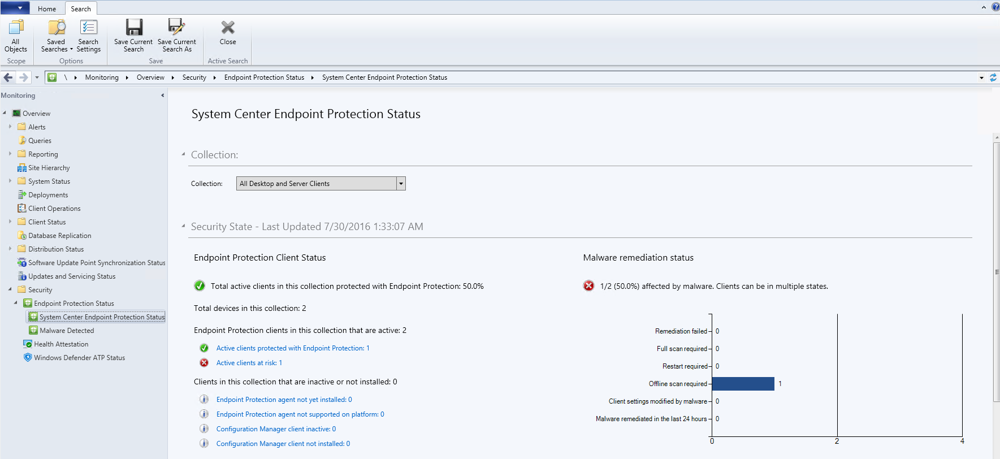

# <a name="run-and-review-the-results-of-a-microsoft-defender-offline-scan"></a><span data-ttu-id="26955-105">Ejecutar y revisar los resultados de un examen sin conexión de Microsoft Defender</span><span class="sxs-lookup"><span data-stu-id="26955-105">Run and review the results of a Microsoft Defender Offline scan</span></span>

[!INCLUDE [Microsoft 365 Defender rebranding](../../includes/microsoft-defender.md)]


<span data-ttu-id="26955-106">**Se aplica a:**</span><span class="sxs-lookup"><span data-stu-id="26955-106">**Applies to:**</span></span>

- [<span data-ttu-id="26955-107">Microsoft Defender para punto de conexión</span><span class="sxs-lookup"><span data-stu-id="26955-107">Microsoft Defender for Endpoint</span></span>](/microsoft-365/security/defender-endpoint/)

<span data-ttu-id="26955-108">Microsoft Defender Offline es una herramienta de detección de antimalware que te permite arrancar y ejecutar un examen desde un entorno de confianza.</span><span class="sxs-lookup"><span data-stu-id="26955-108">Microsoft Defender Offline is an antimalware scanning tool that lets you boot and run a scan from a trusted environment.</span></span> <span data-ttu-id="26955-109">El examen se ejecuta desde fuera del kernel normal de Windows para que pueda dirigirse a malware que intente omitir el shell de Windows, como virus y rootkits que infectan o sobrescriben el registro de arranque maestro (MBR).</span><span class="sxs-lookup"><span data-stu-id="26955-109">The scan runs from outside the normal Windows kernel so it can target malware that attempts to bypass the Windows shell, such as viruses and rootkits that infect or overwrite the master boot record (MBR).</span></span>

<span data-ttu-id="26955-110">Puedes usar Microsoft Defender sin conexión si sospechas de una infección de malware o quieres confirmar una limpieza exhaustiva del punto de conexión después de un brote de malware.</span><span class="sxs-lookup"><span data-stu-id="26955-110">You can use Microsoft Defender Offline if you suspect a malware infection, or you want to confirm a thorough clean of the endpoint after a malware outbreak.</span></span>

<span data-ttu-id="26955-111">En Windows 10, Microsoft Defender sin conexión se puede ejecutar con un solo clic directamente desde la [aplicación Seguridad de Windows](microsoft-defender-security-center-antivirus.md).</span><span class="sxs-lookup"><span data-stu-id="26955-111">In Windows 10, Microsoft Defender Offline can be run with one click directly from the [Windows Security app](microsoft-defender-security-center-antivirus.md).</span></span> <span data-ttu-id="26955-112">En versiones anteriores de Windows, un usuario tenía que instalar Microsoft Defender sin conexión en medios de arranque, reiniciar el punto de conexión y cargar los medios de arranque.</span><span class="sxs-lookup"><span data-stu-id="26955-112">In previous versions of Windows, a user had to install Microsoft Defender Offline to bootable media, restart the endpoint, and load the bootable media.</span></span>

## <a name="prerequisites-and-requirements"></a><span data-ttu-id="26955-113">requisitos previos y requisitos</span><span class="sxs-lookup"><span data-stu-id="26955-113">prerequisites and requirements</span></span>

<span data-ttu-id="26955-114">Microsoft Defender sin conexión en Windows 10 tiene los mismos requisitos de hardware que Windows 10.</span><span class="sxs-lookup"><span data-stu-id="26955-114">Microsoft Defender Offline in Windows 10 has the same hardware requirements as Windows 10.</span></span> 

<span data-ttu-id="26955-115">Para obtener más información acerca de los requisitos de Windows 10, consulta los siguientes temas:</span><span class="sxs-lookup"><span data-stu-id="26955-115">For more information about Windows 10 requirements, see the following topics:</span></span>

- [<span data-ttu-id="26955-116">Requisitos mínimos de hardware</span><span class="sxs-lookup"><span data-stu-id="26955-116">Minimum hardware requirements</span></span>](/windows-hardware/design/minimum/minimum-hardware-requirements-overview)

- [<span data-ttu-id="26955-117">Directrices de componentes de hardware</span><span class="sxs-lookup"><span data-stu-id="26955-117">Hardware component guidelines</span></span>](/windows-hardware/design/component-guidelines/components)

> [!NOTE]
> <span data-ttu-id="26955-118">Microsoft Defender sin conexión no se admite en máquinas con ARM procesadores o en unidades de mantenimiento de valores de Windows Server.</span><span class="sxs-lookup"><span data-stu-id="26955-118">Microsoft Defender Offline is not supported on machines with ARM processors, or on Windows Server Stock Keeping Units.</span></span>

<span data-ttu-id="26955-119">Para ejecutar Microsoft Defender sin conexión desde el punto de conexión, el usuario debe haber iniciado sesión con privilegios de administrador.</span><span class="sxs-lookup"><span data-stu-id="26955-119">To run Microsoft Defender Offline from the endpoint, the user must be logged in with administrator privileges.</span></span>
 
## <a name="microsoft-defender-offline-updates"></a><span data-ttu-id="26955-120">Actualizaciones sin conexión de Microsoft Defender</span><span class="sxs-lookup"><span data-stu-id="26955-120">Microsoft Defender Offline updates</span></span>

<span data-ttu-id="26955-121">Microsoft Defender sin conexión usa las actualizaciones de protección más recientes disponibles en el punto de conexión; se actualiza siempre que Windows Defender antivirus se actualiza.</span><span class="sxs-lookup"><span data-stu-id="26955-121">Microsoft Defender Offline uses the most recent protection updates available on the endpoint; it's updated whenever Windows Defender Antivirus is updated.</span></span> 

> [!NOTE]
> <span data-ttu-id="26955-122">Antes de ejecutar un examen sin conexión, debes intentar actualizar la protección antivirus de Microsoft Defender.</span><span class="sxs-lookup"><span data-stu-id="26955-122">Before running an offline scan, you should attempt to update Microsoft Defender AV protection.</span></span> <span data-ttu-id="26955-123">Puede forzar una actualización con la directiva de grupo o bien implementar actualizaciones normalmente en los puntos de conexión, o puede descargar e instalar manualmente las actualizaciones de protección más recientes de [la Centro de protección contra malware de Microsoft](https://www.microsoft.com/security/portal/definitions/adl.aspx).</span><span class="sxs-lookup"><span data-stu-id="26955-123">You can either force an update with Group Policy or however you normally deploy updates to endpoints, or you can manually download and install the latest protection updates from the [Microsoft Malware Protection Center](https://www.microsoft.com/security/portal/definitions/adl.aspx).</span></span>

<span data-ttu-id="26955-124">Consulta el [tema Administrar actualizaciones de inteligencia de Seguridad antivirus de Microsoft Defender](manage-protection-updates-microsoft-defender-antivirus.md) para obtener más información.</span><span class="sxs-lookup"><span data-stu-id="26955-124">See the [Manage Microsoft Defender Antivirus Security intelligence  updates](manage-protection-updates-microsoft-defender-antivirus.md) topic for more information.</span></span>

## <a name="usage-scenarios"></a><span data-ttu-id="26955-125">Escenarios de uso</span><span class="sxs-lookup"><span data-stu-id="26955-125">Usage scenarios</span></span>

<span data-ttu-id="26955-126">En Windows 10, versión 1607, puedes forzar manualmente un examen sin conexión.</span><span class="sxs-lookup"><span data-stu-id="26955-126">In Windows 10, version 1607, you can manually force an offline scan.</span></span> <span data-ttu-id="26955-127">Como alternativa, si Windows Defender determina que Microsoft Defender sin conexión debe ejecutarse, se le pedirá al usuario en el punto de conexión.</span><span class="sxs-lookup"><span data-stu-id="26955-127">Alternatively, if Windows Defender determines that Microsoft Defender Offline needs to run, it will prompt the user on the endpoint.</span></span> 

<span data-ttu-id="26955-128">La necesidad de realizar un examen sin conexión también se mostrará en Microsoft Endpoint Manager si lo usa para administrar los puntos de conexión.</span><span class="sxs-lookup"><span data-stu-id="26955-128">The need to perform an offline scan will also be revealed in Microsoft Endpoint Manager if you're using it to manage your endpoints.</span></span>

<span data-ttu-id="26955-129">El mensaje puede producirse a través de una notificación, de forma similar a la siguiente:</span><span class="sxs-lookup"><span data-stu-id="26955-129">The prompt can occur via a notification, similar to the following:</span></span>



<span data-ttu-id="26955-131">También se notificará al usuario en el Windows Defender cliente.</span><span class="sxs-lookup"><span data-stu-id="26955-131">The user will also be notified within the Windows Defender client.</span></span>

<span data-ttu-id="26955-132">En Configuration Manager, puede identificar el estado de los puntos de conexión navegando **a Monitoring > Overview > Security > Endpoint Protection Status > System Center Endpoint Protection Status**.</span><span class="sxs-lookup"><span data-stu-id="26955-132">In Configuration Manager, you can identify the status of endpoints by navigating to **Monitoring > Overview > Security > Endpoint Protection Status > System Center Endpoint Protection Status**.</span></span> 

<span data-ttu-id="26955-133">Los exámenes sin conexión de Microsoft Defender se indican en Estado de **corrección de malware** como **examen sin conexión requerido.**</span><span class="sxs-lookup"><span data-stu-id="26955-133">Microsoft Defender Offline scans are indicated under **Malware remediation status** as **Offline scan required**.</span></span>



## <a name="configure-notifications"></a><span data-ttu-id="26955-135">Configurar notificaciones</span><span class="sxs-lookup"><span data-stu-id="26955-135">Configure notifications</span></span>

<span data-ttu-id="26955-136">Las notificaciones sin conexión de Microsoft Defender se configuran en la misma configuración de directiva que otras notificaciones av de Microsoft Defender.</span><span class="sxs-lookup"><span data-stu-id="26955-136">Microsoft Defender Offline notifications are configured in the same policy setting as other Microsoft Defender AV notifications.</span></span>

<span data-ttu-id="26955-137">Para obtener más información acerca de las notificaciones en Windows Defender, vea el tema Configurar las notificaciones que [aparecen en los puntos de conexión.](configure-notifications-microsoft-defender-antivirus.md)</span><span class="sxs-lookup"><span data-stu-id="26955-137">For more information about notifications in Windows Defender, see the [Configure the notifications that appear on endpoints](configure-notifications-microsoft-defender-antivirus.md) topic.</span></span>

## <a name="run-a-scan"></a><span data-ttu-id="26955-138">Ejecutar un examen</span><span class="sxs-lookup"><span data-stu-id="26955-138">Run a scan</span></span> 

> [!IMPORTANT]
> <span data-ttu-id="26955-139">Antes de usar Microsoft Defender sin conexión, asegúrese de guardar los archivos y apagar los programas en ejecución.</span><span class="sxs-lookup"><span data-stu-id="26955-139">Before you use Microsoft Defender Offline, make sure you save any files and shut down running programs.</span></span> <span data-ttu-id="26955-140">El examen sin conexión de Microsoft Defender tarda unos 15 minutos en ejecutarse.</span><span class="sxs-lookup"><span data-stu-id="26955-140">The Microsoft Defender Offline scan takes about 15 minutes to run.</span></span> <span data-ttu-id="26955-141">Reiniciará el punto de conexión cuando se complete el examen.</span><span class="sxs-lookup"><span data-stu-id="26955-141">It will restart the endpoint when the scan is complete.</span></span> <span data-ttu-id="26955-142">El examen se realiza fuera del entorno operativo habitual de Windows.</span><span class="sxs-lookup"><span data-stu-id="26955-142">The scan is performed outside of the usual Windows operating environment.</span></span> <span data-ttu-id="26955-143">La interfaz de usuario aparecerá diferente a un examen normal realizado por Windows Defender.</span><span class="sxs-lookup"><span data-stu-id="26955-143">The user interface will appear different to a normal scan performed by Windows Defender.</span></span> <span data-ttu-id="26955-144">Una vez completado el examen, el punto de conexión se reiniciará y Windows se cargará normalmente.</span><span class="sxs-lookup"><span data-stu-id="26955-144">After the scan is completed, the endpoint will be restarted and Windows will load normally.</span></span>

<span data-ttu-id="26955-145">Puede ejecutar un examen sin conexión de Microsoft Defender con lo siguiente:</span><span class="sxs-lookup"><span data-stu-id="26955-145">You can run a Microsoft Defender Offline scan with the following:</span></span>

- <span data-ttu-id="26955-146">PowerShell</span><span class="sxs-lookup"><span data-stu-id="26955-146">PowerShell</span></span>
- <span data-ttu-id="26955-147">Instrumental de administración de Windows (WMI)</span><span class="sxs-lookup"><span data-stu-id="26955-147">Windows Management Instrumentation (WMI)</span></span>
- <span data-ttu-id="26955-148">La aplicación Seguridad de Windows</span><span class="sxs-lookup"><span data-stu-id="26955-148">The Windows Security app</span></span>


### <a name="use-powershell-cmdlets-to-run-an-offline-scan"></a><span data-ttu-id="26955-149">Usar cmdlets de PowerShell para ejecutar un examen sin conexión</span><span class="sxs-lookup"><span data-stu-id="26955-149">Use PowerShell cmdlets to run an offline scan</span></span>

<span data-ttu-id="26955-150">Use los cmdlets siguientes:</span><span class="sxs-lookup"><span data-stu-id="26955-150">Use the following cmdlets:</span></span>

```PowerShell
Start-MpWDOScan
```

<span data-ttu-id="26955-151">Consulte [Use PowerShell cmdlets to configure and run Microsoft Defender Antivirus](use-powershell-cmdlets-microsoft-defender-antivirus.md) and Defender [cmdlets](/powershell/module/defender/) para obtener más información sobre cómo usar PowerShell con Microsoft Defender Antivirus.</span><span class="sxs-lookup"><span data-stu-id="26955-151">See [Use PowerShell cmdlets to configure and run Microsoft Defender Antivirus](use-powershell-cmdlets-microsoft-defender-antivirus.md) and [Defender cmdlets](/powershell/module/defender/) for more information on how to use PowerShell with Microsoft Defender Antivirus.</span></span>

### <a name="use-windows-management-instruction-wmi-to-run-an-offline-scan"></a><span data-ttu-id="26955-152">Usar Windows Management Instruction (WMI) para ejecutar un examen sin conexión</span><span class="sxs-lookup"><span data-stu-id="26955-152">Use Windows Management Instruction (WMI) to run an offline scan</span></span>

<span data-ttu-id="26955-153">Use la [**MSFT_MpWDOScan**](/previous-versions/windows/desktop/legacy/dn455323(v=vs.85)) para ejecutar un examen sin conexión.</span><span class="sxs-lookup"><span data-stu-id="26955-153">Use the [**MSFT_MpWDOScan**](/previous-versions/windows/desktop/legacy/dn455323(v=vs.85)) class to run an offline scan.</span></span>

<span data-ttu-id="26955-154">El siguiente fragmento de código de script WMI ejecutará inmediatamente un examen sin conexión de Microsoft Defender, lo que hará que el extremo se reinicie, ejecute el examen sin conexión y, a continuación, reinicie y arranque en Windows.</span><span class="sxs-lookup"><span data-stu-id="26955-154">The following WMI script snippet will immediately run a Microsoft Defender Offline scan, which will cause the endpoint to restart, run the offline scan, and then restart and boot into Windows.</span></span>

```console
wmic /namespace:\\root\Microsoft\Windows\Defender path MSFT_MpWDOScan call Start 
```

<span data-ttu-id="26955-155">Vea lo siguiente para obtener más información:</span><span class="sxs-lookup"><span data-stu-id="26955-155">See the following for more information:</span></span>
- [<span data-ttu-id="26955-156">Windows Defender API WMIv2</span><span class="sxs-lookup"><span data-stu-id="26955-156">Windows Defender WMIv2 APIs</span></span>](/previous-versions/windows/desktop/defender/windows-defender-wmiv2-apis-portal)


### <a name="use-the-windows-defender-security-app-to-run-an-offline-scan"></a><span data-ttu-id="26955-157">Usar la aplicación Windows Defender Seguridad para ejecutar un examen sin conexión</span><span class="sxs-lookup"><span data-stu-id="26955-157">Use the Windows Defender Security app to run an offline scan</span></span>

1. <span data-ttu-id="26955-158">Abre la aplicación Seguridad de Windows haciendo clic en el icono de escudo de la barra de tareas o buscando en el menú inicio de **Defender**.</span><span class="sxs-lookup"><span data-stu-id="26955-158">Open the Windows Security app by clicking the shield icon in the task bar or searching the start menu for **Defender**.</span></span>

2. <span data-ttu-id="26955-159">Haga clic **en el icono protección contra &** virus (o en el icono de escudo de la barra de menús izquierda) y, a continuación, en la etiqueta **Examen** avanzado:</span><span class="sxs-lookup"><span data-stu-id="26955-159">Click the **Virus & threat protection** tile (or the shield icon on the left menu bar) and then the **Advanced scan** label:</span></span>
    
3. <span data-ttu-id="26955-160">Seleccione **Examen sin conexión de Microsoft Defender** y haga clic en Examinar **ahora**.</span><span class="sxs-lookup"><span data-stu-id="26955-160">Select **Microsoft Defender Offline scan** and click **Scan now**.</span></span>

    > [!NOTE]
    > <span data-ttu-id="26955-161">En Windows 10, versión 1607, el examen sin conexión podría ejecutarse desde la sección Actualización de configuración de **Windows**& seguridad Windows Defender desde el  >    >   Windows Defender cliente.</span><span class="sxs-lookup"><span data-stu-id="26955-161">In Windows 10, version 1607, the offline scan could be run from under **Windows Settings** > **Update & security** > **Windows Defender** or from the Windows Defender client.</span></span>


## <a name="review-scan-results"></a><span data-ttu-id="26955-162">Revisar los resultados del examen</span><span class="sxs-lookup"><span data-stu-id="26955-162">Review scan results</span></span>

<span data-ttu-id="26955-163">Los resultados del examen sin conexión de Microsoft Defender se mostrarán en la sección Historial [de análisis de la aplicación Seguridad de Windows.](microsoft-defender-security-center-antivirus.md)</span><span class="sxs-lookup"><span data-stu-id="26955-163">Microsoft Defender Offline scan results will be listed in the [Scan history section of the Windows Security app](microsoft-defender-security-center-antivirus.md).</span></span> 


## <a name="related-articles"></a><span data-ttu-id="26955-164">Artículos relacionados</span><span class="sxs-lookup"><span data-stu-id="26955-164">Related articles</span></span>

- [<span data-ttu-id="26955-165">Personalizar, iniciar y revisar los resultados de los exámenes y la corrección</span><span class="sxs-lookup"><span data-stu-id="26955-165">Customize, initiate, and review the results of scans and remediation</span></span>](customize-run-review-remediate-scans-microsoft-defender-antivirus.md)
- [<span data-ttu-id="26955-166">Antivirus de Microsoft Defender en Windows 10</span><span class="sxs-lookup"><span data-stu-id="26955-166">Microsoft Defender Antivirus in Windows 10</span></span>](microsoft-defender-antivirus-in-windows-10.md)