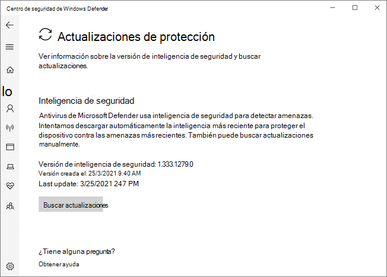

# Antivirus de Microsoft Defender en la aplicación Seguridad de WindowsMicrosoft Defender Antivirus in the Windows Security app

[!INCLUDE [Microsoft 365 Defender rebranding](../../includes/microsoft-defender.md)]

**Se aplica a:****Applies to:**

- [Microsoft Defender para punto de conexiónMicrosoft Defender for Endpoint](/microsoft-365/security/defender-endpoint/)

En Windows 10, versión 1703 y versiones posteriores, la aplicación Windows Defender forma parte de la seguridad de Windows.In Windows 10, version 1703 and later, the Windows Defender app is part of the Windows Security.

La configuración que anteriormente formaba parte del cliente de Windows Defender y la configuración principal de Windows se han combinado y movido a la nueva aplicación, que se instala de forma predeterminada como parte de Windows 10, versión 1703.Settings that were previously part of the Windows Defender client and main Windows Settings have been combined and moved to the new app, which is installed by default as part of Windows 10, version 1703.

> [!IMPORTANT]
> Deshabilitar el servicio de Windows Security Center no deshabilita el Antivirus de Microsoft Defender ni [Windows Defender Firewall](/windows/security/threat-protection/windows-firewall/windows-firewall-with-advanced-security).Disabling the Windows Security Center service does not disable Microsoft Defender Antivirus or [Windows Defender Firewall](/windows/security/threat-protection/windows-firewall/windows-firewall-with-advanced-security). Estos se deshabilitan automáticamente cuando se instala un antivirus de terceros o un producto de firewall y se mantienen actualizados.These are disabled automatically when a third-party antivirus or firewall product is installed and kept up to date.
>
> Si deshabilitas el servicio del Centro de seguridad de Windows o configuras la configuración de la directiva de grupo asociada para evitar que se inicie o ejecute, la aplicación seguridad de Windows puede mostrar información obsoleta o inexacta sobre los productos de antivirus o firewall que haya instalado en el dispositivo.If you do disable the Windows Security Center service, or configure its associated Group Policy settings to prevent it from starting or running, the Windows Security app might display stale or inaccurate information about any antivirus or firewall products you have installed on the device.
> También puede impedir que Antivirus de Microsoft Defender se habilite si tiene un antivirus de terceros antiguo o obsoleto, o si desinstala cualquier producto antivirus de terceros que haya instalado anteriormente.It might also prevent Microsoft Defender Antivirus from enabling itself if you have an old or outdated third-party antivirus, or if you uninstall any third-party antivirus products you might have previously installed.
> Esto disminuirá significativamente la protección del dispositivo y podría provocar una infección de malware.This will significantly lower the protection of your device and could lead to malware infection.

Consulta el [artículo Seguridad de Windows](/windows/threat-protection/windows-defender-security-center/windows-defender-security-center) para obtener más información sobre otras características de seguridad de Windows que se pueden supervisar en la aplicación.See the [Windows Security article](/windows/threat-protection/windows-defender-security-center/windows-defender-security-center) for more information on other Windows security features that can be monitored in the app.

La aplicación Seguridad de Windows es una interfaz de cliente en Windows 10, versión 1703 y versiones posteriores.The Windows Security app is a client interface on Windows 10, version 1703 and later. No es el portal web del Centro de seguridad de Microsoft Defender que se usa para revisar y administrar [Microsoft Defender para endpoint](/microsoft-365/security/defender-endpoint/microsoft-defender-endpoint).It is not the Microsoft Defender Security Center web portal that is used to review and manage [Microsoft Defender for Endpoint](/microsoft-365/security/defender-endpoint/microsoft-defender-endpoint).

## Revisar la configuración de protección contra virus y amenazas en la aplicación Seguridad de WindowsReview virus and threat protection settings in the Windows Security app

1. Abre la aplicación Seguridad de Windows haciendo clic en el icono de escudo de la barra de tareas o buscando en el menú inicio de **Defender**.Open the Windows Security app by clicking the shield icon in the task bar or searching the start menu for **Defender**.

2. Selecciona el **icono protección contra & virus** (o el icono de escudo de la barra de menús izquierda).Select the **Virus & threat protection** tile (or the shield icon on the left menu bar).
   
En las secciones siguientes se describe cómo realizar algunas de las tareas más comunes al revisar o interactuar con la protección contra amenazas proporcionada por Antivirus de Microsoft Defender en la aplicación seguridad de Windows.The following sections describe how to perform some of the most common tasks when reviewing or interacting with the threat protection provided by Microsoft Defender Antivirus in the Windows Security app.

> [!NOTE]
> Si estas opciones de configuración se configuran e implementan mediante la directiva de grupo, la configuración descrita en esta sección será gris y no estará disponible para su uso en puntos de conexión individuales.If these settings are configured and deployed using Group Policy, the settings described in this section will be greyed-out and unavailable for use on individual endpoints. Los cambios realizados a través de un objeto de directiva de grupo deben implementarse primero en puntos de conexión individuales antes de que la configuración se actualice en Configuración de Windows.Changes made through a Group Policy Object must first be deployed to individual endpoints before the setting will be updated in Windows Settings. En [el tema Configure end-user interaction with Microsoft Defender Antivirus](configure-end-user-interaction-microsoft-defender-antivirus.md) se describe cómo se puede configurar la configuración de invalidación de directiva local.The [Configure end-user interaction with Microsoft Defender Antivirus](configure-end-user-interaction-microsoft-defender-antivirus.md) topic describes how local policy override settings can be configured.

## Ejecutar un examen con la aplicación Seguridad de WindowsRun a scan with the Windows Security app

1. Abra la aplicación Seguridad de Windows buscando en el menú inicio **seguridad** y, a continuación, **seleccionando Seguridad de Windows**.Open the Windows Security app by searching the start menu for **Security**, and then selecting **Windows Security**.

2. Selecciona el **icono protección contra & virus** (o el icono de escudo de la barra de menús izquierda).Select the **Virus & threat protection** tile (or the shield icon on the left menu bar).

3. Seleccione **Examen rápido**.Select **Quick scan**. O bien, para ejecutar un examen completo, seleccione **Opciones de** examen y, a continuación, seleccione una opción, como **Examen completo**.Or, to run a full scan, select **Scan options**, and then select an option, such as **Full scan**.

## Revisa la versión de actualización de inteligencia de seguridad y descarga las actualizaciones más recientes en la aplicación Seguridad de WindowsReview the security intelligence update version and download the latest updates in the Windows Security app

1. Abra la aplicación Seguridad de Windows buscando en el menú inicio *seguridad* y, a continuación, **seleccionando Seguridad de Windows**.Open the Windows Security app by searching the start menu for *Security*, and then selecting **Windows Security**.

2. Selecciona el **icono protección contra & virus** (o el icono de escudo de la barra de menús izquierda).Select the **Virus & threat protection** tile (or the shield icon on the left menu bar).

3. Seleccione **Actualizaciones de protección contra & virus**.Select **Virus & threat protection updates**. La versión instalada actualmente se muestra junto con información sobre cuándo se descargó.The currently installed version is displayed along with some information about when it was downloaded. Puede comprobar la versión actual con la versión más reciente disponible para la descarga manual o revisar el registro de cambios de esa versión.You can check your current against the latest version available for manual download, or review the change log for that version. Vea [Actualizaciones de inteligencia de seguridad para Antivirus de Microsoft Defender y otros antimalware de Microsoft](https://www.microsoft.com/en-us/wdsi/defenderupdates).See [Security intelligence updates for Microsoft Defender Antivirus and other Microsoft antimalware](https://www.microsoft.com/en-us/wdsi/defenderupdates).

4. Seleccione **Buscar actualizaciones para** descargar nuevas actualizaciones de protección (si las hay).Select **Check for updates** to download new protection updates (if there are any).

## Asegurarse de que Antivirus de Microsoft Defender está habilitado en la aplicación Seguridad de WindowsEnsure Microsoft Defender Antivirus is enabled in the Windows Security app

1. Abra la aplicación Seguridad de Windows buscando en el menú inicio *seguridad* y, a continuación, **seleccionando Seguridad de Windows**.Open the Windows Security app by searching the start menu for *Security*, and then selecting **Windows Security**.

2. Selecciona el **icono protección contra & virus** (o el icono de escudo de la barra de menús izquierda).Select the **Virus & threat protection** tile (or the shield icon on the left menu bar).

3. Seleccione **Configuración de protección contra & virus**.Select **Virus & threat protection settings**.

4. Alterna el **conmutador de protección en tiempo** real a **On**.Toggle the **Real-time protection** switch to **On**.

    > [!NOTE]
    > Si desactiva la **protección en tiempo** real, se volverá a activar automáticamente después de un breve retraso.If you switch **Real-time protection** off, it will automatically turn back on after a short delay. Esto es para asegurarse de que está protegido contra malware y amenazas.This is to ensure you are protected from malware and threats.
    > Si instalas otro producto antivirus, Antivirus de Microsoft Defender se deshabilita automáticamente y se indica como tal en la aplicación seguridad de Windows.If you install another antivirus product, Microsoft Defender Antivirus automatically disables itself and is indicated as such in the Windows Security app. Aparecerá una configuración que le permitirá habilitar el [examen periódico limitado.](limited-periodic-scanning-microsoft-defender-antivirus.md)A setting will appear that will allow you to enable [limited periodic scanning](limited-periodic-scanning-microsoft-defender-antivirus.md).

## Agregar exclusiones para Antivirus de Microsoft Defender en la aplicación seguridad de WindowsAdd exclusions for Microsoft Defender Antivirus in the Windows Security app

1. Abra la aplicación Seguridad de Windows buscando en el menú inicio *seguridad* y, a continuación, **seleccionando Seguridad de Windows**.Open the Windows Security app by searching the start menu for *Security*, and then selecting **Windows Security**.

2. Selecciona el **icono protección contra & virus** (o el icono de escudo de la barra de menús izquierda).Select the **Virus & threat protection** tile (or the shield icon on the left menu bar).

3. En Administrar **configuración,** seleccione **Virus & configuración de protección contra amenazas**.Under the **Manage settings**, select **Virus & threat protection settings**.

4. En la **configuración Exclusiones,** seleccione **Agregar o quitar exclusiones**.Under the **Exclusions** setting, select **Add or remove exclusions**. 

5. Seleccione el icono más ( **+** ) para elegir el tipo y establecer las opciones para cada exclusión.Select the plus icon (**+**) to choose the type and set the options for each exclusion. 

En la tabla siguiente se resumen los tipos de exclusión y lo que sucede:The following table summarizes exclusion types and what happens:

|Tipo de exclusiónExclusion type  |Definido porDefined by  |Qué ocurreWhat happens  |
|---------|---------|---------|
|**Archivo****File** |UbicaciónLocation  Ejemplo: `c:\sample\sample.test`Example: `c:\sample\sample.test` |El antivirus de Microsoft Defender omite el archivo específico.The specific file is skipped by Microsoft Defender Antivirus. |
|**Folder****Folder**    |UbicaciónLocation  Ejemplo: `c:\test\sample`Example: `c:\test\sample`       |Antivirus de Microsoft Defender omite todos los elementos de la carpeta especificada.All items in the specified folder are skipped by Microsoft Defender Antivirus.         |
|**Tipo de archivo****File type**   |Extensión de archivoFile extension  Ejemplo: `.test`Example: `.test` |Antivirus de Microsoft Defender omite todos los archivos con la extensión en cualquier lugar `.test` del dispositivo.All files with the `.test` extension anywhere on your device are skipped by Microsoft Defender Antivirus.         |
|**Proceso****Process**     |Ruta de acceso de archivo ejecutableExecutable file path  Ejemplo: `c:\test\process.exe`Example: `c:\test\process.exe`         |El antivirus de Microsoft Defender omite el proceso específico y los archivos abiertos por ese proceso.The specific process and any files that are opened by that process are skipped by Microsoft Defender Antivirus.         |

Para obtener más información, consulte los siguientes recursos:To learn more, see the following resources:
- [Configurar y validar exclusiones en función de la extensión de archivo y la ubicación de la carpetaConfigure and validate exclusions based on file extension and folder location](./configure-extension-file-exclusions-microsoft-defender-antivirus.md) 
- [Configurar exclusiones para archivos abiertos por procesosConfigure exclusions for files opened by processes](./configure-process-opened-file-exclusions-microsoft-defender-antivirus.md)

## Revisar el historial de detección de amenazas en la Windows Defender centro de seguridadReview threat detection history in the Windows Defender Security Center app

1. Abra la aplicación Seguridad de Windows buscando en el menú inicio *seguridad* y, a continuación, **seleccionando Seguridad de Windows**.Open the Windows Security app by searching the start menu for *Security*, and then selecting **Windows Security**.

2. Selecciona el **icono protección contra & virus** (o el icono de escudo de la barra de menús izquierda).Select the **Virus & threat protection** tile (or the shield icon on the left menu bar).

3. Seleccione **Historial de protección**.Select **Protection history**. Se enumeran los elementos recientes.Any recent items are listed.

## Establecer opciones de protección y recuperación de ransomwareSet ransomware protection and recovery options

1. Abra la aplicación Seguridad de Windows buscando en el menú inicio *seguridad* y, a continuación, **seleccionando Seguridad de Windows**.Open the Windows Security app by searching the start menu for *Security*, and then selecting **Windows Security**.

2. Selecciona el **icono protección contra & virus** (o el icono de escudo de la barra de menús izquierda).Select the **Virus & threat protection** tile (or the shield icon on the left menu bar).

3. En **Protección contra ransomware,** seleccione **Administrar protección contra ransomware**.Under **Ransomware protection**, select **Manage ransomware protection**.

4. Para cambiar **la configuración de acceso controlado a** carpetas, vea Proteger [carpetas importantes con acceso controlado a carpetas.](/microsoft-365/security/defender-endpoint/controlled-folders)To change **Controlled folder access** settings, see [Protect important folders with Controlled folder access](/microsoft-365/security/defender-endpoint/controlled-folders).

5. Para configurar las opciones  de recuperación de ransomware, selecciona Configurar en Recuperación de datos ransomware y sigue las instrucciones para vincular o configurar tu cuenta de OneDrive para que puedas recuperarte fácilmente de un ataque de ransomware. To set up ransomware recovery options, select **Set up** under **Ransomware data recovery** and follow the instructions for linking or setting up your OneDrive account so you can easily recover from a ransomware attack.

## Vea tambiénSee also
- [Microsoft Defender AntivirusMicrosoft Defender Antivirus](microsoft-defender-antivirus-in-windows-10.md)