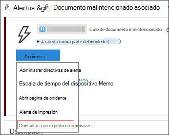
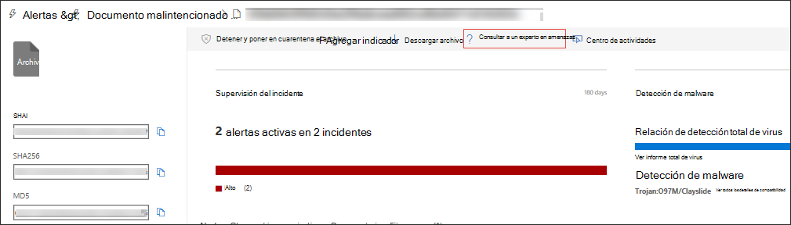

# Expertos en amenazas de MicrosoftMicrosoft Threat Experts

[!INCLUDE [Microsoft 365 Defender rebranding](../../includes/microsoft-defender.md)]

**Se aplica a:****Applies to:**
- [Microsoft Defender para punto de conexiónMicrosoft Defender for Endpoint](https://go.microsoft.com/fwlink/p/?linkid=2154037)
- [Microsoft 365 DefenderMicrosoft 365 Defender](https://go.microsoft.com/fwlink/?linkid=2118804)

> ¿Desea experimentar Microsoft Defender para endpoint?Want to experience Microsoft Defender for Endpoint? [Regístrate para obtener una versión de prueba gratuita.Sign up for a free trial.](https://www.microsoft.com/microsoft-365/windows/microsoft-defender-atp?ocid=docs-wdatp-exposedapis-abovefoldlink)

Microsoft Threat Experts es un servicio de búsqueda de amenazas administrado que proporciona a los Centros de operaciones de seguridad (SOC) supervisión y análisis de nivel de expertos para ayudarles a garantizar que las amenazas críticas en sus entornos únicos no se pierden.Microsoft Threat Experts is a managed threat hunting service that provides your Security Operation Centers (SOCs) with expert level monitoring and analysis to help them ensure that critical threats in your unique environments don’t get missed.
  
Este servicio de búsqueda de amenazas administradas proporciona información y datos controlados por expertos a través de estas dos capacidades: notificación de ataques dirigidos y acceso a expertos a petición.This managed threat hunting service provides expert-driven insights and data through these two capabilities: targeted attack notification and access to experts on demand.

## Antes de empezarBefore you begin 
> [!NOTE]
> Analice los requisitos de elegibilidad con su proveedor de servicios técnicos de Microsoft y el equipo de cuenta antes de aplicar al servicio de búsqueda de amenazas administradas.Discuss the eligibility requirements with your Microsoft Technical Service provider and account team before you apply to the managed threat hunting service.

Si es cliente de Microsoft Defender para endpoints, debe solicitar microsoft **threat experts - Targeted Attack Notifications** para obtener información y análisis especiales que ayuden a identificar las amenazas más críticas de su entorno para que pueda responder a ellas rápidamenteIf you're a Microsoft Defender for Endpoint customer, you need to apply for **Microsoft Threat Experts - Targeted Attack Notifications** to get special insights and analysis that help identify the most critical threats in your environment so you can respond to them quickly

Para inscribirse en Microsoft Threat Experts- Targeted Attack Notifications benefits, ve a **Configuración**  >  **General**  >  **Advanced features** Microsoft Threat Experts -  >  **Targeted Attack Notifications** to apply.To enroll to Microsoft Threat Experts - Targeted Attack Notifications benefits, go to **Settings** > **General** > **Advanced features** > **Microsoft Threat Experts - Targeted Attack Notifications** to apply. Una vez aceptado, recibirás las ventajas de las notificaciones de ataque dirigido.Once accepted, you will get the benefits of Targeted Attack Notifications.

Póngase en contacto con su equipo de cuenta o representante de Microsoft para suscribirse a Expertos en amenazas de **Microsoft:** expertos a petición para consultar con nuestros expertos en amenazas sobre las detecciones y los conflictos relevantes a los que se enfrenta su organización.Contact your account team or Microsoft representative to subscribe to **Microsoft Threat Experts - Experts on Demand** to consult with our threat experts on relevant detections and adversaries that your organization is facing.

Consulte [Configurar las capacidades de Microsoft Threat Experts](https://docs.microsoft.com/microsoft-365/security/defender-endpoint/configure-microsoft-threat-experts#before-you-begin) para obtener más información.See [Configure Microsoft Threat Experts capabilities](https://docs.microsoft.com/microsoft-365/security/defender-endpoint/configure-microsoft-threat-experts#before-you-begin) for details. 

## Expertos en amenazas de Microsoft: notificación de ataque dirigidoMicrosoft Threat Experts - Targeted attack notification 
Expertos en amenazas de Microsoft: la notificación de ataques dirigidos proporciona una búsqueda proactiva de las amenazas más importantes para la red, incluidas las intrusiones de adversarios humanos, los ataques con teclado o ataques avanzados como el ciberespionaje.Microsoft Threat Experts - Targeted attack notification provides proactive hunting for the most important threats to your network, including human adversary intrusions, hands-on-keyboard attacks, or advanced attacks like cyber-espionage. Estas notificaciones se muestran como una nueva alerta.These notifications shows up as a new alert. El servicio de búsqueda administrada incluye:The managed hunting service includes:  
- Supervisión y análisis de amenazas, lo que reduce el tiempo de permanencia y el riesgo para la empresaThreat monitoring and analysis, reducing dwell time and risk to the business 
- Inteligencia artificial entrenada por el cazador para descubrir y priorizar ataques conocidos y desconocidosHunter-trained artificial intelligence to discover and prioritize both known and unknown attacks  
- Identificar los riesgos más importantes, ayudar a los SOC a maximizar el tiempo y la energíaIdentifying the most important risks, helping SOCs maximize time and energy 
- Ámbito de compromiso y tanto contexto como se pueda entregar rápidamente para habilitar una respuesta rápida de SOC.Scope of compromise and as much context as can be quickly delivered to enable fast SOC response. 
 
## Expertos en amenazas de Microsoft: expertos a peticiónMicrosoft Threat Experts - Experts on Demand
Los clientes pueden contratar a nuestros expertos en seguridad directamente desde el Centro de seguridad de Microsoft Defender para obtener una respuesta rápida y precisa.Customers can engage our security experts directly from within Microsoft Defender Security Center for timely and accurate response. Los expertos proporcionan información necesaria para comprender mejor las amenazas complejas que afectan a su organización, desde las consultas de alertas, los dispositivos potencialmente en peligro, la causa raíz de una conexión de red sospechosa, hasta la inteligencia de amenazas adicional con respecto a las campañas de amenazas persistentes avanzadas en curso.Experts provide insights needed to better understand the complex threats affecting your organization, from alert inquiries, potentially compromised devices, root cause of a suspicious network connection, to additional threat intelligence regarding ongoing advanced persistent threat campaigns. Con esta funcionalidad, puede:With this capability, you can:
- Obtener aclaraciones adicionales sobre alertas, incluida la causa raíz o el ámbito del incidenteGet additional clarification on alerts including root cause or scope of the incident 
- Obtenga claridad sobre el comportamiento sospechoso del dispositivo y los siguientes pasos si se enfrenta a un atacante avanzadoGain clarity into suspicious device behavior and next steps if faced with an advanced attacker  
- Determinar el riesgo y la protección con respecto a actores de amenazas, campañas o técnicas de atacante emergenteDetermine risk and protection regarding threat actors, campaigns, or emerging attacker techniques 

La opción consultar **a un experto en** amenazas está disponible en varios lugares del portal para que pueda interactuar con expertos en el contexto de la investigación:The option to **Consult a threat expert** is available in several places in the portal so you can engage with experts in the context of your investigation:

- <i>**Menú ayuda y soporte técnico**</i><i>**Help and support menu**</i> 

- <i>**Menú acciones de página de dispositivo**</i><i>**Device page actions menu**</i> 

- <i>**Menú acciones de página alertas**</i><i>**Alerts page actions menu**</i> 

- <i>**Menú Acciones de página de archivos**</i><i>**File page actions menu**</i> 

> [!NOTE]
> Si desea realizar un seguimiento del estado de los casos de expertos a petición a través del Centro de servicios de Microsoft, comunicarse con el Administrador técnico de cuentas.If you would like to track the status of your Experts on Demand cases through Microsoft Services Hub, reach out to your Technical Account Manager. 

Vea este vídeo para obtener una introducción rápida al Centro de servicios de Microsoft.Watch this video for a quick overview of the Microsoft Services Hub.

>[!VIDEO https://www.microsoft.com/videoplayer/embed/RE4pk9f] 

   
## Tema relacionadoRelated topic
- [Configurar las capacidades de Microsoft Threat ExpertsConfigure Microsoft Threat Experts capabilities](configure-microsoft-threat-experts.md)
