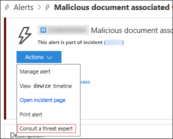

# Expertos en amenazas de Microsoft

[!INCLUDE [Microsoft 365 Defender rebranding](../../includes/microsoft-defender.md)]

**Se aplica a:**
- [Microsoft Defender para punto de conexión](https://go.microsoft.com/fwlink/p/?linkid=2154037)
- [Microsoft 365 Defender](https://go.microsoft.com/fwlink/?linkid=2118804)

> ¿Desea experimentar Microsoft Defender para endpoint? [Regístrate para obtener una versión de prueba gratuita.](https://www.microsoft.com/microsoft-365/windows/microsoft-defender-atp?ocid=docs-wdatp-exposedapis-abovefoldlink)

Expertos en amenazas de Microsoft es un servicio de búsqueda de amenazas administrado que proporciona a los Centros de operaciones de seguridad (SOC) supervisión y análisis de nivel experto para ayudarles a garantizar que las amenazas críticas en sus entornos únicos no se pierden.
  
Este servicio de búsqueda de amenazas administradas proporciona información y datos controlados por expertos a través de estas dos capacidades: notificación de ataques dirigidos y acceso a expertos a petición.

## Antes de empezar 
> [!NOTE]
> Analice los requisitos de elegibilidad con su proveedor de servicios técnicos de Microsoft y el equipo de cuenta antes de aplicar al servicio de búsqueda de amenazas administradas.

Si eres cliente de Microsoft Defender para endpoints, debes solicitar Expertos en amenazas de Microsoft: Notificaciones de ataque **dirigidas** para obtener información y análisis especiales que ayuden a identificar las amenazas más críticas del entorno para que puedas responder a ellas rápidamente.

Para inscribirse en Expertos en amenazas de Microsoft: ventajas de notificaciones de ataque dirigidas, vaya **a Configuración**  >  **Endpoints**  >  **General**  >  **Advanced features**  >  **Expertos en amenazas de Microsoft- Targeted Attack Notifications** to apply. Una vez aceptado, recibirás las ventajas de las notificaciones de ataque dirigido.

Póngase en contacto con su equipo de cuenta o representante de Microsoft para suscribirse **a Expertos en amenazas de Microsoft:** expertos a petición para consultar con nuestros expertos en amenazas sobre las detecciones y los conflictos relevantes a los que se enfrenta su organización.

Consulte [Configure Expertos en amenazas de Microsoft capabilities](/microsoft-365/security/defender-endpoint/configure-microsoft-threat-experts#before-you-begin) para obtener más información. 

## Expertos en amenazas de Microsoft: notificación de ataque dirigido 
Expertos en amenazas de Microsoft: la notificación de ataques dirigidos proporciona una búsqueda proactiva de las amenazas más importantes para la red, incluidas las intrusiones de adversarios humanos, los ataques con teclado o ataques avanzados como el ciberespionaje. Estas notificaciones se muestran como una nueva alerta. El servicio de búsqueda administrada incluye:  
- Supervisión y análisis de amenazas, lo que reduce el tiempo de permanencia y el riesgo para la empresa 
- Inteligencia artificial entrenada por el cazador para descubrir y priorizar ataques conocidos y desconocidos  
- Identificar los riesgos más importantes, ayudar a los SOC a maximizar el tiempo y la energía 
- Ámbito de compromiso y tanto contexto como se pueda entregar rápidamente para habilitar una respuesta rápida de SOC. 
 
## Expertos en amenazas de Microsoft: expertos a petición
Los clientes pueden contratar a nuestros expertos en seguridad directamente Centro de seguridad de Microsoft Defender para obtener una respuesta rápida y precisa. Los expertos proporcionan información necesaria para comprender mejor las amenazas complejas que afectan a su organización, desde las consultas de alertas, los dispositivos potencialmente en peligro, la causa raíz de una conexión de red sospechosa, hasta la inteligencia de amenazas adicional con respecto a las campañas de amenazas persistentes avanzadas en curso. Con esta funcionalidad, puede:
- Obtener aclaraciones adicionales sobre alertas, incluida la causa raíz o el ámbito del incidente 
- Obtenga claridad sobre el comportamiento sospechoso del dispositivo y los siguientes pasos si se enfrenta a un atacante avanzado  
- Determinar el riesgo y la protección con respecto a actores de amenazas, campañas o técnicas de atacante emergente 

La opción consultar **a un experto en** amenazas está disponible en varios lugares del portal para que pueda interactuar con expertos en el contexto de la investigación:

- <i>**Menú ayuda y soporte técnico**</i> 

- <i>**Menú acciones de página de dispositivo**</i> 

- <i>**Menú acciones de página alertas**</i> 

- <i>**Menú Acciones de página de archivos**</i> 

> [!NOTE]
> Si desea realizar un seguimiento del estado de los casos de expertos a petición a través del Centro de servicios de Microsoft, comunicarse con el Administrador técnico de cuentas. 

Vea este vídeo para obtener una introducción rápida al Centro de servicios de Microsoft.

>[!VIDEO https://www.microsoft.com/videoplayer/embed/RE4pk9f] 

   
## Tema relacionado
- [Configurar Expertos en amenazas de Microsoft funcionalidades](configure-microsoft-threat-experts.md)
