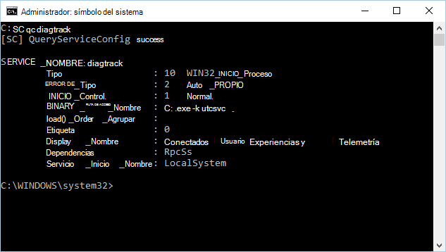

# <a name="minimum-requirements-for-microsoft-defender-for-endpoint"></a><span data-ttu-id="fac9a-104">Requisitos mínimos para Microsoft Defender para endpoint</span><span class="sxs-lookup"><span data-stu-id="fac9a-104">Minimum requirements for Microsoft Defender for Endpoint</span></span>

[!INCLUDE [Microsoft 365 Defender rebranding](../../includes/microsoft-defender.md)]

<span data-ttu-id="fac9a-105">**Se aplica a:**</span><span class="sxs-lookup"><span data-stu-id="fac9a-105">**Applies to:**</span></span>

- [<span data-ttu-id="fac9a-106">Microsoft Defender para punto de conexión</span><span class="sxs-lookup"><span data-stu-id="fac9a-106">Microsoft Defender for Endpoint</span></span>](https://go.microsoft.com/fwlink/p/?linkid=2154037)
- [<span data-ttu-id="fac9a-107">Microsoft 365 Defender</span><span class="sxs-lookup"><span data-stu-id="fac9a-107">Microsoft 365 Defender</span></span>](https://go.microsoft.com/fwlink/?linkid=2118804)

> <span data-ttu-id="fac9a-108">¿Desea experimentar Microsoft Defender para endpoint?</span><span class="sxs-lookup"><span data-stu-id="fac9a-108">Want to experience Microsoft Defender for Endpoint?</span></span> [<span data-ttu-id="fac9a-109">Regístrate para obtener una versión de prueba gratuita.</span><span class="sxs-lookup"><span data-stu-id="fac9a-109">Sign up for a free trial.</span></span>](https://www.microsoft.com/microsoft-365/windows/microsoft-defender-atp?ocid=docs-wdatp-minreqs-abovefoldlink)


<span data-ttu-id="fac9a-110">Existen algunos requisitos mínimos para incorporar dispositivos al servicio.</span><span class="sxs-lookup"><span data-stu-id="fac9a-110">There are some minimum requirements for onboarding devices to the service.</span></span> <span data-ttu-id="fac9a-111">Obtenga información sobre los requisitos de licencias, hardware y software y otras opciones de configuración para incorporar dispositivos al servicio.</span><span class="sxs-lookup"><span data-stu-id="fac9a-111">Learn about the licensing, hardware and software requirements, and other configuration settings to onboard devices to the service.</span></span>

> [!TIP]
> - <span data-ttu-id="fac9a-112">Obtenga información sobre las últimas mejoras de Defender for Endpoint: [Defender for Endpoint Tech Community](https://techcommunity.microsoft.com/t5/Windows-Defender-Advanced-Threat/ct-p/WindowsDefenderAdvanced).</span><span class="sxs-lookup"><span data-stu-id="fac9a-112">Learn about the latest enhancements in Defender for Endpoint: [Defender for Endpoint Tech Community](https://techcommunity.microsoft.com/t5/Windows-Defender-Advanced-Threat/ct-p/WindowsDefenderAdvanced).</span></span>
> - <span data-ttu-id="fac9a-113">Defender for Endpoint demostró las capacidades de detección y óptica líderes del sector en la reciente evaluación de MITRE.</span><span class="sxs-lookup"><span data-stu-id="fac9a-113">Defender for Endpoint demonstrated industry-leading optics and detection capabilities in the recent MITRE evaluation.</span></span> <span data-ttu-id="fac9a-114">Read: [Insights from the MITRE ATT&CK-based evaluation](https://cloudblogs.microsoft.com/microsoftsecure/2018/12/03/insights-from-the-mitre-attack-based-evaluation-of-windows-defender-atp/).</span><span class="sxs-lookup"><span data-stu-id="fac9a-114">Read: [Insights from the MITRE ATT&CK-based evaluation](https://cloudblogs.microsoft.com/microsoftsecure/2018/12/03/insights-from-the-mitre-attack-based-evaluation-of-windows-defender-atp/).</span></span>

## <a name="licensing-requirements"></a><span data-ttu-id="fac9a-115">Requisitos de licencias</span><span class="sxs-lookup"><span data-stu-id="fac9a-115">Licensing requirements</span></span>

<span data-ttu-id="fac9a-116">Microsoft Defender para endpoint requiere una de las siguientes ofertas de licencias por volumen de Microsoft:</span><span class="sxs-lookup"><span data-stu-id="fac9a-116">Microsoft Defender for Endpoint requires one of the following Microsoft volume licensing offers:</span></span>

- <span data-ttu-id="fac9a-117">Windows 10 Enterprise E5</span><span class="sxs-lookup"><span data-stu-id="fac9a-117">Windows 10 Enterprise E5</span></span>
- <span data-ttu-id="fac9a-118">Windows 10 Education A5</span><span class="sxs-lookup"><span data-stu-id="fac9a-118">Windows 10 Education A5</span></span>
- <span data-ttu-id="fac9a-119">Microsoft 365 E5 (M365 E5), que incluye Windows 10 Enterprise E5</span><span class="sxs-lookup"><span data-stu-id="fac9a-119">Microsoft 365 E5 (M365 E5) which includes Windows 10 Enterprise E5</span></span>
- <span data-ttu-id="fac9a-120">Microsoft 365 A5 (M365 A5)</span><span class="sxs-lookup"><span data-stu-id="fac9a-120">Microsoft 365 A5 (M365 A5)</span></span>
- <span data-ttu-id="fac9a-121">Seguridad de Microsoft 365 E5</span><span class="sxs-lookup"><span data-stu-id="fac9a-121">Microsoft 365 E5 Security</span></span>
- <span data-ttu-id="fac9a-122">Microsoft 365 A5 Security</span><span class="sxs-lookup"><span data-stu-id="fac9a-122">Microsoft 365 A5 Security</span></span>
- <span data-ttu-id="fac9a-123">Microsoft Defender para punto de conexión</span><span class="sxs-lookup"><span data-stu-id="fac9a-123">Microsoft Defender for Endpoint</span></span>

> [!NOTE]
> <span data-ttu-id="fac9a-124">Los usuarios con licencia elegibles pueden usar Microsoft Defender para Endpoint en hasta cinco dispositivos simultáneos.</span><span class="sxs-lookup"><span data-stu-id="fac9a-124">Eligible licensed users may use Microsoft Defender for Endpoint on up to five concurrent devices.</span></span>
> <span data-ttu-id="fac9a-125">Microsoft Defender para endpoint también está disponible para la compra desde un Proveedor de soluciones en la nube (CSP).</span><span class="sxs-lookup"><span data-stu-id="fac9a-125">Microsoft Defender for Endpoint is also available for purchase from a Cloud Solution Provider (CSP).</span></span>
> <span data-ttu-id="fac9a-126">Las máquinas virtuales RDSH no requieren una licencia de Defender for Endpoint independiente.</span><span class="sxs-lookup"><span data-stu-id="fac9a-126">RDSH VMs do not require a separate Defender for Endpoint license.</span></span>

<span data-ttu-id="fac9a-127">Microsoft Defender para endpoint para servidores requiere una de las siguientes opciones de licencia:</span><span class="sxs-lookup"><span data-stu-id="fac9a-127">Microsoft Defender for Endpoint for servers requires one of the following licensing options:</span></span>

- [<span data-ttu-id="fac9a-128">Centro de seguridad de Azure con Azure Defender habilitado</span><span class="sxs-lookup"><span data-stu-id="fac9a-128">Azure Security Center with Azure Defender enabled</span></span>](https://docs.microsoft.com/azure/security-center/security-center-pricing)
- <span data-ttu-id="fac9a-129">Microsoft Defender para endpoint for Server (uno por servidor cubierto)</span><span class="sxs-lookup"><span data-stu-id="fac9a-129">Microsoft Defender for Endpoint for Server (one per covered server)</span></span>

> [!NOTE]
> <span data-ttu-id="fac9a-130">Los clientes pueden adquirir licencias de servidor (una por servidor cubierto Entorno de sistema operativo (OSE)) para Microsoft Defender para Endpoint for Servers si tienen un mínimo combinado de 50 licencias para una o más de las siguientes licencias de usuario:</span><span class="sxs-lookup"><span data-stu-id="fac9a-130">Customers may acquire server licenses (one per covered server Operating System Environment (OSE)) for Microsoft Defender for Endpoint for Servers if they have a combined minimum of 50 licenses for one or more of the following user licenses:</span></span>
>
> * <span data-ttu-id="fac9a-131">Microsoft Defender para punto de conexión</span><span class="sxs-lookup"><span data-stu-id="fac9a-131">Microsoft Defender for Endpoint</span></span>
> * <span data-ttu-id="fac9a-132">Windows E5/A5</span><span class="sxs-lookup"><span data-stu-id="fac9a-132">Windows E5/A5</span></span>
> * <span data-ttu-id="fac9a-133">Microsoft 365 E5/A5</span><span class="sxs-lookup"><span data-stu-id="fac9a-133">Microsoft 365 E5/A5</span></span>
> * <span data-ttu-id="fac9a-134">Microsoft 365 E5/A5 Security</span><span class="sxs-lookup"><span data-stu-id="fac9a-134">Microsoft 365 E5/A5 Security</span></span>

<span data-ttu-id="fac9a-135">Para obtener información detallada sobre las licencias, consulta el sitio [términos](https://www.microsoft.com/licensing/terms/) del producto y trabaja con el equipo de tu cuenta para obtener más información sobre los términos y condiciones.</span><span class="sxs-lookup"><span data-stu-id="fac9a-135">For detailed licensing information, see the [Product Terms site](https://www.microsoft.com/licensing/terms/) and work with your account team to learn more about the terms and conditions.</span></span>

<span data-ttu-id="fac9a-136">Para obtener más información sobre la matriz de características de Windows 10 ediciones, vea [Comparar Windows 10 ediciones](https://www.microsoft.com/windowsforbusiness/compare).</span><span class="sxs-lookup"><span data-stu-id="fac9a-136">For more information on the array of features in Windows 10 editions, see [Compare Windows 10 editions](https://www.microsoft.com/windowsforbusiness/compare).</span></span>

<span data-ttu-id="fac9a-137">Para obtener una tabla de comparación detallada de Windows 10 de edición comercial, vea [el PDF de comparación.](https://wfbdevicemanagementprod.blob.core.windows.net/windowsforbusiness/Windows10_CommercialEdition_Comparison.pdf)</span><span class="sxs-lookup"><span data-stu-id="fac9a-137">For a detailed comparison table of Windows 10 commercial edition comparison, see the [comparison PDF](https://wfbdevicemanagementprod.blob.core.windows.net/windowsforbusiness/Windows10_CommercialEdition_Comparison.pdf).</span></span>

## <a name="browser-requirements"></a><span data-ttu-id="fac9a-138">Requisitos de los exploradores</span><span class="sxs-lookup"><span data-stu-id="fac9a-138">Browser requirements</span></span>

<span data-ttu-id="fac9a-139">El acceso a Defender for Endpoint se realiza a través de un explorador, que admite los siguientes exploradores:</span><span class="sxs-lookup"><span data-stu-id="fac9a-139">Access to Defender for Endpoint is done through a browser, supporting the following browsers:</span></span>

- <span data-ttu-id="fac9a-140">Microsoft Edge</span><span class="sxs-lookup"><span data-stu-id="fac9a-140">Microsoft Edge</span></span>
- <span data-ttu-id="fac9a-141">Google Chrome</span><span class="sxs-lookup"><span data-stu-id="fac9a-141">Google Chrome</span></span>

> [!NOTE]
> <span data-ttu-id="fac9a-142">Aunque otros exploradores pueden funcionar, los exploradores mencionados son los que se admiten.</span><span class="sxs-lookup"><span data-stu-id="fac9a-142">While other browsers might work, the mentioned browsers are the ones supported.</span></span>


## <a name="hardware-and-software-requirements"></a><span data-ttu-id="fac9a-143">Requisitos de hardware y software</span><span class="sxs-lookup"><span data-stu-id="fac9a-143">Hardware and software requirements</span></span>

### <a name="supported-windows-versions"></a><span data-ttu-id="fac9a-144">Versiones Windows compatibles</span><span class="sxs-lookup"><span data-stu-id="fac9a-144">Supported Windows versions</span></span>

- <span data-ttu-id="fac9a-145">Windows 7 SP1 Enterprise ([Requiere ESU para admitir](/troubleshoot/windows-client/windows-7-eos-faq/windows-7-extended-security-updates-faq).)</span><span class="sxs-lookup"><span data-stu-id="fac9a-145">Windows 7 SP1 Enterprise ([Requires ESU for support](/troubleshoot/windows-client/windows-7-eos-faq/windows-7-extended-security-updates-faq).)</span></span>
- <span data-ttu-id="fac9a-146">Windows 7 SP1 Pro ([Requiere ESU para admitir](/troubleshoot/windows-client/windows-7-eos-faq/windows-7-extended-security-updates-faq).)</span><span class="sxs-lookup"><span data-stu-id="fac9a-146">Windows 7 SP1 Pro ([Requires ESU for support](/troubleshoot/windows-client/windows-7-eos-faq/windows-7-extended-security-updates-faq).)</span></span>
- <span data-ttu-id="fac9a-147">Windows 8.1 Enterprise</span><span class="sxs-lookup"><span data-stu-id="fac9a-147">Windows 8.1 Enterprise</span></span>
- <span data-ttu-id="fac9a-148">Windows 8.1 Pro</span><span class="sxs-lookup"><span data-stu-id="fac9a-148">Windows 8.1 Pro</span></span>
- <span data-ttu-id="fac9a-149">Windows 10 Enterprise</span><span class="sxs-lookup"><span data-stu-id="fac9a-149">Windows 10 Enterprise</span></span>
- [<span data-ttu-id="fac9a-150">Windows 10 Enterprise LTSC 2016 (o posterior)</span><span class="sxs-lookup"><span data-stu-id="fac9a-150">Windows 10 Enterprise LTSC 2016 (or later)</span></span>](/windows/whats-new/ltsc/)
- <span data-ttu-id="fac9a-151">Windows 10 Education</span><span class="sxs-lookup"><span data-stu-id="fac9a-151">Windows 10 Education</span></span>
- <span data-ttu-id="fac9a-152">Windows 10 Pro</span><span class="sxs-lookup"><span data-stu-id="fac9a-152">Windows 10 Pro</span></span>
- <span data-ttu-id="fac9a-153">Windows 10 Pro Education</span><span class="sxs-lookup"><span data-stu-id="fac9a-153">Windows 10 Pro Education</span></span>
- <span data-ttu-id="fac9a-154">Windows servidor</span><span class="sxs-lookup"><span data-stu-id="fac9a-154">Windows server</span></span>
  - <span data-ttu-id="fac9a-155">Windows Server 2008 R2 SP1</span><span class="sxs-lookup"><span data-stu-id="fac9a-155">Windows Server 2008 R2 SP1</span></span>
  - <span data-ttu-id="fac9a-156">Windows Server 2012 R2</span><span class="sxs-lookup"><span data-stu-id="fac9a-156">Windows Server 2012 R2</span></span>
  - <span data-ttu-id="fac9a-157">Windows Server 2016</span><span class="sxs-lookup"><span data-stu-id="fac9a-157">Windows Server 2016</span></span>
  - <span data-ttu-id="fac9a-158">Windows Servidor, versión 1803 o posterior</span><span class="sxs-lookup"><span data-stu-id="fac9a-158">Windows Server, version 1803 or later</span></span>
  - <span data-ttu-id="fac9a-159">Windows Server 2019</span><span class="sxs-lookup"><span data-stu-id="fac9a-159">Windows Server 2019</span></span>
- <span data-ttu-id="fac9a-160">Windows Virtual Desktop</span><span class="sxs-lookup"><span data-stu-id="fac9a-160">Windows Virtual Desktop</span></span>

<span data-ttu-id="fac9a-161">Los dispositivos de la red deben ejecutar una de estas ediciones.</span><span class="sxs-lookup"><span data-stu-id="fac9a-161">Devices on your network must be running one of these editions.</span></span>

<span data-ttu-id="fac9a-162">Los requisitos de hardware de Defender para Endpoint en dispositivos son los mismos para las ediciones admitidas.</span><span class="sxs-lookup"><span data-stu-id="fac9a-162">The hardware requirements for Defender for Endpoint on devices are the same for the supported editions.</span></span>

> [!NOTE]
> <span data-ttu-id="fac9a-163">Las máquinas que ejecutan versiones móviles de Windows (como Windows CE y Windows 10 Mobile) no son compatibles.</span><span class="sxs-lookup"><span data-stu-id="fac9a-163">Machines running mobile versions of Windows (such as Windows CE and Windows 10 Mobile) aren't supported.</span></span>
>
> <span data-ttu-id="fac9a-164">Las máquinas virtuales que Windows 10 Enterprise 2016 LTSB pueden encontrar problemas de rendimiento si se ejecutan en plataformas de virtualización que no son de Microsoft.</span><span class="sxs-lookup"><span data-stu-id="fac9a-164">Virtual Machines running Windows 10 Enterprise 2016 LTSB may encounter performance issues if run on non-Microsoft virtualization platforms.</span></span>
>
> <span data-ttu-id="fac9a-165">Para entornos virtuales, se recomienda usar Windows 10 Enterprise LTSC 2019 o posterior.</span><span class="sxs-lookup"><span data-stu-id="fac9a-165">For virtual environments, we recommend using Windows 10 Enterprise LTSC 2019 or later.</span></span>


### <a name="other-supported-operating-systems"></a><span data-ttu-id="fac9a-166">Otros sistemas operativos compatibles</span><span class="sxs-lookup"><span data-stu-id="fac9a-166">Other supported operating systems</span></span>

- [<span data-ttu-id="fac9a-167">Android</span><span class="sxs-lookup"><span data-stu-id="fac9a-167">Android</span></span>](microsoft-defender-endpoint-android.md)
- [<span data-ttu-id="fac9a-168">iOS</span><span class="sxs-lookup"><span data-stu-id="fac9a-168">iOS</span></span>](microsoft-defender-endpoint-ios.md)
- [<span data-ttu-id="fac9a-169">Linux</span><span class="sxs-lookup"><span data-stu-id="fac9a-169">Linux</span></span>](microsoft-defender-endpoint-linux.md)
- [<span data-ttu-id="fac9a-170">macOS</span><span class="sxs-lookup"><span data-stu-id="fac9a-170">macOS</span></span>](microsoft-defender-endpoint-mac.md)

> [!NOTE]
> <span data-ttu-id="fac9a-171">Tendrás que confirmar que las distribuciones de Linux y las versiones de Android, iOS y macOS son compatibles con Defender for Endpoint para que la integración funcione.</span><span class="sxs-lookup"><span data-stu-id="fac9a-171">You'll need to confirm the Linux distributions and versions of Android, iOS, and macOS are compatible with Defender for Endpoint for the integration to work.</span></span>


### <a name="network-and-data-storage-and-configuration-requirements"></a><span data-ttu-id="fac9a-172">Requisitos de configuración y almacenamiento de datos y red</span><span class="sxs-lookup"><span data-stu-id="fac9a-172">Network and data storage and configuration requirements</span></span>

<span data-ttu-id="fac9a-173">Al ejecutar el asistente de incorporación por primera vez, debe elegir dónde se almacena la información relacionada con El punto de conexión de Microsoft Defender: en la Unión Europea, el Reino Unido o el centro de datos de Estados Unidos.</span><span class="sxs-lookup"><span data-stu-id="fac9a-173">When you run the onboarding wizard for the first time, you must choose where your Microsoft Defender for Endpoint-related information is stored: in the European Union, the United Kingdom, or the United States datacenter.</span></span>

> [!NOTE]
> - <span data-ttu-id="fac9a-174">No puede cambiar la ubicación de almacenamiento de datos después de la configuración por primera vez.</span><span class="sxs-lookup"><span data-stu-id="fac9a-174">You cannot change your data storage location after the first-time setup.</span></span>
> - <span data-ttu-id="fac9a-175">Revisa [Microsoft Defender para el almacenamiento y](data-storage-privacy.md) privacidad de datos de punto de conexión para obtener más información sobre dónde y cómo almacena Microsoft los datos.</span><span class="sxs-lookup"><span data-stu-id="fac9a-175">Review the [Microsoft Defender for Endpoint data storage and privacy](data-storage-privacy.md) for more information on where and how Microsoft stores your data.</span></span>


### <a name="diagnostic-data-settings"></a><span data-ttu-id="fac9a-176">Configuración de datos de diagnóstico</span><span class="sxs-lookup"><span data-stu-id="fac9a-176">Diagnostic data settings</span></span>

> [!NOTE]
> <span data-ttu-id="fac9a-177">Microsoft Defender para endpoint no requiere ningún nivel de diagnóstico específico mientras esté habilitado.</span><span class="sxs-lookup"><span data-stu-id="fac9a-177">Microsoft Defender for Endpoint doesn't require any specific diagnostic level as long as it's enabled.</span></span>

<span data-ttu-id="fac9a-178">Asegúrese de que el servicio de datos de diagnóstico está habilitado en todos los dispositivos de la organización.</span><span class="sxs-lookup"><span data-stu-id="fac9a-178">Make sure that the diagnostic data service is enabled on all the devices in your organization.</span></span>
<span data-ttu-id="fac9a-179">De forma predeterminada, este servicio está habilitado.</span><span class="sxs-lookup"><span data-stu-id="fac9a-179">By default, this service is enabled.</span></span> <span data-ttu-id="fac9a-180">Es una buena práctica comprobar para asegurarse de que los datos del sensor se obtienen de ellos.</span><span class="sxs-lookup"><span data-stu-id="fac9a-180">It's good practice to check to ensure that you'll get sensor data from them.</span></span>

<span data-ttu-id="fac9a-181">**Use la línea de comandos para comprobar el tipo Windows 10 inicio del** servicio de datos de diagnóstico:</span><span class="sxs-lookup"><span data-stu-id="fac9a-181">**Use the command line to check the Windows 10 diagnostic data service startup type**:</span></span>

1. <span data-ttu-id="fac9a-182">Abra un símbolo del sistema con privilegios elevados en el dispositivo:</span><span class="sxs-lookup"><span data-stu-id="fac9a-182">Open an elevated command-line prompt on the device:</span></span>

   1.  <span data-ttu-id="fac9a-183">Vaya a **Inicio** y escriba **cmd**.</span><span class="sxs-lookup"><span data-stu-id="fac9a-183">Go to **Start** and type **cmd**.</span></span>

   1.  <span data-ttu-id="fac9a-184">Haga clic derecho en **Símbolo del sistema** y seleccione **Ejecutar como administrador**.</span><span class="sxs-lookup"><span data-stu-id="fac9a-184">Right-click **Command prompt** and select **Run as administrator**.</span></span>

2. <span data-ttu-id="fac9a-185">Escriba el siguiente comando y presione **Entrar**:</span><span class="sxs-lookup"><span data-stu-id="fac9a-185">Enter the following command, and press **Enter**:</span></span>

   ```console
   sc qc diagtrack
   ```

   <span data-ttu-id="fac9a-186">Si el servicio está habilitado, el resultado debería ser parecido a la siguiente captura de pantalla:</span><span class="sxs-lookup"><span data-stu-id="fac9a-186">If the service is enabled, then the result should look like the following screenshot:</span></span>

   


<span data-ttu-id="fac9a-188">Deberá establecer el servicio para que se  inicie automáticamente si el START_TYPE no está establecido en **AUTO_START**.</span><span class="sxs-lookup"><span data-stu-id="fac9a-188">You'll need to set the service to automatically start if the **START_TYPE** isn't set to **AUTO_START**.</span></span>


<span data-ttu-id="fac9a-189">**Use la línea de comandos para establecer el Windows 10 de datos de diagnóstico para que se inicie automáticamente:**</span><span class="sxs-lookup"><span data-stu-id="fac9a-189">**Use the command line to set the Windows 10 diagnostic data service to automatically start:**</span></span>

1.  <span data-ttu-id="fac9a-190">Abra un símbolo del sistema con privilegios elevados en el extremo:</span><span class="sxs-lookup"><span data-stu-id="fac9a-190">Open an elevated command-line prompt on the endpoint:</span></span>

    1. <span data-ttu-id="fac9a-191">Vaya a **Inicio** y escriba **cmd**.</span><span class="sxs-lookup"><span data-stu-id="fac9a-191">Go to **Start** and type **cmd**.</span></span>

    1. <span data-ttu-id="fac9a-192">Haga clic derecho en **Símbolo del sistema** y seleccione **Ejecutar como administrador**.</span><span class="sxs-lookup"><span data-stu-id="fac9a-192">Right-click **Command prompt** and select **Run as administrator**.</span></span>

2.  <span data-ttu-id="fac9a-193">Escriba el siguiente comando y presione **Entrar**:</span><span class="sxs-lookup"><span data-stu-id="fac9a-193">Enter the following command, and press **Enter**:</span></span>

    ```console
    sc config diagtrack start=auto
    ```

3.  <span data-ttu-id="fac9a-194">Se muestra un mensaje de éxito.</span><span class="sxs-lookup"><span data-stu-id="fac9a-194">A success message is displayed.</span></span> <span data-ttu-id="fac9a-195">Para comprobar el cambio, escriba el siguiente comando y presione **Entrar**:</span><span class="sxs-lookup"><span data-stu-id="fac9a-195">Verify the change by entering the following command, and press **Enter**:</span></span>

    ```console
    sc qc diagtrack
    ```


#### <a name="internet-connectivity"></a><span data-ttu-id="fac9a-196">Conectividad a Internet</span><span class="sxs-lookup"><span data-stu-id="fac9a-196">Internet connectivity</span></span>

<span data-ttu-id="fac9a-197">La conectividad a Internet en dispositivos es necesaria directamente o a través del proxy.</span><span class="sxs-lookup"><span data-stu-id="fac9a-197">Internet connectivity on devices is required either directly or through proxy.</span></span>

<span data-ttu-id="fac9a-198">El sensor Defender for Endpoint puede usar un ancho de banda promedio diario de 5 MB para comunicarse con el servicio en la nube de Defender for Endpoint e informar de los datos cibernéticos.</span><span class="sxs-lookup"><span data-stu-id="fac9a-198">The Defender for Endpoint sensor can use a daily average bandwidth of 5 MB to communicate with the Defender for Endpoint cloud service and report cyber data.</span></span> <span data-ttu-id="fac9a-199">Las actividades únicas, como las cargas de archivos y la colección de paquetes de investigación, no se incluyen en este ancho de banda promedio diario.</span><span class="sxs-lookup"><span data-stu-id="fac9a-199">One-off activities such as file uploads and investigation package collection aren't included in this daily average bandwidth.</span></span>

<span data-ttu-id="fac9a-200">Para obtener más información acerca de las opciones de configuración de proxy adicionales, vea [Configure device proxy and Internet connectivity settings](configure-proxy-internet.md).</span><span class="sxs-lookup"><span data-stu-id="fac9a-200">For more information on additional proxy configuration settings, see [Configure device proxy and Internet connectivity settings](configure-proxy-internet.md).</span></span>

<span data-ttu-id="fac9a-201">Antes de incorporar dispositivos, el servicio de datos de diagnóstico debe estar habilitado.</span><span class="sxs-lookup"><span data-stu-id="fac9a-201">Before you onboard devices, the diagnostic data service must be enabled.</span></span> <span data-ttu-id="fac9a-202">El servicio está habilitado de forma predeterminada en Windows 10.</span><span class="sxs-lookup"><span data-stu-id="fac9a-202">The service is enabled by default in Windows 10.</span></span>


## <a name="microsoft-defender-antivirus-configuration-requirement"></a><span data-ttu-id="fac9a-203">Antivirus de Microsoft Defender de configuración</span><span class="sxs-lookup"><span data-stu-id="fac9a-203">Microsoft Defender Antivirus configuration requirement</span></span>

<span data-ttu-id="fac9a-204">El agente de Defender for Endpoint depende de la capacidad de Antivirus de Microsoft Defender para examinar archivos y proporcionar información sobre ellos.</span><span class="sxs-lookup"><span data-stu-id="fac9a-204">The Defender for Endpoint agent depends on the ability of Microsoft Defender Antivirus to scan files and provide information about them.</span></span>

<span data-ttu-id="fac9a-205">Configure las actualizaciones de inteligencia de seguridad en los dispositivos defender para puntos de conexión Antivirus de Microsoft Defender sea el antimalware activo o no.</span><span class="sxs-lookup"><span data-stu-id="fac9a-205">Configure Security intelligence updates on the Defender for Endpoint devices whether Microsoft Defender Antivirus is the active antimalware or not.</span></span> <span data-ttu-id="fac9a-206">Para obtener más información, vea [Manage Antivirus de Microsoft Defender updates and apply baselines](/windows/security/threat-protection/microsoft-defender-antivirus/manage-updates-baselines-microsoft-defender-antivirus).</span><span class="sxs-lookup"><span data-stu-id="fac9a-206">For more information, see [Manage Microsoft Defender Antivirus updates and apply baselines](/windows/security/threat-protection/microsoft-defender-antivirus/manage-updates-baselines-microsoft-defender-antivirus).</span></span>

<span data-ttu-id="fac9a-207">Cuando Antivirus de Microsoft Defender no es el antimalware activo de la organización y usa el servicio Defender for Endpoint, Antivirus de Microsoft Defender pasa al modo pasivo.</span><span class="sxs-lookup"><span data-stu-id="fac9a-207">When Microsoft Defender Antivirus isn't the active antimalware in your organization and you use the Defender for Endpoint service, Microsoft Defender Antivirus goes on passive mode.</span></span>

<span data-ttu-id="fac9a-208">Si su organización ha desactivado Antivirus de Microsoft Defender a través de la directiva de grupo u otros métodos, los dispositivos que se incorpore deben excluirse de esta directiva de grupo.</span><span class="sxs-lookup"><span data-stu-id="fac9a-208">If your organization has turned off Microsoft Defender Antivirus through group policy or other methods, devices that are onboarded must be excluded from this group policy.</span></span>

<span data-ttu-id="fac9a-209">Si está incorporando servidores y Antivirus de Microsoft Defender no es el antimalware activo en los servidores, Antivirus de Microsoft Defender tendrá que configurarse para ir en modo pasivo o desinstalar.</span><span class="sxs-lookup"><span data-stu-id="fac9a-209">If you're onboarding servers and Microsoft Defender Antivirus isn't the active antimalware on your servers, Microsoft Defender Antivirus will either need to be configured to go on passive mode or uninstalled.</span></span> <span data-ttu-id="fac9a-210">La configuración depende de la versión del servidor.</span><span class="sxs-lookup"><span data-stu-id="fac9a-210">The configuration is dependent on the server version.</span></span> <span data-ttu-id="fac9a-211">Para obtener más información, [vea Antivirus de Microsoft Defender compatibilidad](/security/defender-endpoint/microsoft-defender-antivirus-compatibility).</span><span class="sxs-lookup"><span data-stu-id="fac9a-211">For more information, see [Microsoft Defender Antivirus compatibility](/security/defender-endpoint/microsoft-defender-antivirus-compatibility).</span></span>

> [!NOTE]
> <span data-ttu-id="fac9a-212">La directiva de grupo normal no se aplica a la Protección contra alteraciones y los cambios en la configuración Antivirus de Microsoft Defender se omitirán cuando esté la protección contra alteraciones.</span><span class="sxs-lookup"><span data-stu-id="fac9a-212">Your regular group policy doesn't apply to Tamper Protection, and changes to Microsoft Defender Antivirus settings will be ignored when Tamper Protection is on.</span></span>


## <a name="microsoft-defender-antivirus-early-launch-antimalware-elam-driver-is-enabled"></a><span data-ttu-id="fac9a-213">Antivirus de Microsoft Defender El controlador antimalware de inicio anticipado (ELAM) está habilitado</span><span class="sxs-lookup"><span data-stu-id="fac9a-213">Microsoft Defender Antivirus Early Launch Antimalware (ELAM) driver is enabled</span></span>

<span data-ttu-id="fac9a-214">Si está ejecutando el Antivirus de Microsoft Defender como el producto antimalware principal en sus dispositivos, el agente de Defender for Endpoint se incorporará correctamente.</span><span class="sxs-lookup"><span data-stu-id="fac9a-214">If you're running Microsoft Defender Antivirus as the primary antimalware product on your devices, the Defender for Endpoint agent will successfully onboard.</span></span>

<span data-ttu-id="fac9a-215">Si ejecuta un cliente antimalware de terceros y usa soluciones de administración de dispositivos móviles o Microsoft Endpoint Manager (rama actual), deberá asegurarse de que el controlador ELAM de Antivirus de Microsoft Defender está habilitado.</span><span class="sxs-lookup"><span data-stu-id="fac9a-215">If you're running a third-party antimalware client and use Mobile Device Management solutions or Microsoft Endpoint Manager (current branch), you'll need to ensure the Microsoft Defender Antivirus ELAM driver is enabled.</span></span> <span data-ttu-id="fac9a-216">Para obtener más información, vea [Ensure that Antivirus de Microsoft Defender is not disabled by policy](troubleshoot-onboarding.md#ensure-that-microsoft-defender-antivirus-is-not-disabled-by-a-policy).</span><span class="sxs-lookup"><span data-stu-id="fac9a-216">For more information, see [Ensure that Microsoft Defender Antivirus is not disabled by policy](troubleshoot-onboarding.md#ensure-that-microsoft-defender-antivirus-is-not-disabled-by-a-policy).</span></span>


## <a name="related-topics"></a><span data-ttu-id="fac9a-217">Temas relacionados</span><span class="sxs-lookup"><span data-stu-id="fac9a-217">Related topics</span></span>

- [<span data-ttu-id="fac9a-218">Configurar Microsoft Defender para la implementación de puntos de conexión</span><span class="sxs-lookup"><span data-stu-id="fac9a-218">Set up Microsoft Defender for Endpoint deployment</span></span>](production-deployment.md)
- [<span data-ttu-id="fac9a-219">Incorporar dispositivos</span><span class="sxs-lookup"><span data-stu-id="fac9a-219">Onboard devices</span></span>](onboard-configure.md)
