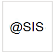

# Proveedores de servicios de seguridad administrados compatibles

**Se aplica a:**
- [Microsoft Defender para punto de conexión](https://go.microsoft.com/fwlink/p/?linkid=2154037)
- [Microsoft 365 Defender](https://go.microsoft.com/fwlink/?linkid=2118804)

> ¿Desea experimentar Microsoft Defender para endpoint? [Regístrate para obtener una versión de prueba gratuita.](https://www.microsoft.com/microsoft-365/windows/microsoft-defender-atp?ocid=docs-wdatp-exposedapis-abovefoldlink)

Se puede obtener acceso a los siguientes proveedores de servicios de seguridad administrados a través del portal. 

Logotipo |Nombre del partner   | Descripción 
:---|:---|:---
|[Detección administrada de Accenture & respuesta (MDR)](https://go.microsoft.com/fwlink/?linkid=2164353) | Administrar, mantener y mejorar las operaciones de ciberseguridad global con capacidades extendidas que detectan, buscan proactivamente y responden a ataques cibernéticos avanzados en entornos de TI y OT ubicados en la nube y local.
 | [Servicio MDE administrado de Aujas](https://go.microsoft.com/fwlink/?linkid=2162429) | La ciberseguridad de Aujas proporciona servicios de seguridad administrados 24*7 en todo el espectro empresarial, con Microsoft Defender para puntos de conexión a través de sus Centros de ciberdefensa.
| [BDO Digital](https://go.microsoft.com/fwlink/?linkid=2090394) | La Defensa administrada de BDO Digital usa herramientas de procedimientos recomendados, inteligencia artificial y expertos en seguridad locales para la protección de identidades 24/7/365
| [BlueVoyant](https://go.microsoft.com/fwlink/?linkid=2121401) | MDR para Microsoft Defender para endpoint proporciona soporte técnico para supervisar, investigar y mitigar ataques avanzados en puntos de conexión
| [Centro de seguridad en la nube](https://go.microsoft.com/fwlink/?linkid=2099315) | El Centro de seguridad en la nube de InSpark es un servicio administrado 24 x 7 que ofrece protección, detección & capacidades de respuesta
| [SOC en la nube](https://go.microsoft.com/fwlink/?linkid=2104265) | Soc en la nube proporciona servicios de supervisión de seguridad 24/7 basados en la nube de Microsoft y le ayuda a mejorar continuamente su posición de seguridad
| [Respuesta de detección administrada & CSIS](https://go.microsoft.com/fwlink/?linkid=2091005) | Supervisión y análisis 24/7 de alertas de seguridad que proporcionan a las empresas información útil sobre qué, cuándo y cómo se han producido incidentes de seguridad
 |[CyberProof Managed Detection & Response (MDR)](https://go.microsoft.com/fwlink/?linkid=2163964) | Servicios de detección de amenazas administradas y respuesta 24 x 7 totalmente integrados con Azure Sentinel y Defender para endpoint.
| [Protección contra amenazas avanzada de Dell Technologies](https://go.microsoft.com/fwlink/?linkid=2091004) | Professional de supervisión de comportamiento malintencionado y anomalías con funcionalidad 24/7
| [Respuesta y detección de amenazas de extremo administrado por DXC](https://go.microsoft.com/fwlink/?linkid=2090395) | Identificar las amenazas de puntos de conexión que evaden las defensas de seguridad tradicionales y las contienen en horas o minutos, no en días
 | [Respuesta y detección administrada de eSentire](https://go.microsoft.com/fwlink/?linkid=2154970) | 24x7 threat investigations and response via Microsoft Defender for Endpoint.
| [Expulsar la detección administrada y la respuesta para el punto de conexión de Microsoft Defender](https://go.microsoft.com/fwlink/?linkid=2162430) | Expulsar ayuda a su seguridad a mantenerse al día al detectar riesgos de seguridad en el punto de conexión de Microsoft Defender.
 | [Mandiant Managed Defense (MDR) for Microsoft Defender for Endpoint](https://go.microsoft.com/fwlink/?linkid=2164352) | Formen a su Defender for Endpoint con la inteligencia de MDR de línea frontal 24/7 y la experiencia de Mandiant.
| [Seguridad de NTT](https://go.microsoft.com/fwlink/?linkid=2095320) | El servicio de EDR de NTT proporciona una respuesta de supervisión de seguridad 24/7 & en el punto de conexión y la red
 | [Onevinn MDR](https://go.microsoft.com/fwlink/?linkid=2155203)| Detección administrada y respuesta 24/7 integradas en Microsoft Defender y Azure Sentinel, enriquecidas con la inteligencia de amenazas de Onevinn.
 | [Quorum Cyber](https://go.microsoft.com/fwlink/?linkid=2155202)| Un servicio de ingeniería de seguridad & de búsqueda de amenazas de última generación.
| [Canario rojo](https://go.microsoft.com/fwlink/?linkid=2103852) | Red Canary es un partner de operaciones de seguridad para equipos modernos, MDR implementado en minutos
| [Detección administrada de SecureWorks y respuesta con tecnología de capa roja](https://go.microsoft.com/fwlink/?linkid=2133634) | Secureworks combina inteligencia de amenazas y más de 20 años de experiencia en SaaS y soluciones de seguridad administrada
| [sepagoSOC](https://go.microsoft.com/fwlink/?linkid=2090491) | Garantizar la seguridad holística a través de flujos de trabajo automatizados sofisticados en su entorno de confianza cero
| [Trustwave Threat Detection & Response Services](https://go.microsoft.com/fwlink/?linkid=2127542) | Servicios de detección y respuesta de amenazas para Azure mediante integraciones con Sentinel y Defender para endpoint
| [Servicios de seguridad administrados de White Shark](https://go.microsoft.com/fwlink/?linkid=2154210) |Verdadero enfoque de experto en ciberseguridad con precios transparentes en todas las plataformas, móviles incluidos.
| [SOC en la nube de Wortell](https://go.microsoft.com/fwlink/?linkid=2108415) | 24x7 managed Defender for Endpoint service for monitoring & response
| [Plataforma de análisis de confianza cero (ZTAP)](https://go.microsoft.com/fwlink/?linkid=2090971) | Reducir las alertas en un 99 % y tener acceso a una amplia gama de funcionalidades de seguridad desde dispositivos móviles

## Temas relacionados
- [Configurar la integración del proveedor de seguridad de servicio administrado](configure-mssp-support.md)