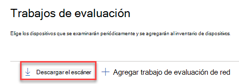
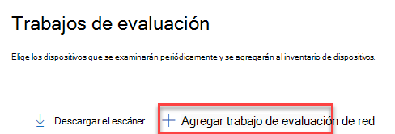
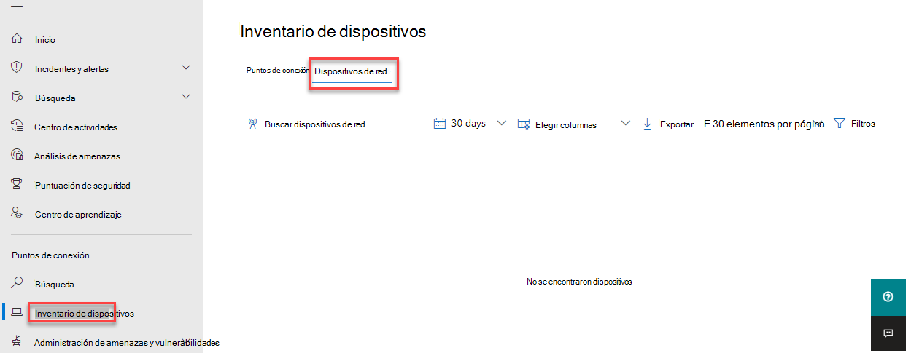

# Administración de vulnerabilidades y detección de dispositivos de redNetwork device discovery and vulnerability management

[!INCLUDE [Microsoft 365 Defender rebranding](../../includes/microsoft-defender.md)]

**Se aplica a:****Applies to:**

- [Microsoft Defender para punto de conexiónMicrosoft Defender for Endpoint](https://go.microsoft.com/fwlink/?linkid=2154037)
- [Administración de amenazas y vulnerabilidadesThreat and vulnerability management](next-gen-threat-and-vuln-mgt.md)
- [Microsoft 365 DefenderMicrosoft 365 Defender](https://go.microsoft.com/fwlink/?linkid=2118804)

> [!IMPORTANT]
> **El examen y la administración de dispositivos de red se encuentra actualmente en versión preliminar pública****Scanning and managing network devices is currently in public preview** 
> Esta versión preliminar se proporciona sin un contrato de nivel de servicio y no se recomienda para cargas de trabajo de producción.This preview version is provided without a service level agreement, and it's not recommended for production workloads. Es posible que algunas características no sean compatibles o que tengan capacidades limitadas.Certain features might not be supported or might have constrained capabilities.
> Para obtener más información, vea Características de vista previa [de Microsoft Defender para endpoint](preview.md).For more information, see [Microsoft Defender for Endpoint preview features](preview.md).

>¿Desea experimentar Microsoft Defender para endpoint?Want to experience Microsoft Defender for Endpoint? [Regístrate para obtener una versión de prueba gratuita.Sign up for a free trial.](https://www.microsoft.com/microsoft-365/windows/microsoft-defender-atp?ocid=docs-wdatp-portaloverview-abovefoldlink)

Las funcionalidades de detección de red están disponibles en la sección **Inventario** de dispositivos del Centro de seguridad de Microsoft 365 y las consolas del Centro de seguridad de Microsoft Defender.Network discovery capabilities are available in the **Device inventory** section of the Microsoft 365 security center and Microsoft Defender Security Center consoles.  

Se usará un dispositivo designado de Microsoft Defender para endpoint en cada segmento de red para realizar exámenes periódicos autenticados de dispositivos de red preconfigurados.A designated Microsoft Defender for Endpoint device will be used on each network segment to perform periodic authenticated scans of preconfigured network devices. Una vez descubierto, las capacidades de administración de amenazas y vulnerabilidades de Defender for Endpoint proporcionan flujos de trabajo integrados para proteger los conmutadores detectados, enrutadores, controladores WLAN, firewalls y puertas de enlace VPN.Once discovered, Defender for Endpoint’s threat and vulnerability management capabilities provide integrated workflows to secure discovered switches, routers, WLAN controllers, firewalls, and VPN gateways.  

Una vez que se descubran y clasifiquen los dispositivos de red, los administradores de seguridad podrán recibir las recomendaciones de seguridad más recientes y revisar las vulnerabilidades detectadas recientemente para los dispositivos de red implementados en sus organizaciones.Once the network devices are discovered and classified, security administrators will be able to receive the latest security recommendations and review recently discovered vulnerabilities foron network devices deployed across their organizations.

## EnfoqueApproach

Los dispositivos de red no se administran como puntos de conexión estándar, ya que Defender for Endpoint no tiene un sensor integrado en los propios dispositivos de red.Network devices are not managed as standard endpoints since Defender for Endpoint doesn’t have a sensor built into the network devices themselves. Estos tipos de dispositivos requieren un enfoque sin agente donde un examen remoto obtendrá la información necesaria de los dispositivos.These types of devices require an agentless approach where a remote scan will obtain the necessary information from the devices. Según la topología y las características de red, un solo dispositivo o algunos dispositivos incorporados a Microsoft Defender para Endpoint realizarán exámenes autenticados de dispositivos de red mediante SNMP (solo lectura).Depending on the network topology and characteristics, a single device or a few devices onboarded to Microsoft Defender for Endpoint will perform authenticated scans of network devices using SNMP (read-only).

Habrá dos tipos de dispositivos a tener en cuenta:There will be two types of devices to keep in mind:

- **Dispositivo de evaluación:** un dispositivo que ya está incorporado y que usarás para examinar los dispositivos de red.**Assessment device**: A device that's already onboarded that you'll use to scan the network devices.
- **Dispositivos de** red: los dispositivos de red que tiene previsto examinar e incorporar.**Network devices**: The network devices you plan to scan and onboard.

### Administración de vulnerabilidades para dispositivos de redVulnerability management for network devices 

Una vez detectados y clasificados los dispositivos de red, los administradores de seguridad podrán recibir las recomendaciones de seguridad más recientes y revisar las vulnerabilidades detectadas recientemente en los dispositivos de red implementados en sus organizaciones.Once the network devices are discovered and classified, security administrators will be able to receive the latest security recommendations and review recently discovered vulnerabilities on network devices deployed across their organizations.  

## Sistemas operativos compatiblesOperating systems that are supported

Actualmente se admiten los siguientes sistemas operativos:The following operating systems are currently supported:

- Cisco IOS, IOS-XE, NX-OSCisco IOS, IOS-XE, NX-OS
- Juniper JUNOSJuniper JUNOS
- HPE ArubaOS, Software de conmutador procurveHPE ArubaOS, Procurve Switch Software
- Palo Alto Networks PAN-OSPalo Alto Networks PAN-OS

Se agregarán más proveedores de redes y sos con el tiempo, en función de los datos recopilados por el uso del cliente.More networking vendors and OS will be added over time, based on data gathered from customer usage. Por lo tanto, se recomienda configurar todos los dispositivos de red, incluso si no están especificados en esta lista.Therefore, you are encouraged to configure all your network devices, even if they’re not specified in this list.

## Como empezarHow to get started

El primer paso es seleccionar un dispositivo que realizará los exámenes de red autenticados.Your first step is to select a device that will perform the authenticated network scans.

1. Decide un dispositivo integrado de Defender for Endpoint (cliente o servidor) que tenga una conexión de red al puerto de administración de los dispositivos de red que planeas examinar.Decide on a Defender for Endpoint onboarded device (client or server) that has a network connection to the management port for the network devices you plan on scanning. 

2. Se debe permitir el tráfico SNMP entre el dispositivo de evaluación de Defender para endpoints y los dispositivos de red de destino (por ejemplo, mediante el Firewall).SNMP traffic between the Defender for Endpoint assessment device and the targeted network devices must be allowed (for example, by the Firewall).

3. Decida qué dispositivos de red se evaluarán para las vulnerabilidades (por ejemplo: un conmutador cisco o un firewall de Palo Alto Networks).Decide which network devices will be assessed for vulnerabilities (for example: a Cisco switch or a Palo Alto Networks firewall).  

4. Asegúrese de que SNMP de solo lectura está habilitado en todos los dispositivos de red configurados para permitir que el dispositivo de evaluación de Defender for Endpoint consulte los dispositivos de red configurados.Make sure SNMP read-only is enabled on all configured network devices to allow the Defender for Endpoint assessment device to query the configured network devices. La "escritura SNMP" no es necesaria para la funcionalidad adecuada de esta característica.‘SNMP write’ isn't needed for the proper functionality of this feature.

5. Obtener las direcciones IP de los dispositivos de red que se van a examinar (o las subredes donde se implementan estos dispositivos).Obtain the IP addresses of the network devices to be scanned (or the subnets where these devices are deployed).

6. Obtenga las credenciales SNMP de los dispositivos de red (por ejemplo: Community String, noAuthNoPriv, authNoPriv, authPriv).Obtain the SNMP credentials of the network devices (for example: Community String, noAuthNoPriv, authNoPriv, authPriv). Tendrás que proporcionar las credenciales al configurar un nuevo trabajo de evaluación.You’ll be required to provide the credentials when configuring a new assessment job.  

7. Configuración del cliente proxy: no se requiere ninguna configuración adicional que no sea los requisitos de proxy de dispositivo defender para extremo.Proxy client configuration: No extra configuration is required other than the Defender for Endpoint device proxy requirements.

8. Para permitir que el escáner de red se autentique y funcione correctamente, es esencial que agregue los siguientes dominios o direcciones URL:To allow the network scanner to be authenticated and work properly, it's essential that you add the following domains/URLs:

    - login.windows.netlogin.windows.net  
    - \*.securitycenter.windows.com\*.securitycenter.windows.com
    - login.microsoftonline.comlogin.microsoftonline.com
    - *.blob.core.windows.net/networkscannerstable/**.blob.core.windows.net/networkscannerstable/*

    Nota: Estas direcciones URL no se especifican en la lista documentada defender para endpoint de la colección de datos permitida.Note: These URLs are not specified in the Defender for Endpoint documented list of allowed data collection.

## PermisosPermissions

Para configurar trabajos de evaluación, se requiere la siguiente opción de permiso de usuario: **Administrar la configuración de seguridad en el Centro de seguridad**.To configure assessment jobs, the following user permission option is required: **Manage security settings in Security Center**. Para encontrar el permiso, vaya a **Roles**  >  **de configuración**.You can find the permission by going to **Settings** > **Roles**. Para obtener más información, vea [Create and manage roles for role-based access control](user-roles.md)For more information, see [Create and manage roles for role-based access control](user-roles.md)

## Instalar el escáner de redInstall the network scanner

1. Vaya a Trabajos de evaluación de puntos de conexión de configuración de seguridad de **Microsoft 365**  >    >    >   (en "Evaluaciones de red").Go to **Microsoft 365 security** > **Settings** > **Endpoints** > **Assessment jobs** (under 'Network assessments').
    1. En el Centro de seguridad de Microsoft Defender, vaya a Configuración y > de evaluación.In the Microsoft Defender Security Center, go to Settings > Assessment jobs page.

2. Descargue el escáner de red e instállo en el dispositivo de evaluación de Defender para endpoint designado.Download the network scanner and install it on the designated Defender for Endpoint assessment device.

## Instalación del escáner de red & registroNetwork scanner installation & registration

El proceso de inicio de sesión se puede completar en el propio dispositivo de evaluación designado o en cualquier otro dispositivo (por ejemplo, el dispositivo cliente personal).The signing-in process can be completed on the designated assessment device itself or any other device (for example, your personal client device).

Para completar el proceso de registro del escáner de red:To complete the network scanner registration process:

1. Copie y siga la dirección URL que aparece en la línea de comandos y use el código de instalación proporcionado para completar el proceso de registro.Copy and follow the URL that appears on the command line and use the provided installation code to complete the registration process.
    - Nota: Es posible que deba cambiar la configuración del símbolo del sistema para poder copiar la dirección URL.Note: You may need to change Command Prompt settings to be able to copy the URL.

2. Escriba el código e inicie sesión con una cuenta de Microsoft que tenga el permiso Defender for Endpoint denominado "Administrar la configuración de seguridad en el Centro de seguridad".Enter the code and sign in using a Microsoft account that has the Defender for Endpoint permission called "Manage security settings in Security Center."

3. Cuando haya terminado, debería ver un mensaje que confirme que ha iniciado sesión.When finished, you should see a message confirming you have signed in.

## Configurar un nuevo trabajo de evaluaciónConfigure a new assessment job  

En la página Trabajos de evaluación **de Configuración,** seleccione **Agregar trabajo de evaluación de red**.In the Assessment jobs page in **Settings**, select **Add network assessment job**. Siga el proceso de configuración para elegir los dispositivos de red que se examinarán periódicamente y se agregarán al inventario de dispositivos.Follow the set-up process to choose network devices to be scanned regularly and added to the device inventory.

Para evitar la duplicación de dispositivos en el inventario de dispositivos de red, asegúrese de que cada dirección IP esté configurada solo una vez en varios dispositivos de evaluación.To prevent device duplication in the network device inventory, make sure each IP address is configured only once across multiple assessment devices.

Adición de pasos de trabajo de evaluación de red:Adding a network assessment job steps:

1. Elige un nombre de "Trabajo de evaluación" y el "Dispositivo de evaluación" en el que se instaló el escáner de red.Choose an ‘Assessment job’ name and the ‘Assessment device’ on which the network scanner was installed. Este dispositivo realizará los exámenes periódicos autenticados.This device will perform the periodic authenticated scans. 
2. Agregue las direcciones IP de los dispositivos de red de destino que se van a examinar (o las subredes donde se implementan estos dispositivos).Add IP addresses of target network devices to be scanned (or the subnets where these devices are deployed). 
3. Agregue las credenciales SNMP necesarias de los dispositivos de red de destino.Add required SNMP credentials of the target network devices. 
4. Guarde el trabajo de evaluación de red recién configurado para iniciar el examen periódico de red.Save the newly configured network assessment job to start the periodic network scan. 

### Examinar y agregar dispositivos de redScan and add network devices

Durante el proceso de configuración, puede realizar un examen de prueba de una sola vez para comprobar que:During the set-up process, you can perform a one time test scan to verify that:

- Hay conectividad entre el dispositivo de evaluación de Defender para endpoints y los dispositivos de red de destino configurados.There is connectivity between the Defender for Endpoint assessment device and the configured target network devices.
- Las credenciales SNMP configuradas son correctas.The configured SNMP credentials are correct.

Cada dispositivo de evaluación puede admitir hasta 1.500 direcciones IP correctas.Each assessment device can support up to 1,500 successful IP addresses scan. Por ejemplo, si analiza 10 subredes diferentes donde solo 100 direcciones IP devuelven resultados correctos, podrá examinar 1.400 direcciones IP adicionales de otras subredes en el mismo dispositivo de evaluación.For example, if you scan 10 different subnets where only 100 IP addresses return successful results, you will be able to scan 1,400 IP additional addresses from other subnets on the same assessment device.  

Si hay varios intervalos de direcciones IP/subredes que examinar, los resultados del examen de prueba tardarán varios minutos en aparecer.If there are multiple IP address ranges/subnets to scan, the test scan results will take several minutes to show up. Un examen de prueba estará disponible para hasta 1.024 direcciones.A test scan will be available for up to 1,024 addresses.

Una vez que se muestren los resultados, puedes elegir qué dispositivos se incluirán en el examen periódico.Once the results show up, you can choose which devices will be included in the periodic scan. Si omites ver los resultados del examen, todas las direcciones IP configuradas se agregarán al trabajo de evaluación de red (independientemente de la respuesta del dispositivo).If you skip viewing the scan results, all configured IP addresses will be added to the network assessment job (regardless of the device’s response). Los resultados del examen también se pueden exportar.The scan results can also be exported.

## Inventario de dispositivosDevice inventory

Los dispositivos recién detectados se mostrarán en la nueva **pestaña Dispositivos de** red en la **página Inventario de** dispositivos.Newly discovered devices will be shown under the new **Network devices** tab in the **Device inventory** page. Puede tardar hasta dos horas después de agregar un trabajo de evaluación hasta que los dispositivos se actualicen.It may take up to two hours after adding an assessment job until the devices are updated.

## Solución de problemasTroubleshooting

### Error en la instalación del escáner de redNetwork scanner installation has failed

Compruebe que las direcciones URL necesarias se agregan a los dominios permitidos en la configuración del firewall.Verify that the required URLs are added to the allowed domains in your firewall settings. Además, asegúrate de que las opciones de proxy estén configuradas como se describe en Configurar el proxy de dispositivo y [la configuración de conectividad a Internet](configure-proxy-internet.md)Also, make sure proxy settings are configured as described in [Configure device proxy and Internet connectivity settings](configure-proxy-internet.md)

### La Microsoft.com/devicelogin web no se hizoThe Microsoft.com/devicelogin web page did not show up

Compruebe que las direcciones URL necesarias se agregan a los dominios permitidos en el firewall.Verify that the required URLs are added to the allowed domains in your firewall. Además, asegúrate de que las opciones de proxy estén configuradas como se describe en [Configure device proxy and Internet connectivity settings](configure-proxy-internet.md).Also, make sure proxy settings are configured as described in [Configure device proxy and Internet connectivity settings](configure-proxy-internet.md).

### Los dispositivos de red no se muestran en el inventario de dispositivos después de varias horasNetwork devices are not shown in the device inventory after several hours

Los resultados del examen deben actualizarse unas horas después del examen inicial que se realizó después de completar la configuración del trabajo de evaluación.The scan results should be updated a few hours after the initial scan that took place after completing the assessment job configuration.

Si aún no se muestran dispositivos, compruebe que el servicio 'MdatpNetworkScanService' se está ejecutando en los dispositivos de evaluación, en los que instaló el escáner de red, y realice un "Examen de ejecución" en la configuración del trabajo de evaluación correspondiente.If devices are still not shown, verify that the service ‘MdatpNetworkScanService’ is running on your assessment devices, on which you installed the network scanner, and perform a “Run scan” in the relevant assessment job configuration.  

Si aún no obtiene resultados después de 5 minutos, reinicie el servicio.If you still don’t get results after 5 minutes, restart the service.  

### El tiempo de vista por última vez de los dispositivos es de más de 24 horasDevices last seen time is longer than 24 hours

Valide que el escáner se está ejecutando correctamente.Validate that the scanner is running properly. A continuación, vaya a la definición de examen y seleccione "Ejecutar prueba".Then go to the scan definition and select “Run test.” Compruebe qué mensajes de error devuelven de las direcciones IP relevantes.Check what error messages are returning from the relevant IP addresses.

### Permiso de usuario de administración de vulnerabilidades y amenazas requeridoRequired threat and vulnerability management user permission

El registro finalizó con un error: "Parece que no tiene permisos suficientes para agregar un nuevo agente.Registration finished with an error: "It looks like you don't have sufficient permissions for adding a new agent. El permiso requerido es "Administrar la configuración de seguridad en el Centro de seguridad".The required permission is 'Manage security settings in Security Center'."

Presione cualquier tecla para salir.Press any key to exit.

Pida al administrador del sistema que le asigne los permisos necesarios.Ask your system administrator to assign you the required permissions. Como alternativa, pida a otro miembro relevante que le ayude con el proceso de inicio de sesión proporcionando el código de inicio de sesión y el vínculo.Alternately, ask another relevant member to help you with the sign-in process by providing them with the sign-in code and link.

### Error en el proceso de registro mediante el vínculo proporcionado en la línea de comandos en el proceso de registroRegistration process fails using provided link in the command line in registration process

Pruebe con otro explorador o copie el vínculo de inicio de sesión y el código en un dispositivo diferente.Try a different browser or copy the sign-in link and code to a different device.

### Texto demasiado pequeño o no puede copiar texto de la línea de comandosText too small or can’t copy text from command line

Cambia la configuración de la línea de comandos en el dispositivo para permitir la copia y el tamaño del texto.Change command-line settings on your device to allow copying and change text size.

## Artículos relacionadosRelated articles

- [Inventario de dispositivosDevice inventory](machines-view-overview.md)
- [Configurar funciones avanzadasConfigure advanced features](advanced-features.md)
